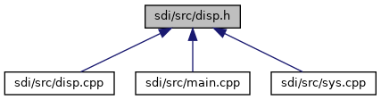

[Macros](#define-members) \| [Functions](#func-members)

This graph shows which files directly or indirectly include this file:

<a href="disp_8h_source.md">Go to the source code of this file.</a>

|  |  |
|----|----|
| Macros |  |
| #define  | [CLA_DISP](#acff3a92ec7593f6a7ae508c713dae4ad)   0x24 |
|   | Class for Display commands. [More\...](#acff3a92ec7593f6a7ae508c713dae4ad)  |
| #define  | [INS_DISP_ENABLE](#a5552414283ec42b02579d24b331f3e3b)   0x00 |
|   | Enable or Disable Display. [More\...](#a5552414283ec42b02579d24b331f3e3b)  |
| #define  | [INS_DISP_TEXT](#aa9a89489e3262eb3c0d45b1cfd230fad)   0x01 |
|   | Display Text. [More\...](#aa9a89489e3262eb3c0d45b1cfd230fad)  |
| #define  | [INS_DISP_TEXT_CONF](#af6ec23d1b19d567757bb25e060bdc915)   0x02 |
|   | Display Text with Confirmation. [More\...](#af6ec23d1b19d567757bb25e060bdc915)  |
| #define  | [INS_DISP_HANDLE_DISPLAY](#ad33bee6feeb7fed40f7c8f84412cf1ae)   0x03 |
|   | Handle Display. [More\...](#ad33bee6feeb7fed40f7c8f84412cf1ae)  |
| #define  | [INS_DISP_HANDLE_SECURE_INPUT](#a4cd1a7644e8e7eb84b8eca49bdb3387b)   0x04 |
|   | Handle Secure Input. [More\...](#a4cd1a7644e8e7eb84b8eca49bdb3387b)  |
| #define  | [INS_DISP_HANDLE_MENU](#af2d333e085e5fa42c68aba7aebe2e014)   0x05 |
|   | Handle Menu. [More\...](#af2d333e085e5fa42c68aba7aebe2e014)  |
| #define  | [INS_DISP_HANDLE_CARD_REQUEST](#abf6d3a2d716eba006c1010658bfe14f0)   0x06 |
|   | Handle Card Request Display. [More\...](#abf6d3a2d716eba006c1010658bfe14f0)  |
| #define  | [INS_DISP_IDLE_SCREEN](#a0c231519b00109d232d336c1b40bdac7)   0x07 |
|   | Display Idle Screen. [More\...](#a0c231519b00109d232d336c1b40bdac7)  |
| #define  | [INS_DISP_HANDLE_SIGNATURE_CAPTURE](#ac30e4e18714cfed1393b681397a3895d)   0x08 |
|   | Display Idle Screen. [More\...](#ac30e4e18714cfed1393b681397a3895d)  |
| #define  | [INS_DISP_ACTIVATE_LEDS](#a48112e525a1ddf4895d83b4ce63c780f)   0x09 |
|   | Activation of LEDs. [More\...](#a48112e525a1ddf4895d83b4ce63c780f)  |
| #define  | [INS_DISP_HANDLE_HTML_DIALOG](#a77230f3169974e5d8b055378e99e80f1)   0x0A |
|   | Handle a customer specific HTML dialog. [More\...](#a77230f3169974e5d8b055378e99e80f1)  |
| #define  | [INS_DISP_GET_ASYNC_RESULT](#a4b617aeca4cdae3be87f6490516039ff)   0x0B |
|   | Return result of the last asynchronous external dialog (24-03) [More\...](#a4b617aeca4cdae3be87f6490516039ff)  |

|  |  |
|----|----|
| Functions |  |
| void  | [handleDispCmd](#a5b3e410eb3656aac2880328377cd7eec) (unsigned short msgBufSize, unsigned char \*msg, unsigned long msgSize, unsigned short rspBufSize, unsigned char \*rsp, unsigned short \*rspSize) |

## MacroDefinition Documentation {#macro-definition-documentation}

## CLA_DISP 

#define CLA_DISP   0x24

Class for Display commands.

## INS_DISP_ACTIVATE_LEDS 

#define INS_DISP_ACTIVATE_LEDS   0x09

Activation of LEDs.

## INS_DISP_ENABLE 

#define INS_DISP_ENABLE   0x00

Enable or Disable Display.

## INS_DISP_GET_ASYNC_RESULT 

#define INS_DISP_GET_ASYNC_RESULT   0x0B

Return result of the last asynchronous external dialog (24-03)

## INS_DISP_HANDLE_CARD_REQUEST 

#define INS_DISP_HANDLE_CARD_REQUEST   0x06

Handle Card Request Display.

## INS_DISP_HANDLE_DISPLAY 

#define INS_DISP_HANDLE_DISPLAY   0x03

Handle Display.

## INS_DISP_HANDLE_HTML_DIALOG 

#define INS_DISP_HANDLE_HTML_DIALOG   0x0A

Handle a customer specific HTML dialog.

## INS_DISP_HANDLE_MENU 

#define INS_DISP_HANDLE_MENU   0x05

Handle Menu.

## INS_DISP_HANDLE_SECURE_INPUT 

#define INS_DISP_HANDLE_SECURE_INPUT   0x04

Handle Secure Input.

## INS_DISP_HANDLE_SIGNATURE_CAPTURE 

#define INS_DISP_HANDLE_SIGNATURE_CAPTURE   0x08

Display Idle Screen.

## INS_DISP_IDLE_SCREEN 

#define INS_DISP_IDLE_SCREEN   0x07

Display Idle Screen.

## INS_DISP_TEXT 

#define INS_DISP_TEXT   0x01

Display Text.

## INS_DISP_TEXT_CONF 

#define INS_DISP_TEXT_CONF   0x02

Display Text with Confirmation.

## FunctionDocumentation {#function-documentation}

## handleDispCmd() 

void handleDispCmd

Dispatch function to handle different Display commands

**Parameters**

\[in\] **msgBufSize** size of the input message buffer \[in\] **msg** pointer to the input message buffer \[in\] **msgSize** size of the input message \[in\] **rspBufSize** maximum size of the response buffer \[in,out\] **rsp** pointer to the response buffer \[in,out\] **rspSize** pointer to the response message size
