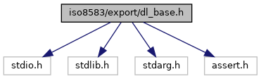
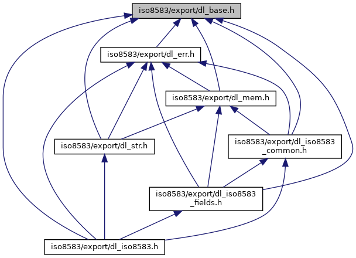

[Macros](#define-members) \| [Typedefs](#typedef-members)

`#include <stdio.h>`
`#include <stdlib.h>`
`#include <stdarg.h>`
`#include <assert.h>`

Include dependency graph for dl_base.h:



This graph shows which files directly or indirectly include this file:



<a href="dl__base_8h_source.md">Go to the source code of this file.</a>

|  |  |
|----|----|
| Macros |  |
| #define  | [DL_UNIX](#a1ea88a7762787692f15f90d94fd1507b) |
| #define  | [DL_SIZE_OF_UINT8](#abc10ba8d402c49c786e8b2890b54dda9)   3 /\* 0..255 \*/ |
| #define  | [DL_SIZE_OF_SINT8](#a0b3d243c53fb2efdf4660b6d7f9394e2)   4 /\* -127..128 \*/ |
| #define  | [DL_SIZE_OF_UINT16](#a3ad64089165b8dd4cbacb4d42cea249f)   5 /\* 0-65535 \*/ |
| #define  | [DL_SIZE_OF_SINT16](#a45e4552d7d5725018a0d8eb34f41e29a)   6 |
| #define  | [DL_SIZE_OF_UINT24](#a5dc6e014724b019aab2d815f813ad5c5)   8 |
| #define  | [DL_SIZE_OF_UINT32](#a28d0d2c755319e1102b3c8ed306b9c27)   10 |
| #define  | [DL_SIZE_OF_SINT32](#a29122e8c68021e5cddc2f423a97f03bd)   11 |
| #define  | [DL_MAX_UINT8](#aeade2352ff531bfd0848eaafd3845345)   0xff |
| #define  | [DL_MAX_UINT16](#addee5c4c3390ff61f6a2ba443eb6b01d)   0xffff |
| #define  | [DL_MAX_UINT24](#a6ed828aac6968ec7ec28c2057e81fe30)   0xffffffL |
| #define  | [DL_MAX_UINT32](#a22b660a732f5cfac16e158a368de6fe7)   0xffffffffL |
| #define  | [kDL_ASCII_NULL](#a0adbd29d2ddb26d74f6db3af3593a0c8)   0x00 |
| #define  | [kDL_ASCII_HT](#a5917ab482a0952f286f1f8d8e23b3b95)   0x09 |
| #define  | [kDL_ASCII_LF](#aab45cc79ab6aa47185f9ea37464d0ad7)   0x0A |
| #define  | [kDL_ASCII_CR](#ae2cc5e0274ba8d38efd250f3b65e2a7a)   0x0D |
| #define  | [kDL_ASCII_SP](#af1e6cf69a2d7307727f9bbd5061e125e)   0x20 |
| #define  | [kDL_ASCII_QUOTE](#a22fd8cecae281bd142f237d68cfaa61c)   0x22 |
| #define  | [kDL_ASCII_APOSTROPHE](#aa97126d7b1a9dd7baba1b543a045a8a7)   0x27 |
| #define  | [kDL_ASCII_FORWARDSLASH](#ae38b5cd4add86a43c1c8064deeececd6)   0x2F |
| #define  | [kDL_ASCII_BACKSLASH](#a0bbdfedff83d9a128e3aae158508ec67)   0x5C |
| #define  | [DL_BIT_TEST](#ac0d0a93c694672c78d00d74447a21b3c)(<a href="_web_service_wrappers_8c.md#a6e248376c0290338633d8137822eb209">value</a>, bit)   (((([DL_UINT32](#a2b6bafb1286aa226f7f001cb7fd68c66))(<a href="_web_service_wrappers_8c.md#a6e248376c0290338633d8137822eb209">value</a>)) & (([DL_UINT32](#a2b6bafb1286aa226f7f001cb7fd68c66))1 \<\< (bit))) ? 1 : 0) |
| #define  | [DL_BIT_SET](#a9c34a51a4ddd66c6d9e105ad565d44c7)(<a href="_web_service_wrappers_8c.md#a6e248376c0290338633d8137822eb209">value</a>, bit)   ((([DL_UINT32](#a2b6bafb1286aa226f7f001cb7fd68c66))(<a href="_web_service_wrappers_8c.md#a6e248376c0290338633d8137822eb209">value</a>)) \|= (([DL_UINT32](#a2b6bafb1286aa226f7f001cb7fd68c66))1 \<\< (bit))) |
| #define  | [DL_BIT_CLEAR](#a12045ae00890f22649af62f349c79890)(<a href="_web_service_wrappers_8c.md#a6e248376c0290338633d8137822eb209">value</a>, bit)   ((([DL_UINT32](#a2b6bafb1286aa226f7f001cb7fd68c66))(<a href="_web_service_wrappers_8c.md#a6e248376c0290338633d8137822eb209">value</a>)) &= \~(([DL_UINT32](#a2b6bafb1286aa226f7f001cb7fd68c66))1 \<\< (bit))) |
| #define  | [DL_BYTES_TO_UINT16](#af2a5e9668996a8083f7d3c7752832367)(byteArr) |
| #define  | [DL_BYTES_TO_UINT24](#a95b0e248f35c8fa51b93075cba16c60e)(byteArr) |
| #define  | [DL_BYTES_TO_UINT32](#a6db3a9d598209aea444f4bd760ce743a)(byteArr) |
| #define  | [DL_UINT16_TO_BYTES](#ac176f737c97ed277e55fadcb45d03378)(iVal, oArr) |
| #define  | [DL_UINT24_TO_BYTES](#ad65da73e741c742582e27aca56c70895)(iVal, oArr) |
| #define  | [DL_UINT32_TO_BYTES](#a56a2fa26b24c2dd6ed977cc08523d614)(iVal, oArr) |
| #define  | [DL_ASCHEX_2_NIBBLE](#a69fcb8ac9cd7d49df52686db862f15ef)(aschex)   ( ((aschex)\>=\'a\') ? (((aschex)-\'a\')%6)+10 : (((aschex)\>=\'A\') ? (((aschex)-\'A\')%6)+10 : ((aschex)-\'0\') ) ) |
| #define  | [DL_NIBBLE_2_ASCHEX](#a6acd570a50f31a4f697660d05a54c5a0)(nibble)   ( ((nibble)\>9) ? (((nibble)-10)%6)+\'A\' : ((nibble)+\'0\') ) |
| #define  | [MIN](#a74e75242132eaabbc1c512488a135926)(x, y)   ((x)\<(y)?(x):(y)) |
| #define  | [MAX](#aacc3ee1a7f283f8ef65cea31f4436a95)(x, y)   ((x)\>(y)?(x):(y)) |
| #define  | [DL_UINT32_AddWithLimit](#aebf4df084d06849d3799a1eb0463777c)(initial, addition, limit) |

|  |  |
|----|----|
| Typedefs |  |
| typedef unsigned char  | [DL_UINT8](#a9d9aaccaaea86a21d606052de3f715b9) |
| typedef char  | [DL_SINT8](#a7aa4be16706eebc38e7b00abff383f3f) |
| typedef unsigned short  | [DL_UINT16](#ad253e3225fa9ea736548d20a90dbf237) |
| typedef short  | [DL_SINT16](#ad150af82f1f2288345af9793de18b544) |
| typedef unsigned long  | [DL_UINT32](#a2b6bafb1286aa226f7f001cb7fd68c66) |
| typedef long  | [DL_SINT32](#a1c4d97cc44221b0628f4418de0e3b8d6) |
| typedef [DL_SINT8](#a7aa4be16706eebc38e7b00abff383f3f)  | [DL_CHAR](#a1b15f52a2d4d90367dbcbd0fa67ca6f7) |
| typedef [DL_UINT32](#a2b6bafb1286aa226f7f001cb7fd68c66)  | [DL_UCHAR](#a414b140205cc5cf8d09a2da968766de6) |

## MacroDefinition Documentation {#macro-definition-documentation}

## DL_ASCHEX_2_NIBBLE <a href="#a69fcb8ac9cd7d49df52686db862f15ef" id="a69fcb8ac9cd7d49df52686db862f15ef"></a>

<p>#define DL_ASCHEX_2_NIBBLE</p>

## DL_BIT_CLEAR <a href="#a12045ae00890f22649af62f349c79890" id="a12045ae00890f22649af62f349c79890"></a>

<p>#define DL_BIT_CLEAR</p>

## DL_BIT_SET <a href="#a9c34a51a4ddd66c6d9e105ad565d44c7" id="a9c34a51a4ddd66c6d9e105ad565d44c7"></a>

<p>#define DL_BIT_SET</p>

## DL_BIT_TEST <a href="#ac0d0a93c694672c78d00d74447a21b3c" id="ac0d0a93c694672c78d00d74447a21b3c"></a>

<p>#define DL_BIT_TEST</p>

## DL_BYTES_TO_UINT16 <a href="#af2a5e9668996a8083f7d3c7752832367" id="af2a5e9668996a8083f7d3c7752832367"></a>

<p>#define DL_BYTES_TO_UINT16</p>

**Value:**

``` cpp
((((DL_UINT16)((byteArr)[0]) & DL_MAX_UINT8) << 8) +\
   ((DL_UINT16)((byteArr)[1]) & DL_MAX_UINT8))
```

## DL_BYTES_TO_UINT24 <a href="#a95b0e248f35c8fa51b93075cba16c60e" id="a95b0e248f35c8fa51b93075cba16c60e"></a>

<p>#define DL_BYTES_TO_UINT24</p>

**Value:**

``` cpp
((((DL_UINT32)((byteArr)[0]) & DL_MAX_UINT8) << 16) +\
  (((DL_UINT32)((byteArr)[1]) & DL_MAX_UINT8) << 8) +\
   ((DL_UINT32)((byteArr)[2]) & DL_MAX_UINT8))
```

## DL_BYTES_TO_UINT32 <a href="#a6db3a9d598209aea444f4bd760ce743a" id="a6db3a9d598209aea444f4bd760ce743a"></a>

<p>#define DL_BYTES_TO_UINT32</p>

**Value:**

``` cpp
((((DL_UINT32)((byteArr)[0]) & DL_MAX_UINT8) << 24) +\
  (((DL_UINT32)((byteArr)[1]) & DL_MAX_UINT8) << 16) +\
  (((DL_UINT32)((byteArr)[2]) & DL_MAX_UINT8) << 8) +\
   ((DL_UINT32)((byteArr)[3]) & DL_MAX_UINT8))
```

## DL_MAX_UINT16 <a href="#addee5c4c3390ff61f6a2ba443eb6b01d" id="addee5c4c3390ff61f6a2ba443eb6b01d"></a>

<p>#define DL_MAX_UINT16   0xffff</p>

## DL_MAX_UINT24 <a href="#a6ed828aac6968ec7ec28c2057e81fe30" id="a6ed828aac6968ec7ec28c2057e81fe30"></a>

<p>#define DL_MAX_UINT24   0xffffffL</p>

## DL_MAX_UINT32 <a href="#a22b660a732f5cfac16e158a368de6fe7" id="a22b660a732f5cfac16e158a368de6fe7"></a>

<p>#define DL_MAX_UINT32   0xffffffffL</p>

## DL_MAX_UINT8 <a href="#aeade2352ff531bfd0848eaafd3845345" id="aeade2352ff531bfd0848eaafd3845345"></a>

<p>#define DL_MAX_UINT8   0xff</p>

## DL_NIBBLE_2_ASCHEX <a href="#a6acd570a50f31a4f697660d05a54c5a0" id="a6acd570a50f31a4f697660d05a54c5a0"></a>

<p>#define DL_NIBBLE_2_ASCHEX</p>

## DL_SIZE_OF_SINT16 <a href="#a45e4552d7d5725018a0d8eb34f41e29a" id="a45e4552d7d5725018a0d8eb34f41e29a"></a>

<p>#define DL_SIZE_OF_SINT16   6</p>

## DL_SIZE_OF_SINT32 <a href="#a29122e8c68021e5cddc2f423a97f03bd" id="a29122e8c68021e5cddc2f423a97f03bd"></a>

<p>#define DL_SIZE_OF_SINT32   11</p>

## DL_SIZE_OF_SINT8 <a href="#a0b3d243c53fb2efdf4660b6d7f9394e2" id="a0b3d243c53fb2efdf4660b6d7f9394e2"></a>

<p>#define DL_SIZE_OF_SINT8   4 /\* -127..128 \*/</p>

## DL_SIZE_OF_UINT16 <a href="#a3ad64089165b8dd4cbacb4d42cea249f" id="a3ad64089165b8dd4cbacb4d42cea249f"></a>

<p>#define DL_SIZE_OF_UINT16   5 /\* 0-65535 \*/</p>

## DL_SIZE_OF_UINT24 <a href="#a5dc6e014724b019aab2d815f813ad5c5" id="a5dc6e014724b019aab2d815f813ad5c5"></a>

<p>#define DL_SIZE_OF_UINT24   8</p>

## DL_SIZE_OF_UINT32 <a href="#a28d0d2c755319e1102b3c8ed306b9c27" id="a28d0d2c755319e1102b3c8ed306b9c27"></a>

<p>#define DL_SIZE_OF_UINT32   10</p>

## DL_SIZE_OF_UINT8 <a href="#abc10ba8d402c49c786e8b2890b54dda9" id="abc10ba8d402c49c786e8b2890b54dda9"></a>

<p>#define DL_SIZE_OF_UINT8   3 /\* 0..255 \*/</p>

## DL_UINT16_TO_BYTES <a href="#ac176f737c97ed277e55fadcb45d03378" id="ac176f737c97ed277e55fadcb45d03378"></a>

<p>#define DL_UINT16_TO_BYTES</p>

**Value:**

``` cpp
{ (oArr)[0]=((iVal) >> 8) & DL_MAX_UINT8;\
  (oArr)[1]= (iVal) & DL_MAX_UINT8; }
```

## DL_UINT24_TO_BYTES <a href="#ad65da73e741c742582e27aca56c70895" id="ad65da73e741c742582e27aca56c70895"></a>

<p>#define DL_UINT24_TO_BYTES</p>

**Value:**

``` cpp
{(oArr)[0]=((iVal) >> 16) & DL_MAX_UINT8;\
  (oArr)[1]=((iVal) >> 8) & DL_MAX_UINT8;\
  (oArr)[2]= (iVal) & DL_MAX_UINT8;};
```

## DL_UINT32_AddWithLimit <a href="#aebf4df084d06849d3799a1eb0463777c" id="aebf4df084d06849d3799a1eb0463777c"></a>

<p>#define DL_UINT32_AddWithLimit</p>

**Value:**

``` cpp
((((DL_UINT32)(initial)>=(DL_UINT32)(limit))||\
   ((DL_UINT32)(addition)>=(DL_UINT32)(limit))||\
   (((DL_UINT32)(limit)-(DL_UINT32)(initial))<(DL_UINT32)(addition)))\
   ? (DL_UINT32)limit : (DL_UINT32)(initial)+(DL_UINT32)(addition))
```

## DL_UINT32_TO_BYTES <a href="#a56a2fa26b24c2dd6ed977cc08523d614" id="a56a2fa26b24c2dd6ed977cc08523d614"></a>

<p>#define DL_UINT32_TO_BYTES</p>

**Value:**

``` cpp
{(oArr)[0]=((iVal) >> 24) & DL_MAX_UINT8;\
  (oArr)[1]=((iVal) >> 16) & DL_MAX_UINT8;\
  (oArr)[2]=((iVal) >> 8) & DL_MAX_UINT8;\
  (oArr)[3]= (iVal) & DL_MAX_UINT8;};
```

## DL_UNIX <a href="#a1ea88a7762787692f15f90d94fd1507b" id="a1ea88a7762787692f15f90d94fd1507b"></a>

<p>#define DL_UNIX</p>

## kDL_ASCII_APOSTROPHE <a href="#aa97126d7b1a9dd7baba1b543a045a8a7" id="aa97126d7b1a9dd7baba1b543a045a8a7"></a>

<p>#define kDL_ASCII_APOSTROPHE   0x27</p>

## kDL_ASCII_BACKSLASH <a href="#a0bbdfedff83d9a128e3aae158508ec67" id="a0bbdfedff83d9a128e3aae158508ec67"></a>

<p>#define kDL_ASCII_BACKSLASH   0x5C</p>

## kDL_ASCII_CR <a href="#ae2cc5e0274ba8d38efd250f3b65e2a7a" id="ae2cc5e0274ba8d38efd250f3b65e2a7a"></a>

<p>#define kDL_ASCII_CR   0x0D</p>

## kDL_ASCII_FORWARDSLASH <a href="#ae38b5cd4add86a43c1c8064deeececd6" id="ae38b5cd4add86a43c1c8064deeececd6"></a>

<p>#define kDL_ASCII_FORWARDSLASH   0x2F</p>

## kDL_ASCII_HT <a href="#a5917ab482a0952f286f1f8d8e23b3b95" id="a5917ab482a0952f286f1f8d8e23b3b95"></a>

<p>#define kDL_ASCII_HT   0x09</p>

## kDL_ASCII_LF <a href="#aab45cc79ab6aa47185f9ea37464d0ad7" id="aab45cc79ab6aa47185f9ea37464d0ad7"></a>

<p>#define kDL_ASCII_LF   0x0A</p>

## kDL_ASCII_NULL <a href="#a0adbd29d2ddb26d74f6db3af3593a0c8" id="a0adbd29d2ddb26d74f6db3af3593a0c8"></a>

<p>#define kDL_ASCII_NULL   0x00</p>

## kDL_ASCII_QUOTE <a href="#a22fd8cecae281bd142f237d68cfaa61c" id="a22fd8cecae281bd142f237d68cfaa61c"></a>

<p>#define kDL_ASCII_QUOTE   0x22</p>

## kDL_ASCII_SP <a href="#af1e6cf69a2d7307727f9bbd5061e125e" id="af1e6cf69a2d7307727f9bbd5061e125e"></a>

<p>#define kDL_ASCII_SP   0x20</p>

## MAX <a href="#aacc3ee1a7f283f8ef65cea31f4436a95" id="aacc3ee1a7f283f8ef65cea31f4436a95"></a>

<p>#define MAX</p>

## MIN <a href="#a74e75242132eaabbc1c512488a135926" id="a74e75242132eaabbc1c512488a135926"></a>

<p>#define MIN</p>

## TypedefDocumentation {#typedef-documentation}

## DL_CHAR <a href="#a1b15f52a2d4d90367dbcbd0fa67ca6f7" id="a1b15f52a2d4d90367dbcbd0fa67ca6f7"></a>

<p>typedef [DL_SINT8](#a7aa4be16706eebc38e7b00abff383f3f) [DL_CHAR](#a1b15f52a2d4d90367dbcbd0fa67ca6f7)</p>

## DL_SINT16 <a href="#ad150af82f1f2288345af9793de18b544" id="ad150af82f1f2288345af9793de18b544"></a>

<p>typedef short [DL_SINT16](#ad150af82f1f2288345af9793de18b544)</p>

## DL_SINT32 <a href="#a1c4d97cc44221b0628f4418de0e3b8d6" id="a1c4d97cc44221b0628f4418de0e3b8d6"></a>

<p>typedef long [DL_SINT32](#a1c4d97cc44221b0628f4418de0e3b8d6)</p>

## DL_SINT8 <a href="#a7aa4be16706eebc38e7b00abff383f3f" id="a7aa4be16706eebc38e7b00abff383f3f"></a>

<p>typedef char [DL_SINT8](#a7aa4be16706eebc38e7b00abff383f3f)</p>

## DL_UCHAR <a href="#a414b140205cc5cf8d09a2da968766de6" id="a414b140205cc5cf8d09a2da968766de6"></a>

<p>typedef [DL_UINT32](#a2b6bafb1286aa226f7f001cb7fd68c66) [DL_UCHAR](#a414b140205cc5cf8d09a2da968766de6)</p>

## DL_UINT16 <a href="#ad253e3225fa9ea736548d20a90dbf237" id="ad253e3225fa9ea736548d20a90dbf237"></a>

<p>typedef unsigned short [DL_UINT16](#ad253e3225fa9ea736548d20a90dbf237)</p>

## DL_UINT32 <a href="#a2b6bafb1286aa226f7f001cb7fd68c66" id="a2b6bafb1286aa226f7f001cb7fd68c66"></a>

<p>typedef unsigned long [DL_UINT32](#a2b6bafb1286aa226f7f001cb7fd68c66)</p>

## DL_UINT8 <a href="#a9d9aaccaaea86a21d606052de3f715b9" id="a9d9aaccaaea86a21d606052de3f715b9"></a>

<p>typedef unsigned char [DL_UINT8](#a9d9aaccaaea86a21d606052de3f715b9)</p>
