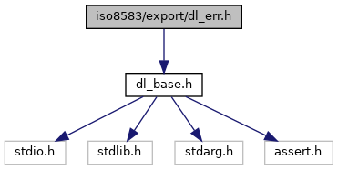
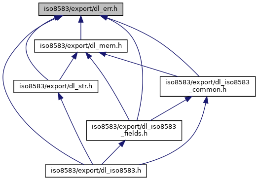

[Macros](#define-members) \| [Typedefs](#typedef-members)

`#include "`<a href="dl__base_8h_source.md">dl_base.h</a>`"`

Include dependency graph for dl_err.h:

This graph shows which files directly or indirectly include this file:

<a href="dl__err_8h_source.md">Go to the source code of this file.</a>

|  |  |
|----|----|
| Macros |  |
| #define  | [kDL_ERR_NONE](#ac72c77f87bcc40738181f85c6b8f8cbc)   ([DL_ERR](#ada368ca184bede6f4325b99208f6a97a))0 |
| #define  | [kDL_ERR_OTHER](#aad9602d63656a15775a7feb0a5e67ef0)   ([DL_ERR](#ada368ca184bede6f4325b99208f6a97a))1 |
| #define  | [kDL_ERR_NOT_IMPLEMENTED](#a1d1e45c68d5a458ae86a7e348a3dd806)   ([DL_ERR](#ada368ca184bede6f4325b99208f6a97a))2 |
| #define  | [kDL_ERR_INVALID](#a16f81f946e609f94803ced1d6ed50d7b)   ([DL_ERR](#ada368ca184bede6f4325b99208f6a97a))3 |

|  |  |
|----|----|
| Typedefs |  |
| typedef <a href="dl__base_8h.md#a2b6bafb1286aa226f7f001cb7fd68c66">DL_UINT32</a>  | [DL_ERR](#ada368ca184bede6f4325b99208f6a97a) |

## MacroDefinition Documentation {#macro-definition-documentation}

## kDL_ERR_INVALID 

#define kDL_ERR_INVALID   ([DL_ERR](#ada368ca184bede6f4325b99208f6a97a))3

## kDL_ERR_NONE 

#define kDL_ERR_NONE   ([DL_ERR](#ada368ca184bede6f4325b99208f6a97a))0

## kDL_ERR_NOT_IMPLEMENTED 

#define kDL_ERR_NOT_IMPLEMENTED   ([DL_ERR](#ada368ca184bede6f4325b99208f6a97a))2

## kDL_ERR_OTHER 

#define kDL_ERR_OTHER   ([DL_ERR](#ada368ca184bede6f4325b99208f6a97a))1

## TypedefDocumentation {#typedef-documentation}

## DL_ERR 

typedef <a href="dl__base_8h.md#a2b6bafb1286aa226f7f001cb7fd68c66">DL_UINT32</a> [DL_ERR](#ada368ca184bede6f4325b99208f6a97a)

