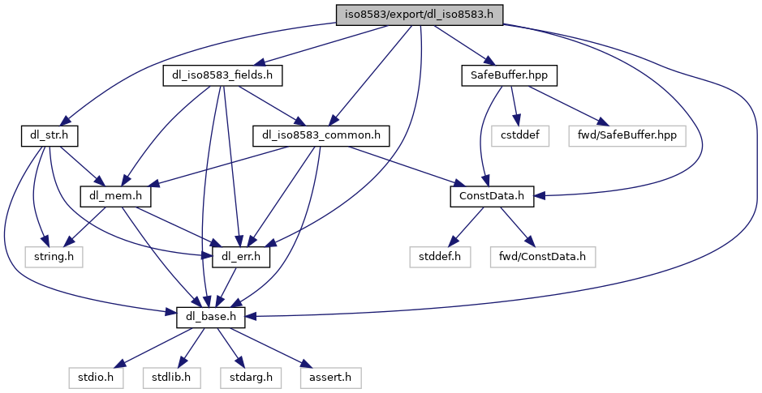

[Data Structures](#nested-classes) \| [Macros](#define-members)

`#include "`<a href="dl__base_8h_source.md">dl_base.h</a>`"`
`#include "`<a href="dl__err_8h_source.md">dl_err.h</a>`"`
`#include "`<a href="dl__str_8h_source.md">dl_str.h</a>`"`
`#include "`<a href="_const_data_8h_source.md">ConstData.h</a>`"`
`#include "`<a href="_safe_buffer_8hpp_source.md">SafeBuffer.hpp</a>`"`
`#include "`<a href="dl__iso8583__common_8h_source.md">dl_iso8583_common.h</a>`"`
`#include "`<a href="dl__iso8583__fields_8h_source.md">dl_iso8583_fields.h</a>`"`

Include dependency graph for dl_iso8583.h:

<a href="dl__iso8583_8h_source.md">Go to the source code of this file.</a>

|  |  |
|----|----|
| Data Structures |  |
| class   | <a href="class_i_s_o8583___m_s_g.md">ISO8583_MSG</a> |

|          |                                                    |
|----------|----------------------------------------------------|
| Macros   |                                                    |
| #define  | [ISO_EXP_DECL](#afd0131fdb432c83b6a30719f866ef15a) |

## MacroDefinition Documentation {#macro-definition-documentation}

## ISO_EXP_DECL 

#define ISO_EXP_DECL

