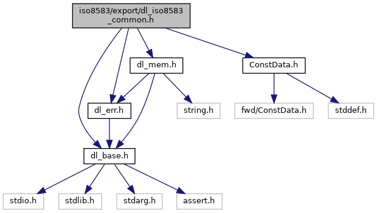
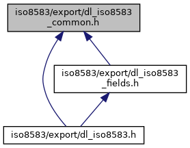
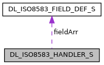
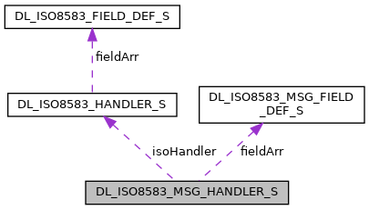
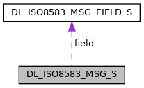

[Data Structures](#nested-classes) \| [Macros](#define-members) \| [Typedefs](#typedef-members) \| [Functions](#func-members)

`#include "`<a href="dl__base_8h_source.md">dl_base.h</a>`"`
`#include "`<a href="dl__err_8h_source.md">dl_err.h</a>`"`
`#include "`<a href="dl__mem_8h_source.md">dl_mem.h</a>`"`
`#include "`<a href="_const_data_8h_source.md">ConstData.h</a>`"`

Include dependency graph for dl_iso8583_common.h:

This graph shows which files directly or indirectly include this file:

<a href="dl__iso8583__common_8h_source.md">Go to the source code of this file.</a>

|  |  |
|----|----|
| Data Structures |  |
| struct   | [DL_ISO8583_FIELD_DEF_S](#struct_d_l___i_s_o8583___f_i_e_l_d___d_e_f___s) |
| struct   | [DL_ISO8583_HANDLER_S](#struct_d_l___i_s_o8583___h_a_n_d_l_e_r___s) |
| struct   | [DL_ISO8583_MSG_FIELD_DEF_S](#struct_d_l___i_s_o8583___m_s_g___f_i_e_l_d___d_e_f___s) |
| struct   | [DL_ISO8583_MSG_HANDLER_S](#struct_d_l___i_s_o8583___m_s_g___h_a_n_d_l_e_r___s) |
| struct   | [DL_ISO8583_MSG_FIELD_S](#struct_d_l___i_s_o8583___m_s_g___f_i_e_l_d___s) |
| struct   | [DL_ISO8583_MSG_S](#struct_d_l___i_s_o8583___m_s_g___s) |

|  |  |
|----|----|
| Macros |  |
| #define  | [ISO_EXP_DECL](#afd0131fdb432c83b6a30719f866ef15a) |
| #define  | [kDL_ISO8583_MAX_FIELD_IDX](#a9b803eb08fa69f9fba84745367f8a0b9)   128 |
| #define  | [kDL_ISO8583_FIXED](#af3f872009b7b837ce2d566419adde4b2)   0 |
| #define  | [kDL_ISO8583_LLVAR](#a54fb98b6f010a8d6d6f7106961c944bb)   2 |
| #define  | [kDL_ISO8583_LLLVAR](#ac82e73e181ba77fa4e1fd6b004623d91)   3 |
| #define  | [kDL_ISO8583_LLLLVAR](#a96a487df73d683ce34b9305b5fee5c34)   4 |
| #define  | [kDL_ISO8583_LLLLLLLLVAR](#aa6459b042e0e276e12bf08b171a40733)   8 |
| #define  | [kDL_ISO8583_LLVARA](#afc941d9dd70f38f19be099cef297dfef)   0x82 |
| #define  | [kDL_ISO8583_LLLVARA](#a596a2492672f4651c716f8a03e605526)   0x83 |
| #define  | [kDL_ISO8583_LLLLVARA](#aee17fe43cb8a85fe7c3dc860e91e3552)   0x84 |
| #define  | [kDL_ISO8583_LLLLLLLLVARA](#abd7cc3b87f8c2df0cf64a519e6d04daa)   0x88 |
| #define  | [kDL_ISO8583_CONTVAR](#a75f5a3eb4b5c6ea23116b425523ce3e3)   0 |
| #define  | [kDL_ISO8583_N](#a8f51e51e8df26a015523ff6992e126ca)   0 |
| #define  | [kDL_ISO8583_NS](#a923bbc24bafcaf84b9c3cdce8e80f6a4)   1 |
| #define  | [kDL_ISO8583_XN](#aa8005bd784c4200d9171a07b18c1b12c)   2 |
| #define  | [kDL_ISO8583_A](#af499c63ee33ae41e0d0e03a8a1450155)   3 |
| #define  | [kDL_ISO8583_AN](#af4b82e16f71bf7cfd21b16e60c4bc0b1)   4 |
| #define  | [kDL_ISO8583_ANS](#a8c9e0c3d00293239e40d48de841411a4)   5 |
| #define  | [kDL_ISO8583_ANSB](#a0d2816f934ad276aa21092a58b4c287d)   6 |
| #define  | [kDL_ISO8583_ANP](#a072d79d339c110c0fa8679bd18ab9ae1)   7 |
| #define  | [kDL_ISO8583_B](#a894e2bfc6a3d73688547d2347a69bad5)   8 |
| #define  | [kDL_ISO8583_Z](#aa9afd2968035d11fd66f74ed87aa6229)   9 |
| #define  | [kDL_ISO8583_BMP](#a07f5daa2faa6ddb7a16c95c940712dff)   10 |
| #define  | [kDL_ISO8583_AZ](#a409af714a3912e2740f9911ada657fe5)   11 |
| #define  | [kDL_ISO8583_AZLP](#a3b07c3e71bb3b67e2e1c08ac4363afe9)   12 |
| #define  | [kDL_ISO8583_AZT0P](#a43cec1ce722f4e5c5466796457021707)   13 |
| #define  | [DL_ISO8583_IS_BITMAP](#ad03d384a1a4bd7b80003ab456aca8587)(fieldType)   ([kDL_ISO8583_BMP](#a07f5daa2faa6ddb7a16c95c940712dff)==(fieldType)) |
| #define  | [DL_ISO8583_GetFieldDef](#a93ec8b0dba70eaaec8eb7e55e4550168)(fieldIdx, handler)   (([DL_ISO8583_FIELD_DEF](#abfd6e66aab63d4f49cf2eb876c281044)\*)(((handler)-\>fieldArr) + (fieldIdx))) |

|  |  |
|----|----|
| Typedefs |  |
| typedef struct [DL_ISO8583_FIELD_DEF_S](#struct_d_l___i_s_o8583___f_i_e_l_d___d_e_f___s)  | [DL_ISO8583_FIELD_DEF](#abfd6e66aab63d4f49cf2eb876c281044) |
| typedef struct [DL_ISO8583_HANDLER_S](#struct_d_l___i_s_o8583___h_a_n_d_l_e_r___s)  | [DL_ISO8583_HANDLER](#a9c22a24affc7d3273630965769f7ac17) |
| typedef struct [DL_ISO8583_MSG_FIELD_DEF_S](#struct_d_l___i_s_o8583___m_s_g___f_i_e_l_d___d_e_f___s)  | [DL_ISO8583_MSG_FIELD_DEF](#a30486cdd8ff3ea3f79fa1c109545bc9e) |
| typedef struct [DL_ISO8583_MSG_HANDLER_S](#struct_d_l___i_s_o8583___m_s_g___h_a_n_d_l_e_r___s)  | [DL_ISO8583_MSG_HANDLER](#a54a752ff3ab9e14ceb4ef464e34ab00d) |
| typedef struct [DL_ISO8583_MSG_FIELD_S](#struct_d_l___i_s_o8583___m_s_g___f_i_e_l_d___s)  | [DL_ISO8583_MSG_FIELD](#a656323c61f2f8ea68c4af0c8fe830dc8) |
| typedef struct [DL_ISO8583_MSG_S](#struct_d_l___i_s_o8583___m_s_g___s)  | [DL_ISO8583_MSG](#ad841da3313e5c84926f5149ec0812ef4) |

|  |  |
|----|----|
| Functions |  |
| <a href="_safe_buffer_8hpp.md#afd0131fdb432c83b6a30719f866ef15a">ISO_EXP_DECL</a> <a href="dl__err_8h.md#ada368ca184bede6f4325b99208f6a97a">DL_ERR</a>  | [\_DL_ISO8583_MSG_AllocField](#a82d51cedf3b6781c6e1446af32f6b444) (<a href="dl__base_8h.md#ad253e3225fa9ea736548d20a90dbf237">DL_UINT16</a> iField, <a href="dl__base_8h.md#ad253e3225fa9ea736548d20a90dbf237">DL_UINT16</a> iSize, [DL_ISO8583_MSG](#ad841da3313e5c84926f5149ec0812ef4) \*ioMsg, <a href="dl__base_8h.md#a9d9aaccaaea86a21d606052de3f715b9">DL_UINT8</a> \*\*oPtr) |
| <a href="_safe_buffer_8hpp.md#afd0131fdb432c83b6a30719f866ef15a">ISO_EXP_DECL</a> void  | [DL_ISO8583_COMMON_SetHandler](#af390da155ccfbd6e3451e198f0b27e41) ([DL_ISO8583_FIELD_DEF](#abfd6e66aab63d4f49cf2eb876c281044) \*iFieldDefArr, <a href="dl__base_8h.md#a9d9aaccaaea86a21d606052de3f715b9">DL_UINT8</a> iFieldDefItems, [DL_ISO8583_HANDLER](#a9c22a24affc7d3273630965769f7ac17) \*oData) |

------------------------------------------------------------------------

## DataStructure Documentation {#data-structure-documentation}

## DL_ISO8583_FIELD_DEF_S 

struct DL_ISO8583_FIELD_DEF_S

| Data Fields |  |  |
|----|----|----|
| <a href="dl__base_8h.md#a9d9aaccaaea86a21d606052de3f715b9">DL_UINT8</a> | fieldType |  |
| <a href="dl__base_8h.md#ad253e3225fa9ea736548d20a90dbf237">DL_UINT16</a> | len |  |
| <a href="dl__base_8h.md#a9d9aaccaaea86a21d606052de3f715b9">DL_UINT8</a> | varLen |  |

## DL_ISO8583_HANDLER_S 

struct DL_ISO8583_HANDLER_S

Collaboration diagram for DL_ISO8583_HANDLER_S:

\[<a href="graph_legend.md">legend</a>\]

| Data Fields |  |  |
|----|----|----|
| [DL_ISO8583_FIELD_DEF](#abfd6e66aab63d4f49cf2eb876c281044) \* | fieldArr |  |
| <a href="dl__base_8h.md#a9d9aaccaaea86a21d606052de3f715b9">DL_UINT8</a> | fieldItems |  |

## DL_ISO8583_MSG_FIELD_DEF_S 

struct DL_ISO8583_MSG_FIELD_DEF_S

| Data Fields |  |  |
|----|----|----|
| <a href="dl__base_8h.md#a9d9aaccaaea86a21d606052de3f715b9">DL_UINT8</a> | fieldNo |  |
| bool | mandatory |  |
| ConstData | tlvTag |  |

## DL_ISO8583_MSG_HANDLER_S 

struct DL_ISO8583_MSG_HANDLER_S

Collaboration diagram for DL_ISO8583_MSG_HANDLER_S:

\[<a href="graph_legend.md">legend</a>\]

| Data Fields |  |  |
|----|----|----|
| [DL_ISO8583_MSG_FIELD_DEF](#a30486cdd8ff3ea3f79fa1c109545bc9e) \* | fieldArr |  |
| <a href="dl__base_8h.md#a9d9aaccaaea86a21d606052de3f715b9">DL_UINT8</a> | fieldItems |  |
| [DL_ISO8583_HANDLER](#a9c22a24affc7d3273630965769f7ac17) | isoHandler |  |

## DL_ISO8583_MSG_FIELD_S 

struct DL_ISO8583_MSG_FIELD_S

| Data Fields |  |  |
|----|----|----|
| <a href="dl__base_8h.md#ad253e3225fa9ea736548d20a90dbf237">DL_UINT16</a> | len |  |
| <a href="dl__base_8h.md#a9d9aaccaaea86a21d606052de3f715b9">DL_UINT8</a> \* | ptr |  |

## DL_ISO8583_MSG_S 

struct DL_ISO8583_MSG_S

Collaboration diagram for DL_ISO8583_MSG_S:

\[<a href="graph_legend.md">legend</a>\]

| Data Fields |  |  |
|----|----|----|
| [DL_ISO8583_MSG_FIELD](#a656323c61f2f8ea68c4af0c8fe830dc8) | field\[1+[kDL_ISO8583_MAX_FIELD_IDX](#a9b803eb08fa69f9fba84745367f8a0b9)\] |  |
| <a href="dl__base_8h.md#a9d9aaccaaea86a21d606052de3f715b9">DL_UINT8</a> \* | sPtrEnd |  |
| <a href="dl__base_8h.md#a9d9aaccaaea86a21d606052de3f715b9">DL_UINT8</a> \* | sPtrNext |  |

## MacroDefinition Documentation {#macro-definition-documentation}

## DL_ISO8583_GetFieldDef 

#define DL_ISO8583_GetFieldDef

## DL_ISO8583_IS_BITMAP 

#define DL_ISO8583_IS_BITMAP

## ISO_EXP_DECL 

#define ISO_EXP_DECL

## kDL_ISO8583_A 

#define kDL_ISO8583_A   3

## kDL_ISO8583_AN 

#define kDL_ISO8583_AN   4

## kDL_ISO8583_ANP 

#define kDL_ISO8583_ANP   7

## kDL_ISO8583_ANS 

#define kDL_ISO8583_ANS   5

## kDL_ISO8583_ANSB 

#define kDL_ISO8583_ANSB   6

## kDL_ISO8583_AZ 

#define kDL_ISO8583_AZ   11

## kDL_ISO8583_AZLP 

#define kDL_ISO8583_AZLP   12

## kDL_ISO8583_AZT0P 

#define kDL_ISO8583_AZT0P   13

## kDL_ISO8583_B 

#define kDL_ISO8583_B   8

## kDL_ISO8583_BMP 

#define kDL_ISO8583_BMP   10

## kDL_ISO8583_CONTVAR 

#define kDL_ISO8583_CONTVAR   0

## kDL_ISO8583_FIXED 

#define kDL_ISO8583_FIXED   0

Length of Variable: Fixed , no length byte

## kDL_ISO8583_LLLLLLLLVAR 

#define kDL_ISO8583_LLLLLLLLVAR   8

Length of Variable: 0..99999999, 4 length bytes (BCD)

## kDL_ISO8583_LLLLLLLLVARA 

#define kDL_ISO8583_LLLLLLLLVARA   0x88

Length of Variable: 0..99999999, 4 length bytes(ASCII)

## kDL_ISO8583_LLLLVAR 

#define kDL_ISO8583_LLLLVAR   4

Length of Variable: 0..9999, 2 length bytes (BCD)

## kDL_ISO8583_LLLLVARA 

#define kDL_ISO8583_LLLLVARA   0x84

Length of Variable: 0..9999, 4 length bytes (ASCII)

## kDL_ISO8583_LLLVAR 

#define kDL_ISO8583_LLLVAR   3

Length of Variable: 0..999 , 2 length bytes (BCD)

## kDL_ISO8583_LLLVARA 

#define kDL_ISO8583_LLLVARA   0x83

Length of Variable: 0..999 , 3 length bytes (ASCII)

## kDL_ISO8583_LLVAR 

#define kDL_ISO8583_LLVAR   2

Length of Variable: 0..99 , 1 length byte (BCD)

## kDL_ISO8583_LLVARA 

#define kDL_ISO8583_LLVARA   0x82

Length of Variable: 0..99 , 2 length bytes (ASCII)

## kDL_ISO8583_MAX_FIELD_IDX 

#define kDL_ISO8583_MAX_FIELD_IDX   128

## kDL_ISO8583_N 

#define kDL_ISO8583_N   0

## kDL_ISO8583_NS 

#define kDL_ISO8583_NS   1

## kDL_ISO8583_XN 

#define kDL_ISO8583_XN   2

## kDL_ISO8583_Z 

#define kDL_ISO8583_Z   9

## TypedefDocumentation {#typedef-documentation}

## DL_ISO8583_FIELD_DEF 

typedef struct [DL_ISO8583_FIELD_DEF_S](#struct_d_l___i_s_o8583___f_i_e_l_d___d_e_f___s) [DL_ISO8583_FIELD_DEF](#abfd6e66aab63d4f49cf2eb876c281044)

## DL_ISO8583_HANDLER 

typedef struct [DL_ISO8583_HANDLER_S](#struct_d_l___i_s_o8583___h_a_n_d_l_e_r___s) [DL_ISO8583_HANDLER](#a9c22a24affc7d3273630965769f7ac17)

## DL_ISO8583_MSG 

typedef struct [DL_ISO8583_MSG_S](#struct_d_l___i_s_o8583___m_s_g___s) [DL_ISO8583_MSG](#ad841da3313e5c84926f5149ec0812ef4)

## DL_ISO8583_MSG_FIELD 

typedef struct [DL_ISO8583_MSG_FIELD_S](#struct_d_l___i_s_o8583___m_s_g___f_i_e_l_d___s) [DL_ISO8583_MSG_FIELD](#a656323c61f2f8ea68c4af0c8fe830dc8)

## DL_ISO8583_MSG_FIELD_DEF 

typedef struct [DL_ISO8583_MSG_FIELD_DEF_S](#struct_d_l___i_s_o8583___m_s_g___f_i_e_l_d___d_e_f___s) [DL_ISO8583_MSG_FIELD_DEF](#a30486cdd8ff3ea3f79fa1c109545bc9e)

## DL_ISO8583_MSG_HANDLER 

typedef struct [DL_ISO8583_MSG_HANDLER_S](#struct_d_l___i_s_o8583___m_s_g___h_a_n_d_l_e_r___s) [DL_ISO8583_MSG_HANDLER](#a54a752ff3ab9e14ceb4ef464e34ab00d)

## FunctionDocumentation {#function-documentation}

## \_DL_ISO8583_MSG_AllocField() 

<a href="_safe_buffer_8hpp.md#afd0131fdb432c83b6a30719f866ef15a">ISO_EXP_DECL</a> <a href="dl__err_8h.md#ada368ca184bede6f4325b99208f6a97a">DL_ERR</a> \_DL_ISO8583_MSG_AllocField

## DL_ISO8583_COMMON_SetHandler() 

<a href="_safe_buffer_8hpp.md#afd0131fdb432c83b6a30719f866ef15a">ISO_EXP_DECL</a> void DL_ISO8583_COMMON_SetHandler

