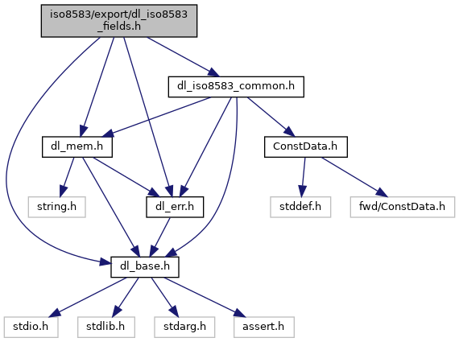
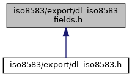

[Macros](#define-members) \| [Functions](#func-members)

`#include "`<a href="dl__base_8h_source.md">dl_base.h</a>`"`
`#include "`<a href="dl__err_8h_source.md">dl_err.h</a>`"`
`#include "`<a href="dl__mem_8h_source.md">dl_mem.h</a>`"`
`#include "`<a href="dl__iso8583__common_8h_source.md">dl_iso8583_common.h</a>`"`

Include dependency graph for dl_iso8583_fields.h:

This graph shows which files directly or indirectly include this file:

<a href="dl__iso8583__fields_8h_source.md">Go to the source code of this file.</a>

|          |                                                    |
|----------|----------------------------------------------------|
| Macros   |                                                    |
| #define  | [ISO_EXP_DECL](#afd0131fdb432c83b6a30719f866ef15a) |

|  |  |
|----|----|
| Functions |  |
| <a href="_safe_buffer_8hpp.md#afd0131fdb432c83b6a30719f866ef15a">ISO_EXP_DECL</a> <a href="dl__err_8h.md#ada368ca184bede6f4325b99208f6a97a">DL_ERR</a>  | [\_DL_ISO8583_FIELD_Pack](#a427d0f87c0e0a7d13e0fe57241c21230) (<a href="dl__base_8h.md#ad253e3225fa9ea736548d20a90dbf237">DL_UINT16</a> iField, const <a href="dl__iso8583__common_8h.md#ad841da3313e5c84926f5149ec0812ef4">DL_ISO8583_MSG</a> \*iMsg, const <a href="dl__iso8583__common_8h.md#a9c22a24affc7d3273630965769f7ac17">DL_ISO8583_HANDLER</a> \*iHandler, <a href="dl__base_8h.md#a9d9aaccaaea86a21d606052de3f715b9">DL_UINT8</a> \*\*ioPtr, const <a href="dl__base_8h.md#ad253e3225fa9ea736548d20a90dbf237">DL_UINT16</a> ioPtrSize) |
| <a href="_safe_buffer_8hpp.md#afd0131fdb432c83b6a30719f866ef15a">ISO_EXP_DECL</a> <a href="dl__err_8h.md#ada368ca184bede6f4325b99208f6a97a">DL_ERR</a>  | [\_DL_ISO8583_FIELD_Unpack](#ab6ce7c17635c4e85d850e5715ace3418) (<a href="dl__base_8h.md#ad253e3225fa9ea736548d20a90dbf237">DL_UINT16</a> iField, <a href="dl__iso8583__common_8h.md#ad841da3313e5c84926f5149ec0812ef4">DL_ISO8583_MSG</a> \*ioMsg, const <a href="dl__iso8583__common_8h.md#a9c22a24affc7d3273630965769f7ac17">DL_ISO8583_HANDLER</a> \*iHandler, <a href="dl__base_8h.md#a9d9aaccaaea86a21d606052de3f715b9">DL_UINT8</a> \*\*ioPtr) |

## MacroDefinition Documentation {#macro-definition-documentation}

## ISO_EXP_DECL 

#define ISO_EXP_DECL

## FunctionDocumentation {#function-documentation}

## \_DL_ISO8583_FIELD_Pack() 

<a href="_safe_buffer_8hpp.md#afd0131fdb432c83b6a30719f866ef15a">ISO_EXP_DECL</a> <a href="dl__err_8h.md#ada368ca184bede6f4325b99208f6a97a">DL_ERR</a> \_DL_ISO8583_FIELD_Pack

## \_DL_ISO8583_FIELD_Unpack() 

<a href="_safe_buffer_8hpp.md#afd0131fdb432c83b6a30719f866ef15a">ISO_EXP_DECL</a> <a href="dl__err_8h.md#ada368ca184bede6f4325b99208f6a97a">DL_ERR</a> \_DL_ISO8583_FIELD_Unpack

