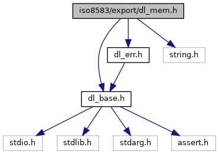

[Macros](#define-members) \| [Functions](#func-members)

`#include "`<a href="dl__base_8h_source.md">dl_base.h</a>`"`
`#include "`<a href="dl__err_8h_source.md">dl_err.h</a>`"`
`#include <string.h>`

Include dependency graph for dl_mem.h:

This graph shows which files directly or indirectly include this file:

<a href="dl__mem_8h_source.md">Go to the source code of this file.</a>

|  |  |
|----|----|
| Macros |  |
| #define  | [ISO_EXP_DECL](#afd0131fdb432c83b6a30719f866ef15a) |
| #define  | [kDL_ERR_MEM_ALLOC](#ae4cd069b11886e438e65b1831cc0fcec)   (<a href="dl__err_8h.md#ada368ca184bede6f4325b99208f6a97a">DL_ERR</a>)(1000+0) |
| #define  | [DL_MEM_free](#a744c6817dabe916ffe06478f9386f689)(ptr)   { <a href="_v_h_q__vfisyspm__wrapper_8cpp.md#a12d403643236776c26b6081a4e570a27">if</a> ( (ptr) != NULL ) { free(ptr) ; (ptr) = NULL ; } } |
| #define  | [DL_MEM_memset](#aa091e9b1839086b7943127073cdac88a)(ptr, <a href="_web_service_wrappers_8c.md#a6e248376c0290338633d8137822eb209">value</a>, numBytes)   ((void)memset((void\*)(ptr),(int)(<a href="_web_service_wrappers_8c.md#a6e248376c0290338633d8137822eb209">value</a>),(size_t)(numBytes))) |
| #define  | [DL_MEM_memcpy](#ad8625484f4ea7abdecbefbf4c661b43e)(toPtr, fromPtr, numBytes)   ((void)memcpy((void\*)(toPtr),(void\*)(fromPtr),(size_t)(numBytes))) |
| #define  | [DL_MEM_memcmp](#a7d89c9c5c7d97e149deb2b51497a6b24)(aPtr, bPtr, len)   (memcmp((void\*)(aPtr),(void\*)(bPtr),(size_t)(len))) |

|  |  |
|----|----|
| Functions |  |
| <a href="_safe_buffer_8hpp.md#afd0131fdb432c83b6a30719f866ef15a">ISO_EXP_DECL</a> <a href="dl__err_8h.md#ada368ca184bede6f4325b99208f6a97a">DL_ERR</a>  | [DL_MEM_malloc](#aa2d96ba0b43b73290ef431d18e9ec79f) (<a href="dl__base_8h.md#a2b6bafb1286aa226f7f001cb7fd68c66">DL_UINT32</a> iNumBytes, void \*\*oPtr) |
| <a href="_safe_buffer_8hpp.md#afd0131fdb432c83b6a30719f866ef15a">ISO_EXP_DECL</a> <a href="dl__err_8h.md#ada368ca184bede6f4325b99208f6a97a">DL_ERR</a>  | [DL_MEM_callocWithInit](#ad749c1fc223a8c37d26f2dafe28dc610) (<a href="dl__base_8h.md#a2b6bafb1286aa226f7f001cb7fd68c66">DL_UINT32</a> numItems, size_t itemSize, void \*\*out) |

## MacroDefinition Documentation {#macro-definition-documentation}

## DL_MEM_free 

#define DL_MEM_free

## DL_MEM_memcmp 

#define DL_MEM_memcmp

## DL_MEM_memcpy 

#define DL_MEM_memcpy

## DL_MEM_memset 

#define DL_MEM_memset

## ISO_EXP_DECL 

#define ISO_EXP_DECL

## kDL_ERR_MEM_ALLOC 

#define kDL_ERR_MEM_ALLOC   (<a href="dl__err_8h.md#ada368ca184bede6f4325b99208f6a97a">DL_ERR</a>)(1000+0)

## FunctionDocumentation {#function-documentation}

## DL_MEM_callocWithInit() 

<a href="_safe_buffer_8hpp.md#afd0131fdb432c83b6a30719f866ef15a">ISO_EXP_DECL</a> <a href="dl__err_8h.md#ada368ca184bede6f4325b99208f6a97a">DL_ERR</a> DL_MEM_callocWithInit

## DL_MEM_malloc() 

<a href="_safe_buffer_8hpp.md#afd0131fdb432c83b6a30719f866ef15a">ISO_EXP_DECL</a> <a href="dl__err_8h.md#ada368ca184bede6f4325b99208f6a97a">DL_ERR</a> DL_MEM_malloc

