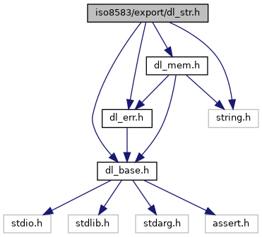
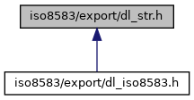

[Macros](#define-members) \| [Functions](#func-members) \| [Variables](#var-members)

`#include "`<a href="dl__base_8h_source.md">dl_base.h</a>`"`
`#include "`<a href="dl__err_8h_source.md">dl_err.h</a>`"`
`#include "`<a href="dl__mem_8h_source.md">dl_mem.h</a>`"`
`#include <string.h>`

Include dependency graph for dl_str.h:

This graph shows which files directly or indirectly include this file:

<a href="dl__str_8h_source.md">Go to the source code of this file.</a>

|  |  |
|----|----|
| Macros |  |
| #define  | [ISO_EXP_DECL](#afd0131fdb432c83b6a30719f866ef15a) |
| #define  | [DL_STR_SafeStr](#aa16c75d40f15dad726099ab71a4dfee0)(str)   ((str)==NULL?kDL_STR_EmptyStr:(str)) |
| #define  | [DL_STR_SafeNum](#adf4a03fd84400c548a6f59486f902cf9)(a)   ((a)==NULL?0:\*(a)) |
| #define  | [DL_STR_StrChr](#aed449824111f6494232eb6143da90dbf)   strchr |
| #define  | [DL_STR_IsWS](#a96d9286d658a3a0e173fb12a45391b0a)(iCh)   ((((iCh)\>=<a href="dl__base_8h.md#a5917ab482a0952f286f1f8d8e23b3b95">kDL_ASCII_HT</a>)&&((iCh)\<=<a href="dl__base_8h.md#ae2cc5e0274ba8d38efd250f3b65e2a7a">kDL_ASCII_CR</a>))\|\|((iCh)==<a href="dl__base_8h.md#af1e6cf69a2d7307727f9bbd5061e125e">kDL_ASCII_SP</a>) ) |

|  |  |
|----|----|
| Functions |  |
| <a href="_safe_buffer_8hpp.md#afd0131fdb432c83b6a30719f866ef15a">ISO_EXP_DECL</a> <a href="dl__base_8h.md#a1b15f52a2d4d90367dbcbd0fa67ca6f7">DL_CHAR</a> \*  | [DL_STR_GetEnv](#a9ccfac393c2534c26d65d0c67bfc910d) (const <a href="dl__base_8h.md#a1b15f52a2d4d90367dbcbd0fa67ca6f7">DL_CHAR</a> \*iEnvStr) |
| <a href="_safe_buffer_8hpp.md#afd0131fdb432c83b6a30719f866ef15a">ISO_EXP_DECL</a> int  | [DL_STR_StrLen](#ae5bc3001bfd98d55c6f976bd49fa812f) (const <a href="dl__base_8h.md#a1b15f52a2d4d90367dbcbd0fa67ca6f7">DL_CHAR</a> \*iStr) |
| <a href="_safe_buffer_8hpp.md#afd0131fdb432c83b6a30719f866ef15a">ISO_EXP_DECL</a> int  | [DL_STR_StrLenExWS](#a45be348beab150f1b85b01b32bb168da) (const <a href="dl__base_8h.md#a1b15f52a2d4d90367dbcbd0fa67ca6f7">DL_CHAR</a> \*iStr) |
| <a href="_safe_buffer_8hpp.md#afd0131fdb432c83b6a30719f866ef15a">ISO_EXP_DECL</a> int  | [DL_STR_StrCmp](#af90f27c687f23b9b2939a97754b50441) (const <a href="dl__base_8h.md#a1b15f52a2d4d90367dbcbd0fa67ca6f7">DL_CHAR</a> \*iStr1, const <a href="dl__base_8h.md#a1b15f52a2d4d90367dbcbd0fa67ca6f7">DL_CHAR</a> \*iStr2, int iIgnoreCase) |
| <a href="_safe_buffer_8hpp.md#afd0131fdb432c83b6a30719f866ef15a">ISO_EXP_DECL</a> int  | [DL_STR_StrNCmp](#a9f6dc8e48e764ed96c87c29996060fc5) (const <a href="dl__base_8h.md#a1b15f52a2d4d90367dbcbd0fa67ca6f7">DL_CHAR</a> \*iStr1, const <a href="dl__base_8h.md#a1b15f52a2d4d90367dbcbd0fa67ca6f7">DL_CHAR</a> \*iStr2, int iIgnoreCase, int iMaxChars) |
| <a href="_safe_buffer_8hpp.md#afd0131fdb432c83b6a30719f866ef15a">ISO_EXP_DECL</a> void  | [DL_STR_StrCpy](#ab15ebc0129002281339256d7bec69892) (<a href="dl__base_8h.md#a1b15f52a2d4d90367dbcbd0fa67ca6f7">DL_CHAR</a> \*ioToPtr, const <a href="dl__base_8h.md#a1b15f52a2d4d90367dbcbd0fa67ca6f7">DL_CHAR</a> \*iFromPtr, int iMaxChars) |
| <a href="_safe_buffer_8hpp.md#afd0131fdb432c83b6a30719f866ef15a">ISO_EXP_DECL</a> <a href="dl__err_8h.md#ada368ca184bede6f4325b99208f6a97a">DL_ERR</a>  | [DL_STR_StrDup](#a8df92d2c4aa7e8f6718c4f8bb36d6539) (const <a href="dl__base_8h.md#a1b15f52a2d4d90367dbcbd0fa67ca6f7">DL_CHAR</a> \*iStr, <a href="dl__base_8h.md#a1b15f52a2d4d90367dbcbd0fa67ca6f7">DL_CHAR</a> \*\*oStr) |
| <a href="_safe_buffer_8hpp.md#afd0131fdb432c83b6a30719f866ef15a">ISO_EXP_DECL</a> <a href="dl__err_8h.md#ada368ca184bede6f4325b99208f6a97a">DL_ERR</a>  | [DL_STR_StrNDup](#a4d5d88155955021af2f19ec295b5d8e1) (const <a href="dl__base_8h.md#a1b15f52a2d4d90367dbcbd0fa67ca6f7">DL_CHAR</a> \*iStr, <a href="dl__base_8h.md#a2b6bafb1286aa226f7f001cb7fd68c66">DL_UINT32</a> iMaxChars, <a href="dl__base_8h.md#a1b15f52a2d4d90367dbcbd0fa67ca6f7">DL_CHAR</a> \*\*oStr) |
| <a href="_safe_buffer_8hpp.md#afd0131fdb432c83b6a30719f866ef15a">ISO_EXP_DECL</a> <a href="dl__err_8h.md#ada368ca184bede6f4325b99208f6a97a">DL_ERR</a>  | [DL_STR_StrCat](#ae6780674519df9d4e87c852272e94bf2) (const <a href="dl__base_8h.md#a1b15f52a2d4d90367dbcbd0fa67ca6f7">DL_CHAR</a> \*iStr1, const <a href="dl__base_8h.md#a1b15f52a2d4d90367dbcbd0fa67ca6f7">DL_CHAR</a> \*iStr2, <a href="dl__base_8h.md#a1b15f52a2d4d90367dbcbd0fa67ca6f7">DL_CHAR</a> \*\*oStr) |
| <a href="_safe_buffer_8hpp.md#afd0131fdb432c83b6a30719f866ef15a">ISO_EXP_DECL</a> void  | [DL_STR_LTrim](#ad95f905830ca78411feafc6748299240) (<a href="dl__base_8h.md#a1b15f52a2d4d90367dbcbd0fa67ca6f7">DL_CHAR</a> \*ioStr, <a href="dl__base_8h.md#a1b15f52a2d4d90367dbcbd0fa67ca6f7">DL_CHAR</a> iTrimCh) |
| <a href="_safe_buffer_8hpp.md#afd0131fdb432c83b6a30719f866ef15a">ISO_EXP_DECL</a> void  | [DL_STR_RTrim](#a9f339970789812bcbbd50f7b9b4cd07e) (<a href="dl__base_8h.md#a1b15f52a2d4d90367dbcbd0fa67ca6f7">DL_CHAR</a> \*ioStr, <a href="dl__base_8h.md#a1b15f52a2d4d90367dbcbd0fa67ca6f7">DL_CHAR</a> iTrimCh) |
| <a href="_safe_buffer_8hpp.md#afd0131fdb432c83b6a30719f866ef15a">ISO_EXP_DECL</a> void  | [DL_STR_ToUpper](#ae954dcd4743e2e81fc2cecde4e11192c) (<a href="dl__base_8h.md#a1b15f52a2d4d90367dbcbd0fa67ca6f7">DL_CHAR</a> \*ioStr) |
| <a href="_safe_buffer_8hpp.md#afd0131fdb432c83b6a30719f866ef15a">ISO_EXP_DECL</a> <a href="dl__base_8h.md#a1b15f52a2d4d90367dbcbd0fa67ca6f7">DL_CHAR</a> \*  | [DL_STR_SkipWS](#a8c534cb9d52a315b9899027db8cd7551) (const <a href="dl__base_8h.md#a1b15f52a2d4d90367dbcbd0fa67ca6f7">DL_CHAR</a> \*iStr) |
| <a href="_safe_buffer_8hpp.md#afd0131fdb432c83b6a30719f866ef15a">ISO_EXP_DECL</a> int  | [DL_STR_IsNumeric](#a6c9961cfdfcd3f677c5106d8cea8a18c) (const <a href="dl__base_8h.md#a1b15f52a2d4d90367dbcbd0fa67ca6f7">DL_CHAR</a> \*iStr) |
| <a href="_safe_buffer_8hpp.md#afd0131fdb432c83b6a30719f866ef15a">ISO_EXP_DECL</a> int  | [DL_STR_Validate](#abf6441d33a6a46db3ec8c27e6647631d) (const <a href="dl__base_8h.md#a1b15f52a2d4d90367dbcbd0fa67ca6f7">DL_CHAR</a> \*iStr, int iMinLen, int iMaxLen, const <a href="dl__base_8h.md#a1b15f52a2d4d90367dbcbd0fa67ca6f7">DL_CHAR</a> \*iValidChars) |
| <a href="_safe_buffer_8hpp.md#afd0131fdb432c83b6a30719f866ef15a">ISO_EXP_DECL</a> int  | [DL_STR_Contains](#acd50019f560f769c0e63a20c2e6e175b) (const <a href="dl__base_8h.md#a1b15f52a2d4d90367dbcbd0fa67ca6f7">DL_CHAR</a> \*iStr, const <a href="dl__base_8h.md#a1b15f52a2d4d90367dbcbd0fa67ca6f7">DL_CHAR</a> \*iContains) |
| <a href="_safe_buffer_8hpp.md#afd0131fdb432c83b6a30719f866ef15a">ISO_EXP_DECL</a> <a href="dl__err_8h.md#ada368ca184bede6f4325b99208f6a97a">DL_ERR</a>  | [DL_STR_EncapsulateStr](#a43b41ffa60f4fed56e3d4753bfa00deb) (const <a href="dl__base_8h.md#a1b15f52a2d4d90367dbcbd0fa67ca6f7">DL_CHAR</a> \*iStr, <a href="dl__base_8h.md#a1b15f52a2d4d90367dbcbd0fa67ca6f7">DL_CHAR</a> iEncapChar, <a href="dl__base_8h.md#a1b15f52a2d4d90367dbcbd0fa67ca6f7">DL_CHAR</a> \*\*oStr) |
| <a href="_safe_buffer_8hpp.md#afd0131fdb432c83b6a30719f866ef15a">ISO_EXP_DECL</a> <a href="dl__err_8h.md#ada368ca184bede6f4325b99208f6a97a">DL_ERR</a>  | [DL_STR_GetEncapsulatedStr](#a58204181908480ce50f2395da04343a8) (const <a href="dl__base_8h.md#a1b15f52a2d4d90367dbcbd0fa67ca6f7">DL_CHAR</a> \*iStr, <a href="dl__base_8h.md#a1b15f52a2d4d90367dbcbd0fa67ca6f7">DL_CHAR</a> iEncapChar, <a href="dl__base_8h.md#a1b15f52a2d4d90367dbcbd0fa67ca6f7">DL_CHAR</a> \*\*oDataStr, <a href="dl__base_8h.md#a1b15f52a2d4d90367dbcbd0fa67ca6f7">DL_CHAR</a> \*\*oNextPtr) |
| <a href="_safe_buffer_8hpp.md#afd0131fdb432c83b6a30719f866ef15a">ISO_EXP_DECL</a> <a href="dl__base_8h.md#a1b15f52a2d4d90367dbcbd0fa67ca6f7">DL_CHAR</a> \*  | [DL_STR_ReadToBuffer](#a8d8a1dc13d99214c3189ada36255f239) (const <a href="dl__base_8h.md#a1b15f52a2d4d90367dbcbd0fa67ca6f7">DL_CHAR</a> \*iStr, const <a href="dl__base_8h.md#a1b15f52a2d4d90367dbcbd0fa67ca6f7">DL_CHAR</a> \*iValidChars, int iBufferSize, <a href="dl__base_8h.md#a1b15f52a2d4d90367dbcbd0fa67ca6f7">DL_CHAR</a> \*oBuffer) |

|  |  |
|----|----|
| Variables |  |
| <a href="dl__base_8h.md#a1b15f52a2d4d90367dbcbd0fa67ca6f7">DL_CHAR</a>  | [kDL_STR_EmptyStr](#a00324da510bd7bd49bc95ea4a06762c5) \[1\] |

## MacroDefinition Documentation {#macro-definition-documentation}

## DL_STR_IsWS 

#define DL_STR_IsWS

## DL_STR_SafeNum 

#define DL_STR_SafeNum

## DL_STR_SafeStr 

#define DL_STR_SafeStr

## DL_STR_StrChr 

#define DL_STR_StrChr   strchr

## ISO_EXP_DECL 

#define ISO_EXP_DECL

## FunctionDocumentation {#function-documentation}

## DL_STR_Contains() 

<a href="_safe_buffer_8hpp.md#afd0131fdb432c83b6a30719f866ef15a">ISO_EXP_DECL</a> int DL_STR_Contains

## DL_STR_EncapsulateStr() 

<a href="_safe_buffer_8hpp.md#afd0131fdb432c83b6a30719f866ef15a">ISO_EXP_DECL</a> <a href="dl__err_8h.md#ada368ca184bede6f4325b99208f6a97a">DL_ERR</a> DL_STR_EncapsulateStr

## DL_STR_GetEncapsulatedStr() 

<a href="_safe_buffer_8hpp.md#afd0131fdb432c83b6a30719f866ef15a">ISO_EXP_DECL</a> <a href="dl__err_8h.md#ada368ca184bede6f4325b99208f6a97a">DL_ERR</a> DL_STR_GetEncapsulatedStr

## DL_STR_GetEnv() 

<a href="_safe_buffer_8hpp.md#afd0131fdb432c83b6a30719f866ef15a">ISO_EXP_DECL</a> <a href="dl__base_8h.md#a1b15f52a2d4d90367dbcbd0fa67ca6f7">DL_CHAR</a>\* DL_STR_GetEnv

## DL_STR_IsNumeric() 

<a href="_safe_buffer_8hpp.md#afd0131fdb432c83b6a30719f866ef15a">ISO_EXP_DECL</a> int DL_STR_IsNumeric

## DL_STR_LTrim() 

<a href="_safe_buffer_8hpp.md#afd0131fdb432c83b6a30719f866ef15a">ISO_EXP_DECL</a> void DL_STR_LTrim

## DL_STR_ReadToBuffer() 

<a href="_safe_buffer_8hpp.md#afd0131fdb432c83b6a30719f866ef15a">ISO_EXP_DECL</a> <a href="dl__base_8h.md#a1b15f52a2d4d90367dbcbd0fa67ca6f7">DL_CHAR</a>\* DL_STR_ReadToBuffer

## DL_STR_RTrim() 

<a href="_safe_buffer_8hpp.md#afd0131fdb432c83b6a30719f866ef15a">ISO_EXP_DECL</a> void DL_STR_RTrim

## DL_STR_SkipWS() 

<a href="_safe_buffer_8hpp.md#afd0131fdb432c83b6a30719f866ef15a">ISO_EXP_DECL</a> <a href="dl__base_8h.md#a1b15f52a2d4d90367dbcbd0fa67ca6f7">DL_CHAR</a>\* DL_STR_SkipWS

## DL_STR_StrCat() 

<a href="_safe_buffer_8hpp.md#afd0131fdb432c83b6a30719f866ef15a">ISO_EXP_DECL</a> <a href="dl__err_8h.md#ada368ca184bede6f4325b99208f6a97a">DL_ERR</a> DL_STR_StrCat

## DL_STR_StrCmp() 

<a href="_safe_buffer_8hpp.md#afd0131fdb432c83b6a30719f866ef15a">ISO_EXP_DECL</a> int DL_STR_StrCmp

## DL_STR_StrCpy() 

<a href="_safe_buffer_8hpp.md#afd0131fdb432c83b6a30719f866ef15a">ISO_EXP_DECL</a> void DL_STR_StrCpy

## DL_STR_StrDup() 

<a href="_safe_buffer_8hpp.md#afd0131fdb432c83b6a30719f866ef15a">ISO_EXP_DECL</a> <a href="dl__err_8h.md#ada368ca184bede6f4325b99208f6a97a">DL_ERR</a> DL_STR_StrDup

## DL_STR_StrLen() 

<a href="_safe_buffer_8hpp.md#afd0131fdb432c83b6a30719f866ef15a">ISO_EXP_DECL</a> int DL_STR_StrLen

## DL_STR_StrLenExWS() 

<a href="_safe_buffer_8hpp.md#afd0131fdb432c83b6a30719f866ef15a">ISO_EXP_DECL</a> int DL_STR_StrLenExWS

## DL_STR_StrNCmp() 

<a href="_safe_buffer_8hpp.md#afd0131fdb432c83b6a30719f866ef15a">ISO_EXP_DECL</a> int DL_STR_StrNCmp

## DL_STR_StrNDup() 

<a href="_safe_buffer_8hpp.md#afd0131fdb432c83b6a30719f866ef15a">ISO_EXP_DECL</a> <a href="dl__err_8h.md#ada368ca184bede6f4325b99208f6a97a">DL_ERR</a> DL_STR_StrNDup

## DL_STR_ToUpper() 

<a href="_safe_buffer_8hpp.md#afd0131fdb432c83b6a30719f866ef15a">ISO_EXP_DECL</a> void DL_STR_ToUpper

## DL_STR_Validate() 

<a href="_safe_buffer_8hpp.md#afd0131fdb432c83b6a30719f866ef15a">ISO_EXP_DECL</a> int DL_STR_Validate

## VariableDocumentation {#variable-documentation}

## kDL_STR_EmptyStr 

<a href="dl__base_8h.md#a1b15f52a2d4d90367dbcbd0fa67ca6f7">DL_CHAR</a> kDL_STR_EmptyStr\[1\]

