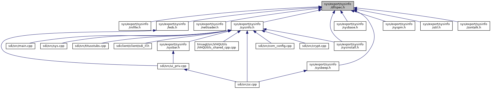

[Macros](#define-members)

This graph shows which files directly or indirectly include this file:

<a href="dllspec_8h_source.md">Go to the source code of this file.</a>

|          |                                                    |
|----------|----------------------------------------------------|
| Macros   |                                                    |
| #define  | [SYS_INFO_API](#a06244aced91c3fbc18547181038765aa) |

## MacroDefinition Documentation {#macro-definition-documentation}

## SYS_INFO_API 

#define SYS_INFO_API

