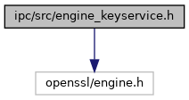

[Data Structures](#nested-classes) \| [Macros](#define-members) \| [Typedefs](#typedef-members)

`#include <openssl/engine.h>`

Include dependency graph for engine_keyservice.h:



<a href="engine__keyservice_8h_source.md">Go to the source code of this file.</a>

|                 |                                         |
|-----------------|-----------------------------------------|
| Data Structures |                                         |
| struct          | [KS_IOBuffer](#struct_k_s___i_o_buffer) |

|  |  |
|----|----|
| Macros |  |
| #define  | [KS_CMD_READ_CERT](#a80a221065e023789a8866527b148810c)   (ENGINE_CMD_BASE+0x10) |
| #define  | [KS_CMD_SET_ERROR_CB](#aaaa9216415bce126aae64a64e1be6efa)   (ENGINE_CMD_BASE+0x11) |
| #define  | [KS_CMD_SET_DEBUG_CB](#a2968c2cff33a9788809e328fb5c6294c)   (ENGINE_CMD_BASE+0x12) |

|  |  |
|----|----|
| Typedefs |  |
| typedef void(\*  | [ks_trace_callback](#afcf7437404424f6e27c15778b5b2af10)) (const char \*file, unsigned line, const char \*str) |

------------------------------------------------------------------------

## DataStructure Documentation {#data-structure-documentation}

## KS_IOBuffer <a href="#struct_k_s___i_o_buffer" id="struct_k_s___i_o_buffer"></a>

<p>struct KS_IOBuffer</p>

I/O buffer used for the keyservice to pass/read data to/from the keyservice engine

| Data Fields |  |  |
|----|----|----|
| unsigned char | buffer\[0\] | <p>pointer to data buffer</p> |
| unsigned | maxsize | <p>allocated size for the data buffer</p> |
| unsigned | size | <p>size of stored data in the buffer</p> |

## MacroDefinition Documentation {#macro-definition-documentation}

## KS_CMD_READ_CERT <a href="#a80a221065e023789a8866527b148810c" id="a80a221065e023789a8866527b148810c"></a>

<p>#define KS_CMD_READ_CERT   (ENGINE_CMD_BASE+0x10)</p>

Control command to read the certificate from the keyservice engine. The command uses struct [KS_IOBuffer](#struct_k_s___i_o_buffer) to pass the key reference name to the keyservice, for which the related certificate shall be read. The [KS_IOBuffer](#struct_k_s___i_o_buffer) should be reserved with malloc() and sufficient buffer size (recommended is at least 8k). As input value the buffer gets the key reference name `key_name`, as output the same buffer is used by the keyservice engine to store the certificate. Example code to read the certificate for key reference `key_name` (C-string):

``` cpp
KS_IOBuffer *buf=(KS_IOBuffer *)malloc(sizeof(KS_IOBuffer)+8192);
buf->maxsize=8192;
buf->size=strlen(key_name);
memcpy(buf->buffer,key_name,buf->size);
if(ENGINE_ctrl(engine,KS_CMD_READ_CERT,0,buf,0)) {
  // success
  memcpy(certbuf,buf->buffer,buf->size);
}
free(buf);
```


If the read certificate length exceeds the allocated buffer size of the provided buffer, ENGINE_ctrl() fails and the keyservice returns the required buffer size in buf-\>size, so that the caller can re-allocate the buffer to the required buffer size.


## KS_CMD_SET_DEBUG_CB <a href="#a2968c2cff33a9788809e328fb5c6294c" id="a2968c2cff33a9788809e328fb5c6294c"></a>

<p>#define KS_CMD_SET_DEBUG_CB   (ENGINE_CMD_BASE+0x12)</p>

If supported by the keyservice engine, the application can use this control command to set a trace callback (see ks_trace_callback), which will be invoked for logging of informational debug-level events.

## KS_CMD_SET_ERROR_CB <a href="#aaaa9216415bce126aae64a64e1be6efa" id="aaaa9216415bce126aae64a64e1be6efa"></a>

<p>#define KS_CMD_SET_ERROR_CB   (ENGINE_CMD_BASE+0x11)</p>

If supported by the keyservice engine, the application can use this control command to set a trace callback (see ks_trace_callback), which will be invoked for logging of error conditions.

## TypedefDocumentation {#typedef-documentation}

## ks_trace_callback <a href="#afcf7437404424f6e27c15778b5b2af10" id="afcf7437404424f6e27c15778b5b2af10"></a>

<p>typedef void(\* ks_trace_callback) (const char \*file, unsigned line, const char \*str)</p>

callback trace function invoked, if keyservice engine calls the internal logging function to trace out debug information. This function can eiter be set by engine control command KS_CMD_SET_ERROR_CB to trace error conditions or by KS_CMD_SET_DEBUG_CB to trace informational debug-level messages.


Only process flow information is logged, key contents are never logged.
 **Parameters**

\[in\] **file** filename of the module containing the trace point \[in\] **line** source line of the module containing the trace point \[in\] **str** logging information as zero-terminated string
