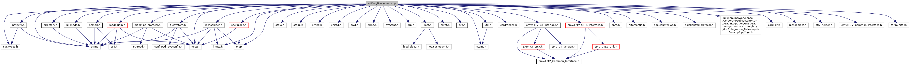

[Data Structures](#nested-classes) \| [Namespaces](#namespaces) \| [Enumerations](#enum-members) \| [Functions](#func-members) \| [Variables](#var-members)

`#include "`<a href="filesystem_8h_source.md">filesystem.h</a>`"`
`#include <stdio.h>`
`#include <stdlib.h>`
`#include <string.h>`
`#include <unistd.h>`
`#include <pwd.h>`
`#include <limits.h>`
`#include <errno.h>`
`#include <sys/types.h>`
`#include <sys/stat.h>`
`#include <grp.h>`
`#include "`<a href="pathutil_8h_source.md">pathutil.h</a>`"`
`#include "`<a href="__logf_8h_source.md">_logf.h</a>`"`
`#include "`<a href="crypt_8h_source.md">crypt.h</a>`"`
`#include "`<a href="sdi_2src_2hexutil_8h_source.md">hexutil.h</a>`"`
`#include "`<a href="directory_8h_source.md">directory.h</a>`"`
`#include "`<a href="ipc_2src_2ipc_2jsobject_8h_source.md">ipc/jsobject.h</a>`"`
`#include "`<a href="sys_8h_source.md">sys.h</a>`"`
`#include "`<a href="sdi_2src_2util_8h_source.md">util.h</a>`"`
`#include "cardranges.h"`
`#include "`<a href="madk__pp__protocol_8h_source.md">madk_pp_protocol.h</a>`"`
`#include "`<a href="ui__mode_8h_source.md">ui_mode.h</a>`"`
`#include "`<a href="_e_m_v___c_t___interface_8h_source.md">emv/EMV_CT_Interface.h</a>`"`
`#include "`<a href="_e_m_v___c_t_l_s___interface_8h_source.md">emv/EMV_CTLS_Interface.h</a>`"`
`#include "data.h"`
`#include "filterconfig.h"`
`#include "epp/counterTop.h"`
`#include "tar/minitar.h"`
`#include "`<a href="loadplugin_8h_source.md">loadplugin.h</a>`"`
`#include "`<a href="libsec_8h_source.md">sec/libsec.h</a>`"`

Include dependency graph for filesystem.cpp:

|  |  |
|----|----|
| Data Structures |  |
| struct   | <a href="namespacesdi_1_1filesystem.md#structsdi_1_1filesystem_1_1_update_files">UpdateFiles</a> |

|  |  |
|----|----|
| Namespaces |  |
|   | <a href="namespacesdi.md">sdi</a> |
|   | <a href="namespacesdi_1_1filesystem.md">sdi::filesystem</a> |

|  |  |
|----|----|
| Enumerations |  |
| enum   | <a href="namespacesdi_1_1filesystem.md#aecaf6a9545fa815deb4b8e64e144ce43">Location</a> {   <a href="namespacesdi_1_1filesystem.md#aecaf6a9545fa815deb4b8e64e144ce43a3b40dfe58ff7a5a338c90da1545ec573">LOC_None</a>, <a href="namespacesdi_1_1filesystem.md#aecaf6a9545fa815deb4b8e64e144ce43a878e84fff242aa27fa3ec07e9df71ea0">LOC_SdiFlashDir</a>, <a href="namespacesdi_1_1filesystem.md#aecaf6a9545fa815deb4b8e64e144ce43aec2d78a615b70e9f406ed59e7e089137">LOC_SdiConfigDir</a>, <a href="namespacesdi_1_1filesystem.md#aecaf6a9545fa815deb4b8e64e144ce43ab7bebc1fd312b79d4400b0bd715d837c">LOC_SdiExtConfigDir</a>,   <a href="namespacesdi_1_1filesystem.md#aecaf6a9545fa815deb4b8e64e144ce43a2adeec59d3dfd549c01ce9105dce5f5b">LOC_EmvFlashDir</a>, <a href="namespacesdi_1_1filesystem.md#aecaf6a9545fa815deb4b8e64e144ce43aa652c98e536a9dd60108b492c7d56501">LOC_EmvConfigDir</a>, <a href="namespacesdi_1_1filesystem.md#aecaf6a9545fa815deb4b8e64e144ce43a28744a191aee5516275e3a88c20a0851">LOC_LogConfigDir</a>, <a href="namespacesdi_1_1filesystem.md#aecaf6a9545fa815deb4b8e64e144ce43a836a3a9c2556f7f29455d5fc7a9cf19c">LOC_NfcFlashDir</a>,   <a href="namespacesdi_1_1filesystem.md#aecaf6a9545fa815deb4b8e64e144ce43acfc7b9731795d36feedccae005c07052">LOC_SdiExtFontsDir</a> } |
| enum   | <a href="namespacesdi_1_1filesystem.md#a8bb1ef53467e4f61410d12822d922498">Action</a> {   <a href="namespacesdi_1_1filesystem.md#a8bb1ef53467e4f61410d12822d922498a56fb111b33a737bdddf89dd9568687df">ACT_None</a> = 0, <a href="namespacesdi_1_1filesystem.md#a8bb1ef53467e4f61410d12822d922498a3938f7524a0b71efd9adfd59a5f35f83">ACT_SecInit</a> = (1 \<\< 0), <a href="namespacesdi_1_1filesystem.md#a8bb1ef53467e4f61410d12822d922498aae9ce02546bfc5b212048612e81b0825">ACT_DisableEpp</a> = (1 \<\< 1), <a href="namespacesdi_1_1filesystem.md#a8bb1ef53467e4f61410d12822d922498a531ff0d0f64adc3d9a04d15f268488da">ACT_EmvExit</a> = (1 \<\< 2),   <a href="namespacesdi_1_1filesystem.md#a8bb1ef53467e4f61410d12822d922498a1a0540a4bf370403942cf6c61cbf5a3c">ACT_EmvExitComplete</a> = (1 \<\< 3), <a href="namespacesdi_1_1filesystem.md#a8bb1ef53467e4f61410d12822d922498af5c01ad9c75206913bc3a8494842e468">ACT_EmvFlashPerm</a> = (1 \<\< 4), <a href="namespacesdi_1_1filesystem.md#a8bb1ef53467e4f61410d12822d922498ae62045a4320284f9bc06396b757bf777">ACT_EmvInitInfo</a> = (1 \<\< 5), <a href="namespacesdi_1_1filesystem.md#a8bb1ef53467e4f61410d12822d922498a3e449095c7a30b5021d4675cde6d19c3">ACT_LogInit</a> = (1 \<\< 6),   <a href="namespacesdi_1_1filesystem.md#a8bb1ef53467e4f61410d12822d922498aeb9762197fdaecdeb2b76f59609636a5">ACT_CardRanges</a> = (1 \<\< 7), <a href="namespacesdi_1_1filesystem.md#a8bb1ef53467e4f61410d12822d922498ab4b30277a00cda99b05dac98fe652c2f">ACT_WhitelistFile</a> = (1 \<\< 8), <a href="namespacesdi_1_1filesystem.md#a8bb1ef53467e4f61410d12822d922498a3b94499f650fd93b67a6d89f1420bcae">ACT_AclInit</a> = (1 \<\< 9) } |
| enum   | <a href="namespacesdi_1_1filesystem.md#a69f0011e8e844cb97a3507c1da3aa656">ActionSource</a> { <a href="namespacesdi_1_1filesystem.md#a69f0011e8e844cb97a3507c1da3aa656a741d7fd60e2d656f4d4b71f9a29e79df">ASRC_Default</a> = 0, <a href="namespacesdi_1_1filesystem.md#a69f0011e8e844cb97a3507c1da3aa656a49f1485000653c3415ca12d3b95637c5">ASRC_Removal</a> = (1 \<\< 0), <a href="namespacesdi_1_1filesystem.md#a69f0011e8e844cb97a3507c1da3aa656a3c65ad6d8cd1e0a6bcd6852569b3b0d9">ASRC_PostAction</a> = (1 \<\< 1) } |

|  |  |
|----|----|
| Functions |  |
| void  | <a href="namespacesdi_1_1filesystem.md#a12545d574e9182af24a177d1cf453c0c">factory_reset</a> () |
| void  | <a href="namespacesdi_1_1filesystem.md#a43918d493a7f56eef174f3c9a82a8e20">init</a> (enum config::SdiSysConfig::SDIMode sdi_mode) |
| bool  | <a href="namespacesdi_1_1filesystem.md#a141d15606acd013831d2e4ead7765ab5">read_file</a> (const char \*file, string &data) |
| bool  | <a href="namespacesdi_1_1filesystem.md#a3a27a49de579060fada2de1f1fcb72c5">write_file</a> (const char \*file, const string &data) |
| bool  | <a href="namespacesdi_1_1filesystem.md#a738972c314285885ecc6cbf7a864339a">copy_file</a> (const string &src, const string &dest) |
| bool  | <a href="namespacesdi_1_1filesystem.md#a5dd1f08cec548612d55ff24e08ae4dcd">move_file</a> (const string &src, const string &dst) |
| int  | <a href="namespacesdi_1_1filesystem.md#a1f6ec3c997cecac6418ae2cbe35b92d0">get_dir_files</a> (const char \*dir, vector\< string \> \*files, const char \*regex) |
| int  | <a href="namespacesdi_1_1filesystem.md#a8f5d2647f4272f5b555144ad2c9f5239">copy_files</a> (const vector\< string \> &files, const char \*dst_dir, unsigned modes) |
| int  | <a href="namespacesdi_1_1filesystem.md#a8241068dfa57d30c7be7a289815533bf">remove_dir</a> (const string &path, unsigned modes) |
| int  | <a href="namespacesdi_1_1filesystem.md#a95279759f98284266e220092cbb51508">remove_files</a> (const vector\< string \> &files, unsigned modes) |
| const char \*  | <a href="namespacesdi_1_1filesystem.md#a52dd354a0640fd070653611d6de4722b">binary_dir</a> () |
| string  | <a href="namespacesdi_1_1filesystem.md#aabc728c4e4c0574111826ca732390cca">home_flash_file</a> (const string &file) |
| string  | <a href="namespacesdi_1_1filesystem.md#adebb7050fa15bdc4361a3d24f2c6e2f3">home_config_file</a> (const string &file) |
| string  | <a href="namespacesdi_1_1filesystem.md#aae28890912feff7f83d3af43e35b986c">lookup_config_file</a> (const string &file) |
| const char \*  | <a href="namespacesdi_1_1filesystem.md#a383b7331d5268ea154c61f4ff4eb6ab8">plugin_config_dir</a> () |
| int  | <a href="namespacesdi_1_1filesystem.md#a71438e4a73e8ac1cecae82089cd9dded">extract_tar</a> (const string &tarfile, const string &destdir, const char \*regex) |
| unsigned short  | <a href="namespacesdi_1_1filesystem.md#a7412f8e8dc1ea4a649358a45031df492">install_emv_config_package</a> (const string &emv_config_pkg) |
| const char \*  | <a href="namespacesdi_1_1filesystem.md#a0de1824701ee8494b54c3c97cb17039b">home_flash_dir</a> () |
| const char \*  | <a href="namespacesdi_1_1filesystem.md#a1eee0f47abbf3108854b4178e194ba45">home_config_dir</a> () |
| const char \*  | <a href="namespacesdi_1_1filesystem.md#a1518fc71a30bfab59f82fc1a2726c627">ext_config_dir</a> () |
| const char \*  | <a href="namespacesdi_1_1filesystem.md#a817ffa0e3dd4d66ee5a1717aac4c94b8">emv_flash_dir</a> () |
| const char \*  | <a href="namespacesdi_1_1filesystem.md#a65ac0c4801674fbc1832569c7f34457d">emv_config_dir</a> () |
| const char \*  | <a href="namespacesdi_1_1filesystem.md#a1ba2e0d2621785a746e8a2bc2b85bfab">log_config_dir</a> () |
| const char \*  | <a href="namespacesdi_1_1filesystem.md#a3eb6af6e0de2e982c40979a8282da21b">nfc_flash_dir</a> () |
| const char \*  | <a href="namespacesdi_1_1filesystem.md#a98b1808447b0f9e7848b35156a4c7cc9">home_lib_dir</a> () |
| const char \*  | <a href="namespacesdi_1_1filesystem.md#ae7f61379f5979fbb09444be76ab12a1f">ext_plugin_dir</a> () |
| const char \*  | <a href="namespacesdi_1_1filesystem.md#a01f85298159181054db31598024a039e">ext_font_dir</a> () |
| const char \*  | <a href="namespacesdi_1_1filesystem.md#a9bc32456ce574dce7e0dbee9f49ed5cd">tmp_dir</a> () |
| const char \*  | <a href="namespacesdi_1_1filesystem.md#a34a571792ddd1cbbe291af193597d9a0">upload_install_dir</a> (bool flash) |
| const char \*  | <a href="namespacesdi_1_1filesystem.md#a6c67d203b4323cce1f3c274d3f2827ee">sys_remove_sponsor_dir</a> () |
| const char \*  | <a href="namespacesdi_1_1filesystem.md#ac4b7a1244864c6c42d667f71e517c129">ccp_resource_dir</a> () |
| const char \*  | <a href="namespacesdi_1_1filesystem.md#a8705c6880d517d88098ddd7aa1e3716d">ccp_database_dir</a> () |
| const char \*  | <a href="namespacesdi_1_1filesystem.md#a62f821b6937b4f380d3e22cde31d2920">sdi_update_dir</a> () |
| const char \*  | <a href="namespacesdi_1_1filesystem.md#aeddca685a1e934168171cfef8ef8697e">sdi_persist_dir</a> (bool system) |
| const char \*  | <a href="namespacesdi_1_1filesystem.md#abfa13da98e3a50c8c79f55671a6c71be">sdi_certstore_dir</a> () |
| unsigned short  | <a href="namespacesdi_1_1filesystem.md#ad41174b98a363bf48bbcfc62984939ef">install_user_configuration</a> (bool recover) |
| unsigned short  | <a href="namespacesdi_1_1filesystem.md#abfc178565b6c9e326831f7ef51646744">remove_user_configuration</a> () |
| unsigned short  | <a href="namespacesdi_1_1filesystem.md#af65203b969499e2d36e34c08172a9f30">install_sdi_plugins</a> (bool recover) |
| unsigned short  | <a href="namespacesdi_1_1filesystem.md#ac42ad54eda4b15aa9d9f2d7bda4a55a5">remove_sdi_plugins</a> () |

|  |  |
|----|----|
| Variables |  |
| const struct UpdateFiles  | <a href="namespacesdi_1_1filesystem.md#af64ea9fc2f13d8f3be606630ef0436cd">allowed_usr_files</a> \[\] |
| const unsigned  | <a href="namespacesdi_1_1filesystem.md#a8ab079877b3d40867b387ea29bf1db93">allowed_usr_files_size</a> = (sizeof(allowed_usr_files) / sizeof(allowed_usr_files\[0\])) |

------------------------------------------------------------------------

## DataStructure Documentation {#data-structure-documentation}

## sdi::filesystem::UpdateFiles 

struct sdi::filesystem::UpdateFiles

update file definition to check for allowed files to update and remove

| Data Fields |  |  |
|----|----|----|
| enum <a href="namespacesdi_1_1filesystem.md#aecaf6a9545fa815deb4b8e64e144ce43">Location</a> | dest | 
destination on terminal, see enum Dest
 |
| const char \* | dest_prefix | 
file prefix (path) used in application folder (if any)
 |
| const char \* | file | 
name of the update file (without path)
 |
| unsigned long | post_actions | 
post-actions (bitmask) to execute for this file after update (see enum Action)
 |
| unsigned long | pre_actions | 
pre-actions (bitmask) to execute for this file before update (see enum Action)
 |
| const char \* | prefix | 
file prefix (path) in the user configuration package
 |
| bool | regex | 
file is already a regular expression
 |
