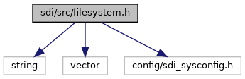
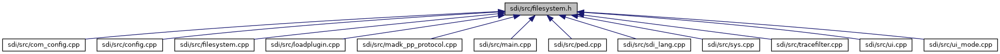

[Namespaces](#namespaces) \| [Macros](#define-members) \| [Enumerations](#enum-members) \| [Functions](#func-members)

`#include <string>`
`#include <vector>`
`#include "config/sdi_sysconfig.h"`

Include dependency graph for filesystem.h:

This graph shows which files directly or indirectly include this file:

<a href="filesystem_8h_source.md">Go to the source code of this file.</a>

|  |  |
|----|----|
| Namespaces |  |
|   | <a href="namespacesdi.md">sdi</a> |
|   | <a href="namespacesdi_1_1filesystem.md">sdi::filesystem</a> |

|  |  |
|----|----|
| Macros |  |
| #define  | [COM_PREFIX](#a2769e27c37b885ec659cfe0e8c1869db)   \"com/\" |
| #define  | [COM_ANDROID](#ac278bcdddd78c220ad998fea1a09d6f7)   \"com/android/\" |
| #define  | [CONNECT_LAN_FILE](#a92ce1a2af2a3e7dc7e9008c33c3e6401)   \"CONNECT_LAN.XML\" |
| #define  | [CONNECT_BT_FILE](#abe530485014f4ab5488b06eeac2012c8)   \"CONNECT_BT.XML\" |
| #define  | [CONNECT_WIFI_FILE](#a8a2c552367b81210202b43dafb25033f)   \"CONNECT_WIFI.XML\" |
| #define  | [CONNECT_USB_SER_FILE](#a1a2fb7357dd68e75dc5abdc434d118ae)   \"CONNECT_USB_SER.XML\" |
| #define  | [CONNECT_USB_LAN_FILE](#a6019318e7595a1293d99e1317df39212)   \"CONNECT_USB_LAN.XML\" |
| #define  | [CONNECT_COM1A_FILE](#aef4e9c091e5c43525f408f3a84046509)   \"CONNECT_COM1A.XML\" |
| #define  | [CONNECT_BLE_FILE](#a82bd8395c8cfae7a8095fefc4c80044f)   \"CONNECT_BLE.XML\" |
| #define  | [CONNECT_COM1_FILE](#a1e38fcca5e2dba22a426b16541945189)   \"CONNECT_COM1.XML\" |
| #define  | [CONNECT_ANY_FILE](#a1b0fac2a8edb0b2daed9ea579fc83261)   \"CONNECT_ANY.XML\" |
| #define  | [CONNECT_LO_FILE](#aaf6d4d7ca594a57c21d41f1290dc8c3c)   \"CONNECT_LO.XML\" |
| #define  | [CONNECT_ANDROID_FILE](#a3958614289e18ea708bf7009516015f5)   \"CONNECT_ANDROID.XML\" |
| #define  | [BLE_GATT_FILE](#a3c2bbdd4fac019c8a016b80271eb8bee)   \"gatt.xml\" |
| #define  | [LOCAL_NET_BT_PAN_FILE](#ad9eb6e49bc1ba05814d88f436b8d61d1)   \"LOCAL_NET_BT_PAN.xml\" |
| #define  | [CCP_DATABASE_FILE](#ae18d274ab67a751241c02ee53845933f)   \"ccp.db\" |
| #define  | [COM_IF_CONFIG_FILE](#a494cf4ef18435398dd718b12d88e4630)   \"COM_IF.CFG\" |
| #define  | [SEC_PREFIX](#ab7808bea5a1641bd08d3fdbcbcff28b0)   \"sec/\" |
| #define  | [ADKSEC_CONFIG_FILE](#a77c8fbb0082771eb56e23ae37b836d32)   \"sccfg.json\" |
| #define  | [EPP_PREFIX](#a35f3b83a3afa2fb19e1f1e1c83a5cbdd)   \"epp/\" |
| #define  | [CT_PREFIX](#a9704dcb5bac8c1446e0e4334f4a65963)   \"ct/\" |
| #define  | [EPP_CONFIG_FILE](#ab4b4d0fea96b1a72416c160e38f77ea7)   \"epp.json\" |
| #define  | [LOCAL_NET_USB_CT](#a06023847d4a5e43b20f08b779d0c12d9)   \"LOCAL_NET_USB_CT.xml\" |
| #define  | [LOCAL_NET_USB_EPP](#a5575e24e8162c501436779f85fe75fd0)   \"LOCAL_NET_USB_EPP.xml\" |
| #define  | [CONNECT_EPP_TLS](#ab3e0fbcede276f0f6d414a10e4738ccf)   \"CONNECT_EPP_TLS.XML\" |
| #define  | [EMV_PREFIX](#a34ad36665d4cec9fe9322f981208052c)   \"emv/\" |
| #define  | [EMV_DESIRED_FILE](#a3dea468e943b43d72f744dcb40cf8bd4)   \"emv-desired.xml\" |
| #define  | [EMV_FLASH_CONFIG_FILES](#af6832e654684f444957c1a16cbfffca2)   \"EMV\_.\*\\\\.xml\" |
| #define  | [SDI_TRX_DATA_FILE](#ad43412fa537783d4c924f9e4e9a964d3)   \"sdi_trx.dat\" |
| #define  | [WHITELIST_FILE](#a20385395776edd2bd2c492160105bae8)   \"whitelist.json\" |
| #define  | [SENSITIVE_TAGS_FILE](#a9f0d04f1477bacd897ad137c11ab8c61)   \"sensitivetags.json\" |
| #define  | [CARD_RANGES_FILE](#ad059bf4295de52a22bdaef67c173c4b7)   \"cardranges.json\" |
| #define  | [STATUS_CFG_FILE](#aa03ebe1b19c6fb6ac62a4028ee388b7f)   \"STATUS.CFG\" |
| #define  | [IDLETEXT_CFG_FILE](#ada7058f236a751539bee4f2313301b05)   \"IDLETEXT.CFG\" |
| #define  | [SDI_CONFIG_FILE](#a977077fc4159676a7867acdc1f940ea4)   \"config.json\" |
| #define  | [SDI_ACL_FILE](#a92db0298c66513502b66230470da054e)   \"acl.json\" |
| #define  | [FS_CHECKSUMS_FILE](#a2c585e9f1681214e77b74c3035467633)   \"checksums.json\" |
| #define  | [UPDATE_REMOVE_FILE](#a48533203b3ec3c60f01d6eb6db397f3c)   \"remove.json\" |
| #define  | [PLUGIN_PREFIX](#ade68c478230cc910fd42088b23a50469)   \"plugin/\" |
| #define  | [PLUGIN_EXT](#a35a8a8490296aaab573191e17924ae82)   \".so\" |
| #define  | [PLUGIN_PATTERN](#ae3f54c6ea2eb0c81566552ae0dcc6bc9)   \"libsdiplugin.\*\\\\\" PLUGIN_EXT |
| #define  | [PLUGIN_CONFIG_PATTERN](#aa607fc35ca1d341e94853b44c73380c8)   \"libsdiplugin.\*\\\\.(cfg\|json)\" |
| #define  | [GCKERNEL_PATTERN](#afd90919ccac841a8e729532380332662)   \"libEMV_CTLS_GC\[0-9\]{6}\\\\.so\" |
| #define  | [LOG_PREFIX](#aae1d11681b36518afb9413f4194b18a6)   \"log/\" |
| #define  | [LOG_CONFIG_FILES](#a286447999b2f48757ec1eea2451fbfe6)   \".\*\_log\\\\.conf\" |
| #define  | [NFC_PREFIX](#a6ba1796ec4977bdd663f9e70fbaad071)   \"nfc/\" |
| #define  | [NFC_WKY_FILES](#a8a63178f68224396be284285ca51194f)   \".\*\\\\.wky\" |
| #define  | [FONT_PREFIX](#a72bcfaa3ad4db9b05c27818c5386128b)   \"fonts/\" |
| #define  | [FONT_FILES](#a59ab8dafc42c24fb5b9e20b046714c64)   \".\*\\\\.(afm\|fnt\|fon\|gsf\|otf\|pfa\|pfb\|pfm\|ttc\|ttf)\" |
| #define  | [EMV_CONFIG_TARBALL](#ae908c62849ce263bc2aa556ee774ad8f)   \"emv-config.tar\" |

|  |  |
|----|----|
| Enumerations |  |
| enum   | <a href="namespacesdi_1_1filesystem.md#a0b27accd35d4c377ef3a7c04b82a8b1f">FilesModes</a> { <a href="namespacesdi_1_1filesystem.md#a0b27accd35d4c377ef3a7c04b82a8b1fa01ae168a66b5e79c94c5eccc153602b1">FM_Default</a> = 0, <a href="namespacesdi_1_1filesystem.md#a0b27accd35d4c377ef3a7c04b82a8b1fa47ea781826f29e64b46f2feb5780be07">FM_NoAbort</a> = 1, <a href="namespacesdi_1_1filesystem.md#a0b27accd35d4c377ef3a7c04b82a8b1faf990ad75b23de549d4a319237a47974f">FM_Quiet</a> = 2, <a href="namespacesdi_1_1filesystem.md#a0b27accd35d4c377ef3a7c04b82a8b1fa1a3a418ff306a51b0124aca8c1ca1bac">FM_KeepTopDir</a> = 4 } |

|  |  |
|----|----|
| Functions |  |
| void  | <a href="namespacesdi_1_1filesystem.md#a43918d493a7f56eef174f3c9a82a8e20">init</a> (enum config::SdiSysConfig::SDIMode sdi_mode) |
| void  | <a href="namespacesdi_1_1filesystem.md#a12545d574e9182af24a177d1cf453c0c">factory_reset</a> () |
| bool  | <a href="namespacesdi_1_1filesystem.md#ad9ecf729e46fab7ad576ed4bc9b4b2cf">read_file</a> (const char \*file, std::string &data) |
| bool  | <a href="namespacesdi_1_1filesystem.md#a0c3b0966ff7d9a48ffef25f5c1715e82">write_file</a> (const char \*file, const std::string &data) |
| bool  | <a href="namespacesdi_1_1filesystem.md#afa6d3c16d20a51cd378284f6829cebf0">copy_file</a> (const std::string &src, const std::string &dest) |
| bool  | <a href="namespacesdi_1_1filesystem.md#acc0eb80e0e44c07c5f0edfa0763150a5">move_file</a> (const std::string &src, const std::string &dest) |
| int  | <a href="namespacesdi_1_1filesystem.md#a1141fe1b44fce28b28f053c07fc3d591">get_dir_files</a> (const char \*dir, std::vector\< std::string \> \*files=0, const char \*regex=0) |
| int  | <a href="namespacesdi_1_1filesystem.md#a97c401199b467196a4e427c5c51ac5d3">copy_files</a> (const std::vector\< std::string \> &files, const char \*dst_dir, unsigned modes=FM_Default) |
| int  | <a href="namespacesdi_1_1filesystem.md#ae04fc0d5bbc079cc49174bbe72ec2d7c">remove_files</a> (const std::vector\< std::string \> &files, unsigned modes=FM_Default) |
| int  | <a href="namespacesdi_1_1filesystem.md#add3a308833cddc7775215c8fc3d1d608">remove_dir</a> (const std::string &path, unsigned modes=FM_Default) |
| int  | <a href="namespacesdi_1_1filesystem.md#a3f65ebfc86c128bc4d198e376e187ff7">extract_tar</a> (const std::string &tarfile, const std::string &destdir, const char \*regex=0) |
| const char \*  | <a href="namespacesdi_1_1filesystem.md#a52dd354a0640fd070653611d6de4722b">binary_dir</a> () |
| const char \*  | <a href="namespacesdi_1_1filesystem.md#a0de1824701ee8494b54c3c97cb17039b">home_flash_dir</a> () |
| std::string  | <a href="namespacesdi_1_1filesystem.md#a5748ac7656cef8d6b10941d76eac115d">home_flash_file</a> (const std::string &file) |
| const char \*  | <a href="namespacesdi_1_1filesystem.md#a1eee0f47abbf3108854b4178e194ba45">home_config_dir</a> () |
| std::string  | <a href="namespacesdi_1_1filesystem.md#ab8862ea906c088c55072c8ea390c0adc">home_config_file</a> (const std::string &file) |
| const char \*  | <a href="namespacesdi_1_1filesystem.md#a1518fc71a30bfab59f82fc1a2726c627">ext_config_dir</a> () |
| std::string  | <a href="namespacesdi_1_1filesystem.md#a3f6f1faaea3bfa5fb011c57ec15c7749">lookup_config_file</a> (const std::string &file) |
| const char \*  | <a href="namespacesdi_1_1filesystem.md#a817ffa0e3dd4d66ee5a1717aac4c94b8">emv_flash_dir</a> () |
| const char \*  | <a href="namespacesdi_1_1filesystem.md#a65ac0c4801674fbc1832569c7f34457d">emv_config_dir</a> () |
| const char \*  | <a href="namespacesdi_1_1filesystem.md#a1ba2e0d2621785a746e8a2bc2b85bfab">log_config_dir</a> () |
| const char \*  | <a href="namespacesdi_1_1filesystem.md#a3eb6af6e0de2e982c40979a8282da21b">nfc_flash_dir</a> () |
| const char \*  | <a href="namespacesdi_1_1filesystem.md#a98b1808447b0f9e7848b35156a4c7cc9">home_lib_dir</a> () |
| const char \*  | <a href="namespacesdi_1_1filesystem.md#ae7f61379f5979fbb09444be76ab12a1f">ext_plugin_dir</a> () |
| const char \*  | <a href="namespacesdi_1_1filesystem.md#a383b7331d5268ea154c61f4ff4eb6ab8">plugin_config_dir</a> () |
| const char \*  | <a href="namespacesdi_1_1filesystem.md#a01f85298159181054db31598024a039e">ext_font_dir</a> () |
| const char \*  | <a href="namespacesdi_1_1filesystem.md#a9bc32456ce574dce7e0dbee9f49ed5cd">tmp_dir</a> () |
| const char \*  | <a href="namespacesdi_1_1filesystem.md#a34a571792ddd1cbbe291af193597d9a0">upload_install_dir</a> (bool flash) |
| const char \*  | <a href="namespacesdi_1_1filesystem.md#a6c67d203b4323cce1f3c274d3f2827ee">sys_remove_sponsor_dir</a> () |
| const char \*  | <a href="namespacesdi_1_1filesystem.md#ac4b7a1244864c6c42d667f71e517c129">ccp_resource_dir</a> () |
| const char \*  | <a href="namespacesdi_1_1filesystem.md#a8705c6880d517d88098ddd7aa1e3716d">ccp_database_dir</a> () |
| const char \*  | <a href="namespacesdi_1_1filesystem.md#a62f821b6937b4f380d3e22cde31d2920">sdi_update_dir</a> () |
| const char \*  | <a href="namespacesdi_1_1filesystem.md#aeddca685a1e934168171cfef8ef8697e">sdi_persist_dir</a> (bool system) |
| const char \*  | <a href="namespacesdi_1_1filesystem.md#abfa13da98e3a50c8c79f55671a6c71be">sdi_certstore_dir</a> () |
| unsigned short  | <a href="namespacesdi_1_1filesystem.md#a292b4583cbbd3327c059f32edc6e6168">install_emv_config_package</a> (const std::string &emv_config_pkg) |
| unsigned short  | <a href="namespacesdi_1_1filesystem.md#ad41174b98a363bf48bbcfc62984939ef">install_user_configuration</a> (bool recover) |
| unsigned short  | <a href="namespacesdi_1_1filesystem.md#abfc178565b6c9e326831f7ef51646744">remove_user_configuration</a> () |
| unsigned short  | <a href="namespacesdi_1_1filesystem.md#af65203b969499e2d36e34c08172a9f30">install_sdi_plugins</a> (bool recover) |
| unsigned short  | <a href="namespacesdi_1_1filesystem.md#ac42ad54eda4b15aa9d9f2d7bda4a55a5">remove_sdi_plugins</a> () |

## MacroDefinition Documentation {#macro-definition-documentation}

## ADKSEC_CONFIG_FILE 

#define ADKSEC_CONFIG_FILE   \"sccfg.json\"

## BLE_GATT_FILE 

#define BLE_GATT_FILE   \"gatt.xml\"

## CARD_RANGES_FILE 

#define CARD_RANGES_FILE   \"cardranges.json\"

## CCP_DATABASE_FILE 

#define CCP_DATABASE_FILE   \"ccp.db\"

## COM_ANDROID 

#define COM_ANDROID   \"com/android/\"

## COM_IF_CONFIG_FILE 

#define COM_IF_CONFIG_FILE   \"COM_IF.CFG\"

## COM_PREFIX 

#define COM_PREFIX   \"com/\"

## CONNECT_ANDROID_FILE 

#define CONNECT_ANDROID_FILE   \"CONNECT_ANDROID.XML\"

## CONNECT_ANY_FILE 

#define CONNECT_ANY_FILE   \"CONNECT_ANY.XML\"

## CONNECT_BLE_FILE 

#define CONNECT_BLE_FILE   \"CONNECT_BLE.XML\"

## CONNECT_BT_FILE 

#define CONNECT_BT_FILE   \"CONNECT_BT.XML\"

## CONNECT_COM1_FILE 

#define CONNECT_COM1_FILE   \"CONNECT_COM1.XML\"

## CONNECT_COM1A_FILE 

#define CONNECT_COM1A_FILE   \"CONNECT_COM1A.XML\"

## CONNECT_EPP_TLS 

#define CONNECT_EPP_TLS   \"CONNECT_EPP_TLS.XML\"

## CONNECT_LAN_FILE 

#define CONNECT_LAN_FILE   \"CONNECT_LAN.XML\"

## CONNECT_LO_FILE 

#define CONNECT_LO_FILE   \"CONNECT_LO.XML\"

## CONNECT_USB_LAN_FILE 

#define CONNECT_USB_LAN_FILE   \"CONNECT_USB_LAN.XML\"

## CONNECT_USB_SER_FILE 

#define CONNECT_USB_SER_FILE   \"CONNECT_USB_SER.XML\"

## CONNECT_WIFI_FILE 

#define CONNECT_WIFI_FILE   \"CONNECT_WIFI.XML\"

## CT_PREFIX 

#define CT_PREFIX   \"ct/\"

## EMV_CONFIG_TARBALL 

#define EMV_CONFIG_TARBALL   \"emv-config.tar\"

## EMV_DESIRED_FILE 

#define EMV_DESIRED_FILE   \"emv-desired.xml\"

## EMV_FLASH_CONFIG_FILES 

#define EMV_FLASH_CONFIG_FILES   \"EMV\_.\*\\\\.xml\"

## EMV_PREFIX 

#define EMV_PREFIX   \"emv/\"

## EPP_CONFIG_FILE 

#define EPP_CONFIG_FILE   \"epp.json\"

## EPP_PREFIX 

#define EPP_PREFIX   \"epp/\"

## FONT_FILES 

#define FONT_FILES   \".\*\\\\.(afm\|fnt\|fon\|gsf\|otf\|pfa\|pfb\|pfm\|ttc\|ttf)\"

## FONT_PREFIX 

#define FONT_PREFIX   \"fonts/\"

## FS_CHECKSUMS_FILE 

#define FS_CHECKSUMS_FILE   \"checksums.json\"

## GCKERNEL_PATTERN 

#define GCKERNEL_PATTERN   \"libEMV_CTLS_GC\[0-9\]{6}\\\\.so\"

## IDLETEXT_CFG_FILE 

#define IDLETEXT_CFG_FILE   \"IDLETEXT.CFG\"

## LOCAL_NET_BT_PAN_FILE 

#define LOCAL_NET_BT_PAN_FILE   \"LOCAL_NET_BT_PAN.xml\"

## LOCAL_NET_USB_CT 

#define LOCAL_NET_USB_CT   \"LOCAL_NET_USB_CT.xml\"

## LOCAL_NET_USB_EPP 

#define LOCAL_NET_USB_EPP   \"LOCAL_NET_USB_EPP.xml\"

## LOG_CONFIG_FILES 

#define LOG_CONFIG_FILES   \".\*\_log\\\\.conf\"

## LOG_PREFIX 

#define LOG_PREFIX   \"log/\"

## NFC_PREFIX 

#define NFC_PREFIX   \"nfc/\"

## NFC_WKY_FILES 

#define NFC_WKY_FILES   \".\*\\\\.wky\"

## PLUGIN_CONFIG_PATTERN 

#define PLUGIN_CONFIG_PATTERN   \"libsdiplugin.\*\\\\.(cfg\|json)\"

## PLUGIN_EXT 

#define PLUGIN_EXT   \".so\"

## PLUGIN_PATTERN 

#define PLUGIN_PATTERN   \"libsdiplugin.\*\\\\\" PLUGIN_EXT

## PLUGIN_PREFIX 

#define PLUGIN_PREFIX   \"plugin/\"

## SDI_ACL_FILE 

#define SDI_ACL_FILE   \"acl.json\"

## SDI_CONFIG_FILE 

#define SDI_CONFIG_FILE   \"config.json\"

## SDI_TRX_DATA_FILE 

#define SDI_TRX_DATA_FILE   \"sdi_trx.dat\"

## SEC_PREFIX 

#define SEC_PREFIX   \"sec/\"

## SENSITIVE_TAGS_FILE 

#define SENSITIVE_TAGS_FILE   \"sensitivetags.json\"

## STATUS_CFG_FILE 

#define STATUS_CFG_FILE   \"STATUS.CFG\"

## UPDATE_REMOVE_FILE 

#define UPDATE_REMOVE_FILE   \"remove.json\"

## WHITELIST_FILE 

#define WHITELIST_FILE   \"whitelist.json\"

