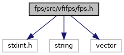

[Namespaces](#namespaces) \| [Macros](#define-members) \| [Typedefs](#typedef-members) \| [Enumerations](#enum-members) \| [Functions](#func-members)

`#include <stdint.h>`
`#include <string>`
`#include <vector>`

Include dependency graph for fps.h:

<a href="fps_8h_source.md">Go to the source code of this file.</a>

|            |                                                  |
|------------|--------------------------------------------------|
| Namespaces |                                                  |
|            | <a href="namespacevfifps.md">vfifps</a> |

|          |                                               |
|----------|-----------------------------------------------|
| Macros   |                                               |
| #define  | [DllSpec](#ad7c2e1cb200073ed64c64285a5f37231) |

|  |  |
|----|----|
| Typedefs |  |
| typedef void(\*  | <a href="namespacevfifps.md#a1533c279c5718316ff33db1874a98c2e">resultCallbackType</a>) (void \*dataptr, FPS_CB_Type msgType, int width, std::vector\< unsigned char \> <a href="titusstubs_8cpp.md#structraw_data">rawData</a>) |

|  |  |
|----|----|
| Enumerations |  |
| enum   | <a href="namespacevfifps.md#a3c1df956eda8f33eb06d11d024147870">FPS_RES_Type</a> { <a href="namespacevfifps.md#a3c1df956eda8f33eb06d11d024147870ad734b6d4c08ca860ae63c788ad44596f">FPS_RES_SUCCESS</a> = 0, <a href="namespacevfifps.md#a3c1df956eda8f33eb06d11d024147870a00a8574f25755783ed93b0ac179e9668">FPS_RES_FAILURE</a> = -1, <a href="namespacevfifps.md#a3c1df956eda8f33eb06d11d024147870ac442a125e0942b5a31c934464c026a0a">FPS_RES_NO_PROP</a> = -2, <a href="namespacevfifps.md#a3c1df956eda8f33eb06d11d024147870a27ad11a3e1003b122e4e2cb3c22a3d7c">FPS_RES_INFO_NOT_READ</a> = -3 } |
| enum   | <a href="namespacevfifps.md#a5d7a8d9c16c82913bda07e2105783e0b">FPS_CB_Type</a> {   <a href="namespacevfifps.md#a5d7a8d9c16c82913bda07e2105783e0ba84fe43ea9b96ff3045a0eba99fe8954e">FPS_CB_DATA</a>, <a href="namespacevfifps.md#a5d7a8d9c16c82913bda07e2105783e0bad5b77e1822475ee4e0613f3ace7b97cf">FPS_CB_ERROR</a>, <a href="namespacevfifps.md#a5d7a8d9c16c82913bda07e2105783e0baa6f84cab351ca2d17e25680e866afb74">FPS_CB_INFO_BACKWARD_MOVEMENT</a>, <a href="namespacevfifps.md#a5d7a8d9c16c82913bda07e2105783e0bae19c543080e3618fa126508090986da6">FPS_CB_INFO_BAD_QUALITY</a>,   <a href="namespacevfifps.md#a5d7a8d9c16c82913bda07e2105783e0ba7db7066974c9ab1cec3f37de1f0a4932">FPS_CB_INFO_CALIB_START</a>, <a href="namespacevfifps.md#a5d7a8d9c16c82913bda07e2105783e0ba305dee8a6d3d4533be1beb7f5250d37f">FPS_CB_INFO_CENTER_AND_PRESS_HARDER</a>, <a href="namespacevfifps.md#a5d7a8d9c16c82913bda07e2105783e0ba92ebad09a3cb0487835673453ffe5209">FPS_CB_INFO_CLEAN_SENSOR</a>, <a href="namespacevfifps.md#a5d7a8d9c16c82913bda07e2105783e0ba60dc0416ab3e73510defa8119da9389b">FPS_CB_INFO_CONSOLIDATION_FAIL</a>,   <a href="namespacevfifps.md#a5d7a8d9c16c82913bda07e2105783e0baffb3a61ba0e2091c6736e64d893608cf">FPS_CB_INFO_CONSOLIDATION_SUCCEED</a>, <a href="namespacevfifps.md#a5d7a8d9c16c82913bda07e2105783e0baf177d44ec60da2c5c4dbdd83f8ca6cee">FPS_CB_INFO_ENROLL_START</a>, <a href="namespacevfifps.md#a5d7a8d9c16c82913bda07e2105783e0baa9dc6d82477af8cc9c4999ef0a9d0640">FPS_CB_INFO_ENROLL_PROGRESS</a>, <a href="namespacevfifps.md#a5d7a8d9c16c82913bda07e2105783e0bab6148b4eae7488dbe57278db50158687">FPS_CB_INFO_FINGER_DETECT_START</a>,   <a href="namespacevfifps.md#a5d7a8d9c16c82913bda07e2105783e0bab8b190de5f68ab4ed1e9e9849481b2bc">FPS_CB_INFO_FINGERLEFT</a>, <a href="namespacevfifps.md#a5d7a8d9c16c82913bda07e2105783e0ba6b4af8e322a7d5c9cb5da4b56e7b4be1">FPS_CB_INFO_FINGERRIGHT</a>, <a href="namespacevfifps.md#a5d7a8d9c16c82913bda07e2105783e0baa7a904becc2adad54a976e6064ce144b">FPS_CB_INFO_FINGERTOP</a>, <a href="namespacevfifps.md#a5d7a8d9c16c82913bda07e2105783e0ba443f3d7e979ef9ca410cd84569d6b2dc">FPS_CB_INFO_FINGERBOTTOM</a>,   <a href="namespacevfifps.md#a5d7a8d9c16c82913bda07e2105783e0ba832d40195f58cfa3d935970735116ce4">FPS_CB_INFO_GOOD_IMAGE</a>, <a href="namespacevfifps.md#a5d7a8d9c16c82913bda07e2105783e0ba306f34d4e771bdeffdb6cf71b3f7d8a6">FPS_CB_INFO_GUI_FINISH</a>, <a href="namespacevfifps.md#a5d7a8d9c16c82913bda07e2105783e0ba144fdeb4fbb2e80a2a588df545b18b38">FPS_CB_INFO_GUI_FINISH_DETECT_START</a>, <a href="namespacevfifps.md#a5d7a8d9c16c82913bda07e2105783e0ba34b79957cb55a81efe2847afca48ae29">FPS_CB_INFO_GUI_FINISH_FAIL</a>,   <a href="namespacevfifps.md#a5d7a8d9c16c82913bda07e2105783e0bac3e41f171cd72c71064f3015012e8769">FPS_CB_INFO_GUI_FINISH_SUCCEED</a>, <a href="namespacevfifps.md#a5d7a8d9c16c82913bda07e2105783e0ba96e135543aa06812326ff9ca38bdd345">FPS_CB_INFO_IMAGE_PROCESSED</a>, <a href="namespacevfifps.md#a5d7a8d9c16c82913bda07e2105783e0ba1ba642b17ea14f9320dcabb7a3db8d92">FPS_CB_INFO_JOINT_DETECTED</a>, <a href="namespacevfifps.md#a5d7a8d9c16c82913bda07e2105783e0baeb18217ac28f5d6656642a8098035084">FPS_CB_INFO_KEEP_FINGER</a>,   <a href="namespacevfifps.md#a5d7a8d9c16c82913bda07e2105783e0ba055cfc2dd7a73a740e6fb73c060ad94c">FPS_CB_INFO_NO_FINGER</a>, <a href="namespacevfifps.md#a5d7a8d9c16c82913bda07e2105783e0ba42519f5be19064f77e65e239e1b36144">FPS_CB_INFO_PROCESSING_IMAGE</a>, <a href="namespacevfifps.md#a5d7a8d9c16c82913bda07e2105783e0ba1886e93031810f14479b1faa77df8e2e">FPS_CB_INFO_PUT_FINGER</a>, <a href="namespacevfifps.md#a5d7a8d9c16c82913bda07e2105783e0ba62b4dbaab0c5cd40b64c94073e0f87c2">FPS_CB_INFO_PUT_FINGER2</a>,   <a href="namespacevfifps.md#a5d7a8d9c16c82913bda07e2105783e0baa47a6648946ad8dffc21eed18bb7db83">FPS_CB_INFO_PUT_FINGER3</a>, <a href="namespacevfifps.md#a5d7a8d9c16c82913bda07e2105783e0ba388f341d89a5237ffe71738b212284f1">FPS_CB_INFO_PUT_FINGER4</a>, <a href="namespacevfifps.md#a5d7a8d9c16c82913bda07e2105783e0ba29f94b2001c06a9bd993f42697184623">FPS_CB_INFO_PUT_FINGER5</a>, <a href="namespacevfifps.md#a5d7a8d9c16c82913bda07e2105783e0ba08a08925cfa56c984392fe5f0f08f25d">FPS_CB_INFO_REMOVE_FINGER</a>,   <a href="namespacevfifps.md#a5d7a8d9c16c82913bda07e2105783e0ba01a4bfc51d4f59e597c70a7a5ba06fea">FPS_CB_INFO_START</a>, <a href="namespacevfifps.md#a5d7a8d9c16c82913bda07e2105783e0bafad5c808443372f146079e4134a6fab2">FPS_CB_INFO_SWIPE_IN_PROGRESS</a>, <a href="namespacevfifps.md#a5d7a8d9c16c82913bda07e2105783e0ba4f0f256adfff299b59d31bb3bd37e063">FPS_CB_INFO_TOO_DARK</a>, <a href="namespacevfifps.md#a5d7a8d9c16c82913bda07e2105783e0ba7b8ec4d80640e9e7d01a20b6474f36bf">FPS_CB_INFO_TOO_DRY</a>,   <a href="namespacevfifps.md#a5d7a8d9c16c82913bda07e2105783e0ba7f5db237cc9ebd5a4fcc2da14a6ac5b2">FPS_CB_INFO_TOO_FAST</a>, <a href="namespacevfifps.md#a5d7a8d9c16c82913bda07e2105783e0ba6402d3434046a7825e98886d19745da9">FPS_CB_INFO_TOO_HIGH</a>, <a href="namespacevfifps.md#a5d7a8d9c16c82913bda07e2105783e0ba2e7decb9b5a4eb02d0e62198a676d3c5">FPS_CB_INFO_TOO_LEFT</a>, <a href="namespacevfifps.md#a5d7a8d9c16c82913bda07e2105783e0ba095b21b5793b83493f65d330380024df">FPS_CB_INFO_TOO_LIGHT</a>,   <a href="namespacevfifps.md#a5d7a8d9c16c82913bda07e2105783e0ba04eb7784eef19503b5d156cdbc8d0e00">FPS_CB_INFO_TOO_LOW</a>, <a href="namespacevfifps.md#a5d7a8d9c16c82913bda07e2105783e0ba1b2a61e080f36309dcb038c668be67b2">FPS_CB_INFO_TOO_RIGHT</a>, <a href="namespacevfifps.md#a5d7a8d9c16c82913bda07e2105783e0bafebb3b97ae2a1afa00a7058abfa821ad">FPS_CB_INFO_TOO_SHORT</a>, <a href="namespacevfifps.md#a5d7a8d9c16c82913bda07e2105783e0ba9022096640a0819b342fbb27e14ddb15">FPS_CB_INFO_TOO_SKEWED</a>,   <a href="namespacevfifps.md#a5d7a8d9c16c82913bda07e2105783e0ba7ae49728abdb2a0f5b81855a51dd2f60">FPS_CB_INFO_TOO_SMALL</a>, <a href="namespacevfifps.md#a5d7a8d9c16c82913bda07e2105783e0ba71389ab703cd25bf1c1699560646a27b">FPS_CB_INFO_TOO_STRANGE</a>, <a href="namespacevfifps.md#a5d7a8d9c16c82913bda07e2105783e0bacbd17103c399e23a497a9dc95fc416a2">FPS_CB_INFO_TOUCH_SENSOR</a>, <a href="namespacevfifps.md#a5d7a8d9c16c82913bda07e2105783e0ba3dd8259f433b7a4345e6ea365b8431d1">FPS_CB_INFO_VERIFY_START</a>,   <a href="namespacevfifps.md#a5d7a8d9c16c82913bda07e2105783e0bacaac8be8010f044f993111acfad8ba0a">FPS_CB_PICTURE</a>, <a href="namespacevfifps.md#a5d7a8d9c16c82913bda07e2105783e0bac6d12b2fe8224338b1acbb6ca669ac99">FPS_CB_ANSI_DATA</a>, <a href="namespacevfifps.md#a5d7a8d9c16c82913bda07e2105783e0bac1b8153e221d565bbb0639dc0e160973">FPS_CB_ISO_DATA</a>, <a href="namespacevfifps.md#a5d7a8d9c16c82913bda07e2105783e0baf4a7f345ea2cb22d3496c61862a8128c">FPS_CB_PGM_DATA</a> } |
| enum   | <a href="namespacevfifps.md#af96966f9c2d007371a573af52137396c">FPS_PROP_INT_Type</a> {   <a href="namespacevfifps.md#af96966f9c2d007371a573af52137396ca5fd73ed7b64a99066d18234779cc768e">FPS_PROP_INT_VERSION</a>, <a href="namespacevfifps.md#af96966f9c2d007371a573af52137396ca7d380debdfe5fd6d07a492363de957f3">FPS_PROP_INT_INFO</a>, <a href="namespacevfifps.md#af96966f9c2d007371a573af52137396ca7dcfb5a4692a1f838f1a89bd79da4eff">FPS_PROP_INT_MINNEXTVERSION</a>, <a href="namespacevfifps.md#af96966f9c2d007371a573af52137396ca19be2ba5702c8157c50567ab9565a901">FPS_PROP_INT_VARIANT</a>,   <a href="namespacevfifps.md#af96966f9c2d007371a573af52137396cae51635291ffea7eb485f94392d7d2b6b">FPS_PROP_INT_FUNCTIONALITY</a>, <a href="namespacevfifps.md#af96966f9c2d007371a573af52137396cabd884e03da5adb4ede39293ccb3f3c02">FPS_PROP_INT_CONFIG</a>, <a href="namespacevfifps.md#af96966f9c2d007371a573af52137396ca1ea544508442573db51171bcf8bad16f">FPS_PROP_INT_ID</a>, <a href="namespacevfifps.md#af96966f9c2d007371a573af52137396cae46d9d075469e89e20d99dc785f034a1">FPS_PROP_INT_AUTHENTIFYID</a>,   <a href="namespacevfifps.md#af96966f9c2d007371a573af52137396cae101c15c4764203b64e60928d36f56d9">FPS_PROP_INT_USAGE</a>, <a href="namespacevfifps.md#af96966f9c2d007371a573af52137396caf8c0384fbf2ab3078ce5ee61453b611e">FPS_PROP_INT_SENSORTYPE</a>, <a href="namespacevfifps.md#af96966f9c2d007371a573af52137396ca6d032055886e50141810e73e0b4af413">FPS_PROP_INT_IMAGEWIDTH</a>, <a href="namespacevfifps.md#af96966f9c2d007371a573af52137396ca0a1ee2e1ed860474a5e4dd930918262a">FPS_PROP_INT_IMAGEHEIGHT</a>,   <a href="namespacevfifps.md#af96966f9c2d007371a573af52137396cae6db6adef8b3771d27a4e72ccb79edab">FPS_PROP_INT_MAXGRABWINDOW</a>, <a href="namespacevfifps.md#af96966f9c2d007371a573af52137396ca4786bbb0e08669892b8e270e2528d9a3">FPS_PROP_INT_COMPANIONVENDORCODE</a>, <a href="namespacevfifps.md#af96966f9c2d007371a573af52137396ca4a2a698dbb7e42a1ac6c8a324d125ec3">FPS_PROP_INT_VERSIONEXT</a>, <a href="namespacevfifps.md#af96966f9c2d007371a573af52137396ca5f8512e22d638abe46541245bdf52532">FPS_PROP_INT_SYSTEMID</a>,   <a href="namespacevfifps.md#af96966f9c2d007371a573af52137396cace5aaae29cb8194bc70ac87d1fa3c90b">FPS_PROP_INT_DATATYPE</a>, <a href="namespacevfifps.md#af96966f9c2d007371a573af52137396ca6709f98fbd780c2cfe1439ccbbb848ae">FPS_PROP_INT_IMAGE_QUALITY_LAST</a>, <a href="namespacevfifps.md#af96966f9c2d007371a573af52137396cacb7e2d9e5580b07273a1246c693216a5">FPS_PROP_INT_IMAGE_NUMBER_OF_MINUTIAE_LAST</a>, <a href="namespacevfifps.md#af96966f9c2d007371a573af52137396ca0a0cbaeeed2746d81f2aa231342c06fb">FPS_PROP_INT_IMAGE_SIZE</a> } |
| enum   | <a href="namespacevfifps.md#a94a6e9df02d10dc416e0a1e1b0b6dde7">FPS_PROP_STRING_Type</a> {   <a href="namespacevfifps.md#a94a6e9df02d10dc416e0a1e1b0b6dde7af3d5f46fa532530f27ddc4141dde5cc7">FPS_PROP_STRING_EXTINFO</a>, <a href="namespacevfifps.md#a94a6e9df02d10dc416e0a1e1b0b6dde7a367c168de784483d15f092018f8a2040">FPS_PROP_STRING_INFO</a>, <a href="namespacevfifps.md#a94a6e9df02d10dc416e0a1e1b0b6dde7a5ca8e04652708c1e25a1f0248f2b83ba">FPS_PROP_STRING_TYPE</a>, <a href="namespacevfifps.md#a94a6e9df02d10dc416e0a1e1b0b6dde7ae257bab40a9052975daaa20e49082cb0">FPS_PROP_STRING_HWINFO</a>,   <a href="namespacevfifps.md#a94a6e9df02d10dc416e0a1e1b0b6dde7a0da07d6f8c852bc533ee3f07a6a46c36">FPS_PROP_STRING_GUID</a>, <a href="namespacevfifps.md#a94a6e9df02d10dc416e0a1e1b0b6dde7ac19d3ef4cfa3a54e697a6116272e7fac">FPS_PROP_STRING_SYSTEMNAME</a> } |
| enum   | <a href="namespacevfifps.md#af3c1346c7455895cfa8c46ccffdf7d50">FPS_IMG_Type</a> {   <a href="namespacevfifps.md#af3c1346c7455895cfa8c46ccffdf7d50a44530167bb477ee327f9d91adf0ed966">FPS_IMG_RAW</a>, <a href="namespacevfifps.md#af3c1346c7455895cfa8c46ccffdf7d50a4cf384925525f63f40a2521b231f2645">FPS_IMG_PGM</a>, <a href="namespacevfifps.md#af3c1346c7455895cfa8c46ccffdf7d50ad37530d8fe77c215c24a0b2702fc7668">FPS_IMG_ANSI</a>, <a href="namespacevfifps.md#af3c1346c7455895cfa8c46ccffdf7d50acb8696040ddc981bf83962f59b56f6fb">FPS_IMG_ISO</a>,   <a href="namespacevfifps.md#af3c1346c7455895cfa8c46ccffdf7d50ac940fbcfe83c44ee2c9c92f90ec0d460">FPS_IMG_ALL</a> } |

|  |  |
|----|----|
| Functions |  |
| <a href="sound_8h.md#ad7c2e1cb200073ed64c64285a5f37231">DllSpec</a> int16_t  | <a href="namespacevfifps.md#a0e210dd7087b2ce621faa8ede70b52fc">fps_open</a> (std::string &device) |
| <a href="sound_8h.md#ad7c2e1cb200073ed64c64285a5f37231">DllSpec</a> FPS_RES_Type  | <a href="namespacevfifps.md#a1bcf940c8fae055399fa4bbca5706857">fps_close</a> (int16_t handle) |
| <a href="sound_8h.md#ad7c2e1cb200073ed64c64285a5f37231">DllSpec</a> FPS_RES_Type  | <a href="namespacevfifps.md#aabd8ab15a7fd2ef1b07c2f290ce2a733">fps_getPropInt</a> (int16_t handle, FPS_PROP_INT_Type prop, int &propValue) |
| <a href="sound_8h.md#ad7c2e1cb200073ed64c64285a5f37231">DllSpec</a> FPS_RES_Type  | <a href="namespacevfifps.md#a70ed6204aba42111ed075782c8f6d4f7">fps_getPropString</a> (int16_t handle, FPS_PROP_STRING_Type prop, std::string &propValue) |
| <a href="sound_8h.md#ad7c2e1cb200073ed64c64285a5f37231">DllSpec</a> FPS_RES_Type  | <a href="namespacevfifps.md#a1da91c3ff4fec25324382d2f0a5bd7f4">fps_setPropInt</a> (int16_t handle, FPS_PROP_INT_Type prop, int &newPropValue) |
| <a href="sound_8h.md#ad7c2e1cb200073ed64c64285a5f37231">DllSpec</a> FPS_RES_Type  | <a href="namespacevfifps.md#aa212398e5fd76ad41813af715e9c133e">fps_setPropString</a> (int16_t handle, FPS_PROP_STRING_Type prop, std::string &newPropValue) |
| <a href="sound_8h.md#ad7c2e1cb200073ed64c64285a5f37231">DllSpec</a> FPS_RES_Type  | <a href="namespacevfifps.md#aef6cf8111b7458ae47e9757475c6a6be">fps_capture_start</a> (int16_t handle, resultCallbackType cb, void \*dataptr) |
| <a href="sound_8h.md#ad7c2e1cb200073ed64c64285a5f37231">DllSpec</a> FPS_RES_Type  | <a href="namespacevfifps.md#af516c30db101eb73dfaa9e003c3bd453">fps_capture_stop</a> (int16_t handle) |
| <a href="sound_8h.md#ad7c2e1cb200073ed64c64285a5f37231">DllSpec</a> std::string  | <a href="namespacevfifps.md#a5b5afa88c2187fe3caa65bce8eb8088e">fps_GetVersion</a> () |

## MacroDefinition Documentation {#macro-definition-documentation}

## DllSpec 

#define DllSpec

