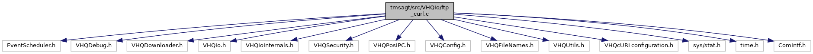

[Functions](#func-members)

`#include "EventScheduler.h"`
`#include "VHQDebug.h"`
`#include "VHQDownloader.h"`
`#include "VHQIo.h"`
`#include "VHQIoInternals.h"`
`#include "VHQSecurity.h"`
`#include "VHQPosIPC.h"`
`#include "VHQConfig.h"`
`#include "VHQFileNames.h"`
`#include "VHQUtils.h"`
`#include "VHQcURLconfiguration.h"`
`#include <sys/stat.h>`
`#include <time.h>`
`#include "ComIntf.h"`

Include dependency graph for ftp_curl.c:

|  |  |
|----|----|
| Functions |  |
| bool  | [IsSSLOption](#a57e6bb8ca1c78a40939b7a58863feefa) (char \*pszUrl) |
| bool  | [GenerateFileTransferCredentials](#a6a95761e6d904510a71a1c669575b743) (char \*userpass_str, int userpass_str_len) |
| bool  | [VHQHTTPException](#a0f6ebf07478447be27fe208ebb5f4d23) (int inCode) |
| vhq_result_t  | [DownloadFileWorker](#a01aefd93b7b4b6c8a756c13a8bfd0071) (dl_file_method_t eMethod, char \*pszDest, char \*pszUrl, dl_file_hash_algo_t eHashAlgo, char \*pszHash, bool bMaintDl, uint32 filesize, event_set_id_t event_set_id, event_id_t event_id, uint32 \*dl_duration, uint32 \*dl_attempts, bool dl_notify) |

## DetailedDescription {#detailed-description}

Download file given URL

## FunctionDocumentation {#function-documentation}

## DownloadFileWorker() 

vhq_result_t DownloadFileWorker

This function calls function to download a file from server and finds the time taken for the attempt.

**Parameters**

\[in\] **eMethod** = file download method \[out\] **pszDest** = partial download file name(tmp) \[in\] **pszUser** = user \[in\] **pszPw** = PW \[in\] **pszUrl** = URL \[in\] **eHashAlgo** = hash algorithm \[in\] **pszHash** = received hash value from server. \[in\] **bMaintDl** = TRUE, if maintenance download \[in\] **filesize** = size of file to download \[in\] **event_set_id** = event set id of event \[in\] **event_id** = event ID of event \[out\] **dl_duration** = download duration \[out\] **dl_attempts** = number of download attempts \[in\] **dl_notify** = Download notifications

### Returns

vhq_result_t VHQ_SUCCESS, if success

## GenerateFileTransferCredentials() 

bool GenerateFileTransferCredentials

This function provides the signature details for file transfer

**Parameters**

\[in\] **userpass_str** = signature details stored to this buffer \[in\] **userpass_str_len** = size of buffer.

### Returns

TRUE, if success; FALSE, otherwise

## IsSSLOption() 

bool IsSSLOption

## VHQHTTPException() 

bool VHQHTTPException

