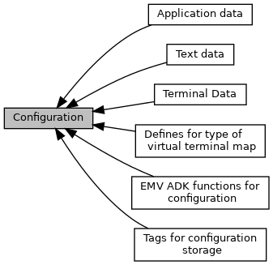

[Modules](#groups)

Collaboration diagram for Configuration:

|  |  |
|----|----|
| Modules |  |
|   | <a href="group___a_d_k___x_m_l___t_a_g_s.md">Tags for configuration storage</a> |
|   | Used for storing the configuration in XML files.  |
|   | <a href="group___v_i_r_t_u_a_l_t_e_r_m_m_a_p___m_o_d_e.md">Defines for type of virtual terminal map</a> |
|   | <a href="group___f_u_n_c___c_o_n_f.md">EMV ADK functions for configuration</a> |
|   | <a href="group___d_e_f___c_o_n_f___t_e_r_m.md">Terminal Data</a> |
|   | Definitions used for functions <a href="group___f_u_n_c___c_o_n_f.md#ga351c2deba9865081c314d818463f20c9">EMV_CT_SetTermData()</a>, <a href="group___f_u_n_c___c_o_n_f.md#ga954c82bc82203115b10fcab356df0079">EMV_CT_GetTermData()</a>  |
|   | <a href="group___d_e_f___c_o_n_f___a_p_p_l_i.md">Application data</a> |
|   | Definitions used for functions <a href="group___f_u_n_c___c_o_n_f.md#ga73ca1735defbb65a1aae2ead1de70233">EMV_CT_SetAppliData()</a>, <a href="group___f_u_n_c___c_o_n_f.md#ga363163e375895b7d3ad03ace5df5d0d3">EMV_CT_GetAppliData()</a>  |
|   | <a href="group___d_e_f___c_o_n_f___t_e_x_t.md">Text data</a> |

## DetailedDescription {#detailed-description}
