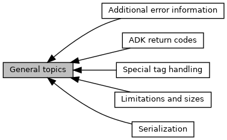

[Modules](#groups)

Collaboration diagram for General topics:

|  |  |
|----|----|
| Modules |  |
|   | <a href="group___d_e_f___a_d_k___d_e_b_u_g.md">Additional error information</a> |
|   | Filled in case of error, value to describe which error occured.  |
|   | <a href="group___a_d_k___l_i_m_i_t_s.md">Limitations and sizes</a> |
|   | <a href="group___a_d_k___r_e_t___c_o_d_e.md">ADK return codes</a> |
|   | <a href="group___s_p_e_c_i_a_l___t_a_g___h_a_n_d_l_i_n_g.md">Special tag handling</a> |
|   | <a href="group___a_d_k___s_e_r_i_a_l_i_z_a_t_i_o_n.md">Serialization</a> |

## DetailedDescription {#detailed-description}
