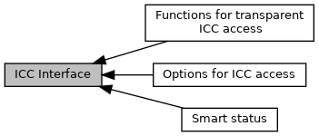

[Modules](#groups)

Definitions used for functions <a href="group___f_u_n_c___i_c_c.md#ga728923e6e6be8867cf954b7c8d4414d5">EMV_CT_SmartISO()</a>, <a href="group___f_u_n_c___i_c_c.md#gaa63515431ea6f33b113fa7af5562db11">EMV_CT_SmartReset()</a>, <a href="group___f_u_n_c___i_c_c.md#gab99f6946bd7815a64a54be66652c2840">EMV_CT_SmartPowerOff()</a>, <a href="group___f_u_n_c___f_l_o_w.md#ga895cb054c344d011e9e3c6acc4aadafe">EMV_CT_Send_PIN_Offline()</a>, <a href="group___f_u_n_c___i_c_c.md#ga62577d8d938685a65dd2b326cb03522d">EMV_CT_SmartDetect()</a> [More\...](#details)

Collaboration diagram for ICC Interface:

|  |  |
|----|----|
| Modules |  |
|   | <a href="group___a_d_k___i_c_c___o_p_t_i_o_n.md">Options for ICC access</a> |
|   | Options for ICC access, e.g. for <a href="group___f_u_n_c___i_c_c.md#gafbcdb0278723b9629eb7c12532119e2d">EMV_CTLS_SmartISO()</a>, <a href="group___f_u_n_c___i_c_c.md#gae2c93f30f24ceb94c930a7cae2b36116">EMV_CTLS_SmartReset()</a>, <a href="group___f_u_n_c___i_c_c.md#gadd0716253a50b2791ac4e2a1627d1e8d">EMV_CTLS_SmartPowerOff()</a>  |
|   | <a href="group___s_m_a_r_t___s_t_a_t_u_s.md">Smart status</a> |
|   | Return values for functions of group <a href="group___f_u_n_c___i_c_c.md">Functions for transparent ICC access</a>.  |
|   | <a href="group___f_u_n_c___i_c_c.md">Functions for transparent ICC access</a> |

## DetailedDescription {#detailed-description}

Definitions used for functions <a href="group___f_u_n_c___i_c_c.md#ga728923e6e6be8867cf954b7c8d4414d5">EMV_CT_SmartISO()</a>, <a href="group___f_u_n_c___i_c_c.md#gaa63515431ea6f33b113fa7af5562db11">EMV_CT_SmartReset()</a>, <a href="group___f_u_n_c___i_c_c.md#gab99f6946bd7815a64a54be66652c2840">EMV_CT_SmartPowerOff()</a>, <a href="group___f_u_n_c___f_l_o_w.md#ga895cb054c344d011e9e3c6acc4aadafe">EMV_CT_Send_PIN_Offline()</a>, <a href="group___f_u_n_c___i_c_c.md#ga62577d8d938685a65dd2b326cb03522d">EMV_CT_SmartDetect()</a>

Definitions used for functions <a href="group___f_u_n_c___i_c_c.md#gafbcdb0278723b9629eb7c12532119e2d">EMV_CTLS_SmartISO()</a>, <a href="group___f_u_n_c___i_c_c.md#gae2c93f30f24ceb94c930a7cae2b36116">EMV_CTLS_SmartReset()</a>, <a href="group___f_u_n_c___i_c_c.md#gadd0716253a50b2791ac4e2a1627d1e8d">EMV_CTLS_SmartPowerOff()</a>
