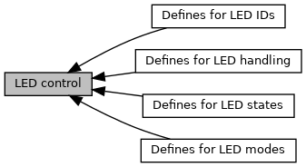
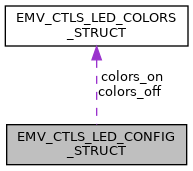

[Modules](#groups) \| [Data Structures](#nested-classes) \| [Macros](#define-members) \| [Typedefs](#typedef-members) \| [Functions](#func-members)

Collaboration diagram for LED control:

|  |  |
|----|----|
| Modules |  |
|   | <a href="group___a_d_k___l_e_d___d_e_f_i_n_e_s___i_d_s.md">Defines for LED IDs</a> |
|   | LED numbers in [EMV_CTLS_LED()](#gabd80a7d1c3dbc5604604b02c20620f51 "Switch on LED.")  |
|   | <a href="group___a_d_k___l_e_d___d_e_f_i_n_e_s___s_t_a_t_e_s.md">Defines for LED states</a> |
|   | LED states to be used in [EMV_CTLS_LED()](#gabd80a7d1c3dbc5604604b02c20620f51 "Switch on LED.")  |
|   | <a href="group___a_d_k___l_e_d___d_e_f_i_n_e_s___m_o_d_e_s.md">Defines for LED modes</a> |
|   | LED modes to be used in [EMV_CTLS_LED_SetMode()](#ga62eb0e6232dad59e94b75205493fa06d "Set mode of LED control.")  |
|   | <a href="group___a_d_k___l_e_d___d_e_f_i_n_e_s.md">Defines for LED handling</a> |
|   | LED numbers and modes to be used in <a href="group___f_u_n_c___c_o_n_f.md#gaa7a875eed1a49cff8fdf70c81100be2f">EMV_CT_LED()</a>  |

|  |  |
|----|----|
| Data Structures |  |
| struct   | [EMV_CTLS_LED_COLORS_STRUCT](#struct_e_m_v___c_t_l_s___l_e_d___c_o_l_o_r_s___s_t_r_u_c_t) |
|   | Data structure for LED colors. Input for [EMV_CTLS_LED_ConfigDesign_Extended()](#ga8b647b4c8f995795b250bd2df10c2796 "Configure the design for the framebuffer LEDs used for virtual CTLS LEDs    Only required when using ...") [More\...](#struct_e_m_v___c_t_l_s___l_e_d___c_o_l_o_r_s___s_t_r_u_c_t)  |
| struct   | [EMV_CTLS_LED_CONFIG_STRUCT](#struct_e_m_v___c_t_l_s___l_e_d___c_o_n_f_i_g___s_t_r_u_c_t) |
|   | Data structure for LED configuration. Input for [EMV_CTLS_LED_ConfigDesign_Extended()](#ga8b647b4c8f995795b250bd2df10c2796 "Configure the design for the framebuffer LEDs used for virtual CTLS LEDs    Only required when using ...") [More\...](#struct_e_m_v___c_t_l_s___l_e_d___c_o_n_f_i_g___s_t_r_u_c_t)  |

|  |  |
|----|----|
| Macros |  |
| #define  | [EMV_CTLS_LED_SHAPE_RECTANGLE](#ga7c2b396064512cb0467af8f9af3a4a3f)   0 |
|   | Data structure for LED colors. Used in [EMV_CTLS_LED_CONFIG_STRUCT::shape](#a9d7f77334f11d266e824cb9b0ec6871e "shape of LEDs, one of EMV_CTLS_LED_SHAPE_RECTANGLE, EMV_CTLS_LED_SHAPE_CIRCLE"). [More\...](#ga7c2b396064512cb0467af8f9af3a4a3f)  |

|  |  |
|----|----|
| Typedefs |  |
| typedef struct [EMV_CTLS_LED_COLORS_STRUCT](#struct_e_m_v___c_t_l_s___l_e_d___c_o_l_o_r_s___s_t_r_u_c_t)  | [EMV_CTLS_LED_COLORS](#gadd614d38c9bc0aebba3090672eafbe37) |
|   | Data structure for LED colors. Input for [EMV_CTLS_LED_ConfigDesign_Extended()](#ga8b647b4c8f995795b250bd2df10c2796 "Configure the design for the framebuffer LEDs used for virtual CTLS LEDs    Only required when using ...") [More\...](#gadd614d38c9bc0aebba3090672eafbe37)  |
| typedef struct [EMV_CTLS_LED_CONFIG_STRUCT](#struct_e_m_v___c_t_l_s___l_e_d___c_o_n_f_i_g___s_t_r_u_c_t)  | [EMV_CTLS_LED_CONFIG](#ga925c2fa10d6fa315adf31f35a265e130) |
|   | Data structure for LED configuration. Input for [EMV_CTLS_LED_ConfigDesign_Extended()](#ga8b647b4c8f995795b250bd2df10c2796 "Configure the design for the framebuffer LEDs used for virtual CTLS LEDs    Only required when using ...") [More\...](#ga925c2fa10d6fa315adf31f35a265e130)  |

|  |  |
|----|----|
| Functions |  |
| <a href="_e_m_v___c_t_l_s___interface_8h.md#a0c075561565f443dd054da7871da8462">DLL_CLC</a> unsigned char  | [EMV_CTLS_LED_SetMode](#ga62eb0e6232dad59e94b75205493fa06d) (unsigned char ucLedMode) |
|   | Set mode of LED control. [More\...](#ga62eb0e6232dad59e94b75205493fa06d)  |
| <a href="_e_m_v___c_t_l_s___interface_8h.md#a0c075561565f443dd054da7871da8462">DLL_CLC</a> unsigned char  | [EMV_CTLS_LED](#gabd80a7d1c3dbc5604604b02c20620f51) (unsigned char ucLedId, unsigned char ucLedState) |
|   | Switch on LED. [More\...](#gabd80a7d1c3dbc5604604b02c20620f51)  |
| <a href="_e_m_v___c_t_l_s___interface_8h.md#a0c075561565f443dd054da7871da8462">DLL_CLC</a> unsigned char  | [EMV_CTLS_LED_ConfigDesign](#gaabbf98fcb94592b96bee2c680bfccee9) (unsigned short width, unsigned short height, unsigned char \*color_off, unsigned char \*color_on, unsigned short xRegion, unsigned short yRegion, unsigned short wRegion, unsigned short hRegion) \_\_attribute((deprecated)) |
|   | Configure the desing for the framebuffer LEDs used for virtual CTLS LEDs **Only required when using virtual LEDs.** . [More\...](#gaabbf98fcb94592b96bee2c680bfccee9)  |
| <a href="_e_m_v___c_t_l_s___interface_8h.md#a0c075561565f443dd054da7871da8462">DLL_CLC</a> unsigned char  | [EMV_CTLS_LED_ConfigDesign_Extended](#ga8b647b4c8f995795b250bd2df10c2796) (const [EMV_CTLS_LED_CONFIG](#ga925c2fa10d6fa315adf31f35a265e130) \*led_config) \_\_attribute((deprecated)) |
|   | Configure the design for the framebuffer LEDs used for virtual CTLS LEDs **Only required when using virtual LEDs.** . [More\...](#ga8b647b4c8f995795b250bd2df10c2796)  |

## DetailedDescription {#detailed-description}

------------------------------------------------------------------------

## DataStructure Documentation {#data-structure-documentation}

## EMV_CTLS_LED_COLORS_STRUCT 

struct EMV_CTLS_LED_COLORS_STRUCT

Data structure for LED colors. Input for [EMV_CTLS_LED_ConfigDesign_Extended()](#ga8b647b4c8f995795b250bd2df10c2796 "Configure the design for the framebuffer LEDs used for virtual CTLS LEDs    Only required when using ...")

| Data Fields |  |  |
|----|----|----|
| unsigned char \* | colors | Array of colors, each color is 3 bytes (24 bit RGB), so length of array must be num_colors \* 3. |
| unsigned char | num_colors | number of different colors; set to 1 if all LEDs should have the same color, set to 4 if all LEDs have different colors. |

## EMV_CTLS_LED_CONFIG_STRUCT 

struct EMV_CTLS_LED_CONFIG_STRUCT

Data structure for LED configuration. Input for [EMV_CTLS_LED_ConfigDesign_Extended()](#ga8b647b4c8f995795b250bd2df10c2796 "Configure the design for the framebuffer LEDs used for virtual CTLS LEDs    Only required when using ...")

Collaboration diagram for EMV_CTLS_LED_CONFIG_STRUCT:

\[<a href="graph_legend.md">legend</a>\]

| Data Fields |  |  |
|----|----|----|
| unsigned char \* | bg_color | background color, only used if shape == EMV_CTLS_LED_SHAPE_CIRCLE |
| [EMV_CTLS_LED_COLORS](#gadd614d38c9bc0aebba3090672eafbe37) | colors_off | colors of LEDs in off state |
| [EMV_CTLS_LED_COLORS](#gadd614d38c9bc0aebba3090672eafbe37) | colors_on | colors of LEDs in on state |
| unsigned char \* | options | RFU, set to NULL. |
| unsigned short | region_height | height of the LED Region |
| unsigned short | region_width | width of the LED Region |
| unsigned short | region_x | x coordinate of the LED Region (upper left corner) |
| unsigned short | region_y | y coordinate of the LED Region (upper left corner) |
| unsigned char | shape | shape of LEDs, one of EMV_CTLS_LED_SHAPE_RECTANGLE, EMV_CTLS_LED_SHAPE_CIRCLE |
| unsigned short \* | shape_params | if shape == EMV_CTLS_LED_SHAPE_RECTANGLE: first value: width of LED, second value: height of LED; if shape == EMV_CTLS_LED_SHAPE_CIRCLE: first value: radius of LED (width=height=2\*radius+1) |

## MacroDefinition Documentation {#macro-definition-documentation}

## EMV_CTLS_LED_SHAPE_RECTANGLE 

#define EMV_CTLS_LED_SHAPE_RECTANGLE   0

Data structure for LED colors. Used in [EMV_CTLS_LED_CONFIG_STRUCT::shape](#a9d7f77334f11d266e824cb9b0ec6871e "shape of LEDs, one of EMV_CTLS_LED_SHAPE_RECTANGLE, EMV_CTLS_LED_SHAPE_CIRCLE").

rectangular LEDs

## TypedefDocumentation {#typedef-documentation}

## EMV_CTLS_LED_COLORS 

typedef struct [EMV_CTLS_LED_COLORS_STRUCT](#struct_e_m_v___c_t_l_s___l_e_d___c_o_l_o_r_s___s_t_r_u_c_t) [EMV_CTLS_LED_COLORS](#gadd614d38c9bc0aebba3090672eafbe37)

Data structure for LED colors. Input for [EMV_CTLS_LED_ConfigDesign_Extended()](#ga8b647b4c8f995795b250bd2df10c2796 "Configure the design for the framebuffer LEDs used for virtual CTLS LEDs    Only required when using ...")

## EMV_CTLS_LED_CONFIG 

typedef struct [EMV_CTLS_LED_CONFIG_STRUCT](#struct_e_m_v___c_t_l_s___l_e_d___c_o_n_f_i_g___s_t_r_u_c_t) [EMV_CTLS_LED_CONFIG](#ga925c2fa10d6fa315adf31f35a265e130)

Data structure for LED configuration. Input for [EMV_CTLS_LED_ConfigDesign_Extended()](#ga8b647b4c8f995795b250bd2df10c2796 "Configure the design for the framebuffer LEDs used for virtual CTLS LEDs    Only required when using ...")

## FunctionDocumentation {#function-documentation}

## EMV_CTLS_LED() 

<a href="_e_m_v___c_t_l_s___interface_8h.md#a0c075561565f443dd054da7871da8462">DLL_CLC</a> unsigned char EMV_CTLS_LED

Switch on LED.

Using this function instead of ADK-GUI API (\[ADK-GUI Programmers Guide\]) may be useful as

- ADK-GUI does not control physical (hardware) LEDs
- in standard mode the SDI has control of the UI
- blinking functionality for 1st LED can be used
- application can use common code for terminals with and without physical LEDs
- \"end of transaction\" handling (e.g. <a href="group___a_d_k___l_e_d___d_e_f_i_n_e_s___s_t_a_t_e_s.md#ga4bab0d93ec30b5127e214c20ef0dd5a3">CONTACTLESS_LED_HANDLE_EOT_SUCCESS</a>) can be used for domestic cards

Transport tags used for serialization: <a href="group___a_d_k___t_r_a_n_s_p_o_r_t___t_a_g_s.md#gad1c3412f36620771889c9691889f80b1">CLA_LED</a> <a href="group___a_d_k___t_r_a_n_s_p_o_r_t___t_a_g_s.md#ga0c455b1cdcb1ad1513e54c823f1d07a8">INS_LED_SWITCH</a>

<a href="pg_emv_contactless_users_guide.md#anchor_emv_ctls_leds_switch_leds">Explanation in programmers guide</a>

### Author

GSS R&D Germany

**Parameters**

\[in\] **ucLedId** LED number, see Defines for LED IDsThis is a combination of LEDs. (use binary bitwise inclusive OR of LED-Bit-masks defined in Defines for LED IDs)Bits which are not defined in Defines for LED IDs should be 0. They are reserved for future use and will be ignored. \[in\] **ucLedState** LED state, see Defines for LED states

### Returns

<a href="group___a_d_k___r_e_t___c_o_d_e.md#ga1456bb13b42906927f8a8942169b62e7">EMV_ADK_OK</a>: success
<a href="group___a_d_k___r_e_t___c_o_d_e.md#ga4837e54c589150debdef49afb8f9b5db">EMV_ADK_TLV_BUILD_ERR</a>: TLV processing problem
<a href="group___a_d_k___r_e_t___c_o_d_e.md#gab0e8158b5e7019f0da44c5cbc37bae3d">EMV_ADK_INTERNAL</a>: internal communication problem, illegal file content, memory allocation
<a href="group___a_d_k___r_e_t___c_o_d_e.md#ga3a1d800696b9d7a86c0e39068d3fde57">EMV_ADK_NOT_ALLOWED</a>: function not allowed in a concurrent call or not allowed within callback

## EMV_CTLS_LED_ConfigDesign() 

<a href="_e_m_v___c_t_l_s___interface_8h.md#a0c075561565f443dd054da7871da8462">DLL_CLC</a> unsigned char EMV_CTLS_LED_ConfigDesign

Configure the desing for the framebuffer LEDs used for virtual CTLS LEDs
**Only required when using virtual LEDs.**
.

**<a href="deprecated.md#_deprecated000065">Deprecated:</a>** The direct framebuffer approach is deprecated - use LED callbacks and LED-API from ADK-GUIPRT instead

Transport tags used for serialization: <a href="group___a_d_k___t_r_a_n_s_p_o_r_t___t_a_g_s.md#gad1c3412f36620771889c9691889f80b1">CLA_LED</a> <a href="group___a_d_k___t_r_a_n_s_p_o_r_t___t_a_g_s.md#gac4b89905db7b0371dba0ec2a42f73071">INS_LED_CONF_DESIGN</a>

### Author

GSS R&D Germany

**Parameters**

\[in\] **width** width of the rectangular LED \[in\] **height** height of the rectangular LED \[in\] **color_off** off color (24bit) (usually black == 0) \[in\] **color_on** color of the LED (24bit) \[in\] **xRegion** x coordinate of the LED Region (upper left corner) \[in\] **yRegion** y coordinate of the LED Region (upper left corner) \[in\] **wRegion** width of the LED Region \[in\] **hRegion** height of the LED Region

### Returns

<a href="group___a_d_k___r_e_t___c_o_d_e.md#ga1456bb13b42906927f8a8942169b62e7">EMV_ADK_OK</a>: success
<a href="group___a_d_k___r_e_t___c_o_d_e.md#ga4837e54c589150debdef49afb8f9b5db">EMV_ADK_TLV_BUILD_ERR</a>: TLV processing problem
<a href="group___a_d_k___r_e_t___c_o_d_e.md#gab0e8158b5e7019f0da44c5cbc37bae3d">EMV_ADK_INTERNAL</a>: internal communication problem, illegal file content, memory allocation
<a href="group___a_d_k___r_e_t___c_o_d_e.md#ga89c11346e5e636e7c9d42c6a772674bf">EMV_ADK_PARAM</a>: bad color_off or color_on input params
<a href="group___a_d_k___r_e_t___c_o_d_e.md#ga3a1d800696b9d7a86c0e39068d3fde57">EMV_ADK_NOT_ALLOWED</a>: function not allowed in a concurrent call or not allowed within callback
<a href="group___a_d_k___r_e_t___c_o_d_e.md#ga7ffea44a30b0451d393487eae4035b4e">EMV_ADK_NO_EXEC</a>: terminal is not VOS or VOS2

## EMV_CTLS_LED_ConfigDesign_Extended() 

<a href="_e_m_v___c_t_l_s___interface_8h.md#a0c075561565f443dd054da7871da8462">DLL_CLC</a> unsigned char EMV_CTLS_LED_ConfigDesign_Extended

Configure the design for the framebuffer LEDs used for virtual CTLS LEDs
**Only required when using virtual LEDs.**
.

**<a href="deprecated.md#_deprecated000066">Deprecated:</a>** The direct framebuffer approach is deprecated - use LED callbacks and LED-API from ADK-GUIPRT instead

Coloured LEDs should be used together with <a href="group___t_e_r_m___f_l_o_w___o_p_t_i_o_n_s.md#ga2c5f919832e3ec1d5c5054291b27191c">INPUT_CTLS_TRM_FLOWOPT_LED_EP_OPTION_2</a>.

Transport tags used for serialization: <a href="group___a_d_k___t_r_a_n_s_p_o_r_t___t_a_g_s.md#gad1c3412f36620771889c9691889f80b1">CLA_LED</a> <a href="group___a_d_k___t_r_a_n_s_p_o_r_t___t_a_g_s.md#gac4b89905db7b0371dba0ec2a42f73071">INS_LED_CONF_DESIGN</a>

### Author

GSS R&D Germany

**Parameters**

\[in\] **led_config** LED configuration, see EMV_CTLS_LED_CONFIG_STRUCT

### Returns

`0` \... okay
`!=0` \... error

## EMV_CTLS_LED_SetMode() 

<a href="_e_m_v___c_t_l_s___interface_8h.md#a0c075561565f443dd054da7871da8462">DLL_CLC</a> unsigned char EMV_CTLS_LED_SetMode

Set mode of LED control.


For special needs only. Usage of [EMV_CTLS_LED()](#gabd80a7d1c3dbc5604604b02c20620f51 "Switch on LED.") is possible without using this function.


Before starting a contactless transaction, it must be set to `CONTACTLESS_LED_MODE_EMV`. In case the application wants to switch LEDs independent of EMV, it may set the mode to `CONTACTLESS_LED_MODE_API`. The status is saved when switching to EMV mode at the beginning of a transaction and restored once switching back to API mode. This use case is optional. By default, the application may simply use the EMV mode. In EMV mode, the application has even the ability to change the LEDs after the end of the transaction (e.g. switch on idle blinking).

Transport tags used for serialization: <a href="group___a_d_k___t_r_a_n_s_p_o_r_t___t_a_g_s.md#gad1c3412f36620771889c9691889f80b1">CLA_LED</a> <a href="group___a_d_k___t_r_a_n_s_p_o_r_t___t_a_g_s.md#ga62d51f45ace79bf1afa60498d84b17ad">INS_LED_MODE</a>

### Author

GSS R&D Germany

**Parameters**

\[in\] **ucLedMode** LED mode, see Defines for LED modes

### Returns

<a href="group___a_d_k___r_e_t___c_o_d_e.md#ga1456bb13b42906927f8a8942169b62e7">EMV_ADK_OK</a>: success
<a href="group___a_d_k___r_e_t___c_o_d_e.md#ga4837e54c589150debdef49afb8f9b5db">EMV_ADK_TLV_BUILD_ERR</a>: TLV processing problem
<a href="group___a_d_k___r_e_t___c_o_d_e.md#gab0e8158b5e7019f0da44c5cbc37bae3d">EMV_ADK_INTERNAL</a>: internal communication problem, illegal file content, memory allocation
<a href="group___a_d_k___r_e_t___c_o_d_e.md#ga3a1d800696b9d7a86c0e39068d3fde57">EMV_ADK_NOT_ALLOWED</a>: function not allowed in a concurrent call or not allowed within callback

