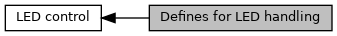

[Macros](#define-members)

LED numbers and modes to be used in <a href="group___f_u_n_c___c_o_n_f.md#gaa7a875eed1a49cff8fdf70c81100be2f">EMV_CT_LED()</a> [More\...](#details)

Collaboration diagram for Defines for LED handling:

|  |  |
|----|----|
| Macros |  |
| #define  | [CONTACT_LED_ID_0](#ga7735366355c1ae515cc555943a8d275a)   0x00 |
|   | There is currently maximum one CT Slot. [More\...](#ga7735366355c1ae515cc555943a8d275a)  |
| #define  | [CONTACT_LED_OFF](#gaf02c0852596ae917302924721119aef4)   0x00 |
|   | Switch LED Off. [More\...](#gaf02c0852596ae917302924721119aef4)  |
| #define  | [CONTACT_LED_ON](#ga89bab8973dc250de34438258846200e8)   0x01 |
|   | Switch LED On. [More\...](#ga89bab8973dc250de34438258846200e8)  |
| #define  | [CONTACT_LED_BLINK](#ga0bd348dfe14988b3afdcffe805bcff20)   0x02 |
|   | Enable blinking, fixed timing. [More\...](#ga0bd348dfe14988b3afdcffe805bcff20)  |
| #define  | [CONTACT_LED_COLOR_WHITE](#ga21193bea30fae15e60519282ab6e6374)   0x01 |
|   | white led [More\...](#ga21193bea30fae15e60519282ab6e6374)  |
| #define  | [CONTACT_LED_COLOR_RED](#gadcad723f627a329d22fcd168162bb849)   0x02 |
|   | red led [More\...](#gadcad723f627a329d22fcd168162bb849)  |
| #define  | [CONTACT_LED_COLOR_GREEN](#ga4ae737d4d93cb8a198b7f67d168bd9e9)   0x03 |
|   | green led [More\...](#ga4ae737d4d93cb8a198b7f67d168bd9e9)  |
| #define  | [CONTACT_LED_COLOR_BLUE](#ga3b727641d9451f94e180d0af7f09325f)   0x04 |
|   | blue led [More\...](#ga3b727641d9451f94e180d0af7f09325f)  |
| #define  | [CONTACT_LED_COLOR_YELLOW](#ga63a1fda85b2a6e9126b1f6c04f5e5b9f)   0x05 |
|   | yellow led [More\...](#ga63a1fda85b2a6e9126b1f6c04f5e5b9f)  |

## DetailedDescription {#detailed-description}

LED numbers and modes to be used in <a href="group___f_u_n_c___c_o_n_f.md#gaa7a875eed1a49cff8fdf70c81100be2f">EMV_CT_LED()</a>

## MacroDefinition Documentation {#macro-definition-documentation}

## CONTACT_LED_BLINK 

#define CONTACT_LED_BLINK   0x02

Enable blinking, fixed timing.

**<a href="deprecated.md#_deprecated000148">Deprecated:</a>** : No more supported, for instance, because it relies on SVRMGR functionality that is going to be removed

## CONTACT_LED_COLOR_BLUE 

#define CONTACT_LED_COLOR_BLUE   0x04

blue led

## CONTACT_LED_COLOR_GREEN 

#define CONTACT_LED_COLOR_GREEN   0x03

green led

## CONTACT_LED_COLOR_RED 

#define CONTACT_LED_COLOR_RED   0x02

red led

## CONTACT_LED_COLOR_WHITE 

#define CONTACT_LED_COLOR_WHITE   0x01

white led

## CONTACT_LED_COLOR_YELLOW 

#define CONTACT_LED_COLOR_YELLOW   0x05

yellow led

## CONTACT_LED_ID_0 

#define CONTACT_LED_ID_0   0x00

There is currently maximum one CT Slot.

## CONTACT_LED_OFF 

#define CONTACT_LED_OFF   0x00

Switch LED Off.

## CONTACT_LED_ON 

#define CONTACT_LED_ON   0x01

Switch LED On.
