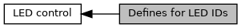

[Macros](#define-members)

LED numbers in <a href="group___a_d_k___l_e_d.md#gabd80a7d1c3dbc5604604b02c20620f51">EMV_CTLS_LED()</a> [More\...](#details)

Collaboration diagram for Defines for LED IDs:

|  |  |
|----|----|
| Macros |  |
| #define  | [CONTACTLESS_LED_FIRST](#gaee6580bd95df40c758983f6552bffb8a)   0x01 |
|   | first contacless LED [More\...](#gaee6580bd95df40c758983f6552bffb8a)  |
| #define  | [CONTACTLESS_LED_SECOND](#gaddb4297a505bf9e07937cd4a9c09a2aa)   0x02 |
|   | second contacless LED [More\...](#gaddb4297a505bf9e07937cd4a9c09a2aa)  |
| #define  | [CONTACTLESS_LED_THIRD](#ga0d9c18a1b0aa19948aed89aa1cb26e0a)   0x04 |
|   | third contacless LED [More\...](#ga0d9c18a1b0aa19948aed89aa1cb26e0a)  |
| #define  | [CONTACTLESS_LED_FOURTH](#gad33b5cb37c8b6f4736ea29cccc74a550)   0x08 |
|   | fourth contacless LED [More\...](#gad33b5cb37c8b6f4736ea29cccc74a550)  |
| #define  | [CONTACTLESS_LED_BLUE](#gafb00c1d9b9a0a960de94d29049b1af73)   [CONTACTLESS_LED_FIRST](#gaee6580bd95df40c758983f6552bffb8a) |
|   | first LED for signalling field on [More\...](#gafb00c1d9b9a0a960de94d29049b1af73)  |
| #define  | [CONTACTLESS_LED_YELLOW](#ga4db17cda57eed6c0a2c92ce4f09f0fee)   [CONTACTLESS_LED_SECOND](#gaddb4297a505bf9e07937cd4a9c09a2aa) |
|   | second LED indicating chip card communication [More\...](#ga4db17cda57eed6c0a2c92ce4f09f0fee)  |
| #define  | [CONTACTLESS_LED_GREEN](#ga6e6a69344ecd5663ca4fbc15f4f2567e)   [CONTACTLESS_LED_THIRD](#ga0d9c18a1b0aa19948aed89aa1cb26e0a) |
|   | third LED \"Card read successfully\" [More\...](#ga6e6a69344ecd5663ca4fbc15f4f2567e)  |
| #define  | [CONTACTLESS_LED_RED](#ga7543e66c9d21d11022305e6b009c9111)   [CONTACTLESS_LED_FOURTH](#gad33b5cb37c8b6f4736ea29cccc74a550) |
|   | fourth LED indicating error [More\...](#ga7543e66c9d21d11022305e6b009c9111)  |
| #define  | [CONTACTLESS_LED_0](#ga10abac6c72273e3f5621263d92a2685f)   [CONTACTLESS_LED_FIRST](#gaee6580bd95df40c758983f6552bffb8a) |
|   | Contactless LED 1,. [More\...](#ga10abac6c72273e3f5621263d92a2685f)  |
| #define  | [CONTACTLESS_LED_1](#ga27a60a25bdc8b568619f4a9b2b6c38de)   [CONTACTLESS_LED_SECOND](#gaddb4297a505bf9e07937cd4a9c09a2aa) |
|   | Contactless LED 2,. [More\...](#ga27a60a25bdc8b568619f4a9b2b6c38de)  |
| #define  | [CONTACTLESS_LED_2](#gaa6b8ea6a2dfb81b555d1aae2da3f28b4)   [CONTACTLESS_LED_THIRD](#ga0d9c18a1b0aa19948aed89aa1cb26e0a) |
|   | Contactless LED 3,. [More\...](#gaa6b8ea6a2dfb81b555d1aae2da3f28b4)  |
| #define  | [CONTACTLESS_LED_3](#ga06abf20854346ac16fccbefbe6c98c8c)   [CONTACTLESS_LED_FOURTH](#gad33b5cb37c8b6f4736ea29cccc74a550) |
|   | Contactless LED 4,. [More\...](#ga06abf20854346ac16fccbefbe6c98c8c)  |
| #define  | [CONTACTLESS_LED_ALL](#ga6f28477b91b1d4e18c6431878b0836a2)   0x0F |
|   | All Contactless LEDs. [More\...](#ga6f28477b91b1d4e18c6431878b0836a2)  |
| #define  | [CONTACTLESS_LED_LOGO](#ga5427d7c1fdd8dbe3570ab18d0c9dc387)   0x80 |
|   | CTLS Logo LED (only UX family), not combinable with other LEDs. [More\...](#ga5427d7c1fdd8dbe3570ab18d0c9dc387)  |

## DetailedDescription {#detailed-description}

LED numbers in <a href="group___a_d_k___l_e_d.md#gabd80a7d1c3dbc5604604b02c20620f51">EMV_CTLS_LED()</a>

## MacroDefinition Documentation {#macro-definition-documentation}

## CONTACTLESS_LED_0 

#define CONTACTLESS_LED_0   [CONTACTLESS_LED_FIRST](#gaee6580bd95df40c758983f6552bffb8a)

Contactless LED 1,.

**<a href="deprecated.md#_deprecated000057">Deprecated:</a>** because confusing, use [CONTACTLESS_LED_FIRST](#gaee6580bd95df40c758983f6552bffb8a "first contacless LED") instead

## CONTACTLESS_LED_1 

#define CONTACTLESS_LED_1   [CONTACTLESS_LED_SECOND](#gaddb4297a505bf9e07937cd4a9c09a2aa)

Contactless LED 2,.

**<a href="deprecated.md#_deprecated000058">Deprecated:</a>** because confusing, use [CONTACTLESS_LED_SECOND](#gaddb4297a505bf9e07937cd4a9c09a2aa "second contacless LED") instead

## CONTACTLESS_LED_2 

#define CONTACTLESS_LED_2   [CONTACTLESS_LED_THIRD](#ga0d9c18a1b0aa19948aed89aa1cb26e0a)

Contactless LED 3,.

**<a href="deprecated.md#_deprecated000059">Deprecated:</a>** because confusing, use [CONTACTLESS_LED_THIRD](#ga0d9c18a1b0aa19948aed89aa1cb26e0a "third contacless LED") instead

## CONTACTLESS_LED_3 

#define CONTACTLESS_LED_3   [CONTACTLESS_LED_FOURTH](#gad33b5cb37c8b6f4736ea29cccc74a550)

Contactless LED 4,.

**<a href="deprecated.md#_deprecated000060">Deprecated:</a>** because confusing, use [CONTACTLESS_LED_FOURTH](#gad33b5cb37c8b6f4736ea29cccc74a550 "fourth contacless LED") instead

## CONTACTLESS_LED_ALL 

#define CONTACTLESS_LED_ALL   0x0F

All Contactless LEDs.

## CONTACTLESS_LED_BLUE 

#define CONTACTLESS_LED_BLUE   [CONTACTLESS_LED_FIRST](#gaee6580bd95df40c758983f6552bffb8a)

first LED for signalling field on

## CONTACTLESS_LED_FIRST 

#define CONTACTLESS_LED_FIRST   0x01

first contacless LED

## CONTACTLESS_LED_FOURTH 

#define CONTACTLESS_LED_FOURTH   0x08

fourth contacless LED

## CONTACTLESS_LED_GREEN 

#define CONTACTLESS_LED_GREEN   [CONTACTLESS_LED_THIRD](#ga0d9c18a1b0aa19948aed89aa1cb26e0a)

third LED \"Card read successfully\"

## CONTACTLESS_LED_LOGO 

#define CONTACTLESS_LED_LOGO   0x80

CTLS Logo LED (only UX family), not combinable with other LEDs.

## CONTACTLESS_LED_RED 

#define CONTACTLESS_LED_RED   [CONTACTLESS_LED_FOURTH](#gad33b5cb37c8b6f4736ea29cccc74a550)

fourth LED indicating error

## CONTACTLESS_LED_SECOND 

#define CONTACTLESS_LED_SECOND   0x02

second contacless LED

## CONTACTLESS_LED_THIRD 

#define CONTACTLESS_LED_THIRD   0x04

third contacless LED

## CONTACTLESS_LED_YELLOW 

#define CONTACTLESS_LED_YELLOW   [CONTACTLESS_LED_SECOND](#gaddb4297a505bf9e07937cd4a9c09a2aa)

second LED indicating chip card communication
