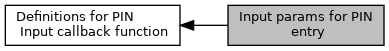

[Macros](#define-members)

Collaboration diagram for Input params for PIN entry:

|  |  |
|----|----|
| Macros |  |
| #define  | [EMV_CT_PIN_INPUT_ONLINE](#ga6e50037ec9acfb5dc5af7e8738ce3f12)   0 |
|   | Online enciphered PIN. [More\...](#ga6e50037ec9acfb5dc5af7e8738ce3f12)  |
| #define  | [EMV_CT_PIN_INPUT_PLAIN](#ga5e82e9ba31d25d95371f61030d0132b2)   1 |
|   | Offline plaintext PIN. [More\...](#ga5e82e9ba31d25d95371f61030d0132b2)  |
| #define  | [EMV_CT_PIN_INPUT_ENCIPHERED](#gaf2bc706ea385477040fc5fa2a0b272c2)   2 |
|   | Offline enciphered PIN. [More\...](#gaf2bc706ea385477040fc5fa2a0b272c2)  |
| #define  | [EMV_CT_PIN_INPUT_PLAIN_EXT](#gabd2fa8d295e9f978983a061974de8e1e)   3 |
|   | Offline plaintext PIN at external device (old Verix devices only) [More\...](#gabd2fa8d295e9f978983a061974de8e1e)  |
| #define  | [EMV_CT_PIN_INPUT_ENCIPHERED_EXT](#ga9822d5331d14c0b6c81a3f1f9519fe6c)   4 |
|   | Offline enciphered PIN at external device (old Verix devices only) [More\...](#ga9822d5331d14c0b6c81a3f1f9519fe6c)  |
| #define  | [EMV_CT_CVM_CUSTOM](#ga370e1133a282c765ec9f12605b172e3a)   5 |
|   | Custom CVM, the highest bit indicates the custom CVM, byte 0\...3 indicates the custom CVM method. [More\...](#ga370e1133a282c765ec9f12605b172e3a)  |

## DetailedDescription {#detailed-description}

## MacroDefinition Documentation {#macro-definition-documentation}

## EMV_CT_CVM_CUSTOM 

#define EMV_CT_CVM_CUSTOM   5

Custom CVM, the highest bit indicates the custom CVM, byte 0\...3 indicates the custom CVM method.

## EMV_CT_PIN_INPUT_ENCIPHERED 

#define EMV_CT_PIN_INPUT_ENCIPHERED   2

Offline enciphered PIN.

## EMV_CT_PIN_INPUT_ENCIPHERED_EXT 

#define EMV_CT_PIN_INPUT_ENCIPHERED_EXT   4

Offline enciphered PIN at external device (old Verix devices only)

## EMV_CT_PIN_INPUT_ONLINE 

#define EMV_CT_PIN_INPUT_ONLINE   0

Online enciphered PIN.

## EMV_CT_PIN_INPUT_PLAIN 

#define EMV_CT_PIN_INPUT_PLAIN   1

Offline plaintext PIN.

## EMV_CT_PIN_INPUT_PLAIN_EXT 

#define EMV_CT_PIN_INPUT_PLAIN_EXT   3

Offline plaintext PIN at external device (old Verix devices only)
