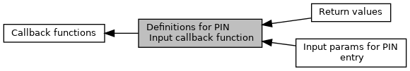

[Modules](#groups)

See <a href="adk__emv__contactless__programmers__guide_8dox.md#a591fd0f380cd390007ce78b47be923c4">EMV_CT_CALLBACK_FnT</a> (<a href="group___c_b_c_k___f_c_t___t_a_g_s.md#gadc9d6fed84456455586fb621722ae922">TAG_BF08_CBK_PIN</a>) [More\...](#details)

Collaboration diagram for Definitions for PIN Input callback function:

|  |  |
|----|----|
| Modules |  |
|   | <a href="group___a_d_k___p_i_n___i_n_p_u_t.md">Input params for PIN entry</a> |
|   | <a href="group___a_d_k___p_i_n___r_e_t_u_r_n.md">Return values</a> |
|   | Return values used by calling application for PIN input callback function.  |

## DetailedDescription {#detailed-description}

See <a href="adk__emv__contactless__programmers__guide_8dox.md#a591fd0f380cd390007ce78b47be923c4">EMV_CT_CALLBACK_FnT</a> (<a href="group___c_b_c_k___f_c_t___t_a_g_s.md#gadc9d6fed84456455586fb621722ae922">TAG_BF08_CBK_PIN</a>)
