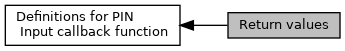

[Macros](#define-members)

Return values used by calling application for PIN input callback function. [More\...](#details)

Collaboration diagram for Return values:

|  |  |
|----|----|
| Macros |  |
| #define  | [EMV_CT_PIN_INPUT_OKAY](#ga6d46e6b2aa75de94de0855301068a093)   0 |
|   | PIN input was successful. [More\...](#ga6d46e6b2aa75de94de0855301068a093)  |
| #define  | [EMV_CT_PIN_INPUT_COMM_ERR](#ga6e1606e2c165d4f4af132d23f6585e37)   1 |
|   | Communication error. [More\...](#ga6e1606e2c165d4f4af132d23f6585e37)  |
| #define  | [EMV_CT_PIN_INPUT_ABORT](#gaed61dc1a7482b607ebad612b3f2d7508)   2 |
|   | Customer canceled. [More\...](#gaed61dc1a7482b607ebad612b3f2d7508)  |
| #define  | [EMV_CT_PIN_INPUT_BYPASS](#ga5364807f6ce1265fa8f8e0228db9717c)   3 |
|   | Customer chose \"bypass PIN entry\". [More\...](#ga5364807f6ce1265fa8f8e0228db9717c)  |
| #define  | [EMV_CT_PIN_INPUT_TIMEOUT](#ga71e47e61824568f46a9c9ed547ef206b)   4 |
|   | Timeout. [More\...](#ga71e47e61824568f46a9c9ed547ef206b)  |
| #define  | [EMV_CT_PIN_INPUT_OTHER_ERR](#ga783dde28172a0a5cbe376bd56ece1a90)   5 |
|   | Other error. [More\...](#ga783dde28172a0a5cbe376bd56ece1a90)  |
| #define  | [EMV_CT_PIN_UNCRIT_TIMEOUT](#ga032c595c93f6ef2e1a3661fe9de0f197)   6 |
|   | uncritical timeout (no immediate abort on timeout) [More\...](#ga032c595c93f6ef2e1a3661fe9de0f197)  |

## DetailedDescription {#detailed-description}

Return values used by calling application for PIN input callback function.

## MacroDefinition Documentation {#macro-definition-documentation}

## EMV_CT_PIN_INPUT_ABORT 

#define EMV_CT_PIN_INPUT_ABORT   2

Customer canceled.

## EMV_CT_PIN_INPUT_BYPASS 

#define EMV_CT_PIN_INPUT_BYPASS   3

Customer chose \"bypass PIN entry\".

## EMV_CT_PIN_INPUT_COMM_ERR 

#define EMV_CT_PIN_INPUT_COMM_ERR   1

Communication error.

## EMV_CT_PIN_INPUT_OKAY 

#define EMV_CT_PIN_INPUT_OKAY   0

PIN input was successful.

## EMV_CT_PIN_INPUT_OTHER_ERR 

#define EMV_CT_PIN_INPUT_OTHER_ERR   5

Other error.

## EMV_CT_PIN_INPUT_TIMEOUT 

#define EMV_CT_PIN_INPUT_TIMEOUT   4

Timeout.

## EMV_CT_PIN_UNCRIT_TIMEOUT 

#define EMV_CT_PIN_UNCRIT_TIMEOUT   6

uncritical timeout (no immediate abort on timeout)
