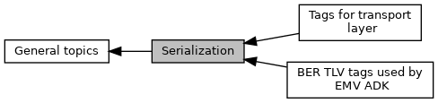

[Modules](#groups)

Collaboration diagram for Serialization:

|  |  |
|----|----|
| Modules |  |
|   | <a href="group___e_m_v___t_a_g_s.md">BER TLV tags used by EMV ADK</a> |
|   | <a href="group___a_d_k___t_r_a_n_s_p_o_r_t___t_a_g_s.md">Tags for transport layer</a> |
|   | Used for enclosing TLV container at transport. That\'s necessary in case EMV ADK and calling application are placed in separated entities. Transport layer (e.g. PINPad ISO2) must have indicators to determine whether data is meant for EMV ADK or not.  |

## DetailedDescription {#detailed-description}
