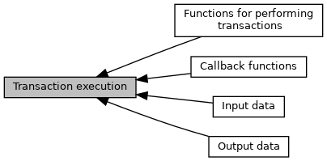
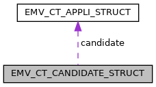
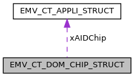
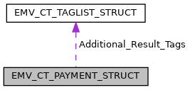
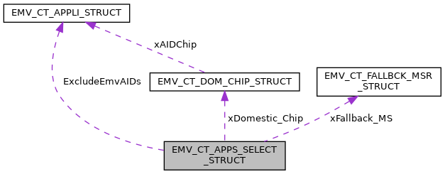
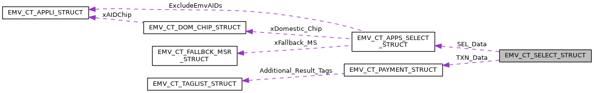
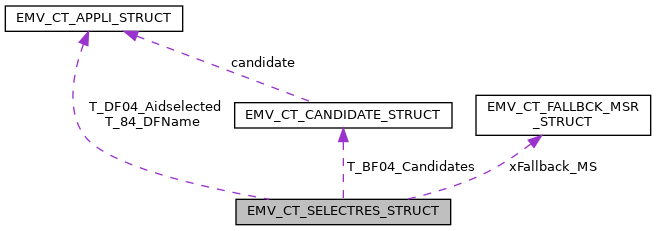
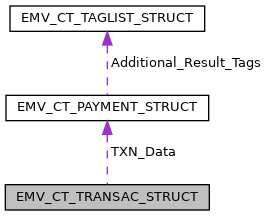
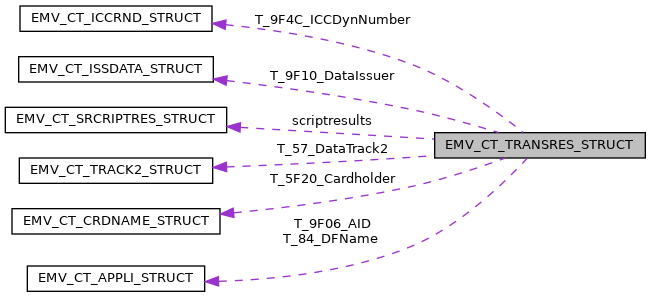
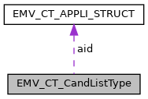

[Modules](#groups) \| [Data Structures](#nested-classes) \| [Typedefs](#typedef-members)

Definitions used for functions <a href="group___f_u_n_c___f_l_o_w.md#gac13472c2a4aea6475fe7bb52627e97eb">EMV_CT_StartTransaction()</a>, <a href="group___f_u_n_c___f_l_o_w.md#ga8be6df6babc587a19f63f284b2a6f006">EMV_CT_ContinueOffline()</a>, <a href="group___f_u_n_c___f_l_o_w.md#ga42f570d2b8e66841ab9e8de7736e92d4">EMV_CT_ContinueOnline()</a> [More\...](#details)

Collaboration diagram for Transaction execution:

|  |  |
|----|----|
| Modules |  |
|   | <a href="group___f_u_n_c___f_l_o_w.md">Functions for performing transactions</a> |
|   | <a href="group___t_l_v___c_a_l_l_b_c_k.md">Callback functions</a> |
|   | Callback function to be implemented in the same entity as EMV ADK.  |
|   | <a href="group___d_e_f___f_l_o_w___i_n_p_u_t.md">Input data</a> |
|   | <a href="group___d_e_f___f_l_o_w___o_u_t_p_u_t.md">Output data</a> |

|  |  |
|----|----|
| Data Structures |  |
| struct   | [EMV_CT_CANDIDATE_STRUCT](#struct_e_m_v___c_t___c_a_n_d_i_d_a_t_e___s_t_r_u_c_t) |
|   | Candidate list structure. [More\...](#struct_e_m_v___c_t___c_a_n_d_i_d_a_t_e___s_t_r_u_c_t)  |
| struct   | [EMV_CT_CANDIDATE_DATA_STRUCT](#struct_e_m_v___c_t___c_a_n_d_i_d_a_t_e___d_a_t_a___s_t_r_u_c_t) |
|   | Candidate list additional data Output of <a href="group___f_u_n_c___f_l_o_w.md#gac8f6430c652d6dad621ca3c0cf367346">EMV_CT_GetCandidateData()</a> To be used in conjunction with [EMV_CT_SELECTRES_STRUCT::T_BF04_Candidates](#ad45fa4ce538993473540188bd35612b3 "The candidate list which is used in the selection process, see EMV_CT_CANDIDATE_STRUCT   up to 10 ent..."). [More\...](#struct_e_m_v___c_t___c_a_n_d_i_d_a_t_e___d_a_t_a___s_t_r_u_c_t)  |
| struct   | [EMV_CT_DOM_CHIP_STRUCT](#struct_e_m_v___c_t___d_o_m___c_h_i_p___s_t_r_u_c_t) |
|   | Domestic non-EMV chip applications supporting AID selection see [EMV_CT_APPS_SELECT_STRUCT::xDomestic_Chip](#a383caf30fab1895ac0b58becb208a758 "Data of domestic chip applications (EMV_CT_DOM_CHIP_STRUCT)   Max. number see EMV_ADK_MAX_DOM_CHP   V...") TLV tag <a href="group___v_e_r_i___p_r_i_m___t_a_g_s.md#ga927fb2eed14e8ae18b90305ea57cd212">TAG_EMV_CONFORM</a>. [More\...](#struct_e_m_v___c_t___d_o_m___c_h_i_p___s_t_r_u_c_t)  |
| struct   | [EMV_CT_FALLBCK_MSR_STRUCT](#struct_e_m_v___c_t___f_a_l_l_b_c_k___m_s_r___s_t_r_u_c_t) |
|   | list of MID applications supported by terminal DF4C, see `xFallback_MS` in [EMV_CT_SELECT_STRUCT](#struct_e_m_v___c_t___s_e_l_e_c_t___s_t_r_u_c_t "struct for interface to EMV_CT_StartTransaction()") and [EMV_CT_SELECTRES_STRUCT](#struct_e_m_v___c_t___s_e_l_e_c_t_r_e_s___s_t_r_u_c_t "result data of EMV_CT_StartTransaction()") [More\...](#struct_e_m_v___c_t___f_a_l_l_b_c_k___m_s_r___s_t_r_u_c_t)  |
| struct   | [EMV_CT_PAYMENT_STRUCT](#struct_e_m_v___c_t___p_a_y_m_e_n_t___s_t_r_u_c_t) |
|   | Transaction parameters of an EMV transaction. [More\...](#struct_e_m_v___c_t___p_a_y_m_e_n_t___s_t_r_u_c_t)  |
| struct   | [EMV_CT_APPS_SELECT_STRUCT](#struct_e_m_v___c_t___a_p_p_s___s_e_l_e_c_t___s_t_r_u_c_t) |
|   | Application selection parameters of an EMV transaction used for [EMV_CT_SELECT_STRUCT::SEL_Data](#a8753a5e6226c6aae1dbd68db619d9cc0 "Data for application selection process (see EMV_CT_APPS_SELECT_STRUCT)"). [More\...](#struct_e_m_v___c_t___a_p_p_s___s_e_l_e_c_t___s_t_r_u_c_t)  |
| struct   | [EMV_CT_SELECT_STRUCT](#struct_e_m_v___c_t___s_e_l_e_c_t___s_t_r_u_c_t) |
|   | struct for interface to <a href="group___f_u_n_c___f_l_o_w.md#gac13472c2a4aea6475fe7bb52627e97eb">EMV_CT_StartTransaction()</a> [More\...](#struct_e_m_v___c_t___s_e_l_e_c_t___s_t_r_u_c_t)  |
| struct   | [EMV_CT_SELECTRES_STRUCT](#struct_e_m_v___c_t___s_e_l_e_c_t_r_e_s___s_t_r_u_c_t) |
|   | result data of <a href="group___f_u_n_c___f_l_o_w.md#gac13472c2a4aea6475fe7bb52627e97eb">EMV_CT_StartTransaction()</a> [More\...](#struct_e_m_v___c_t___s_e_l_e_c_t_r_e_s___s_t_r_u_c_t)  |
| struct   | [EMV_CT_TRANSAC_STRUCT](#struct_e_m_v___c_t___t_r_a_n_s_a_c___s_t_r_u_c_t) |
|   | Structure for call of <a href="group___f_u_n_c___f_l_o_w.md#ga8be6df6babc587a19f63f284b2a6f006">EMV_CT_ContinueOffline()</a> [More\...](#struct_e_m_v___c_t___t_r_a_n_s_a_c___s_t_r_u_c_t)  |
| struct   | [EMV_CT_SRCRIPTRES_STRUCT](#struct_e_m_v___c_t___s_r_c_r_i_p_t_r_e_s___s_t_r_u_c_t) |
|   | Data structure for issuer script results. Used in [EMV_CT_TRANSRES_STRUCT::scriptresults](#a6257b8c91140f05c572607aff48a301e "Issuer Script Results (EMV_CT_SRCRIPTRES_STRUCT)   Availability bit TRX_SCRIPTRESULTS."). [More\...](#struct_e_m_v___c_t___s_r_c_r_i_p_t_r_e_s___s_t_r_u_c_t)  |
| struct   | [EMV_CT_HOST_STRUCT](#struct_e_m_v___c_t___h_o_s_t___s_t_r_u_c_t) |
|   | Data structure for host response data. Input for <a href="group___f_u_n_c___f_l_o_w.md#ga42f570d2b8e66841ab9e8de7736e92d4">EMV_CT_ContinueOnline()</a> [More\...](#struct_e_m_v___c_t___h_o_s_t___s_t_r_u_c_t)  |
| struct   | [EMV_CT_TRANSRES_STRUCT](#struct_e_m_v___c_t___t_r_a_n_s_r_e_s___s_t_r_u_c_t) |
|   | Data structure for output data of <a href="group___f_u_n_c___f_l_o_w.md#ga8be6df6babc587a19f63f284b2a6f006">EMV_CT_ContinueOffline()</a> and <a href="group___f_u_n_c___f_l_o_w.md#ga42f570d2b8e66841ab9e8de7736e92d4">EMV_CT_ContinueOnline()</a> [More\...](#struct_e_m_v___c_t___t_r_a_n_s_r_e_s___s_t_r_u_c_t)  |
| struct   | [EMV_CT_CandListType](#struct_e_m_v___c_t___cand_list_type) |
|   | Data structure for output of EMV_CT_CheckSupportedAID. [More\...](#struct_e_m_v___c_t___cand_list_type)  |

|  |  |
|----|----|
| Typedefs |  |
| typedef struct [EMV_CT_CANDIDATE_STRUCT](#struct_e_m_v___c_t___c_a_n_d_i_d_a_t_e___s_t_r_u_c_t)  | [EMV_CT_CANDIDATE_TYPE](#ga7f04265d8f496a90e15a9e83cb6be044) |
|   | Candidate list structure. [More\...](#ga7f04265d8f496a90e15a9e83cb6be044)  |
| typedef struct [EMV_CT_CANDIDATE_DATA_STRUCT](#struct_e_m_v___c_t___c_a_n_d_i_d_a_t_e___d_a_t_a___s_t_r_u_c_t)  | [EMV_CT_CANDIDATE_DATA_TYPE](#ga27bfe240213c6d19faa79f347c30715e) |
|   | Candidate list additional data Output of <a href="group___f_u_n_c___f_l_o_w.md#gac8f6430c652d6dad621ca3c0cf367346">EMV_CT_GetCandidateData()</a> To be used in conjunction with [EMV_CT_SELECTRES_STRUCT::T_BF04_Candidates](#ad45fa4ce538993473540188bd35612b3 "The candidate list which is used in the selection process, see EMV_CT_CANDIDATE_STRUCT   up to 10 ent..."). [More\...](#ga27bfe240213c6d19faa79f347c30715e)  |
| typedef struct [EMV_CT_DOM_CHIP_STRUCT](#struct_e_m_v___c_t___d_o_m___c_h_i_p___s_t_r_u_c_t)  | [EMV_CT_DOM_CHIP_TYPE](#ga930c35de610cfdd929e6baa6a93d9d53) |
|   | Domestic non-EMV chip applications supporting AID selection see [EMV_CT_APPS_SELECT_STRUCT::xDomestic_Chip](#a383caf30fab1895ac0b58becb208a758 "Data of domestic chip applications (EMV_CT_DOM_CHIP_STRUCT)   Max. number see EMV_ADK_MAX_DOM_CHP   V...") TLV tag <a href="group___v_e_r_i___p_r_i_m___t_a_g_s.md#ga927fb2eed14e8ae18b90305ea57cd212">TAG_EMV_CONFORM</a>. [More\...](#ga930c35de610cfdd929e6baa6a93d9d53)  |
| typedef struct [EMV_CT_FALLBCK_MSR_STRUCT](#struct_e_m_v___c_t___f_a_l_l_b_c_k___m_s_r___s_t_r_u_c_t)  | [EMV_CT_FALLBCK_MSR_TYPE](#ga0c65aff49d9df61c17f0b6b85b52e9a9) |
|   | list of MID applications supported by terminal DF4C, see `xFallback_MS` in [EMV_CT_SELECT_STRUCT](#struct_e_m_v___c_t___s_e_l_e_c_t___s_t_r_u_c_t "struct for interface to EMV_CT_StartTransaction()") and [EMV_CT_SELECTRES_STRUCT](#struct_e_m_v___c_t___s_e_l_e_c_t_r_e_s___s_t_r_u_c_t "result data of EMV_CT_StartTransaction()") [More\...](#ga0c65aff49d9df61c17f0b6b85b52e9a9)  |
| typedef struct [EMV_CT_PAYMENT_STRUCT](#struct_e_m_v___c_t___p_a_y_m_e_n_t___s_t_r_u_c_t)  | [EMV_CT_PAYMENT_TYPE](#ga05175ed4b2a36fb179320170ab992f36) |
|   | Transaction parameters of an EMV transaction. [More\...](#ga05175ed4b2a36fb179320170ab992f36)  |
| typedef struct [EMV_CT_APPS_SELECT_STRUCT](#struct_e_m_v___c_t___a_p_p_s___s_e_l_e_c_t___s_t_r_u_c_t)  | [EMV_CT_APPS_SELECT_TYPE](#ga4ad034a23ce48436443f668f8c1b71cc) |
|   | Application selection parameters of an EMV transaction used for [EMV_CT_SELECT_STRUCT::SEL_Data](#a8753a5e6226c6aae1dbd68db619d9cc0 "Data for application selection process (see EMV_CT_APPS_SELECT_STRUCT)"). [More\...](#ga4ad034a23ce48436443f668f8c1b71cc)  |
| typedef struct [EMV_CT_SELECT_STRUCT](#struct_e_m_v___c_t___s_e_l_e_c_t___s_t_r_u_c_t)  | [EMV_CT_SELECT_TYPE](#ga58431469c9e1e41d6e419cbc246fd4bb) |
|   | struct for interface to <a href="group___f_u_n_c___f_l_o_w.md#gac13472c2a4aea6475fe7bb52627e97eb">EMV_CT_StartTransaction()</a> [More\...](#ga58431469c9e1e41d6e419cbc246fd4bb)  |
| typedef struct [EMV_CT_SELECTRES_STRUCT](#struct_e_m_v___c_t___s_e_l_e_c_t_r_e_s___s_t_r_u_c_t)  | [EMV_CT_SELECTRES_TYPE](#ga7e8a721d6043e021fcc24b36f2aca33f) |
|   | result data of <a href="group___f_u_n_c___f_l_o_w.md#gac13472c2a4aea6475fe7bb52627e97eb">EMV_CT_StartTransaction()</a> [More\...](#ga7e8a721d6043e021fcc24b36f2aca33f)  |
| typedef struct [EMV_CT_TRANSAC_STRUCT](#struct_e_m_v___c_t___t_r_a_n_s_a_c___s_t_r_u_c_t)  | [EMV_CT_TRANSAC_TYPE](#gae6382746c700031a73d619e7bda2c5af) |
|   | Structure for call of <a href="group___f_u_n_c___f_l_o_w.md#ga8be6df6babc587a19f63f284b2a6f006">EMV_CT_ContinueOffline()</a> [More\...](#gae6382746c700031a73d619e7bda2c5af)  |
| typedef struct [EMV_CT_SRCRIPTRES_STRUCT](#struct_e_m_v___c_t___s_r_c_r_i_p_t_r_e_s___s_t_r_u_c_t)  | [EMV_CT_SRCRIPTRES_TYPE](#gac323cc64b18e7d5fb266182ceeb77932) |
|   | Data structure for issuer script results. Used in [EMV_CT_TRANSRES_STRUCT::scriptresults](#a6257b8c91140f05c572607aff48a301e "Issuer Script Results (EMV_CT_SRCRIPTRES_STRUCT)   Availability bit TRX_SCRIPTRESULTS."). [More\...](#gac323cc64b18e7d5fb266182ceeb77932)  |
| typedef struct [EMV_CT_HOST_STRUCT](#struct_e_m_v___c_t___h_o_s_t___s_t_r_u_c_t)  | [EMV_CT_HOST_TYPE](#ga87fb8729a9792ab70bdae526f3a938c2) |
|   | Data structure for host response data. Input for <a href="group___f_u_n_c___f_l_o_w.md#ga42f570d2b8e66841ab9e8de7736e92d4">EMV_CT_ContinueOnline()</a> [More\...](#ga87fb8729a9792ab70bdae526f3a938c2)  |
| typedef struct [EMV_CT_TRANSRES_STRUCT](#struct_e_m_v___c_t___t_r_a_n_s_r_e_s___s_t_r_u_c_t)  | [EMV_CT_TRANSRES_TYPE](#ga3361b4c859aae10793dce6803138150f) |
|   | Data structure for output data of <a href="group___f_u_n_c___f_l_o_w.md#ga8be6df6babc587a19f63f284b2a6f006">EMV_CT_ContinueOffline()</a> and <a href="group___f_u_n_c___f_l_o_w.md#ga42f570d2b8e66841ab9e8de7736e92d4">EMV_CT_ContinueOnline()</a> [More\...](#ga3361b4c859aae10793dce6803138150f)  |

## DetailedDescription {#detailed-description}

Definitions used for functions <a href="group___f_u_n_c___f_l_o_w.md#gac13472c2a4aea6475fe7bb52627e97eb">EMV_CT_StartTransaction()</a>, <a href="group___f_u_n_c___f_l_o_w.md#ga8be6df6babc587a19f63f284b2a6f006">EMV_CT_ContinueOffline()</a>, <a href="group___f_u_n_c___f_l_o_w.md#ga42f570d2b8e66841ab9e8de7736e92d4">EMV_CT_ContinueOnline()</a>

Definitions used for functions <a href="group___f_u_n_c___f_l_o_w.md#ga1a86c76dcf8fec6e97ead6cf8f2717ff">EMV_CTLS_SetupTransaction()</a>, <a href="group___f_u_n_c___f_l_o_w.md#gaf23f6f87fe90619810470fad7d11f321">EMV_CTLS_ContinueOffline()</a>, <a href="group___f_u_n_c___f_l_o_w.md#ga297b6843994afaa2e7a6f5e0e4a8af3e">EMV_CTLS_ContinueOnline()</a>

------------------------------------------------------------------------

## DataStructure Documentation {#data-structure-documentation}

## EMV_CT_CANDIDATE_STRUCT 

struct EMV_CT_CANDIDATE_STRUCT

Candidate list structure.

used as [EMV_CT_SELECTRES_STRUCT::T_BF04_Candidates](#ad45fa4ce538993473540188bd35612b3 "The candidate list which is used in the selection process, see EMV_CT_CANDIDATE_STRUCT   up to 10 ent...")

Collaboration diagram for EMV_CT_CANDIDATE_STRUCT:

\[<a href="graph_legend.md">legend</a>\]

| Data Fields |  |  |
|----|----|----|
| <a href="_e_m_v___c_t___interface_8h.md#ae836cd33e4343219ad6106a383afd876">EMV_CT_APPLI_TYPE</a> | candidate | Candidate AID (<a href="_e_m_v___c_t___interface_8h.md#struct_e_m_v___c_t___a_p_p_l_i___s_t_r_u_c_t">EMV_CT_APPLI_STRUCT</a>) |
| unsigned char | name\[17\] | Candidate name, could be 9F12 or 50 or 84(converted to ascii) |

## EMV_CT_CANDIDATE_DATA_STRUCT 

struct EMV_CT_CANDIDATE_DATA_STRUCT

Candidate list additional data Output of <a href="group___f_u_n_c___f_l_o_w.md#gac8f6430c652d6dad621ca3c0cf367346">EMV_CT_GetCandidateData()</a>
To be used in conjunction with [EMV_CT_SELECTRES_STRUCT::T_BF04_Candidates](#ad45fa4ce538993473540188bd35612b3 "The candidate list which is used in the selection process, see EMV_CT_CANDIDATE_STRUCT   up to 10 ent...").

| Data Fields |  |  |
|----|----|----|
| unsigned char | API | Tag \'87\' application priority indicator TLV tag <a href="group___e_m_v_c_o___t_a_g_s.md#gaa307388012402f6923efc2609e11fd29">TAG_87_APP_PRIORITY_ID</a>. |
| unsigned char | BIC\[12\] | Tag \'5F54\' Bank identification code (an 8 or 11, terminated by \'0\') TLV tag <a href="group___e_m_v_c_o___t_a_g_s.md#ga7c69e28da34f98b810cc96009ecdefe9">TAG_5F54_BIC</a>. |
| unsigned char | CodeTableIndex | Tag \'9F11\' for the case that application name originates from application preferred name \'9F12\' TLV tag <a href="group___e_m_v_c_o___t_a_g_s.md#gaec3d1fc145f66b87ec5416b7d6cb69aa">TAG_9F11_ISS_CODE_TABLE_ID</a>. |
| unsigned char | country2\[2\] | Tag \'5F55\' Issuer Country Code (a2) TLV tag <a href="group___e_m_v_c_o___t_a_g_s.md#ga4a6770ebf323f538a78c12c78f3db783">TAG_5F55_ISSUER_COUNTRY_2</a>. |
| unsigned char | country3\[3\] | Tag \'5F56\' Issuer Country Code (a3) TLV tag <a href="group___e_m_v_c_o___t_a_g_s.md#gad5bedd694cd7c7658a9bdc865f542a50">TAG_5F56_ISSUER_COUNTRY_3</a>. |
| unsigned char | DF62_ASF\[33\] | Application Selection Flag (\'DF62\', Interac, Canada), first byte indicating length TLV tag <a href="group___v_e_r_i___p_r_i_m___t_a_g_s.md#ga370bbfc060791c853bb6c8c959363faa">TAG_DF62_APPLI_SELECT_FLAG</a>. |
| unsigned char | IBAN\[35\] | Tag \'5F53\' International bank account (an ..34, terminated by \'0\') TLV tag <a href="group___e_m_v_c_o___t_a_g_s.md#ga4c1beabb09d7dd5929f0947c3451378c">TAG_5F53_IBAN</a>. |
| unsigned char | IIN\[4\] | Tag \'42\'/\'9F0C\' issuer identification number (n6 or n8, right padded with 0xff), starts with 0xff if absent TLV tag <a href="group___e_m_v_c_o___t_a_g_s.md#ga15500b26a3968d2936b031cca37b93f2">TAG_42_ISSUER_ID</a> or <a href="group___e_m_v_c_o___t_a_g_s.md#gaa2f5cfcf442860cea8e1021150b9e5c5">TAG_9F0C_ISSUER_ID_EXT</a> in case of 8 digits. |
| unsigned char | len9F06 | For determining the terminal candidate (\'9F06\') in case of \"AID chain\" and partial select TLV tag <a href="group___e_m_v_c_o___t_a_g_s.md#ga7670871675627d7e74d29683fbacf01a">TAG_9F06_AID</a>. |
| unsigned char | selData\[1+<a href="_e_m_v___c_t___interface_8h.md#a5a1c0c45b228906e2d0ad242ebee0c3f">EMV_CT_SUPPORTED_SIZE_9F0A</a>\] | Application Selection Registered Proprietary Data (9F0A), Bulletin No. 175, first byte length TLV tag <a href="group___e_m_v_c_o___t_a_g_s.md#gac5bdc3a443d2b32f1898d095609ec871">TAG_9F0A_ASRPD</a>. |

## EMV_CT_DOM_CHIP_STRUCT 

struct EMV_CT_DOM_CHIP_STRUCT

Domestic non-EMV chip applications supporting AID selection
see [EMV_CT_APPS_SELECT_STRUCT::xDomestic_Chip](#a383caf30fab1895ac0b58becb208a758 "Data of domestic chip applications (EMV_CT_DOM_CHIP_STRUCT)   Max. number see EMV_ADK_MAX_DOM_CHP   V...")
TLV tag <a href="group___v_e_r_i___p_r_i_m___t_a_g_s.md#ga927fb2eed14e8ae18b90305ea57cd212">TAG_EMV_CONFORM</a>.

Collaboration diagram for EMV_CT_DOM_CHIP_STRUCT:

\[<a href="graph_legend.md">legend</a>\]

| Data Fields |  |  |
|----|----|----|
| unsigned char | uc_EMVConformSelect | Selection procedure is EMV conform (0) or not (1) In case of non EMV conformance selection process there is no select issued to the card but the application is added to the candidates list TLV tag <a href="group___v_e_r_i___p_r_i_m___t_a_g_s.md#ga927fb2eed14e8ae18b90305ea57cd212">TAG_EMV_CONFORM</a>. |
| unsigned char | ucAppName\[16+1\] | Application label TLV tag <a href="group___e_m_v_c_o___t_a_g_s.md#ga70b6da94fde0a697b05755cdfc084023">TAG_50_APP_LABEL</a>. |
| unsigned char | ucASI | Application selection indicator Must the card\'s AID match the configured AID exactly? `0` \... yes `1` \... no TLV tag <a href="group___v_e_r_i___p_r_i_m___t_a_g_s.md#ga3ec6eef8ef2baf5298bba904c5339614">TAG_DF20_ASI</a>. |
| <a href="_e_m_v___c_t___interface_8h.md#ae836cd33e4343219ad6106a383afd876">EMV_CT_APPLI_TYPE</a> | xAIDChip | AID of domestic application (<a href="_e_m_v___c_t___interface_8h.md#struct_e_m_v___c_t___a_p_p_l_i___s_t_r_u_c_t">EMV_CT_APPLI_STRUCT</a>) TLV tag <a href="group___v_e_r_i___p_r_i_m___t_a_g_s.md#ga939333f4c5c2e500beb9b06d6939fb23">TAG_DF04_AID</a>. |
| unsigned char | xuc_Special_TRX\[8\] | List of special allowed transactions (manual reversal, refund, reservation, tip, Referral) see <a href="group___s_p_e_c_i_a_l___t_r_x_s.md">Defines for special transaction configuration</a> will be checked against [EMV_CT_SELECT_STRUCT::TransType](#ae9357fb5fbb42943ac347ea3b2cd4d6a "Transaction type, according to ISO 8583 - Annex A: Processing Code, Position 1 + 2   see Transaction ...") TLV tag <a href="group___v_e_r_i___p_r_i_m___t_a_g_s.md#gab6d44f4c0940dd6d574a03820b2673dc">TAG_DF1C_SPECIAL_TRX</a>. |

## EMV_CT_FALLBCK_MSR_STRUCT 

struct EMV_CT_FALLBCK_MSR_STRUCT

list of MID applications supported by terminal
DF4C, see `xFallback_MS` in [EMV_CT_SELECT_STRUCT](#struct_e_m_v___c_t___s_e_l_e_c_t___s_t_r_u_c_t "struct for interface to EMV_CT_StartTransaction()") and [EMV_CT_SELECTRES_STRUCT](#struct_e_m_v___c_t___s_e_l_e_c_t_r_e_s___s_t_r_u_c_t "result data of EMV_CT_StartTransaction()")

| Data Fields |  |  |
|----|----|----|
| unsigned char | ucFallback | Conditions under which a fallback to this MSR application is allowed see <a href="group___f_b___o_p_t_i_o_n_s.md">Fallback options for magstripe applications</a> TLV tag <a href="group___v_e_r_i___p_r_i_m___t_a_g_s.md#gaa606116b376f0e89c618e5477bb1e351">TAG_DF18_FALLABCK</a>. |
| unsigned char | ucOptions | Further conditions for fallback decision, not contained in DC POS configuration tag DF18 TLV tag <a href="group___v_e_r_i___p_r_i_m___t_a_g_s.md#ga800d7deb190d6781ea1eb1fa5cec3795">TAG_DF3A_FB_MSR_OPTIONS</a>. |
| unsigned char | xMID | MID of domestic MSR application (index managed by calling application) TLV tag <a href="group___v_e_r_i___p_r_i_m___t_a_g_s.md#gab4411c93fc374647cf05eac373bd9752">TAG_DF17_FALLBACK_MIDS</a>. |
| unsigned char | xuc_Special_TRX\[8\] | List of special allowed transactions (manual reversal, refund, reservation, tip, Referral) see <a href="group___s_p_e_c_i_a_l___t_r_x_s.md">Defines for special transaction configuration</a> will be checked against `TransType` of [EMV_CT_SELECT_TYPE](#ga58431469c9e1e41d6e419cbc246fd4bb "struct for interface to EMV_CT_StartTransaction()") TLV tag <a href="group___v_e_r_i___p_r_i_m___t_a_g_s.md#gab6d44f4c0940dd6d574a03820b2673dc">TAG_DF1C_SPECIAL_TRX</a>. |

## EMV_CT_PAYMENT_STRUCT 

struct EMV_CT_PAYMENT_STRUCT

Transaction parameters of an EMV transaction.

Used in [EMV_CT_SELECT_STRUCT](#struct_e_m_v___c_t___s_e_l_e_c_t___s_t_r_u_c_t "struct for interface to EMV_CT_StartTransaction()") and [EMV_CT_TRANSAC_STRUCT](#struct_e_m_v___c_t___t_r_a_n_s_a_c___s_t_r_u_c_t "Structure for call of EMV_CT_ContinueOffline()") .

Collaboration diagram for EMV_CT_PAYMENT_STRUCT:

\[<a href="graph_legend.md">legend</a>\]

| Data Fields |  |  |
|----|----|----|
| <a href="_e_m_v___c_t___interface_8h.md#a7c8023f182acd35c88eb93cec83b694f">EMV_CT_TAGLIST_TYPE</a> | Additional_Result_Tags | **<a href="deprecated.md#_deprecated000150">Deprecated:</a>** Use <a href="group___f_u_n_c___f_l_o_w.md#gab005fdec183a0c8fef18ae677cce6dc5">EMV_CT_fetchTxnTags()</a> instead. |
| unsigned char | Amount\[6\] | Transaction amount (will also be used for EMVCo tags 81, 9F3A) mandatory Can also be changed by <a href="group___f_u_n_c___f_l_o_w.md#gad3dd36d27d5fa94d3f302dc4a4546b70">EMV_CT_updateTxnTags()</a> TLV tag <a href="group___e_m_v_c_o___t_a_g_s.md#ga6952b55733eff49c55768a6f7802f9e4">TAG_9F02_NUM_AMOUNT_AUTH</a>, validity bit <a href="group___d_e_f___i_n_p_u_t___s_e_l_e_c_t.md#ga4be577369c3fc99b0b161b161b5d314a">INPUT_SEL_AMOUNT</a> resp. <a href="group___d_e_f___i_n_p_u_t___t_r_x.md#gaf0ada32e4102eb4facbf159e4b3f0aba">INPUT_OFL_AMOUNT</a>. |
| unsigned char | Cashback_Amount\[6\] | Cashback Amount Calling application must care that this amount is already included in 9F02 presented to the EMV ADK.      This amount is only forwarded to L2 kernel if either non-zero or the initial transaction type is <a href="group___t_r_a_n_s___t_y_p_e_s.md#gac5f44598edf676cdfefe97189e67b043">EMV_ADK_TRAN_TYPE_CASHBACK</a>. The presence of this item, even if zero, makes the kernel perform AUC checks for cash-back.    
Dependency to <a href="group___a_p_p___f_l_o_w___c_a_p_s.md#ga71389d5558bb1342c2f7ffa8fb3be889">CASHBACK_SUPPORT</a> in <a href="group___a_p_p___f_l_o_w___c_a_p_s.md">Defines for Application flow capabilities</a> Can also be changed by <a href="group___f_u_n_c___f_l_o_w.md#gad3dd36d27d5fa94d3f302dc4a4546b70">EMV_CT_updateTxnTags()</a> TLV tag <a href="group___e_m_v_c_o___t_a_g_s.md#gaccc339b2226ade4b5ab935624377f800">TAG_9F03_NUM_AMOUNT_OTHER</a>, validity bit: <a href="group___d_e_f___i_n_p_u_t___s_e_l_e_c_t.md#gaa60e8591fa1cede1a8341d7dfb3cb65f">INPUT_SEL_CB_AMOUNT</a> resp. <a href="group___d_e_f___i_n_p_u_t___t_r_x.md#gacafaeeff52bbad962e082a79b32333b4">INPUT_OFL_CB_AMOUNT</a>
 |
| unsigned char | CurrencyTrans\[2\] | Currency code to be used for transaction. Only needed in case of DCC Can also be changed by <a href="group___f_u_n_c___f_l_o_w.md#gad3dd36d27d5fa94d3f302dc4a4546b70">EMV_CT_updateTxnTags()</a> TLV tag <a href="group___e_m_v_c_o___t_a_g_s.md#ga369ab2cc83e9b220bdfa79753f1f3962">TAG_5F2A_TRANS_CURRENCY</a>, validity bit: <a href="group___d_e_f___i_n_p_u_t___s_e_l_e_c_t.md#gaceeb44913d0adc4134207b7c748efee3">INPUT_SEL_AMOUNT_CURRENCY</a> resp. <a href="group___d_e_f___i_n_p_u_t___t_r_x.md#ga5125e54ddf8ba905668ae87529bd6626">INPUT_OFL_AMOUNT_CURRENCY</a>. |
| unsigned char | Date\[3\] | Transaction date (YYMMDD) mandatory Can also be changed by <a href="group___f_u_n_c___f_l_o_w.md#gad3dd36d27d5fa94d3f302dc4a4546b70">EMV_CT_updateTxnTags()</a> TLV tag <a href="group___e_m_v_c_o___t_a_g_s.md#ga9b8dc8671fc9d3af99aefdf59659cd67">TAG_9A_TRANS_DATE</a>, validity bit: <a href="group___d_e_f___i_n_p_u_t___s_e_l_e_c_t.md#gacab8dafc7b1a7bb94a7f72af368ad641">INPUT_SEL_DATE</a> resp. <a href="group___d_e_f___i_n_p_u_t___t_r_x.md#gaf81492c0273d2a1132c2490fd44ec955">INPUT_OFL_DATE</a>. |
| unsigned char | ExpTrans | Currency exponent to be used for transaction. Only needed in case of DCC. Can also be changed by <a href="group___f_u_n_c___f_l_o_w.md#gad3dd36d27d5fa94d3f302dc4a4546b70">EMV_CT_updateTxnTags()</a> TLV tag <a href="group___e_m_v_c_o___t_a_g_s.md#ga134c61ae2787b93c5def5bbf929f7cb4">TAG_5F36_TRANS_CURRENCY_EXP</a>, validity bit: <a href="group___d_e_f___i_n_p_u_t___s_e_l_e_c_t.md#ga5a6e5c8d88db13eed8757d13d0f47668">INPUT_SEL_CUREXPONENT</a> resp. <a href="group___d_e_f___i_n_p_u_t___t_r_x.md#gae9290cb42cf39578bde6152be6c25ef1">INPUT_OFL_CUREXPONENT</a>. |
| unsigned char | Force_Acceptance | Force acceptance of transaction `BOOL`, dependency to <a href="group___a_p_p___f_l_o_w___c_a_p_s.md#ga4f9335f46418db8ef04c027ce9765c57">FORCE_ACCEPTANCE</a> in <a href="group___a_p_p___f_l_o_w___c_a_p_s.md">Defines for Application flow capabilities</a> TLV tag <a href="group___v_e_r_i___p_r_i_m___t_a_g_s.md#gab2dfae5c97a8a992eaec019302dd61c2">TAG_DF43_FORCE_ACCEPT</a>, validity bit: <a href="group___d_e_f___i_n_p_u_t___s_e_l_e_c_t.md#ga8b24499fd2984a2cf9ffead4735882e9">INPUT_SEL_FORCE_ACCEPT</a> resp. <a href="group___d_e_f___i_n_p_u_t___t_r_x.md#gaebe39aebc949f5e277b3cfa6880815ac">INPUT_OFL_FORCE_ACCEPT</a>. |
| unsigned char | Force_Online | Force transaction to go online `BOOL`, dependency to <a href="group___a_p_p___f_l_o_w___c_a_p_s.md#ga47602479dfd6ef2e6e8abc888ff9b0b7">FORCE_ONLINE</a> in <a href="group___a_p_p___f_l_o_w___c_a_p_s.md">Defines for Application flow capabilities</a> TLV tag <a href="group___v_e_r_i___p_r_i_m___t_a_g_s.md#ga70504501885c69d7a6df4bbd00a74b89">TAG_DF40_FORCE_ONLINE</a>, validity bit: <a href="group___d_e_f___i_n_p_u_t___s_e_l_e_c_t.md#gabd0c6f1cd8caf927fdb0f26a1a80251c">INPUT_SEL_FORCE_ONLINE</a> resp. <a href="group___d_e_f___i_n_p_u_t___t_r_x.md#gad89906906f236a4bd8bd1be2c59995f3">INPUT_OFL_FORCE_ONLINE</a>. |
| unsigned char | Online_Switch | Force transaction to go online `BOOL`, request ARQC from card, but don\'t set \"suspicious bit\" (TVR B4b4) TLV tag <a href="group___v_e_r_i___p_r_i_m___t_a_g_s.md#gaf10dd5509a29ca7e5672d7e0939eebe1">TAG_DF48_ONLINE_SWITCH</a>, validity bit: <a href="group___d_e_f___i_n_p_u_t___s_e_l_e_c_t.md#gaa8a5326904f538cbe14dba7c282ec708">INPUT_SEL_ONLINE_SWITCH</a> resp. <a href="group___d_e_f___i_n_p_u_t___t_r_x.md#ga8d080f2581cfb3b702acc8f7ee222c50">INPUT_OFL_ONLINE_SWITCH</a>. |
| char | PreSelected_Language | Preselected customer language, see <a href="group___t_f___l_a_n_g_u_a_g_e_s.md">Known languages</a> TLV tag <a href="group___v_e_r_i___p_r_i_m___t_a_g_s.md#gab7f8b68f86756d317cddaf2a05ce79b5">TAG_DF47_PRIOR_LANG_SEL</a>, validity bit: <a href="group___d_e_f___i_n_p_u_t___s_e_l_e_c_t.md#ga45c04203d94208acb87630f321088264">INPUT_SEL_LANGUAGE</a> resp. <a href="group___d_e_f___i_n_p_u_t___t_r_x.md#ga66c501cd412aef1787c0151c851720b6">INPUT_OFL_LANGUAGE</a>. |
| unsigned char | Time\[3\] | Transaction time (HHMMSS) mandatory Can also be changed by <a href="group___f_u_n_c___f_l_o_w.md#gad3dd36d27d5fa94d3f302dc4a4546b70">EMV_CT_updateTxnTags()</a> TLV tag <a href="group___e_m_v_c_o___t_a_g_s.md#ga680a68f0ce959ac674f997968145a09c">TAG_9F21_TRANS_TIME</a>, validity bit: <a href="group___d_e_f___i_n_p_u_t___s_e_l_e_c_t.md#gafb1affe1e305682c7c7e0b9622b95bcb">INPUT_SEL_TIME</a> resp. <a href="group___d_e_f___i_n_p_u_t___t_r_x.md#ga683eca47594e411453e312c309e15a06">INPUT_OFL_TIME</a>. |
| unsigned char | TransCount\[4\] | Transaction sequence counter managed by calling application mandatory Can also be changed by <a href="group___f_u_n_c___f_l_o_w.md#gad3dd36d27d5fa94d3f302dc4a4546b70">EMV_CT_updateTxnTags()</a> TLV tag <a href="group___e_m_v_c_o___t_a_g_s.md#gab382a6fa7762c3e7589ad7cf877d77fc">TAG_9F41_TRANS_SEQUENCE_NB</a>, validity bit: <a href="group___d_e_f___i_n_p_u_t___s_e_l_e_c_t.md#ga0746ea2abb72667a11f8c9aaba4c69c7">INPUT_SEL_TXN_COUNTER</a> resp. <a href="group___d_e_f___i_n_p_u_t___t_r_x.md#gace86d326747fe03587db12ceb0f3e188">INPUT_OFL_TXN_COUNTER</a>. |
| unsigned char | uc_AccountType | Account Type, EMVCo definitions to be used: 0=Default, 0x10=Savings, 0x20=Cheque-Debit, 0x30=Credit TLV tag <a href="group___e_m_v_c_o___t_a_g_s.md#ga18a257e1d8288f49eba5100e657039b6">TAG_5F57_ACCOUNT_TYPE</a>, validity bit: <a href="group___d_e_f___i_n_p_u_t___s_e_l_e_c_t.md#gafddbf7477d318c2ba4c603ca5a373518">INPUT_SEL_ACCOUNT_TYPE</a> resp. <a href="group___d_e_f___i_n_p_u_t___t_r_x.md#gac14b07cb292c195bbfc63ff267e8659a">INPUT_OFL_ACCOUNT_TYPE</a>. |
| unsigned char | uc_AmountConfirmation | Configure Amount Confirmation Dialog Possible values see <a href="group___c_o_n_f_i_r_m___a_m_o_u_n_t___w_h_e_n.md">Amount confirmation before or after CVM processing</a> Anyhow the setting of this parameter does only take effect in case of not set <a href="group___a_p_p___f_l_o_w___c_a_p_s.md#ga646066dcb5ff2196f23e81697ece0fa0">EMV_CT_CONF_AMOUNT_PIN</a> (<a href="group___d_e_f___c_o_n_f___a_p_p_l_i.md#a760a1211f0f7f2df285879a21e2fa9d8">EMV_CT_APPLIDATA_STRUCT::App_FlowCap</a>) TLV tag <a href="group___v_e_r_i___p_r_i_m___t_a_g_s.md#ga82b093b1f1011b311976571a3ea67eb7">TAG_DF34_AMOUNT_CONF</a>, validity bit: <a href="group___d_e_f___i_n_p_u_t___s_e_l_e_c_t.md#gad70acaf9db9c7f8e9b7804bd36a399fc">INPUT_SEL_AMOUNT_CONF</a> resp. <a href="group___d_e_f___i_n_p_u_t___t_r_x.md#gac2fa1972e352ab402c72f04050401660">INPUT_OFL_AMOUNT_CONF</a>. |

## EMV_CT_APPS_SELECT_STRUCT 

struct EMV_CT_APPS_SELECT_STRUCT

Application selection parameters of an EMV transaction used for [EMV_CT_SELECT_STRUCT::SEL_Data](#a8753a5e6226c6aae1dbd68db619d9cc0 "Data for application selection process (see EMV_CT_APPS_SELECT_STRUCT)").

Collaboration diagram for EMV_CT_APPS_SELECT_STRUCT:

\[<a href="graph_legend.md">legend</a>\]

| Data Fields |  |  |
|----|----|----|
| unsigned char | countCommonCands | Number remaining candidates in the modified candidate list Only valid in reentrance mode using the candidate list manipulation option <a href="group___t_x_n___s_t_e_p_s.md#ga8936aac92ebd19fa3666653d34d6216f">RETURN_CAND_LIST_PREPROC</a>. Validity bit <a href="group___d_e_f___i_n_p_u_t___s_e_l_e_c_t.md#ga47a2ff9abed01ed7ef8ae94117498707">INPUT_SEL_MOD_CANDLIST</a> TLV tag <a href="group___v_e_r_i___p_r_i_m___t_a_g_s.md#ga2583b264f4cd8af50a26980088295702">TAG_DF8F01_MANI_CANDLIST</a>. |
| unsigned char | countDomesticChip | Number of domestic non-EMV chip applications supporting AID selection, max. see <a href="group___a_d_k___l_i_m_i_t_s.md#gaa286e1585fdb397b7731314abb2fe690">EMV_ADK_MAX_DOM_CHP</a> Validity bit <a href="group___d_e_f___i_n_p_u_t___s_e_l_e_c_t.md#ga54bbf3121b15a137b11c604536447d10">INPUT_SEL_DOMCHIP</a> TLV tag <a href="group___v_e_r_i___c_o_n_s_t_r___t_a_g_s.md#ga4867cbd479109dca0043fac71180f63e">TAG_DOM_CHIP</a>. |
| unsigned char | countFallbackMS | Number of MID applications Max. see <a href="group___a_d_k___l_i_m_i_t_s.md#ga32af480e45f8fd565ef45241cda5864c">EMV_ADK_MAX_FB_MSR</a> Necessary for fallback handling according to German ZKA specification Validity bit <a href="group___d_e_f___i_n_p_u_t___s_e_l_e_c_t.md#ga62140604780131b6fbcdfa5c21adf936">INPUT_SEL_FALLBACK_MSR</a> TLV tag <a href="group___v_e_r_i___c_o_n_s_t_r___t_a_g_s.md#ga6d9fe9c9623eb1558647e7c5913e11a5">TAG_FALLBACK_MSR</a>. |
| <a href="_e_m_v___c_t___interface_8h.md#ae836cd33e4343219ad6106a383afd876">EMV_CT_APPLI_TYPE</a> | ExcludeEmvAIDs\[3\] | Exclude EMV AIDs for this transaction dynamically (without removing from the config) Struct elements: <a href="_e_m_v___c_t___interface_8h.md#struct_e_m_v___c_t___a_p_p_l_i___s_t_r_u_c_t">EMV_CT_APPLI_STRUCT</a> TLV tag <a href="group___v_e_r_i___p_r_i_m___t_a_g_s.md#ga8eb31891ddfb2ca9e4fd313c3a5064cc">TAG_EXCLUDE_AID</a> Validity bit <a href="group___d_e_f___i_n_p_u_t___s_e_l_e_c_t.md#ga32781e03116bb3073016e044d77f829f">INPUT_SEL_EXCLUDE_AID</a>. |
| unsigned char | ModifiedCandidates\[<a href="_e_m_v___c_t___interface_8h.md#a73aac817e0b96c40ce27ad8b87a5b2e2">EMV_CT_COMMON_CANDS</a>\] | Modified candidate list if the txn steps indicate Only valid in reentrance mode using the candidate list manipulation option <a href="group___t_x_n___s_t_e_p_s.md#ga8936aac92ebd19fa3666653d34d6216f">RETURN_CAND_LIST_PREPROC</a>. Validity bit <a href="group___d_e_f___i_n_p_u_t___s_e_l_e_c_t.md#ga47a2ff9abed01ed7ef8ae94117498707">INPUT_SEL_MOD_CANDLIST</a> TLV tag <a href="group___v_e_r_i___p_r_i_m___t_a_g_s.md#ga2583b264f4cd8af50a26980088295702">TAG_DF8F01_MANI_CANDLIST</a>. |
| unsigned char | No_DirectorySelect | Application Selection: Skip PSE (Payment System Environment) handling BOOL TLV tag <a href="group___v_e_r_i___p_r_i_m___t_a_g_s.md#gad5e010491bb76a4f05d0b293d065bdae">TAG_DF45_NO_DIR_SELECT</a> Validity bit <a href="group___d_e_f___i_n_p_u_t___s_e_l_e_c_t.md#ga9fa58b794bb2b9ee976eb3065327f3b1">INPUT_SEL_NO_PSE</a>. |
| char | ucCardholderConfirmation | Support of cardholder confirmation, see <a href="group___d_e_f___c_a_r_d___c_o_n_f.md">Support of cardholder confirmation</a> TLV tag <a href="group___v_e_r_i___p_r_i_m___t_a_g_s.md#ga92f5f6794e1b18489123f3890ef2a24e">TAG_DF4D_CARD_CONF</a> Validity bit <a href="group___d_e_f___i_n_p_u_t___s_e_l_e_c_t.md#gadff110ae2c5c2ae96f434f99e29ec0d5">INPUT_SEL_CARDCONF</a>. |
| [EMV_CT_DOM_CHIP_TYPE](#ga930c35de610cfdd929e6baa6a93d9d53) | xDomestic_Chip\[<a href="group___a_d_k___l_i_m_i_t_s.md#gaa286e1585fdb397b7731314abb2fe690">EMV_ADK_MAX_DOM_CHP</a>\] | Data of domestic chip applications ([EMV_CT_DOM_CHIP_STRUCT](#struct_e_m_v___c_t___d_o_m___c_h_i_p___s_t_r_u_c_t "Domestic non-EMV chip applications supporting AID selection   see EMV_CT_APPS_SELECT_STRUCT::xDomesti...")) Max. number see <a href="group___a_d_k___l_i_m_i_t_s.md#gaa286e1585fdb397b7731314abb2fe690">EMV_ADK_MAX_DOM_CHP</a> Validity bit <a href="group___d_e_f___i_n_p_u_t___s_e_l_e_c_t.md#ga54bbf3121b15a137b11c604536447d10">INPUT_SEL_DOMCHIP</a> TLV tag <a href="group___v_e_r_i___c_o_n_s_t_r___t_a_g_s.md#ga4867cbd479109dca0043fac71180f63e">TAG_DOM_CHIP</a>. |
| [EMV_CT_FALLBCK_MSR_TYPE](#ga0c65aff49d9df61c17f0b6b85b52e9a9) | xFallback_MS\[<a href="group___a_d_k___l_i_m_i_t_s.md#ga32af480e45f8fd565ef45241cda5864c">EMV_ADK_MAX_FB_MSR</a>\] | List of MID applications ([EMV_CT_FALLBCK_MSR_STRUCT](#struct_e_m_v___c_t___f_a_l_l_b_c_k___m_s_r___s_t_r_u_c_t "list of MID applications supported by terminal   DF4C, see xFallback_MS in EMV_CT_SELECT_STRUCT and E...")) Not presented to customer but automatically reduced to allow MID apps Max. number see <a href="group___a_d_k___l_i_m_i_t_s.md#ga32af480e45f8fd565ef45241cda5864c">EMV_ADK_MAX_FB_MSR</a> Validity bit <a href="group___d_e_f___i_n_p_u_t___s_e_l_e_c_t.md#ga62140604780131b6fbcdfa5c21adf936">INPUT_SEL_FALLBACK_MSR</a> TLV tag <a href="group___v_e_r_i___c_o_n_s_t_r___t_a_g_s.md#ga6d9fe9c9623eb1558647e7c5913e11a5">TAG_FALLBACK_MSR</a>. |

## EMV_CT_SELECT_STRUCT 

struct EMV_CT_SELECT_STRUCT

struct for interface to <a href="group___f_u_n_c___f_l_o_w.md#gac13472c2a4aea6475fe7bb52627e97eb">EMV_CT_StartTransaction()</a>

Collaboration diagram for EMV_CT_SELECT_STRUCT:

\[<a href="graph_legend.md">legend</a>\]

| Data Fields |  |  |
|----|----|----|
| unsigned char | Info_Included_Data\[8\] | Which data is included in the message, see <a href="group___d_e_f___i_n_p_u_t___s_e_l_e_c_t.md">EMV_CTLS_SetupTransaction: Which data is included in input struct</a>. |
| unsigned char | InitTXN_Buildlist | Decides if a new candidate list will be built Optional. For values see <a href="group___b_u_i_l_d___l_i_s_t___o_p_t_i_o_n_s.md">Buildlist options for EMV_CT_StartTransaction()</a> TLV tag <a href="group___v_e_r_i___p_r_i_m___t_a_g_s.md#gac04d740e116d581a24faa0380290a295">TAG_DF05_BUILD_APPLILIST</a> Validity bit: <a href="group___d_e_f___i_n_p_u_t___s_e_l_e_c_t.md#ga049debda9849fcee50b8f56594b671d6">INPUT_SEL_BUILDLIST</a>. |
| [EMV_CT_APPS_SELECT_TYPE](#ga4ad034a23ce48436443f668f8c1b71cc) | SEL_Data | Data for application selection process (see [EMV_CT_APPS_SELECT_STRUCT](#struct_e_m_v___c_t___a_p_p_s___s_e_l_e_c_t___s_t_r_u_c_t "Application selection parameters of an EMV transaction used for EMV_CT_SELECT_STRUCT::SEL_Data.")) |
| unsigned char | TransType | Transaction type, according to ISO 8583 - Annex A: Processing Code, Position 1 + 2 see <a href="group___t_r_a_n_s___t_y_p_e_s.md">Transaction type (Tag 9C)</a> mandatory Is checked against <a href="group___d_e_f___c_o_n_f___a_p_p_l_i.md#ab10831fed2998962919365d261912869">EMV_CT_APPLIDATA_STRUCT::xuc_Special_TRX</a>, [EMV_CT_DOM_CHIP_TYPE](#ga930c35de610cfdd929e6baa6a93d9d53 "Domestic non-EMV chip applications supporting AID selection   see EMV_CT_APPS_SELECT_STRUCT::xDomesti..."), and [EMV_CT_FALLBCK_MSR_TYPE](#ga0c65aff49d9df61c17f0b6b85b52e9a9 "list of MID applications supported by terminal   DF4C, see xFallback_MS in EMV_CT_SELECT_STRUCT and E...") Can also be changed by <a href="group___f_u_n_c___f_l_o_w.md#gad3dd36d27d5fa94d3f302dc4a4546b70">EMV_CT_updateTxnTags()</a> TLV tag <a href="group___e_m_v_c_o___t_a_g_s.md#ga4064d8681a4f0a40f4a3bf304f2a0902">TAG_9C_TRANS_TYPE</a> Validity bit: <a href="group___d_e_f___i_n_p_u_t___s_e_l_e_c_t.md#ga99ca24bdbf2b6eafc3fa398d9d5d2dc5">INPUT_SEL_TTYPE</a>. |
| [EMV_CT_PAYMENT_TYPE](#ga05175ed4b2a36fb179320170ab992f36) | TXN_Data | Transaction data ([EMV_CT_PAYMENT_STRUCT](#struct_e_m_v___c_t___p_a_y_m_e_n_t___s_t_r_u_c_t "Transaction parameters of an EMV transaction.")) Can be presented at the beginning of the transaction or (if not yet available) later, e.g. after the final select. Anyhow data should be presented as soon as available. |
| unsigned char | TxnOptions\[5\] | 
Options, allowed values see <a href="group___t_x_n___o_p_t_i_o_n_s.md">Options for transaction processing</a>, validity bit <a href="group___d_e_f___i_n_p_u_t___s_e_l_e_c_t.md#gacc38773171d970d4b081a2755b2cdc04">INPUT_SEL_TXN_OPTIONS</a> TLV tag <a href="group___v_e_r_i___p_r_i_m___t_a_g_s.md#ga4708bfcc3ca0a498c047c169783a056b">TAG_DF36_TRX_OPTIONS</a>
 |
| unsigned char | TxnSteps\[3\] | 
This parameter allows to interrupt the transaction at given steps for intermediate application processing, allowed values see <a href="group___t_x_n___s_t_e_p_s.md">Re-entrance options</a> TLV tag <a href="group___v_e_r_i___p_r_i_m___t_a_g_s.md#ga7c085311c88756309e91779d5731ff72">TAG_DF37_TRX_STEPS</a> Validity bit <a href="group___d_e_f___i_n_p_u_t___s_e_l_e_c_t.md#ga350faef1acac0cfffca3d4938ed7de87">INPUT_SEL_TXN_STEPS</a>
 |

## EMV_CT_SELECTRES_STRUCT 

struct EMV_CT_SELECTRES_STRUCT

result data of <a href="group___f_u_n_c___f_l_o_w.md#gac13472c2a4aea6475fe7bb52627e97eb">EMV_CT_StartTransaction()</a>

Collaboration diagram for EMV_CT_SELECTRES_STRUCT:

\[<a href="graph_legend.md">legend</a>\]

| Data Fields |  |  |
|----|----|----|
| unsigned char | AppName\[16+1\] | Application name (tag 9F12, tag 50, or configured default <a href="group___d_e_f___c_o_n_f___a_p_p_l_i.md#a1a933985680b099e926e54086a602c12">EMV_CT_APPLIDATA_STRUCT::AppName</a>) If provided bit <a href="group___d_e_f___d_f61___s_e_l_e_c_t.md#ga2378e97de62fd2f6cea91be559d35f88">DF61_SEL_AGREED_APPNAME</a> has to be set EMVCo rules may be overwritten by <a href="group___a_p_p___f_l_o_w___c_a_p_s.md#ga22763bc1e7f83bf17f8ee093f5d221be">EMV_CT_USE_CFG_APPL_NAME</a> TLV tag <a href="group___e_m_v_c_o___t_a_g_s.md#ga70b6da94fde0a697b05755cdfc084023">TAG_50_APP_LABEL</a>. |
| unsigned char | countFallbackMS | Reduced number of MID applications max. <a href="group___a_d_k___l_i_m_i_t_s.md#ga32af480e45f8fd565ef45241cda5864c">EMV_ADK_MAX_FB_MSR</a> If provided bit <a href="group___d_e_f___d_f61___s_e_l_e_c_t.md#gab5055a2e8156f9bc4d8046062b7cff34">DF61_SEL_MID_DATA</a> has to be set TLV tag <a href="group___v_e_r_i___p_r_i_m___t_a_g_s.md#gadb3f10d235a704d3432c6c40b81ed6b2">TAG_DF4C_FALLB_MSR_APPLI</a>. |
| unsigned char | PDOL_tags | PDOL tag information: (b8 set) == final amount (9F02/81) is required at step application initialization (GPO) If provided bit <a href="group___d_e_f___d_f61___s_e_l_e_c_t.md#ga4af2dc6442c7ca54af02b6a86ad0d609">DF61_SEL_PDOL</a> has to be set TLV tag <a href="group___v_e_r_i___p_r_i_m___t_a_g_s.md#ga24fa368180bc47e2de671612ff7e352a">TAG_DF4E_PDOL_INFO</a>. |
| unsigned char | T_50_ApplicationName\[16+1\] | Application label (tag 50) If provided bit <a href="group___d_e_f___d_f61___s_e_l_e_c_t.md#ga2a136de4b885bf0efb99812105a2dbf9">DF61_SEL_50_APPLICATION_NAME</a> has to be set TLV tag <a href="group___v_e_r_i___p_r_i_m___t_a_g_s.md#ga868fb249cebb757046f377182b9d46ed">TAG_DF33_APPLICATION_TAG_50</a>. |
| unsigned char | T_5F2D_Lang_Pref\[8+1\] | Language Preference (zero terminated) If provided bit <a href="group___d_e_f___d_f61___s_e_l_e_c_t.md#gafcefbcbc00c29d564087846a0a82c51e">DF61_SEL_5F2D_LANG_PREF</a> has to be set TLV tag <a href="group___e_m_v_c_o___t_a_g_s.md#gaaa613c7ef00b768c88fe5cc3ee16107b">TAG_5F2D_LANGUAGE</a>. |
| <a href="_e_m_v___c_t___interface_8h.md#ae836cd33e4343219ad6106a383afd876">EMV_CT_APPLI_TYPE</a> | T_84_DFName | Dedicated File (DF) Name (<a href="_e_m_v___c_t___interface_8h.md#struct_e_m_v___c_t___a_p_p_l_i___s_t_r_u_c_t">EMV_CT_APPLI_STRUCT</a>) If provided bit <a href="group___d_e_f___d_f61___s_e_l_e_c_t.md#gad8fc10e41c5b76dd2ce850889ee55740">DF61_SEL_84_DF_NAME</a> has to be set TLV tag <a href="group___e_m_v_c_o___t_a_g_s.md#ga69c4599943205d95394b62eef950e4c5">TAG_84_DF_NAME</a>. |
| unsigned char | T_9F11_CodeTable | Application issuer code table index (tag 9F11) If provided bit <a href="group___d_e_f___d_f61___s_e_l_e_c_t.md#ga6f2019836faeb7c75c5d00fe56a7aa78">DF61_SEL_9F11_CODE_TABLE</a> has to be set TLV tag <a href="group___e_m_v_c_o___t_a_g_s.md#gaec3d1fc145f66b87ec5416b7d6cb69aa">TAG_9F11_ISS_CODE_TABLE_ID</a> Indicates the code table according to ISO/IEC 8859 for displaying the Application Preferred Name Examples: 1 \... Latin-1 (West Europe), 2 \... Latin-2 (East Europe), 6 \... Arabic, 9 \... Latin-5. |
| unsigned char | T_9F12_PreferredName\[16+1\] | Application preferred name If provided bit <a href="group___d_e_f___d_f61___s_e_l_e_c_t.md#gaae585dbc65a76a43d4db141d251dd241">DF61_SEL_9F12_PREF_NAME</a> has to be set TLV tag <a href="group___e_m_v_c_o___t_a_g_s.md#gaf705ddff22734d558b161db19bf24038">TAG_9F12_APP_PREFERRED_NAME</a>. |
| [EMV_CT_CANDIDATE_TYPE](#ga7f04265d8f496a90e15a9e83cb6be044) | T_BF04_Candidates\[<a href="_e_m_v___c_t___interface_8h.md#a73aac817e0b96c40ce27ad8b87a5b2e2">EMV_CT_COMMON_CANDS</a>\] | The candidate list which is used in the selection process, see [EMV_CT_CANDIDATE_STRUCT](#struct_e_m_v___c_t___c_a_n_d_i_d_a_t_e___s_t_r_u_c_t "Candidate list structure.") up to 10 entries, 1st entry with zero AID length marks end of the list If provided bit <a href="group___d_e_f___d_f61___s_e_l_e_c_t.md#gaf3edcff6fa8fb5b900af301310f2a113">DF61_SEL_CANDIDATES</a> has to be set Can also be changed by <a href="group___f_u_n_c___f_l_o_w.md#gad3dd36d27d5fa94d3f302dc4a4546b70">EMV_CT_updateTxnTags()</a> TLV tag <a href="group___v_e_r_i___c_o_n_s_t_r___t_a_g_s.md#ga6ac06f1d6d42a5e163c1be8d5323e7d6">TAG_CAND_LIST</a>. |
| <a href="_e_m_v___c_t___interface_8h.md#ae836cd33e4343219ad6106a383afd876">EMV_CT_APPLI_TYPE</a> | T_DF04_Aidselected | Selected AID (<a href="_e_m_v___c_t___interface_8h.md#struct_e_m_v___c_t___a_p_p_l_i___s_t_r_u_c_t">EMV_CT_APPLI_STRUCT</a>) If provided bit <a href="group___d_e_f___d_f61___s_e_l_e_c_t.md#ga81ed11f4cb6d5283679be158b8ee9afe">DF61_SEL_AID</a> has to be set TLV tag <a href="group___v_e_r_i___p_r_i_m___t_a_g_s.md#ga939333f4c5c2e500beb9b06d6939fb23">TAG_DF04_AID</a>. |
| unsigned char | T_DF61_Info_Received_Data\[8\] | Which data was received from the chip see <a href="group___d_e_f___d_f61___s_e_l_e_c_t.md">StartTransaction: Which data was received from the chip</a>. |
| unsigned char | T_DF62_ErrorData\[15\] | Optional: filled if transaction is not successful see <a href="group___d_e_f___d_f62.md">Additional error data</a> If provided bit <a href="group___d_e_f___d_f61___s_e_l_e_c_t.md#gae16afced77441224b7e157570e996cc1">DF61_SEL_DF62_ERRORDATA</a> has to be set TLV tag <a href="group___v_e_r_i___p_r_i_m___t_a_g_s.md#gaeb2dd44504d8d8b44412163431a53644">TAG_DF62_ERROR_DATA</a>. |
| unsigned char | T_DF63_DisplayText | Optional: filled with index of display text id if anything was displayed If provided bit <a href="group___d_e_f___d_f61___s_e_l_e_c_t.md#ga49f1c3ce5ba96754ae16bcdc63fc8a18">DF61_SEL_9F63_DISPTXT</a> has to be set TLV tag <a href="group___v_e_r_i___p_r_i_m___t_a_g_s.md#gac7979115c8352c8dcac4481c5b638f81">TAG_DF63_DISPLAY_TEXT</a>. |
| [EMV_CT_FALLBCK_MSR_TYPE](#ga0c65aff49d9df61c17f0b6b85b52e9a9) | xFallback_MS\[<a href="group___a_d_k___l_i_m_i_t_s.md#ga32af480e45f8fd565ef45241cda5864c">EMV_ADK_MAX_FB_MSR</a>\] | Reduced list of MID applications max. number <a href="group___a_d_k___l_i_m_i_t_s.md#ga32af480e45f8fd565ef45241cda5864c">EMV_ADK_MAX_FB_MSR</a> If provided bit <a href="group___d_e_f___d_f61___s_e_l_e_c_t.md#gab5055a2e8156f9bc4d8046062b7cff34">DF61_SEL_MID_DATA</a> has to be set TLV tag <a href="group___v_e_r_i___p_r_i_m___t_a_g_s.md#gadb3f10d235a704d3432c6c40b81ed6b2">TAG_DF4C_FALLB_MSR_APPLI</a>. |

## EMV_CT_TRANSAC_STRUCT 

struct EMV_CT_TRANSAC_STRUCT

Structure for call of <a href="group___f_u_n_c___f_l_o_w.md#ga8be6df6babc587a19f63f284b2a6f006">EMV_CT_ContinueOffline()</a>

Collaboration diagram for EMV_CT_TRANSAC_STRUCT:

\[<a href="graph_legend.md">legend</a>\]

| Data Fields |  |  |
|----|----|----|
| unsigned char | Info_Included_Data\[8\] | Which data is included in the message, see <a href="group___d_e_f___i_n_p_u_t___t_r_x.md">Transaction input: Which data is included</a>. |
| [EMV_CT_PAYMENT_TYPE](#ga05175ed4b2a36fb179320170ab992f36) | TXN_Data | The transaction data ([EMV_CT_PAYMENT_STRUCT](#struct_e_m_v___c_t___p_a_y_m_e_n_t___s_t_r_u_c_t "Transaction parameters of an EMV transaction.")) can be presented at the beginning of the transaction or (if not yet available) later, e.g. after the final select. Anyhow data should be presented as soon as available. |
| unsigned char | TxnOptions\[5\] | options, allowed values see <a href="group___t_x_n___o_p_t_i_o_n_s.md">Options for transaction processing</a> TLV tag <a href="group___v_e_r_i___p_r_i_m___t_a_g_s.md#ga4708bfcc3ca0a498c047c169783a056b">TAG_DF36_TRX_OPTIONS</a>, validity bit <a href="group___d_e_f___i_n_p_u_t___t_r_x.md#ga09b7a235f230898129dea06903d18416">INPUT_OFL_TXN_OPTIONS</a> |
| unsigned char | TxnSteps\[3\] | This parameter allows to interrupt the transaction at given steps for intermediate application processing, allowed values see <a href="group___t_x_n___s_t_e_p_s.md">Re-entrance options</a> TLV tag <a href="group___v_e_r_i___p_r_i_m___t_a_g_s.md#ga7c085311c88756309e91779d5731ff72">TAG_DF37_TRX_STEPS</a>, validity bit <a href="group___d_e_f___i_n_p_u_t___t_r_x.md#ga75ef405b76b3decc6676c8f7c3f6c85d">INPUT_OFL_TXN_STEPS</a>. |

## EMV_CT_SRCRIPTRES_STRUCT 

struct EMV_CT_SRCRIPTRES_STRUCT

Data structure for issuer script results. Used in [EMV_CT_TRANSRES_STRUCT::scriptresults](#a6257b8c91140f05c572607aff48a301e "Issuer Script Results (EMV_CT_SRCRIPTRES_STRUCT)   Availability bit TRX_SCRIPTRESULTS.").

| Data Fields |  |  |
|----|----|----|
| unsigned char | countScriptCrit | Number of critical script results TLV tag <a href="group___v_e_r_i___p_r_i_m___t_a_g_s.md#ga16d3cf0ff996313b8a4bfa9457273e44">TAG_DF08_CRIT_SCR</a>. |
| unsigned char | countScriptUnCrit | Number of uncritical script results TLV tag <a href="group___v_e_r_i___p_r_i_m___t_a_g_s.md#ga8533e1a9308749a3662b9303eb1c2bb3">TAG_DF07_UNCRIT_SCR</a>. |
| unsigned char | ScriptCritResult\[<a href="group___a_d_k___l_i_m_i_t_s.md#ga1ec5682c80c6a268dd18a054c231c5e7">EMV_ADK_SCRIPT_RESULT_MAX</a>\]\[<a href="group___a_d_k___l_i_m_i_t_s.md#gaf9bd4a2a5e99c9e5564c55204280a9f8">EMV_ADK_SCRIPT_RESULT_LEN</a>\] | Results of critical scripts TLV tag <a href="group___v_e_r_i___p_r_i_m___t_a_g_s.md#ga16d3cf0ff996313b8a4bfa9457273e44">TAG_DF08_CRIT_SCR</a>. |
| unsigned char | ScriptUnCritResult\[<a href="group___a_d_k___l_i_m_i_t_s.md#ga1ec5682c80c6a268dd18a054c231c5e7">EMV_ADK_SCRIPT_RESULT_MAX</a>\]\[<a href="group___a_d_k___l_i_m_i_t_s.md#gaf9bd4a2a5e99c9e5564c55204280a9f8">EMV_ADK_SCRIPT_RESULT_LEN</a>\] | Results of uncritical scripts TLV tag <a href="group___v_e_r_i___p_r_i_m___t_a_g_s.md#ga8533e1a9308749a3662b9303eb1c2bb3">TAG_DF07_UNCRIT_SCR</a>. |

## EMV_CT_HOST_STRUCT 

struct EMV_CT_HOST_STRUCT

Data structure for host response data. Input for <a href="group___f_u_n_c___f_l_o_w.md#ga42f570d2b8e66841ab9e8de7736e92d4">EMV_CT_ContinueOnline()</a>

| Data Fields |  |  |
|----|----|----|
| unsigned char | amountOthUpd\[6\] | 
optional cashback amount update for the case that the authorised cashback amount differs and shall be used for 2. Gen AC (Partial Approval) Validity bit: <a href="group___d_e_f___i_n_p_u_t___o_n_l_i_n_e.md#ga9f952ec74b265a98a9a60a6f1aba87a5">INPUT_ONL_AMOUNT_OTH</a> TLV tag <a href="group___e_m_v_c_o___t_a_g_s.md#gaccc339b2226ade4b5ab935624377f800">TAG_9F03_NUM_AMOUNT_OTHER</a>
 |
| unsigned char \* | AuthData | Issuer Authentication Data (EMVCo tag 91) \"91xx\" must be included Can also be changed by <a href="group___f_u_n_c___f_l_o_w.md#gad3dd36d27d5fa94d3f302dc4a4546b70">EMV_CT_updateTxnTags()</a> Validity bit: <a href="group___d_e_f___i_n_p_u_t___o_n_l_i_n_e.md#gace44b7a66114473828ecd9013427ea3b">INPUT_ONL_AUTHDATA</a> TLV length for <a href="group___v_e_r_i___p_r_i_m___t_a_g_s.md#ga5dc0690e7dd888f982c2551dcfcf78ed">TAG_DF52_AUTH_DATA</a>. |
| unsigned char | AuthorizationCode\[6\] | Value given by the card issuer for an accepted transaction. mandatory Validity bit: <a href="group___d_e_f___i_n_p_u_t___o_n_l_i_n_e.md#ga3018bf4e37626be54a1ec843f43e8585">INPUT_ONL_AUTHCODE</a> TLV tag <a href="group___e_m_v_c_o___t_a_g_s.md#ga8936aff551a261bc496fee1cc330486a">TAG_89_AUTH_CODE</a>. |
| unsigned char | AuthResp\[2\] | Authorisation Response Code. The response code from the host. Note: The format must be converted from numeric to alphanumeric mandatory Can also be changed by <a href="group___f_u_n_c___f_l_o_w.md#gad3dd36d27d5fa94d3f302dc4a4546b70">EMV_CT_updateTxnTags()</a> Validity bit: <a href="group___d_e_f___i_n_p_u_t___o_n_l_i_n_e.md#ga752c13179b89b1600dee161658ca8845">INPUT_ONL_ONLINE_AC</a> TLV tag <a href="group___e_m_v_c_o___t_a_g_s.md#ga27bef53c14c4970b64ff44e4e78d20ba">TAG_8A_AUTH_RESP_CODE</a>. |
| char | AuthResp_Positive\[2\] | additional host AC which is considered positive (a TC is requested on 2nd GAC), the parameter may vary per transaction (if different schemes use different alternative positive response codes) Validity bit: <a href="group___d_e_f___i_n_p_u_t___o_n_l_i_n_e.md#ga7d5d36a7e6195b14e0d98977f7c18623">INPUT_ONL_ARC_POSITIVE</a> TLV tag <a href="group___v_e_r_i___p_r_i_m___t_a_g_s.md#ga221837ea5dc20ace2bc0413d59ef316e">TAG_DF57_AC_ADD_OK</a> |
| char | AuthResp_Referral\[2\] | host AC for an issuer referral. Validity bit: <a href="group___d_e_f___i_n_p_u_t___o_n_l_i_n_e.md#ga46b0d7ef9f3b37f2fc62cec19c613a68">INPUT_ONL_ARC_REFERRAL</a> TLV tag <a href="group___v_e_r_i___p_r_i_m___t_a_g_s.md#ga6d9c67d40cc1b504e72538b1a04447ac">TAG_DF55_AC_ISS_REF</a> |
| char | AuthResp_Wrong_PIN\[2\] | host AC for a wrong online PIN. Validity bit: <a href="group___d_e_f___i_n_p_u_t___o_n_l_i_n_e.md#ga56090280a382475c499c2cba27dcc4a0">INPUT_ONL_ARC_WRONGPIN</a> TLV tag <a href="group___v_e_r_i___p_r_i_m___t_a_g_s.md#gacc339a100c0449884d3237a73f82e588">TAG_DF56_AC_WRONG_PIN</a> |
| unsigned char | Info_Included_Data\[8\] | Which data is included in the message, see <a href="group___d_e_f___i_n_p_u_t___o_n_l_i_n_e.md">EMV_CTLS_ContinueOnline: Which data is included</a>. |
| unsigned char | LenAuth | Length of `AuthData` Validity bit: <a href="group___d_e_f___i_n_p_u_t___o_n_l_i_n_e.md#gace44b7a66114473828ecd9013427ea3b">INPUT_ONL_AUTHDATA</a> TLV length for <a href="group___v_e_r_i___p_r_i_m___t_a_g_s.md#ga5dc0690e7dd888f982c2551dcfcf78ed">TAG_DF52_AUTH_DATA</a>. |
| unsigned short | LenScriptCrit | Length of `ScriptCritData` Validity bit: <a href="group___d_e_f___i_n_p_u_t___o_n_l_i_n_e.md#ga0b132296227343c954936efa25aef9c3">INPUT_ONL_SCRIPTCRIT</a> TLV length for <a href="group___v_e_r_i___p_r_i_m___t_a_g_s.md#ga6d123e21d40312eb49591fad17a052d3">TAG_DF53_SCRIPT_CRIT</a>. |
| unsigned short | LenScriptUnCrit | Length of `ScriptUnCritData` Validity bit: <a href="group___d_e_f___i_n_p_u_t___o_n_l_i_n_e.md#ga9de29596c87d45928f095f28ca6b3ef6">INPUT_ONL_SCRIPTUNCRIT</a> TLV length for <a href="group___v_e_r_i___p_r_i_m___t_a_g_s.md#gaad2f99ea7e9d6b31aee49e8adf672b88">TAG_DF54_SCRIPT_UNCRIT</a>. |
| char | OnlineResult | Shows whether or not an online dialogue was successful. If there is no connection or the message MAC is wrong or the response contains a format error, then `FALSE` must be entered. The kernel then performs a TAC-IAC-Default check and the second GenerateAC. Other data is only then relevant, when the online dialogue was successful (value `TRUE`). mandatory Validity bit: <a href="group___d_e_f___i_n_p_u_t___o_n_l_i_n_e.md#ga98ca729b5fe7aa42496848f5a5dcad76">INPUT_ONL_ONLINE_RESP</a> TLV tag <a href="group___v_e_r_i___p_r_i_m___t_a_g_s.md#ga21ffca50e278b9b2973627d048730006">TAG_DF50_ONL_RES</a>. |
| unsigned char | PreAuth_Amount\[6\] | 
optional amount update for the case that the authorised amount differs and shall be used for 2. Gen AC. This is known as Partial Approval. Validity bit: <a href="group___d_e_f___i_n_p_u_t___o_n_l_i_n_e.md#ga699a36bb2041de7bcb0dff77c942fe3e">INPUT_ONL_AMOUNT_GAC2</a> TLV tag <a href="group___e_m_v_c_o___t_a_g_s.md#ga6952b55733eff49c55768a6f7802f9e4">TAG_9F02_NUM_AMOUNT_AUTH</a>
      Since the EMV-ADK results shall match the amount that the card used for cryptogram generation, the amount update is applied only if CDOL-2 contains amount tags. Take care not to use the EMV-ADK transaction results as authorised amount.    |
| char | Result_referral | Merchant response in case of voice referral. `True` \... bank approved `False` \... bank declined Validity bit: <a href="group___d_e_f___i_n_p_u_t___o_n_l_i_n_e.md#ga05d966eb9c501a618f015b912e440293">INPUT_ONL_RESULT_REFERRAL</a> TLV tag <a href="group___v_e_r_i___p_r_i_m___t_a_g_s.md#ga5a9c76df1f593106f328cbd2d6a2753d">TAG_DF51_ISS_REF_RES</a>. |
| unsigned char \* | ScriptCritData | Issuer Script Template 1 (critical scripts to be performed prior to 2nd Generate AC) Data must consist of one or several scripts encapsulated in EMVCo tag `71` Validity bit: <a href="group___d_e_f___i_n_p_u_t___o_n_l_i_n_e.md#ga0b132296227343c954936efa25aef9c3">INPUT_ONL_SCRIPTCRIT</a> TLV length for <a href="group___v_e_r_i___p_r_i_m___t_a_g_s.md#ga6d123e21d40312eb49591fad17a052d3">TAG_DF53_SCRIPT_CRIT</a>. |
| unsigned char \* | ScriptUnCritData | Issuer Script Template 2 (non critical scripts to be performed after 2nd Generate AC) Data must consist of one or several scripts encapsulated in EMVCo tag `72` Validity bit: <a href="group___d_e_f___i_n_p_u_t___o_n_l_i_n_e.md#ga9de29596c87d45928f095f28ca6b3ef6">INPUT_ONL_SCRIPTUNCRIT</a> TLV length for <a href="group___v_e_r_i___p_r_i_m___t_a_g_s.md#gaad2f99ea7e9d6b31aee49e8adf672b88">TAG_DF54_SCRIPT_UNCRIT</a>. |
| unsigned char | TxnOptions\[5\] | Bitstring for options. See <a href="group___t_x_n___o_p_t_i_o_n_s.md">Options for transaction processing</a> Validity bit: <a href="group___d_e_f___i_n_p_u_t___o_n_l_i_n_e.md#ga87b94cd4be2d5b1460107ee925485d09">INPUT_ONL_TXN_OPTIONS</a> TLV tag <a href="group___v_e_r_i___p_r_i_m___t_a_g_s.md#ga4708bfcc3ca0a498c047c169783a056b">TAG_DF36_TRX_OPTIONS</a>. |
| unsigned char | TxnSteps\[3\] | This parameter allows to interrupt the transaction at given steps for intermediate application processing, allowed values see <a href="group___t_x_n___s_t_e_p_s.md">Re-entrance options</a> Validity bit: <a href="group___d_e_f___i_n_p_u_t___o_n_l_i_n_e.md#gae3c61af9c1bf07c0ba0848f2daa55711">INPUT_ONL_TXN_STEPS</a> TLV tag <a href="group___v_e_r_i___p_r_i_m___t_a_g_s.md#ga7c085311c88756309e91779d5731ff72">TAG_DF37_TRX_STEPS</a>. |
| unsigned char \* | WriteDataStorageData | Data Storage data to be written. TLV Format with a tag DF3F for each container to be written. Validity bit: <a href="group___d_e_f___i_n_p_u_t___o_n_l_i_n_e.md#gae77bd582b0f3db081dd65a23271dd796">INPUT_ONL_WRITE_DS_DATA</a> TLV length for <a href="group___v_e_r_i___p_r_i_m___t_a_g_s.md#gac0f918d9ca358388b188d8f5fe1899ec">TAG_DF5A_DS_WRITE_DATA</a>. |
| unsigned short | WriteDataStorageLen | Length of `WriteDataStorageData` Validity bit: <a href="group___d_e_f___i_n_p_u_t___o_n_l_i_n_e.md#gae77bd582b0f3db081dd65a23271dd796">INPUT_ONL_WRITE_DS_DATA</a> TLV length for <a href="group___v_e_r_i___p_r_i_m___t_a_g_s.md#gac0f918d9ca358388b188d8f5fe1899ec">TAG_DF5A_DS_WRITE_DATA</a>. |

## EMV_CT_TRANSRES_STRUCT 

struct EMV_CT_TRANSRES_STRUCT

Data structure for output data of <a href="group___f_u_n_c___f_l_o_w.md#ga8be6df6babc587a19f63f284b2a6f006">EMV_CT_ContinueOffline()</a> and <a href="group___f_u_n_c___f_l_o_w.md#ga42f570d2b8e66841ab9e8de7736e92d4">EMV_CT_ContinueOnline()</a>

Collaboration diagram for EMV_CT_TRANSRES_STRUCT:

\[<a href="graph_legend.md">legend</a>\]

| Data Fields |  |  |
|----|----|----|
| unsigned char | Add_TXN_Tags\[<a href="_e_m_v___common___interface_8h.md#a9107c96b920b33b2e87a300066027170">EMV_ADK_ADD_TAG_SIZE</a>\] | **<a href="deprecated.md#_deprecated000151">Deprecated:</a>** Use <a href="group___f_u_n_c___f_l_o_w.md#gab005fdec183a0c8fef18ae677cce6dc5">EMV_CT_fetchTxnTags()</a> instead. |
| unsigned char | AppName\[16+1\] | 
application name, zero terminated (tag 9F12, tag 50, or configured default <a href="group___d_e_f___c_o_n_f___a_p_p_l_i.md#a1a933985680b099e926e54086a602c12">EMV_CT_APPLIDATA_STRUCT::AppName</a>) TLV tag <a href="group___e_m_v_c_o___t_a_g_s.md#gaf705ddff22734d558b161db19bf24038">TAG_9F12_APP_PREFERRED_NAME</a> Availability bit <a href="group___d_e_f___d_f61___t_r_a_n_s_r_e_s.md#gac80c6271abd613f58d3595def608d858">TRX_APPNAME</a>
 |
| [EMV_CT_SRCRIPTRES_TYPE](#gac323cc64b18e7d5fb266182ceeb77932) | scriptresults | Issuer Script Results ([EMV_CT_SRCRIPTRES_STRUCT](#struct_e_m_v___c_t___s_r_c_r_i_p_t_r_e_s___s_t_r_u_c_t)) Availability bit <a href="group___d_e_f___d_f61___t_r_a_n_s_r_e_s.md#ga2d0578cbb375799e872a5c9e4506de26">TRX_SCRIPTRESULTS</a>. |
| unsigned long | StatusInfo | Common status info (see <a href="group___s_t_a_t_u_s___i_n_f_o.md">Status information</a>) TLV tag <a href="group___v_e_r_i___p_r_i_m___t_a_g_s.md#ga119e82bf38d864a4b81d6e45d74f358d">TAG_DF42_STATUS</a> Availability bit <a href="group___d_e_f___d_f61___t_r_a_n_s_r_e_s.md#ga85aa74edf5d00ef78256ba6a41b8648d">TRX_STATUSINFO</a>. |
| <a href="_e_m_v___c_t___interface_8h.md#ac49901d7f2c5d521826d56c6174b1545">EMV_CT_TRACK2_TYPE</a> | T_57_DataTrack2 | Track 2 Equivalent Data TLV tag <a href="group___e_m_v_c_o___t_a_g_s.md#ga2e6e79fb698c2021efe43366f6517b76">TAG_57_TRACK2_EQUIVALENT</a> Availability bit <a href="group___d_e_f___d_f61___t_r_a_n_s_r_e_s.md#ga0db6d81302224d011f44d9e0ad9c0548">TRX_57_DATA_TRACK2</a>. |
| unsigned char | T_5A_PAN\[10\] | Application Primary Account Number (PAN) TLV tag <a href="group___e_m_v_c_o___t_a_g_s.md#ga4ccedb21a71fcb6ace22bac98ba548a5">TAG_5A_APP_PAN</a> Availability bit <a href="group___d_e_f___d_f61___t_r_a_n_s_r_e_s.md#ga6bf80541362352747351cf3d15898470">TRX_5A_PAN</a>. |
| <a href="_e_m_v___c_t___interface_8h.md#a5cf3413f0340d0afcf33cb46ab54c1c4">EMV_CT_CRDNAME_TYPE</a> | T_5F20_Cardholder | Cardholder Name TLV tag <a href="group___e_m_v_c_o___t_a_g_s.md#ga28d5c5d3a12cb3cf62e64ccb3e9258bc">TAG_5F20_CARDHOLDER_NAME</a> Availability bit <a href="group___d_e_f___d_f61___t_r_a_n_s_r_e_s.md#gade31ad62eb3c198c3e92e61789998987">TRX_5F20_CARDHOLDER</a>. |
| unsigned char | T_5F24_AppExpDate\[3\] | Application Expiration Date TLV tag <a href="group___e_m_v_c_o___t_a_g_s.md#ga5eb2095961ebe9a91e560003f75358bb">TAG_5F24_APP_EXP_DATE</a> Availability bit <a href="group___d_e_f___d_f61___t_r_a_n_s_r_e_s.md#gac08886f32a00109539aa176ab5f2e9a9">TRX_5F24_APPEXPDATE</a>. |
| unsigned char | T_5F25_AppEffDate\[3\] | Application Effective Date TLV tag <a href="group___e_m_v_c_o___t_a_g_s.md#gacd7028f61b8522799f207c7efa8e49d9">TAG_5F25_APP_EFF_DATE</a> Availability bit <a href="group___d_e_f___d_f61___t_r_a_n_s_r_e_s.md#ga3740b4602d44fc12c4bf2d0ee846836e">TRX_5F25_APPEFFDATE</a>. |
| unsigned char | T_5F28_IssCountryCode\[2\] | Issuer Country Code TLV tag <a href="group___e_m_v_c_o___t_a_g_s.md#gaa35ef81cc90fe90126a537cbd611ead6">TAG_5F28_ISS_COUNTRY_CODE</a> Availability bit <a href="group___d_e_f___d_f61___t_r_a_n_s_r_e_s.md#ga07f24fb59c10586b363c532507c4e0fa">TRX_5F28_ISSCOUNTRYCODE</a>. |
| unsigned char | T_5F2A_CurrencyTrans\[2\] | Transaction Currency Code (ISO 4217) TLV tag <a href="group___e_m_v_c_o___t_a_g_s.md#ga369ab2cc83e9b220bdfa79753f1f3962">TAG_5F2A_TRANS_CURRENCY</a> Availability bit <a href="group___d_e_f___d_f61___t_r_a_n_s_r_e_s.md#gaa6da8718840b2b3ef88c8a384ff12309">TRX_5F2A_TRX_CURRENCY</a>. |
| unsigned char | T_5F2D_Lang_Pref\[8+1\] | Language Preference (zero terminated) TLV tag <a href="group___e_m_v_c_o___t_a_g_s.md#gaaa613c7ef00b768c88fe5cc3ee16107b">TAG_5F2D_LANGUAGE</a> Availability bit <a href="group___d_e_f___d_f61___t_r_a_n_s_r_e_s.md#gae82877d3d32ef895433aacf68f5a1102">TRX_5F2D_LANG_PREFERENCE</a>. |
| unsigned char | T_5F30_ServiceCode\[2\] | Service code as defined in ISO/IEC 7813 for track 1 and track 2, format: n3 TLV tag <a href="group___e_m_v_c_o___t_a_g_s.md#gacc4c4f91bcb9bf9fef0ec1257292b93e">TAG_5F30_SERVICE_CODE</a> Availability bit <a href="group___d_e_f___d_f61___t_r_a_n_s_r_e_s.md#ga6f17f844620bb8b8f96bb4749d941d13">TRX_5F30_SERVICE_CODE</a>. |
| unsigned char | T_5F34_PANSequenceNo\[1\] | PAN sequence number TLV tag <a href="group___e_m_v_c_o___t_a_g_s.md#ga17f22ccb8130cc68e45609afc6b58f00">TAG_5F34_PAN_SEQUENCE_NB</a> Availability bit <a href="group___d_e_f___d_f61___t_r_a_n_s_r_e_s.md#ga2572515be64a8a8d0c92c636d9c85874">TRX_5F34_PAN_SEQ_NUMBER</a>. |
| unsigned char | T_5F36_Trx_Currency_Exp | Transaction Currency Exponent TLV tag <a href="group___e_m_v_c_o___t_a_g_s.md#ga134c61ae2787b93c5def5bbf929f7cb4">TAG_5F36_TRANS_CURRENCY_EXP</a> Availability bit <a href="group___d_e_f___d_f61___t_r_a_n_s_r_e_s.md#ga825aa4e407c94d7a093d875ad2442ce7">TRX_5F36_TRX_CURRENCY_EXPO</a>. |
| unsigned char | T_82_AIP\[2\] | Application Interchange Profile TLV tag <a href="group___e_m_v_c_o___t_a_g_s.md#gaa87267a7ce44cc525b3515a3549898c2">TAG_82_AIP</a> Availability bit <a href="group___d_e_f___d_f61___t_r_a_n_s_r_e_s.md#ga206a414c0b0c025cd7b7ccb7cce69a2b">TRX_82_AIP</a>. |
| <a href="_e_m_v___c_t___interface_8h.md#ae836cd33e4343219ad6106a383afd876">EMV_CT_APPLI_TYPE</a> | T_84_DFName | Dedicated File (DF) Name (<a href="_e_m_v___c_t___interface_8h.md#struct_e_m_v___c_t___a_p_p_l_i___s_t_r_u_c_t">EMV_CT_APPLI_STRUCT</a>) TLV tag <a href="group___e_m_v_c_o___t_a_g_s.md#ga69c4599943205d95394b62eef950e4c5">TAG_84_DF_NAME</a> Availability bit <a href="group___d_e_f___d_f61___t_r_a_n_s_r_e_s.md#ga51cb9cc5128d991be65fcfec1ffa4114">TRX_84_DFNAME</a>. |
| unsigned char | T_8E_CVM_List\[<a href="group___a_d_k___l_i_m_i_t_s.md#ga46764397b0b65ae83c015e4d1f570cf6">EMV_ADK_MAX_CVM_LIST_LEN</a>\] | 
CVM list retrieved from ICC Length in bytes: <a href="group___a_d_k___l_i_m_i_t_s.md#ga46764397b0b65ae83c015e4d1f570cf6">EMV_ADK_MAX_CVM_LIST_LEN</a>. Max. included CVMs: <a href="group___a_d_k___l_i_m_i_t_s.md#ga7d096e27feca56f2d8d04c0c7a24dbe9">EMV_ADK_MAX_CVM</a>. TLV tag <a href="group___e_m_v_c_o___t_a_g_s.md#ga94548248d5f87864250eb58aa7f09907">TAG_8E_CVM_LIST</a>. Availability bit <a href="group___d_e_f___d_f61___t_r_a_n_s_r_e_s.md#gab62aa967584441d8fd99f4dfe896c682">EMV_CT_TRX_8E_CVM_List</a>
 |
| unsigned char | T_95_TVR\[5\] | Terminal Verification Results TLV tag <a href="group___e_m_v_c_o___t_a_g_s.md#ga3227240d53824d37d80b5f5a254daf2a">TAG_95_TVR</a> Availability bit <a href="group___d_e_f___d_f61___t_r_a_n_s_r_e_s.md#ga11d82153d86a298ab139737e39df6984">TRX_95_TVR</a>. |
| unsigned char | T_9A_Date\[3\] | Transaction Date TLV tag <a href="group___e_m_v_c_o___t_a_g_s.md#ga9b8dc8671fc9d3af99aefdf59659cd67">TAG_9A_TRANS_DATE</a> Availability bit <a href="group___d_e_f___d_f61___t_r_a_n_s_r_e_s.md#ga7109db7ce9e5c2bd02c3e02fc8822d1c">TRX_9A_DATE</a>. |
| unsigned char | T_9B_TSI\[2\] | Transaction Status Information TLV tag <a href="group___e_m_v_c_o___t_a_g_s.md#ga42e197884e26dbe7ef666d8f6881b376">TAG_9B_TSI</a> Availability bit <a href="group___d_e_f___d_f61___t_r_a_n_s_r_e_s.md#gadc1cfbf14ae4ac69969409b775c86494">TRX_9B_TSI</a>. |
| unsigned char | T_9C_TransType | Transaction Type see <a href="group___t_r_a_n_s___t_y_p_e_s.md">Transaction type (Tag 9C)</a> EMVCo value range, used on ICC interface, for cryptogram calculation, and as it has to be sent to the host May be different to input from [EMV_CT_SELECT_STRUCT::TransType](#ae9357fb5fbb42943ac347ea3b2cd4d6a "Transaction type, according to ISO 8583 - Annex A: Processing Code, Position 1 + 2   see Transaction ...") as values greater <a href="group___t_r_a_n_s___t_y_p_e_s.md#ga1558c972336a0796488676fc4322afe5">EMV_ADK_TRAN_TYPE_INTERNAL_LIMIT</a> are mapped to <a href="group___t_r_a_n_s___t_y_p_e_s.md#ga9641f6f9edd014d72d3011013c9f2c1c">EMV_ADK_TRAN_TYPE_GOODS_SERVICE</a> TLV tag <a href="group___e_m_v_c_o___t_a_g_s.md#ga4064d8681a4f0a40f4a3bf304f2a0902">TAG_9C_TRANS_TYPE</a> Availability bit <a href="group___d_e_f___d_f61___t_r_a_n_s_r_e_s.md#gae3e8f14d26ff8441ad79c3b57a876176">TRX_9C_TRANSTYPE</a>. |
| unsigned char | T_9F02_TXNAmount\[6\] | Transaction Amount TLV tag <a href="group___e_m_v_c_o___t_a_g_s.md#ga6952b55733eff49c55768a6f7802f9e4">TAG_9F02_NUM_AMOUNT_AUTH</a> Availability bit <a href="group___d_e_f___d_f61___t_r_a_n_s_r_e_s.md#gae97a6a24976c8eabcb36c9b3b2b53b9d">TRX_9F02_AMOUNT</a>. |
| unsigned char | T_9F03_TXNAdditionalAmount\[6\] | Transaction Additional (Cashback) Amount TLV tag <a href="group___e_m_v_c_o___t_a_g_s.md#gaccc339b2226ade4b5ab935624377f800">TAG_9F03_NUM_AMOUNT_OTHER</a> Availability bit <a href="group___d_e_f___d_f61___t_r_a_n_s_r_e_s.md#gace3da9eaa3d44ac4ba89572043707178">TRX_9F03_CB_AMOUNT</a>. |
| <a href="_e_m_v___c_t___interface_8h.md#ae836cd33e4343219ad6106a383afd876">EMV_CT_APPLI_TYPE</a> | T_9F06_AID | Application Identifier (AID) - terminal (<a href="_e_m_v___c_t___interface_8h.md#struct_e_m_v___c_t___a_p_p_l_i___s_t_r_u_c_t">EMV_CT_APPLI_STRUCT</a>) TLV tag <a href="group___e_m_v_c_o___t_a_g_s.md#ga7670871675627d7e74d29683fbacf01a">TAG_9F06_AID</a> Availability bit <a href="group___d_e_f___d_f61___t_r_a_n_s_r_e_s.md#ga06425678c6f00810b8c18da0eef47d6a">TRX_9F06_AID</a>. |
| unsigned char | T_9F08_ICC_Appli_Vers_No\[2\] | ICC Application Version Number TLV tag <a href="group___e_m_v_c_o___t_a_g_s.md#ga49ac73f311523b949020821550b7cda8">TAG_9F08_ICC_APP_VERSION_NB</a> Availability bit <a href="group___d_e_f___d_f61___t_r_a_n_s_r_e_s.md#gab2086366e1e9a41859d5b5136e2c8acb">TRX_9F08_ICC_APPLI_VERS_NO</a>. |
| unsigned char | T_9F09_VerNum\[2\] | Application Version Number TLV tag <a href="group___e_m_v_c_o___t_a_g_s.md#gac0fb6f2c9da5e835754d94e7edf4f7c2">TAG_9F09_TRM_APP_VERSION_NB</a> Availability bit <a href="group___d_e_f___d_f61___t_r_a_n_s_r_e_s.md#ga96ee22496be0dda0a2505d138392391d">TRX_9F09_VERNUM</a>. |
| unsigned char | T_9F0D_IACDefault\[5\] | Issuer Action Code - Default TLV tag <a href="group___e_m_v_c_o___t_a_g_s.md#gaf1f1b225dbba527e67b529d1b9bc0b41">TAG_9F0D_IAC_DEFAULT</a> Availability bit <a href="group___d_e_f___d_f61___t_r_a_n_s_r_e_s.md#ga45fa27c4b9c64d0597572bc1945d2563">TRX_9F0D_IAC_DEFAULT</a>. |
| unsigned char | T_9F0E_IACDenial\[5\] | Issuer Action Code - Denial TLV tag <a href="group___e_m_v_c_o___t_a_g_s.md#ga56066a347d8d88263ea6340cccbae911">TAG_9F0E_IAC_DENIAL</a> Availability bit <a href="group___d_e_f___d_f61___t_r_a_n_s_r_e_s.md#gaad6f4d87fa5690cb2b98dd259808b281">TRX_9F0E_IAC_DENIAL</a>. |
| unsigned char | T_9F0F_IACOnline\[5\] | Issuer Action Code - Online TLV tag <a href="group___e_m_v_c_o___t_a_g_s.md#gaff475c053b8dce5ca076bc3613c3888a">TAG_9F0F_IAC_ONLINE</a> Availability bit <a href="group___d_e_f___d_f61___t_r_a_n_s_r_e_s.md#ga247d34dff4ae4bdb4cc3d981bfca7abf">TRX_9F0F_IAC_ONLINE</a>. |
| <a href="_e_m_v___c_t___interface_8h.md#a9b06c4fef7ad849bf74951e13cbcbbe7">EMV_CT_ISSDATA_TYPE</a> | T_9F10_DataIssuer | Issuer Application Data TLV tag <a href="group___e_m_v_c_o___t_a_g_s.md#ga1ff0740aef66ba7bc912c7262abd86d0">TAG_9F10_ISS_APP_DATA</a> Availability bit <a href="group___d_e_f___d_f61___t_r_a_n_s_r_e_s.md#gaa6f6f2af452fe77f30da545acc94075f">TRX_9F10_DATAISSUER</a>. |
| unsigned char | T_9F16_MerchIdent\[15\] | Merchant Identifier TLV tag <a href="group___e_m_v_c_o___t_a_g_s.md#ga184ccaaef50ada9988bfd4af37b8c9fb">TAG_9F16_MERCHANT_ID</a> Availability bit <a href="group___d_e_f___d_f61___t_r_a_n_s_r_e_s.md#ga53cf57b0f0e8f8f68ab2eb3172340d25">TRX_9F16_MERCHANT_ID</a>. |
| unsigned char | T_9F1A_TermCountryCode\[2\] | Terminal Country Code TLV tag <a href="group___e_m_v_c_o___t_a_g_s.md#ga5bc987c3686fd5821f20d21015354787">TAG_9F1A_TRM_COUNTRY_CODE</a> Availability bit <a href="group___d_e_f___d_f61___t_r_a_n_s_r_e_s.md#gacef4ed33ea21168991060e59bebe77d5">TRX_9F1A_TERM_COUNTRY_CODE</a>. |
| unsigned char | T_9F1E_IFDSerialNumber\[8\] | Interface Device (IFD) serial number TLV tag [T_9F1E_IFDSerialNumber](#a291c422cae05265d91a2b025867c32b4 "Interface Device (IFD) serial number   TLV tag T_9F1E_IFDSerialNumber   Availability bit TRX_9F1E_IFD...") Availability bit <a href="group___d_e_f___d_f61___t_r_a_n_s_r_e_s.md#ga26fb0c6c62724c8de85493bc9d286c56">TRX_9F1E_IFDSERIALNUMBER</a>. |
| unsigned char | T_9F21_Time\[3\] | Transaction Time TLV tag <a href="group___e_m_v_c_o___t_a_g_s.md#ga680a68f0ce959ac674f997968145a09c">TAG_9F21_TRANS_TIME</a> Availability bit <a href="group___d_e_f___d_f61___t_r_a_n_s_r_e_s.md#ga588c6d5f32f3b529e7b699775ca30dd5">TRX_9F21_TIME</a>. |
| unsigned char | T_9F26_Cryptogramm\[8\] | Application cryptogram TLV tag <a href="group___e_m_v_c_o___t_a_g_s.md#gac5b1de965da383855ef078f7c001efe1">TAG_9F26_APP_CRYPTOGRAM</a> Availability bit <a href="group___d_e_f___d_f61___t_r_a_n_s_r_e_s.md#gae377e82ee401d7ad4526261b34da349d">TRX_9F26_CRYPTOGRAMM</a>. |
| unsigned char | T_9F27_CryptInfo | Cryptogram information data (CID) For details also see <a href="group___c_r_y_p___e_m_v___a_d_k___i_n_f___a_d_d.md">Additional information in cryptogram information (9F27)</a> TLV tag <a href="group___e_m_v_c_o___t_a_g_s.md#gaa101e01de60c1261ba8324079a299e33">TAG_9F27_CRYPT_INFO_DATA</a> Availability bit <a href="group___d_e_f___d_f61___t_r_a_n_s_r_e_s.md#gaf0e3187b176002f7271c12e96a166feb">TRX_9F27_CRYPTINFO</a>. |
| unsigned char | T_9F33_TermCap\[3\] | 
Terminal Capabilities (as configured by `TermCap` in <a href="group___d_e_f___c_o_n_f___t_e_r_m.md#struct_e_m_v___c_t___t_e_r_m_d_a_t_a___s_t_r_u_c_t">EMV_CT_TERMDATA_STRUCT</a>, but some bits may be deactivated due to configuration of <a href="group___d_e_f___c_o_n_f___a_p_p_l_i.md#a7ac173f4a1d9a3845a18af806ee8bb31">EMV_CT_APPLIDATA_STRUCT::App_TermCap</a>) TLV tag <a href="group___e_m_v_c_o___t_a_g_s.md#gad3ec876483505eb23aad4e1b210653f5">TAG_9F33_TRM_CAPABILITIES</a> Availability bit <a href="group___d_e_f___d_f61___t_r_a_n_s_r_e_s.md#ga717562fa4431c1ee62a26f9184d50b44">TRX_9F33_TERMCAP</a>
 |
| unsigned char | T_9F34_CVM_Res\[3\] | CVM Results TLV tag <a href="group___e_m_v_c_o___t_a_g_s.md#gabdd39eac033e163719eb2f845fffbf62">TAG_9F34_CVM_RESULTS</a> Availability bit <a href="group___d_e_f___d_f61___t_r_a_n_s_r_e_s.md#ga7543da8df46ea8d4bb9e0a63db74f1a7">TRX_9F34_CVM_RES</a>. |
| unsigned char | T_9F35_TermTyp | Terminal Type, see <a href="group___t_e_r_m___t_y_p_e_s.md">Terminaltypes (Tag 9F35)</a> TLV tag <a href="group___e_m_v_c_o___t_a_g_s.md#gace5b4ef50a58d29b2f5296c2c17273c9">TAG_9F35_TRM_TYPE</a> Availability bit <a href="group___d_e_f___d_f61___t_r_a_n_s_r_e_s.md#gac9af36222843f99ca5f20a6285ec8436">TRX_9F35_TERMTYP</a>. |
| unsigned char | T_9F36_ATC\[2\] | Application transaction counter (ATC), source: ICC TLV tag <a href="group___e_m_v_c_o___t_a_g_s.md#ga776acfe7de52e4ec25163354ead04dcb">TAG_9F36_ATC</a> Availability bit <a href="group___d_e_f___d_f61___t_r_a_n_s_r_e_s.md#gaa5ea66621354d37745371cc0d1ed55ce">TRX_9F36_ATC</a>. |
| unsigned char | T_9F37_RandomNumber\[4\] | Unpredictable Number TLV tag <a href="group___e_m_v_c_o___t_a_g_s.md#gad08084306abcf29bb9517b75b0b5b189">TAG_9F37_UNPREDICTABLE_NB</a> Availability bit <a href="group___d_e_f___d_f61___t_r_a_n_s_r_e_s.md#gaf367dbe23ef3515c6315e6f013ec34b0">TRX_9F37_RANDOM_NUMBER</a>. |
| unsigned char | T_9F39_POSEntryMode | POS entry mode, see ISO 8583 TLV tag <a href="group___e_m_v_c_o___t_a_g_s.md#ga52532bf55c516d8055dcba4695fdc159">TAG_9F39_POS_ENTRY_MODE</a> Availability bit <a href="group___d_e_f___d_f61___t_r_a_n_s_r_e_s.md#ga9417b309d854dc15bd41946305f78f65">TRX_9F39_POS_ENTRY_MODE</a>. |
| unsigned char | T_9F40_AddTermCap\[5\] | 
Additional Terminal Capabilities (as configured by `TermAddCap` in <a href="group___d_e_f___c_o_n_f___t_e_r_m.md#struct_e_m_v___c_t___t_e_r_m_d_a_t_a___s_t_r_u_c_t">EMV_CT_TERMDATA_STRUCT</a>, but some bits may be deactivated due to configuration of <a href="group___d_e_f___c_o_n_f___a_p_p_l_i.md#aa137395f6cc0b7618d9fec892c3c8b00">EMV_CT_APPLIDATA_STRUCT::App_TermAddCap</a>) TLV tag <a href="group___e_m_v_c_o___t_a_g_s.md#ga5670c7d223a0af749d5b8b251e32f870">TAG_9F40_ADD_TRM_CAP</a> Availability bit <a href="group___d_e_f___d_f61___t_r_a_n_s_r_e_s.md#ga37e4503339b5e6d72abbfeabeeade9f9">TRX_9F40_TERMCAP</a>
 |
| unsigned char | T_9F41_TransCount\[4\] | 
Transaction Sequence Counter EMV framework just gives back what was configured by `TransCount` in [EMV_CT_TRANSAC_TYPE](#gae6382746c700031a73d619e7bda2c5af "Structure for call of EMV_CT_ContinueOffline()") TLV tag <a href="group___e_m_v_c_o___t_a_g_s.md#gab382a6fa7762c3e7589ad7cf877d77fc">TAG_9F41_TRANS_SEQUENCE_NB</a> Availability bit <a href="group___d_e_f___d_f61___t_r_a_n_s_r_e_s.md#ga3510ac98d11d29ddfa9e2f9f821ecf1e">TRX_9F41_TRANSCOUNT</a>
 |
| unsigned char | T_9F45_DataAuthCode\[2\] | Data Authentication Code, optional: present if SDA card TLV tag <a href="group___e_m_v_c_o___t_a_g_s.md#gafb250579afe8802f385c3c654980db4c">TAG_9F45_DATA_AUTHENT_CODE</a> Availability bit <a href="group___d_e_f___d_f61___t_r_a_n_s_r_e_s.md#ga73e339aea4484d38bcbb068687fe280d">TRX_9F45_DATAAUTHCODE</a>. |
| <a href="_e_m_v___c_t___interface_8h.md#a83e0194c21ff416b9172e28faf27b44c">EMV_CT_ICCRND_TYPE</a> | T_9F4C_ICCDynNumber | optional: present if DDA/CDA card TLV tag <a href="group___e_m_v_c_o___t_a_g_s.md#ga6582a8aec892abaaf7328da0a9160a1f">TAG_9F4C_ICC_DYNAMIC_NB</a> Availability bit <a href="group___d_e_f___d_f61___t_r_a_n_s_r_e_s.md#ga7f314f4f4f16d8824ff18bf819204a2d">TRX_9F4C_ICCDYNNUMBER</a> |
| unsigned char | T_9F53_MC_CatCode\[1\] | Mastercard Transaction Category Code TLV tag <a href="group___m_c___t_a_g_s.md#ga47396b01e28e3eadd46f0f1a5f79662e">TAG_9F53_TRANS_CATEGORY_CODE</a> Availability bit <a href="group___d_e_f___d_f61___t_r_a_n_s_r_e_s.md#ga55a6c5cd85e566c93571869b39e70543">TRX_9F53_MC_CATCODE</a>. |
| unsigned char | T_DF17_FallbackMID | 
If return code <a href="group___a_d_k___r_e_t___c_o_d_e.md#ga5f6c47c1042b70f3753191850219e745">EMV_ADK_FALLBACK</a>: Fallback MID to be used. Will be filled in case application label was shown to cardholder. First assigned MID of the used AID is filled in. TLV tag <a href="group___v_e_r_i___p_r_i_m___t_a_g_s.md#gab4411c93fc374647cf05eac373bd9752">TAG_DF17_FALLBACK_MIDS</a> Availability bit <a href="group___d_e_f___d_f61___t_r_a_n_s_r_e_s.md#gacd56e74df31c017a4d26fc9c60daacf9">EMV_CT_TRX_DF17_FALLBACK_MID</a>
 |
| unsigned char | T_DF59_Offl_PIN_errors | Number of wrong PIN entries (only in case of offline PIN!!!) TLV tag <a href="group___v_e_r_i___p_r_i_m___t_a_g_s.md#ga2716b255b2f1fb0756493461a688091f">TAG_DF59_OFFL_PIN_ERRORS</a> Availability bit <a href="group___d_e_f___d_f61___t_r_a_n_s_r_e_s.md#gab3b6923cae97fedb89048a8b1a40b050">TRX_DF59_OFFLINE_PIN_ERRORS</a>. |
| unsigned char | T_DF61_Info_Received_Data\[8\] | Information which of these data was provided by the ICC, see <a href="group___d_e_f___d_f61___t_r_a_n_s_r_e_s.md">ContinueOffline/ContinueOnline: Information which data was provided by the ICC</a>. |
| unsigned char | T_DF62_ErrorData\[15\] | Additional error data (German requirement), optional: filled if transaction is not sucessful, see <a href="group___d_e_f___d_f62.md">Additional error data</a> TLV tag <a href="group___v_e_r_i___p_r_i_m___t_a_g_s.md#gaeb2dd44504d8d8b44412163431a53644">TAG_DF62_ERROR_DATA</a> Availability bit <a href="group___d_e_f___d_f61___t_r_a_n_s_r_e_s.md#ga87442f4796a27405357fa814dbd678db">TRX_DF62_ERRORDATA_TRANS</a>. |
| unsigned char | T_DF63_DisplayText | filled with index of display text id if anything should be displayed TLV tag <a href="group___v_e_r_i___p_r_i_m___t_a_g_s.md#gac7979115c8352c8dcac4481c5b638f81">TAG_DF63_DISPLAY_TEXT</a> Availability bit <a href="group___d_e_f___d_f61___t_r_a_n_s_r_e_s.md#ga066ba655f3d6bf064e487499366facc7">TRX_DF63_DISPLAY_ID</a> |
| unsigned char | T_DF64_KernelDebugData\[<a href="_e_m_v___common___interface_8h.md#a78fc9d5a1a4be4b58b6eb86a53580f49">EMV_ADK_DEBUG_DATA_SIZE</a>\] | Debug Data of the Contact Optimum L2 kernel and if available of the CTLS Optimum kernels TLV tag <a href="group___v_e_r_i___p_r_i_m___t_a_g_s.md#gab0562bc9dcc3f6bb022244484d01db88">TAG_DF64_KERNEL_DEBUG</a> Availability bit <a href="group___d_e_f___d_f61___t_r_a_n_s_r_e_s.md#ga27d556633b00a01f9827213c7d5e7deb">TRX_DF64_KERNEL_DEBUG</a>. |
| unsigned char | TACDefault\[5\] | Terminal Action Code - Default TLV tag <a href="group___v_e_r_i___p_r_i_m___t_a_g_s.md#ga588b92246f48302d61cc055baf122dda">TAG_DF23_TAC_DEFAULT</a> Availability bit <a href="group___d_e_f___d_f61___t_r_a_n_s_r_e_s.md#ga7d221bfee796bcf6dcd59daec1cc7b5d">TRX_TAC_DEFAULT</a>. |
| unsigned char | TACDenial\[5\] | Terminal Action Code - Denial TLV tag <a href="group___v_e_r_i___p_r_i_m___t_a_g_s.md#ga313084d02966bb6075d6a07b5e227ac3">TAG_DF21_TAC_DENIAL</a> Availability bit <a href="group___d_e_f___d_f61___t_r_a_n_s_r_e_s.md#ga52652f439aed9dec78149eb5d0bd3506">TRX_TAC_DENIAL</a>. |
| unsigned char | TACOnline\[5\] | Terminal Action Code - Online TLV tag <a href="group___v_e_r_i___p_r_i_m___t_a_g_s.md#ga8300df6d32eb040757cce4594db2eea8">TAG_DF22_TAC_ONLINE</a> Availability bit <a href="group___d_e_f___d_f61___t_r_a_n_s_r_e_s.md#gabcb002a600b7c79dc278b8727b6317d4">TRX_TAC_ONLINE</a>. |

## EMV_CT_CandListType 

struct EMV_CT_CandListType

Data structure for output of EMV_CT_CheckSupportedAID.

Collaboration diagram for EMV_CT_CandListType:

\[<a href="graph_legend.md">legend</a>\]

| Data Fields |  |  |
|----|----|----|
| <a href="_e_m_v___c_t___interface_8h.md#ae836cd33e4343219ad6106a383afd876">EMV_CT_APPLI_TYPE</a> | aid | 
AID returned by the card (DF name, tag \'84\') TLV tag <a href="group___e_m_v_c_o___t_a_g_s.md#gaa1a0900aa13055b0b5199a8542ea2c64">TAG_4F_APP_ID</a>
 |
| unsigned char | API | 
Application priority indicator (\'82\') \'0\' - \'F\' (top bit = confirmation required) TLV tag <a href="group___e_m_v_c_o___t_a_g_s.md#gaa307388012402f6923efc2609e11fd29">TAG_87_APP_PRIORITY_ID</a>
 |
| unsigned char | aux_text\[17\] | 
Null terminated secondary text field TLV tag <a href="group___v_e_r_i___p_r_i_m___t_a_g_s.md#gaeaaf508a20730c94b9be9320a9bdb17a">TAG_DF3B_PARAMETER_1</a>
 |
| unsigned char | code_table | 
character code table index (Value \'1\' - \'A\') or 0 = not specified (ISO 8859)
 • indicator which label went to text: EMVL2_DFLTXT=0x80 for default label EMVL2_APPLBL=0x40 for application preferred name (\'9F12\') EMVL2_APPLBL=0x20 for application label (\'50\')TLV tag <a href="group___e_m_v_c_o___t_a_g_s.md#gaec3d1fc145f66b87ec5416b7d6cb69aa">TAG_9F11_ISS_CODE_TABLE_ID</a> |
| unsigned char | lang_pref\[9\] | 
language preference ASCII with string termination, converted to small letters TLV tag <a href="group___e_m_v_c_o___t_a_g_s.md#gaaa613c7ef00b768c88fe5cc3ee16107b">TAG_5F2D_LANGUAGE</a>
 |
| unsigned char | text\[17\] | 
Null terminated text supplied by app, could be 9F12 or 50 or 84(converted to ascii) TLV tag <a href="group___e_m_v_c_o___t_a_g_s.md#ga70b6da94fde0a697b05755cdfc084023">TAG_50_APP_LABEL</a>
 |

## TypedefDocumentation {#typedef-documentation}

## EMV_CT_APPS_SELECT_TYPE 

typedef struct [EMV_CT_APPS_SELECT_STRUCT](#struct_e_m_v___c_t___a_p_p_s___s_e_l_e_c_t___s_t_r_u_c_t) [EMV_CT_APPS_SELECT_TYPE](#ga4ad034a23ce48436443f668f8c1b71cc)

Application selection parameters of an EMV transaction used for [EMV_CT_SELECT_STRUCT::SEL_Data](#a8753a5e6226c6aae1dbd68db619d9cc0 "Data for application selection process (see EMV_CT_APPS_SELECT_STRUCT)").

typedef for [EMV_CT_APPS_SELECT_STRUCT](#struct_e_m_v___c_t___a_p_p_s___s_e_l_e_c_t___s_t_r_u_c_t "Application selection parameters of an EMV transaction used for EMV_CT_SELECT_STRUCT::SEL_Data.")

## EMV_CT_CANDIDATE_DATA_TYPE 

typedef struct [EMV_CT_CANDIDATE_DATA_STRUCT](#struct_e_m_v___c_t___c_a_n_d_i_d_a_t_e___d_a_t_a___s_t_r_u_c_t) [EMV_CT_CANDIDATE_DATA_TYPE](#ga27bfe240213c6d19faa79f347c30715e)

Candidate list additional data Output of <a href="group___f_u_n_c___f_l_o_w.md#gac8f6430c652d6dad621ca3c0cf367346">EMV_CT_GetCandidateData()</a>
To be used in conjunction with [EMV_CT_SELECTRES_STRUCT::T_BF04_Candidates](#ad45fa4ce538993473540188bd35612b3 "The candidate list which is used in the selection process, see EMV_CT_CANDIDATE_STRUCT   up to 10 ent...").

## EMV_CT_CANDIDATE_TYPE 

typedef struct [EMV_CT_CANDIDATE_STRUCT](#struct_e_m_v___c_t___c_a_n_d_i_d_a_t_e___s_t_r_u_c_t) [EMV_CT_CANDIDATE_TYPE](#ga7f04265d8f496a90e15a9e83cb6be044)

Candidate list structure.

used as [EMV_CT_SELECTRES_STRUCT::T_BF04_Candidates](#ad45fa4ce538993473540188bd35612b3 "The candidate list which is used in the selection process, see EMV_CT_CANDIDATE_STRUCT   up to 10 ent...")

## EMV_CT_DOM_CHIP_TYPE 

typedef struct [EMV_CT_DOM_CHIP_STRUCT](#struct_e_m_v___c_t___d_o_m___c_h_i_p___s_t_r_u_c_t) [EMV_CT_DOM_CHIP_TYPE](#ga930c35de610cfdd929e6baa6a93d9d53)

Domestic non-EMV chip applications supporting AID selection
see [EMV_CT_APPS_SELECT_STRUCT::xDomestic_Chip](#a383caf30fab1895ac0b58becb208a758 "Data of domestic chip applications (EMV_CT_DOM_CHIP_STRUCT)   Max. number see EMV_ADK_MAX_DOM_CHP   V...")
TLV tag <a href="group___v_e_r_i___p_r_i_m___t_a_g_s.md#ga927fb2eed14e8ae18b90305ea57cd212">TAG_EMV_CONFORM</a>.

typedef for [EMV_CT_DOM_CHIP_STRUCT](#struct_e_m_v___c_t___d_o_m___c_h_i_p___s_t_r_u_c_t "Domestic non-EMV chip applications supporting AID selection   see EMV_CT_APPS_SELECT_STRUCT::xDomesti...")

## EMV_CT_FALLBCK_MSR_TYPE 

typedef struct [EMV_CT_FALLBCK_MSR_STRUCT](#struct_e_m_v___c_t___f_a_l_l_b_c_k___m_s_r___s_t_r_u_c_t) [EMV_CT_FALLBCK_MSR_TYPE](#ga0c65aff49d9df61c17f0b6b85b52e9a9)

list of MID applications supported by terminal
DF4C, see `xFallback_MS` in [EMV_CT_SELECT_STRUCT](#struct_e_m_v___c_t___s_e_l_e_c_t___s_t_r_u_c_t "struct for interface to EMV_CT_StartTransaction()") and [EMV_CT_SELECTRES_STRUCT](#struct_e_m_v___c_t___s_e_l_e_c_t_r_e_s___s_t_r_u_c_t "result data of EMV_CT_StartTransaction()")

typedef for [EMV_CT_FALLBCK_MSR_STRUCT](#struct_e_m_v___c_t___f_a_l_l_b_c_k___m_s_r___s_t_r_u_c_t "list of MID applications supported by terminal   DF4C, see xFallback_MS in EMV_CT_SELECT_STRUCT and E...")

## EMV_CT_HOST_TYPE 

typedef struct [EMV_CT_HOST_STRUCT](#struct_e_m_v___c_t___h_o_s_t___s_t_r_u_c_t) [EMV_CT_HOST_TYPE](#ga87fb8729a9792ab70bdae526f3a938c2)

Data structure for host response data. Input for <a href="group___f_u_n_c___f_l_o_w.md#ga42f570d2b8e66841ab9e8de7736e92d4">EMV_CT_ContinueOnline()</a>

## EMV_CT_PAYMENT_TYPE 

typedef struct [EMV_CT_PAYMENT_STRUCT](#struct_e_m_v___c_t___p_a_y_m_e_n_t___s_t_r_u_c_t) [EMV_CT_PAYMENT_TYPE](#ga05175ed4b2a36fb179320170ab992f36)

Transaction parameters of an EMV transaction.

Used in [EMV_CT_SELECT_STRUCT](#struct_e_m_v___c_t___s_e_l_e_c_t___s_t_r_u_c_t "struct for interface to EMV_CT_StartTransaction()") and [EMV_CT_TRANSAC_STRUCT](#struct_e_m_v___c_t___t_r_a_n_s_a_c___s_t_r_u_c_t "Structure for call of EMV_CT_ContinueOffline()") .
typedef for [EMV_CT_PAYMENT_STRUCT](#struct_e_m_v___c_t___p_a_y_m_e_n_t___s_t_r_u_c_t "Transaction parameters of an EMV transaction.")

## EMV_CT_SELECT_TYPE 

typedef struct [EMV_CT_SELECT_STRUCT](#struct_e_m_v___c_t___s_e_l_e_c_t___s_t_r_u_c_t) [EMV_CT_SELECT_TYPE](#ga58431469c9e1e41d6e419cbc246fd4bb)

struct for interface to <a href="group___f_u_n_c___f_l_o_w.md#gac13472c2a4aea6475fe7bb52627e97eb">EMV_CT_StartTransaction()</a>

typedef for [EMV_CT_SELECT_STRUCT](#struct_e_m_v___c_t___s_e_l_e_c_t___s_t_r_u_c_t "struct for interface to EMV_CT_StartTransaction()")

## EMV_CT_SELECTRES_TYPE 

typedef struct [EMV_CT_SELECTRES_STRUCT](#struct_e_m_v___c_t___s_e_l_e_c_t_r_e_s___s_t_r_u_c_t) [EMV_CT_SELECTRES_TYPE](#ga7e8a721d6043e021fcc24b36f2aca33f)

result data of <a href="group___f_u_n_c___f_l_o_w.md#gac13472c2a4aea6475fe7bb52627e97eb">EMV_CT_StartTransaction()</a>

typedef for [EMV_CT_SELECTRES_STRUCT](#struct_e_m_v___c_t___s_e_l_e_c_t_r_e_s___s_t_r_u_c_t "result data of EMV_CT_StartTransaction()")

## EMV_CT_SRCRIPTRES_TYPE 

typedef struct [EMV_CT_SRCRIPTRES_STRUCT](#struct_e_m_v___c_t___s_r_c_r_i_p_t_r_e_s___s_t_r_u_c_t) [EMV_CT_SRCRIPTRES_TYPE](#gac323cc64b18e7d5fb266182ceeb77932)

Data structure for issuer script results. Used in [EMV_CT_TRANSRES_STRUCT::scriptresults](#a6257b8c91140f05c572607aff48a301e "Issuer Script Results (EMV_CT_SRCRIPTRES_STRUCT)   Availability bit TRX_SCRIPTRESULTS.").

## EMV_CT_TRANSAC_TYPE 

typedef struct [EMV_CT_TRANSAC_STRUCT](#struct_e_m_v___c_t___t_r_a_n_s_a_c___s_t_r_u_c_t) [EMV_CT_TRANSAC_TYPE](#gae6382746c700031a73d619e7bda2c5af)

Structure for call of <a href="group___f_u_n_c___f_l_o_w.md#ga8be6df6babc587a19f63f284b2a6f006">EMV_CT_ContinueOffline()</a>

typedef for [EMV_CT_TRANSAC_STRUCT](#struct_e_m_v___c_t___t_r_a_n_s_a_c___s_t_r_u_c_t)

## EMV_CT_TRANSRES_TYPE 

typedef struct [EMV_CT_TRANSRES_STRUCT](#struct_e_m_v___c_t___t_r_a_n_s_r_e_s___s_t_r_u_c_t) [EMV_CT_TRANSRES_TYPE](#ga3361b4c859aae10793dce6803138150f)

Data structure for output data of <a href="group___f_u_n_c___f_l_o_w.md#ga8be6df6babc587a19f63f284b2a6f006">EMV_CT_ContinueOffline()</a> and <a href="group___f_u_n_c___f_l_o_w.md#ga42f570d2b8e66841ab9e8de7736e92d4">EMV_CT_ContinueOnline()</a>
