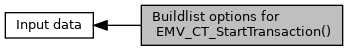

[Macros](#define-members)

see <a href="group___a_d_k___t_r_x___e_x_e_c.md#a50ed6530cd7bb4e149f0068a07c65dc5">EMV_CT_SELECT_TYPE::InitTXN_Buildlist</a> [More\...](#details)

Collaboration diagram for Buildlist options for EMV_CT_StartTransaction():

|  |  |
|----|----|
| Macros |  |
| #define  | [REUSE_LIST_REMOVE_AID](#ga424a190e27b573d98004e395db003687)   0x00 |
|   | Reuse the existing list and remove the used AID, e.g. after card answered with Status Word 6985 at GPO. [More\...](#ga424a190e27b573d98004e395db003687)  |
| #define  | [BUILD_NEW](#gac80c4b15fc999aaa7a7e08268cd5804a)   0x01 |
|   | Build a new candidate list (needs to be set on start of transaction) [More\...](#gac80c4b15fc999aaa7a7e08268cd5804a)  |
| #define  | [REUSE_EXISTING_LIST_SEL_0](#ga7b5eb66aadc5488f59577c94b178b35f)   0xF0 |
|   | Reentrance mode, if EMV ADK returned EMV_ADK_APP_REQ_CANDIDATE: reuse the existing list do not remove anything and select candidate 1 of the candidate list. [More\...](#ga7b5eb66aadc5488f59577c94b178b35f)  |
| #define  | [REUSE_EXISTING_LIST_SEL_1](#gab72a8df31dfed1bf5c508745dff70970)   0xF1 |
|   | Reentrance mode, if EMV ADK returned EMV_ADK_APP_REQ_CANDIDATE: reuse the existing list do not remove anything and select candidate 2 of the candidate list. [More\...](#gab72a8df31dfed1bf5c508745dff70970)  |
| #define  | [REUSE_EXISTING_LIST_SEL_2](#gae405c146f924f44570d9f2254cbbc133)   0xF2 |
|   | Reentrance mode, if EMV ADK returned EMV_ADK_APP_REQ_CANDIDATE: reuse the existing list do not remove anything and select candidate 3 of the candidate list. [More\...](#gae405c146f924f44570d9f2254cbbc133)  |
| #define  | [REUSE_EXISTING_LIST_SEL_3](#gabe2b4f1f57a00d22cff1861b3cfabe5d)   0xF3 |
|   | Reentrance mode, if EMV ADK returned EMV_ADK_APP_REQ_CANDIDATE: reuse the existing list do not remove anything and select candidate 4 of the candidate list. [More\...](#gabe2b4f1f57a00d22cff1861b3cfabe5d)  |
| #define  | [REUSE_EXISTING_LIST_SEL_4](#ga2cd00e1aaa1f6557fb3903d69afb3c71)   0xF4 |
|   | Reentrance mode, if EMV ADK returned EMV_ADK_APP_REQ_CANDIDATE: reuse the existing list do not remove anything and select candidate 5 of the candidate list. [More\...](#ga2cd00e1aaa1f6557fb3903d69afb3c71)  |

## DetailedDescription {#detailed-description}

see <a href="group___a_d_k___t_r_x___e_x_e_c.md#a50ed6530cd7bb4e149f0068a07c65dc5">EMV_CT_SELECT_TYPE::InitTXN_Buildlist</a>

## MacroDefinition Documentation {#macro-definition-documentation}

## BUILD_NEW 

#define BUILD_NEW   0x01

Build a new candidate list (needs to be set on start of transaction)

## REUSE_EXISTING_LIST_SEL_0 

#define REUSE_EXISTING_LIST_SEL_0   0xF0

Reentrance mode, if EMV ADK returned EMV_ADK_APP_REQ_CANDIDATE: reuse the existing list do not remove anything and select candidate 1 of the candidate list.

## REUSE_EXISTING_LIST_SEL_1 

#define REUSE_EXISTING_LIST_SEL_1   0xF1

Reentrance mode, if EMV ADK returned EMV_ADK_APP_REQ_CANDIDATE: reuse the existing list do not remove anything and select candidate 2 of the candidate list.

## REUSE_EXISTING_LIST_SEL_2 

#define REUSE_EXISTING_LIST_SEL_2   0xF2

Reentrance mode, if EMV ADK returned EMV_ADK_APP_REQ_CANDIDATE: reuse the existing list do not remove anything and select candidate 3 of the candidate list.

## REUSE_EXISTING_LIST_SEL_3 

#define REUSE_EXISTING_LIST_SEL_3   0xF3

Reentrance mode, if EMV ADK returned EMV_ADK_APP_REQ_CANDIDATE: reuse the existing list do not remove anything and select candidate 4 of the candidate list.

## REUSE_EXISTING_LIST_SEL_4 

#define REUSE_EXISTING_LIST_SEL_4   0xF4

Reentrance mode, if EMV ADK returned EMV_ADK_APP_REQ_CANDIDATE: reuse the existing list do not remove anything and select candidate 5 of the candidate list.

## REUSE_LIST_REMOVE_AID 

#define REUSE_LIST_REMOVE_AID   0x00

Reuse the existing list and remove the used AID, e.g. after card answered with Status Word 6985 at GPO.
