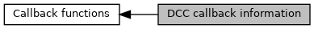

[Macros](#define-members)

Information flags for calling application. [More\...](#details)

Collaboration diagram for DCC callback information:

|  |  |
|----|----|
| Macros |  |
| #define  | [DCC_CBCK_INFO_LEN](#gab73c5753d6f75eff121f419375029d4a)   3 |
|   | Length of `pucDomOption` in bytes. [More\...](#gab73c5753d6f75eff121f419375029d4a)  |
| #define  | [DCC_CBCK_INFO_PDOL_FORBIT](#ga75a19c7a2fa1f0cc270623760bfc89c7)   0x01 |
|   | B1b1: Currency change not allowed for this transaction. Reason is PDOL containing amount or currency. [More\...](#ga75a19c7a2fa1f0cc270623760bfc89c7)  |

## DetailedDescription {#detailed-description}

Information flags for calling application.

Defines for `pucDccInfo` in Dynamic Currency Change handling

## MacroDefinition Documentation {#macro-definition-documentation}

## DCC_CBCK_INFO_LEN 

#define DCC_CBCK_INFO_LEN   3

Length of `pucDomOption` in bytes.

## DCC_CBCK_INFO_PDOL_FORBIT 

#define DCC_CBCK_INFO_PDOL_FORBIT   0x01

B1b1: Currency change not allowed for this transaction. Reason is PDOL containing amount or currency.
