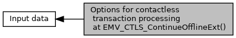

[Macros](#define-members)

Defines for <a href="group___d_e_f___f_l_o_w___i_n_p_u_t.md#aa6e0a0e8b728c3cc137ba2dfac41f277">EMV_CTLS_CONT_OFFL_STRUCT::options</a>. [More\...](#details)

Collaboration diagram for Options for contactless transaction processing at EMV_CTLS_ContinueOfflineExt():

|  |  |
|----|----|
| Macros |  |
| #define  | [INPUT_CTLS_CONT_OFFL_OPT_PIN](#ga408e90eec979417dfff59e16fb34bd7f)   0x01 |
|   | B1b1: Restart for Offline PIN verification (for girocard) [More\...](#ga408e90eec979417dfff59e16fb34bd7f)  |
| #define  | [INPUT_CTLS_CONT_OFFL_OPT_PIN_CANCELLED](#gae889c3e829bd4ef481f5078bd83ff44f)   0x02 |
|   | B1b2-3 = 1: PIN input cancelled (for Epal Post TAA after Online PIN) [More\...](#gae889c3e829bd4ef481f5078bd83ff44f)  |
| #define  | [INPUT_CTLS_CONT_OFFL_OPT_PIN_BYPASSED](#ga4979943c95b87a2268a67690575e8e7b)   0x04 |
|   | B1b2-3 = 2: PIN bypassed (for Epal Post TAA after Online PIN) [More\...](#ga4979943c95b87a2268a67690575e8e7b)  |
| #define  | [INPUT_CTLS_CONT_OFFL_OPT_PIN_ERROR](#gaecebb09ebb584dd273c107b7065aad6b)   0x06 |
|   | B1b2-3 = 3: PIN pad not present or not working (for Epal Post TAA after Online PIN) [More\...](#gaecebb09ebb584dd273c107b7065aad6b)  |

## DetailedDescription {#detailed-description}

Defines for <a href="group___d_e_f___f_l_o_w___i_n_p_u_t.md#aa6e0a0e8b728c3cc137ba2dfac41f277">EMV_CTLS_CONT_OFFL_STRUCT::options</a>.

## MacroDefinition Documentation {#macro-definition-documentation}

## INPUT_CTLS_CONT_OFFL_OPT_PIN 

#define INPUT_CTLS_CONT_OFFL_OPT_PIN   0x01

B1b1: Restart for Offline PIN verification (for girocard)

## INPUT_CTLS_CONT_OFFL_OPT_PIN_BYPASSED 

#define INPUT_CTLS_CONT_OFFL_OPT_PIN_BYPASSED   0x04

B1b2-3 = 2: PIN bypassed (for Epal Post TAA after Online PIN)

## INPUT_CTLS_CONT_OFFL_OPT_PIN_CANCELLED 

#define INPUT_CTLS_CONT_OFFL_OPT_PIN_CANCELLED   0x02

B1b2-3 = 1: PIN input cancelled (for Epal Post TAA after Online PIN)

## INPUT_CTLS_CONT_OFFL_OPT_PIN_ERROR 

#define INPUT_CTLS_CONT_OFFL_OPT_PIN_ERROR   0x06

B1b2-3 = 3: PIN pad not present or not working (for Epal Post TAA after Online PIN)
