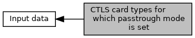

[Macros](#define-members)

Defines for <a href="group___d_e_f___f_l_o_w___i_n_p_u_t.md#a6e4c160c32a77b556aa14495cc0961c5">EMV_CTLS_START_TYPE::passthroughCardTypes</a>. [More\...](#details)

Collaboration diagram for CTLS card types for which passtrough mode is set:

|  |  |
|----|----|
| Macros |  |
| #define  | [CLTRX_PASSTHROUGH_OFF](#ga876dd8c064dae4d0500acba0d3450d48)   0x00 |
|   | no passthrough mode (default) [More\...](#ga876dd8c064dae4d0500acba0d3450d48)  |
| #define  | [CLTRX_PASSTHROUGH_NONISO](#ga680b72a9699246bd218b6bf66077e669)   0x01 |
|   | goto passtrough mode for non ISO 14443 cards (e.g. Mifare) [More\...](#ga680b72a9699246bd218b6bf66077e669)  |
| #define  | [CLTRX_PASSTHROUGH_ALL](#gaf0bcc752a859f20fad2111759aab7728)   0x02 |
|   | goto passtrough mode for all cards [More\...](#gaf0bcc752a859f20fad2111759aab7728)  |

## DetailedDescription {#detailed-description}

Defines for <a href="group___d_e_f___f_l_o_w___i_n_p_u_t.md#a6e4c160c32a77b556aa14495cc0961c5">EMV_CTLS_START_TYPE::passthroughCardTypes</a>.

## MacroDefinition Documentation {#macro-definition-documentation}

## CLTRX_PASSTHROUGH_ALL 

#define CLTRX_PASSTHROUGH_ALL   0x02

goto passtrough mode for all cards

## CLTRX_PASSTHROUGH_NONISO 

#define CLTRX_PASSTHROUGH_NONISO   0x01

goto passtrough mode for non ISO 14443 cards (e.g. Mifare)

## CLTRX_PASSTHROUGH_OFF 

#define CLTRX_PASSTHROUGH_OFF   0x00

no passthrough mode (default)
