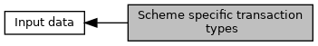

[Macros](#define-members)

Defines for <a href="group___d_e_f___f_l_o_w___i_n_p_u_t.md#ae9357fb5fbb42943ac347ea3b2cd4d6a">EMV_CTLS_START_TYPE::TransType</a>. [More\...](#details)

Collaboration diagram for Scheme specific transaction types:

|  |  |
|----|----|
| Macros |  |
| #define  | [EMV_CTLS_TRAN_TYPE_PURE_GETDATA](#ga6930bb03d82f6791da8103559c05d2f9)   0x78 |
|   | Gemalto/Pure: Retrieval of application proprietary data elements using GET DATA command, needs to be activated by means of <a href="group___d_e_f___f_l_o_w___g_k.md#ga8a1ccff65b5848f71423b936748cc368">EMV_CTLS_FLOW_GK_SUPPORT_GETDATA_0</a>. [More\...](#ga6930bb03d82f6791da8103559c05d2f9)  |
| #define  | [EMV_CTLS_TRAN_TYPE_PURE_PUTDATA](#gaabdbe05a2180b0f425d63013b45d68e4)   0x79 |
|   | Gemalto/Pure: Update of application data proprietary elements using PUT DATA command, needs to be activated by means of <a href="group___d_e_f___f_l_o_w___g_k.md#ga0080e3ed4b67038be346185c35c3af30">EMV_CTLS_FLOW_GK_SUPPORT_PUTDATA_0</a>. [More\...](#gaabdbe05a2180b0f425d63013b45d68e4)  |
| #define  | [EMV_CTLS_TRAN_TYPE_PURE_AUTHENTICATE](#ga6d08c321aeb6c47f6a671cebd429dc60)   0x90 |

## DetailedDescription {#detailed-description}

Defines for <a href="group___d_e_f___f_l_o_w___i_n_p_u_t.md#ae9357fb5fbb42943ac347ea3b2cd4d6a">EMV_CTLS_START_TYPE::TransType</a>.

## MacroDefinition Documentation {#macro-definition-documentation}

## EMV_CTLS_TRAN_TYPE_PURE_AUTHENTICATE 

#define EMV_CTLS_TRAN_TYPE_PURE_AUTHENTICATE   0x90

Gemalto/Pure: Default value for transaction type of \"Application Authentication Transaction\"
Special type of transaction allowing the terminal to only authenticate the contactless device, needs to be activated by <a href="group___d_e_f___f_l_o_w___g_k.md">Gemalto/Pure: Application flow capabilities</a>
Value can be changed by means of <a href="group___d_e_f___c_o_n_f___a_p_p_l_i.md#aefd03a6ffe405efa9370adf010e8d5ec">EMV_CTLS_APPLIDATA_GK_TYPE::AppliAuthTransType_DFAB5A</a>

## EMV_CTLS_TRAN_TYPE_PURE_GETDATA 

#define EMV_CTLS_TRAN_TYPE_PURE_GETDATA   0x78

Gemalto/Pure: Retrieval of application proprietary data elements using GET DATA command, needs to be activated by means of <a href="group___d_e_f___f_l_o_w___g_k.md#ga8a1ccff65b5848f71423b936748cc368">EMV_CTLS_FLOW_GK_SUPPORT_GETDATA_0</a>.

## EMV_CTLS_TRAN_TYPE_PURE_PUTDATA 

#define EMV_CTLS_TRAN_TYPE_PURE_PUTDATA   0x79

Gemalto/Pure: Update of application data proprietary elements using PUT DATA command, needs to be activated by means of <a href="group___d_e_f___f_l_o_w___g_k.md#ga0080e3ed4b67038be346185c35c3af30">EMV_CTLS_FLOW_GK_SUPPORT_PUTDATA_0</a>.
