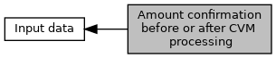

[Macros](#define-members)

Byte defines for <a href="group___a_d_k___t_r_x___e_x_e_c.md#a0bec90f2919a87c70759a313709d4708">EMV_CT_PAYMENT_STRUCT::uc_AmountConfirmation</a>
only valid in case no combined amount confirmation configured (see <a href="group___a_p_p___f_l_o_w___c_a_p_s.md#ga646066dcb5ff2196f23e81697ece0fa0">EMV_CT_CONF_AMOUNT_PIN</a> in <a href="group___a_p_p___f_l_o_w___c_a_p_s.md">Defines for Application flow capabilities</a>) [More\...](#details)

Collaboration diagram for Amount confirmation before or after CVM processing:

|  |  |
|----|----|
| Macros |  |
| #define  | [CONFIRM_AMOUNT_BEFORE_CVM](#ga6f09c9ceeb53c88fe75a0b98f057e68c)   0x00 |
|   | **default** immediately after language selection before CVM [More\...](#ga6f09c9ceeb53c88fe75a0b98f057e68c)  |
| #define  | [CONFIRM_AMOUNT_AFTER_CVM](#ga3c236b770965440b570922685ba301d8)   0x01 |
|   | after cardholder verification [More\...](#ga3c236b770965440b570922685ba301d8)  |

## DetailedDescription {#detailed-description}

Byte defines for <a href="group___a_d_k___t_r_x___e_x_e_c.md#a0bec90f2919a87c70759a313709d4708">EMV_CT_PAYMENT_STRUCT::uc_AmountConfirmation</a>
only valid in case no combined amount confirmation configured (see <a href="group___a_p_p___f_l_o_w___c_a_p_s.md#ga646066dcb5ff2196f23e81697ece0fa0">EMV_CT_CONF_AMOUNT_PIN</a> in <a href="group___a_p_p___f_l_o_w___c_a_p_s.md">Defines for Application flow capabilities</a>)

## MacroDefinition Documentation {#macro-definition-documentation}

## CONFIRM_AMOUNT_AFTER_CVM 

#define CONFIRM_AMOUNT_AFTER_CVM   0x01

after cardholder verification

## CONFIRM_AMOUNT_BEFORE_CVM 

#define CONFIRM_AMOUNT_BEFORE_CVM   0x00

**default**
immediately after language selection before CVM
