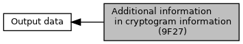

[Macros](#define-members)

9F27 (cryptogram information) can carry more information than just AAC, TC, and ARQC. The ICC has the possibility to give back these additional information. Calling application may use these defines to analyse <a href="group___a_d_k___t_r_x___e_x_e_c.md#a2dbcdd3fc07a3872b2409d8f10cf2120">EMV_CT_TRANSRES_STRUCT::T_9F27_CryptInfo</a>. [More\...](#details)

Collaboration diagram for Additional information in cryptogram information (9F27):

|  |  |
|----|----|
| Macros |  |
| #define  | [EMV_ADK_CARD_REQUESTS_ADVICE](#gabeada254d90b8dba3bc804aa0c4db374)   0x08 |
|   | Card requests advice. [More\...](#gabeada254d90b8dba3bc804aa0c4db374)  |
| #define  | [EMV_ADK_CARD_ADDITIONAL_INFO](#gab52a61222397d5acba24c38c6393e7b2)   0x07 |
|   | Mask for \"service not allowed\", \"PIN try limit exceeded\", \"Issuer authentication failed\". [More\...](#gab52a61222397d5acba24c38c6393e7b2)  |

## DetailedDescription {#detailed-description}

9F27 (cryptogram information) can carry more information than just AAC, TC, and ARQC. The ICC has the possibility to give back these additional information. Calling application may use these defines to analyse <a href="group___a_d_k___t_r_x___e_x_e_c.md#a2dbcdd3fc07a3872b2409d8f10cf2120">EMV_CT_TRANSRES_STRUCT::T_9F27_CryptInfo</a>.

## MacroDefinition Documentation {#macro-definition-documentation}

## EMV_ADK_CARD_ADDITIONAL_INFO 

#define EMV_ADK_CARD_ADDITIONAL_INFO   0x07

Mask for \"service not allowed\", \"PIN try limit exceeded\", \"Issuer authentication failed\".

## EMV_ADK_CARD_REQUESTS_ADVICE 

#define EMV_ADK_CARD_REQUESTS_ADVICE   0x08

Card requests advice.
