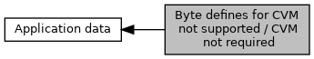

[Macros](#define-members)

see `AIP_CVM_not_supported` and EMV_CT_APPLIDATA_STRUCT::CVM_not_required [More\...](#details)

Collaboration diagram for Byte defines for CVM not supported / CVM not required:

|  |  |
|----|----|
| Macros |  |
| #define  | [CVM_CONTINUE](#ga8bb1eae462533aa3795f253764ebac7a)   0x00 |
|   | continue transaction [More\...](#ga8bb1eae462533aa3795f253764ebac7a)  |
| #define  | [CVM_DEFAULT_SIGN](#ga1921854389d265d4f73a5a728a15b2f0)   0x01 |
|   | execute CVM signature [More\...](#ga1921854389d265d4f73a5a728a15b2f0)  |
| #define  | [CVM_DEFAULT_ONLINE_PIN](#ga5ce67948ce3aed3618597288da18479b)   0x02 |
|   | execute CVM online PIN [More\...](#ga5ce67948ce3aed3618597288da18479b)  |
| #define  | [CVM_ABORT](#gaefe55babdfa8be334b3b7e51c68b7eee)   0x03 |
|   | abort transaction (only for `AIP_CVM_not_supported`) [More\...](#gaefe55babdfa8be334b3b7e51c68b7eee)  |

## DetailedDescription {#detailed-description}

see `AIP_CVM_not_supported` and EMV_CT_APPLIDATA_STRUCT::CVM_not_required

## MacroDefinition Documentation {#macro-definition-documentation}

## CVM_ABORT 

#define CVM_ABORT   0x03

abort transaction (only for `AIP_CVM_not_supported`)

## CVM_CONTINUE 

#define CVM_CONTINUE   0x00

continue transaction

## CVM_DEFAULT_ONLINE_PIN 

#define CVM_DEFAULT_ONLINE_PIN   0x02

execute CVM online PIN

## CVM_DEFAULT_SIGN 

#define CVM_DEFAULT_SIGN   0x01

execute CVM signature
