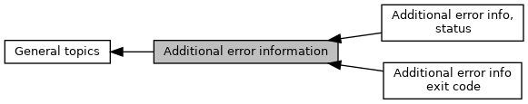

[Modules](#groups)

Filled in case of error, value to describe which error occured. [More\...](#details)

Collaboration diagram for Additional error information:

|  |  |
|----|----|
| Modules |  |
|   | <a href="group___d_e_f___a_d_k___d_e_b_u_g___e_x_i_t.md">Additional error info exit code</a> |
|   | Last step performed by EMV ADK 0 ? 10-27 VK-related 30-4B Amex 50-6x Discover 7 Gemalto 80-8A setup 9 ? A0-B5 common TXN C0-DB MK-related E ? F0-F4 online.  |
|   | <a href="group___d_e_f___a_d_k___d_e_b_u_g___s_t_a_t_u_s.md">Additional error info, status</a> |
|   | Internal error index.  |

## DetailedDescription {#detailed-description}

Filled in case of error, value to describe which error occured.
