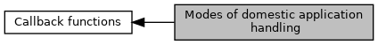

[Macros](#define-members)

Used as return <a href="group___t_l_v___c_b_c_k___t_l_v.md#gaa554c75ed30b7eeb73ff2a981b8878eb">TAG_DF7E_CBK_DOM_APP_RES</a> for <a href="adk__emv__contactless__programmers__guide_8dox.md#a591fd0f380cd390007ce78b47be923c4">EMV_CT_CALLBACK_FnT</a> <a href="group___c_b_c_k___f_c_t___t_a_g_s.md#gafd0adcc12331559863dd65d8f7558645">TAG_BF05_CBK_DOM_APPS</a>. [More\...](#details)

Collaboration diagram for Modes of domestic application handling:

|  |  |
|----|----|
| Macros |  |
| #define  | [CBK_DOMAPP_REMAIN](#ga9df562a61a3941870ed28d1db0ab93d2)   0 |
|   | Don\'t remove from candidate list. [More\...](#ga9df562a61a3941870ed28d1db0ab93d2)  |
| #define  | [CBK_DOMAPP_REMOVE](#ga6177c7304bd1b81ce2826f3310e56c90)   1 |
|   | Remove from candidate list. [More\...](#ga6177c7304bd1b81ce2826f3310e56c90)  |
| #define  | [CBK_DOMAPP_REMAIN2](#ga71c41dde86db0739cedd9a8ca7f9a47a)   2 |
|   | Don\'t remove from candidate list. Additionally suppress final SELECT. Needed e.g. for German ec card. Transaction processing is done outside EMV kernel. [More\...](#ga71c41dde86db0739cedd9a8ca7f9a47a)  |
| #define  | [CBK_DOMAPP_REMAIN3](#ga5a401e87789e333246ddd1b39755d004)   3 |
|   | Don\'t remove from candidate list. Additionally suppress all following SELECTs. Used for enhancing performance in case it\'s clear that transaction will be done outside EMV kernel. [More\...](#ga5a401e87789e333246ddd1b39755d004)  |

## DetailedDescription {#detailed-description}

Used as return <a href="group___t_l_v___c_b_c_k___t_l_v.md#gaa554c75ed30b7eeb73ff2a981b8878eb">TAG_DF7E_CBK_DOM_APP_RES</a> for <a href="adk__emv__contactless__programmers__guide_8dox.md#a591fd0f380cd390007ce78b47be923c4">EMV_CT_CALLBACK_FnT</a> <a href="group___c_b_c_k___f_c_t___t_a_g_s.md#gafd0adcc12331559863dd65d8f7558645">TAG_BF05_CBK_DOM_APPS</a>.

## MacroDefinition Documentation {#macro-definition-documentation}

## CBK_DOMAPP_REMAIN 

#define CBK_DOMAPP_REMAIN   0

Don\'t remove from candidate list.

## CBK_DOMAPP_REMAIN2 

#define CBK_DOMAPP_REMAIN2   2

Don\'t remove from candidate list. Additionally suppress final SELECT. Needed e.g. for German ec card. Transaction processing is done outside EMV kernel.

## CBK_DOMAPP_REMAIN3 

#define CBK_DOMAPP_REMAIN3   3

Don\'t remove from candidate list. Additionally suppress all following SELECTs. Used for enhancing performance in case it\'s clear that transaction will be done outside EMV kernel.

## CBK_DOMAPP_REMOVE 

#define CBK_DOMAPP_REMOVE   1

Remove from candidate list.
