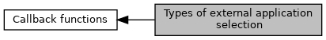

[Macros](#define-members)

Used as input for callback function \"Application Selection\" \--\> ReduceCandidateList() (`ucSelector`). [More\...](#details)

Collaboration diagram for Types of external application selection:

|  |  |
|----|----|
| Macros |  |
| #define  | [CBK_SEL_MERCHANT](#gaac1486bf963308d52f694ceb1d631a5f)   0x00 |
|   | Merchant has to select. [More\...](#gaac1486bf963308d52f694ceb1d631a5f)  |
| #define  | [CBK_SEL_CUSTOMER](#ga4c6005739c97351e79a3e8a7419d9638)   0x01 |
|   | Customer has to select. [More\...](#ga4c6005739c97351e79a3e8a7419d9638)  |

## DetailedDescription {#detailed-description}

Used as input for callback function \"Application Selection\" \--\> ReduceCandidateList() (`ucSelector`).

## MacroDefinition Documentation {#macro-definition-documentation}

## CBK_SEL_CUSTOMER 

#define CBK_SEL_CUSTOMER   0x01

Customer has to select.

## CBK_SEL_MERCHANT 

#define CBK_SEL_MERCHANT   0x00

Merchant has to select.
