[Modules](#groups) \| [Data Structures](#nested-classes) \| [Typedefs](#typedef-members)

Definitions used for functions <a href="group___f_u_n_c___c_o_n_f.md#ga73ca1735defbb65a1aae2ead1de70233">EMV_CT_SetAppliData()</a>, <a href="group___f_u_n_c___c_o_n_f.md#ga363163e375895b7d3ad03ace5df5d0d3">EMV_CT_GetAppliData()</a> [More\...](#details)

Collaboration diagram for Application data:

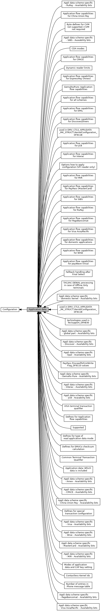

|  |  |
|----|----|
| Modules |  |
|   | <a href="group___c_l___t_t_q.md">VISA terminal transaction qualifier</a> |
|   | Possible values for [EMV_CTLS_APPLIDATA_VK_STRUCT::TerminalTransactionQualifier_9F66](#a81ada881cb9cb5271821724dbc124fe0 "TempUpdate allowed: YES   Description: Visa-defined Terminal Transaction Qualifiers   Availability bi...").  |
|   | <a href="group___t_t_q.md">Common Terminal Transaction Qualifier</a> |
|   | TTQ bits as defined \[EMV-A\] section 5.7.  |
|   | <a href="group___d_y_n_a_m_i_c___r_e_a_d_e_r___l_i_m_i_t_s.md">Dynamic reader limits</a> |
|   | <a href="group___p_p3___p_m_t___n_o___o_f___e_n_t_r_i_e_s.md">Number of entries in Phone message table</a> |
|   | Number of entries in Phone message table.  |
|   | <a href="group___a_p_p_l_y___c_o_n_f_i_g___o_p_t_i_o_n.md">Options how to apply configuration (VFI reader only)</a> |
|   | Options for <a href="group___f_u_n_c___c_o_n_f.md#gaa5352e4331b8fd16eaa02b1bbb7027c2">EMV_CTLS_ApplyConfiguration()</a>  |
|   | <a href="group___d_e_f___k_e_r_n_e_l___i_d.md">Contactless Kernel Ids</a> |
|   | Short or Extended Kernel Id as integer.  |
|   | <a href="group___d_e_f___t_e_c.md">technologies used in TecSupport_DFAB30</a> |
|   | <a href="group___d_e_f___m_k___k_e_r_n_c_f_g.md">used in EMV_CTLS_APPLIDATA_MK_STRUCT::KernelConfiguration_DF811B</a> |
|   | <a href="group___d_e_f___r_k___k_e_r_n_c_f_g.md">used in EMV_CTLS_APPLIDATA_RK_STRUCT::KernelConfiguration_DF811B</a> |
|   | <a href="group___d_e_f___f_l_o_w___g_l_o_b.md">Application flow capabilities for all schemes</a> |
|   | Contents of [EMV_CTLS_APPLIDATA_SCHEME_SPECIFIC_STRUCT::AppFlowCap_DFAB03](#a6b141ca640db3a0ea501018167b70531).  |
|   | <a href="group___d_e_f___f_l_o_w___m_k.md">Application flow capabilities for PayPass (MasterCard)</a> |
|   | Contents of [EMV_CTLS_APPLIDATA_MK_STRUCT::AppFlowCap_DFAB31](#a2ecdf1dde8e274003bee99e35551f0e8 "TempUpdate allowed: YES   Description: Configure special application characteristics,...").  |
|   | <a href="group___d_e_f___f_l_o_w___v_k.md">Application flow capabilities for payWave (Visa)</a> |
|   | Contents of [EMV_CTLS_APPLIDATA_VK_STRUCT::AppFlowCap_DFAB31](#a2ecdf1dde8e274003bee99e35551f0e8 "TempUpdate allowed: YES   Description: Configure special application characteristics,...").  |
|   | <a href="group___d_e_f___f_l_o_w___a_k.md">Application flow capabilities for ExpressPay (Amex)</a> |
|   | Contents of [EMV_CTLS_APPLIDATA_AK_STRUCT::AppFlowCap_DFAB31](#a2ecdf1dde8e274003bee99e35551f0e8 "TempUpdate allowed: YES   Description: Configure special application characteristics,...").  |
|   | <a href="group___d_e_f___f_l_o_w___j_k.md">Application flow capabilities for JCB</a> |
|   | Contents of [EMV_CTLS_APPLIDATA_JK_STRUCT::AppFlowCap_DFAB31](#a2ecdf1dde8e274003bee99e35551f0e8 "TempUpdate allowed: YES   Description: Configure special application characteristics,...").  |
|   | <a href="group___d_e_f___f_l_o_w___d_k.md">Application flow capabilities for Discover/Diners</a> |
|   | Contents of [EMV_CTLS_APPLIDATA_DK_STRUCT::AppFlowCap_DFAB31](#a2ecdf1dde8e274003bee99e35551f0e8 "TempUpdate allowed: YES   Description: Configure special application characteristics,...").  |
|   | <a href="group___d_e_f___f_l_o_w___i_k.md">Application flow capabilities for Interac</a> |
|   | Contents of [EMV_CTLS_APPLIDATA_IK_STRUCT::AppFlowCap_DFAB31](#a2ecdf1dde8e274003bee99e35551f0e8 "TempUpdate allowed: YES   Description: Configure special application characteristics,...").  |
|   | <a href="group___d_e_f___f_l_o_w___e_k.md">Application flow capabilities for EPAL</a> |
|   | Contents of [EMV_CTLS_APPLIDATA_EK_STRUCT::AppFlowCap_DFAB31](#a2ecdf1dde8e274003bee99e35551f0e8 "TempUpdate allowed: YES   Description: Configure special application characteristics,...").  |
|   | <a href="group___d_e_f___f_l_o_w___p_k.md">Application flow capabilities for Visa Asia/Pacific</a> |
|   | Contents of [EMV_CTLS_APPLIDATA_PK_STRUCT::AppFlowCap_DFAB31](#a2ecdf1dde8e274003bee99e35551f0e8 "TempUpdate allowed: YES   Description: Configure special application characteristics,...").  |
|   | <a href="group___d_e_f___f_l_o_w___c_k.md">Application flow capabilities for China Union Pay</a> |
|   | Contents of [EMV_CTLS_APPLIDATA_CK_STRUCT::AppFlowCap_DFAB31](#a2ecdf1dde8e274003bee99e35551f0e8 "TempUpdate allowed: YES   Description: Configure special application characteristics,...").  |
|   | <a href="group___d_e_f___f_l_o_w___g_k.md">Gemalto/Pure: Application flow capabilities</a> |
|   | Defines for [EMV_CTLS_APPLIDATA_GK_STRUCT::AppFlowCap_DFAB31](#a2ecdf1dde8e274003bee99e35551f0e8 "TempUpdate allowed: YES   Description: Configure special application characteristics,...").  |
|   | <a href="group___d_e_f___f_l_o_w___r_k.md">Application flow capabilities for RuPay</a> |
|   | Contents of [EMV_CTLS_APPLIDATA_RK_STRUCT::AppFlowCap_DFAB31](#a2ecdf1dde8e274003bee99e35551f0e8 "TempUpdate allowed: YES   Description: Configure special application characteristics,...").  |
|   | <a href="group___d_e_f___f_l_o_w___s_k.md">Application flow capabilities for SIBS</a> |
|   | Contents of [EMV_CTLS_APPLIDATA_SK_STRUCT::AppFlowCap_DFAB31](#a2ecdf1dde8e274003bee99e35551f0e8 "TempUpdate allowed: YES   Description: Configure special application characteristics,...").  |
|   | <a href="group___d_e_f___f_l_o_w___p_b.md">Application flow capabilities for PagoBancomat</a> |
|   | Contents of [EMV_CTLS_APPLIDATA_PB_STRUCT::AppFlowCap_DFAB31](#a2ecdf1dde8e274003bee99e35551f0e8).  |
|   | <a href="group___d_e_f___f_l_o_w___w_k.md">Application flow capabilities for WISE</a> |
|   | Contents of [EMV_CTLS_APPLIDATA_WK_STRUCT::AppFlowCap_DFAB31](#a2ecdf1dde8e274003bee99e35551f0e8 "TempUpdate allowed: YES   Description: Configure special application characteristics,...").  |
|   | <a href="group___d_e_f___f_l_o_w___b_k.md">Application flow capabilities for CPACE</a> |
|   | Contents of [EMV_CTLS_APPLIDATA_BK_STRUCT::AppFlowCap_DFAB31](#a2ecdf1dde8e274003bee99e35551f0e8 "TempUpdate allowed: YES   Description: Configure special application characteristics,...").  |
|   | <a href="group___d_e_f___f_l_o_w___m_r.md">Application flow capabilities for MIR</a> |
|   | Contents of [EMV_CTLS_APPLIDATA_MR_STRUCT::AppFlowCap_DFAB31](#a2ecdf1dde8e274003bee99e35551f0e8 "TempUpdate allowed: YES   Description: Configure special application characteristics,...").  |
|   | <a href="group___d_e_f___i_n_p_u_t___a_p_p_l_i___m_k.md">Appli data scheme specific - MasterCard - Availability bits</a> |
|   | Contents of the input in [EMV_CTLS_APPLIDATA_MK_STRUCT::IncludedData](#a8197abdca76270355aa725ad5dd52326 "Availability bits, see Appli data scheme specific - MasterCard - Availability bits.").  |
|   | <a href="group___d_e_f___i_n_p_u_t___a_p_p_l_i___m_k___p_r_o_c_e_e_d___f_l_a_g.md">PayPass ProceedToFirstWriteFlag_DF8110 values</a> |
|   | Well-known values for PayPass flag ProceedToFirstWriteFlag(\'DF1810\') in EMV_CTLS_APPLIDATA_MK_STRUCT::Scheme.MK.ProceedToFirstWriteFlag_DF8110.  |
|   | <a href="group___d_e_f___i_n_p_u_t___a_p_p_l_i___v_k.md">Appli data scheme specific - Visa - Availability bits</a> |
|   | Contents of the input in [EMV_CTLS_APPLIDATA_VK_STRUCT::IncludedData](#a8197abdca76270355aa725ad5dd52326 "Availability bits, see Appli data scheme specific - Visa - Availability bits.").  |
|   | <a href="group___d_e_f___i_n_p_u_t___a_p_p_l_i___a_k.md">Appli data scheme specific - Amex - Availability bits</a> |
|   | Contents of the input in [EMV_CTLS_APPLIDATA_AK_STRUCT::IncludedData](#a8197abdca76270355aa725ad5dd52326 "Availability bits, see Appli data scheme specific - Amex - Availability bits.").  |
|   | <a href="group___d_e_f___i_n_p_u_t___a_p_p_l_i___j_k.md">Appli data scheme specific - JCB - Avaiability bits</a> |
|   | Contents of the input in [EMV_CTLS_APPLIDATA_JK_STRUCT::IncludedData](#a8197abdca76270355aa725ad5dd52326 "Availability bits, see Appli data scheme specific - JCB - Avaiability bits.").  |
|   | <a href="group___d_e_f___i_n_p_u_t___a_p_p_l_i___d_k.md">Appli data scheme specific - Discover - Availability bits</a> |
|   | Contents of the input in [EMV_CTLS_APPLIDATA_DK_STRUCT::IncludedData](#a8197abdca76270355aa725ad5dd52326 "Availability bits, see Appli data scheme specific - Discover - Availability bits.").  |
|   | <a href="group___d_e_f___i_n_p_u_t___a_p_p_l_i___i_k.md">Appli data scheme specific - Interac - Availability bits</a> |
|   | Contents of the input in [EMV_CTLS_APPLIDATA_IK_STRUCT::IncludedData](#a8197abdca76270355aa725ad5dd52326 "Availability bits, see Appli data scheme specific - Interac - Availability bits.").  |
|   | <a href="group___d_e_f___i_n_p_u_t___a_p_p_l_i___e_k.md">Appli data scheme specific - Epal - Availability bits</a> |
|   | Contents of the input in [EMV_CTLS_APPLIDATA_EK_STRUCT::IncludedData](#a8197abdca76270355aa725ad5dd52326 "Availability bits, see Appli data scheme specific - Epal - Availability bits.").  |
|   | <a href="group___d_e_f___i_n_p_u_t___a_p_p_l_i___p_k.md">Appli data scheme specific - Visa Asia/Pacific - Availability bits</a> |
|   | Contents of the input in [EMV_CTLS_APPLIDATA_PK_STRUCT::IncludedData](#a8197abdca76270355aa725ad5dd52326 "Availability bits, see Appli data scheme specific - Visa Asia/Pacific - Availability bits.").  |
|   | <a href="group___d_e_f___i_n_p_u_t___a_p_p_l_i___c_k.md">Appli data scheme specific - China Union Pay - Avaialability bits</a> |
|   | Contents of the input in [EMV_CTLS_APPLIDATA_CK_STRUCT::IncludedData](#a8197abdca76270355aa725ad5dd52326 "Availability bits, see Appli data scheme specific - China Union Pay - Avaialability bits.").  |
|   | <a href="group___d_e_f___i_n_p_u_t___a_p_p_l_i___g_k.md">Appli data scheme specific - Gemalto Pure - Availability bits</a> |
|   | Contents of the input in [EMV_CTLS_APPLIDATA_GK_STRUCT::IncludedData](#a8197abdca76270355aa725ad5dd52326 "Availability bits, see Appli data scheme specific - Gemalto Pure - Availability bits.").  |
|   | <a href="group___d_e_f___i_n_p_u_t___a_p_p_l_i___r_k.md">Appli data scheme specific - RuPay - Availability bits</a> |
|   | Contents of the input in [EMV_CTLS_APPLIDATA_RK_STRUCT::IncludedData](#a8197abdca76270355aa725ad5dd52326 "Availability bits, see Appli data scheme specific - RuPay - Availability bits.").  |
|   | <a href="group___d_e_f___i_n_p_u_t___a_p_p_l_i___s_k.md">Appli data scheme specific - SIBS - Avaiability bits</a> |
|   | Contents of the input in [EMV_CTLS_APPLIDATA_SK_STRUCT::IncludedData](#a8197abdca76270355aa725ad5dd52326 "Availability bits, see Appli data scheme specific - SIBS - Avaiability bits.").  |
|   | <a href="group___d_e_f___i_n_p_u_t___a_p_p_l_i___p_b.md">Appli data scheme specific - PagoBancomat - Availability bits</a> |
|   | Contents of the input in [EMV_CTLS_APPLIDATA_PB_STRUCT::IncludedData](#a8197abdca76270355aa725ad5dd52326 "Availability bits, see Appli data scheme specific - PagoBancomat - Availability bits.").  |
|   | <a href="group___d_e_f___i_n_p_u_t___a_p_p_l_i___w_k.md">Appli data scheme specific - Wise - Availability bits</a> |
|   | Contents of the input in [EMV_CTLS_APPLIDATA_WK_STRUCT::IncludedData](#a8197abdca76270355aa725ad5dd52326 "Availability bits, see Appli data scheme specific - Wise - Availability bits.").  |
|   | <a href="group___d_e_f___i_n_p_u_t___a_p_p_l_i___b_k.md">Appli data scheme specific - CPACE - Availability bits</a> |
|   | Contents of the input in [EMV_CTLS_APPLIDATA_BK_STRUCT::IncludedData](#a8197abdca76270355aa725ad5dd52326 "Availability bits, see Appli data scheme specific - Wise - Availability bits.").  |
|   | <a href="group___d_e_f___i_n_p_u_t___a_p_p_l_i___m_r.md">Appli data scheme specific - MIR - Availability bits</a> |
|   | Contents of the input in EMV_CTLS_APPLIDATA_MIR_STRUCT::IncludedData.  |
|   | <a href="group___d_e_f___i_n_p_u_t___a_p_p_l_i___d_o_m.md">Appli data scheme specific - domestic kernel - Availability bits</a> |
|   | Contents of the input in [EMV_CTLS_APPLIDATA_DOM_STRUCT::IncludedData](#a8197abdca76270355aa725ad5dd52326 "Availability bits, see Appli data scheme specific - domestic kernel - Availability bits.").  |
|   | <a href="group___d_e_f___f_l_o_w___d_o_m.md">application flow capabilities for domestic applications</a> |
|   | Contents of [EMV_CTLS_APPLIDATA_DOM_STRUCT::AppFlowCap_DFAB31](#a2ecdf1dde8e274003bee99e35551f0e8 "TempUpdate allowed: YES   Description: Configure special application characteristics,...").  |
|   | <a href="group___d_e_f___i_n_p_u_t___a_p_p_l_i___g_l_o_b_a_l.md">Appli data scheme specific - global part - Availability bits</a> |
|   | Contents of the input in [EMV_CTLS_APPLIDATA_SCHEME_SPECIFIC_STRUCT::IncludedData](#a8197abdca76270355aa725ad5dd52326 "Availability bits, see Appli data scheme specific - global part - Availability bits.").  |
|   | <a href="group___e_m_v___m_o_d_e_s.md">Supported</a> |
|   | Defines for supported EMV Modes.  |
|   | <a href="group___t_a_c___i_a_c___d_e_n_i_a_l.md">TAC/IAC DENIAL processing in case of Offline Only terminals</a> |
|   | DF15, ICS feature, for `ucAC_before_after` in <a href="group___d_e_f___c_o_n_f___t_e_r_m.md#struct_e_m_v___c_t___t_e_r_m_d_a_t_a___s_t_r_u_c_t">EMV_CT_TERMDATA_STRUCT</a>.  |
|   | <a href="group___c_h_k_s_u_m___d_e_f_s.md">Defines for EMVCo checksum calculation</a> |
|   | other major terminal parameters actually there are only some of them defined most of them are hard coded in the lib as actually needed all of them are Yes / No decisions \--\> whenever there is a need to make this configurable for the checksum there will be another parameter added In brackets there is the default value or the currently hard coded value **only for checksum \--\> no control on the flow,** e.g. Blacklist is controlled per application not per terminal parameters **!!! take respect on the default !!!**  |
|   | <a href="group___d_e_f___i_n_p_u_t___a_p_p_l_i.md">Application data: Which data is included</a> |
|   | Contents of [EMV_CT_APPLIDATA_STRUCT::Info_Included_Data](#ae71321d54e0269c970e1551e1524d8dc "Which data is included in the message, see Application data: Which data is included.").  |
|   | <a href="group___c_v_m___n_o_t___s_u_p_p.md">Byte defines for CVM not supported / CVM not required</a> |
|   | see `AIP_CVM_not_supported` and EMV_CT_APPLIDATA_STRUCT::CVM_not_required  |
|   | <a href="group___a_p_p___f_l_o_w___c_a_p_s.md">Defines for Application flow capabilities</a> |
|   | Application (transaction flow) capabilities (see [EMV_CT_APPLIDATA_STRUCT::App_FlowCap](#a760a1211f0f7f2df285879a21e2fa9d8 "Configure special application characteristics, see Defines for Application flow capabilities,..."))  |
|   | <a href="group___c_d_a___m_o_d_e_s.md">CDA modes</a> |
|   | DF3E, CDA mode to be executed for the named AID.  |
|   | <a href="group___f_b___f_i_n_a_l___s_e_l.md">Fallback handling after Final Select</a> |
|   | DF18, see [EMV_CT_APPLIDATA_STRUCT::uc_FallBack_Handling](#a9d0d4cedf99a248f40af087fdfa40b51 "How to handle Fallback after Final select for the selected application, see Fallback handling after F...").  |
|   | <a href="group___r_e_a_d___a_p_p_l_i___t_y_p_e.md">Defines for type of read application data mode</a> |
|   | <a href="group___a_p_p_l_i___c_o_n_f___m_o_d_e.md">Modes of application data and CAP key setting</a> |
|   | <a href="group___s_p_e_c_i_a_l___t_r_x_s.md">Defines for special transaction configuration</a> |
|   | Special transactions, transaction types and flows.  |

|  |  |
|----|----|
| Data Structures |  |
| struct   | [EMV_CTLS_TAGLIST_STRUCT](#struct_e_m_v___c_t_l_s___t_a_g_l_i_s_t___s_t_r_u_c_t) |
|   | structure for <a href="group___d_e_f___f_l_o_w___i_n_p_u_t.md#ac99d6e6b09a0e3fcbe4d2ec8336a30e2">EMV_CTLS_PAYMENT_TYPE::Additional_Result_Tags</a> [More\...](#struct_e_m_v___c_t_l_s___t_a_g_l_i_s_t___s_t_r_u_c_t)  |
| struct   | [EMV_CTLS_APPLIDATA_MK_STRUCT](#struct_e_m_v___c_t_l_s___a_p_p_l_i_d_a_t_a___m_k___s_t_r_u_c_t) |
|   | Structure for configuration of one single application, MK specific part. See see Book C-2, Kernel 2 Specification at <a href="http://www.emvco.com/">[EMVCo Homepage]</a>. See <a href="group___f_u_n_c___c_o_n_f.md#gadc7f2eba5fd3e941d0ddb65a936a0776">EMV_CTLS_SetAppliDataSchemeSpecific()</a> [More\...](#struct_e_m_v___c_t_l_s___a_p_p_l_i_d_a_t_a___m_k___s_t_r_u_c_t)  |
| struct   | [EMV_CTLS_VK_DRL_ENTRY_STRUCT](#struct_e_m_v___c_t_l_s___v_k___d_r_l___e_n_t_r_y___s_t_r_u_c_t) |
|   | Visa Dynamic Reader Limits, single entry Element of [EMV_CTLS_VK_DRL_STRUCT](#struct_e_m_v___c_t_l_s___v_k___d_r_l___s_t_r_u_c_t). [More\...](#struct_e_m_v___c_t_l_s___v_k___d_r_l___e_n_t_r_y___s_t_r_u_c_t)  |
| struct   | [EMV_CTLS_VK_DRL_STRUCT](#struct_e_m_v___c_t_l_s___v_k___d_r_l___s_t_r_u_c_t) |
|   | Visa Dynamic Reader Limits Used in [EMV_CTLS_APPLIDATA_VK_STRUCT::VisaDRLParams_FFAB01](#a125164cdd7dd17625739afaed890ac0f). [More\...](#struct_e_m_v___c_t_l_s___v_k___d_r_l___s_t_r_u_c_t)  |
| struct   | [EMV_CTLS_APPLIDATA_VK_STRUCT](#struct_e_m_v___c_t_l_s___a_p_p_l_i_d_a_t_a___v_k___s_t_r_u_c_t) |
|   | Structure for configuration of one single application, VK specific part. See see Book C-3, Kernel 3 Specification at <a href="http://www.emvco.com/">[EMVCo Homepage]</a>. See <a href="group___f_u_n_c___c_o_n_f.md#gadc7f2eba5fd3e941d0ddb65a936a0776">EMV_CTLS_SetAppliDataSchemeSpecific()</a> [More\...](#struct_e_m_v___c_t_l_s___a_p_p_l_i_d_a_t_a___v_k___s_t_r_u_c_t)  |
| struct   | [EMV_CTLS_AK_DRL_ENTRY_STRUCT](#struct_e_m_v___c_t_l_s___a_k___d_r_l___e_n_t_r_y___s_t_r_u_c_t) |
|   | Amex Dynamic Reader Limits, single entry Element of [EMV_CTLS_AK_DRL_STRUCT](#struct_e_m_v___c_t_l_s___a_k___d_r_l___s_t_r_u_c_t). [More\...](#struct_e_m_v___c_t_l_s___a_k___d_r_l___e_n_t_r_y___s_t_r_u_c_t)  |
| struct   | [EMV_CTLS_AK_DRL_STRUCT](#struct_e_m_v___c_t_l_s___a_k___d_r_l___s_t_r_u_c_t) |
|   | Amex Dynamic Reader Limits Used in [EMV_CTLS_APPLIDATA_AK_STRUCT::AmexDRLParams_FFAB01](#adb7925c29affa71ae450ef807bd07e85). [More\...](#struct_e_m_v___c_t_l_s___a_k___d_r_l___s_t_r_u_c_t)  |
| struct   | [EMV_CTLS_APPLIDATA_AK_STRUCT](#struct_e_m_v___c_t_l_s___a_p_p_l_i_d_a_t_a___a_k___s_t_r_u_c_t) |
|   | Structure for configuration of one single application, AK specific part. See see Book C-4, Kernel 4 Specification at <a href="http://www.emvco.com/">[EMVCo Homepage]</a>. See <a href="group___f_u_n_c___c_o_n_f.md#gadc7f2eba5fd3e941d0ddb65a936a0776">EMV_CTLS_SetAppliDataSchemeSpecific()</a> [More\...](#struct_e_m_v___c_t_l_s___a_p_p_l_i_d_a_t_a___a_k___s_t_r_u_c_t)  |
| struct   | [EMV_CTLS_APPLIDATA_JK_STRUCT](#struct_e_m_v___c_t_l_s___a_p_p_l_i_d_a_t_a___j_k___s_t_r_u_c_t) |
|   | Structure for configuration of one single application, JK specific part. See see Book C-5, Kernel 5 Specification at <a href="http://www.emvco.com/">[EMVCo Homepage]</a>. See <a href="group___f_u_n_c___c_o_n_f.md#gadc7f2eba5fd3e941d0ddb65a936a0776">EMV_CTLS_SetAppliDataSchemeSpecific()</a> [More\...](#struct_e_m_v___c_t_l_s___a_p_p_l_i_d_a_t_a___j_k___s_t_r_u_c_t)  |
| struct   | [EMV_CTLS_APPLIDATA_DK_STRUCT](#struct_e_m_v___c_t_l_s___a_p_p_l_i_d_a_t_a___d_k___s_t_r_u_c_t) |
|   | Structure for configuration of one single application, DK specific part. See see Book C-6, Kernel 6 Specification at <a href="http://www.emvco.com/">[EMVCo Homepage]</a>. See <a href="group___f_u_n_c___c_o_n_f.md#gadc7f2eba5fd3e941d0ddb65a936a0776">EMV_CTLS_SetAppliDataSchemeSpecific()</a> [More\...](#struct_e_m_v___c_t_l_s___a_p_p_l_i_d_a_t_a___d_k___s_t_r_u_c_t)  |
| struct   | [EMV_CTLS_APPLIDATA_IK_STRUCT](#struct_e_m_v___c_t_l_s___a_p_p_l_i_d_a_t_a___i_k___s_t_r_u_c_t) |
|   | Structure for configuration of one single application, IK specific part. See <a href="group___f_u_n_c___c_o_n_f.md#gadc7f2eba5fd3e941d0ddb65a936a0776">EMV_CTLS_SetAppliDataSchemeSpecific()</a> [More\...](#struct_e_m_v___c_t_l_s___a_p_p_l_i_d_a_t_a___i_k___s_t_r_u_c_t)  |
| struct   | [EMV_CTLS_APPLIDATA_EK_STRUCT](#struct_e_m_v___c_t_l_s___a_p_p_l_i_d_a_t_a___e_k___s_t_r_u_c_t) |
|   | Structure for configuration of one single application, EK specific part. See <a href="group___f_u_n_c___c_o_n_f.md#gadc7f2eba5fd3e941d0ddb65a936a0776">EMV_CTLS_SetAppliDataSchemeSpecific()</a> [More\...](#struct_e_m_v___c_t_l_s___a_p_p_l_i_d_a_t_a___e_k___s_t_r_u_c_t)  |
| struct   | [EMV_CTLS_APPLIDATA_PK_STRUCT](#struct_e_m_v___c_t_l_s___a_p_p_l_i_d_a_t_a___p_k___s_t_r_u_c_t) |
|   | Structure for configuration of one single application, PK specific part (VisaAP resp. Visa Asia/Pacific resp. Visa Wave 2). See <a href="group___f_u_n_c___c_o_n_f.md#gadc7f2eba5fd3e941d0ddb65a936a0776">EMV_CTLS_SetAppliDataSchemeSpecific()</a> [More\...](#struct_e_m_v___c_t_l_s___a_p_p_l_i_d_a_t_a___p_k___s_t_r_u_c_t)  |
| struct   | [EMV_CTLS_APPLIDATA_CK_STRUCT](#struct_e_m_v___c_t_l_s___a_p_p_l_i_d_a_t_a___c_k___s_t_r_u_c_t) |
|   | Structure for configuration of one single application, CK specific part. See see Book C-7, Kernel 7 Specification at <a href="http://www.emvco.com/">[EMVCo Homepage]</a>. See <a href="group___f_u_n_c___c_o_n_f.md#gadc7f2eba5fd3e941d0ddb65a936a0776">EMV_CTLS_SetAppliDataSchemeSpecific()</a> [More\...](#struct_e_m_v___c_t_l_s___a_p_p_l_i_d_a_t_a___c_k___s_t_r_u_c_t)  |
| struct   | [EMV_CTLS_APPLIDATA_GK_STRUCT](#struct_e_m_v___c_t_l_s___a_p_p_l_i_d_a_t_a___g_k___s_t_r_u_c_t) |
|   | Structure for configuration of one single application, GK specific part. See <a href="group___f_u_n_c___c_o_n_f.md#gadc7f2eba5fd3e941d0ddb65a936a0776">EMV_CTLS_SetAppliDataSchemeSpecific()</a> [More\...](#struct_e_m_v___c_t_l_s___a_p_p_l_i_d_a_t_a___g_k___s_t_r_u_c_t)  |
| struct   | [EMV_CTLS_APPLIDATA_RK_STRUCT](#struct_e_m_v___c_t_l_s___a_p_p_l_i_d_a_t_a___r_k___s_t_r_u_c_t) |
|   | Structure for configuration of one single application, RK specific part. See <a href="group___f_u_n_c___c_o_n_f.md#gadc7f2eba5fd3e941d0ddb65a936a0776">EMV_CTLS_SetAppliDataSchemeSpecific()</a> [More\...](#struct_e_m_v___c_t_l_s___a_p_p_l_i_d_a_t_a___r_k___s_t_r_u_c_t)  |
| struct   | [EMV_CTLS_APPLIDATA_SK_STRUCT](#struct_e_m_v___c_t_l_s___a_p_p_l_i_d_a_t_a___s_k___s_t_r_u_c_t) |
|   | Structure for configuration of one single application, SK specific part. See <a href="group___f_u_n_c___c_o_n_f.md#gadc7f2eba5fd3e941d0ddb65a936a0776">EMV_CTLS_SetAppliDataSchemeSpecific()</a> [More\...](#struct_e_m_v___c_t_l_s___a_p_p_l_i_d_a_t_a___s_k___s_t_r_u_c_t)  |
| struct   | [EMV_CTLS_APPLIDATA_PB_STRUCT](#struct_e_m_v___c_t_l_s___a_p_p_l_i_d_a_t_a___p_b___s_t_r_u_c_t) |
|   | Structure for configuration of one single application, PagoBancomat specific part. See <a href="group___f_u_n_c___c_o_n_f.md#gadc7f2eba5fd3e941d0ddb65a936a0776">EMV_CTLS_SetAppliDataSchemeSpecific()</a> [More\...](#struct_e_m_v___c_t_l_s___a_p_p_l_i_d_a_t_a___p_b___s_t_r_u_c_t)  |
| struct   | [EMV_CTLS_APPLIDATA_WK_STRUCT](#struct_e_m_v___c_t_l_s___a_p_p_l_i_d_a_t_a___w_k___s_t_r_u_c_t) |
|   | Structure for configuration of one single application, WISE specific part. [More\...](#struct_e_m_v___c_t_l_s___a_p_p_l_i_d_a_t_a___w_k___s_t_r_u_c_t)  |
| struct   | [EMV_CTLS_APPLIDATA_BK_STRUCT](#struct_e_m_v___c_t_l_s___a_p_p_l_i_d_a_t_a___b_k___s_t_r_u_c_t) |
|   | Structure for configuration of one single application, CPACE specific part. [More\...](#struct_e_m_v___c_t_l_s___a_p_p_l_i_d_a_t_a___b_k___s_t_r_u_c_t)  |
| struct   | [EMV_CTLS_APPLIDATA_MR_STRUCT](#struct_e_m_v___c_t_l_s___a_p_p_l_i_d_a_t_a___m_r___s_t_r_u_c_t) |
|   | Structure for configuration of one single application, MIR specific part. See <a href="group___f_u_n_c___c_o_n_f.md#gadc7f2eba5fd3e941d0ddb65a936a0776">EMV_CTLS_SetAppliDataSchemeSpecific()</a> [More\...](#struct_e_m_v___c_t_l_s___a_p_p_l_i_d_a_t_a___m_r___s_t_r_u_c_t)  |
| struct   | [EMV_CTLS_APPLIDATA_DOM_STRUCT](#struct_e_m_v___c_t_l_s___a_p_p_l_i_d_a_t_a___d_o_m___s_t_r_u_c_t) |
|   | Structure for configuration of one single domestic application See <a href="group___f_u_n_c___c_o_n_f.md#gadc7f2eba5fd3e941d0ddb65a936a0776">EMV_CTLS_SetAppliDataSchemeSpecific()</a> [More\...](#struct_e_m_v___c_t_l_s___a_p_p_l_i_d_a_t_a___d_o_m___s_t_r_u_c_t)  |
| struct   | [EMV_CTLS_APPLIDATA_SCHEME_SPECIFIC_STRUCT](#struct_e_m_v___c_t_l_s___a_p_p_l_i_d_a_t_a___s_c_h_e_m_e___s_p_e_c_i_f_i_c___s_t_r_u_c_t) |
|   | Structure for configuration of one single application. See <a href="group___f_u_n_c___c_o_n_f.md#gadc7f2eba5fd3e941d0ddb65a936a0776">EMV_CTLS_SetAppliDataSchemeSpecific()</a> XML tag <a href="group___a_d_k___x_m_l___t_a_g_s.md#gac59e08c61f80cea0bfd193fea694fcb9">XML_TAG_AD_APP</a> no TLV tag is used. [More\...](#struct_e_m_v___c_t_l_s___a_p_p_l_i_d_a_t_a___s_c_h_e_m_e___s_p_e_c_i_f_i_c___s_t_r_u_c_t)  |
| union   | [EMV_CTLS_APPLIDATA_SCHEME_SPECIFIC_STRUCT.Scheme](#union_e_m_v___c_t_l_s___a_p_p_l_i_d_a_t_a___s_c_h_e_m_e___s_p_e_c_i_f_i_c___s_t_r_u_c_t_8_scheme) |
| struct   | [EMV_CT_APPLIDATA_STRUCT](#struct_e_m_v___c_t___a_p_p_l_i_d_a_t_a___s_t_r_u_c_t) |
|   | Structure for configuration of one single application see <a href="group___f_u_n_c___c_o_n_f.md#ga73ca1735defbb65a1aae2ead1de70233">EMV_CT_SetAppliData()</a> [More\...](#struct_e_m_v___c_t___a_p_p_l_i_d_a_t_a___s_t_r_u_c_t)  |

|  |  |
|----|----|
| Typedefs |  |
| typedef struct [EMV_CTLS_TAGLIST_STRUCT](#struct_e_m_v___c_t_l_s___t_a_g_l_i_s_t___s_t_r_u_c_t)  | [EMV_CTLS_TAGLIST_TYPE](#ga57ba2176522f761be194ad2e85b5f0da) |
|   | structure for <a href="group___d_e_f___f_l_o_w___i_n_p_u_t.md#ac99d6e6b09a0e3fcbe4d2ec8336a30e2">EMV_CTLS_PAYMENT_TYPE::Additional_Result_Tags</a> [More\...](#ga57ba2176522f761be194ad2e85b5f0da)  |
| typedef struct [EMV_CTLS_APPLIDATA_MK_STRUCT](#struct_e_m_v___c_t_l_s___a_p_p_l_i_d_a_t_a___m_k___s_t_r_u_c_t)  | [EMV_CTLS_APPLIDATA_MK_TYPE](#gaba56e669e89822b4f48bc30f5c2ebae1) |
|   | Structure for configuration of one single application, MK specific part. See see Book C-2, Kernel 2 Specification at <a href="http://www.emvco.com/">[EMVCo Homepage]</a>. See <a href="group___f_u_n_c___c_o_n_f.md#gadc7f2eba5fd3e941d0ddb65a936a0776">EMV_CTLS_SetAppliDataSchemeSpecific()</a> [More\...](#gaba56e669e89822b4f48bc30f5c2ebae1)  |
| typedef struct [EMV_CTLS_VK_DRL_ENTRY_STRUCT](#struct_e_m_v___c_t_l_s___v_k___d_r_l___e_n_t_r_y___s_t_r_u_c_t)  | [EMV_CTLS_VK_DRL_ENTRY_TYPE](#gac9c78c2fd5ae73e8ef41dc8218cef85c) |
|   | Visa Dynamic Reader Limits, single entry Element of [EMV_CTLS_VK_DRL_STRUCT](#struct_e_m_v___c_t_l_s___v_k___d_r_l___s_t_r_u_c_t). [More\...](#gac9c78c2fd5ae73e8ef41dc8218cef85c)  |
| typedef struct [EMV_CTLS_VK_DRL_STRUCT](#struct_e_m_v___c_t_l_s___v_k___d_r_l___s_t_r_u_c_t)  | [EMV_CTLS_VK_DRL_TYPE](#ga7be85ed336ebc73e9ef58f281ed0da40) |
|   | Visa Dynamic Reader Limits Used in [EMV_CTLS_APPLIDATA_VK_STRUCT::VisaDRLParams_FFAB01](#a125164cdd7dd17625739afaed890ac0f). [More\...](#ga7be85ed336ebc73e9ef58f281ed0da40)  |
| typedef struct [EMV_CTLS_APPLIDATA_VK_STRUCT](#struct_e_m_v___c_t_l_s___a_p_p_l_i_d_a_t_a___v_k___s_t_r_u_c_t)  | [EMV_CTLS_APPLIDATA_VK_TYPE](#gac029c8863c5eb06acda14a2f48d41e9d) |
|   | Structure for configuration of one single application, VK specific part. See see Book C-3, Kernel 3 Specification at <a href="http://www.emvco.com/">[EMVCo Homepage]</a>. See <a href="group___f_u_n_c___c_o_n_f.md#gadc7f2eba5fd3e941d0ddb65a936a0776">EMV_CTLS_SetAppliDataSchemeSpecific()</a> [More\...](#gac029c8863c5eb06acda14a2f48d41e9d)  |
| typedef struct [EMV_CTLS_AK_DRL_ENTRY_STRUCT](#struct_e_m_v___c_t_l_s___a_k___d_r_l___e_n_t_r_y___s_t_r_u_c_t)  | [EMV_CTLS_AK_DRL_ENTRY_TYPE](#ga07747220e48474bef1eabef79b7feb77) |
|   | Amex Dynamic Reader Limits, single entry Element of [EMV_CTLS_AK_DRL_STRUCT](#struct_e_m_v___c_t_l_s___a_k___d_r_l___s_t_r_u_c_t). [More\...](#ga07747220e48474bef1eabef79b7feb77)  |
| typedef struct [EMV_CTLS_AK_DRL_STRUCT](#struct_e_m_v___c_t_l_s___a_k___d_r_l___s_t_r_u_c_t)  | [EMV_CTLS_AK_DRL_TYPE](#ga00a9baaf196682a20e77ba83ccadc5d5) |
|   | Amex Dynamic Reader Limits Used in [EMV_CTLS_APPLIDATA_AK_STRUCT::AmexDRLParams_FFAB01](#adb7925c29affa71ae450ef807bd07e85). [More\...](#ga00a9baaf196682a20e77ba83ccadc5d5)  |
| typedef struct [EMV_CTLS_APPLIDATA_AK_STRUCT](#struct_e_m_v___c_t_l_s___a_p_p_l_i_d_a_t_a___a_k___s_t_r_u_c_t)  | [EMV_CTLS_APPLIDATA_AK_TYPE](#gafc08ccb098d8d3cf3d6cd5bcca7478ab) |
|   | Structure for configuration of one single application, AK specific part. See see Book C-4, Kernel 4 Specification at <a href="http://www.emvco.com/">[EMVCo Homepage]</a>. See <a href="group___f_u_n_c___c_o_n_f.md#gadc7f2eba5fd3e941d0ddb65a936a0776">EMV_CTLS_SetAppliDataSchemeSpecific()</a> [More\...](#gafc08ccb098d8d3cf3d6cd5bcca7478ab)  |
| typedef struct [EMV_CTLS_APPLIDATA_JK_STRUCT](#struct_e_m_v___c_t_l_s___a_p_p_l_i_d_a_t_a___j_k___s_t_r_u_c_t)  | [EMV_CTLS_APPLIDATA_JK_TYPE](#ga4189320474cc1d562f7319084e8c1554) |
|   | Structure for configuration of one single application, JK specific part. See see Book C-5, Kernel 5 Specification at <a href="http://www.emvco.com/">[EMVCo Homepage]</a>. See <a href="group___f_u_n_c___c_o_n_f.md#gadc7f2eba5fd3e941d0ddb65a936a0776">EMV_CTLS_SetAppliDataSchemeSpecific()</a> [More\...](#ga4189320474cc1d562f7319084e8c1554)  |
| typedef struct [EMV_CTLS_APPLIDATA_DK_STRUCT](#struct_e_m_v___c_t_l_s___a_p_p_l_i_d_a_t_a___d_k___s_t_r_u_c_t)  | [EMV_CTLS_APPLIDATA_DK_TYPE](#ga267df251a12ab18067959fbb03263273) |
|   | Structure for configuration of one single application, DK specific part. See see Book C-6, Kernel 6 Specification at <a href="http://www.emvco.com/">[EMVCo Homepage]</a>. See <a href="group___f_u_n_c___c_o_n_f.md#gadc7f2eba5fd3e941d0ddb65a936a0776">EMV_CTLS_SetAppliDataSchemeSpecific()</a> [More\...](#ga267df251a12ab18067959fbb03263273)  |
| typedef struct [EMV_CTLS_APPLIDATA_IK_STRUCT](#struct_e_m_v___c_t_l_s___a_p_p_l_i_d_a_t_a___i_k___s_t_r_u_c_t)  | [EMV_CTLS_APPLIDATA_IK_TYPE](#ga7459589e600fef382e66d1bc9072c80b) |
|   | Structure for configuration of one single application, IK specific part. See <a href="group___f_u_n_c___c_o_n_f.md#gadc7f2eba5fd3e941d0ddb65a936a0776">EMV_CTLS_SetAppliDataSchemeSpecific()</a> [More\...](#ga7459589e600fef382e66d1bc9072c80b)  |
| typedef struct [EMV_CTLS_APPLIDATA_EK_STRUCT](#struct_e_m_v___c_t_l_s___a_p_p_l_i_d_a_t_a___e_k___s_t_r_u_c_t)  | [EMV_CTLS_APPLIDATA_EK_TYPE](#ga70e368f4b5fe1d191425b2da6756ca56) |
|   | Structure for configuration of one single application, EK specific part. See <a href="group___f_u_n_c___c_o_n_f.md#gadc7f2eba5fd3e941d0ddb65a936a0776">EMV_CTLS_SetAppliDataSchemeSpecific()</a> [More\...](#ga70e368f4b5fe1d191425b2da6756ca56)  |
| typedef struct [EMV_CTLS_APPLIDATA_PK_STRUCT](#struct_e_m_v___c_t_l_s___a_p_p_l_i_d_a_t_a___p_k___s_t_r_u_c_t)  | [EMV_CTLS_APPLIDATA_PK_TYPE](#gaffe4394fe0eba66e4c7727d065a4f78a) |
|   | Structure for configuration of one single application, PK specific part (VisaAP resp. Visa Asia/Pacific resp. Visa Wave 2). See <a href="group___f_u_n_c___c_o_n_f.md#gadc7f2eba5fd3e941d0ddb65a936a0776">EMV_CTLS_SetAppliDataSchemeSpecific()</a> [More\...](#gaffe4394fe0eba66e4c7727d065a4f78a)  |
| typedef struct [EMV_CTLS_APPLIDATA_CK_STRUCT](#struct_e_m_v___c_t_l_s___a_p_p_l_i_d_a_t_a___c_k___s_t_r_u_c_t)  | [EMV_CTLS_APPLIDATA_CK_TYPE](#ga6149772cccdf1361c538a229e5326b15) |
|   | Structure for configuration of one single application, CK specific part. See see Book C-7, Kernel 7 Specification at <a href="http://www.emvco.com/">[EMVCo Homepage]</a>. See <a href="group___f_u_n_c___c_o_n_f.md#gadc7f2eba5fd3e941d0ddb65a936a0776">EMV_CTLS_SetAppliDataSchemeSpecific()</a> [More\...](#ga6149772cccdf1361c538a229e5326b15)  |
| typedef struct [EMV_CTLS_APPLIDATA_GK_STRUCT](#struct_e_m_v___c_t_l_s___a_p_p_l_i_d_a_t_a___g_k___s_t_r_u_c_t)  | [EMV_CTLS_APPLIDATA_GK_TYPE](#gaa3ceed258270a14b3c74bdc484e8cbba) |
|   | Structure for configuration of one single application, GK specific part. See <a href="group___f_u_n_c___c_o_n_f.md#gadc7f2eba5fd3e941d0ddb65a936a0776">EMV_CTLS_SetAppliDataSchemeSpecific()</a> [More\...](#gaa3ceed258270a14b3c74bdc484e8cbba)  |
| typedef struct [EMV_CTLS_APPLIDATA_RK_STRUCT](#struct_e_m_v___c_t_l_s___a_p_p_l_i_d_a_t_a___r_k___s_t_r_u_c_t)  | [EMV_CTLS_APPLIDATA_RK_TYPE](#gaf17edb4419746e5d15b330d62e0dfcbe) |
|   | Structure for configuration of one single application, RK specific part. See <a href="group___f_u_n_c___c_o_n_f.md#gadc7f2eba5fd3e941d0ddb65a936a0776">EMV_CTLS_SetAppliDataSchemeSpecific()</a> [More\...](#gaf17edb4419746e5d15b330d62e0dfcbe)  |
| typedef struct [EMV_CTLS_APPLIDATA_SK_STRUCT](#struct_e_m_v___c_t_l_s___a_p_p_l_i_d_a_t_a___s_k___s_t_r_u_c_t)  | [EMV_CTLS_APPLIDATA_SK_TYPE](#ga8aab4d3af80fa4fee755ac87face0d50) |
|   | Structure for configuration of one single application, SK specific part. See <a href="group___f_u_n_c___c_o_n_f.md#gadc7f2eba5fd3e941d0ddb65a936a0776">EMV_CTLS_SetAppliDataSchemeSpecific()</a> [More\...](#ga8aab4d3af80fa4fee755ac87face0d50)  |
| typedef struct [EMV_CTLS_APPLIDATA_PB_STRUCT](#struct_e_m_v___c_t_l_s___a_p_p_l_i_d_a_t_a___p_b___s_t_r_u_c_t)  | [EMV_CTLS_APPLIDATA_PB_TYPE](#gaa2e44edc23fd5270d6df6894cbc332ae) |
|   | Structure for configuration of one single application, PagoBancomat specific part. See <a href="group___f_u_n_c___c_o_n_f.md#gadc7f2eba5fd3e941d0ddb65a936a0776">EMV_CTLS_SetAppliDataSchemeSpecific()</a> [More\...](#gaa2e44edc23fd5270d6df6894cbc332ae)  |
| typedef struct [EMV_CTLS_APPLIDATA_WK_STRUCT](#struct_e_m_v___c_t_l_s___a_p_p_l_i_d_a_t_a___w_k___s_t_r_u_c_t)  | [EMV_CTLS_APPLIDATA_WK_TYPE](#gaf0e33a821a6376d246dc23cde07f1c2c) |
|   | Structure for configuration of one single application, WISE specific part. [More\...](#gaf0e33a821a6376d246dc23cde07f1c2c)  |
| typedef struct [EMV_CTLS_APPLIDATA_BK_STRUCT](#struct_e_m_v___c_t_l_s___a_p_p_l_i_d_a_t_a___b_k___s_t_r_u_c_t)  | [EMV_CTLS_APPLIDATA_BK_TYPE](#ga636b766c54c1799692d4a4305af45801) |
|   | Structure for configuration of one single application, CPACE specific part. [More\...](#ga636b766c54c1799692d4a4305af45801)  |
| typedef struct [EMV_CTLS_APPLIDATA_MR_STRUCT](#struct_e_m_v___c_t_l_s___a_p_p_l_i_d_a_t_a___m_r___s_t_r_u_c_t)  | [EMV_CTLS_APPLIDATA_MR_TYPE](#gaa3b8f0bd476b3b8017813df2dc861d0c) |
|   | Structure for configuration of one single application, MIR specific part. See <a href="group___f_u_n_c___c_o_n_f.md#gadc7f2eba5fd3e941d0ddb65a936a0776">EMV_CTLS_SetAppliDataSchemeSpecific()</a> [More\...](#gaa3b8f0bd476b3b8017813df2dc861d0c)  |
| typedef struct [EMV_CTLS_APPLIDATA_DOM_STRUCT](#struct_e_m_v___c_t_l_s___a_p_p_l_i_d_a_t_a___d_o_m___s_t_r_u_c_t)  | [EMV_CTLS_APPLIDATA_DOM_TYPE](#ga6757748dcb496b106c6b9116b5db4350) |
|   | Structure for configuration of one single domestic application See <a href="group___f_u_n_c___c_o_n_f.md#gadc7f2eba5fd3e941d0ddb65a936a0776">EMV_CTLS_SetAppliDataSchemeSpecific()</a> [More\...](#ga6757748dcb496b106c6b9116b5db4350)  |
| typedef struct [EMV_CTLS_APPLIDATA_SCHEME_SPECIFIC_STRUCT](#struct_e_m_v___c_t_l_s___a_p_p_l_i_d_a_t_a___s_c_h_e_m_e___s_p_e_c_i_f_i_c___s_t_r_u_c_t)  | [EMV_CTLS_APPLIDATA_SCHEME_SPECIFIC_TYPE](#ga6632685219259930248b2c7aa2186f66) |
|   | Structure for configuration of one single application. See <a href="group___f_u_n_c___c_o_n_f.md#gadc7f2eba5fd3e941d0ddb65a936a0776">EMV_CTLS_SetAppliDataSchemeSpecific()</a> XML tag <a href="group___a_d_k___x_m_l___t_a_g_s.md#gac59e08c61f80cea0bfd193fea694fcb9">XML_TAG_AD_APP</a> no TLV tag is used. [More\...](#ga6632685219259930248b2c7aa2186f66)  |
| typedef struct [EMV_CT_APPLIDATA_STRUCT](#struct_e_m_v___c_t___a_p_p_l_i_d_a_t_a___s_t_r_u_c_t)  | [EMV_CT_APPLIDATA_TYPE](#gaa8587e7da8f3e6d6dc3c4b1e803ce1b3) |
|   | Structure for configuration of one single application see <a href="group___f_u_n_c___c_o_n_f.md#ga73ca1735defbb65a1aae2ead1de70233">EMV_CT_SetAppliData()</a> [More\...](#gaa8587e7da8f3e6d6dc3c4b1e803ce1b3)  |

## DetailedDescription {#detailed-description}

Definitions used for functions <a href="group___f_u_n_c___c_o_n_f.md#ga73ca1735defbb65a1aae2ead1de70233">EMV_CT_SetAppliData()</a>, <a href="group___f_u_n_c___c_o_n_f.md#ga363163e375895b7d3ad03ace5df5d0d3">EMV_CT_GetAppliData()</a>

Definitions used for functions EMV_CTLS_SetAppliData(), EMV_CTLS_GetAppliData()

------------------------------------------------------------------------

## DataStructure Documentation {#data-structure-documentation}

## EMV_CTLS_TAGLIST_STRUCT 

struct EMV_CTLS_TAGLIST_STRUCT

structure for <a href="group___d_e_f___f_l_o_w___i_n_p_u_t.md#ac99d6e6b09a0e3fcbe4d2ec8336a30e2">EMV_CTLS_PAYMENT_TYPE::Additional_Result_Tags</a>

| Data Fields |  |  |
|----|----|----|
| unsigned char | anztag | Number of tags included in `tags`. |
| unsigned short | tags\[<a href="_e_m_v___c_t_l_s___interface_8h.md#a9ec7bd63edc2dd5055a7c596df99a810">EMV_CTLS_MAX_TAGLIST_SIZE</a>\] | Buffer for tags (no length, no value) max. number of tags: <a href="_e_m_v___c_t_l_s___interface_8h.md#a9ec7bd63edc2dd5055a7c596df99a810">EMV_CTLS_MAX_TAGLIST_SIZE</a>. |

## EMV_CTLS_APPLIDATA_MK_STRUCT 

struct EMV_CTLS_APPLIDATA_MK_STRUCT

Structure for configuration of one single application, MK specific part. See see Book C-2, Kernel 2 Specification at <a href="http://www.emvco.com/">[EMVCo Homepage]</a>. See <a href="group___f_u_n_c___c_o_n_f.md#gadc7f2eba5fd3e941d0ddb65a936a0776">EMV_CTLS_SetAppliDataSchemeSpecific()</a>

Collaboration diagram for EMV_CTLS_APPLIDATA_MK_STRUCT:

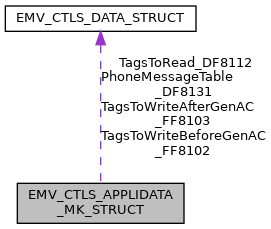

\[<a href="graph_legend.md">legend</a>\]

| Data Fields |  |  |
|----|----|----|
| unsigned char | AcquirerIdentifier_9F01\[6\] | TempUpdate allowed: NO Description: Uniquely identifies the acquirer within each payment system. Availability bit: <a href="group___d_e_f___i_n_p_u_t___a_p_p_l_i___m_k.md#ga0ee137ba711edb5c369e07e8d9b21fd3">INPUT_CTLS_APL_MK_9F01_3</a> TLV tag: <a href="group___e_m_v_c_o___t_a_g_s.md#gaab4cf8e32535962270e6219bcbc08194">TAG_9F01_ACQ_ID</a> XML Tag: <a href="group___a_d_k___x_m_l___t_a_g_s.md#ga814dd46185f7635ee55d0fb6827b0072">XML_TAG_AD_MK_9F01_ACQUIRER_ID</a>. |
| unsigned char | AdditionalTerminalCapabilities_9F40\[5\] | TempUpdate allowed: YES Description: \"Additional Terminal Capabilities\" for this application, only 1st byte is effective Availability bit: <a href="group___d_e_f___i_n_p_u_t___a_p_p_l_i___m_k.md#gac8450b2e7c7a8d2173016baf2312b6ee">INPUT_CTLS_APL_MK_9F40_0</a> TLV tag: <a href="group___e_m_v_c_o___t_a_g_s.md#ga5670c7d223a0af749d5b8b251e32f870">TAG_9F40_ADD_TRM_CAP</a>, XML Tag: <a href="group___a_d_k___x_m_l___t_a_g_s.md#ga3a91157df0e2100cb89154ffb5a3c724">XML_TAG_AD_MK_9F40_ADD_TERM_CAPS</a>. |
| unsigned char | AppFlowCap_DFAB31\[5\] | TempUpdate allowed: YES Description: Configure special application characteristics, see <a href="group___d_e_f___f_l_o_w___m_k.md">Application flow capabilities for PayPass (MasterCard)</a> Availability bit: <a href="group___d_e_f___i_n_p_u_t___a_p_p_l_i___m_k.md#gac012d456ef238f3ba5f1db3650041e1f">INPUT_CTLS_APL_MK_DFAB31_4</a> TLV tag: <a href="group___t_a_g_s___n_e_w___c_f_g___i_n_t_f___p_r_i_m.md#gaf35f7d22b485b509c980566dba2eea1a">TAG_DFAB31_APP_FLOW_CAP</a>, XML Tag: <a href="group___a_d_k___x_m_l___t_a_g_s.md#gaf19d32e414b4c776e4341f53fb872c6a">XML_TAG_AD_MK_DFAB31_APP_FLOW_CAP</a>. |
| unsigned char | CardDataInputCapability_DF8117 | TempUpdate allowed: NO Description: Indicates the card data input capability of the Terminal and Reader (former Byte 1 of 9F33) Availability bit: <a href="group___d_e_f___i_n_p_u_t___a_p_p_l_i___m_k.md#gaf17f62b5934b81459f2ad4261002a6bd">INPUT_CTLS_APL_MK_DF8117_1</a> TLV tag: <a href="group___m_c___t_a_g_s.md#ga42b2457c0910cc5d33ad04ec5ca22974">TAG_DF8117_CARD_DATA_INPUT_CAPABILITY</a> XML Tag: <a href="group___a_d_k___x_m_l___t_a_g_s.md#gab6ec1862aa15b3add923e8b337d9b7ac">XML_TAG_AD_MK_DF8117_CARD_DATA_INPUT_CAP</a>. |
| unsigned char | ChipCVM_aboveLimit_DF8118 | TempUpdate allowed: YES Description: Separate cardholder verification methods for CTLS chip transactions for PayPass3 above the CVM limit (former Byte 2 of 9F33) Availability bit: <a href="group___d_e_f___i_n_p_u_t___a_p_p_l_i___m_k.md#ga81e86b3041e659cd5964026830c79d77">INPUT_CTLS_APL_MK_DF8118_0</a> TLV tag: <a href="group___m_c___t_a_g_s.md#gae26b009b2e8fbc3f96890a6f8f05f917">TAG_DF8118_CVM_CAPABILITY__CVM_REQUIRED</a>, XML Tag: <a href="group___a_d_k___x_m_l___t_a_g_s.md#ga674de16887b9c1b53311137e99ed4258">XML_TAG_AD_MK_DF8118_CHP_CVM_ABOVE_LIMIT</a>. |
| unsigned char | ChipCVM_belowLimit_DF8119 | TempUpdate allowed: YES Description: Separate cardholder verification methods for CTLS chip transactions for PayPass3 below the CVM limit (former Byte 2 of 9F33) Availability bit: <a href="group___d_e_f___i_n_p_u_t___a_p_p_l_i___m_k.md#ga8cbea8489586b551dab2b5ca4cec7a2d">INPUT_CTLS_APL_MK_DF8119_0</a> TLV tag: <a href="group___m_c___t_a_g_s.md#ga891bf29200fdd3a0e520e68bb06d5a8d">TAG_DF8119_CVM_CAPABILITY__NO_CVM_REQUIRED</a>, XML Tag: <a href="group___a_d_k___x_m_l___t_a_g_s.md#gad4e4adeb8ef490e0336b262d74d2cee2">XML_TAG_APPLIDATA_CHIP_CVM_BELOW</a>. |
| unsigned char | ChipVersionNumber_9F09\[2 \*<a href="_e_m_v___c_t_l_s___interface_8h.md#a01aefcde9b880f166817e82c8f2eac99">EMV_CTLS_MAX_APP_VERS</a>\] | TempUpdate allowed: NO Description: Application chip version number mandatory for <a href="group___f_u_n_c___c_o_n_f.md#gadc7f2eba5fd3e941d0ddb65a936a0776">EMV_CTLS_SetAppliDataSchemeSpecific</a> Availability bit: <a href="group___d_e_f___i_n_p_u_t___a_p_p_l_i___m_k.md#ga65d59b0bd5ab783f761712f17310949d">INPUT_CTLS_APL_MK_9F09_1</a> TLV tag: <a href="group___e_m_v_c_o___t_a_g_s.md#gac0fb6f2c9da5e835754d94e7edf4f7c2">TAG_9F09_TRM_APP_VERSION_NB</a>, XML Tag: <a href="group___a_d_k___x_m_l___t_a_g_s.md#gaf92fe97cc679ad4ebd8205e4148a2a79">XML_TAG_AD_MK_9F09_CHP_VERSION_NUMBER</a>. |
| unsigned char | CVMRequiredLimit_DF8126\[6\] | TempUpdate allowed: YES Description: Reader CVM Required Limit (n12) Availability bit: <a href="group___d_e_f___i_n_p_u_t___a_p_p_l_i___m_k.md#gac9b363b55356b4fe128737d02782aabc">INPUT_CTLS_APL_MK_DF8126_1</a> TLV tag: <a href="group___d_e_f___i_n_p_u_t___a_p_p_l_i___m_k.md#gac9b363b55356b4fe128737d02782aabc">INPUT_CTLS_APL_MK_DF8126_1</a>, XML Tag: <a href="group___a_d_k___x_m_l___t_a_g_s.md#gae98f6f8d3a08a02b10f56ef146a0757c">XML_TAG_AD_MK_DF8126_CVM_REQUIRED_LIMIT</a>. |
| unsigned char | DETimeoutValue_DF8127\[2\] | TempUpdate allowed: NO Description: PayPass Data Exchange : Defines the time in ms before the timer generates a TIMEOUT Signal Availability bit: <a href="group___d_e_f___i_n_p_u_t___a_p_p_l_i___m_k.md#gab9b1faa48ac643187bb68d944e9f8932">INPUT_CTLS_APL_MK_DF8127_4</a> TLV tag <a href="group___m_c___t_a_g_s.md#ga4f61ce936421c5a1abfea829e94e5567">TAG_DF8127_DE_TIMEOUT_VALUE</a>, XML Tag: <a href="group___a_d_k___x_m_l___t_a_g_s.md#ga5802d19425a826ecf2cc785b5632ab0b">XML_TAG_AD_MK_DF8127_DE_TIMEOUT_VALUE</a>. |
| unsigned char | DSRequestedOperatorID_9F5C\[8\] | TempUpdate allowed: NO Description: PayPass Data Exchange : Contains the Terminal determined operator identifier for data storage Availability bit: <a href="group___d_e_f___i_n_p_u_t___a_p_p_l_i___m_k.md#gae117465ae208ee5a64df0dd45b8c9ad7">INPUT_CTLS_APL_MK_9F5C_4</a> TLV tag <a href="group___m_c___t_a_g_s.md#gae3ff1dcce86b00807abf063eb2a6de2f">TAG_9F5C_DS_REQUESTED_OPERATOR_ID</a>, XML Tag: <a href="group___a_d_k___x_m_l___t_a_g_s.md#gadd17e779f66be9a83b011d9e01ca2c51">XML_TAG_AD_MK_9F5C_DS_REQUESTED_OPERATOR_ID</a>. |
| unsigned char | FloorLimit_DF8123\[6\] | TempUpdate allowed: YES Description: Reader Contactless Floor Limit (n12) Use \'999999999999\' to disable. Availability bit: <a href="group___d_e_f___i_n_p_u_t___a_p_p_l_i___m_k.md#gae8083f64cec697fe11cffa017750fae6">INPUT_CTLS_APL_MK_DF8123_1</a> TLV tag: <a href="group___m_c___t_a_g_s.md#ga7e3bc2b53045bb7f683762fdb53a4358">TAG_DF8123_FLOOR_LIMIT</a>, XML Tag: <a href="group___a_d_k___x_m_l___t_a_g_s.md#gad835bd5288af49a5c55005d5404a3c60">XML_TAG_AD_MK_DF8123_FLOOR_LIMIT</a>. |
| unsigned char | HoldTimeValue_DF8130 | TempUpdate allowed: NO Description: Indicates the time that the field is to be turned off after the transaction is completed if requested to do so by the cardholder device. Availability bit: <a href="group___d_e_f___i_n_p_u_t___a_p_p_l_i___m_k.md#ga357777d03c596b8a802eb1e159dc577d">INPUT_CTLS_APL_MK_DF8130_3</a> TLV tag: <a href="group___m_c___t_a_g_s.md#ga14b2bd792d60d8cba426bccfc2546ffa">TAG_DF8130_HOLD_TIME_VALUE</a> XML Tag: <a href="group___a_d_k___x_m_l___t_a_g_s.md#gaba4d9f625deef205323f0f44832c745c">XML_TAG_AD_MK_DF8130_HOLD_TIME_VALUE</a>. |
| unsigned char | IncludedData\[8\] | Availability bits, see <a href="group___d_e_f___i_n_p_u_t___a_p_p_l_i___m_k.md">Appli data scheme specific - MasterCard - Availability bits</a>. |
| unsigned char | KernelConfiguration_DF811B | TempUpdate allowed: NO Description: Indicates the Kernel configuration options. Availability bit: <a href="group___d_e_f___i_n_p_u_t___a_p_p_l_i___m_k.md#ga7df744768bbc477cc0abe1cd071f1e09">INPUT_CTLS_APL_MK_DF811B_2</a> TLV tag: <a href="group___m_c___t_a_g_s.md#gaf54761e0bb859b84f08931b53ea2bcb3">TAG_DF811B_KERNEL_CONFIGURATION</a> XML Tag: <a href="group___a_d_k___x_m_l___t_a_g_s.md#gae39599e0c48154673795010e56baeeca">XML_TAG_AD_MK_DF811B_KERNEL_CONFIG</a>. |
| unsigned char | KernelID_DF810C | TempUpdate allowed: NO Description: Contains a value that uniquely identifies each Kernel. There is one occurrence of this data object for each Kernel in the Reader. Availability bit: <a href="group___d_e_f___i_n_p_u_t___a_p_p_l_i___m_k.md#ga71ef8fb16b2e2af0e1efb74a0718119e">INPUT_CTLS_APL_MK_DF810C_2</a> TLV tag: <a href="group___m_c___t_a_g_s.md#ga1ac3033fda29e12b9fecdc62b2744d46">TAG_DF810C_KERNEL_ID</a> XML Tag: <a href="group___a_d_k___x_m_l___t_a_g_s.md#ga7c458a6f36024339052cca5c021a9498">XML_TAG_AD_MK_DF810C_KERNEL_ID</a>. |
| unsigned char | MagstripeCVM_aboveLimit_DF811E | TempUpdate allowed: YES Description: Separate cardholder verification methods for CTLS magstripe transactions for PayPass3 above the CVM limit (former Byte 2 of 9F33) PayPass3 tag: `DF811E` For values see PayPass spec, examples: 0x10=Signature, 0x20=OnlinePIN Availability bit: <a href="group___d_e_f___i_n_p_u_t___a_p_p_l_i___m_k.md#ga4310c82b53d69d449f026175bf002e56">INPUT_CTLS_APL_MK_DF811E_0</a> TLV tag: <a href="group___m_c___t_a_g_s.md#gaafb1df3552503b65888886ebc175c2eb">TAG_DF811E_MSR_CVM_ABOVE_LIMIT</a>, XML Tag: <a href="group___a_d_k___x_m_l___t_a_g_s.md#gade7ba9a4b8d07f82a4581fcda29a61cb">XML_TAG_AD_MK_DF811E_MSR_CVM_ABOVE_LIMIT</a>. |
| unsigned char | MagstripeCVM_belowLimit_DF812C | TempUpdate allowed: YES Description: Separate cardholder verification methods for CTLS magstripe transactions for PayPass3 below the CVM limit (former Byte 2 of 9F33) PayPass3 tag: `DF812C` For values see PayPass spec, examples: 0x10=Signature, 0x20=OnlinePIN Availability bit: <a href="group___d_e_f___i_n_p_u_t___a_p_p_l_i___m_k.md#ga933e525b717e0d53207fa5e70d7695b9">INPUT_CTLS_APL_MK_DF812C_0</a> TLV tag: <a href="group___m_c___t_a_g_s.md#gab4ad1694319aab79dd087cd77de574b9">TAG_DF812C_MSR_CVM_BELOW_LIMIT</a>, XML Tag: <a href="group___a_d_k___x_m_l___t_a_g_s.md#ga0dad35a58403f4c8fa5087c586f655c5">XML_TAG_AD_MK_DF812C_MSR_CVM_BELOW_LIMIT</a>. |
| unsigned char | MerchantCategoryCode_9F15\[2\] | TempUpdate allowed: NO Description: Merchant category code mandatory for <a href="group___f_u_n_c___c_o_n_f.md#gadc7f2eba5fd3e941d0ddb65a936a0776">EMV_CTLS_SetAppliDataSchemeSpecific</a> Availability bit: <a href="group___d_e_f___i_n_p_u_t___a_p_p_l_i___m_k.md#ga052dbaf10b7d6098ab9736d96c6cd7fc">INPUT_CTLS_APL_MK_9F15_2</a> TLV tag: <a href="group___e_m_v_c_o___t_a_g_s.md#ga41481cf04242a0ba441c87f6a1569639">TAG_9F15_MERCH_CATEG_CODE</a>, XML Tag: <a href="group___a_d_k___x_m_l___t_a_g_s.md#ga0168c4a6cd5939953ce0c53ec0f40f6d">XML_TAG_AD_MK_9F15_MERCHANT_CATEGORY_CODE</a>. |
| unsigned char | MerchantCustomData_9F7C\[20\] | TempUpdate allowed: YES Description: Proprietary merchant data that may be requested by the Card TLV tag <a href="group___m_c___t_a_g_s.md#ga347a4ace211c5abd340cc2c2f47e20f0">TAG_9F7C_MERCHANT_CUSTOM_DATA</a> Availability bit: <a href="group___d_e_f___i_n_p_u_t___a_p_p_l_i___m_k.md#gaa2a6d047e37c9b92ed9f5690d9e245c3">INPUT_CTLS_APL_MK_9F7C_5</a>, XML Tag: <a href="group___a_d_k___x_m_l___t_a_g_s.md#ga1c65c23d0311f4bf5594df51e5c13c17">XML_TAG_AD_MK_9F7C_MERCHANT_CUSTOM_DATA</a>. |
| char | MerchantIdentifier_9F16\[15+1\] | TempUpdate allowed: NO Description: Merchant Identifier mandatory for <a href="group___f_u_n_c___c_o_n_f.md#gadc7f2eba5fd3e941d0ddb65a936a0776">EMV_CTLS_SetAppliDataSchemeSpecific</a> Availability bit: <a href="group___d_e_f___i_n_p_u_t___a_p_p_l_i___m_k.md#ga7cd6ee1685086691177128f8c6c68f4d">INPUT_CTLS_APL_MK_9F16_3</a> TLV tag: <a href="group___e_m_v_c_o___t_a_g_s.md#ga184ccaaef50ada9988bfd4af37b8c9fb">TAG_9F16_MERCHANT_ID</a>, XML Tag: <a href="group___a_d_k___x_m_l___t_a_g_s.md#ga4d2be44d5cbfcf50e5a4b9bf9712d379">XML_TAG_AD_MK_9F16_MERCHANT_ID</a>. |
| char | MerchantNameAndLocation_9F4E\[40+1\] | TempUpdate allowed: NO Description: Indicates the name and location of the merchant. Availability bit: <a href="group___d_e_f___i_n_p_u_t___a_p_p_l_i___m_k.md#ga5d7816ce26f4063a5e8da0a0cd9f4565">INPUT_CTLS_APL_MK_9F4E_3</a> TLV tag <a href="group___e_m_v_c_o___t_a_g_s.md#gac3a7de1661225ab41a4529b68d1fda71">TAG_9F4E_TAC_MERCHANTLOC</a>, XML Tag: <a href="group___a_d_k___x_m_l___t_a_g_s.md#gaf3026c3abcf6207e0dfba11d2f9d36b0">XML_TAG_AD_MK_9F4E_MERCHANT_NAME_LOCATION</a>. |
| unsigned char | MessageHoldTime_DF812D\[3\] | TempUpdate allowed: NO Description: Indicates the default delay for the processing of the next MSG Signal. The Message Hold Time is an integer in units of 100ms. Availability bit: <a href="group___d_e_f___i_n_p_u_t___a_p_p_l_i___m_k.md#gaf497ff6b04e63ac262a69c72b90ab660">INPUT_CTLS_APL_MK_DF812D_3</a> TLV tag: <a href="group___m_c___t_a_g_s.md#gab6639b6014ddbc22057a1ad2ed9f21f1">TAG_DF812D_MESSAGE_HOLD_TIME</a> XML Tag: <a href="group___a_d_k___x_m_l___t_a_g_s.md#gaa4927f95fc990fd67a77c10e6dc084de">XML_TAG_AD_MK_DF812D_MESSAGE_HOLD_TIME</a>. |
| unsigned char | MSRVersionNumber_9F6D\[2 \*<a href="_e_m_v___c_t_l_s___interface_8h.md#a01aefcde9b880f166817e82c8f2eac99">EMV_CTLS_MAX_APP_VERS</a>\] | TempUpdate allowed: NO Description: Application msr version number mandatory for <a href="group___f_u_n_c___c_o_n_f.md#gadc7f2eba5fd3e941d0ddb65a936a0776">EMV_CTLS_SetAppliDataSchemeSpecific</a> Availability bit: <a href="group___d_e_f___i_n_p_u_t___a_p_p_l_i___m_k.md#ga39dc40210657bff23d97fa8a7063e28e">INPUT_CTLS_APL_MK_9F6D_1</a> TLV tag: <a href="group___v_i_s_a___t_a_g_s.md#ga730c9d269d7399e534a6d1aad81f4fef">TAG_9F6D_TRM_APP_VERSION_NB</a>, XML Tag: <a href="group___a_d_k___x_m_l___t_a_g_s.md#gad76b1e45cec75ddf20d98737db4215f0">XML_TAG_AD_MK_9F6D_MSR_VERSION_NUMBER</a>. |
| <a href="_e_m_v___c_t_l_s___interface_8h.md#a72d9f02bd046a1c2bf3590be2bca6a26">EMV_CTLS_DATA_TYPE</a> | PhoneMessageTable_DF8131 | TempUpdate allowed: NO Description: Phone message table, up to 10 entries Availability bit: <a href="group___d_e_f___i_n_p_u_t___a_p_p_l_i___m_k.md#ga5d5c6d4e8a43cdb6bfe60586fce71331">INPUT_CTLS_APL_MK_DF8131_3</a> TLV tag <a href="group___m_c___t_a_g_s.md#ga19265599710cf038895aea974b000166">TAG_DF8131_PHONE_MSG_TABLE</a>, XML Tag: <a href="group___a_d_k___x_m_l___t_a_g_s.md#ga62f573381dbe1a8096b0bf13ac15d38c">XML_TAG_AD_MK_DF8131_PHONE_MSG_TABLE</a>. |
| unsigned char | ProceedToFirstWriteFlag_DF8110 | TempUpdate allowed: NO Description: PayPass Data Exchange : Proceed To First Write Flag Availability bit: <a href="group___d_e_f___i_n_p_u_t___a_p_p_l_i___m_k.md#ga140109096315cf8796cc04c7f679a9a2">INPUT_CTLS_APL_MK_DF8110_4</a> TLV tag <a href="group___m_c___t_a_g_s.md#ga3c18d291635a36adf3d61b16ad5e9ee2">TAG_DF8110_PROCEED_TO_FIRST_WRITE_FLAG</a>, XML Tag: <a href="group___a_d_k___x_m_l___t_a_g_s.md#ga2e7c8e656c0332c2d1b9cdc4a81d5ba9">XML_TAG_AD_MK_DF8110_PROCEED_TO_FIRST_WRITE_FLAG</a>. |
| unsigned char | RR_AccuracyThreshold_DF8136\[2\] | TempUpdate allowed: YES Description: Relay Resistance Accuracy Threshold \[1/10 ms\] TLV tag <a href="group___m_c___t_a_g_s.md#gaa8edcf63c6c6e3573a87c1eb06d2c6b1">TAG_DF8136_RR_ACCURACY_THRESHOLD</a> Availability bit: <a href="group___d_e_f___i_n_p_u_t___a_p_p_l_i___m_k.md#ga84c20652dda71b16987f5fb8a1a94a44">INPUT_CTLS_APL_MK_DF8136_5</a>, XML Tag: <a href="group___a_d_k___x_m_l___t_a_g_s.md#gaac645b02a3d5c525a2bd32b37b744877">XML_TAG_AD_MK_DF8136_RR_ACCURACY_THRESHOLD</a>. |
| unsigned char | RR_ExpectedTransTime_CAPDU_DF8134\[2\] | TempUpdate allowed: YES Description: Terminal Expected Transmission Time For Relay Resistance C-APDU \[1/10 ms\] TLV tag <a href="group___m_c___t_a_g_s.md#gaeb20fef28673994edbc531e8e1deef45">TAG_DF8134_RR_TERM_EXPECTED_TRANS_TIME_CAPDU</a> Availability bit: <a href="group___d_e_f___i_n_p_u_t___a_p_p_l_i___m_k.md#ga9e6575c191d67c680c73908a15bef211">INPUT_CTLS_APL_MK_DF8134_5</a>, XML Tag: <a href="group___a_d_k___x_m_l___t_a_g_s.md#gafc255d824c73f5a295a719cae5d3b4c1">XML_TAG_AD_MK_DF8134_RR_EXP_TRANS_TIME_CAPDU</a>. |
| unsigned char | RR_ExpectedTransTime_RAPDU_DF8135\[2\] | TempUpdate allowed: YES Description: Terminal Expected Transmission Time For Relay Resistance R-APDU \[1/10 ms\] TLV tag <a href="group___m_c___t_a_g_s.md#ga884b0eba03de051b0c696f740431e651">TAG_DF8135_RR_TERM_EXPECTED_TRANS_TIME_RAPDU</a> Availability bit: <a href="group___d_e_f___i_n_p_u_t___a_p_p_l_i___m_k.md#gaa64f77cac3079d93e925edfe28d8132d">INPUT_CTLS_APL_MK_DF8135_5</a>, XML Tag: <a href="group___a_d_k___x_m_l___t_a_g_s.md#gaa445cffdf9aa2ba1c155ac70ffd742e4">XML_TAG_AD_MK_DF8135_RR_EXP_TRANS_TIME_RAPDU</a>. |
| unsigned char | RR_MaxGracePeriod_DF8133\[2\] | TempUpdate allowed: YES Description: Maximum Relay Resistance Grace Period \[1/10 ms\] TLV tag <a href="group___m_c___t_a_g_s.md#gaff8cee533b36d5c16c57f9238ef5287f">TAG_DF8133_RR_MAX_GRACE_PERIOD</a> Availability bit: <a href="group___d_e_f___i_n_p_u_t___a_p_p_l_i___m_k.md#gadd2406bbb140700282fa57068d320d7c">INPUT_CTLS_APL_MK_DF8133_5</a>, XML Tag: <a href="group___a_d_k___x_m_l___t_a_g_s.md#ga9d73f54e46c609b8216cc94d9a88aa47">XML_TAG_AD_MK_DF8133_RR_MAX_GRACE_PREIOD</a>. |
| unsigned char | RR_MinGracePeriod_DF8132\[2\] | TempUpdate allowed: YES Description: Minimum Relay Resistance Grace Period \[1/10 ms\] TLV tag <a href="group___m_c___t_a_g_s.md#gad002d7cb64f70850b6b57e2afe610eb2">TAG_DF8132_RR_MIN_GRACE_PERIOD</a> Availability bit: <a href="group___d_e_f___i_n_p_u_t___a_p_p_l_i___m_k.md#ga2a6458b320cc752bfa2c3d69f036aee0">INPUT_CTLS_APL_MK_DF8132_5</a>, XML Tag: <a href="group___a_d_k___x_m_l___t_a_g_s.md#ga514dd5e769fa1ba0d808c97f804e3058">XML_TAG_AD_MK_DF8132_RR_MIN_GRACE_PERIOD</a>. |
| unsigned char | RR_TransTimeMismatchThreshold_DF8137 | TempUpdate allowed: YES Description: Relay Resistance Transmission Time Mismatch Threshold \[%\] TLV tag <a href="group___m_c___t_a_g_s.md#ga13ac475cae84818b777e7d7a697f7001">TAG_DF8137_RR_TRANS_TIME_MISMATCH_THRESHOLD</a> Availability bit: <a href="group___d_e_f___i_n_p_u_t___a_p_p_l_i___m_k.md#gac66ec3b118e175ab0d9d60768efb5b44">INPUT_CTLS_APL_MK_DF8137_5</a>, XML Tag: <a href="group___a_d_k___x_m_l___t_a_g_s.md#ga03a3d5a2a2cdd2a2f324e0e7901c94ee">XML_TAG_AD_MK_DF8137_RR_TT_MISMATCH_THRESHOLD</a>. |
| unsigned char | SecurityCapability_DF811F | TempUpdate allowed: YES Description: Indicates the security capability of the Kernel (former Byte 3 of 9F33) Availability bit: <a href="group___d_e_f___i_n_p_u_t___a_p_p_l_i___m_k.md#ga3cb7df70f18eadef218ea6a135bc0263">INPUT_CTLS_APL_MK_DF811F_1</a> TLV tag: <a href="group___m_c___t_a_g_s.md#gaf663ad885385fe9b0764fd5e159c1b3a">TAG_DF811F_SECURITY_CAPABILITY</a> XML Tag: <a href="group___a_d_k___x_m_l___t_a_g_s.md#ga47293ac969e1d77e6f580e27d3921ad6">XML_TAG_AD_MK_DF811F_SECURITY_CAP</a>. |
| unsigned char | TACDefault_DF8120\[5\] | TempUpdate allowed: YES Description: Terminal Action Code - Default mandatory for <a href="group___f_u_n_c___c_o_n_f.md#gadc7f2eba5fd3e941d0ddb65a936a0776">EMV_CTLS_SetAppliDataSchemeSpecific</a> Availability bit: <a href="group___d_e_f___i_n_p_u_t___a_p_p_l_i___m_k.md#gab2bec67e566e202bbb7ce5d246594a86">INPUT_CTLS_APL_MK_DF8120_2</a> TLV tag: <a href="group___m_c___t_a_g_s.md#ga8de41e2b23c67abd4560ad0e210ebcc0">TAG_DF8120_TAC_DEFAULT</a>, XML Tag: <a href="group___a_d_k___x_m_l___t_a_g_s.md#ga1af41111b9d9e730f45d217506dae165">XML_TAG_AD_MK_DF8120_TAC_DEFAULT</a>. |
| unsigned char | TACDenial_DF8121\[5\] | TempUpdate allowed: YES Description: Terminal Action Code - Denial mandatory for <a href="group___f_u_n_c___c_o_n_f.md#gadc7f2eba5fd3e941d0ddb65a936a0776">EMV_CTLS_SetAppliDataSchemeSpecific</a> Availability bit: <a href="group___d_e_f___i_n_p_u_t___a_p_p_l_i___m_k.md#gad3b41eb479e40b9828136beacf169688">INPUT_CTLS_APL_MK_DF8121_2</a> TLV tag: <a href="group___m_c___t_a_g_s.md#gaf7567abd6f21a6c76f4cf7c5be314b34">TAG_DF8121_TAC_DENIAL</a>, XML Tag: <a href="group___a_d_k___x_m_l___t_a_g_s.md#ga8845dcd232cb753b238289d6deca349b">XML_TAG_AD_MK_DF8121_TAC_DENIAL</a>. |
| unsigned char | TACOnline_DF8122\[5\] | TempUpdate allowed: YES Description: Terminal Action Code - Online mandatory for <a href="group___f_u_n_c___c_o_n_f.md#gadc7f2eba5fd3e941d0ddb65a936a0776">EMV_CTLS_SetAppliDataSchemeSpecific</a> Availability bit: <a href="group___d_e_f___i_n_p_u_t___a_p_p_l_i___m_k.md#ga7c50edd0bf68d84e3722d5b40a44860e">INPUT_CTLS_APL_MK_DF8122_2</a> TLV tag: <a href="group___m_c___t_a_g_s.md#ga223085b47b7d8ef1a7f4ec69f9a32efb">TAG_DF8122_TAC_ONLINE</a>, XML Tag: <a href="group___a_d_k___x_m_l___t_a_g_s.md#gaecd8afc192ef31b6f853ac9f7cafea38">XML_TAG_AD_MK_DF8122_TAC_ONLINE</a>. |
| <a href="_e_m_v___c_t_l_s___interface_8h.md#a72d9f02bd046a1c2bf3590be2bca6a26">EMV_CTLS_DATA_TYPE</a> | TagsToRead_DF8112 | TempUpdate allowed: NO Description: PayPass Data Exchange : Tags To Read. List of tags indicating the data the Terminal has requested to be read Availability bit: <a href="group___d_e_f___i_n_p_u_t___a_p_p_l_i___m_k.md#gac3466cc11d3019044c7d4f1cedba4dc6">INPUT_CTLS_APL_MK_DF8112_4</a> TLV tag <a href="group___m_c___t_a_g_s.md#ga634f6329a34aa4633f4514a41f31a0e3">TAG_DF8112_TAGS_TO_READ</a>, XML Tag: <a href="group___a_d_k___x_m_l___t_a_g_s.md#ga5e877511d6aee528c98221bfb9cc410d">XML_TAG_AD_MK_DF8112_TAGS_TO_READ</a>. |
| <a href="_e_m_v___c_t_l_s___interface_8h.md#a72d9f02bd046a1c2bf3590be2bca6a26">EMV_CTLS_DATA_TYPE</a> | TagsToWriteAfterGenAC_FF8103 | TempUpdate allowed: NO Description: PayPass Data Exchange : Tags To Write After Gen AC Availability bit: <a href="group___d_e_f___i_n_p_u_t___a_p_p_l_i___m_k.md#gadc823291131f924f02eac76f8049a6d7">INPUT_CTLS_APL_MK_FF8103_4</a> TLV tag <a href="group___m_c___t_a_g_s.md#ga59594ea453d6ad2452b61008edaf17f0">TAG_FF8103_TAGS_TO_WRITE_AFTER_GEN_AC</a>, XML Tag: <a href="group___a_d_k___x_m_l___t_a_g_s.md#ga70333473d53b60f7c75912d3e8f46d00">XML_TAG_AD_MK_FF8103_TAGS_TO_WRITE_AFTER_GEN_AC</a>. |
| <a href="_e_m_v___c_t_l_s___interface_8h.md#a72d9f02bd046a1c2bf3590be2bca6a26">EMV_CTLS_DATA_TYPE</a> | TagsToWriteBeforeGenAC_FF8102 | TempUpdate allowed: NO Description: PayPass Data Exchange : Tags To Write Before Gen AC Availability bit: <a href="group___d_e_f___i_n_p_u_t___a_p_p_l_i___m_k.md#ga328bdc67243b432eb3d3f60812b57186">INPUT_CTLS_APL_MK_FF8102_4</a> TLV tag <a href="group___m_c___t_a_g_s.md#ga91e87ea5c33e41742332a70c9e9b25e4">TAG_FF8102_TAGS_TO_WRITE_BEFORE_GEN_AC</a>, XML Tag: <a href="group___a_d_k___x_m_l___t_a_g_s.md#ga9745d646ebc264fa75a570d8f72640d4">XML_TAG_AD_MK_FF8102_TAGS_TO_WRITE_BEFORE_GEN_AC</a>. |
| unsigned char | TermIdent_9F1C\[8\] | TempUpdate allowed: YES Description: Terminal Identification mandatory for <a href="group___f_u_n_c___c_o_n_f.md#gadc7f2eba5fd3e941d0ddb65a936a0776">EMV_CTLS_SetAppliDataSchemeSpecific</a> Availability bit: <a href="group___d_e_f___i_n_p_u_t___a_p_p_l_i___m_k.md#gacd90371fb73b993c9a18c24bdf11441d">INPUT_CTLS_APL_MK_9F1C_0</a> TLV tag <a href="group___e_m_v_c_o___t_a_g_s.md#ga64f401e453e74b4ff1f727aa7cc449ac">TAG_9F1C_TRM_ID</a>, XML Tag: <a href="group___a_d_k___x_m_l___t_a_g_s.md#gadc61cbbb4d2fbfe7481b0a5825acdc45">XML_TAG_AD_MK_9F1C_TERM_IDENT</a>. |
| unsigned char | TerminalCountryCode_9F1A\[2\] | TempUpdate allowed: YES Description: \"Terminal country code\" (e.g. VISA Germany 0276) Availability bit: <a href="group___d_e_f___i_n_p_u_t___a_p_p_l_i___m_k.md#ga2ec4e055285c4f72ba92fde8bdab452e">INPUT_CTLS_APL_MK_9F1A_0</a> TLV tag <a href="group___e_m_v_c_o___t_a_g_s.md#ga5bc987c3686fd5821f20d21015354787">TAG_9F1A_TRM_COUNTRY_CODE</a>, XML Tag: <a href="group___a_d_k___x_m_l___t_a_g_s.md#ga6c616ea6b2a63dbaeb7af6346ebcc58f">XML_TAG_AD_MK_9F1A_TERM_COUNTRY_CODE</a>. |
| unsigned char | TerminalRiskManagementData_9F1D\[8\] | TempUpdate allowed: YES Description: Application-specific value used by the cardholder device for risk management purposes. If not set explicitly, then derived internally as good as possible. Availability bit: <a href="group___d_e_f___i_n_p_u_t___a_p_p_l_i___m_k.md#gace6fd301faa993f74e41456a5d0f33ed">INPUT_CTLS_APL_MK_9F1D_2</a> TLV tag: <a href="group___e_m_v_c_o___t_a_g_s.md#ga9d809ba2d6c28d0989f1bbffffe35a45">TAG_9F1D_TRM_RISK_MNGT_DATA</a> XML Tag: <a href="group___a_d_k___x_m_l___t_a_g_s.md#ga920f167d5422ff346ada24a3cd995037">XML_TAG_AD_MK_9F1D_TRM_RISK_MGMT_DATA</a>. |
| unsigned char | TerminalType_9F35 | TempUpdate allowed: YES Description: Terminal type, possible values see <a href="group___t_e_r_m___t_y_p_e_s.md">Terminaltypes (Tag 9F35)</a>) mandatory for first call of <a href="group___f_u_n_c___c_o_n_f.md#gac5ce9781bba083028538f9e77c2d58f3">EMV_CTLS_SetTermData()</a> Availability bit: <a href="group___d_e_f___i_n_p_u_t___a_p_p_l_i___m_k.md#gad658ff98a05557f86b0f3c31a92cd045">INPUT_CTLS_APL_MK_9F35_0</a> TLV tag: <a href="group___e_m_v_c_o___t_a_g_s.md#gace5b4ef50a58d29b2f5296c2c17273c9">TAG_9F35_TRM_TYPE</a>, XML Tag: <a href="group___a_d_k___x_m_l___t_a_g_s.md#ga435a71218ff105a93e8f7f623f421ad4">XML_TAG_AD_MK_9F35_TERM_TYPE</a>. |
| unsigned char | TornTransactionLifetime_DF811C\[2\] | TempUpdate allowed: NO Description: Lifetime for torn transaction, 0 means no torn txns are stored Availability bit: <a href="group___d_e_f___i_n_p_u_t___a_p_p_l_i___m_k.md#gaeacc29ba701e5c91270d0d5d631f5b6b">INPUT_CTLS_APL_MK_DF811C_3</a> TLV tag: <a href="group___m_c___t_a_g_s.md#ga8aaa1d9ac0acc2a512ea7c4292942818">TAG_DF811C_TRN_TXN_LIFETIME</a>, XML Tag: <a href="group___a_d_k___x_m_l___t_a_g_s.md#gacbabddb1e6ff4c7830023a330ffe568a">XML_TAG_AD_MK_DF811C_TORN_TRX_LIFETIME</a>. |
| unsigned char | TornTransactionNumber_DF811D | TempUpdate allowed: NO Description: Number of torn transaction to stored. Please be aware that this value should be consistent over the AIDs because otherwise the size of the torn txn store will be changed accordingly each time this AID is used for a transaction Availability bit: <a href="group___d_e_f___i_n_p_u_t___a_p_p_l_i___m_k.md#ga23c92909dd85a29f224f04cb2f060386">INPUT_CTLS_APL_MK_DF811D_3</a> TLV tag <a href="group___m_c___t_a_g_s.md#gaafcebff672b6d27983cfd3ffe9568112">TAG_DF811D_TRN_TXN_NUMBER</a>, XML Tag: <a href="group___a_d_k___x_m_l___t_a_g_s.md#ga2fb175cddf554b8062606b2ce6821e6f">XML_TAG_AD_MK_DF811D_TORN_TRX_NUMBER</a>. |
| unsigned char | TransactionCategoryCode_9F53 | TempUpdate allowed: YES Description: Transaction category code: Availability bit: <a href="group___d_e_f___i_n_p_u_t___a_p_p_l_i___m_k.md#ga1f5dbcd4c732ab6cc65b959b1638d1df">INPUT_CTLS_APL_MK_9F53_2</a> TLV tag <a href="group___m_c___t_a_g_s.md#ga47396b01e28e3eadd46f0f1a5f79662e">TAG_9F53_TRANS_CATEGORY_CODE</a>, XML Tag: <a href="group___a_d_k___x_m_l___t_a_g_s.md#ga20f321574abf88bf5b95aac6165602ef">XML_TAG_AD_MK_9F53_TRX_CATEGORY_CODE</a>. |
| unsigned char | TransactionLimitNoOnDevice_DF8124\[6\] | TempUpdate allowed: YES Description: Reader Contactless Transaction Limit (No On-device CVM) (n12) Availability bit: <a href="group___d_e_f___i_n_p_u_t___a_p_p_l_i___m_k.md#ga7aaf40eef4b51d8429e299742f94de8b">INPUT_CTLS_APL_MK_DF8124_1</a> TLV tag <a href="group___m_c___t_a_g_s.md#ga97bfc09582df37b5cc75822f4efbfeb3">TAG_DF8124_READER_CTLS_TRX_LIMIT__NO_ON_DEV_CVM</a>, XML Tag: <a href="group___a_d_k___x_m_l___t_a_g_s.md#gab3652c4dcb2269ea391f48af807ab9b8">XML_TAG_AD_MK_DF8124_TRX_LIMIT_NO_ON_DEVICE</a>. |
| unsigned char | TransactionLimitOnDevice_DF8125\[6\] | TempUpdate allowed: YES Description: Reader Contactless Transaction Limit (On-device CVM) (n12) Availability bit: <a href="group___d_e_f___i_n_p_u_t___a_p_p_l_i___m_k.md#gabb402aa9bc421aeb0dab69ae5791a49f">INPUT_CTLS_APL_MK_DF8125_1</a> TLV tag <a href="group___m_c___t_a_g_s.md#ga55d133646b780225892a8e430d85ed71">TAG_DF8125_READER_CTLS_TRX_LIMIT__ON_DEVICE_CVM</a>, XML Tag: <a href="group___a_d_k___x_m_l___t_a_g_s.md#ga05955203610c16665e7e35d8cc8f40ad">XML_TAG_AD_MK_DF8125_TRX_LIMIT_ON_DEVICE</a>. |

## EMV_CTLS_VK_DRL_ENTRY_STRUCT 

struct EMV_CTLS_VK_DRL_ENTRY_STRUCT

Visa Dynamic Reader Limits, single entry Element of [EMV_CTLS_VK_DRL_STRUCT](#struct_e_m_v___c_t_l_s___v_k___d_r_l___s_t_r_u_c_t).

| Data Fields |  |  |
|----|----|----|
| unsigned char | AppProgramId_9F5A\[16\] | DRL Application programm ID TLV tag <a href="group___v_i_s_a___t_a_g_s.md#gab2e09e3e34f3443924d6cd79016cadec">TAG_9F5A_APP_PROGRAM_ID</a> XML Tag: <a href="group___a_d_k___x_m_l___t_a_g_s.md#gac2deb9d75e2bb86ee5b785bee22c2ea5">XML_TAG_APPLIDATA_VISA_DRL_APP_PRG_ID</a>. |
| unsigned char | AppProgramIdLen | DRL Application programm ID length TLV tag <a href="group___v_i_s_a___t_a_g_s.md#gab2e09e3e34f3443924d6cd79016cadec">TAG_9F5A_APP_PROGRAM_ID</a> XML Tag: <a href="group___a_d_k___x_m_l___t_a_g_s.md#gacfb924d975c29f3209abbf3f506dae03">XML_TAG_APPLIDATA_VISA_DRL_PRG_ID_LEN</a>. |
| unsigned char | ContactlessCVMRequiredLimit_DFAB42\[6\] | Dynamic Reader CVM Required Limit (n12) Use \'999999999999\' to disable TLV tag <a href="group___t_a_g_s___n_e_w___c_f_g___i_n_t_f___p_r_i_m.md#gaf8082e86422522353c6f242f63f71b46">TAG_DFAB42_CTLS_CVM_REQ_LIMIT</a> XML Tag: <a href="group___a_d_k___x_m_l___t_a_g_s.md#ga2e0a7f380e1dc82c40cc9967d2c515ee">XML_TAG_APPLIDATA_VISA_DRL_CVM_LIMIT</a>. |
| unsigned char | ContactlessFloorLimit_DFAB40\[6\] | Dynamic Reader Contactless Floor Limit (n12) Use \'999999999999\' to disable TLV tag <a href="group___t_a_g_s___n_e_w___c_f_g___i_n_t_f___p_r_i_m.md#ga4fbadad5ae4dad262274c4c74dc6deb2">TAG_DFAB40_CTLS_FLOOR_LIMIT</a> XML Tag: <a href="group___a_d_k___x_m_l___t_a_g_s.md#ga96a2449a83693772f26370b86e105727">XML_TAG_APPLIDATA_VISA_DRL_FLOORLIMIT</a>. |
| unsigned char | ContactlessTransactionLimit_DFAB41\[6\] | Dynamic Reader Contactless Transaction Limit (n12) Use \'999999999999\' to disable TLV tag <a href="group___t_a_g_s___n_e_w___c_f_g___i_n_t_f___p_r_i_m.md#gac0ad8ae2d5bd130f089f010278a99b4e">TAG_DFAB41_CTLS_TRX_LIMIT</a> XML Tag: <a href="group___a_d_k___x_m_l___t_a_g_s.md#gad649bea958beed648efb3a83e8afc5b4">XML_TAG_APPLIDATA_VISA_DRL_TXN_LIMIT</a>. |
| unsigned char | OnOffSwitch_DFAB49 | DRL switch on / off DRL features see <a href="group___d_r_l___f_e_a_t_u_r_e___s_w_i_t_c_h_s.md">DRL feature switching</a> TLV tag <a href="group___t_a_g_s___n_e_w___c_f_g___i_n_t_f___p_r_i_m.md#ga8ce5508c4959532fae6923215be6b978">TAG_DFAB49_DRL_SWITCHES</a> XML Tag: <a href="group___a_d_k___x_m_l___t_a_g_s.md#ga19d9ef288f545d4437a0cf95cd171179">XML_TAG_APPLIDATA_VISA_DRL_SWITCH</a>. |

## EMV_CTLS_VK_DRL_STRUCT 

struct EMV_CTLS_VK_DRL_STRUCT

Visa Dynamic Reader Limits Used in [EMV_CTLS_APPLIDATA_VK_STRUCT::VisaDRLParams_FFAB01](#a125164cdd7dd17625739afaed890ac0f).

Collaboration diagram for EMV_CTLS_VK_DRL_STRUCT:

\[<a href="graph_legend.md">legend</a>\]

| Data Fields |  |  |
|----|----|----|
| unsigned short | cnt | number of DRL entries |
| [EMV_CTLS_VK_DRL_ENTRY_TYPE](#gac9c78c2fd5ae73e8ef41dc8218cef85c) \* | data | data |

## EMV_CTLS_APPLIDATA_VK_STRUCT 

struct EMV_CTLS_APPLIDATA_VK_STRUCT

Structure for configuration of one single application, VK specific part. See see Book C-3, Kernel 3 Specification at <a href="http://www.emvco.com/">[EMVCo Homepage]</a>. See <a href="group___f_u_n_c___c_o_n_f.md#gadc7f2eba5fd3e941d0ddb65a936a0776">EMV_CTLS_SetAppliDataSchemeSpecific()</a>

Collaboration diagram for EMV_CTLS_APPLIDATA_VK_STRUCT:

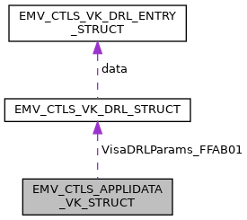

\[<a href="graph_legend.md">legend</a>\]

| Data Fields |  |  |
|----|----|----|
| unsigned char | AdditionalTerminalCapabilities_9F40\[5\] | TempUpdate allowed: YES Description: \"Additional Terminal Capabilities\" for this application, only 1st byte is effective Availability bit: <a href="group___d_e_f___i_n_p_u_t___a_p_p_l_i___v_k.md#ga09132ed01c1c62d055a068b5e57bb4d9">INPUT_CTLS_APL_VK_9F40_0</a> TLV tag: <a href="group___e_m_v_c_o___t_a_g_s.md#ga5670c7d223a0af749d5b8b251e32f870">TAG_9F40_ADD_TRM_CAP</a>, XML Tag: <a href="group___a_d_k___x_m_l___t_a_g_s.md#gacc84599daa188d787a6a01efe5a810df">XML_TAG_AD_VK_9F40_ADD_TERM_CAPS</a>. |
| unsigned char | AppFlowCap_DFAB31\[5\] | TempUpdate allowed: YES Description: Configure special application characteristics, see <a href="group___d_e_f___f_l_o_w___v_k.md">Application flow capabilities for payWave (Visa)</a> Availability bit: <a href="group___d_e_f___i_n_p_u_t___a_p_p_l_i___v_k.md#gaf1469d3deb20ec6e788e2c804236f1ae">INPUT_CTLS_APL_VK_DFAB31_1</a> TLV tag: <a href="group___t_a_g_s___n_e_w___c_f_g___i_n_t_f___p_r_i_m.md#gaf35f7d22b485b509c980566dba2eea1a">TAG_DFAB31_APP_FLOW_CAP</a>, XML Tag: <a href="group___a_d_k___x_m_l___t_a_g_s.md#ga2adec076a8ca589a00714beedf923857">XML_TAG_AD_VK_DFAB31_APP_FLOW_CAP</a>. |
| unsigned char | ContactlessCVMRequiredLimit_DFAB42\[6\] | TempUpdate allowed: NO Description: Reader Contactless CVM Required Limit (n12) Use \'999999999999\' to disable Availability bit: <a href="group___d_e_f___i_n_p_u_t___a_p_p_l_i___v_k.md#ga9c92ef79344c4a1b1615c60c7bf74224">INPUT_CTLS_APL_VK_DFAB42_1</a> TLV tag: <a href="group___t_a_g_s___n_e_w___c_f_g___i_n_t_f___p_r_i_m.md#gaf8082e86422522353c6f242f63f71b46">TAG_DFAB42_CTLS_CVM_REQ_LIMIT</a>, XML Tag: <a href="group___a_d_k___x_m_l___t_a_g_s.md#gaa35158676fea4c9fe5ca7a0a7309fc96">XML_TAG_AD_VK_DFAB42_CTLS_CVM_REQ_LIMIT</a>. |
| unsigned char | ContactlessFloorLimit_DFAB40\[6\] | TempUpdate allowed: NO Description: Reader Contactless Floor Limit (n12) Use \'999999999999\' to disable Availability bit: <a href="group___d_e_f___i_n_p_u_t___a_p_p_l_i___v_k.md#ga243885382a53a88ba6fd72c12c021d4b">INPUT_CTLS_APL_VK_DFAB40_1</a> TLV tag: <a href="group___t_a_g_s___n_e_w___c_f_g___i_n_t_f___p_r_i_m.md#ga4fbadad5ae4dad262274c4c74dc6deb2">TAG_DFAB40_CTLS_FLOOR_LIMIT</a>, XML Tag: <a href="group___a_d_k___x_m_l___t_a_g_s.md#gab988a26d6f3bb8d1d38259be42a9116a">XML_TAG_AD_VK_DFAB40_CTLS_FLOOR_LIMIT</a>. |
| unsigned char | ContactlessTransactionLimit_DFAB41\[6\] | TempUpdate allowed: NO Description: Reader Contactless Transaction Limit (n12) Use \'999999999999\' to disable Availability bit: <a href="group___d_e_f___i_n_p_u_t___a_p_p_l_i___v_k.md#ga61942cb88cbd0e775681070b6155b336">INPUT_CTLS_APL_VK_DFAB41_1</a> TLV tag: <a href="group___t_a_g_s___n_e_w___c_f_g___i_n_t_f___p_r_i_m.md#gac0ad8ae2d5bd130f089f010278a99b4e">TAG_DFAB41_CTLS_TRX_LIMIT</a>, XML Tag: <a href="group___a_d_k___x_m_l___t_a_g_s.md#ga96c2005d60f9b020da6fa6482dfaeb43">XML_TAG_AD_VK_DFAB41_CTLS_TRX_LIMIT</a>. |
| unsigned char | IncludedData\[8\] | Availability bits, see <a href="group___d_e_f___i_n_p_u_t___a_p_p_l_i___v_k.md">Appli data scheme specific - Visa - Availability bits</a>. |
| unsigned char | MerchantCategoryCode_9F15\[2\] | TempUpdate allowed: NO Description: Merchant category code mandatory for <a href="group___f_u_n_c___c_o_n_f.md#gadc7f2eba5fd3e941d0ddb65a936a0776">EMV_CTLS_SetAppliDataSchemeSpecific</a> Availability bit: <a href="group___d_e_f___i_n_p_u_t___a_p_p_l_i___v_k.md#ga8f0c6ca199a42309e0a3744defbb122b">INPUT_CTLS_APL_VK_9F15_0</a> TLV tag: <a href="group___e_m_v_c_o___t_a_g_s.md#ga41481cf04242a0ba441c87f6a1569639">TAG_9F15_MERCH_CATEG_CODE</a>, XML Tag: <a href="group___a_d_k___x_m_l___t_a_g_s.md#ga45bfb73e6cf76f78a10c9e1e08e74d0e">XML_TAG_AD_VK_9F15_MERCHANT_CATEGORY_CODE</a>. |
| char | MerchantIdentifier_9F16\[15+1\] | TempUpdate allowed: NO Description: Merchant Identifier mandatory for <a href="group___f_u_n_c___c_o_n_f.md#gadc7f2eba5fd3e941d0ddb65a936a0776">EMV_CTLS_SetAppliDataSchemeSpecific</a> Availability bit: <a href="group___d_e_f___i_n_p_u_t___a_p_p_l_i___v_k.md#ga029816fb72c20c033c9a795c9f60df8a">INPUT_CTLS_APL_VK_9F16_1</a> TLV tag: <a href="group___e_m_v_c_o___t_a_g_s.md#ga184ccaaef50ada9988bfd4af37b8c9fb">TAG_9F16_MERCHANT_ID</a>, XML Tag: <a href="group___a_d_k___x_m_l___t_a_g_s.md#ga7c59afd2adf52cc7dbe7a0dc3413e364">XML_TAG_AD_VK_9F16_MERCHANT_ID</a>. |
| char | MerchantNameAndLocation_9F4E\[40+1\] | TempUpdate allowed: NO Description: Indicates the name and location of the merchant. Availability bit: <a href="group___d_e_f___i_n_p_u_t___a_p_p_l_i___v_k.md#ga4c2e4d1b1179380f92e0aa25a9416828">INPUT_CTLS_APL_VK_9F4E_1</a> TLV tag: <a href="group___e_m_v_c_o___t_a_g_s.md#gac3a7de1661225ab41a4529b68d1fda71">TAG_9F4E_TAC_MERCHANTLOC</a>, XML Tag: <a href="group___a_d_k___x_m_l___t_a_g_s.md#gab22a58edf8edd9ad6baa077dc4441477">XML_TAG_AD_VK_9F4E_MERCHANT_NAME_LOCATION</a>. |
| unsigned char | TecSupport_DFAB30 | TempUpdate allowed: NO Description: Specifies supported technologies, for values see <a href="group___d_e_f___t_e_c.md">technologies used in TecSupport_DFAB30</a>. Availability bit: <a href="group___d_e_f___i_n_p_u_t___a_p_p_l_i___v_k.md#ga8c4a19e90c2a8d0929fe2a1e53470ad4">INPUT_CTLS_APL_VK_DFAB30_1</a> TLV tag: <a href="group___t_a_g_s___n_e_w___c_f_g___i_n_t_f___p_r_i_m.md#gab9f0400d266ebde31ce4c0b6c2290a67">TAG_DFAB30_TEC_SUPPORT</a> XML Tag: <a href="group___a_d_k___x_m_l___t_a_g_s.md#ga412989d5a92bfb08e8f240eaae1ed189">XML_TAG_AD_VK_DFAB30_TEC_SUPPORT</a>. |
| unsigned char | TermIdent_9F1C\[8\] | TempUpdate allowed: YES Description: Terminal Identification mandatory for <a href="group___f_u_n_c___c_o_n_f.md#gadc7f2eba5fd3e941d0ddb65a936a0776">EMV_CTLS_SetAppliDataSchemeSpecific</a> Availability bit: <a href="group___d_e_f___i_n_p_u_t___a_p_p_l_i___v_k.md#gaa4691c952c3ed471f57eb5a6f30655ea">INPUT_CTLS_APL_VK_9F1C_0</a> TLV tag: <a href="group___e_m_v_c_o___t_a_g_s.md#ga64f401e453e74b4ff1f727aa7cc449ac">TAG_9F1C_TRM_ID</a>, XML Tag: <a href="group___a_d_k___x_m_l___t_a_g_s.md#ga53fa0cc3a0521eb5fc10a0c95db8a47a">XML_TAG_AD_VK_9F1C_TERM_IDENT</a>. |
| unsigned char | TerminalCapabilities_9F33\[3\] | TempUpdate allowed: YES Description: \"Terminal Capabilities\" for this application, for PayPass 3 the tags DF81xx, DF81yy, DF81zz are filled with these 3 byte, for VISA this is used for host compliancy only, for Amex in accordance with tag 9F6E, Availability bit: <a href="group___d_e_f___i_n_p_u_t___a_p_p_l_i___v_k.md#ga998cc8d1e3ce01f7aaad7ce7d477ba9d">INPUT_CTLS_APL_VK_9F33_0</a> TLV tag: <a href="group___e_m_v_c_o___t_a_g_s.md#gad3ec876483505eb23aad4e1b210653f5">TAG_9F33_TRM_CAPABILITIES</a>, XML Tag: <a href="group___a_d_k___x_m_l___t_a_g_s.md#ga9313bc6ba628902d8a8908fe326f2399">XML_TAG_AD_VK_9F33_TERM_CAPS</a>. |
| unsigned char | TerminalCountryCode_9F1A\[2\] | TempUpdate allowed: YES Description: \"Terminal Country Code\" (e.g. VISA Germany 0276) Availability bit: <a href="group___d_e_f___i_n_p_u_t___a_p_p_l_i___v_k.md#gaf0142f503b6060bfd909ff30f5a7265a">INPUT_CTLS_APL_VK_9F1A_0</a> TLV tag: <a href="group___e_m_v_c_o___t_a_g_s.md#ga5bc987c3686fd5821f20d21015354787">TAG_9F1A_TRM_COUNTRY_CODE</a>, XML Tag: <a href="group___a_d_k___x_m_l___t_a_g_s.md#ga48eb194deea62714c82e31929beb28b0">XML_TAG_AD_VK_9F1A_TERM_COUNTRY_CODE</a>. |
| unsigned char | TerminalTransactionQualifier_9F66\[4\] | TempUpdate allowed: YES Description: Visa-defined Terminal Transaction Qualifiers Availability bit: <a href="group___d_e_f___i_n_p_u_t___a_p_p_l_i___v_k.md#ga941ac3b6baba37bf0f4c65fd4076674c">INPUT_CTLS_APL_VK_9F66_0</a> TLV tag: <a href="group___v_i_s_a___t_a_g_s.md#ga30362da6e863c342f262adc3cafb680e">TAG_9F66_TTQ</a>, XML Tag: <a href="group___a_d_k___x_m_l___t_a_g_s.md#gaa981a7d88bda70b2ff465f7b344b234c">XML_TAG_AD_VK_9F66_TERM_TRX_QUALIFIER</a>. |
| unsigned char | TerminalType_9F35 | TempUpdate allowed: YES Description: Terminal type, possible values see <a href="group___t_e_r_m___t_y_p_e_s.md">Terminaltypes (Tag 9F35)</a>) mandatory for first call of <a href="group___f_u_n_c___c_o_n_f.md#gac5ce9781bba083028538f9e77c2d58f3">EMV_CTLS_SetTermData()</a> Availability bit: <a href="group___d_e_f___i_n_p_u_t___a_p_p_l_i___v_k.md#ga98098d6c15136694fc8b780507aaf298">INPUT_CTLS_APL_VK_9F35_0</a> TLV tag: <a href="group___e_m_v_c_o___t_a_g_s.md#gace5b4ef50a58d29b2f5296c2c17273c9">TAG_9F35_TRM_TYPE</a>, XML Tag: <a href="group___a_d_k___x_m_l___t_a_g_s.md#gaa1800858b9442099a9fd38b24dd9674a">XML_TAG_AD_VK_9F35_TERM_TYPE</a>. |
| unsigned char | VersionNumber_9F09\[2 \*<a href="_e_m_v___c_t_l_s___interface_8h.md#a01aefcde9b880f166817e82c8f2eac99">EMV_CTLS_MAX_APP_VERS</a>\] | TempUpdate allowed: NO Description: Application chip version number mandatory for <a href="group___f_u_n_c___c_o_n_f.md#gadc7f2eba5fd3e941d0ddb65a936a0776">EMV_CTLS_SetAppliDataSchemeSpecific</a> Availability bit: <a href="group___d_e_f___i_n_p_u_t___a_p_p_l_i___v_k.md#ga541ca0ee9a8f0147bd3a31dfced80fe2">INPUT_CTLS_APL_VK_9F09_0</a> TLV tag: <a href="group___e_m_v_c_o___t_a_g_s.md#gac0fb6f2c9da5e835754d94e7edf4f7c2">TAG_9F09_TRM_APP_VERSION_NB</a>, XML Tag: <a href="group___a_d_k___x_m_l___t_a_g_s.md#ga4d0897a4bbe59c36fa7454b1ddaa78a5">XML_TAG_AD_VK_9F09_VERSION_NUMBER</a>. |
| [EMV_CTLS_VK_DRL_TYPE](#ga7be85ed336ebc73e9ef58f281ed0da40) | VisaDRLParams_FFAB01 | TempUpdate allowed: NO Description: Dynamic Reader Limits table Availability bit: <a href="group___d_e_f___i_n_p_u_t___a_p_p_l_i___v_k.md#gae1c87294a289555801a8081c0463ebf8">INPUT_CTLS_APL_VK_FFAB01_1</a> TLV tag: <a href="group___t_a_g_s___n_e_w___c_f_g___i_n_t_f___c_o_n_s_t_r.md#ga6da72379bdf0faa5dfcec68ec4dd4510">TAG_FFAB01_DRL_PARAMETER</a>, XML Tag: <a href="group___a_d_k___x_m_l___t_a_g_s.md#ga73d67328f0497c4d5d2f02c173a8bfb7">XML_TAG_AD_VK_FFAB01_VISA_DRL_PARAMS</a>. |

## EMV_CTLS_AK_DRL_ENTRY_STRUCT 

struct EMV_CTLS_AK_DRL_ENTRY_STRUCT

Amex Dynamic Reader Limits, single entry Element of [EMV_CTLS_AK_DRL_STRUCT](#struct_e_m_v___c_t_l_s___a_k___d_r_l___s_t_r_u_c_t).

| Data Fields |  |  |
|----|----|----|
| unsigned char | ContactlessCVMRequiredLimit_DFAB42\[6\] | Dynamic Reader Contactless CVM Required Limit (n12) Use \'999999999999\' to disable. TLV tag: <a href="group___t_a_g_s___n_e_w___c_f_g___i_n_t_f___p_r_i_m.md#gaf8082e86422522353c6f242f63f71b46">TAG_DFAB42_CTLS_CVM_REQ_LIMIT</a> XML tag: <a href="group___a_d_k___x_m_l___t_a_g_s.md#ga2e0a7f380e1dc82c40cc9967d2c515ee">XML_TAG_APPLIDATA_VISA_DRL_CVM_LIMIT</a>. |
| unsigned char | ContactlessFloorLimit_DFAB40\[6\] | Dynamic Reader Contactless Floor Limit (n12) Use \'999999999999\' to disable. TLV tag: <a href="group___t_a_g_s___n_e_w___c_f_g___i_n_t_f___p_r_i_m.md#ga4fbadad5ae4dad262274c4c74dc6deb2">TAG_DFAB40_CTLS_FLOOR_LIMIT</a>, XML tag: <a href="group___a_d_k___x_m_l___t_a_g_s.md#ga96a2449a83693772f26370b86e105727">XML_TAG_APPLIDATA_VISA_DRL_FLOORLIMIT</a>. |
| unsigned char | ContactlessTransactionLimit_DFAB41\[6\] | Dynamic Reader Contactless Transaction Limit (n12) Use \'999999999999\' to disable. TLV tag: <a href="group___t_a_g_s___n_e_w___c_f_g___i_n_t_f___p_r_i_m.md#gac0ad8ae2d5bd130f089f010278a99b4e">TAG_DFAB41_CTLS_TRX_LIMIT</a> XML tag: <a href="group___a_d_k___x_m_l___t_a_g_s.md#gad649bea958beed648efb3a83e8afc5b4">XML_TAG_APPLIDATA_VISA_DRL_TXN_LIMIT</a>. |
| unsigned char | OnOffSwitch_DFAB49 | DRL switch on / off other DRL features (see <a href="group___d_r_l___f_e_a_t_u_r_e___s_w_i_t_c_h_s.md">DRL feature switching</a>) plus DRL id (\[0..15\]). The first DRL entry will be the default DRL and its DRL id should be 0. If missing a default DRL is generated from the application\'s limits TLV tag: <a href="group___t_a_g_s___n_e_w___c_f_g___i_n_t_f___p_r_i_m.md#ga8ce5508c4959532fae6923215be6b978">TAG_DFAB49_DRL_SWITCHES</a> XML tag: <a href="group___a_d_k___x_m_l___t_a_g_s.md#ga19d9ef288f545d4437a0cf95cd171179">XML_TAG_APPLIDATA_VISA_DRL_SWITCH</a>. |

## EMV_CTLS_AK_DRL_STRUCT 

struct EMV_CTLS_AK_DRL_STRUCT

Amex Dynamic Reader Limits Used in [EMV_CTLS_APPLIDATA_AK_STRUCT::AmexDRLParams_FFAB01](#adb7925c29affa71ae450ef807bd07e85).

Collaboration diagram for EMV_CTLS_AK_DRL_STRUCT:

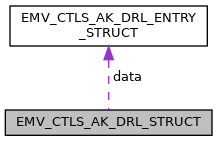

\[<a href="graph_legend.md">legend</a>\]

| Data Fields |  |  |
|----|----|----|
| unsigned short | cnt | number of DRL entries |
| [EMV_CTLS_AK_DRL_ENTRY_TYPE](#ga07747220e48474bef1eabef79b7feb77) \* | data | data |

## EMV_CTLS_APPLIDATA_AK_STRUCT 

struct EMV_CTLS_APPLIDATA_AK_STRUCT

Structure for configuration of one single application, AK specific part. See see Book C-4, Kernel 4 Specification at <a href="http://www.emvco.com/">[EMVCo Homepage]</a>. See <a href="group___f_u_n_c___c_o_n_f.md#gadc7f2eba5fd3e941d0ddb65a936a0776">EMV_CTLS_SetAppliDataSchemeSpecific()</a>

Collaboration diagram for EMV_CTLS_APPLIDATA_AK_STRUCT:

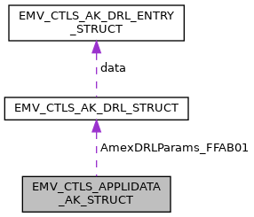

\[<a href="graph_legend.md">legend</a>\]

| Data Fields |  |  |
|----|----|----|
| unsigned char | AcquirerIdentifier_9F01\[6\] | TempUpdate allowed: NO Description: Uniquely identifies the acquirer within each payment system. Availability bit: <a href="group___d_e_f___i_n_p_u_t___a_p_p_l_i___a_k.md#ga7edde805fd2d68ebf58a2c0518991e4c">INPUT_CTLS_APL_AK_9F01_1</a> TLV tag: <a href="group___e_m_v_c_o___t_a_g_s.md#gaab4cf8e32535962270e6219bcbc08194">TAG_9F01_ACQ_ID</a> XML Tag: <a href="group___a_d_k___x_m_l___t_a_g_s.md#ga676f0b802fff9dc749b44bbbef18123c">XML_TAG_AD_AK_9F01_ACQUIRER_ID</a>. |
| unsigned char | AdditionalTerminalCapabilities_9F40\[5\] | TempUpdate allowed: YES Description: \"Additional Terminal Capabilities\" for this application, only 1st byte is effective Availability bit: <a href="group___d_e_f___i_n_p_u_t___a_p_p_l_i___a_k.md#ga21119a0e18ecf06164208c26b43b6331">INPUT_CTLS_APL_AK_9F40_0</a> TLV tag: <a href="group___e_m_v_c_o___t_a_g_s.md#ga5670c7d223a0af749d5b8b251e32f870">TAG_9F40_ADD_TRM_CAP</a>, XML Tag: <a href="group___a_d_k___x_m_l___t_a_g_s.md#gae0b8027d5d821889d8b7e796992ac147">XML_TAG_AD_AK_9F40_ADD_TERM_CAPS</a>. |
| unsigned char | AmexContactlessReaderCapabilities_9F6D | TempUpdate allowed: YES Description: Special terminal capabilities of Expresspay, Amex tag 9F6D, indicating the version of Amex spec used for CTLS Availability bit: <a href="group___d_e_f___i_n_p_u_t___a_p_p_l_i___a_k.md#gac284efde12e6e05b39cee2d7b844899b">INPUT_CTLS_APL_AK_9F6D_0</a> TLV tag: <a href="group___e_x_p_r_e_s_s_p_a_y___t_a_g_s.md#ga33be7c69a6e1ffd03b22640e08745fff">TAG_9F6D_AMEX_CAPABILITIES</a>, XML Tag: <a href="group___a_d_k___x_m_l___t_a_g_s.md#gae21e0f8806a8eecb7432962b8d6038c6">XML_TAG_AD_AK_9F6D_AMEX_CTLS_READER_CAPS</a>. |
| [EMV_CTLS_AK_DRL_TYPE](#ga00a9baaf196682a20e77ba83ccadc5d5) | AmexDRLParams_FFAB01 | TempUpdate allowed: NO Description: Dynamic Reader Limits table Availability bit: <a href="group___d_e_f___i_n_p_u_t___a_p_p_l_i___a_k.md#ga0895f16241c1ebe69fa99e01a92cd13c">INPUT_CTLS_APL_AK_FFAB01_2</a> TLV tag: <a href="group___t_a_g_s___n_e_w___c_f_g___i_n_t_f___c_o_n_s_t_r.md#ga6da72379bdf0faa5dfcec68ec4dd4510">TAG_FFAB01_DRL_PARAMETER</a>, XML Tag: <a href="group___a_d_k___x_m_l___t_a_g_s.md#ga7f84720f74906bb526e44d600a26b264">XML_TAG_AD_AK_FFAB01_AMEX_DRL_PARAMS</a>. |
| unsigned char | AmexTerminalTransactionCapabilities_9F6E\[4\] | TempUpdate allowed: YES Description: Special enhanced reader capabilities of Expresspay, Amex tag 9F6E. CV is performed both above and below the floor limit but there are different procedures for the kernel to follow in each case. The kernel no longer uses byte 2 of tag 9F33 to determine supported CV methods because byte 2 of tag 9F6E is now used instead. However only 1 value is required for tag 9F6E because the kernel itself modifies this bitmap depending if the CV limit is exceeded or not. Only 1 value for tag 9F33 is required because the kernel still uses byte 3 of this tag to determine supported DA methods Availability bit: <a href="group___d_e_f___i_n_p_u_t___a_p_p_l_i___a_k.md#gad0fa600a676065867b31190d856d8c42">INPUT_CTLS_APL_AK_9F6E_0</a> TLV tag: <a href="group___e_x_p_r_e_s_s_p_a_y___t_a_g_s.md#ga4ef2ef0cae4f0f667bd0eeccdf18faaf">TAG_9F6E_AMEX_ENHANCED_CAPABILITIES</a>, XML Tag: <a href="group___a_d_k___x_m_l___t_a_g_s.md#gae84a2ad6bbc9dec4ed44bf1a54705f42">XML_TAG_AD_AK_9F6E_AMEX_TERM_TRX_CAPS</a>. |
| unsigned char | AppFlowCap_DFAB31\[5\] | TempUpdate allowed: YES Description: Configure special application characteristics, see <a href="group___d_e_f___f_l_o_w___a_k.md">Application flow capabilities for ExpressPay (Amex)</a> Availability bit: <a href="group___d_e_f___i_n_p_u_t___a_p_p_l_i___a_k.md#ga69b279e5183b0b06cbeebfd2f01ea60a">INPUT_CTLS_APL_AK_DFAB31_1</a> TLV tag: <a href="group___t_a_g_s___n_e_w___c_f_g___i_n_t_f___p_r_i_m.md#gaf35f7d22b485b509c980566dba2eea1a">TAG_DFAB31_APP_FLOW_CAP</a>, XML Tag: <a href="group___a_d_k___x_m_l___t_a_g_s.md#ga32a88b3afac8f2b2fc71cb34649c33f5">XML_TAG_AD_AK_DFAB31_APP_FLOW_CAP</a>. |
| unsigned char | ContactlessCVMRequiredLimit_DFAB42\[6\] | TempUpdate allowed: NO Description: Reader Contactless CVM Required Limit (n12) Use \'999999999999\' to disable. Availability bit: <a href="group___d_e_f___i_n_p_u_t___a_p_p_l_i___a_k.md#ga37e62c56fadb05b7b001505aa19d1906">INPUT_CTLS_APL_AK_DFAB42_2</a> TLV tag: <a href="group___t_a_g_s___n_e_w___c_f_g___i_n_t_f___p_r_i_m.md#gaf8082e86422522353c6f242f63f71b46">TAG_DFAB42_CTLS_CVM_REQ_LIMIT</a>, XML Tag: <a href="group___a_d_k___x_m_l___t_a_g_s.md#ga518e8182099c530f9d3db19cf7f81a44">XML_TAG_AD_AK_DFAB42_CTLS_CVM_REQ_LIMIT</a>. |
| unsigned char | ContactlessFloorLimit_DFAB40\[6\] | TempUpdate allowed: NO Description: Reader Contactless Floor Limit (n12) Use \'999999999999\' to disable. Availability bit: <a href="group___d_e_f___i_n_p_u_t___a_p_p_l_i___a_k.md#ga83789f51c7bff697fa14ddab2bb9de31">INPUT_CTLS_APL_AK_DFAB40_1</a> TLV tag: <a href="group___t_a_g_s___n_e_w___c_f_g___i_n_t_f___p_r_i_m.md#ga4fbadad5ae4dad262274c4c74dc6deb2">TAG_DFAB40_CTLS_FLOOR_LIMIT</a>, XML Tag: <a href="group___a_d_k___x_m_l___t_a_g_s.md#gac138bb1c91f02a072e00c491032047f0">XML_TAG_AD_AK_DFAB40_CTLS_FLOOR_LIMIT</a>. |
| unsigned char | ContactlessTransactionLimit_DFAB41\[6\] | TempUpdate allowed: NO Description: Reader Contactless Transaction Limit (n12) Use \'999999999999\' to disable. Availability bit: <a href="group___d_e_f___i_n_p_u_t___a_p_p_l_i___a_k.md#ga99da0874470c5c4dae0b63bd319fa04b">INPUT_CTLS_APL_AK_DFAB41_1</a> TLV tag: <a href="group___t_a_g_s___n_e_w___c_f_g___i_n_t_f___p_r_i_m.md#gac0ad8ae2d5bd130f089f010278a99b4e">TAG_DFAB41_CTLS_TRX_LIMIT</a>, XML Tag: <a href="group___a_d_k___x_m_l___t_a_g_s.md#ga7a08e6b354dd3d1385721d27b1633c24">XML_TAG_AD_AK_DFAB41_CTLS_TRX_LIMIT</a>. |
| unsigned char | IncludedData\[8\] | Availability bits, see <a href="group___d_e_f___i_n_p_u_t___a_p_p_l_i___a_k.md">Appli data scheme specific - Amex - Availability bits</a>. |
| unsigned char | MerchantCategoryCode_9F15\[2\] | TempUpdate allowed: NO Description: Merchant category code mandatory for <a href="group___f_u_n_c___c_o_n_f.md#gadc7f2eba5fd3e941d0ddb65a936a0776">EMV_CTLS_SetAppliDataSchemeSpecific</a> Availability bit: <a href="group___d_e_f___i_n_p_u_t___a_p_p_l_i___a_k.md#ga1246319aa40bed473bb593ebb8aa9e95">INPUT_CTLS_APL_AK_9F15_1</a> TLV tag: <a href="group___e_m_v_c_o___t_a_g_s.md#ga41481cf04242a0ba441c87f6a1569639">TAG_9F15_MERCH_CATEG_CODE</a>, XML Tag: <a href="group___a_d_k___x_m_l___t_a_g_s.md#gafa38c391e12dea85b0d25e46c4f4b0d0">XML_TAG_AD_AK_9F15_MERCHANT_CATEGORY_CODE</a>. |
| char | MerchantIdentifier_9F16\[15+1\] | TempUpdate allowed: NO Description: Merchant Identifier mandatory for <a href="group___f_u_n_c___c_o_n_f.md#gadc7f2eba5fd3e941d0ddb65a936a0776">EMV_CTLS_SetAppliDataSchemeSpecific</a> Availability bit: <a href="group___d_e_f___i_n_p_u_t___a_p_p_l_i___a_k.md#ga578b0d73411749c3b765ffdef4c5ccb9">INPUT_CTLS_APL_AK_9F16_1</a> TLV tag: <a href="group___e_m_v_c_o___t_a_g_s.md#ga184ccaaef50ada9988bfd4af37b8c9fb">TAG_9F16_MERCHANT_ID</a>, XML Tag: <a href="group___a_d_k___x_m_l___t_a_g_s.md#gab75b5e728d31dec055075010ab6e3af7">XML_TAG_AD_AK_9F16_MERCHANT_ID</a>. |
| char | MerchantNameAndLocation_9F4E\[40+1\] | TempUpdate allowed: NO Description: Indicates the name and location of the merchant. Availability bit: <a href="group___d_e_f___i_n_p_u_t___a_p_p_l_i___a_k.md#gae61661774e9dda91bb3833bea407b529">INPUT_CTLS_APL_AK_9F4E_1</a> TLV tag: <a href="group___e_m_v_c_o___t_a_g_s.md#gac3a7de1661225ab41a4529b68d1fda71">TAG_9F4E_TAC_MERCHANTLOC</a>, XML Tag: <a href="group___a_d_k___x_m_l___t_a_g_s.md#ga3a2bbeff0fa2bcff8de27960707998e6">XML_TAG_AD_AK_9F4E_MERCHANT_NAME_LOCATION</a>. |
| unsigned char | TACDefault_DFAB43\[5\] | TempUpdate allowed: YES Description: Terminal Action Code - Default mandatory for <a href="group___f_u_n_c___c_o_n_f.md#gadc7f2eba5fd3e941d0ddb65a936a0776">EMV_CTLS_SetAppliDataSchemeSpecific</a> Availability bit: <a href="group___d_e_f___i_n_p_u_t___a_p_p_l_i___a_k.md#ga803617e356778306ab9f3aef1a06a89b">INPUT_CTLS_APL_AK_DFAB43_2</a> TLV tag: <a href="group___t_a_g_s___n_e_w___c_f_g___i_n_t_f___p_r_i_m.md#ga885632db95d4e5e768eb59582123ab4c">TAG_DFAB43_TAC_DEFAULT</a>, XML Tag: <a href="group___a_d_k___x_m_l___t_a_g_s.md#ga783b8ad05b92f4b240b35a48bd0b688a">XML_TAG_AD_AK_DFAB43_TAC_DEFAULT</a>. |
| unsigned char | TACDenial_DFAB44\[5\] | TempUpdate allowed: YES Description: Terminal Action Code - Denial mandatory for <a href="group___f_u_n_c___c_o_n_f.md#gadc7f2eba5fd3e941d0ddb65a936a0776">EMV_CTLS_SetAppliDataSchemeSpecific</a> Availability bit: <a href="group___d_e_f___i_n_p_u_t___a_p_p_l_i___a_k.md#gabcfeb5f0538597cd03b064db58dd8ac8">INPUT_CTLS_APL_AK_DFAB44_2</a> TLV tag: <a href="group___t_a_g_s___n_e_w___c_f_g___i_n_t_f___p_r_i_m.md#ga6c4ffbdb026c264681d2c8da01607e9f">TAG_DFAB44_TAC_DENIAL</a>, XML Tag: <a href="group___a_d_k___x_m_l___t_a_g_s.md#ga5e5f4e29c2d3c20f82fee3c7e39606b7">XML_TAG_AD_AK_DFAB44_TAC_DENIAL</a>. |
| unsigned char | TACOnline_DFAB45\[5\] | TempUpdate allowed: YES Description: Terminal Action Code - Online mandatory for <a href="group___f_u_n_c___c_o_n_f.md#gadc7f2eba5fd3e941d0ddb65a936a0776">EMV_CTLS_SetAppliDataSchemeSpecific</a> Availability bit: <a href="group___d_e_f___i_n_p_u_t___a_p_p_l_i___a_k.md#ga29f406dccca46cfe8f7561d5d821851c">INPUT_CTLS_APL_AK_DFAB45_2</a> TLV tag: <a href="group___t_a_g_s___n_e_w___c_f_g___i_n_t_f___p_r_i_m.md#ga53c8a7f59827691e78e3a9d452da187a">TAG_DFAB45_TAC_ONLINE</a>, XML Tag: <a href="group___a_d_k___x_m_l___t_a_g_s.md#ga1c3c97b73fa777a9613b2202084bf0bd">XML_TAG_AD_AK_DFAB45_TAC_ONLINE</a>. |
| unsigned char | TecSupport_DFAB30 | TempUpdate allowed: NO Description: Specifies supported technologies. See <a href="group___d_e_f___t_e_c.md">technologies used in TecSupport_DFAB30</a> Availability bit: <a href="group___d_e_f___i_n_p_u_t___a_p_p_l_i___a_k.md#ga634ab01e3f92d366cc95a6768e33c71b">INPUT_CTLS_APL_AK_DFAB30_1</a> TLV tag: <a href="group___t_a_g_s___n_e_w___c_f_g___i_n_t_f___p_r_i_m.md#gab9f0400d266ebde31ce4c0b6c2290a67">TAG_DFAB30_TEC_SUPPORT</a> XML Tag: <a href="group___a_d_k___x_m_l___t_a_g_s.md#ga0ade647bbd8447cbe4c0f219b02b487a">XML_TAG_AD_AK_DFAB30_TEC_SUPPORT</a>. |
| unsigned char | TermIdent_9F1C\[8\] | TempUpdate allowed: YES Description: Terminal Identification mandatory for <a href="group___f_u_n_c___c_o_n_f.md#gadc7f2eba5fd3e941d0ddb65a936a0776">EMV_CTLS_SetAppliDataSchemeSpecific</a> Availability bit: <a href="group___d_e_f___i_n_p_u_t___a_p_p_l_i___a_k.md#ga570e80d0e6347753ba11f2ee3769ff2e">INPUT_CTLS_APL_AK_9F1C_0</a> TLV tag: <a href="group___e_m_v_c_o___t_a_g_s.md#ga64f401e453e74b4ff1f727aa7cc449ac">TAG_9F1C_TRM_ID</a>, XML Tag: <a href="group___a_d_k___x_m_l___t_a_g_s.md#ga9c80a071ddf56b8c4dd869dd94d5b30c">XML_TAG_AD_AK_9F1C_TERM_IDENT</a>. |
| unsigned char | TerminalCapabilities_9F33\[3\] | TempUpdate allowed: YES Description: \"Terminal Capabilities\" for this application, for PayPass 3 the tags DF81xx, DF81yy, DF81zz are filled with these 3 byte, for VISA this is used for host compliancy only, for Amex in accordance with tag 9F6E, Availability bit: <a href="group___d_e_f___i_n_p_u_t___a_p_p_l_i___a_k.md#ga50cd9f89ab553e15ded7e2570a5ab43b">INPUT_CTLS_APL_AK_9F33_0</a> TLV tag: <a href="group___e_m_v_c_o___t_a_g_s.md#gad3ec876483505eb23aad4e1b210653f5">TAG_9F33_TRM_CAPABILITIES</a>, XML Tag: <a href="group___a_d_k___x_m_l___t_a_g_s.md#ga924ae20c6fa78f27f8ed8c0b3428aef4">XML_TAG_AD_AK_9F33_TERM_CAPS</a>. |
| unsigned char | TerminalCountryCode_9F1A\[2\] | TempUpdate allowed: YES Description: \"Terminal country code\" (e.g. VISA Germany 0276) Availability bit: <a href="group___d_e_f___i_n_p_u_t___a_p_p_l_i___a_k.md#ga9dd1b674fb11e8f29158bf5cb2ea6362">INPUT_CTLS_APL_AK_9F1A_0</a> TLV tag: <a href="group___e_m_v_c_o___t_a_g_s.md#ga5bc987c3686fd5821f20d21015354787">TAG_9F1A_TRM_COUNTRY_CODE</a>, XML Tag: <a href="group___a_d_k___x_m_l___t_a_g_s.md#ga6fe642d9d709df7b57376de7199487fa">XML_TAG_AD_AK_9F1A_TERM_COUNTRY_CODE</a>. |
| unsigned char | TerminalType_9F35 | TempUpdate allowed: YES Description: Terminal type, possible values see <a href="group___t_e_r_m___t_y_p_e_s.md">Terminaltypes (Tag 9F35)</a>) mandatory for first call of <a href="group___f_u_n_c___c_o_n_f.md#gac5ce9781bba083028538f9e77c2d58f3">EMV_CTLS_SetTermData()</a> Availability bit: <a href="group___d_e_f___i_n_p_u_t___a_p_p_l_i___a_k.md#gaf57fd348fd73d48534d3dd110554045a">INPUT_CTLS_APL_AK_9F35_0</a> TLV tag: <a href="group___e_m_v_c_o___t_a_g_s.md#gace5b4ef50a58d29b2f5296c2c17273c9">TAG_9F35_TRM_TYPE</a>, XML Tag: <a href="group___a_d_k___x_m_l___t_a_g_s.md#ga51c286a0b3c558292d65d6d939cff9ce">XML_TAG_AD_AK_9F35_TERM_TYPE</a>. |
| unsigned char | UnpredictableNumberRange_DFAB52 | TempUpdate allowed: YES Description: Limit for MSR unpredictable nummer, 60 .. 255, default value 60. Availability bit: <a href="group___d_e_f___i_n_p_u_t___a_p_p_l_i___a_k.md#gae9b0520c021deefe465faedae98fac84">INPUT_CTLS_APL_AK_DFAB52_2</a> TLV tag: <a href="group___t_a_g_s___n_e_w___c_f_g___i_n_t_f___p_r_i_m.md#ga7e1311335c8c779b33eac469bd872cf8">TAG_DFAB52_AMEX_UN_RANGE</a>, XML Tag: <a href="group___a_d_k___x_m_l___t_a_g_s.md#gadba0b407dde44ad12c5ee5e595dc9426">XML_TAG_AD_AK_DFAB52_UN_RANGE</a>. |
| unsigned char | VersionNumber_9F09\[2 \*<a href="_e_m_v___c_t_l_s___interface_8h.md#a01aefcde9b880f166817e82c8f2eac99">EMV_CTLS_MAX_APP_VERS</a>\] | TempUpdate allowed: NO Description: Application chip version number mandatory for <a href="group___f_u_n_c___c_o_n_f.md#gadc7f2eba5fd3e941d0ddb65a936a0776">EMV_CTLS_SetAppliDataSchemeSpecific</a> Availability bit: <a href="group___d_e_f___i_n_p_u_t___a_p_p_l_i___a_k.md#ga886537849c562d8891af2287768cb17c">INPUT_CTLS_APL_AK_9F09_0</a> TLV tag: <a href="group___e_m_v_c_o___t_a_g_s.md#gac0fb6f2c9da5e835754d94e7edf4f7c2">TAG_9F09_TRM_APP_VERSION_NB</a>, XML Tag: <a href="group___a_d_k___x_m_l___t_a_g_s.md#gafac66550a33653a9120377200af2235a">XML_TAG_AD_AK_9F09_VERSION_NUMBER</a>. |

## EMV_CTLS_APPLIDATA_JK_STRUCT 

struct EMV_CTLS_APPLIDATA_JK_STRUCT

Structure for configuration of one single application, JK specific part. See see Book C-5, Kernel 5 Specification at <a href="http://www.emvco.com/">[EMVCo Homepage]</a>. See <a href="group___f_u_n_c___c_o_n_f.md#gadc7f2eba5fd3e941d0ddb65a936a0776">EMV_CTLS_SetAppliDataSchemeSpecific()</a>

| Data Fields |  |  |
|----|----|----|
| unsigned char | AcquirerIdentifier_9F01\[6\] | TempUpdate allowed: NO Description: Uniquely identifies the acquirer within each payment system. Availability bit: <a href="group___d_e_f___i_n_p_u_t___a_p_p_l_i___j_k.md#ga7b0808805900a55ef3881723b33f1366">INPUT_CTLS_APL_JK_9F01_0</a> TLV tag: <a href="group___e_m_v_c_o___t_a_g_s.md#gaab4cf8e32535962270e6219bcbc08194">TAG_9F01_ACQ_ID</a> XML Tag: <a href="group___a_d_k___x_m_l___t_a_g_s.md#gabe1cae8ec11ae1c91b63cdbc481e26fe">XML_TAG_AD_JK_9F01_ACQUIRER_ID</a>. |
| unsigned char | AppFlowCap_DFAB31\[5\] | TempUpdate allowed: YES Description: Configure special application characteristics, see <a href="group___d_e_f___f_l_o_w___j_k.md">Application flow capabilities for JCB</a> Availability bit: <a href="group___d_e_f___i_n_p_u_t___a_p_p_l_i___j_k.md#ga93c266365958b2eddd88074be0d72f29">INPUT_CTLS_APL_JK_DFAB31_0</a> TLV tag: <a href="group___t_a_g_s___n_e_w___c_f_g___i_n_t_f___p_r_i_m.md#gaf35f7d22b485b509c980566dba2eea1a">TAG_DFAB31_APP_FLOW_CAP</a>, XML Tag: <a href="group___a_d_k___x_m_l___t_a_g_s.md#ga1caa97b3cfa7a7be882358865d865b4a">XML_TAG_AD_JK_DFAB31_APP_FLOW_CAP</a>. |
| unsigned char | CombinationOptions_DFAB4B\[2\] | TempUpdate allowed: YES Description: Flags for terminal capabilities (only first byte used): `0x01` = Legacy mode supported `0x02` = EMV mode supported `0x04` = Magstripe mode supported (since JCB 1.4) `0x08` = Random transaction selection `0x10` = Exception file check `0x20` = Offline data authentication supported `0x40` = Status check supported Kernel uses b1+b2 to determine 9F52 \"Terminal Compatibility Indicator\" Availability bit: <a href="group___d_e_f___i_n_p_u_t___a_p_p_l_i___j_k.md#gaa359357f5d4656b6f6228799379da185">INPUT_CTLS_APL_JK_DFAB4B_2</a> TLV tag: <a href="group___t_a_g_s___n_e_w___c_f_g___i_n_t_f___p_r_i_m.md#ga9b6162a27a6c326c49610edda2e763c4">TAG_DFAB4B_COMBINATION_OPTIONS</a> XML Tag: <a href="group___a_d_k___x_m_l___t_a_g_s.md#gaef9991ee1eaa59f76b4f60a09277efed">XML_TAG_AD_JK_DFAB4B_COMBINATION_OPTIONS</a>. |
| unsigned char | ContactlessCVMRequiredLimit_DFAB42\[6\] | TempUpdate allowed: NO Description: Reader Contactless CVM Required Limit (n12) Use \'99999999999\' to disable. Availability bit: <a href="group___d_e_f___i_n_p_u_t___a_p_p_l_i___j_k.md#ga6039c549117f9f5c80080501285f77ec">INPUT_CTLS_APL_JK_DFAB42_1</a> TLV tag: <a href="group___t_a_g_s___n_e_w___c_f_g___i_n_t_f___p_r_i_m.md#gaf8082e86422522353c6f242f63f71b46">TAG_DFAB42_CTLS_CVM_REQ_LIMIT</a>, XML Tag: <a href="group___a_d_k___x_m_l___t_a_g_s.md#ga0ca3a7cd27527dfd384e4ca9f39563a4">XML_TAG_AD_JK_DFAB42_CTLS_CVM_REQ_LIMIT</a>. |
| unsigned char | ContactlessFloorLimit_DFAB40\[6\] | TempUpdate allowed: NO Description: Reader Contactless Floor Limit (n12) Use \'99999999999\' to disable. Availability bit: <a href="group___d_e_f___i_n_p_u_t___a_p_p_l_i___j_k.md#ga99e6a2ea34df8aba960b5dfc887ebffa">INPUT_CTLS_APL_JK_DFAB40_1</a> TLV tag: <a href="group___t_a_g_s___n_e_w___c_f_g___i_n_t_f___p_r_i_m.md#ga4fbadad5ae4dad262274c4c74dc6deb2">TAG_DFAB40_CTLS_FLOOR_LIMIT</a>, XML Tag: <a href="group___a_d_k___x_m_l___t_a_g_s.md#gaba1256f652e84a529c26558bca5cb62e">XML_TAG_AD_JK_DFAB40_CTLS_FLOOR_LIMIT</a>. |
| unsigned char | ContactlessTransactionLimit_DFAB41\[6\] | TempUpdate allowed: NO Description: Reader Contactless Transaction Limit (n12) in case of no On-Device Card Holder Verification Use \'99999999999\' to disable. Availability bit: <a href="group___d_e_f___i_n_p_u_t___a_p_p_l_i___j_k.md#gae6dd8e737f809cd3d6ea39a44ab35cba">INPUT_CTLS_APL_JK_DFAB41_1</a> TLV tag: <a href="group___t_a_g_s___n_e_w___c_f_g___i_n_t_f___p_r_i_m.md#gac0ad8ae2d5bd130f089f010278a99b4e">TAG_DFAB41_CTLS_TRX_LIMIT</a>, XML Tag: <a href="group___a_d_k___x_m_l___t_a_g_s.md#ga0f6407252a7279735665028a81602532">XML_TAG_AD_JK_DFAB41_CTLS_TRX_LIMIT</a>.      For Entry Point configuration and for kernel versions \< JK1.2.0 the transactions limits DFAB41/DFAB5B have to be combined. Algorithm is to use the highest limit.    |
| unsigned char | ContactlessTransactionLimit_ODCVM_DFAB5B\[6\] | TempUpdate allowed: NO Description: Reader Contactless Transaction Limit (n12) in case of On-Device Card Holder Verification Use \'99999999999\' to disable. Availability bit: <a href="group___d_e_f___i_n_p_u_t___a_p_p_l_i___j_k.md#gae8fdb70ebf5caf5a0faa75dfb20e376a">INPUT_CTLS_APL_JK_DFAB5B_2</a> TLV tag: <a href="group___t_a_g_s___n_e_w___c_f_g___i_n_t_f___p_r_i_m.md#ga7eb63c89a56b7f491d9f29abe6604b61">TAG_DFAB5B_CTLS_TRX_LIMIT_ODCVM</a>, XML Tag: <a href="group___a_d_k___x_m_l___t_a_g_s.md#gaee433f2a21425de76cb0e6526f1528e4">XML_TAG_AD_DFAB5B_CTLS_TRX_LIMIT_ODCVM</a>.      For Entry Point configuration and for kernel versions \< JK1.2.0 the transactions limits DFAB41/DFAB5B have to be combined. Algorithm is to use the highest limit.    |
| unsigned char | IncludedData\[8\] | Availability bits, see <a href="group___d_e_f___i_n_p_u_t___a_p_p_l_i___j_k.md">Appli data scheme specific - JCB - Avaiability bits</a>. |
| unsigned char | MerchantCategoryCode_9F15\[2\] | TempUpdate allowed: NO Description: Merchant category code mandatory for <a href="group___f_u_n_c___c_o_n_f.md#gadc7f2eba5fd3e941d0ddb65a936a0776">EMV_CTLS_SetAppliDataSchemeSpecific</a> Availability bit: <a href="group___d_e_f___i_n_p_u_t___a_p_p_l_i___j_k.md#gaf57cdefff0dea30496d847f6512ecf55">INPUT_CTLS_APL_JK_9F15_0</a> TLV tag: <a href="group___e_m_v_c_o___t_a_g_s.md#ga41481cf04242a0ba441c87f6a1569639">TAG_9F15_MERCH_CATEG_CODE</a>, XML Tag: <a href="group___a_d_k___x_m_l___t_a_g_s.md#ga41b8b70578ff86c428eedf78b07714a5">XML_TAG_AD_JK_9F15_MERCHANT_CATEGORY_CODE</a>. |
| char | MerchantNameAndLocation_9F4E\[40+1\] | TempUpdate allowed: NO Description: Indicates the name and location of the merchant. Availability bit: <a href="group___d_e_f___i_n_p_u_t___a_p_p_l_i___j_k.md#gaf46e373f546c9b21b29120d86a15edc9">INPUT_CTLS_APL_JK_9F4E_0</a> TLV tag: <a href="group___e_m_v_c_o___t_a_g_s.md#gac3a7de1661225ab41a4529b68d1fda71">TAG_9F4E_TAC_MERCHANTLOC</a>, XML Tag: <a href="group___a_d_k___x_m_l___t_a_g_s.md#ga49e28d220767f0a20f63b019fbce8fa1">XML_TAG_AD_JK_9F4E_MERCHANT_NAME_LOCATION</a>. |
| unsigned char | RemovalTimeout_DFAB4C\[2\] | TempUpdate allowed: YES Description: In case of Online Request with \"Present and Hold\" outcome, this parameter corresponds to the time after which cardholder is asked to remove the card. Value is given in units of 100ms. Availability bit: <a href="group___d_e_f___i_n_p_u_t___a_p_p_l_i___j_k.md#ga57c5239c424a585d7fb9f77e3a0a747c">INPUT_CTLS_APL_JK_DFAB4C_2</a> TLV tag: <a href="group___t_a_g_s___n_e_w___c_f_g___i_n_t_f___p_r_i_m.md#ga1b5114f265187889b782c5a8a86fb42b">TAG_DFAB4C_REMOVAL_TIMEOUT</a> XML Tag: <a href="group___a_d_k___x_m_l___t_a_g_s.md#ga6394544b1d23499095830af6cab5c6a9">XML_TAG_AD_JK_DFAB4C_REMOVAL_TIMEOUT</a>. |
| unsigned char | RiskManagementMaximumTargetPercentage_DFAB48 | TempUpdate allowed: YES Description: Maximum target percentage for random online selection during risk management (n2) Availability bit: <a href="group___d_e_f___i_n_p_u_t___a_p_p_l_i___j_k.md#ga9a500aa6fa0e98039de8983dc5072e96">INPUT_CTLS_APL_JK_DFAB48_2</a> TLV tag: <a href="group___t_a_g_s___n_e_w___c_f_g___i_n_t_f___p_r_i_m.md#gad755eca2cea7087042166526654c7291">TAG_DFAB48_RISK_MGMT_MAX_TRGT_PRCT</a> XML Tag: <a href="group___a_d_k___x_m_l___t_a_g_s.md#ga2acabba5ab730a21bce6342fd30554f0">XML_TAG_AD_JK_DFAB48_RISK_MGMT_MAX_TRGT_PERC</a>. |
| unsigned char | RiskManagementTargetPercentage_DFAB47 | TempUpdate allowed: YES Description: Target percentage for random online selection during risk management (n2) Availability bit: <a href="group___d_e_f___i_n_p_u_t___a_p_p_l_i___j_k.md#ga85178e2e0fa7dc6ca9c239f88a7a1abe">INPUT_CTLS_APL_JK_DFAB47_1</a> TLV tag: <a href="group___t_a_g_s___n_e_w___c_f_g___i_n_t_f___p_r_i_m.md#ga4795ddca7a863da46b56a3a34d3b9c39">TAG_DFAB47_RISK_MGMT_TRGT_PRCT</a> XML Tag: <a href="group___a_d_k___x_m_l___t_a_g_s.md#ga4715e024fc44e2132cd82847c24fff78">XML_TAG_AD_JK_DFAB47_RISK_MGMT_TRGT_PERC</a>. |
| unsigned char | RiskManagementThreshold_DFAB46\[6\] | TempUpdate allowed: YES Description: Threshold Value for Biased Random Online Selection during risk management (n12) Availability bit: <a href="group___d_e_f___i_n_p_u_t___a_p_p_l_i___j_k.md#ga48f76492ccf1cbbe4b6d6eba878ddf53">INPUT_CTLS_APL_JK_DFAB46_1</a> TLV tag: <a href="group___t_a_g_s___n_e_w___c_f_g___i_n_t_f___p_r_i_m.md#ga03c938e159dbea0a48e833d5205f2529">TAG_DFAB46_RISK_MGMT_THRESHOLD</a> XML Tag: <a href="group___a_d_k___x_m_l___t_a_g_s.md#ga53903aac8680f51b9c7d5181fe294dc4">XML_TAG_AD_JK_DFAB46_RISK_MGMT_THRESHOLD</a>. |
| unsigned char | TACDefault_DFAB43\[5\] | TempUpdate allowed: YES Description: Terminal Action Code - Default mandatory for <a href="group___f_u_n_c___c_o_n_f.md#gadc7f2eba5fd3e941d0ddb65a936a0776">EMV_CTLS_SetAppliDataSchemeSpecific</a> Availability bit: <a href="group___d_e_f___i_n_p_u_t___a_p_p_l_i___j_k.md#gad8e8c13dc45c5f68002b00b905830336">INPUT_CTLS_APL_JK_DFAB43_1</a> TLV tag: <a href="group___t_a_g_s___n_e_w___c_f_g___i_n_t_f___p_r_i_m.md#ga885632db95d4e5e768eb59582123ab4c">TAG_DFAB43_TAC_DEFAULT</a>, XML Tag: <a href="group___a_d_k___x_m_l___t_a_g_s.md#gac7e6cbc6b7d6d56eb68a335a67c34690">XML_TAG_AD_JK_DFAB43_TAC_DEFAULT</a>. |
| unsigned char | TACDenial_DFAB44\[5\] | TempUpdate allowed: YES Description: Terminal Action Code - Denial mandatory for <a href="group___f_u_n_c___c_o_n_f.md#gadc7f2eba5fd3e941d0ddb65a936a0776">EMV_CTLS_SetAppliDataSchemeSpecific</a> Availability bit: <a href="group___d_e_f___i_n_p_u_t___a_p_p_l_i___j_k.md#gaf4b5d0dafcc9a517952c1d8a695604d5">INPUT_CTLS_APL_JK_DFAB44_1</a> TLV tag: <a href="group___t_a_g_s___n_e_w___c_f_g___i_n_t_f___p_r_i_m.md#ga6c4ffbdb026c264681d2c8da01607e9f">TAG_DFAB44_TAC_DENIAL</a>, XML Tag: <a href="group___a_d_k___x_m_l___t_a_g_s.md#ga22fa06febc99f576174a834f60301956">XML_TAG_AD_JK_DFAB44_TAC_DENIAL</a>. |
| unsigned char | TACOnline_DFAB45\[5\] | TempUpdate allowed: YES Description: Terminal Action Code - Online mandatory for <a href="group___f_u_n_c___c_o_n_f.md#gadc7f2eba5fd3e941d0ddb65a936a0776">EMV_CTLS_SetAppliDataSchemeSpecific</a> Availability bit: <a href="group___d_e_f___i_n_p_u_t___a_p_p_l_i___j_k.md#ga9ffc69d88664555e786d4c7e2771c29f">INPUT_CTLS_APL_JK_DFAB45_1</a> TLV tag: <a href="group___t_a_g_s___n_e_w___c_f_g___i_n_t_f___p_r_i_m.md#ga53c8a7f59827691e78e3a9d452da187a">TAG_DFAB45_TAC_ONLINE</a>, XML Tag: <a href="group___a_d_k___x_m_l___t_a_g_s.md#ga0597d8e0ff8e76e41b8497f1f2966ce5">XML_TAG_AD_JK_DFAB45_TAC_ONLINE</a>. |
| unsigned char | TermIdent_9F1C\[8\] | TempUpdate allowed: YES Description: Terminal Identification mandatory for <a href="group___f_u_n_c___c_o_n_f.md#gadc7f2eba5fd3e941d0ddb65a936a0776">EMV_CTLS_SetAppliDataSchemeSpecific</a> Availability bit: <a href="group___d_e_f___i_n_p_u_t___a_p_p_l_i___j_k.md#gafa8facc979ab449be5dfe7f6d38080c7">INPUT_CTLS_APL_JK_9F1C_0</a> TLV tag: <a href="group___e_m_v_c_o___t_a_g_s.md#ga64f401e453e74b4ff1f727aa7cc449ac">TAG_9F1C_TRM_ID</a>, XML Tag: <a href="group___a_d_k___x_m_l___t_a_g_s.md#ga811c3fd7b7fd8139aec6d2e7583e009d">XML_TAG_AD_JK_9F1C_TERM_IDENT</a>. |
| unsigned char | TerminalCountryCode_9F1A\[2\] | TempUpdate allowed: YES Description: \"Terminal country code\" (e.g. VISA Germany 0276) Availability bit: <a href="group___d_e_f___i_n_p_u_t___a_p_p_l_i___j_k.md#ga5686af02f3211b8fce95adc712cca6b9">INPUT_CTLS_APL_JK_9F1A_0</a> TLV tag: <a href="group___e_m_v_c_o___t_a_g_s.md#ga5bc987c3686fd5821f20d21015354787">TAG_9F1A_TRM_COUNTRY_CODE</a>, XML Tag: <a href="group___a_d_k___x_m_l___t_a_g_s.md#gaa29eb12f9dd67900cc6945726653372d">XML_TAG_AD_JK_9F1A_TERM_COUNTRY_CODE</a>. |
| unsigned char | TerminalInterchangeProfile_9F53\[3\] | TempUpdate allowed: YES Description: Flags for Supported CVM, Contact Chip support and Issuer Update support. Availability bit: <a href="group___d_e_f___i_n_p_u_t___a_p_p_l_i___j_k.md#ga30dac5a4a14a3b7f4ddaaa401f673613">INPUT_CTLS_APL_JK_9F53_0</a> TLV tag: <a href="group___j_k___t_a_g_s.md#ga46908b906437ae7972c9a6aa93f0678c">TAG_9F53_TRM_INTERCHANGE_PROFILE</a> XML Tag: <a href="group___a_d_k___x_m_l___t_a_g_s.md#ga806231354823672dc45657ff4c517af9">XML_TAG_AD_JK_9F53_TERM_INTERCHANGE_PROFILE</a>. |
| unsigned char | TerminalType_9F35 | TempUpdate allowed: YES Description: Terminal type, possible values see <a href="group___t_e_r_m___t_y_p_e_s.md">Terminaltypes (Tag 9F35)</a>) mandatory for first call of <a href="group___f_u_n_c___c_o_n_f.md#gac5ce9781bba083028538f9e77c2d58f3">EMV_CTLS_SetTermData()</a> Availability bit: <a href="group___d_e_f___i_n_p_u_t___a_p_p_l_i___j_k.md#ga695696bc1109ae64847cdd323319aa9d">INPUT_CTLS_APL_JK_9F35_0</a> TLV tag: <a href="group___e_m_v_c_o___t_a_g_s.md#gace5b4ef50a58d29b2f5296c2c17273c9">TAG_9F35_TRM_TYPE</a>, XML Tag: <a href="group___a_d_k___x_m_l___t_a_g_s.md#gaf1c7553af9a7593377a58f24aa92e7ad">XML_TAG_AD_JK_9F35_TERM_TYPE</a>. |

## EMV_CTLS_APPLIDATA_DK_STRUCT 

struct EMV_CTLS_APPLIDATA_DK_STRUCT

Structure for configuration of one single application, DK specific part. See see Book C-6, Kernel 6 Specification at <a href="http://www.emvco.com/">[EMVCo Homepage]</a>. See <a href="group___f_u_n_c___c_o_n_f.md#gadc7f2eba5fd3e941d0ddb65a936a0776">EMV_CTLS_SetAppliDataSchemeSpecific()</a>

Collaboration diagram for EMV_CTLS_APPLIDATA_DK_STRUCT:

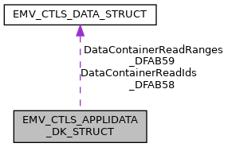

\[<a href="graph_legend.md">legend</a>\]

| Data Fields |  |  |
|----|----|----|
| unsigned char | AdditionalTerminalCapabilities_9F40\[5\] | TempUpdate allowed: YES Description: \"additional terminal capabilities\" for this application, only 1st byte is effective Availability bit: <a href="group___d_e_f___i_n_p_u_t___a_p_p_l_i___d_k.md#ga0be2694f3867bcaffa5c726cfb7e86fa">INPUT_CTLS_APL_DK_9F40_0</a> TLV tag: <a href="group___e_m_v_c_o___t_a_g_s.md#ga5670c7d223a0af749d5b8b251e32f870">TAG_9F40_ADD_TRM_CAP</a>, XML Tag: <a href="group___a_d_k___x_m_l___t_a_g_s.md#gaee5ddd02d287fdd5124303aa70a4adcf">XML_TAG_AD_DK_9F40_ADD_TERM_CAPS</a>. |
| unsigned char | AppFlowCap_DFAB31\[5\] | TempUpdate allowed: YES Description: Configure special application characteristics, see <a href="group___d_e_f___f_l_o_w___d_k.md">Application flow capabilities for Discover/Diners</a> Availability bit: <a href="group___d_e_f___i_n_p_u_t___a_p_p_l_i___d_k.md#gaf0107dba07d78a3ab564189b7def56e5">INPUT_CTLS_APL_DK_DFAB31_1</a> TLV tag: <a href="group___t_a_g_s___n_e_w___c_f_g___i_n_t_f___p_r_i_m.md#gaf35f7d22b485b509c980566dba2eea1a">TAG_DFAB31_APP_FLOW_CAP</a>, XML Tag: <a href="group___a_d_k___x_m_l___t_a_g_s.md#ga6c0c74e3e5f896300add429e75e00b58">XML_TAG_AD_DK_DFAB31_APP_FLOW_CAP</a>. |
| unsigned char | ContactlessCVMRequiredLimit_DFAB42\[6\] | TempUpdate allowed: NO Description: Reader Contactless CVM Required Limit (n12) Use \'9999999999\' to disable. Availability bit: <a href="group___d_e_f___i_n_p_u_t___a_p_p_l_i___d_k.md#gafbda4845204b55bad31b6de53fa4a203">INPUT_CTLS_APL_DK_DFAB42_1</a> TLV tag: <a href="group___t_a_g_s___n_e_w___c_f_g___i_n_t_f___p_r_i_m.md#gaf8082e86422522353c6f242f63f71b46">TAG_DFAB42_CTLS_CVM_REQ_LIMIT</a>, XML Tag: <a href="group___a_d_k___x_m_l___t_a_g_s.md#ga45a75b7302a4997d8669d0915f49cd15">XML_TAG_AD_DK_DFAB42_CTLS_CVM_REQ_LIMIT</a>. |
| unsigned char | ContactlessFloorLimit_DFAB40\[6\] | TempUpdate allowed: NO Description: Reader Contactless Floor Limit (n12) Use \'9999999999\' to disable. Availability bit: <a href="group___d_e_f___i_n_p_u_t___a_p_p_l_i___d_k.md#gade71db536cca1e739caeb3e618803948">INPUT_CTLS_APL_DK_DFAB40_1</a> TLV tag: <a href="group___t_a_g_s___n_e_w___c_f_g___i_n_t_f___p_r_i_m.md#ga4fbadad5ae4dad262274c4c74dc6deb2">TAG_DFAB40_CTLS_FLOOR_LIMIT</a>, XML Tag: <a href="group___a_d_k___x_m_l___t_a_g_s.md#ga2f2be903486eb4d85795c86fa0dbf1cf">XML_TAG_AD_DK_DFAB40_CTLS_FLOOR_LIMIT</a>. |
| unsigned char | ContactlessTransactionLimit_DFAB41\[6\] | TempUpdate allowed: NO Description: Reader Contactless Transaction Limit (n12) Use \'9999999999\' to disable. Availability bit: <a href="group___d_e_f___i_n_p_u_t___a_p_p_l_i___d_k.md#ga9be3f6f72a74414dbd4d767e4511860d">INPUT_CTLS_APL_DK_DFAB41_1</a> TLV tag: <a href="group___t_a_g_s___n_e_w___c_f_g___i_n_t_f___p_r_i_m.md#gac0ad8ae2d5bd130f089f010278a99b4e">TAG_DFAB41_CTLS_TRX_LIMIT</a>, XML Tag: <a href="group___a_d_k___x_m_l___t_a_g_s.md#gafe26dd9a5628ac1d6cdf8e8cbc4c3e57">XML_TAG_AD_DK_DFAB41_CTLS_TRX_LIMIT</a>. |
| <a href="_e_m_v___c_t_l_s___interface_8h.md#a72d9f02bd046a1c2bf3590be2bca6a26">EMV_CTLS_DATA_TYPE</a> | DataContainerReadIds_DFAB58 | TempUpdate allowed: NO Description: Data Container Read List for DPAS-2 Data Storage feature. This is a list of container IDs each 4 byte. Can be used in combination with [DataContainerReadRanges_DFAB59](#a42894365d82316f9b26686c51b138665 "TempUpdate allowed: NO   Description: Data Container Read List for DPAS-2 Data Storage feature...."). Availability bit: <a href="group___d_e_f___i_n_p_u_t___a_p_p_l_i___d_k.md#gae7fcaa257156d7a43e957801136c699b">INPUT_CTLS_APL_DK_DFAB58_1</a> TLV tag: <a href="group___t_a_g_s___n_e_w___c_f_g___i_n_t_f___p_r_i_m.md#gab369deb5cfb1151b852c9fefd39f1137">TAG_DFAB58_ID_LIST</a>, XML Tag: <a href="group___a_d_k___x_m_l___t_a_g_s.md#ga69de9eacf4780bf3890b92243ed38bdf">XML_TAG_AD_DK_DFAB58_CONTAINER_IDS</a>. |
| <a href="_e_m_v___c_t_l_s___interface_8h.md#a72d9f02bd046a1c2bf3590be2bca6a26">EMV_CTLS_DATA_TYPE</a> | DataContainerReadRanges_DFAB59 | TempUpdate allowed: NO Description: Data Container Read List for DPAS-2 Data Storage feature. This is a list of container ID ranges consisting of each 8 byte, 4 byte start container ID and 4 byte stop container ID. Can be used in combination with [DataContainerReadIds_DFAB58](#a75fc0e5e9f1b2ed47fac2428b52dd514 "TempUpdate allowed: NO   Description: Data Container Read List for DPAS-2 Data Storage feature...."). Availability bit: <a href="group___d_e_f___i_n_p_u_t___a_p_p_l_i___d_k.md#ga6bc18d834cc2e967c19fa519c64556be">INPUT_CTLS_APL_DK_DFAB59_1</a> TLV tag: <a href="group___t_a_g_s___n_e_w___c_f_g___i_n_t_f___p_r_i_m.md#ga9825a781e8501bf908e3a8bfef211740">TAG_DFAB59_RANGE_LIST</a>, XML Tag: <a href="group___a_d_k___x_m_l___t_a_g_s.md#ga63af455594800b8a019404269bb3de22">XML_TAG_AD_DK_DFAB59_CONTAINER_RANGES</a>. |
| unsigned char | IncludedData\[8\] | Availability bits, see <a href="group___d_e_f___i_n_p_u_t___a_p_p_l_i___d_k.md">Appli data scheme specific - Discover - Availability bits</a>. |
| unsigned char | MerchantCategoryCode_9F15\[2\] | TempUpdate allowed: NO Description: Merchant category code mandatory for <a href="group___f_u_n_c___c_o_n_f.md#gadc7f2eba5fd3e941d0ddb65a936a0776">EMV_CTLS_SetAppliDataSchemeSpecific</a> Availability bit: <a href="group___d_e_f___i_n_p_u_t___a_p_p_l_i___d_k.md#ga87cc0b71b2563f2e373c8c1eae496ece">INPUT_CTLS_APL_DK_9F15_0</a> TLV tag: <a href="group___e_m_v_c_o___t_a_g_s.md#ga41481cf04242a0ba441c87f6a1569639">TAG_9F15_MERCH_CATEG_CODE</a>, XML Tag: <a href="group___a_d_k___x_m_l___t_a_g_s.md#ga4bf6a8e6677e8500395ec704a9f82ee1">XML_TAG_AD_DK_9F15_MERCHANT_CATEGORY_CODE</a>. |
| unsigned char | TecSupport_DFAB30 | TempUpdate allowed: NO Description: Specifies supported technologies. See <a href="group___d_e_f___t_e_c.md">technologies used in TecSupport_DFAB30</a> Availability bit: <a href="group___d_e_f___i_n_p_u_t___a_p_p_l_i___d_k.md#ga8719fb2d1cf0d975a53eca7b03e942d2">INPUT_CTLS_APL_DK_DFAB30_1</a> TLV tag: <a href="group___t_a_g_s___n_e_w___c_f_g___i_n_t_f___p_r_i_m.md#gab9f0400d266ebde31ce4c0b6c2290a67">TAG_DFAB30_TEC_SUPPORT</a> XML Tag: <a href="group___a_d_k___x_m_l___t_a_g_s.md#ga22e8a67fe25578766bbfd87f04456f10">XML_TAG_AD_DK_DFAB30_TEC_SUPPORT</a> For Discover this parameter (DFAB30) has a specific meaning in terms of the legacy DISCOVER ZIP: 0x01 = DPAS Chip, 0x02 = DPAS MSR, 0x00 = LEGACY DISCOVER ZIP. |
| unsigned char | TermIdent_9F1C\[8\] | TempUpdate allowed: YES Description: Terminal Identification mandatory for <a href="group___f_u_n_c___c_o_n_f.md#gadc7f2eba5fd3e941d0ddb65a936a0776">EMV_CTLS_SetAppliDataSchemeSpecific</a> Availability bit: <a href="group___d_e_f___i_n_p_u_t___a_p_p_l_i___d_k.md#ga908d8b2cdb3364786d8ce3f8c25ce2e6">INPUT_CTLS_APL_DK_9F1C_0</a> TLV tag: <a href="group___e_m_v_c_o___t_a_g_s.md#ga64f401e453e74b4ff1f727aa7cc449ac">TAG_9F1C_TRM_ID</a>, XML Tag: <a href="group___a_d_k___x_m_l___t_a_g_s.md#ga928397e9050c00b4b44dba2d29b1fdac">XML_TAG_AD_DK_9F1C_TERM_IDENT</a>. |
| unsigned char | TerminalCapabilities_9F33\[3\] | TempUpdate allowed: YES Description: \"terminal capabilities\" for this application, for PayPass 3 the tags DF81xx, DF81yy, DF81zz are filled with these 3 byte, for VISA this is used for host compliancy only, for Amex in accordance with tag 9F6E, Availability bit: <a href="group___d_e_f___i_n_p_u_t___a_p_p_l_i___d_k.md#ga71d445a2d976e105f6958fba53dfa6b8">INPUT_CTLS_APL_DK_9F33_0</a> TLV tag: <a href="group___e_m_v_c_o___t_a_g_s.md#gad3ec876483505eb23aad4e1b210653f5">TAG_9F33_TRM_CAPABILITIES</a>, XML Tag: <a href="group___a_d_k___x_m_l___t_a_g_s.md#ga1700c7b6c7bdf393277ffbb884f96b03">XML_TAG_AD_DK_9F33_TERM_CAPS</a>. |
| unsigned char | TerminalCountryCode_9F1A\[2\] | TempUpdate allowed: YES Description: \"Terminal country code\" (e.g. VISA Germany 0276) Availability bit: <a href="group___d_e_f___i_n_p_u_t___a_p_p_l_i___d_k.md#gac6a33cc2dd0d547860cad1950c79e14b">INPUT_CTLS_APL_DK_9F1A_0</a> TLV tag: <a href="group___e_m_v_c_o___t_a_g_s.md#ga5bc987c3686fd5821f20d21015354787">TAG_9F1A_TRM_COUNTRY_CODE</a>, XML Tag: <a href="group___a_d_k___x_m_l___t_a_g_s.md#ga6e1baba29149800acbb8e701d22f894b">XML_TAG_AD_DK_9F1A_TERM_COUNTRY_CODE</a>. |
| unsigned char | TerminalTransactionQualifier_9F66\[4\] | TempUpdate allowed: YES Description: Visa-defined Terminal Transaction Qualifiers Availability bit: <a href="group___d_e_f___i_n_p_u_t___a_p_p_l_i___d_k.md#ga2a646f93d3c7d41cd943fb374978c794">INPUT_CTLS_APL_DK_9F66_0</a> TLV tag: <a href="group___v_i_s_a___t_a_g_s.md#ga30362da6e863c342f262adc3cafb680e">TAG_9F66_TTQ</a>, XML Tag: <a href="group___a_d_k___x_m_l___t_a_g_s.md#ga48b82c6f1000b62b79d28922946213f0">XML_TAG_AD_DK_9F66_TERM_TRX_QUALIFIER</a>. |
| unsigned char | TerminalType_9F35 | TempUpdate allowed: YES Description: Terminal type, possible values see <a href="group___t_e_r_m___t_y_p_e_s.md">Terminaltypes (Tag 9F35)</a>) mandatory for first call of <a href="group___f_u_n_c___c_o_n_f.md#gac5ce9781bba083028538f9e77c2d58f3">EMV_CTLS_SetTermData()</a> Availability bit: <a href="group___d_e_f___i_n_p_u_t___a_p_p_l_i___d_k.md#ga581efb097257d6884e76f3ddfad74d83">INPUT_CTLS_APL_DK_9F35_0</a> TLV tag: <a href="group___e_m_v_c_o___t_a_g_s.md#gace5b4ef50a58d29b2f5296c2c17273c9">TAG_9F35_TRM_TYPE</a>, XML Tag: <a href="group___a_d_k___x_m_l___t_a_g_s.md#ga8ffc5928599ddf41c2d5e8f8d86b6ffc">XML_TAG_AD_DK_9F35_TERM_TYPE</a>. |
| unsigned char | VersionNumber_9F09\[2 \*<a href="_e_m_v___c_t_l_s___interface_8h.md#a01aefcde9b880f166817e82c8f2eac99">EMV_CTLS_MAX_APP_VERS</a>\] | TempUpdate allowed: NO Description: Application chip version number mandatory for <a href="group___f_u_n_c___c_o_n_f.md#gadc7f2eba5fd3e941d0ddb65a936a0776">EMV_CTLS_SetAppliDataSchemeSpecific</a> Availability bit: <a href="group___d_e_f___i_n_p_u_t___a_p_p_l_i___d_k.md#gac0c80fb991a122b507c1e6178e9dc3e8">INPUT_CTLS_APL_DK_9F09_0</a> TLV tag: <a href="group___e_m_v_c_o___t_a_g_s.md#gac0fb6f2c9da5e835754d94e7edf4f7c2">TAG_9F09_TRM_APP_VERSION_NB</a>, XML Tag: <a href="group___a_d_k___x_m_l___t_a_g_s.md#gaa4cf464050c637c55aa4ab1fb414b871">XML_TAG_AD_DK_9F09_VERSION_NUMBER</a>. |

## EMV_CTLS_APPLIDATA_IK_STRUCT 

struct EMV_CTLS_APPLIDATA_IK_STRUCT

Structure for configuration of one single application, IK specific part. See <a href="group___f_u_n_c___c_o_n_f.md#gadc7f2eba5fd3e941d0ddb65a936a0776">EMV_CTLS_SetAppliDataSchemeSpecific()</a>

| Data Fields |  |  |
|----|----|----|
| unsigned char | AcquirerIdentifier_9F01\[6\] | TempUpdate allowed: NO Description: Uniquely identifies the acquirer within each payment system. Availability bit: <a href="group___d_e_f___i_n_p_u_t___a_p_p_l_i___i_k.md#ga2e0210940cae4665505b3a429e63a34a">INPUT_CTLS_APL_IK_9F01_2</a> TLV tag: <a href="group___e_m_v_c_o___t_a_g_s.md#gaab4cf8e32535962270e6219bcbc08194">TAG_9F01_ACQ_ID</a> XML Tag: <a href="group___a_d_k___x_m_l___t_a_g_s.md#ga030442dc1c8df310eecd2981616c41be">XML_TAG_AD_IK_9F01_ACQUIRER_ID</a>. |
| unsigned char | AdditionalTerminalCapabilities_9F40\[5\] | TempUpdate allowed: YES Description: \"additional terminal capabilities\" for this application, only 1st byte is effective Availability bit: <a href="group___d_e_f___i_n_p_u_t___a_p_p_l_i___i_k.md#ga03091dabc52780a7afc934b7506b4b15">INPUT_CTLS_APL_IK_9F40_0</a> TLV tag: <a href="group___e_m_v_c_o___t_a_g_s.md#ga5670c7d223a0af749d5b8b251e32f870">TAG_9F40_ADD_TRM_CAP</a>, XML Tag: <a href="group___a_d_k___x_m_l___t_a_g_s.md#ga9c75e9fcc832a061616dcb4f77a0be29">XML_TAG_AD_IK_9F40_ADD_TERM_CAPS</a>. |
| unsigned char | AppFlowCap_DFAB31\[5\] | TempUpdate allowed: YES Description: Configure special application characteristics, see <a href="group___d_e_f___f_l_o_w___i_k.md">Application flow capabilities for Interac</a> Availability bit: <a href="group___d_e_f___i_n_p_u_t___a_p_p_l_i___i_k.md#ga417457985ac34f78d25b23b153a368bd">INPUT_CTLS_APL_IK_DFAB31_2</a> TLV tag: <a href="group___t_a_g_s___n_e_w___c_f_g___i_n_t_f___p_r_i_m.md#gaf35f7d22b485b509c980566dba2eea1a">TAG_DFAB31_APP_FLOW_CAP</a>, XML Tag: <a href="group___a_d_k___x_m_l___t_a_g_s.md#ga39b97f952caa9ef1a4ae3e1c10d2d28a">XML_TAG_AD_IK_DFAB31_APP_FLOW_CAP</a>. |
| unsigned char | ContactlessCVMRequiredLimit_DFAB42\[6\] | TempUpdate allowed: NO Description: Reader Contactless CVM Required Limit (n12) Use \'9999999999\' to disable. Availability bit: <a href="group___d_e_f___i_n_p_u_t___a_p_p_l_i___i_k.md#ga0c38af574743aec880411a843430cc45">INPUT_CTLS_APL_IK_DFAB42_2</a> TLV tag: <a href="group___t_a_g_s___n_e_w___c_f_g___i_n_t_f___p_r_i_m.md#gaf8082e86422522353c6f242f63f71b46">TAG_DFAB42_CTLS_CVM_REQ_LIMIT</a>, XML Tag: <a href="group___a_d_k___x_m_l___t_a_g_s.md#gab1a49c963a7c28c6255eb987cf880957">XML_TAG_AD_IK_DFAB42_CTLS_CVM_REQ_LIMIT</a>. |
| unsigned char | ContactlessFloorLimit_9F5F\[6\] | TempUpdate allowed: NO Description: Reader Contactless Floor Limit (n12) Use \'9999999999\' to disable. Availability bit: <a href="group___d_e_f___i_n_p_u_t___a_p_p_l_i___i_k.md#gaf751a7fa5a78145b4a2aebdc9a0cf5b9">INPUT_CTLS_APL_IK_9F5F_0</a> TLV tag: <a href="group___i_n_t_e_r_a_c___t_a_g_s.md#ga81000799324cec4dab00c2953f56cb3a">TAG_9F5F_READER_CTLS_FLOOR_LIMIT</a>, XML Tag: <a href="group___a_d_k___x_m_l___t_a_g_s.md#gad9e32b4ef7874610f62cde5f7fd5ad04">XML_TAG_AD_IK_9F5F_CTLS_FLOOR_LIMIT</a>. |
| unsigned char | ContactlessTransactionLimit_DFAB41\[6\] | TempUpdate allowed: NO Description: Reader Contactless Transaction Limit (n12) Use \'9999999999\' to disable. Availability bit: <a href="group___d_e_f___i_n_p_u_t___a_p_p_l_i___i_k.md#ga4a754954d64aae85c99c9b9015108b7c">INPUT_CTLS_APL_IK_DFAB41_2</a> TLV tag: <a href="group___t_a_g_s___n_e_w___c_f_g___i_n_t_f___p_r_i_m.md#gac0ad8ae2d5bd130f089f010278a99b4e">TAG_DFAB41_CTLS_TRX_LIMIT</a>, XML Tag: <a href="group___a_d_k___x_m_l___t_a_g_s.md#gab4e2d085447febdab8f1a7e0c2a7b4c8">XML_TAG_AD_IK_DFAB41_CTLS_TRX_LIMIT</a>. |
| unsigned char | IncludedData\[8\] | Availability bits, see <a href="group___d_e_f___i_n_p_u_t___a_p_p_l_i___i_k.md">Appli data scheme specific - Interac - Availability bits</a>. |
| unsigned char | MerchantCategoryCode_9F15\[2\] | TempUpdate allowed: NO Description: Merchant category code mandatory for <a href="group___f_u_n_c___c_o_n_f.md#gadc7f2eba5fd3e941d0ddb65a936a0776">EMV_CTLS_SetAppliDataSchemeSpecific</a> Availability bit: <a href="group___d_e_f___i_n_p_u_t___a_p_p_l_i___i_k.md#gad916f89af99669cdeeef147e4a08a919">INPUT_CTLS_APL_IK_9F15_1</a> TLV tag: <a href="group___e_m_v_c_o___t_a_g_s.md#ga41481cf04242a0ba441c87f6a1569639">TAG_9F15_MERCH_CATEG_CODE</a>, XML Tag: <a href="group___a_d_k___x_m_l___t_a_g_s.md#gadca32d657cb29e8e0ef8b8d32a0cbba8">XML_TAG_AD_IK_9F15_MERCHANT_CATEGORY_CODE</a>. |
| char | MerchantIdentifier_9F16\[15+1\] | TempUpdate allowed: NO Description: Merchant Identifier mandatory for <a href="group___f_u_n_c___c_o_n_f.md#gadc7f2eba5fd3e941d0ddb65a936a0776">EMV_CTLS_SetAppliDataSchemeSpecific</a> Availability bit: <a href="group___d_e_f___i_n_p_u_t___a_p_p_l_i___i_k.md#gadf88cd6a3ee15d3868f70c707f8cad4f">INPUT_CTLS_APL_IK_9F16_1</a> TLV tag: <a href="group___e_m_v_c_o___t_a_g_s.md#ga184ccaaef50ada9988bfd4af37b8c9fb">TAG_9F16_MERCHANT_ID</a>, XML Tag: <a href="group___a_d_k___x_m_l___t_a_g_s.md#ga44bf5f652b41cae2028686e74ebb8ebb">XML_TAG_AD_IK_9F16_MERCHANT_ID</a>. |
| char | MerchantNameAndLocation_9F4E\[40+1\] | TempUpdate allowed: NO Description: Indicates the name and location of the merchant. Availability bit: <a href="group___d_e_f___i_n_p_u_t___a_p_p_l_i___i_k.md#gaaaa803d94f30f003e7a499a1edad5eab">INPUT_CTLS_APL_IK_9F4E_1</a> TLV tag: <a href="group___e_m_v_c_o___t_a_g_s.md#gac3a7de1661225ab41a4529b68d1fda71">TAG_9F4E_TAC_MERCHANTLOC</a>, XML Tag: <a href="group___a_d_k___x_m_l___t_a_g_s.md#gae7f91e9fb5bdd3bc6023f376a973bb41">XML_TAG_AD_IK_9F4E_MERCHANT_NAME_LOCATION</a>. |
| unsigned char | MerchantTypeIndicator_9F58 | TempUpdate allowed: NO Description: Merchant Type Indicator (MTI) Info: VFI reader tag 9F58 Availability bit: <a href="group___d_e_f___i_n_p_u_t___a_p_p_l_i___i_k.md#ga6d9e0b8e47ff324bc8d9b47c6da05b12">INPUT_CTLS_APL_IK_9F58_0</a> TLV tag: <a href="group___i_n_t_e_r_a_c___t_a_g_s.md#ga3ed9a0cea5a7839c74d034c22605ba7e">TAG_9F58_MERCH_TYPE_INDICATOR</a>, XML Tag: <a href="group___a_d_k___x_m_l___t_a_g_s.md#ga83bf2a4f50b478fe7f24ab294ffad491">XML_TAG_AD_IK_9F58_MERCHANT_TYPE_INDICATOR</a>. |
| unsigned char | ReceiptRequiredLimit_9F5D\[6\] | TempUpdate allowed: YES Description: Interac Terminal CTLS Receipt required limit (numeric) Availability bit: <a href="group___d_e_f___i_n_p_u_t___a_p_p_l_i___i_k.md#ga2d9f93ca1cf3d6810862fe36a38f2562">INPUT_CTLS_APL_IK_9F5D_1</a> TLV tag: <a href="group___i_n_t_e_r_a_c___t_a_g_s.md#ga9f229147f1568804b2dd19cd5e107d86">TAG_9F5D_TERM_CTLS_RECEIPT_REQUIRED_LIMIT</a>, XML Tag: <a href="group___a_d_k___x_m_l___t_a_g_s.md#ga7962ea536fd0508cd2cd0955e5b8c979">XML_TAG_AD_IK_9F5D_RECEIPT_REQ_LIMIT</a>. |
| unsigned char | RiskManagementMaximumTargetPercentage_DFAB48 | TempUpdate allowed: YES Description: Maximum target percentage for random online selection during risk management (n2) Availability bit: <a href="group___d_e_f___i_n_p_u_t___a_p_p_l_i___i_k.md#ga84fd0b79229b5fcd3091f3a47e227195">INPUT_CTLS_APL_IK_DFAB48_3</a> TLV tag: <a href="group___t_a_g_s___n_e_w___c_f_g___i_n_t_f___p_r_i_m.md#gad755eca2cea7087042166526654c7291">TAG_DFAB48_RISK_MGMT_MAX_TRGT_PRCT</a> XML Tag: <a href="group___a_d_k___x_m_l___t_a_g_s.md#gaeb436e2d4974f7810a79ff268526bdca">XML_TAG_AD_IK_DFAB48_RISK_MGMT_MAX_TRGT_PERC</a>. |
| unsigned char | RiskManagementTargetPercentage_DFAB47 | TempUpdate allowed: YES Description: Target percentage for random online selection during risk management (n2) Availability bit: <a href="group___d_e_f___i_n_p_u_t___a_p_p_l_i___i_k.md#ga3a0ad641fb50238a934a2289607dd703">INPUT_CTLS_APL_IK_DFAB47_3</a> TLV tag: <a href="group___t_a_g_s___n_e_w___c_f_g___i_n_t_f___p_r_i_m.md#ga4795ddca7a863da46b56a3a34d3b9c39">TAG_DFAB47_RISK_MGMT_TRGT_PRCT</a> XML Tag: <a href="group___a_d_k___x_m_l___t_a_g_s.md#ga8b3e985e5f2a715d0558a5ed25689da5">XML_TAG_AD_IK_DFAB47_RISK_MGMT_TRGT_PERC</a>. |
| unsigned char | RiskManagementThreshold_DFAB46\[6\] | TempUpdate allowed: YES Description: Threshold Value for Biased Random Online Selection during risk management (n12) Availability bit: <a href="group___d_e_f___i_n_p_u_t___a_p_p_l_i___i_k.md#gab26fbb98de6efe0aaf0287aa8695ec10">INPUT_CTLS_APL_IK_DFAB46_2</a> TLV tag: <a href="group___t_a_g_s___n_e_w___c_f_g___i_n_t_f___p_r_i_m.md#ga03c938e159dbea0a48e833d5205f2529">TAG_DFAB46_RISK_MGMT_THRESHOLD</a> XML Tag: <a href="group___a_d_k___x_m_l___t_a_g_s.md#gafbe07df7a7ae8a14f8b9a67fc56c8bb5">XML_TAG_AD_IK_DFAB46_RISK_MGMT_THRESHOLD</a>. |
| unsigned char | TACDefault_DFAB43\[5\] | TempUpdate allowed: YES Description: Terminal Action Code - Default mandatory for <a href="group___f_u_n_c___c_o_n_f.md#gadc7f2eba5fd3e941d0ddb65a936a0776">EMV_CTLS_SetAppliDataSchemeSpecific</a> Availability bit: <a href="group___d_e_f___i_n_p_u_t___a_p_p_l_i___i_k.md#ga73bfb2cc5709d5986d2819434b198d09">INPUT_CTLS_APL_IK_DFAB43_2</a> TLV tag: <a href="group___t_a_g_s___n_e_w___c_f_g___i_n_t_f___p_r_i_m.md#ga885632db95d4e5e768eb59582123ab4c">TAG_DFAB43_TAC_DEFAULT</a>, XML Tag: <a href="group___a_d_k___x_m_l___t_a_g_s.md#ga8fc01943af2551fcd23d114fa4f1c2de">XML_TAG_AD_IK_DFAB43_TAC_DEFAULT</a>. |
| unsigned char | TACDenial_DFAB44\[5\] | TempUpdate allowed: YES Description: Terminal Action Code - Denial mandatory for <a href="group___f_u_n_c___c_o_n_f.md#gadc7f2eba5fd3e941d0ddb65a936a0776">EMV_CTLS_SetAppliDataSchemeSpecific</a> Availability bit: <a href="group___d_e_f___i_n_p_u_t___a_p_p_l_i___i_k.md#gabcacbd849a66487b5611e734b7e0a8ae">INPUT_CTLS_APL_IK_DFAB44_2</a> TLV tag: <a href="group___t_a_g_s___n_e_w___c_f_g___i_n_t_f___p_r_i_m.md#ga6c4ffbdb026c264681d2c8da01607e9f">TAG_DFAB44_TAC_DENIAL</a>, XML Tag: <a href="group___a_d_k___x_m_l___t_a_g_s.md#gaf2d47c7219cf71ca36e8d20213d1639a">XML_TAG_AD_IK_DFAB44_TAC_DENIAL</a>. |
| unsigned char | TACOnline_DFAB45\[5\] | TempUpdate allowed: YES Description: Terminal Action Code - Online mandatory for <a href="group___f_u_n_c___c_o_n_f.md#gadc7f2eba5fd3e941d0ddb65a936a0776">EMV_CTLS_SetAppliDataSchemeSpecific</a> Availability bit: <a href="group___d_e_f___i_n_p_u_t___a_p_p_l_i___i_k.md#ga390c2e7af6c754211d241a1d9fa756f8">INPUT_CTLS_APL_IK_DFAB45_2</a> TLV tag: <a href="group___t_a_g_s___n_e_w___c_f_g___i_n_t_f___p_r_i_m.md#ga53c8a7f59827691e78e3a9d452da187a">TAG_DFAB45_TAC_ONLINE</a>, XML Tag: <a href="group___a_d_k___x_m_l___t_a_g_s.md#ga881bb1e00d9e2f29fce8271f583ca4d6">XML_TAG_AD_IK_DFAB45_TAC_ONLINE</a>. |
| unsigned char | TermIdent_9F1C\[8\] | TempUpdate allowed: YES Description: Terminal Identification mandatory for <a href="group___f_u_n_c___c_o_n_f.md#gadc7f2eba5fd3e941d0ddb65a936a0776">EMV_CTLS_SetAppliDataSchemeSpecific</a> Availability bit: <a href="group___d_e_f___i_n_p_u_t___a_p_p_l_i___i_k.md#ga234ac72ea87626eb37bd61fffc008837">INPUT_CTLS_APL_IK_9F1C_0</a> TLV tag: <a href="group___e_m_v_c_o___t_a_g_s.md#ga64f401e453e74b4ff1f727aa7cc449ac">TAG_9F1C_TRM_ID</a>, XML Tag: <a href="group___a_d_k___x_m_l___t_a_g_s.md#ga27e4260b7bb5a452170ebbeb5cf0ded3">XML_TAG_AD_IK_9F1C_TERM_IDENT</a>. |
| unsigned char | TerminalCapabilities_9F33\[3\] | TempUpdate allowed: YES Description: \"terminal capabilities\" for this application, for PayPass 3 the tags DF81xx, DF81yy, DF81zz are filled with these 3 byte, for VISA this is used for host compliancy only, for Amex in accordance with tag 9F6E, Availability bit: <a href="group___d_e_f___i_n_p_u_t___a_p_p_l_i___i_k.md#ga99f999a18429dd046eec784bdaced3ce">INPUT_CTLS_APL_IK_9F33_0</a> TLV tag: <a href="group___e_m_v_c_o___t_a_g_s.md#gad3ec876483505eb23aad4e1b210653f5">TAG_9F33_TRM_CAPABILITIES</a>, XML Tag: <a href="group___a_d_k___x_m_l___t_a_g_s.md#ga9cc19ce570c1257db632de603cf1eb37">XML_TAG_AD_IK_9F33_TERM_CAPS</a>. |
| unsigned char | TerminalCountryCode_9F1A\[2\] | TempUpdate allowed: YES Description: \"Terminal country code\" (e.g. VISA Germany 0276) Availability bit: <a href="group___d_e_f___i_n_p_u_t___a_p_p_l_i___i_k.md#ga45f549075e7d5cc7b9fa3eb13691d986">INPUT_CTLS_APL_IK_9F1A_0</a> TLV tag: <a href="group___e_m_v_c_o___t_a_g_s.md#ga5bc987c3686fd5821f20d21015354787">TAG_9F1A_TRM_COUNTRY_CODE</a>, XML Tag: <a href="group___a_d_k___x_m_l___t_a_g_s.md#gaa51ac4ec5003e26db37f3e1336fbc69d">XML_TAG_AD_IK_9F1A_TERM_COUNTRY_CODE</a>. |
| unsigned char | TerminalOptionStatus_9F5E\[2\] | TempUpdate allowed: YES Description: Terminal option status (TOS) Info: VFI reader tag: 9F5E Availability bit: <a href="group___d_e_f___i_n_p_u_t___a_p_p_l_i___i_k.md#ga2d471a874d024b7520f40bca9e4a6740">INPUT_CTLS_APL_IK_9F5E_1</a> TLV tag: <a href="group___i_n_t_e_r_a_c___t_a_g_s.md#gadd1fedce8a2aa1b6490126943b541121">TAG_9F5E_TERM_OPTION_STATUS</a>, XML Tag: <a href="group___a_d_k___x_m_l___t_a_g_s.md#ga409e8e927db674d5c8458bf6db056dfd">XML_TAG_AD_IK_9F5E_TERM_OPTION_STATUS</a>. |
| unsigned char | TerminalTransactionInformation_9F59\[3\] | TempUpdate allowed: NO Description: Terminal Transaction Information (TTI) Info: VFI reader tag 9F59 Default value: DC 87 00 Availability bit: <a href="group___d_e_f___i_n_p_u_t___a_p_p_l_i___i_k.md#ga9108bb9133e79de91482e699eddd7dd8">INPUT_CTLS_APL_IK_9F59_0</a> TLV tag: <a href="group___i_n_t_e_r_a_c___t_a_g_s.md#ga265e19e0b9a6af6ef7419d91671beb5b">TAG_9F59_TERM_TRANS_INFO</a>, XML Tag: <a href="group___a_d_k___x_m_l___t_a_g_s.md#ga4d116cfc05343a5d8ee9b89f92c4f185">XML_TAG_AD_IK_9F59_TERM_TRX_INFORMATION</a>. |
| unsigned char | TerminalTransactionType_9F5A | TempUpdate allowed: NO Description: Terminal Transaction Type (TTT) Info: VFI reader tag 9F5A Availability bit: <a href="group___d_e_f___i_n_p_u_t___a_p_p_l_i___i_k.md#gafad35351604e97af0f763674c6dbfed7">INPUT_CTLS_APL_IK_9F5A_1</a> TLV tag: <a href="group___i_n_t_e_r_a_c___t_a_g_s.md#gae3a0c1352ba2253bf4989940364d079c">TAG_9F5A_TERM_TRANS_TYPE</a>, XML Tag: <a href="group___a_d_k___x_m_l___t_a_g_s.md#ga646e748471e8288608d5769fe9dd313c">XML_TAG_AD_IK_9F5A_TERM_TRX_TYPE</a>. |
| unsigned char | TerminalType_9F35 | TempUpdate allowed: YES Description: Terminal type, possible values see <a href="group___t_e_r_m___t_y_p_e_s.md">Terminaltypes (Tag 9F35)</a>) mandatory for first call of <a href="group___f_u_n_c___c_o_n_f.md#gac5ce9781bba083028538f9e77c2d58f3">EMV_CTLS_SetTermData()</a> Availability bit: <a href="group___d_e_f___i_n_p_u_t___a_p_p_l_i___i_k.md#ga7a029003e0efc887697bafb7bdfe754a">INPUT_CTLS_APL_IK_9F35_0</a> TLV tag: <a href="group___e_m_v_c_o___t_a_g_s.md#gace5b4ef50a58d29b2f5296c2c17273c9">TAG_9F35_TRM_TYPE</a>, XML Tag: <a href="group___a_d_k___x_m_l___t_a_g_s.md#ga770655a2a970f56f1bed25354e9595b1">XML_TAG_AD_IK_9F35_TERM_TYPE</a>. |
| unsigned char | TryAgainLimit_DF6D | TempUpdate allowed: YES Description: allowed number of retries for Interac AID after TRY AGAIN result (n1), defaults to 3, Interac retry limit (allowed number of retries after TRY AGAIN). Availability bit: <a href="group___d_e_f___i_n_p_u_t___a_p_p_l_i___i_k.md#ga3ec337b5d4ae6896e1939e951d5a42d9">INPUT_CTLS_APL_IK_DF6D_1</a> TLV tag: <a href="group___v_e_r_i___p_r_i_m___t_a_g_s.md#ga27032ebc43b42c7d230e78a6a7831bb1">TAG_DF6D_TRY_AGAIN_LIMIT</a> XML Tag: <a href="group___a_d_k___x_m_l___t_a_g_s.md#ga1e6bbadebd270422ab5222f2ec2c9196">XML_TAG_AD_IK_DF6D_TRY_AGAIN_LIMIT</a>. |
| unsigned char | VersionNumber_9F09\[2 \*<a href="_e_m_v___c_t_l_s___interface_8h.md#a01aefcde9b880f166817e82c8f2eac99">EMV_CTLS_MAX_APP_VERS</a>\] | TempUpdate allowed: NO Description: Application chip version number mandatory for <a href="group___f_u_n_c___c_o_n_f.md#gadc7f2eba5fd3e941d0ddb65a936a0776">EMV_CTLS_SetAppliDataSchemeSpecific</a> Availability bit: <a href="group___d_e_f___i_n_p_u_t___a_p_p_l_i___i_k.md#gae1aac0491c754ec2e82d78fd4a07296a">INPUT_CTLS_APL_IK_9F09_1</a> TLV tag: <a href="group___e_m_v_c_o___t_a_g_s.md#gac0fb6f2c9da5e835754d94e7edf4f7c2">TAG_9F09_TRM_APP_VERSION_NB</a>, XML Tag: <a href="group___a_d_k___x_m_l___t_a_g_s.md#ga4166bcabd9830d1321276878d6e2823a">XML_TAG_AD_IK_9F09_VERSION_NUMBER</a>. |

## EMV_CTLS_APPLIDATA_EK_STRUCT 

struct EMV_CTLS_APPLIDATA_EK_STRUCT

Structure for configuration of one single application, EK specific part. See <a href="group___f_u_n_c___c_o_n_f.md#gadc7f2eba5fd3e941d0ddb65a936a0776">EMV_CTLS_SetAppliDataSchemeSpecific()</a>

| Data Fields |  |  |
|----|----|----|
| unsigned char | AcquirerIdentifier_9F01\[6\] | TempUpdate allowed: NO Description: Uniquely identifies the acquirer within each payment system. Availability bit: <a href="group___d_e_f___i_n_p_u_t___a_p_p_l_i___e_k.md#ga43dee1790365e37de260e439fc0af00f">INPUT_CTLS_APL_EK_9F01_1</a> TLV tag: <a href="group___e_m_v_c_o___t_a_g_s.md#gaab4cf8e32535962270e6219bcbc08194">TAG_9F01_ACQ_ID</a> XML Tag: <a href="group___a_d_k___x_m_l___t_a_g_s.md#gadbcbafcc9b33e748d692d0df86357bf3">XML_TAG_AD_EK_9F01_ACQUIRER_ID</a>. |
| unsigned char | AdditionalTerminalCapabilities_9F40\[5\] | TempUpdate allowed: YES Description: \"Additional Terminal Capabilities\" for this application, only 1st byte is effective Availability bit: <a href="group___d_e_f___i_n_p_u_t___a_p_p_l_i___e_k.md#ga58544d34e7288d79e2e8702c9e096538">INPUT_CTLS_APL_EK_9F40_0</a> TLV tag: <a href="group___e_m_v_c_o___t_a_g_s.md#ga5670c7d223a0af749d5b8b251e32f870">TAG_9F40_ADD_TRM_CAP</a>, XML Tag: <a href="group___a_d_k___x_m_l___t_a_g_s.md#ga844dcde751de1774b1712c463c383fdc">XML_TAG_AD_EK_9F40_ADD_TERM_CAPS</a>. |
| unsigned char | AppFlowCap_DFAB31\[5\] | TempUpdate allowed: YES Description: Configure special application characteristics, see <a href="group___d_e_f___f_l_o_w___e_k.md">Application flow capabilities for EPAL</a> Availability bit: <a href="group___d_e_f___i_n_p_u_t___a_p_p_l_i___e_k.md#gabc379284f6a2b11b486928bbdfa35403">INPUT_CTLS_APL_EK_DFAB31_1</a> TLV tag: <a href="group___t_a_g_s___n_e_w___c_f_g___i_n_t_f___p_r_i_m.md#gaf35f7d22b485b509c980566dba2eea1a">TAG_DFAB31_APP_FLOW_CAP</a>, XML Tag: <a href="group___a_d_k___x_m_l___t_a_g_s.md#gaf6e645b1bbcefa10eff4de8d38306f20">XML_TAG_AD_EK_DFAB31_APP_FLOW_CAP</a>. |
| unsigned char | ContactlessFloorLimit_DFAB40\[6\] | TempUpdate allowed: NO Description: Reader Contactless Floor Limit (n12) Use \'9999999999\' to disable. Availability bit: <a href="group___d_e_f___i_n_p_u_t___a_p_p_l_i___e_k.md#ga6529ce4a7017a611b47f9e7b3e967217">INPUT_CTLS_APL_EK_DFAB40_1</a> TLV tag: <a href="group___t_a_g_s___n_e_w___c_f_g___i_n_t_f___p_r_i_m.md#ga4fbadad5ae4dad262274c4c74dc6deb2">TAG_DFAB40_CTLS_FLOOR_LIMIT</a>, XML Tag: <a href="group___a_d_k___x_m_l___t_a_g_s.md#gacfe34ee3395dd70e7fb6512a471e859e">XML_TAG_AD_EK_DFAB40_CTLS_FLOOR_LIMIT</a>. |
| unsigned char | ContactlessTransactionLimit_DFAB41\[6\] | TempUpdate allowed: NO Description: Reader Contactless Transaction Limit (n12) Use \'9999999999\' to disable. Availability bit: <a href="group___d_e_f___i_n_p_u_t___a_p_p_l_i___e_k.md#ga7dc2025d6c119531abeecb653b93081f">INPUT_CTLS_APL_EK_DFAB41_1</a> TLV tag: <a href="group___t_a_g_s___n_e_w___c_f_g___i_n_t_f___p_r_i_m.md#gac0ad8ae2d5bd130f089f010278a99b4e">TAG_DFAB41_CTLS_TRX_LIMIT</a>, XML Tag: <a href="group___a_d_k___x_m_l___t_a_g_s.md#ga50af1b8ce8ba9da1d75ca55e57a1b8a3">XML_TAG_AD_EK_DFAB41_CTLS_TRX_LIMIT</a>. |
| unsigned char | CtlsTransactionLimitCash_DFAB4A\[6\] | TempUpdate allowed: NO Description: Reader Contactless Transaction Limit for cash and cashback transactions (n12) Availability bit: <a href="group___d_e_f___i_n_p_u_t___a_p_p_l_i___e_k.md#gadcc5f074d346a33562a360beb9c4c975">INPUT_CTLS_APL_EK_DFAB4A_2</a> TLV tag: <a href="group___t_a_g_s___n_e_w___c_f_g___i_n_t_f___p_r_i_m.md#gade3e980a887d630e918a1d9dd8e43cd8">TAG_DFAB4A_CTLS_TRX_LIMIT_CASH</a>, XML Tag: <a href="group___a_d_k___x_m_l___t_a_g_s.md#ga146b16861780544f80cd7e3489c4555d">XML_TAG_AD_EK_DFAB4A_CTLS_TRX_LIMIT_CASH</a>. |
| unsigned char | IncludedData\[8\] | Availability bits, see <a href="group___d_e_f___i_n_p_u_t___a_p_p_l_i___e_k.md">Appli data scheme specific - Epal - Availability bits</a>. |
| unsigned char | MerchantCategoryCode_9F15\[2\] | TempUpdate allowed: NO Description: Merchant category code mandatory for <a href="group___f_u_n_c___c_o_n_f.md#gadc7f2eba5fd3e941d0ddb65a936a0776">EMV_CTLS_SetAppliDataSchemeSpecific</a> Availability bit: <a href="group___d_e_f___i_n_p_u_t___a_p_p_l_i___e_k.md#gaa42b5556cf415db82327c8f8a7ece5e3">INPUT_CTLS_APL_EK_9F15_0</a> TLV tag: <a href="group___e_m_v_c_o___t_a_g_s.md#ga41481cf04242a0ba441c87f6a1569639">TAG_9F15_MERCH_CATEG_CODE</a>, XML Tag: <a href="group___a_d_k___x_m_l___t_a_g_s.md#ga024c405a2206ac9ce9ed8a92e56bcf6e">XML_TAG_AD_EK_9F15_MERCHANT_CATEGORY_CODE</a>. |
| char | MerchantIdentifier_9F16\[15+1\] | TempUpdate allowed: NO Description: Merchant Identifier mandatory for <a href="group___f_u_n_c___c_o_n_f.md#gadc7f2eba5fd3e941d0ddb65a936a0776">EMV_CTLS_SetAppliDataSchemeSpecific</a> Availability bit: <a href="group___d_e_f___i_n_p_u_t___a_p_p_l_i___e_k.md#ga9ac868633fb41e7ae6e7d517580b589e">INPUT_CTLS_APL_EK_9F16_0</a> TLV tag: <a href="group___e_m_v_c_o___t_a_g_s.md#ga184ccaaef50ada9988bfd4af37b8c9fb">TAG_9F16_MERCHANT_ID</a>, XML Tag: <a href="group___a_d_k___x_m_l___t_a_g_s.md#gaab8463b0320abb66a4f5f3a9fd6f37e3">XML_TAG_AD_EK_9F16_MERCHANT_ID</a>. |
| char | MerchantNameAndLocation_9F4E\[40+1\] | TempUpdate allowed: NO Description: Indicates the name and location of the merchant. Availability bit: <a href="group___d_e_f___i_n_p_u_t___a_p_p_l_i___e_k.md#gaf4653be71119e8bc0d9fab6be872cbf8">INPUT_CTLS_APL_EK_9F4E_1</a> TLV tag: <a href="group___e_m_v_c_o___t_a_g_s.md#gac3a7de1661225ab41a4529b68d1fda71">TAG_9F4E_TAC_MERCHANTLOC</a>, XML Tag: <a href="group___a_d_k___x_m_l___t_a_g_s.md#gad4e32222f2f8bf15c03e64fc3373db73">XML_TAG_AD_EK_9F4E_MERCHANT_NAME_LOCATION</a>. |
| unsigned char | TACDefault_DFAB43\[5\] | TempUpdate allowed: YES Description: Terminal Action Code - Default mandatory for <a href="group___f_u_n_c___c_o_n_f.md#gadc7f2eba5fd3e941d0ddb65a936a0776">EMV_CTLS_SetAppliDataSchemeSpecific</a> Availability bit: <a href="group___d_e_f___i_n_p_u_t___a_p_p_l_i___e_k.md#ga49a9cf920d615590ddf4cd3064171379">INPUT_CTLS_APL_EK_DFAB43_1</a> TLV tag: <a href="group___t_a_g_s___n_e_w___c_f_g___i_n_t_f___p_r_i_m.md#ga885632db95d4e5e768eb59582123ab4c">TAG_DFAB43_TAC_DEFAULT</a>, XML Tag: <a href="group___a_d_k___x_m_l___t_a_g_s.md#ga69072c39cfdb4b04db6d13510f201629">XML_TAG_AD_EK_DFAB43_TAC_DEFAULT</a>. |
| unsigned char | TACDenial_DFAB44\[5\] | TempUpdate allowed: YES Description: Terminal Action Code - Denial mandatory for <a href="group___f_u_n_c___c_o_n_f.md#gadc7f2eba5fd3e941d0ddb65a936a0776">EMV_CTLS_SetAppliDataSchemeSpecific</a> Availability bit: <a href="group___d_e_f___i_n_p_u_t___a_p_p_l_i___e_k.md#gad43f082aa0a3443176fd1e62c8b1eb8a">INPUT_CTLS_APL_EK_DFAB44_1</a> TLV tag: <a href="group___t_a_g_s___n_e_w___c_f_g___i_n_t_f___p_r_i_m.md#ga6c4ffbdb026c264681d2c8da01607e9f">TAG_DFAB44_TAC_DENIAL</a>, XML Tag: <a href="group___a_d_k___x_m_l___t_a_g_s.md#ga2d14b2e41841162ffc0ebacfaf28b2fb">XML_TAG_AD_EK_DFAB44_TAC_DENIAL</a>. |
| unsigned char | TACOnline_DFAB45\[5\] | TempUpdate allowed: YES Description: Terminal Action Code - Online mandatory for <a href="group___f_u_n_c___c_o_n_f.md#gadc7f2eba5fd3e941d0ddb65a936a0776">EMV_CTLS_SetAppliDataSchemeSpecific</a> Availability bit: <a href="group___d_e_f___i_n_p_u_t___a_p_p_l_i___e_k.md#ga0af63fe0af0f9d7533804e2cef650825">INPUT_CTLS_APL_EK_DFAB45_1</a> TLV tag: <a href="group___t_a_g_s___n_e_w___c_f_g___i_n_t_f___p_r_i_m.md#ga53c8a7f59827691e78e3a9d452da187a">TAG_DFAB45_TAC_ONLINE</a>, XML Tag: <a href="group___a_d_k___x_m_l___t_a_g_s.md#ga40f45a0974e12d0562635c365b72dc70">XML_TAG_AD_EK_DFAB45_TAC_ONLINE</a>. |
| unsigned char | TermIdent_9F1C\[8\] | TempUpdate allowed: YES Description: Terminal Identification mandatory for <a href="group___f_u_n_c___c_o_n_f.md#gadc7f2eba5fd3e941d0ddb65a936a0776">EMV_CTLS_SetAppliDataSchemeSpecific</a> Availability bit: <a href="group___d_e_f___i_n_p_u_t___a_p_p_l_i___e_k.md#ga22d48109d229678b623795c180d57e0b">INPUT_CTLS_APL_EK_9F1C_0</a> TLV tag: <a href="group___e_m_v_c_o___t_a_g_s.md#ga64f401e453e74b4ff1f727aa7cc449ac">TAG_9F1C_TRM_ID</a>, XML Tag: <a href="group___a_d_k___x_m_l___t_a_g_s.md#ga5ad7d818060229ce7bcf711eb54740c3">XML_TAG_AD_EK_9F1C_TERM_IDENT</a>. |
| unsigned char | TerminalCapabilities_9F33\[3\] | TempUpdate allowed: YES Description: \"Terminal Capabilities\" for this application, for PayPass 3 the tags DF81xx, DF81yy, DF81zz are filled with these 3 byte, for VISA this is used for host compliancy only, for Amex in accordance with tag 9F6E, Availability bit: <a href="group___d_e_f___i_n_p_u_t___a_p_p_l_i___e_k.md#ga72328b83e8bdc1df965b2b5368f2733a">INPUT_CTLS_APL_EK_9F33_0</a> TLV tag: <a href="group___e_m_v_c_o___t_a_g_s.md#gad3ec876483505eb23aad4e1b210653f5">TAG_9F33_TRM_CAPABILITIES</a>, XML Tag: <a href="group___a_d_k___x_m_l___t_a_g_s.md#ga59db09138e122abb6e69bfc5c7339a48">XML_TAG_AD_EK_9F33_TERM_CAPS</a>. |
| unsigned char | TerminalCountryCode_9F1A\[2\] | TempUpdate allowed: YES Description: \"Terminal country code\" (e.g. VISA Germany 0276) Availability bit: <a href="group___d_e_f___i_n_p_u_t___a_p_p_l_i___e_k.md#gaa7d7c6e46498033b8d7eca4688958038">INPUT_CTLS_APL_EK_9F1A_0</a> TLV tag: <a href="group___e_m_v_c_o___t_a_g_s.md#ga5bc987c3686fd5821f20d21015354787">TAG_9F1A_TRM_COUNTRY_CODE</a>, XML Tag: <a href="group___a_d_k___x_m_l___t_a_g_s.md#gab34efe3fb77ab818e77e627c99d7c6bf">XML_TAG_AD_EK_9F1A_TERM_COUNTRY_CODE</a>. |
| unsigned char | TerminalTransactionQualifier_9F66\[4\] | TempUpdate allowed: YES Description: Visa-defined Terminal Transaction Qualifiers Availability bit: <a href="group___d_e_f___i_n_p_u_t___a_p_p_l_i___e_k.md#gad30ba58cc4fd940862aca24871dc84f8">INPUT_CTLS_APL_EK_9F66_2</a> TLV tag: <a href="group___v_i_s_a___t_a_g_s.md#ga30362da6e863c342f262adc3cafb680e">TAG_9F66_TTQ</a>, XML Tag: <a href="group___a_d_k___x_m_l___t_a_g_s.md#gad466b4b062f6af80b154ced47fe4c5ab">XML_TAG_AD_EK_9F66_TERM_TRX_QUALIFIER</a>. |
| unsigned char | TerminalType_9F35 | TempUpdate allowed: YES Description: Terminal type, possible values see <a href="group___t_e_r_m___t_y_p_e_s.md">Terminaltypes (Tag 9F35)</a>) mandatory for first call of <a href="group___f_u_n_c___c_o_n_f.md#gac5ce9781bba083028538f9e77c2d58f3">EMV_CTLS_SetTermData()</a> Availability bit: <a href="group___d_e_f___i_n_p_u_t___a_p_p_l_i___e_k.md#gac1e7ec2f59832e9b9114311040173ff0">INPUT_CTLS_APL_EK_9F35_0</a> TLV tag: <a href="group___e_m_v_c_o___t_a_g_s.md#gace5b4ef50a58d29b2f5296c2c17273c9">TAG_9F35_TRM_TYPE</a>, XML Tag: <a href="group___a_d_k___x_m_l___t_a_g_s.md#ga2777c7d1e2518b62676c628e348e5ba3">XML_TAG_AD_EK_9F35_TERM_TYPE</a>. |
| unsigned char | VersionNumber_9F09\[2 \*<a href="_e_m_v___c_t_l_s___interface_8h.md#a01aefcde9b880f166817e82c8f2eac99">EMV_CTLS_MAX_APP_VERS</a>\] | TempUpdate allowed: NO Description: Application chip version number mandatory for <a href="group___f_u_n_c___c_o_n_f.md#gadc7f2eba5fd3e941d0ddb65a936a0776">EMV_CTLS_SetAppliDataSchemeSpecific</a> Availability bit: <a href="group___d_e_f___i_n_p_u_t___a_p_p_l_i___e_k.md#gabb71b21e0b4a1849b248ca9206ee7945">INPUT_CTLS_APL_EK_9F09_0</a> TLV tag: <a href="group___e_m_v_c_o___t_a_g_s.md#gac0fb6f2c9da5e835754d94e7edf4f7c2">TAG_9F09_TRM_APP_VERSION_NB</a>, XML Tag: <a href="group___a_d_k___x_m_l___t_a_g_s.md#ga8710d5e932cbc43f44c4ac6d0c8058bb">XML_TAG_AD_EK_9F09_VERSION_NUMBER</a>. |

## EMV_CTLS_APPLIDATA_PK_STRUCT 

struct EMV_CTLS_APPLIDATA_PK_STRUCT

Structure for configuration of one single application, PK specific part (VisaAP resp. Visa Asia/Pacific resp. Visa Wave 2). See <a href="group___f_u_n_c___c_o_n_f.md#gadc7f2eba5fd3e941d0ddb65a936a0776">EMV_CTLS_SetAppliDataSchemeSpecific()</a>

| Data Fields |  |  |
|----|----|----|
| unsigned char | AppFlowCap_DFAB31\[5\] | TempUpdate allowed: YES Description: Configure special application characteristics, see <a href="group___d_e_f___f_l_o_w___p_k.md">Application flow capabilities for Visa Asia/Pacific</a> Availability bit: <a href="group___d_e_f___i_n_p_u_t___a_p_p_l_i___p_k.md#ga8521d38607a9f707c2a726c2998735c7">INPUT_CTLS_APL_PK_DFAB31_0</a> TLV tag: <a href="group___t_a_g_s___n_e_w___c_f_g___i_n_t_f___p_r_i_m.md#gaf35f7d22b485b509c980566dba2eea1a">TAG_DFAB31_APP_FLOW_CAP</a>, XML Tag: <a href="group___a_d_k___x_m_l___t_a_g_s.md#ga528da5c0d59eebb9f280e13f6ea71c2a">XML_TAG_AD_PK_DFAB31_APP_FLOW_CAP</a>. |
| unsigned char | ContactlessCVMRequiredLimit_DF01\[6\] | TempUpdate allowed: NO Description: BCD encoded. Below this limit CVM processing is skipped, above performed Equal to this limit it depends on the scheme: with payWave it\'s performed, with PayPass not Use FF FF FF FF to disable Visa and MasterCard spec naming: \"Reader CVM Required Limit\" Availability bit: <a href="group___d_e_f___i_n_p_u_t___a_p_p_l_i___p_k.md#ga83de50f7eea46467921ef02c64295f2c">INPUT_CTLS_APL_PK_DF01_0</a> TLV tag: <a href="group___v_i_s_a___t_a_g_s.md#ga7c31703a767a4eb7a8de7a708f601633">TAG_DF01_PK_CVM_REQ_LIMIT</a> XML Tag: <a href="group___a_d_k___x_m_l___t_a_g_s.md#ga4444c90a462dafc4f97afe711a76c178">XML_TAG_AD_PK_DF01_CTLS_CVM_REQ_LIMIT</a>. |
| unsigned char | ContactlessFloorLimit_DF02\[6\] | TempUpdate allowed: NO Description: Terminal floor limit (BCD encoded) Use FF FF FF FF to disable Availability bit: <a href="group___d_e_f___i_n_p_u_t___a_p_p_l_i___p_k.md#ga4f3a62737b1f4d56f5610e116ad849ff">INPUT_CTLS_APL_PK_DF02_0</a> TLV tag: <a href="group___v_i_s_a___t_a_g_s.md#gaefbade1401fdfc9c4f1f95779a8a8262">TAG_DF02_PK_FLOOR_LIMIT</a>, XML Tag: <a href="group___a_d_k___x_m_l___t_a_g_s.md#gabf0616ab6cec0a1f99e3e993852d806f">XML_TAG_AD_PK_DF02_CTLS_FLOOR_LIMIT</a>. |
| unsigned char | ContactlessTransactionLimit_DFAB41\[6\] | TempUpdate allowed: NO Description: BCD encoded. No contactless txns above this limit (as defined by PayPass) PayPass spec naming: \"Reader Contactless Transaction Limit\" Visa spec naming: \"Reader Contactless Transaction Limit (RCTL)\" Visa spec strongly recommends to disable this limit. Use FF FF FF FF to disable Availability bit: <a href="group___d_e_f___i_n_p_u_t___a_p_p_l_i___p_k.md#ga89550e21e581d95fd5a9bb645ba53ca3">INPUT_CTLS_APL_PK_DFAB41_0</a> TLV tag: <a href="group___t_a_g_s___n_e_w___c_f_g___i_n_t_f___p_r_i_m.md#gac0ad8ae2d5bd130f089f010278a99b4e">TAG_DFAB41_CTLS_TRX_LIMIT</a> XML Tag: <a href="group___a_d_k___x_m_l___t_a_g_s.md#gadd4639f125bed99ae80725fe4c00a556">XML_TAG_AD_PK_DFAB41_CTLS_TRX_LIMIT</a>. |
| unsigned char | CvmRequirements_DF04 | TempUpdate allowed: YES Description: VisaAP specific, CVM requirements, bitlist, 01 = signature, 02 = Online PIN Availability bit: <a href="group___d_e_f___i_n_p_u_t___a_p_p_l_i___p_k.md#ga6322e01ac693f3619f0e44fe597bbbe9">INPUT_CTLS_APL_PK_DF04_0</a> TLV tag: <a href="group___v_i_s_a___t_a_g_s.md#gad00d4584c8dece99bc5afe17252560c0">TAG_DF04_PK_CVM_REQUIREMENTS</a>, XML Tag: <a href="group___a_d_k___x_m_l___t_a_g_s.md#gad761c0a874844a3d2a187368159cbc90">XML_TAG_AD_PK_CVM_REQUIREMENTS</a>. |
| unsigned char | IncludedData\[8\] | Availability bits, see <a href="group___d_e_f___i_n_p_u_t___a_p_p_l_i___p_k.md">Appli data scheme specific - Visa Asia/Pacific - Availability bits</a>. |
| unsigned char | TermIdent_9F1C\[8\] | TempUpdate allowed: YES Description: Terminal Identification mandatory for <a href="group___f_u_n_c___c_o_n_f.md#gadc7f2eba5fd3e941d0ddb65a936a0776">EMV_CTLS_SetAppliDataSchemeSpecific</a> Availability bit: <a href="group___d_e_f___i_n_p_u_t___a_p_p_l_i___p_k.md#ga6ae367c1b22223dbabc23f7afbd6ab19">INPUT_CTLS_APL_PK_9F1C_0</a> TLV tag: <a href="group___e_m_v_c_o___t_a_g_s.md#ga64f401e453e74b4ff1f727aa7cc449ac">TAG_9F1C_TRM_ID</a>, XML Tag: <a href="group___a_d_k___x_m_l___t_a_g_s.md#ga03eaf6b7c271502273c265bae804cbb0">XML_TAG_AD_PK_9F1C_TERM_IDENT</a>. |
| unsigned char | TerminalCountryCode_9F1A\[2\] | TempUpdate allowed: YES Description: \"Terminal country code\" (e.g. VISA Germany 0276) Availability bit: <a href="group___d_e_f___i_n_p_u_t___a_p_p_l_i___p_k.md#ga6d54b842ce297e66502727bec652c90a">INPUT_CTLS_APL_PK_9F1A_0</a> TLV tag: <a href="group___e_m_v_c_o___t_a_g_s.md#ga5bc987c3686fd5821f20d21015354787">TAG_9F1A_TRM_COUNTRY_CODE</a>, XML Tag: <a href="group___a_d_k___x_m_l___t_a_g_s.md#ga656756c4b4bda82043b5bae8f9e2addb">XML_TAG_AD_PK_9F1A_TERM_COUNTRY_CODE</a>. |
| unsigned char | TerminalType_9F35 | TempUpdate allowed: YES Description: Terminal type, possible values: 00 = international, 01 = domestic only mandatory for first call of <a href="group___f_u_n_c___c_o_n_f.md#gac5ce9781bba083028538f9e77c2d58f3">EMV_CTLS_SetTermData()</a> Availability bit: <a href="group___d_e_f___i_n_p_u_t___a_p_p_l_i___p_k.md#gaef771b6e1b7e540bafb3fe5a7d2c8ad1">INPUT_CTLS_APL_PK_9F35_0</a> TLV tag: <a href="group___e_m_v_c_o___t_a_g_s.md#gace5b4ef50a58d29b2f5296c2c17273c9">TAG_9F35_TRM_TYPE</a>, XML Tag: <a href="group___a_d_k___x_m_l___t_a_g_s.md#ga074be4d4e067f50091e050bd7645886b">XML_TAG_AD_PK_9F35_TERM_TYPE</a>. |

## EMV_CTLS_APPLIDATA_CK_STRUCT 

struct EMV_CTLS_APPLIDATA_CK_STRUCT

Structure for configuration of one single application, CK specific part. See see Book C-7, Kernel 7 Specification at <a href="http://www.emvco.com/">[EMVCo Homepage]</a>. See <a href="group___f_u_n_c___c_o_n_f.md#gadc7f2eba5fd3e941d0ddb65a936a0776">EMV_CTLS_SetAppliDataSchemeSpecific()</a>

| Data Fields |  |  |
|----|----|----|
| unsigned char | AdditionalTerminalCapabilities_9F40\[5\] | TempUpdate allowed: YES Description: \"additional terminal capabilities\" for this application, only 1st byte is effective Availability bit: <a href="group___d_e_f___i_n_p_u_t___a_p_p_l_i___c_k.md#gac3ea468a11dcdfc892e973c92992c177">INPUT_CTLS_APL_CK_9F40_0</a> TLV tag: <a href="group___e_m_v_c_o___t_a_g_s.md#ga5670c7d223a0af749d5b8b251e32f870">TAG_9F40_ADD_TRM_CAP</a>, XML Tag: <a href="group___a_d_k___x_m_l___t_a_g_s.md#ga38f03f6e8bf816f16c77d89fbe245f51">XML_TAG_AD_CK_9F40_ADD_TERM_CAPS</a>. |
| unsigned char | AppFlowCap_DFAB31\[5\] | TempUpdate allowed: YES Description: Configure special application characteristics, see <a href="group___d_e_f___f_l_o_w___c_k.md">Application flow capabilities for China Union Pay</a> Availability bit: <a href="group___d_e_f___i_n_p_u_t___a_p_p_l_i___c_k.md#gae96439d7d643c1dc354caa72ac49d2fd">INPUT_CTLS_APL_CK_DFAB31_1</a> TLV tag: <a href="group___t_a_g_s___n_e_w___c_f_g___i_n_t_f___p_r_i_m.md#gaf35f7d22b485b509c980566dba2eea1a">TAG_DFAB31_APP_FLOW_CAP</a>, XML Tag: <a href="group___a_d_k___x_m_l___t_a_g_s.md#gae1357f3c61e124527dbd203266e3256a">XML_TAG_AD_CK_DFAB31_APP_FLOW_CAP</a>. |
| unsigned char | ContactlessCVMRequiredLimit_DFAB42\[6\] | TempUpdate allowed: NO Description: Reader Contactless CVM Required Limit (n12) Use \'9999999999\' to disable. Availability bit: <a href="group___d_e_f___i_n_p_u_t___a_p_p_l_i___c_k.md#ga690894404b4978908a73cda9ac212c61">INPUT_CTLS_APL_CK_DFAB42_1</a> TLV tag: <a href="group___t_a_g_s___n_e_w___c_f_g___i_n_t_f___p_r_i_m.md#gaf8082e86422522353c6f242f63f71b46">TAG_DFAB42_CTLS_CVM_REQ_LIMIT</a>, XML Tag: <a href="group___a_d_k___x_m_l___t_a_g_s.md#gacfb8c3923d60ae1d49434972e8e52236">XML_TAG_AD_CK_DFAB42_CTLS_CVM_REQ_LIMIT</a>. |
| unsigned char | ContactlessFloorLimit_DFAB40\[6\] | TempUpdate allowed: NO Description: Reader Contactless Floor Limit (n12) Use \'9999999999\' to disable. Availability bit: <a href="group___d_e_f___i_n_p_u_t___a_p_p_l_i___c_k.md#ga63da9b1825d9674d74c857eaea361dc7">INPUT_CTLS_APL_CK_DFAB40_1</a> TLV tag: <a href="group___t_a_g_s___n_e_w___c_f_g___i_n_t_f___p_r_i_m.md#ga4fbadad5ae4dad262274c4c74dc6deb2">TAG_DFAB40_CTLS_FLOOR_LIMIT</a>, XML Tag: <a href="group___a_d_k___x_m_l___t_a_g_s.md#ga71d5585a35420f1a6d2d8959ee92fb5c">XML_TAG_AD_CK_DFAB40_CTLS_FLOOR_LIMIT</a>. |
| unsigned char | ContactlessTransactionLimit_DFAB41\[6\] | TempUpdate allowed: NO Description: Reader Contactless Transaction Limit (n12) Use \'9999999999\' to disable. Availability bit: <a href="group___d_e_f___i_n_p_u_t___a_p_p_l_i___c_k.md#ga2014ac1ef3837032cf4430d1dcb347a1">INPUT_CTLS_APL_CK_DFAB41_1</a> TLV tag: <a href="group___t_a_g_s___n_e_w___c_f_g___i_n_t_f___p_r_i_m.md#gac0ad8ae2d5bd130f089f010278a99b4e">TAG_DFAB41_CTLS_TRX_LIMIT</a>, XML Tag: <a href="group___a_d_k___x_m_l___t_a_g_s.md#ga50ee28f6cdd3f7c7b7bebdfe8573be63">XML_TAG_AD_CK_DFAB41_CTLS_TRX_LIMIT</a>. |
| unsigned char | IncludedData\[8\] | Availability bits, see <a href="group___d_e_f___i_n_p_u_t___a_p_p_l_i___c_k.md">Appli data scheme specific - China Union Pay - Avaialability bits</a>. |
| unsigned char | MerchantCategoryCode_9F15\[2\] | TempUpdate allowed: NO Description: Merchant category code mandatory for <a href="group___f_u_n_c___c_o_n_f.md#gadc7f2eba5fd3e941d0ddb65a936a0776">EMV_CTLS_SetAppliDataSchemeSpecific</a> Availability bit: <a href="group___d_e_f___i_n_p_u_t___a_p_p_l_i___c_k.md#gaef76522e6daa3c18e4aeb8edb68a8fd4">INPUT_CTLS_APL_CK_9F15_0</a> TLV tag: <a href="group___e_m_v_c_o___t_a_g_s.md#ga41481cf04242a0ba441c87f6a1569639">TAG_9F15_MERCH_CATEG_CODE</a>, XML Tag: <a href="group___a_d_k___x_m_l___t_a_g_s.md#ga36be6d44c2867d5e10835d59b40ab9f3">XML_TAG_AD_CK_9F15_MERCHANT_CATEGORY_CODE</a>. |
| char | MerchantIdentifier_9F16\[15+1\] | TempUpdate allowed: NO Description: Merchant Identifier mandatory for <a href="group___f_u_n_c___c_o_n_f.md#gadc7f2eba5fd3e941d0ddb65a936a0776">EMV_CTLS_SetAppliDataSchemeSpecific</a> Availability bit: <a href="group___d_e_f___i_n_p_u_t___a_p_p_l_i___c_k.md#gaa4ae7034eddc870f44c9624bdb4eb867">INPUT_CTLS_APL_CK_9F16_1</a> TLV tag: <a href="group___e_m_v_c_o___t_a_g_s.md#ga184ccaaef50ada9988bfd4af37b8c9fb">TAG_9F16_MERCHANT_ID</a>, XML Tag: <a href="group___a_d_k___x_m_l___t_a_g_s.md#ga43c02bda4f5f48f86091883328a7d6b9">XML_TAG_AD_CK_9F16_MERCHANT_ID</a>. |
| char | MerchantNameAndLocation_9F4E\[40+1\] | TempUpdate allowed: NO Description: Indicates the name and location of the merchant. Availability bit: <a href="group___d_e_f___i_n_p_u_t___a_p_p_l_i___c_k.md#ga849ce25e221ba2ac034e1ea1f740d454">INPUT_CTLS_APL_CK_9F4E_1</a> TLV tag: <a href="group___e_m_v_c_o___t_a_g_s.md#gac3a7de1661225ab41a4529b68d1fda71">TAG_9F4E_TAC_MERCHANTLOC</a> XML Tag: <a href="group___a_d_k___x_m_l___t_a_g_s.md#gacdc261cc444eb24d122db2f09f775955">XML_TAG_AD_CK_9F4E_MERCHANT_NAME_LOCATION</a>. |
| unsigned char | TecSupport_DFAB30 | TempUpdate allowed: NO Description: Specifies supported technologies. See <a href="group___d_e_f___t_e_c.md">technologies used in TecSupport_DFAB30</a> Availability bit: <a href="group___d_e_f___i_n_p_u_t___a_p_p_l_i___c_k.md#ga37cf1bd1f57a4cd0c9d5195ee6dec646">INPUT_CTLS_APL_CK_DFAB30_1</a> TLV tag: <a href="group___t_a_g_s___n_e_w___c_f_g___i_n_t_f___p_r_i_m.md#gab9f0400d266ebde31ce4c0b6c2290a67">TAG_DFAB30_TEC_SUPPORT</a> XML Tag: <a href="group___a_d_k___x_m_l___t_a_g_s.md#ga408d6bbb52e3bcb7e168dc8754310dce">XML_TAG_AD_CK_DFAB30_TEC_SUPPORT</a>. |
| unsigned char | TermIdent_9F1C\[8\] | TempUpdate allowed: YES Description: Terminal Identification mandatory for <a href="group___f_u_n_c___c_o_n_f.md#gadc7f2eba5fd3e941d0ddb65a936a0776">EMV_CTLS_SetAppliDataSchemeSpecific</a> Availability bit: <a href="group___d_e_f___i_n_p_u_t___a_p_p_l_i___c_k.md#gad5ff525071a7242628a64cf8d202263d">INPUT_CTLS_APL_CK_9F1C_0</a> TLV tag: <a href="group___e_m_v_c_o___t_a_g_s.md#ga64f401e453e74b4ff1f727aa7cc449ac">TAG_9F1C_TRM_ID</a>, XML Tag: <a href="group___a_d_k___x_m_l___t_a_g_s.md#gabb763b4c07f1921b9a2a348e96f7dc1b">XML_TAG_AD_CK_9F1C_TERM_IDENT</a>. |
| unsigned char | TerminalCapabilities_9F33\[3\] | TempUpdate allowed: YES Description: \"terminal capabilities\" for this application, for PayPass 3 the tags DF81xx, DF81yy, DF81zz are filled with these 3 byte, for VISA this is used for host compliancy only, for Amex in accordance with tag 9F6E, Availability bit: <a href="group___d_e_f___i_n_p_u_t___a_p_p_l_i___c_k.md#gab93ebd6bb05ab02a279a729c4e0a2fed">INPUT_CTLS_APL_CK_9F33_0</a> TLV tag: <a href="group___e_m_v_c_o___t_a_g_s.md#gad3ec876483505eb23aad4e1b210653f5">TAG_9F33_TRM_CAPABILITIES</a>, XML Tag: <a href="group___a_d_k___x_m_l___t_a_g_s.md#ga38f0d0171e00010507d5df2d89ab8f90">XML_TAG_AD_CK_9F33_TERM_CAPS</a>. |
| unsigned char | TerminalCountryCode_9F1A\[2\] | TempUpdate allowed: YES Description: \"Terminal country code\" (e.g. VISA Germany 0276) Availability bit: <a href="group___d_e_f___i_n_p_u_t___a_p_p_l_i___c_k.md#gac49768368a2c2fb04675188f12655e26">INPUT_CTLS_APL_CK_9F1A_0</a> TLV tag: <a href="group___e_m_v_c_o___t_a_g_s.md#ga5bc987c3686fd5821f20d21015354787">TAG_9F1A_TRM_COUNTRY_CODE</a>, XML Tag: <a href="group___a_d_k___x_m_l___t_a_g_s.md#ga4f12f92305877ef7300c9c457722e188">XML_TAG_AD_CK_9F1A_TERM_COUNTRY_CODE</a>. |
| unsigned char | TerminalTransactionQualifier_9F66\[4\] | TempUpdate allowed: YES Description: Visa-defined Terminal Transaction Qualifiers Availability bit: <a href="group___d_e_f___i_n_p_u_t___a_p_p_l_i___c_k.md#ga427fc380d24b7c1ef22e87e5a65ddbdc">INPUT_CTLS_APL_CK_9F66_0</a> TLV tag: <a href="group___v_i_s_a___t_a_g_s.md#ga30362da6e863c342f262adc3cafb680e">TAG_9F66_TTQ</a>, XML Tag: <a href="group___a_d_k___x_m_l___t_a_g_s.md#ga90082353125c3c8dd07c3b01b8ec301a">XML_TAG_AD_CK_9F66_TERM_TRX_QUALIFIER</a>. |
| unsigned char | TerminalType_9F35 | TempUpdate allowed: YES Description: Terminal type, possible values see <a href="group___t_e_r_m___t_y_p_e_s.md">Terminaltypes (Tag 9F35)</a>) mandatory for first call of <a href="group___f_u_n_c___c_o_n_f.md#gac5ce9781bba083028538f9e77c2d58f3">EMV_CTLS_SetTermData()</a> Availability bit: <a href="group___d_e_f___i_n_p_u_t___a_p_p_l_i___c_k.md#ga50f46db7876980ae0b1b2599d48aa7c7">INPUT_CTLS_APL_CK_9F35_0</a> TLV tag: <a href="group___e_m_v_c_o___t_a_g_s.md#gace5b4ef50a58d29b2f5296c2c17273c9">TAG_9F35_TRM_TYPE</a>, XML Tag: <a href="group___a_d_k___x_m_l___t_a_g_s.md#ga60549eb1d1ac164be143fb43d60ec24a">XML_TAG_AD_CK_9F35_TERM_TYPE</a>. |
| unsigned char | VersionNumber_9F09\[2 \*<a href="_e_m_v___c_t_l_s___interface_8h.md#a01aefcde9b880f166817e82c8f2eac99">EMV_CTLS_MAX_APP_VERS</a>\] | TempUpdate allowed: NO Description: Application chip version number mandatory for <a href="group___f_u_n_c___c_o_n_f.md#gadc7f2eba5fd3e941d0ddb65a936a0776">EMV_CTLS_SetAppliDataSchemeSpecific</a> Availability bit: <a href="group___d_e_f___i_n_p_u_t___a_p_p_l_i___c_k.md#gaf56183b922166fd38424688658603e16">INPUT_CTLS_APL_CK_9F09_0</a> TLV tag: <a href="group___e_m_v_c_o___t_a_g_s.md#gac0fb6f2c9da5e835754d94e7edf4f7c2">TAG_9F09_TRM_APP_VERSION_NB</a>, XML Tag: <a href="group___a_d_k___x_m_l___t_a_g_s.md#gac562a71249d3ec24c5237daec0b95755">XML_TAG_AD_CK_9F09_VERSION_NUMBER</a>. |

## EMV_CTLS_APPLIDATA_GK_STRUCT 

struct EMV_CTLS_APPLIDATA_GK_STRUCT

Structure for configuration of one single application, GK specific part. See <a href="group___f_u_n_c___c_o_n_f.md#gadc7f2eba5fd3e941d0ddb65a936a0776">EMV_CTLS_SetAppliDataSchemeSpecific()</a>

Collaboration diagram for EMV_CTLS_APPLIDATA_GK_STRUCT:

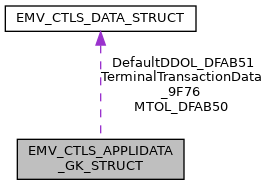

\[<a href="graph_legend.md">legend</a>\]

| Data Fields |  |  |
|----|----|----|
| unsigned char | AcquirerIdentifier_9F01\[6\] | TempUpdate allowed: NO Description: Uniquely identifies the acquirer within each payment system. Availability bit: <a href="group___d_e_f___i_n_p_u_t___a_p_p_l_i___g_k.md#gacb7264a9234602cf34b3dfc247dacde1">INPUT_CTLS_APL_GK_9F01_1</a> TLV tag: <a href="group___e_m_v_c_o___t_a_g_s.md#gaab4cf8e32535962270e6219bcbc08194">TAG_9F01_ACQ_ID</a> XML Tag: <a href="group___a_d_k___x_m_l___t_a_g_s.md#ga0b9b71f4b415c702c66dbe52b58e1d9a">XML_TAG_AD_GK_9F01_ACQUIRER_ID</a>. |
| unsigned char | AdditionalTerminalCapabilities_9F40\[5\] | TempUpdate allowed: YES Description: \"additional terminal capabilities\" for this application, only 1st byte is effective Availability bit: <a href="group___d_e_f___i_n_p_u_t___a_p_p_l_i___g_k.md#gadcfd0e057f8f9fc597e86451afb80181">INPUT_CTLS_APL_GK_9F40_0</a> TLV tag: <a href="group___e_m_v_c_o___t_a_g_s.md#ga5670c7d223a0af749d5b8b251e32f870">TAG_9F40_ADD_TRM_CAP</a>, XML Tag: <a href="group___a_d_k___x_m_l___t_a_g_s.md#gad16948bf4d61ee6d8737ac8e67060ec3">XML_TAG_AD_GK_9F40_ADD_TERM_CAPS</a>. |
| unsigned char | AppFlowCap_DFAB31\[5\] | TempUpdate allowed: YES Description: Configure special application characteristics, see <a href="group___d_e_f___f_l_o_w___g_k.md">Gemalto/Pure: Application flow capabilities</a> Availability bit: <a href="group___d_e_f___i_n_p_u_t___a_p_p_l_i___g_k.md#ga4d7058dc36b1987c3d5be89b15933004">INPUT_CTLS_APL_GK_DFAB31_1</a> TLV tag: <a href="group___t_a_g_s___n_e_w___c_f_g___i_n_t_f___p_r_i_m.md#gaf35f7d22b485b509c980566dba2eea1a">TAG_DFAB31_APP_FLOW_CAP</a>, XML Tag: <a href="group___a_d_k___x_m_l___t_a_g_s.md#ga9025b678cb552e7cdb9133c6fbc60aff">XML_TAG_AD_GK_DFAB31_APP_FLOW_CAP</a>. |
| unsigned char | AppliAuthTransType_DFAB5A | TempUpdate allowed: NO Description: Transaction Type used for Application Authentication Transaction Default: <a href="group___c_l_t_r_x___s_c_h_e_m_e___t_r_x___t_y_p_e_s.md#ga6d08c321aeb6c47f6a671cebd429dc60">EMV_CTLS_TRAN_TYPE_PURE_AUTHENTICATE</a> Availability bit: <a href="group___d_e_f___i_n_p_u_t___a_p_p_l_i___g_k.md#ga1d2246a5d6f16415b14c7c93ac06e280">INPUT_CTLS_APL_GK_DFAB5A_2</a>, TLV tag: <a href="group___t_a_g_s___n_e_w___c_f_g___i_n_t_f___p_r_i_m.md#ga244302289feb32ded58d5f1e232b41af">TAG_DFAB5A_PURE_APPLI_AUTH_TRX_TYPE</a>, XML Tag: <a href="group___a_d_k___x_m_l___t_a_g_s.md#ga90254669672c94baecb8b6d6c57ed1e8">XML_TAG_AD_GK_DFAB5A_APPLI_AUTH_TRX_TYPE</a>. |
| unsigned char | ContactlessCVMRequiredLimit_DFAB42\[6\] | TempUpdate allowed: NO Description: Reader Contactless CVM Required Limit (n12) Use \'9999999999\' to disable. Availability bit: <a href="group___d_e_f___i_n_p_u_t___a_p_p_l_i___g_k.md#ga6f11d39e7f8f1c262f4026c3a30f9a28">INPUT_CTLS_APL_GK_DFAB42_1</a> TLV tag: <a href="group___t_a_g_s___n_e_w___c_f_g___i_n_t_f___p_r_i_m.md#gaf8082e86422522353c6f242f63f71b46">TAG_DFAB42_CTLS_CVM_REQ_LIMIT</a>, XML Tag: <a href="group___a_d_k___x_m_l___t_a_g_s.md#ga7d6b4f17a1904736399baf34f94e6749">XML_TAG_AD_GK_DFAB42_CTLS_CVM_REQ_LIMIT</a>. |
| unsigned char | ContactlessFloorLimit_DFAB40\[6\] | TempUpdate allowed: NO Description: Reader Contactless Floor Limit (n12) Use \'999999999999\' to disable Availability bit: <a href="group___d_e_f___i_n_p_u_t___a_p_p_l_i___g_k.md#gaf8ce9d4f2e894b4ab2e8854446d50434">INPUT_CTLS_APL_GK_DFAB40_1</a> TLV tag: <a href="group___t_a_g_s___n_e_w___c_f_g___i_n_t_f___p_r_i_m.md#ga4fbadad5ae4dad262274c4c74dc6deb2">TAG_DFAB40_CTLS_FLOOR_LIMIT</a>, XML Tag: <a href="group___a_d_k___x_m_l___t_a_g_s.md#gad5a142e306c40a81cb5f5986069c4bfc">XML_TAG_AD_GK_DFAB40_CTLS_FLOOR_LIMIT</a>. |
| unsigned char | ContactlessTransactionLimit_DFAB41\[6\] | TempUpdate allowed: NO Description: Reader Contactless Transaction Limit (n12) Use \'9999999999\' to disable. Availability bit: <a href="group___d_e_f___i_n_p_u_t___a_p_p_l_i___g_k.md#ga8014a49936544d5218b2c88c317686ae">INPUT_CTLS_APL_GK_DFAB41_1</a> TLV tag: <a href="group___t_a_g_s___n_e_w___c_f_g___i_n_t_f___p_r_i_m.md#gac0ad8ae2d5bd130f089f010278a99b4e">TAG_DFAB41_CTLS_TRX_LIMIT</a>, XML Tag: <a href="group___a_d_k___x_m_l___t_a_g_s.md#ga7ea0e83ecff59bbd009d331cc31c0647">XML_TAG_AD_GK_DFAB41_CTLS_TRX_LIMIT</a>. |
| unsigned char | CtlsAppKernelCap_DFAB4F\[5\] | TempUpdate allowed: YES Description: Contactless Application/Kernel Capabilities (Gemalto PURE tag \'C8\', DTTPI) Availability bit: <a href="group___d_e_f___i_n_p_u_t___a_p_p_l_i___g_k.md#gadb34be38fb31ac0f31dfeccd7b632cc6">INPUT_CTLS_APL_GK_DFAB4F_2</a> TLV tag: <a href="group___t_a_g_s___n_e_w___c_f_g___i_n_t_f___p_r_i_m.md#gabd7f05113879dd0978d4a67080016d9e">TAG_DFAB4F_PURE_CTLS_APP_KERN_CAP</a>, XML Tag: <a href="group___a_d_k___x_m_l___t_a_g_s.md#ga863baf8eb302dd159c5f629d7401411a">XML_TAG_AD_GK_DFAB4F_CTLS_APP_KERN_CAP</a>. |
| <a href="_e_m_v___c_t_l_s___interface_8h.md#a72d9f02bd046a1c2bf3590be2bca6a26">EMV_CTLS_DATA_TYPE</a> | DefaultDDOL_DFAB51 | TempUpdate allowed: NO Description: Default Dynamic Data Authentication Data Object List (Default DDOL) Availability bit: <a href="group___d_e_f___i_n_p_u_t___a_p_p_l_i___g_k.md#ga96944292917d7f52e62fb45ae1e4c6e8">INPUT_CTLS_APL_GK_DFAB51_2</a> TLV tag: <a href="group___t_a_g_s___n_e_w___c_f_g___i_n_t_f___p_r_i_m.md#gaaee6cefc61301ecd90247b1a26496c0f">TAG_DFAB51_CTLS_DEFAULT_DDOL</a>, XML Tag: <a href="group___a_d_k___x_m_l___t_a_g_s.md#gaa4c13f6009eb173848f2eed3c6da7ed6">XML_TAG_AD_GK_DFAB51_DEFAULT_DDOL</a>. |
| unsigned char | IncludedData\[8\] | Availability bits, see <a href="group___d_e_f___i_n_p_u_t___a_p_p_l_i___g_k.md">Appli data scheme specific - Gemalto Pure - Availability bits</a>. |
| unsigned char | MerchantCategoryCode_9F15\[2\] | TempUpdate allowed: NO Description: Merchant category code mandatory for <a href="group___f_u_n_c___c_o_n_f.md#gadc7f2eba5fd3e941d0ddb65a936a0776">EMV_CTLS_SetAppliDataSchemeSpecific</a> Availability bit: <a href="group___d_e_f___i_n_p_u_t___a_p_p_l_i___g_k.md#ga40c16d02d93b05c6a660dc74057fd377">INPUT_CTLS_APL_GK_9F15_0</a> TLV tag: <a href="group___e_m_v_c_o___t_a_g_s.md#ga41481cf04242a0ba441c87f6a1569639">TAG_9F15_MERCH_CATEG_CODE</a>, XML Tag: <a href="group___a_d_k___x_m_l___t_a_g_s.md#ga5369c41b68e46cc19c325115912bac32">XML_TAG_AD_GK_9F15_MERCHANT_CATEGORY_CODE</a>. |
| char | MerchantIdentifier_9F16\[15+1\] | TempUpdate allowed: NO Description: Merchant Identifier mandatory for <a href="group___f_u_n_c___c_o_n_f.md#gadc7f2eba5fd3e941d0ddb65a936a0776">EMV_CTLS_SetAppliDataSchemeSpecific</a> Availability bit: <a href="group___d_e_f___i_n_p_u_t___a_p_p_l_i___g_k.md#gaafeb4cea8897386c8afbb45a1260017f">INPUT_CTLS_APL_GK_9F16_0</a> TLV tag: <a href="group___e_m_v_c_o___t_a_g_s.md#ga184ccaaef50ada9988bfd4af37b8c9fb">TAG_9F16_MERCHANT_ID</a>, XML Tag: <a href="group___a_d_k___x_m_l___t_a_g_s.md#gac1bb144adc2653138a5d221d89f0f139">XML_TAG_AD_GK_9F16_MERCHANT_ID</a>. |
| char | MerchantNameAndLocation_9F4E\[40+1\] | TempUpdate allowed: NO Description: Indicates the name and location of the merchant. Availability bit: <a href="group___d_e_f___i_n_p_u_t___a_p_p_l_i___g_k.md#ga6ef97fa45e0b9c6c2969e7900c17f847">INPUT_CTLS_APL_GK_9F4E_1</a> TLV tag: <a href="group___e_m_v_c_o___t_a_g_s.md#gac3a7de1661225ab41a4529b68d1fda71">TAG_9F4E_TAC_MERCHANTLOC</a>, XML Tag: <a href="group___a_d_k___x_m_l___t_a_g_s.md#gaa34740f14411558198e76e629f70126e">XML_TAG_AD_GK_9F4E_MERCHANT_NAME_LOCATION</a>. |
| <a href="_e_m_v___c_t_l_s___interface_8h.md#a72d9f02bd046a1c2bf3590be2bca6a26">EMV_CTLS_DATA_TYPE</a> | MTOL_DFAB50 | TempUpdate allowed: NO Description: Mandatory Tag Object List (MTOL) Availability bit: <a href="group___d_e_f___i_n_p_u_t___a_p_p_l_i___g_k.md#ga2c93a85f18668da6c1d7382a1b53445e">INPUT_CTLS_APL_GK_DFAB50_2</a> TLV tag: <a href="group___t_a_g_s___n_e_w___c_f_g___i_n_t_f___p_r_i_m.md#ga8d850ebb1abbb370cbdf60477d618496">TAG_DFAB50_PURE_MTOL</a>, XML Tag: <a href="group___a_d_k___x_m_l___t_a_g_s.md#ga92ffbadf7b761e40d950431f58f4794b">XML_TAG_AD_GK_DFAB50_MTOL</a>. |
| unsigned char | TACDefault_DFAB43\[5\] | TempUpdate allowed: YES Description: Terminal Action Code - Default mandatory for <a href="group___f_u_n_c___c_o_n_f.md#gadc7f2eba5fd3e941d0ddb65a936a0776">EMV_CTLS_SetAppliDataSchemeSpecific</a> Availability bit: <a href="group___d_e_f___i_n_p_u_t___a_p_p_l_i___g_k.md#gaf8b8e2bbe1a90763b98093ea5870ce8d">INPUT_CTLS_APL_GK_DFAB43_1</a> TLV tag: <a href="group___t_a_g_s___n_e_w___c_f_g___i_n_t_f___p_r_i_m.md#ga885632db95d4e5e768eb59582123ab4c">TAG_DFAB43_TAC_DEFAULT</a>, XML Tag: <a href="group___a_d_k___x_m_l___t_a_g_s.md#ga29c4978ee625a1f641cfaeaf9823b64f">XML_TAG_AD_GK_DFAB43_TAC_DEFAULT</a>. |
| unsigned char | TACDenial_DFAB44\[5\] | TempUpdate allowed: YES Description: Terminal Action Code - Denial mandatory for <a href="group___f_u_n_c___c_o_n_f.md#gadc7f2eba5fd3e941d0ddb65a936a0776">EMV_CTLS_SetAppliDataSchemeSpecific</a> Availability bit: <a href="group___d_e_f___i_n_p_u_t___a_p_p_l_i___g_k.md#gada38d4354c3426e1cfc9069d79ac38d1">INPUT_CTLS_APL_GK_DFAB44_1</a> TLV tag: <a href="group___t_a_g_s___n_e_w___c_f_g___i_n_t_f___p_r_i_m.md#ga6c4ffbdb026c264681d2c8da01607e9f">TAG_DFAB44_TAC_DENIAL</a>, XML Tag: <a href="group___a_d_k___x_m_l___t_a_g_s.md#ga2a31d620fb4e9707de90298ea3a4124e">XML_TAG_AD_GK_DFAB44_TAC_DENIAL</a>. |
| unsigned char | TACOnline_DFAB45\[5\] | TempUpdate allowed: YES Description: Terminal Action Code - Online mandatory for <a href="group___f_u_n_c___c_o_n_f.md#gadc7f2eba5fd3e941d0ddb65a936a0776">EMV_CTLS_SetAppliDataSchemeSpecific</a> Availability bit: <a href="group___d_e_f___i_n_p_u_t___a_p_p_l_i___g_k.md#ga30b6d7dc1ce39bcb957567a010ff10ec">INPUT_CTLS_APL_GK_DFAB45_2</a> TLV tag: <a href="group___t_a_g_s___n_e_w___c_f_g___i_n_t_f___p_r_i_m.md#ga53c8a7f59827691e78e3a9d452da187a">TAG_DFAB45_TAC_ONLINE</a>, XML Tag: <a href="group___a_d_k___x_m_l___t_a_g_s.md#ga63c5be8d24f0d963a67883d76c265083">XML_TAG_AD_GK_DFAB45_TAC_ONLINE</a>. |
| unsigned char | TermIdent_9F1C\[8\] | TempUpdate allowed: YES Description: Terminal Identification mandatory for <a href="group___f_u_n_c___c_o_n_f.md#gadc7f2eba5fd3e941d0ddb65a936a0776">EMV_CTLS_SetAppliDataSchemeSpecific</a> Availability bit: <a href="group___d_e_f___i_n_p_u_t___a_p_p_l_i___g_k.md#ga5973aa7f057ad911d2dbffa69e0dd57e">INPUT_CTLS_APL_GK_9F1C_0</a> TLV tag: <a href="group___e_m_v_c_o___t_a_g_s.md#ga64f401e453e74b4ff1f727aa7cc449ac">TAG_9F1C_TRM_ID</a>, XML Tag: <a href="group___a_d_k___x_m_l___t_a_g_s.md#ga71a899a0eccb54155e8930c0e26de482">XML_TAG_AD_GK_9F1C_TERM_IDENT</a>. |
| unsigned char | TerminalCapabilities_9F33\[3\] | TempUpdate allowed: YES Description: \"terminal capabilities\" for this application, for PayPass 3 the tags DF81xx, DF81yy, DF81zz are filled with these 3 byte, for VISA this is used for host compliancy only, for Amex in accordance with tag 9F6E, Availability bit: <a href="group___d_e_f___i_n_p_u_t___a_p_p_l_i___g_k.md#gaac433e8f42c2862bf9bfd67a901aaf20">INPUT_CTLS_APL_GK_9F33_0</a> TLV tag: <a href="group___e_m_v_c_o___t_a_g_s.md#gad3ec876483505eb23aad4e1b210653f5">TAG_9F33_TRM_CAPABILITIES</a>, XML Tag: <a href="group___a_d_k___x_m_l___t_a_g_s.md#gac0a046c21b3863037c7cbf760750d386">XML_TAG_AD_GK_9F33_TERM_CAPS</a>. |
| unsigned char | TerminalCountryCode_9F1A\[2\] | TempUpdate allowed: YES Description: \"Terminal country code\" (e.g. VISA Germany 0276) Availability bit: <a href="group___d_e_f___i_n_p_u_t___a_p_p_l_i___g_k.md#gab756d677687c9a10412f21ed677feba6">INPUT_CTLS_APL_GK_9F1A_0</a> TLV tag: <a href="group___e_m_v_c_o___t_a_g_s.md#ga5bc987c3686fd5821f20d21015354787">TAG_9F1A_TRM_COUNTRY_CODE</a>, XML Tag: <a href="group___a_d_k___x_m_l___t_a_g_s.md#ga1d0a518868fe204d9d921b3941d7c3cf">XML_TAG_AD_GK_9F1A_TERM_COUNTRY_CODE</a>. |
| <a href="_e_m_v___c_t_l_s___interface_8h.md#a72d9f02bd046a1c2bf3590be2bca6a26">EMV_CTLS_DATA_TYPE</a> | TerminalTransactionData_9F76 | TempUpdate allowed: NO Description: Terminal transaction data Availability bit: <a href="group___d_e_f___i_n_p_u_t___a_p_p_l_i___g_k.md#gae4fbb45c8966f99969c725440d27b1a8">INPUT_CTLS_APL_GK_9F76_2</a> TLV tag: <a href="group___g_e_m_a_l_t_o___t_a_g_s.md#ga2481f5687b7d5ecaef77e9b9bdca2155">TAG_9F76_PURE_TERM_TRX_DATA</a>, XML Tag: <a href="group___a_d_k___x_m_l___t_a_g_s.md#ga06cd7b3424986d36028e8081fd84c2d8">XML_TAG_AD_GK_9F76_TERMINAL_TRX_DATA</a>. |
| unsigned char | TerminalType_9F35 | TempUpdate allowed: YES Description: Terminal type, possible values see <a href="group___t_e_r_m___t_y_p_e_s.md">Terminaltypes (Tag 9F35)</a>) mandatory for first call of <a href="group___f_u_n_c___c_o_n_f.md#gac5ce9781bba083028538f9e77c2d58f3">EMV_CTLS_SetTermData()</a> Availability bit: <a href="group___d_e_f___i_n_p_u_t___a_p_p_l_i___g_k.md#ga3ab4adf3338d340a1f53e87760d446d9">INPUT_CTLS_APL_GK_9F35_0</a> TLV tag: <a href="group___e_m_v_c_o___t_a_g_s.md#gace5b4ef50a58d29b2f5296c2c17273c9">TAG_9F35_TRM_TYPE</a>, XML Tag: <a href="group___a_d_k___x_m_l___t_a_g_s.md#gac89361521e63e70348b050c462665100">XML_TAG_AD_GK_9F35_TERM_TYPE</a>. |
| unsigned char | VersionNumber_9F09\[2 \*<a href="_e_m_v___c_t_l_s___interface_8h.md#a01aefcde9b880f166817e82c8f2eac99">EMV_CTLS_MAX_APP_VERS</a>\] | TempUpdate allowed: NO Description: Application chip version number mandatory for <a href="group___f_u_n_c___c_o_n_f.md#gadc7f2eba5fd3e941d0ddb65a936a0776">EMV_CTLS_SetAppliDataSchemeSpecific</a> Availability bit: <a href="group___d_e_f___i_n_p_u_t___a_p_p_l_i___g_k.md#ga9e649943d5e397de2d2433aeb6e23c7f">INPUT_CTLS_APL_GK_9F09_0</a> TLV tag: <a href="group___e_m_v_c_o___t_a_g_s.md#gac0fb6f2c9da5e835754d94e7edf4f7c2">TAG_9F09_TRM_APP_VERSION_NB</a>, XML Tag: <a href="group___a_d_k___x_m_l___t_a_g_s.md#ga9f90e9ea9f6360fd0208a4dfbeba683b">XML_TAG_AD_GK_9F09_VERSION_NUMBER</a>. |

## EMV_CTLS_APPLIDATA_RK_STRUCT 

struct EMV_CTLS_APPLIDATA_RK_STRUCT

Structure for configuration of one single application, RK specific part. See <a href="group___f_u_n_c___c_o_n_f.md#gadc7f2eba5fd3e941d0ddb65a936a0776">EMV_CTLS_SetAppliDataSchemeSpecific()</a>

| Data Fields |  |  |
|----|----|----|
| unsigned char | AdditionalTerminalCapabilities_9F40\[5\] | TempUpdate allowed: YES Description: \"additional terminal capabilities\" for this application, only 1st byte is effective Availability bit: <a href="group___d_e_f___i_n_p_u_t___a_p_p_l_i___r_k.md#ga2a9faf9ee3d73508f46a06ae7e39d6d6">INPUT_CTLS_APL_RK_9F40_0</a> TLV tag: <a href="group___e_m_v_c_o___t_a_g_s.md#ga5670c7d223a0af749d5b8b251e32f870">TAG_9F40_ADD_TRM_CAP</a>, XML Tag: <a href="group___a_d_k___x_m_l___t_a_g_s.md#ga2f80312f8aee9fccf8e19265c10ca539">XML_TAG_AD_RK_9F40_ADD_TERM_CAPS</a>. |
| unsigned char | AdditionalTerminalCapabilitiesExt_DF3A\[5\] | TempUpdate allowed: YES Description: Additional Terminal Capabilities Extension Availability bit: <a href="group___d_e_f___i_n_p_u_t___a_p_p_l_i___r_k.md#ga32ce0190fdf03426d063e9a17258fb0d">INPUT_CTLS_APL_RK_DF3A_2</a> TLV tag: <a href="group___v_e_r_i___p_r_i_m___t_a_g_s.md#ga9c54250ab313a2fa165a42e89fa51945">TAG_DF3A_ADD_TRM_CAP_EXT</a>, XML Tag: <a href="group___a_d_k___x_m_l___t_a_g_s.md#ga2f80312f8aee9fccf8e19265c10ca539">XML_TAG_AD_RK_9F40_ADD_TERM_CAPS</a>. |
| unsigned char | AppFlowCap_DFAB31\[5\] | TempUpdate allowed: YES Description: Configure special application characteristics, see <a href="group___d_e_f___f_l_o_w___r_k.md">Application flow capabilities for RuPay</a> Availability bit: <a href="group___d_e_f___i_n_p_u_t___a_p_p_l_i___r_k.md#gac134ff7ab3d7b23c31c9c6fca759676f">INPUT_CTLS_APL_RK_DFAB31_0</a> TLV tag: <a href="group___t_a_g_s___n_e_w___c_f_g___i_n_t_f___p_r_i_m.md#gaf35f7d22b485b509c980566dba2eea1a">TAG_DFAB31_APP_FLOW_CAP</a>, XML Tag: <a href="group___a_d_k___x_m_l___t_a_g_s.md#ga9178725a98ac9074056ed23575774f8c">XML_TAG_AD_RK_DFAB31_APP_FLOW_CAP</a>. |
| unsigned char | CallbackTimeout_DFAB4D\[2\] | TempUpdate allowed: NO Description: Callback Timeout (VFI Reader 1F76) Availability bit: <a href="group___d_e_f___i_n_p_u_t___a_p_p_l_i___r_k.md#ga8a0a715b438f14becfbd58898f16c139">INPUT_CTLS_APL_RK_DFAB4D_2</a> TLV tag: <a href="group___t_a_g_s___n_e_w___c_f_g___i_n_t_f___p_r_i_m.md#ga8c003bdaed26f44ad570217a763680cd">TAG_DFAB4D_RUPAY_CALLBACK_TIMEOUT</a> XML Tag: <a href="group___a_d_k___x_m_l___t_a_g_s.md#gafb5952319a54de26fad4c98dd02d89fc">XML_TAG_AD_RK_DFAB4D_CALLBACK_TIMEOUT</a>. |
| unsigned char | ContactlessCVMRequiredLimit_DFAB42\[6\] | TempUpdate allowed: NO Description: Reader Contactless CVM Required Limit (n12) Use \'9999999999\' to disable. Availability bit: <a href="group___d_e_f___i_n_p_u_t___a_p_p_l_i___r_k.md#ga00828cec984bdd23211c68f5fba5c701">INPUT_CTLS_APL_RK_DFAB42_1</a> TLV tag: <a href="group___t_a_g_s___n_e_w___c_f_g___i_n_t_f___p_r_i_m.md#gaf8082e86422522353c6f242f63f71b46">TAG_DFAB42_CTLS_CVM_REQ_LIMIT</a>, XML Tag: <a href="group___a_d_k___x_m_l___t_a_g_s.md#ga76930fffe2d21abf332b982311f998d7">XML_TAG_AD_RK_DFAB42_CTLS_CVM_REQ_LIMIT</a>. |
| unsigned char | ContactlessFloorLimit_DFAB40\[6\] | TempUpdate allowed: NO Description: Reader Contactless Floor Limit (n12) Use \'999999999999\' to disable Availability bit: <a href="group___d_e_f___i_n_p_u_t___a_p_p_l_i___r_k.md#gacb4d5f1f88c400438c1e9bddc38689db">INPUT_CTLS_APL_RK_DFAB40_1</a> TLV tag: <a href="group___t_a_g_s___n_e_w___c_f_g___i_n_t_f___p_r_i_m.md#ga4fbadad5ae4dad262274c4c74dc6deb2">TAG_DFAB40_CTLS_FLOOR_LIMIT</a>, XML Tag: <a href="group___a_d_k___x_m_l___t_a_g_s.md#ga426e907f5ea4b32a24c228d2893e0c8b">XML_TAG_AD_RK_DFAB40_CTLS_FLOOR_LIMIT</a>. |
| unsigned char | ContactlessTransactionLimit_DFAB41\[6\] | TempUpdate allowed: NO Description: Reader Contactless Transaction Limit (n12) Use \'9999999999\' to disable. Availability bit: <a href="group___d_e_f___i_n_p_u_t___a_p_p_l_i___r_k.md#gaeed1474e33069f573a3a9d8d0f402dd7">INPUT_CTLS_APL_RK_DFAB41_1</a> TLV tag: <a href="group___t_a_g_s___n_e_w___c_f_g___i_n_t_f___p_r_i_m.md#gac0ad8ae2d5bd130f089f010278a99b4e">TAG_DFAB41_CTLS_TRX_LIMIT</a>, XML Tag: <a href="group___a_d_k___x_m_l___t_a_g_s.md#ga30b70c64049c5e3acd724d57c5f4fded">XML_TAG_AD_RK_DFAB41_CTLS_TRX_LIMIT</a>. |
| unsigned char | IncludedData\[8\] | Availability bits, see <a href="group___d_e_f___i_n_p_u_t___a_p_p_l_i___r_k.md">Appli data scheme specific - RuPay - Availability bits</a>. |
| unsigned char | MerchantCategoryCode_9F15\[2\] | TempUpdate allowed: NO Description: Merchant category code mandatory for <a href="group___f_u_n_c___c_o_n_f.md#gadc7f2eba5fd3e941d0ddb65a936a0776">EMV_CTLS_SetAppliDataSchemeSpecific</a> Availability bit: <a href="group___d_e_f___i_n_p_u_t___a_p_p_l_i___r_k.md#gaa9828199ca8b17ed4aeb8da917811d09">INPUT_CTLS_APL_RK_9F15_0</a> TLV tag: <a href="group___e_m_v_c_o___t_a_g_s.md#ga41481cf04242a0ba441c87f6a1569639">TAG_9F15_MERCH_CATEG_CODE</a>, XML Tag: <a href="group___a_d_k___x_m_l___t_a_g_s.md#gab20d73b6497cd64bf2519e2722ad0105">XML_TAG_AD_RK_9F15_MERCHANT_CATEGORY_CODE</a>. |
| unsigned char | RiskManagementMaximumTargetPercentage_DFAB48 | TempUpdate allowed: YES Description: Maximum target percentage for random online selection during risk management (n2) Availability bit: <a href="group___d_e_f___i_n_p_u_t___a_p_p_l_i___r_k.md#gac79930495eb4082bc38b4dfa0f21ec9b">INPUT_CTLS_APL_RK_DFAB48_2</a> TLV tag: <a href="group___t_a_g_s___n_e_w___c_f_g___i_n_t_f___p_r_i_m.md#gad755eca2cea7087042166526654c7291">TAG_DFAB48_RISK_MGMT_MAX_TRGT_PRCT</a> XML Tag: <a href="group___a_d_k___x_m_l___t_a_g_s.md#ga5f3ec698e668ad3b0d6df80d831ce946">XML_TAG_AD_RK_DFAB48_RISK_MGMT_MAX_TRGT_PERC</a>. |
| unsigned char | RiskManagementTargetPercentage_DFAB47 | TempUpdate allowed: YES Description: Target percentage for random online selection during risk management (n2) Availability bit: <a href="group___d_e_f___i_n_p_u_t___a_p_p_l_i___r_k.md#ga6f74916ed3336503f80ae8f1f937ea03">INPUT_CTLS_APL_RK_DFAB47_1</a> TLV tag: <a href="group___t_a_g_s___n_e_w___c_f_g___i_n_t_f___p_r_i_m.md#ga4795ddca7a863da46b56a3a34d3b9c39">TAG_DFAB47_RISK_MGMT_TRGT_PRCT</a> XML Tag: <a href="group___a_d_k___x_m_l___t_a_g_s.md#ga6bf3fa9d70bdbe4a07bf6f9c57123897">XML_TAG_AD_RK_DFAB47_RISK_MGMT_TRGT_PERC</a>. |
| unsigned char | RiskManagementThreshold_DFAB46\[6\] | TempUpdate allowed: YES Description: Threshold Value for Biased Random Online Selection during risk management (n12) Availability bit: <a href="group___d_e_f___i_n_p_u_t___a_p_p_l_i___r_k.md#gafa8f8b6220b8fbf1aa406a2e3367c5dc">INPUT_CTLS_APL_RK_DFAB46_1</a> TLV tag: <a href="group___t_a_g_s___n_e_w___c_f_g___i_n_t_f___p_r_i_m.md#ga03c938e159dbea0a48e833d5205f2529">TAG_DFAB46_RISK_MGMT_THRESHOLD</a> XML Tag: <a href="group___a_d_k___x_m_l___t_a_g_s.md#ga9575d0193a811ccf006c807aeaacefc7">XML_TAG_AD_RK_DFAB46_RISK_MGMT_THRESHOLD</a>. |
| unsigned char | TACDefault_DFAB43\[5\] | TempUpdate allowed: YES Description: Terminal Action Code - Default mandatory for <a href="group___f_u_n_c___c_o_n_f.md#gadc7f2eba5fd3e941d0ddb65a936a0776">EMV_CTLS_SetAppliDataSchemeSpecific</a> Availability bit: <a href="group___d_e_f___i_n_p_u_t___a_p_p_l_i___r_k.md#ga3c5b88de38eea789fb75c237344bfcfb">INPUT_CTLS_APL_RK_DFAB43_1</a> TLV tag: <a href="group___t_a_g_s___n_e_w___c_f_g___i_n_t_f___p_r_i_m.md#ga885632db95d4e5e768eb59582123ab4c">TAG_DFAB43_TAC_DEFAULT</a>, XML Tag: <a href="group___a_d_k___x_m_l___t_a_g_s.md#ga78b11b0a33ce31c38c91bc38f3915dfe">XML_TAG_AD_RK_DFAB43_TAC_DEFAULT</a>. |
| unsigned char | TACDenial_DFAB44\[5\] | TempUpdate allowed: YES Description: Terminal Action Code - Denial mandatory for <a href="group___f_u_n_c___c_o_n_f.md#gadc7f2eba5fd3e941d0ddb65a936a0776">EMV_CTLS_SetAppliDataSchemeSpecific</a> Availability bit: <a href="group___d_e_f___i_n_p_u_t___a_p_p_l_i___r_k.md#gab15fe45e47bd45dd5fcf553f12ada11f">INPUT_CTLS_APL_RK_DFAB44_1</a> TLV tag: <a href="group___t_a_g_s___n_e_w___c_f_g___i_n_t_f___p_r_i_m.md#ga6c4ffbdb026c264681d2c8da01607e9f">TAG_DFAB44_TAC_DENIAL</a>, XML Tag: <a href="group___a_d_k___x_m_l___t_a_g_s.md#gac3e0ed0f97337d240b64282e11c3c229">XML_TAG_AD_RK_DFAB44_TAC_DENIAL</a>. |
| unsigned char | TACOnline_DFAB45\[5\] | TempUpdate allowed: YES Description: Terminal Action Code - Online mandatory for <a href="group___f_u_n_c___c_o_n_f.md#gadc7f2eba5fd3e941d0ddb65a936a0776">EMV_CTLS_SetAppliDataSchemeSpecific</a> Availability bit: <a href="group___d_e_f___i_n_p_u_t___a_p_p_l_i___r_k.md#gacf467397062f1058fa5b2f8a4afef5b2">INPUT_CTLS_APL_RK_DFAB45_1</a> TLV tag: <a href="group___t_a_g_s___n_e_w___c_f_g___i_n_t_f___p_r_i_m.md#ga53c8a7f59827691e78e3a9d452da187a">TAG_DFAB45_TAC_ONLINE</a>, XML Tag: <a href="group___a_d_k___x_m_l___t_a_g_s.md#gae06a2076329f552598a8e87fff201ff9">XML_TAG_AD_RK_DFAB45_TAC_ONLINE</a>. |
| unsigned char | TermIdent_9F1C\[8\] | TempUpdate allowed: YES Description: Terminal Identification mandatory for <a href="group___f_u_n_c___c_o_n_f.md#gadc7f2eba5fd3e941d0ddb65a936a0776">EMV_CTLS_SetAppliDataSchemeSpecific</a> Availability bit: <a href="group___d_e_f___i_n_p_u_t___a_p_p_l_i___r_k.md#ga652797dcb9f0ee665fc96ed4eecd99be">INPUT_CTLS_APL_RK_9F1C_0</a> TLV tag: <a href="group___e_m_v_c_o___t_a_g_s.md#ga64f401e453e74b4ff1f727aa7cc449ac">TAG_9F1C_TRM_ID</a>, XML Tag: <a href="group___a_d_k___x_m_l___t_a_g_s.md#ga17cdff6c87c85c3759258472a5f6557b">XML_TAG_AD_RK_9F1C_TERM_IDENT</a>. |
| unsigned char | TerminalCapabilities_9F33\[3\] | TempUpdate allowed: YES Description: \"terminal capabilities\" for this application Availability bit: <a href="group___d_e_f___i_n_p_u_t___a_p_p_l_i___r_k.md#ga3784fe65e8b99a4a0dd19b8ee6d8a130">INPUT_CTLS_APL_RK_9F33_0</a> TLV tag: <a href="group___e_m_v_c_o___t_a_g_s.md#gad3ec876483505eb23aad4e1b210653f5">TAG_9F33_TRM_CAPABILITIES</a>, XML Tag: <a href="group___a_d_k___x_m_l___t_a_g_s.md#ga94603469b3e573ca698cadc97a1c2372">XML_TAG_AD_RK_9F33_TERM_CAPS</a>. |
| unsigned char | TerminalCountryCode_9F1A\[2\] | TempUpdate allowed: YES Description: \"Terminal country code\" (e.g. VISA Germany 0276) Availability bit: <a href="group___d_e_f___i_n_p_u_t___a_p_p_l_i___r_k.md#gab8212e5139f22b9fec0ce9c7ace5e2a7">INPUT_CTLS_APL_RK_9F1A_0</a> TLV tag: <a href="group___e_m_v_c_o___t_a_g_s.md#ga5bc987c3686fd5821f20d21015354787">TAG_9F1A_TRM_COUNTRY_CODE</a>, XML Tag: <a href="group___a_d_k___x_m_l___t_a_g_s.md#ga95f86e65eb334dea43577a0a21b745ab">XML_TAG_AD_RK_9F1A_TERM_COUNTRY_CODE</a>. |
| unsigned char | TerminalType_9F35 | TempUpdate allowed: YES Description: Terminal type, possible values see <a href="group___t_e_r_m___t_y_p_e_s.md">Terminaltypes (Tag 9F35)</a>) mandatory for first call of <a href="group___f_u_n_c___c_o_n_f.md#gac5ce9781bba083028538f9e77c2d58f3">EMV_CTLS_SetTermData()</a> Availability bit: <a href="group___d_e_f___i_n_p_u_t___a_p_p_l_i___r_k.md#ga91a91002613aa9cb1ceca6ccdd9f0335">INPUT_CTLS_APL_RK_9F35_0</a> TLV tag: <a href="group___e_m_v_c_o___t_a_g_s.md#gace5b4ef50a58d29b2f5296c2c17273c9">TAG_9F35_TRM_TYPE</a>, XML Tag: <a href="group___a_d_k___x_m_l___t_a_g_s.md#gae07b4f85c06af6cff2a8beb242780caf">XML_TAG_AD_RK_9F35_TERM_TYPE</a>. |
| unsigned char | TornTransactionInterval_DFAB4E\[2\] | TempUpdate allowed: NO Description: Torn Transaction Interval (VFI Reader 1F77) Availability bit: <a href="group___d_e_f___i_n_p_u_t___a_p_p_l_i___r_k.md#ga69e9c2782644d71485d7acb9f3824faf">INPUT_CTLS_APL_RK_DFAB4E_2</a> TLV tag: <a href="group___t_a_g_s___n_e_w___c_f_g___i_n_t_f___p_r_i_m.md#gaa552982c326d11acd8cdb672c94447fc">TAG_DFAB4E_RUPAY_TORN_TRX_INTERVAL</a> XML Tag: <a href="group___a_d_k___x_m_l___t_a_g_s.md#gaec00500f8a30f8ad98ebf1e93802ac87">XML_TAG_AD_RK_DFAB4E_TORN_TRX_INTERVAL</a>. |
| unsigned char | VersionNumber_9F09\[2 \*<a href="_e_m_v___c_t_l_s___interface_8h.md#a01aefcde9b880f166817e82c8f2eac99">EMV_CTLS_MAX_APP_VERS</a>\] | TempUpdate allowed: NO Description: Application chip version number mandatory for <a href="group___f_u_n_c___c_o_n_f.md#gadc7f2eba5fd3e941d0ddb65a936a0776">EMV_CTLS_SetAppliDataSchemeSpecific</a> Availability bit: <a href="group___d_e_f___i_n_p_u_t___a_p_p_l_i___r_k.md#ga1d49938ad016676303ba2257068508c0">INPUT_CTLS_APL_RK_9F09_0</a> TLV tag: <a href="group___e_m_v_c_o___t_a_g_s.md#gac0fb6f2c9da5e835754d94e7edf4f7c2">TAG_9F09_TRM_APP_VERSION_NB</a>, XML Tag: <a href="group___a_d_k___x_m_l___t_a_g_s.md#ga66d7ee35bacdd6610fe29728b1dc90db">XML_TAG_AD_RK_9F09_VERSION_NUMBER</a>. |

## EMV_CTLS_APPLIDATA_SK_STRUCT 

struct EMV_CTLS_APPLIDATA_SK_STRUCT

Structure for configuration of one single application, SK specific part. See <a href="group___f_u_n_c___c_o_n_f.md#gadc7f2eba5fd3e941d0ddb65a936a0776">EMV_CTLS_SetAppliDataSchemeSpecific()</a>

| Data Fields |  |  |
|----|----|----|
| unsigned char | AdditionalTerminalCapabilities_9F40\[5\] | TempUpdate allowed: YES Description: \"additional terminal capabilities\" for this application, only 1st byte is effective Availability bit: <a href="group___d_e_f___i_n_p_u_t___a_p_p_l_i___s_k.md#ga0be7dfefb164694549f0178a5ec2e5be">INPUT_CTLS_APL_SK_9F40_0</a> TLV tag: <a href="group___e_m_v_c_o___t_a_g_s.md#ga5670c7d223a0af749d5b8b251e32f870">TAG_9F40_ADD_TRM_CAP</a>, XML Tag: <a href="group___a_d_k___x_m_l___t_a_g_s.md#gaaa829aa80d0949ae8cd7b7e0463c21d3">XML_TAG_AD_SK_9F40_ADD_TERM_CAPS</a>. |
| unsigned char | AppFlowCap_DFAB31\[5\] | TempUpdate allowed: YES Description: Configure special application characteristics, see <a href="group___d_e_f___f_l_o_w___s_k.md">Application flow capabilities for SIBS</a> Availability bit: <a href="group___d_e_f___i_n_p_u_t___a_p_p_l_i___s_k.md#ga1f6ab1b1867022d3a6a420ae66f05ff7">INPUT_CTLS_APL_SK_DFAB31_1</a> TLV tag: <a href="group___t_a_g_s___n_e_w___c_f_g___i_n_t_f___p_r_i_m.md#gaf35f7d22b485b509c980566dba2eea1a">TAG_DFAB31_APP_FLOW_CAP</a>, XML Tag: <a href="group___a_d_k___x_m_l___t_a_g_s.md#ga98169e369441c5310b07f6dfd0a7006f">XML_TAG_AD_SK_DFAB31_APP_FLOW_CAP</a>. |
| unsigned char | ContactlessCVMRequiredLimit_DFAB42\[6\] | TempUpdate allowed: NO Description: Reader Contactless CVM Required Limit (n12) Use \'9999999999\' to disable. Availability bit: <a href="group___d_e_f___i_n_p_u_t___a_p_p_l_i___s_k.md#ga2c41a18054aa0767888a1c6603c8994e">INPUT_CTLS_APL_SK_DFAB42_1</a> TLV tag: <a href="group___t_a_g_s___n_e_w___c_f_g___i_n_t_f___p_r_i_m.md#gaf8082e86422522353c6f242f63f71b46">TAG_DFAB42_CTLS_CVM_REQ_LIMIT</a>, XML Tag: <a href="group___a_d_k___x_m_l___t_a_g_s.md#ga7dd5519de47bf5dacc8a76a6d8063c95">XML_TAG_AD_SK_DFAB42_CTLS_CVM_REQ_LIMIT</a>. |
| unsigned char | ContactlessFloorLimit_DFAB40\[6\] | TempUpdate allowed: NO Description: Reader Contactless Floor Limit (n12) Use \'999999999999\' to disable Availability bit: <a href="group___d_e_f___i_n_p_u_t___a_p_p_l_i___s_k.md#gaba2c5ab74ebaa40f5f7e04d6c76e271d">INPUT_CTLS_APL_SK_DFAB40_1</a> TLV tag: <a href="group___t_a_g_s___n_e_w___c_f_g___i_n_t_f___p_r_i_m.md#ga4fbadad5ae4dad262274c4c74dc6deb2">TAG_DFAB40_CTLS_FLOOR_LIMIT</a>, XML Tag: <a href="group___a_d_k___x_m_l___t_a_g_s.md#ga50c2236cc245a61a3a6365f89d8d7a16">XML_TAG_AD_SK_DFAB40_CTLS_FLOOR_LIMIT</a>. |
| unsigned char | ContactlessTransactionLimit_DFAB41\[6\] | TempUpdate allowed: NO Description: Reader Contactless Transaction Limit (n12) Use \'9999999999\' to disable. Availability bit: <a href="group___d_e_f___i_n_p_u_t___a_p_p_l_i___s_k.md#gae49389ba1e903e3e302d61b84a780e22">INPUT_CTLS_APL_SK_DFAB41_1</a> TLV tag: <a href="group___t_a_g_s___n_e_w___c_f_g___i_n_t_f___p_r_i_m.md#gac0ad8ae2d5bd130f089f010278a99b4e">TAG_DFAB41_CTLS_TRX_LIMIT</a>, XML Tag: <a href="group___a_d_k___x_m_l___t_a_g_s.md#ga94dd140ae4e3f51c0db06dbdff6eec2b">XML_TAG_AD_SK_DFAB41_CTLS_TRX_LIMIT</a>. |
| unsigned char | IncludedData\[8\] | Availability bits, see <a href="group___d_e_f___i_n_p_u_t___a_p_p_l_i___s_k.md">Appli data scheme specific - SIBS - Avaiability bits</a>. |
| unsigned char | MerchantCategoryCode_9F15\[2\] | TempUpdate allowed: NO Description: Merchant category code mandatory for <a href="group___f_u_n_c___c_o_n_f.md#gadc7f2eba5fd3e941d0ddb65a936a0776">EMV_CTLS_SetAppliDataSchemeSpecific</a> Availability bit: <a href="group___d_e_f___i_n_p_u_t___a_p_p_l_i___s_k.md#gac8669d8b87ca43a66c8cf7d6650761b1">INPUT_CTLS_APL_SK_9F15_0</a> TLV tag: <a href="group___e_m_v_c_o___t_a_g_s.md#ga41481cf04242a0ba441c87f6a1569639">TAG_9F15_MERCH_CATEG_CODE</a>, XML Tag: <a href="group___a_d_k___x_m_l___t_a_g_s.md#gac7073443ff4375d652c4f7a8af790f0e">XML_TAG_AD_SK_9F15_MERCHANT_CATEGORY_CODE</a>. |
| char | MerchantNameAndLocation_9F4E\[40+1\] | TempUpdate allowed: NO Description: Indicates the name and location of the merchant Availability bit: <a href="group___d_e_f___i_n_p_u_t___a_p_p_l_i___s_k.md#gaa8700ddc4179b72816a75903b732b870">INPUT_CTLS_APL_SK_9F4E_0</a> TLV tag: <a href="group___e_m_v_c_o___t_a_g_s.md#gac3a7de1661225ab41a4529b68d1fda71">TAG_9F4E_TAC_MERCHANTLOC</a>, XML Tag: <a href="group___a_d_k___x_m_l___t_a_g_s.md#gac73acb01a9ce3196f11c940d01d1b82e">XML_TAG_AD_SK_9F4E_MERCHANT_NAME_LOCATION</a>. |
| unsigned char | TACDefault_DFAB43\[5\] | TempUpdate allowed: YES Description: Terminal Action Code - Default mandatory for <a href="group___f_u_n_c___c_o_n_f.md#gadc7f2eba5fd3e941d0ddb65a936a0776">EMV_CTLS_SetAppliDataSchemeSpecific</a> Availability bit: <a href="group___d_e_f___i_n_p_u_t___a_p_p_l_i___s_k.md#ga1632165832dfcf34d75642f1ca9f81d0">INPUT_CTLS_APL_SK_DFAB43_1</a> TLV tag: <a href="group___t_a_g_s___n_e_w___c_f_g___i_n_t_f___p_r_i_m.md#ga885632db95d4e5e768eb59582123ab4c">TAG_DFAB43_TAC_DEFAULT</a>, XML Tag: <a href="group___a_d_k___x_m_l___t_a_g_s.md#gab0120403337cd12c2dbe5c3d7e42ec8d">XML_TAG_AD_SK_DFAB43_TAC_DEFAULT</a>. |
| unsigned char | TACDenial_DFAB44\[5\] | TempUpdate allowed: YES Description: Terminal Action Code - Denial mandatory for <a href="group___f_u_n_c___c_o_n_f.md#gadc7f2eba5fd3e941d0ddb65a936a0776">EMV_CTLS_SetAppliDataSchemeSpecific</a> Availability bit: <a href="group___d_e_f___i_n_p_u_t___a_p_p_l_i___s_k.md#gae468ee77952c5155b5fedad7b8ab77a9">INPUT_CTLS_APL_SK_DFAB44_1</a> TLV tag: <a href="group___t_a_g_s___n_e_w___c_f_g___i_n_t_f___p_r_i_m.md#ga6c4ffbdb026c264681d2c8da01607e9f">TAG_DFAB44_TAC_DENIAL</a>, XML Tag: <a href="group___a_d_k___x_m_l___t_a_g_s.md#ga7adf6241f8a5b63d20532190257002b8">XML_TAG_AD_SK_DFAB44_TAC_DENIAL</a>. |
| unsigned char | TACOnline_DFAB45\[5\] | TempUpdate allowed: YES Description: Terminal Action Code - Online mandatory for <a href="group___f_u_n_c___c_o_n_f.md#gadc7f2eba5fd3e941d0ddb65a936a0776">EMV_CTLS_SetAppliDataSchemeSpecific</a> Availability bit: <a href="group___d_e_f___i_n_p_u_t___a_p_p_l_i___s_k.md#ga807d2cb294a60b4d6b58ead757e27697">INPUT_CTLS_APL_SK_DFAB45_1</a> TLV tag: <a href="group___t_a_g_s___n_e_w___c_f_g___i_n_t_f___p_r_i_m.md#ga53c8a7f59827691e78e3a9d452da187a">TAG_DFAB45_TAC_ONLINE</a>, XML Tag: <a href="group___a_d_k___x_m_l___t_a_g_s.md#ga42a3e7f178928d78d7a904328b0ff6f1">XML_TAG_AD_SK_DFAB45_TAC_ONLINE</a>. |
| unsigned char | TermCap_aboveCVMLimit_DFAB53\[3\] | TempUpdate allowed: YES Description: Separate cardholder verification methods for transactions above the CVM limit Availability bit: <a href="group___d_e_f___i_n_p_u_t___a_p_p_l_i___s_k.md#gacb36d0a4b16d340de1c86ed8d71465bf">INPUT_CTLS_APL_SK_DFAB53_1</a> TLV tag: <a href="group___t_a_g_s___n_e_w___c_f_g___i_n_t_f___p_r_i_m.md#ga506a475aaf82c498cbaf4ac0f594c89f">TAG_DFAB53_TERMCAP_ABOVE_CVM_LIMIT</a>, XML Tag: <a href="group___a_d_k___x_m_l___t_a_g_s.md#gabf186c82248b74b9f0c1056822819417">XML_TAG_AD_SK_DFAB53_TERMCAP_ABOVE_CVM_LIMIT</a>. |
| unsigned char | TermCap_belowCVMLimit_DFAB54\[3\] | TempUpdate allowed: YES Description: Separate cardholder verification methods for transactions below the CVM limit Availability bit: <a href="group___d_e_f___i_n_p_u_t___a_p_p_l_i___s_k.md#ga159c4073dceac5ea9e197c53c2fa1a7f">INPUT_CTLS_APL_SK_DFAB54_2</a> TLV tag: <a href="group___t_a_g_s___n_e_w___c_f_g___i_n_t_f___p_r_i_m.md#gaf262237efee4fe45b97bfa7ee4ba206e">TAG_DFAB54_TERMCAP_BELOW_CVM_LIMIT</a>, XML Tag: <a href="group___a_d_k___x_m_l___t_a_g_s.md#gaea3870e1b850e3f898efb03097886167">XML_TAG_AD_SK_DFAB54_TERMCAP_BELOW_CVM_LIMIT</a>. |
| unsigned char | TermIdent_9F1C\[8\] | TempUpdate allowed: YES Description: Terminal Identification mandatory for <a href="group___f_u_n_c___c_o_n_f.md#gadc7f2eba5fd3e941d0ddb65a936a0776">EMV_CTLS_SetAppliDataSchemeSpecific</a> Availability bit: <a href="group___d_e_f___i_n_p_u_t___a_p_p_l_i___s_k.md#ga7c2e87a6f8fee057d43d45b11b4ec435">INPUT_CTLS_APL_SK_9F1C_0</a> TLV tag: <a href="group___e_m_v_c_o___t_a_g_s.md#ga64f401e453e74b4ff1f727aa7cc449ac">TAG_9F1C_TRM_ID</a>, XML Tag: <a href="group___a_d_k___x_m_l___t_a_g_s.md#ga57f42a0efd9340f4bab1af8eba2f410e">XML_TAG_AD_SK_9F1C_TERM_IDENT</a>. |
| unsigned char | TerminalCapabilities_9F33\[3\] | TempUpdate allowed: YES Description: \"terminal capabilities\" for this application Availability bit: <a href="group___d_e_f___i_n_p_u_t___a_p_p_l_i___s_k.md#ga7d0e5a4baff4081f3ded5e4122fc05cd">INPUT_CTLS_APL_SK_9F33_0</a> TLV tag: <a href="group___e_m_v_c_o___t_a_g_s.md#gad3ec876483505eb23aad4e1b210653f5">TAG_9F33_TRM_CAPABILITIES</a>, XML Tag: <a href="group___a_d_k___x_m_l___t_a_g_s.md#ga962e14ea18f14a21aa072c29ffebdf04">XML_TAG_AD_SK_9F33_TERM_CAPS</a>. |
| unsigned char | TerminalCountryCode_9F1A\[2\] | TempUpdate allowed: YES Description: \"Terminal country code\" (e.g. VISA Germany 0276) Availability bit: <a href="group___d_e_f___i_n_p_u_t___a_p_p_l_i___s_k.md#gacf6e9676c44830ba7fe1c4de45cf6cd0">INPUT_CTLS_APL_SK_9F1A_0</a> TLV tag: <a href="group___e_m_v_c_o___t_a_g_s.md#ga5bc987c3686fd5821f20d21015354787">TAG_9F1A_TRM_COUNTRY_CODE</a>, XML Tag: <a href="group___a_d_k___x_m_l___t_a_g_s.md#ga4c34fcfa824888eb163abfedb2894657">XML_TAG_AD_SK_9F1A_TERM_COUNTRY_CODE</a>. |
| unsigned char | TerminalType_9F35 | TempUpdate allowed: YES Description: Terminal type, possible values see <a href="group___t_e_r_m___t_y_p_e_s.md">Terminaltypes (Tag 9F35)</a>) mandatory for first call of <a href="group___f_u_n_c___c_o_n_f.md#gac5ce9781bba083028538f9e77c2d58f3">EMV_CTLS_SetTermData()</a> Availability bit: <a href="group___d_e_f___i_n_p_u_t___a_p_p_l_i___s_k.md#gaedfa1a6cb5c2cd24b45c46ac12f89b58">INPUT_CTLS_APL_SK_9F35_0</a> TLV tag: <a href="group___e_m_v_c_o___t_a_g_s.md#gace5b4ef50a58d29b2f5296c2c17273c9">TAG_9F35_TRM_TYPE</a>, XML Tag: <a href="group___a_d_k___x_m_l___t_a_g_s.md#ga8dd5517fab1eda48fb4d41f3d35e3752">XML_TAG_AD_SK_9F35_TERM_TYPE</a>. |
| unsigned char | VersionNumber_9F09\[2 \*<a href="_e_m_v___c_t_l_s___interface_8h.md#a01aefcde9b880f166817e82c8f2eac99">EMV_CTLS_MAX_APP_VERS</a>\] | TempUpdate allowed: NO Description: Application chip version number mandatory for <a href="group___f_u_n_c___c_o_n_f.md#gadc7f2eba5fd3e941d0ddb65a936a0776">EMV_CTLS_SetAppliDataSchemeSpecific</a> Availability bit: <a href="group___d_e_f___i_n_p_u_t___a_p_p_l_i___s_k.md#gabcbe21a972ccbc100533ef9a7ba661b5">INPUT_CTLS_APL_SK_9F09_0</a> TLV tag: <a href="group___e_m_v_c_o___t_a_g_s.md#gac0fb6f2c9da5e835754d94e7edf4f7c2">TAG_9F09_TRM_APP_VERSION_NB</a>, XML Tag: <a href="group___a_d_k___x_m_l___t_a_g_s.md#ga5ee5f97971dbd18fbb03017cd57f4704">XML_TAG_AD_SK_9F09_VERSION_NUMBER</a>. |

## EMV_CTLS_APPLIDATA_PB_STRUCT 

struct EMV_CTLS_APPLIDATA_PB_STRUCT

Structure for configuration of one single application, PagoBancomat specific part. See <a href="group___f_u_n_c___c_o_n_f.md#gadc7f2eba5fd3e941d0ddb65a936a0776">EMV_CTLS_SetAppliDataSchemeSpecific()</a>

| Data Fields |  |  |
|----|----|----|
| unsigned char | AppFlowCap_DFAB31\[5\] | 
TempUpdate allowed: YES Description: Configure special application characteristics, see <a href="group___d_e_f___f_l_o_w___p_b.md">Application flow capabilities for PagoBancomat</a> Availability bit: <a href="group___d_e_f___i_n_p_u_t___a_p_p_l_i___p_b.md#ga170ccd15f613897fb9bac35f1df98112">INPUT_CTLS_APL_PB_DFAB31_0</a> TLV tag: <a href="group___t_a_g_s___n_e_w___c_f_g___i_n_t_f___p_r_i_m.md#gaf35f7d22b485b509c980566dba2eea1a">TAG_DFAB31_APP_FLOW_CAP</a>, XML Tag: <a href="group___a_d_k___x_m_l___t_a_g_s.md#ga52c253029b8e561b814f3c4e3af42451">XML_TAG_AD_PB_DFAB31_APP_FLOW_CAP</a>
 |
| unsigned char | ContactlessCVMRequiredLimit_DFAB42\[6\] | 
TempUpdate allowed: NO Description: Reader Contactless CVM Required Limit (n12) Use \'9999999999\' to disable. Availability bit: <a href="group___d_e_f___i_n_p_u_t___a_p_p_l_i___p_b.md#gae6f77758e07763f2b405fb4c76291354">INPUT_CTLS_APL_PB_DFAB42_1</a> TLV tag: <a href="group___t_a_g_s___n_e_w___c_f_g___i_n_t_f___p_r_i_m.md#gaf8082e86422522353c6f242f63f71b46">TAG_DFAB42_CTLS_CVM_REQ_LIMIT</a>, XML Tag: <a href="group___a_d_k___x_m_l___t_a_g_s.md#ga5f6b626113cf4bce1572a8ec76be0bac">XML_TAG_AD_PB_DFAB42_CTLS_CVM_REQ_LIMIT</a>
 |
| unsigned char | ContactlessFloorLimit_DFAB40\[6\] | 
TempUpdate allowed: NO Description: Reader Contactless Floor Limit (n12) Use \'999999999999\' to disable Availability bit: <a href="group___d_e_f___i_n_p_u_t___a_p_p_l_i___p_b.md#ga2c37d77ef7a15df1520c089cf7d32b85">INPUT_CTLS_APL_PB_DFAB40_0</a> TLV tag: <a href="group___t_a_g_s___n_e_w___c_f_g___i_n_t_f___p_r_i_m.md#ga4fbadad5ae4dad262274c4c74dc6deb2">TAG_DFAB40_CTLS_FLOOR_LIMIT</a>, XML Tag: <a href="group___a_d_k___x_m_l___t_a_g_s.md#gadd41bdf2df615f5aeacd1c1a82f97df8">XML_TAG_AD_PB_DFAB40_CTLS_FLOOR_LIMIT</a>
 |
| unsigned char | ContactlessTransactionLimit_DFAB41\[6\] | 
TempUpdate allowed: NO Description: Reader Transaction Floor Limit (n12) Use \'9999999999\' to disable. Availability bit: <a href="group___d_e_f___i_n_p_u_t___a_p_p_l_i___p_b.md#gadc155277ee356f6bccbd9dfdfac91b56">INPUT_CTLS_APL_PB_DFAB41_1</a> TLV tag: <a href="group___t_a_g_s___n_e_w___c_f_g___i_n_t_f___p_r_i_m.md#gac0ad8ae2d5bd130f089f010278a99b4e">TAG_DFAB41_CTLS_TRX_LIMIT</a>, XML Tag: <a href="group___a_d_k___x_m_l___t_a_g_s.md#gad49249c8a92ffaa9853131cefd14e096">XML_TAG_AD_PB_DFAB41_CTLS_TRX_LIMIT</a>
 |
| unsigned char | IACSwitchInterface_DFAB56\[5\] | 
TempUpdate allowed: YES Description: Issuer Action Code - Switch Interface DF73 / Fallback parameter when the Card Issuer Action Code - Switch Interface 9F79 is not available mandatory for <a href="group___f_u_n_c___c_o_n_f.md#gadc7f2eba5fd3e941d0ddb65a936a0776">EMV_CTLS_SetAppliDataSchemeSpecific</a> Availability bit: <a href="group___d_e_f___i_n_p_u_t___a_p_p_l_i___p_b.md#ga607e81a151f1a404b20d1ea7a6e2446a">INPUT_CTLS_APL_PB_DFAB56_2</a> TLV tag: <a href="group___t_a_g_s___n_e_w___c_f_g___i_n_t_f___p_r_i_m.md#ga432cbf60b986d8829f530241dc24f37e">TAG_DFAB56_IAC_SWITCH_INTERFACE</a>, XML Tag: <a href="group___a_d_k___x_m_l___t_a_g_s.md#gae148741ca8548a56462e0dc4cd5f1e52">XML_TAG_AD_PB_DFAB56_IAC_SWITCH_INTERFACE</a>
 |
| unsigned char | IncludedData\[8\] | Availability bits, see <a href="group___d_e_f___i_n_p_u_t___a_p_p_l_i___p_b.md">Appli data scheme specific - PagoBancomat - Availability bits</a>. |
| char | MerchantNameAndLocation_9F4E\[40+1\] | 
TempUpdate allowed: NO Description: Indicates the name and location of the merchant Availability bit: <a href="group___d_e_f___i_n_p_u_t___a_p_p_l_i___p_b.md#gae2bca5c459a4e9ea50600fe50b90eda2">INPUT_CTLS_APL_PB_9F4E_0</a> TLV tag: <a href="group___e_m_v_c_o___t_a_g_s.md#gac3a7de1661225ab41a4529b68d1fda71">TAG_9F4E_TAC_MERCHANTLOC</a>, XML Tag: <a href="group___a_d_k___x_m_l___t_a_g_s.md#ga88348cc2652b802d817e7d0867dfb73d">XML_TAG_AD_PB_9F4E_MERCHANT_NAME_LOCATION</a>
 |
| unsigned char | RiskManagementMaximumTargetPercentage_DFAB48 | 
TempUpdate allowed: YES Description: Maximum target percentage for random online selection during risk management (n2) Availability bit: <a href="group___d_e_f___i_n_p_u_t___a_p_p_l_i___p_b.md#gad25c60ca9bf8639683ac8fdb824df651">INPUT_CTLS_APL_PB_DFAB48_1</a> TLV tag: <a href="group___t_a_g_s___n_e_w___c_f_g___i_n_t_f___p_r_i_m.md#gad755eca2cea7087042166526654c7291">TAG_DFAB48_RISK_MGMT_MAX_TRGT_PRCT</a> XML Tag: <a href="group___a_d_k___x_m_l___t_a_g_s.md#ga8869b72ba42466f4bb65ea2948f07aeb">XML_TAG_AD_PB_DFAB48_RISK_MGMT_MAX_TRGT_PERC</a>
 |
| unsigned char | RiskManagementTargetPercentage_DFAB47 | 
TempUpdate allowed: YES Description: Target percentage for random online selection during risk management (n2) Availability bit: <a href="group___d_e_f___i_n_p_u_t___a_p_p_l_i___p_b.md#ga11b6234cb41785c31b364c90e3966e0e">INPUT_CTLS_APL_PB_DFAB47_1</a> TLV tag: <a href="group___t_a_g_s___n_e_w___c_f_g___i_n_t_f___p_r_i_m.md#ga4795ddca7a863da46b56a3a34d3b9c39">TAG_DFAB47_RISK_MGMT_TRGT_PRCT</a> XML Tag: <a href="group___a_d_k___x_m_l___t_a_g_s.md#gaebd570c02e2a3725c4c08fd41f132a6c">XML_TAG_AD_PB_DFAB47_RISK_MGMT_TRGT_PERC</a>
 |
| unsigned char | RiskManagementThreshold_DFAB46\[6\] | 
TempUpdate allowed: YES Description: Threshold Value for Biased Random Online Selection during risk management (n12) Availability bit: <a href="group___d_e_f___i_n_p_u_t___a_p_p_l_i___p_b.md#ga666d6b8cbf1f84b19f86999796845ba2">INPUT_CTLS_APL_PB_DFAB46_1</a> TLV tag: <a href="group___t_a_g_s___n_e_w___c_f_g___i_n_t_f___p_r_i_m.md#ga03c938e159dbea0a48e833d5205f2529">TAG_DFAB46_RISK_MGMT_THRESHOLD</a> XML Tag: <a href="group___a_d_k___x_m_l___t_a_g_s.md#gae5094978fd102edadc628a3defe5dc6d">XML_TAG_AD_PB_DFAB46_RISK_MGMT_THRESHOLD</a>
 |
| unsigned char | TACDefault_DFAB43\[5\] | 
TempUpdate allowed: YES Description: Terminal Action Code - Default mandatory for <a href="group___f_u_n_c___c_o_n_f.md#gadc7f2eba5fd3e941d0ddb65a936a0776">EMV_CTLS_SetAppliDataSchemeSpecific</a> Availability bit: <a href="group___d_e_f___i_n_p_u_t___a_p_p_l_i___p_b.md#ga20cc1e3eb75878d833068d2ce33c64eb">INPUT_CTLS_APL_PB_DFAB43_1</a> TLV tag: <a href="group___t_a_g_s___n_e_w___c_f_g___i_n_t_f___p_r_i_m.md#ga885632db95d4e5e768eb59582123ab4c">TAG_DFAB43_TAC_DEFAULT</a>, XML Tag: <a href="group___a_d_k___x_m_l___t_a_g_s.md#ga98b8bd2b7199b90ba3851c50b5be513d">XML_TAG_AD_PB_DFAB43_TAC_DEFAULT</a>
 |
| unsigned char | TACDenial_DFAB44\[5\] | 
TempUpdate allowed: YES Description: Terminal Action Code - Denial mandatory for <a href="group___f_u_n_c___c_o_n_f.md#gadc7f2eba5fd3e941d0ddb65a936a0776">EMV_CTLS_SetAppliDataSchemeSpecific</a> Availability bit: <a href="group___d_e_f___i_n_p_u_t___a_p_p_l_i___p_b.md#gaf3075488ae35265e98ae4b0182ec0ec3">INPUT_CTLS_APL_PB_DFAB44_1</a> TLV tag: <a href="group___t_a_g_s___n_e_w___c_f_g___i_n_t_f___p_r_i_m.md#ga6c4ffbdb026c264681d2c8da01607e9f">TAG_DFAB44_TAC_DENIAL</a>, XML Tag: <a href="group___a_d_k___x_m_l___t_a_g_s.md#gadd082475d320e24a8b5b830a0493a75e">XML_TAG_AD_PB_DFAB44_TAC_DENIAL</a>
 |
| unsigned char | TACOnline_DFAB45\[5\] | 
TempUpdate allowed: YES Description: Terminal Action Code - Online mandatory for <a href="group___f_u_n_c___c_o_n_f.md#gadc7f2eba5fd3e941d0ddb65a936a0776">EMV_CTLS_SetAppliDataSchemeSpecific</a> Availability bit: <a href="group___d_e_f___i_n_p_u_t___a_p_p_l_i___p_b.md#gaf25f95c2c32c42dcb3cc61a90f2ec7eb">INPUT_CTLS_APL_PB_DFAB45_1</a> TLV tag: <a href="group___t_a_g_s___n_e_w___c_f_g___i_n_t_f___p_r_i_m.md#ga53c8a7f59827691e78e3a9d452da187a">TAG_DFAB45_TAC_ONLINE</a>, XML Tag: <a href="group___a_d_k___x_m_l___t_a_g_s.md#ga36f2af2859294133b4b3f20ec521696c">XML_TAG_AD_PB_DFAB45_TAC_ONLINE</a>
 |
| unsigned char | TACSwitchInterface_DFAB55\[5\] | 
TempUpdate allowed: YES Description: Terminal Action Code - Switch Interface mandatory for <a href="group___f_u_n_c___c_o_n_f.md#gadc7f2eba5fd3e941d0ddb65a936a0776">EMV_CTLS_SetAppliDataSchemeSpecific</a> Availability bit: <a href="group___d_e_f___i_n_p_u_t___a_p_p_l_i___p_b.md#ga63fa2686a84d66f047383e1ada866859">INPUT_CTLS_APL_PB_DFAB55_2</a> TLV tag: <a href="group___t_a_g_s___n_e_w___c_f_g___i_n_t_f___p_r_i_m.md#ga514e6b0aa34219d0bccd9b01ec4de45e">TAG_DFAB55_TAC_SWITCH_INTERFACE</a>, XML Tag: <a href="group___a_d_k___x_m_l___t_a_g_s.md#gaae6f7de52a19aa7028fc3e9320e0dc96">XML_TAG_AD_PB_DFAB55_TAC_SWITCH_INTERFACE</a>
 |
| unsigned char | TermIdent_9F1C\[8\] | 
TempUpdate allowed: YES Description: Terminal Identification mandatory for <a href="group___f_u_n_c___c_o_n_f.md#gadc7f2eba5fd3e941d0ddb65a936a0776">EMV_CTLS_SetAppliDataSchemeSpecific</a> Availability bit: <a href="group___d_e_f___i_n_p_u_t___a_p_p_l_i___p_b.md#ga7da8cf9c3ed68c0cce7aef96584eaf09">INPUT_CTLS_APL_PB_9F1C_0</a> TLV tag: <a href="group___e_m_v_c_o___t_a_g_s.md#ga64f401e453e74b4ff1f727aa7cc449ac">TAG_9F1C_TRM_ID</a>, XML Tag: <a href="group___a_d_k___x_m_l___t_a_g_s.md#ga44935cf29467a5cd9763b189b29e0566">XML_TAG_AD_PB_9F1C_TERM_IDENT</a>
 |
| unsigned char | TerminalCountryCode_9F1A\[2\] | 
TempUpdate allowed: YES Description: \"Terminal Country Code\" (e.g. VISA Germany 0276) Availability bit: <a href="group___d_e_f___i_n_p_u_t___a_p_p_l_i___p_b.md#ga6aacadc86eccc798dd2305030507b64c">INPUT_CTLS_APL_PB_9F1A_0</a> TLV tag: <a href="group___e_m_v_c_o___t_a_g_s.md#ga5bc987c3686fd5821f20d21015354787">TAG_9F1A_TRM_COUNTRY_CODE</a>, XML Tag: <a href="group___a_d_k___x_m_l___t_a_g_s.md#gaaac374eb7c618eecd63451a5fa675e62">XML_TAG_AD_PB_9F1A_TERM_COUNTRY_CODE</a>
 |
| unsigned char | TerminalTransactionQualifier_9F66\[4\] | 
TempUpdate allowed: YES Description: Visa-defined Terminal Transaction Qualifiers Availability bit: <a href="group___d_e_f___i_n_p_u_t___a_p_p_l_i___p_b.md#ga033c7ef4c7817dcf4937f67eb88d17dd">INPUT_CTLS_APL_PB_9F66_0</a> TLV tag: <a href="group___v_i_s_a___t_a_g_s.md#ga30362da6e863c342f262adc3cafb680e">TAG_9F66_TTQ</a>, XML Tag: <a href="group___a_d_k___x_m_l___t_a_g_s.md#gafc03e8358c16909d06dce55ec73e64d6">XML_TAG_AD_PB_9F66_TERM_TRX_QUALIFIER</a>
 |
| unsigned char | TerminalType_9F35 | 
TempUpdate allowed: YES Description: Terminal type, possible values see <a href="group___t_e_r_m___t_y_p_e_s.md">Terminaltypes (Tag 9F35)</a>) mandatory for first call of <a href="group___f_u_n_c___c_o_n_f.md#gac5ce9781bba083028538f9e77c2d58f3">EMV_CTLS_SetTermData()</a> Availability bit: <a href="group___d_e_f___i_n_p_u_t___a_p_p_l_i___p_b.md#ga003964729ecf1da716dfc53aeea11af5">INPUT_CTLS_APL_PB_9F35_0</a> TLV tag: <a href="group___e_m_v_c_o___t_a_g_s.md#gace5b4ef50a58d29b2f5296c2c17273c9">TAG_9F35_TRM_TYPE</a>, XML Tag: <a href="group___a_d_k___x_m_l___t_a_g_s.md#ga75c4fd7d16c9267320cb339a32bf8855">XML_TAG_AD_PB_9F35_TERM_TYPE</a>
 |
| unsigned char | VersionNumber_9F09\[2 \*<a href="_e_m_v___c_t_l_s___interface_8h.md#a01aefcde9b880f166817e82c8f2eac99">EMV_CTLS_MAX_APP_VERS</a>\] | 
TempUpdate allowed: NO Description: Application chip version number mandatory for <a href="group___f_u_n_c___c_o_n_f.md#gadc7f2eba5fd3e941d0ddb65a936a0776">EMV_CTLS_SetAppliDataSchemeSpecific</a> Availability bit: <a href="group___d_e_f___i_n_p_u_t___a_p_p_l_i___p_b.md#gae3b13a7cb8706fbf3b1083d553e1ec35">INPUT_CTLS_APL_PB_9F09_0</a> TLV tag: <a href="group___e_m_v_c_o___t_a_g_s.md#gac0fb6f2c9da5e835754d94e7edf4f7c2">TAG_9F09_TRM_APP_VERSION_NB</a>, XML Tag: <a href="group___a_d_k___x_m_l___t_a_g_s.md#ga8bd59ffa99b074a8a4ce6d0f5b69507b">XML_TAG_AD_PB_9F09_VERSION_NUMBER</a>
 |

## EMV_CTLS_APPLIDATA_WK_STRUCT 

struct EMV_CTLS_APPLIDATA_WK_STRUCT

Structure for configuration of one single application, WISE specific part.


: There is no TTQ as per Wise specification it is derived from the Terminal Capabilities
TTQ b1b8 Mag CTLS mode given by [EMV_CTLS_APPLIDATA_WK_STRUCT::TecSupport_DFAB30](#a8951efd96bfad7c790084e6aee4f2bb7 "TempUpdate allowed: NO   Description: Specifies supported technologies, for values see technologies u...")
TTQ b1b6 EMV CTLS mode given by [EMV_CTLS_APPLIDATA_WK_STRUCT::TecSupport_DFAB30](#a8951efd96bfad7c790084e6aee4f2bb7 "TempUpdate allowed: NO   Description: Specifies supported technologies, for values see technologies u...")
TTQ B1b5 EMV contact derived from 9F33 B1b6
TTQ B1b4 Offline-Only reader given by Terminal Type 9F35
TTQ B1b3 Online PIN derived from 9F33 B2b7
TTQ B1b2 Signature derived from 9F33 B2b6
TTQ B1b1 ODA derived from 9F33 B3b4
TTQ B2b8 ARQC required controlled by Online Switch, Transaction Type, Entry Point decision according [EMV_CTLS_APPLIDATA_WK_STRUCT::ContactlessFloorLimit_DFAB40](#afc0645a233390f03e59a2c7d82d7a666 "TempUpdate allowed: NO   Description: Reader Contactless Floor Limit (n12)   Use '999999999999' to di...")
TTQ B2b7 CVM required, controlled by <a href="group___c_l_t_r_x___o_p_t_i_o_n_s.md#ga7d505d4191e047a300cb5fa014b4dc6c">CLTRXOP_CVM_REQUIRED</a>, Entry Point decision according [EMV_CTLS_APPLIDATA_WK_STRUCT::ContactlessCVMRequiredLimit_DFAB42](#ad1166499037fd57eb9e4ad82963b4554 "TempUpdate allowed: NO   Description: Reader Contactless CVM Required Limit (n12)   Use '999999999999...") as well as zero check and status check
TTQ B3b7 CD-CVM supported true unless suppressed by [EMV_CTLS_APPLIDATA_WK_STRUCT::AppFlowCap_DFAB31](#a2ecdf1dde8e274003bee99e35551f0e8 "TempUpdate allowed: YES   Description: Configure special application characteristics,..."), <a href="group___d_e_f___f_l_o_w___w_k.md#ga6e19926fb239545ae1bd04ae2fd9baa3">EMV_CTLS_FLOW_WK_NO_CDCVM</a>


| Data Fields |  |  |
|----|----|----|
| unsigned char | AcquirerIdentifier_9F01\[6\] | TempUpdate allowed: NO Description: Uniquely identifies the acquirer within each payment system. Availability bit: <a href="group___d_e_f___i_n_p_u_t___a_p_p_l_i___w_k.md#gaa33641e888473ed14c3bbc33e1815d2b">INPUT_CTLS_APL_WK_9F01_0</a> TLV tag: <a href="group___e_m_v_c_o___t_a_g_s.md#gaab4cf8e32535962270e6219bcbc08194">TAG_9F01_ACQ_ID</a> XML Tag: <a href="group___a_d_k___x_m_l___t_a_g_s.md#ga2574462d9c86ea3a5b38de70e6805abe">XML_TAG_AD_9F01_ACQUIRER_ID</a>. |
| unsigned char | AdditionalTerminalCapabilities_9F40\[5\] | TempUpdate allowed: YES Description: Additional Terminal Capabilities, may be required by the ICC in the PDOL Availability bit: <a href="group___d_e_f___i_n_p_u_t___a_p_p_l_i___w_k.md#ga6fe17d53a7d8d776bd9b3cb2c5ed1f65">INPUT_CTLS_APL_WK_9F40_0</a> TLV tag: <a href="group___e_m_v_c_o___t_a_g_s.md#ga5670c7d223a0af749d5b8b251e32f870">TAG_9F40_ADD_TRM_CAP</a>, XML Tag: <a href="group___a_d_k___x_m_l___t_a_g_s.md#ga72a5aead1f3bdb2063b3122a52ee5a02">XML_TAG_AD_9F40_ADD_TERM_CAPS</a>. |
| unsigned char | AppFlowCap_DFAB31\[5\] | TempUpdate allowed: YES Description: Configure special application characteristics, see <a href="group___d_e_f___f_l_o_w___w_k.md">Application flow capabilities for WISE</a> Availability bit: <a href="group___d_e_f___i_n_p_u_t___a_p_p_l_i___w_k.md#ga0d08d5615b8018455a272b40235294d7">INPUT_CTLS_APL_WK_DFAB31_1</a> TLV tag: <a href="group___t_a_g_s___n_e_w___c_f_g___i_n_t_f___p_r_i_m.md#gaf35f7d22b485b509c980566dba2eea1a">TAG_DFAB31_APP_FLOW_CAP</a>, XML Tag: <a href="group___a_d_k___x_m_l___t_a_g_s.md#ga6b8be55da5b6d73ae05c3b3337e4d068">XML_TAG_AD_DFAB31_APP_FLOW_CAP</a>. |
| unsigned char | ContactlessCVMRequiredLimit_DFAB42\[6\] | TempUpdate allowed: NO Description: Reader Contactless CVM Required Limit (n12) Use \'999999999999\' to disable Availability bit: <a href="group___d_e_f___i_n_p_u_t___a_p_p_l_i___w_k.md#gab07b12e3da0fcf4297f41da504ed8a9b">INPUT_CTLS_APL_WK_DFAB42_1</a> TLV tag: <a href="group___t_a_g_s___n_e_w___c_f_g___i_n_t_f___p_r_i_m.md#gaf8082e86422522353c6f242f63f71b46">TAG_DFAB42_CTLS_CVM_REQ_LIMIT</a>, XML Tag: <a href="group___a_d_k___x_m_l___t_a_g_s.md#gaea5a78c6e1023d6abef845f69e7df4be">XML_TAG_AD_DFAB42_CTLS_CVM_REQ_LIMIT</a>. |
| unsigned char | ContactlessFloorLimit_DFAB40\[6\] | TempUpdate allowed: NO Description: Reader Contactless Floor Limit (n12) Use \'999999999999\' to disable Availability bit: <a href="group___d_e_f___i_n_p_u_t___a_p_p_l_i___w_k.md#ga5b6309703e4076979cc73c461e1a78d3">INPUT_CTLS_APL_WK_DFAB40_1</a> TLV tag: <a href="group___t_a_g_s___n_e_w___c_f_g___i_n_t_f___p_r_i_m.md#ga4fbadad5ae4dad262274c4c74dc6deb2">TAG_DFAB40_CTLS_FLOOR_LIMIT</a>, XML Tag: <a href="group___a_d_k___x_m_l___t_a_g_s.md#gafc581a8f3d684e0d50242cdd1910384c">XML_TAG_AD_DFAB40_CTLS_FLOOR_LIMIT</a>. |
| unsigned char | ContactlessTransactionLimit_DFAB41\[6\] | TempUpdate allowed: NO Description: Reader Contactless Transaction Limit (n12) Use \'999999999999\' to disable Availability bit: <a href="group___d_e_f___i_n_p_u_t___a_p_p_l_i___w_k.md#ga804e5fa4ec6e177f18dfdf604c42c420">INPUT_CTLS_APL_WK_DFAB41_1</a> TLV tag: <a href="group___t_a_g_s___n_e_w___c_f_g___i_n_t_f___p_r_i_m.md#gac0ad8ae2d5bd130f089f010278a99b4e">TAG_DFAB41_CTLS_TRX_LIMIT</a>, XML Tag: <a href="group___a_d_k___x_m_l___t_a_g_s.md#ga924fa1a4ca6efcdc90ea3ba9891def95">XML_TAG_AD_DFAB41_CTLS_TRX_LIMIT</a>. |
| unsigned char | IncludedData\[8\] | Availability bits, see <a href="group___d_e_f___i_n_p_u_t___a_p_p_l_i___w_k.md">Appli data scheme specific - Wise - Availability bits</a>. |
| unsigned char | MerchantCategoryCode_9F15\[2\] | TempUpdate allowed: NO Description: Merchant category code mandatory for <a href="group___f_u_n_c___c_o_n_f.md#gadc7f2eba5fd3e941d0ddb65a936a0776">EMV_CTLS_SetAppliDataSchemeSpecific</a> Availability bit: <a href="group___d_e_f___i_n_p_u_t___a_p_p_l_i___w_k.md#ga18dd7c80925242928eb8cd9585aab921">INPUT_CTLS_APL_WK_9F15_0</a> TLV tag: <a href="group___e_m_v_c_o___t_a_g_s.md#ga41481cf04242a0ba441c87f6a1569639">TAG_9F15_MERCH_CATEG_CODE</a>, XML Tag: <a href="group___a_d_k___x_m_l___t_a_g_s.md#gae88b926438441531ae9092bd0bb660d1">XML_TAG_AD_9F15_MERCHANT_CATEGORY_CODE</a>. |
| char | MerchantIdentifier_9F16\[15+1\] | TempUpdate allowed: NO Description: Merchant Identifier mandatory for <a href="group___f_u_n_c___c_o_n_f.md#gadc7f2eba5fd3e941d0ddb65a936a0776">EMV_CTLS_SetAppliDataSchemeSpecific</a> Availability bit: <a href="group___d_e_f___i_n_p_u_t___a_p_p_l_i___w_k.md#ga9e328cc270643afd2ec99ecb03f8157b">INPUT_CTLS_APL_WK_9F16_1</a> TLV tag: <a href="group___e_m_v_c_o___t_a_g_s.md#ga184ccaaef50ada9988bfd4af37b8c9fb">TAG_9F16_MERCHANT_ID</a>, XML Tag: <a href="group___a_d_k___x_m_l___t_a_g_s.md#ga8da674894d29e2a9aa9510c076a78c4d">XML_TAG_AD_9F16_MERCHANT_ID</a>. |
| char | MerchantNameAndLocation_9F4E\[40+1\] | TempUpdate allowed: NO Description: Indicates the name and location of the merchant. Availability bit: <a href="group___d_e_f___i_n_p_u_t___a_p_p_l_i___w_k.md#ga77b8a34989bf03cebf41d5364be42bf6">INPUT_CTLS_APL_WK_9F4E_1</a> TLV tag: <a href="group___e_m_v_c_o___t_a_g_s.md#gac3a7de1661225ab41a4529b68d1fda71">TAG_9F4E_TAC_MERCHANTLOC</a>, XML Tag: <a href="group___a_d_k___x_m_l___t_a_g_s.md#gaae07de3e2c2bdf3ad815fb540c572cdc">XML_TAG_AD_9F4E_MERCHANT_NAME_LOCATION</a>. |
| unsigned char | TecSupport_DFAB30 | TempUpdate allowed: NO Description: Specifies supported technologies, for values see <a href="group___d_e_f___t_e_c.md">technologies used in TecSupport_DFAB30</a>. Availability bit: <a href="group___d_e_f___i_n_p_u_t___a_p_p_l_i___w_k.md#ga520a4c31bab0b484d7e7d2be2913199a">INPUT_CTLS_APL_WK_DFAB30_1</a> TLV tag: <a href="group___t_a_g_s___n_e_w___c_f_g___i_n_t_f___p_r_i_m.md#gab9f0400d266ebde31ce4c0b6c2290a67">TAG_DFAB30_TEC_SUPPORT</a> XML Tag: <a href="group___a_d_k___x_m_l___t_a_g_s.md#ga1bbb2b483834683506e0bbd644dba730">XML_TAG_AD_DFAB30_TEC_SUPPORT</a>. |
| unsigned char | TermIdent_9F1C\[8\] | TempUpdate allowed: YES Description: Terminal Identification mandatory for <a href="group___f_u_n_c___c_o_n_f.md#gadc7f2eba5fd3e941d0ddb65a936a0776">EMV_CTLS_SetAppliDataSchemeSpecific</a> Availability bit: <a href="group___d_e_f___i_n_p_u_t___a_p_p_l_i___w_k.md#gad1a58cd6a1f65623e233ff8fdabbb391">INPUT_CTLS_APL_WK_9F1C_0</a> TLV tag: <a href="group___e_m_v_c_o___t_a_g_s.md#ga64f401e453e74b4ff1f727aa7cc449ac">TAG_9F1C_TRM_ID</a>, XML Tag: <a href="group___a_d_k___x_m_l___t_a_g_s.md#gaac04779e3fbe03f8b471661b313b4330">XML_TAG_AD_9F1C_TERM_IDENT</a>. |
| unsigned char | TerminalCapabilities_9F33\[3\] | TempUpdate allowed: YES Description: Terminal Capabilities, may be required by the ICC in the PDOL Availability bit: <a href="group___d_e_f___i_n_p_u_t___a_p_p_l_i___w_k.md#gae0fc63600507269c36119bfddc0c37a2">INPUT_CTLS_APL_WK_9F33_0</a> TLV tag: <a href="group___e_m_v_c_o___t_a_g_s.md#gad3ec876483505eb23aad4e1b210653f5">TAG_9F33_TRM_CAPABILITIES</a>, XML Tag: <a href="group___a_d_k___x_m_l___t_a_g_s.md#gac7631a53460a29936f07cc2bc1d17443">XML_TAG_AD_9F33_TERM_CAPS</a>. |
| unsigned char | TerminalCountryCode_9F1A\[2\] | TempUpdate allowed: YES Description: Terminal Country Code ISO 3166-1 Availability bit: <a href="group___d_e_f___i_n_p_u_t___a_p_p_l_i___w_k.md#gaa897b6fc29f0d824b0b0c7eb1d100dac">INPUT_CTLS_APL_WK_9F1A_0</a> TLV tag: <a href="group___e_m_v_c_o___t_a_g_s.md#ga5bc987c3686fd5821f20d21015354787">TAG_9F1A_TRM_COUNTRY_CODE</a>, XML Tag: <a href="group___a_d_k___x_m_l___t_a_g_s.md#gac90c5457d7e98c811d727b03b2ce527f">XML_TAG_AD_9F1A_TERM_COUNTRY_CODE</a>. |
| unsigned char | TerminalType_9F35 | TempUpdate allowed: YES Description: Terminal type, possible values see <a href="group___t_e_r_m___t_y_p_e_s.md">Terminaltypes (Tag 9F35)</a>) mandatory for first call of <a href="group___f_u_n_c___c_o_n_f.md#gac5ce9781bba083028538f9e77c2d58f3">EMV_CTLS_SetTermData()</a> Availability bit: <a href="group___d_e_f___i_n_p_u_t___a_p_p_l_i___w_k.md#ga024b0aba6bfc8df1c95354e55ec3b7ab">INPUT_CTLS_APL_WK_9F35_0</a> TLV tag: <a href="group___e_m_v_c_o___t_a_g_s.md#gace5b4ef50a58d29b2f5296c2c17273c9">TAG_9F35_TRM_TYPE</a>, XML Tag: <a href="group___a_d_k___x_m_l___t_a_g_s.md#ga0326cdf90192c73abf14e7de25077543">XML_TAG_AD_9F35_TERM_TYPE</a>. |
| unsigned char | VersionNumber_9F09\[2 \*<a href="_e_m_v___c_t_l_s___interface_8h.md#a01aefcde9b880f166817e82c8f2eac99">EMV_CTLS_MAX_APP_VERS</a>\] | TempUpdate allowed: NO Description: Application version number list mandatory for <a href="group___f_u_n_c___c_o_n_f.md#gadc7f2eba5fd3e941d0ddb65a936a0776">EMV_CTLS_SetAppliDataSchemeSpecific</a> Availability bit: <a href="group___d_e_f___i_n_p_u_t___a_p_p_l_i___w_k.md#ga76c4ab5db4b580922fa3874f462095ce">INPUT_CTLS_APL_WK_9F09_0</a> TLV tag: <a href="group___e_m_v_c_o___t_a_g_s.md#gac0fb6f2c9da5e835754d94e7edf4f7c2">TAG_9F09_TRM_APP_VERSION_NB</a>, XML Tag: <a href="group___a_d_k___x_m_l___t_a_g_s.md#gaadbdb604ebc480d0ca6d77105987034e">XML_TAG_AD_9F09_VERSION_NUMBER</a>. |

## EMV_CTLS_APPLIDATA_BK_STRUCT 

struct EMV_CTLS_APPLIDATA_BK_STRUCT

Structure for configuration of one single application, CPACE specific part.

Collaboration diagram for EMV_CTLS_APPLIDATA_BK_STRUCT:

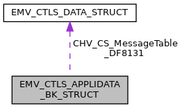

\[<a href="graph_legend.md">legend</a>\]

| Data Fields |  |  |
|----|----|----|
| unsigned char | AcquirerIdentifier_9F01\[6\] | TempUpdate allowed: NO Description: Uniquely identifies the acquirer within each payment system. Availability bit: <a href="group___d_e_f___i_n_p_u_t___a_p_p_l_i___b_k.md#ga18b52e4c0ee2e90ae92abd61c638984c">INPUT_CTLS_APL_BK_9F01_1</a> TLV tag: <a href="group___e_m_v_c_o___t_a_g_s.md#gaab4cf8e32535962270e6219bcbc08194">TAG_9F01_ACQ_ID</a> XML Tag: <a href="group___a_d_k___x_m_l___t_a_g_s.md#ga2574462d9c86ea3a5b38de70e6805abe">XML_TAG_AD_9F01_ACQUIRER_ID</a>. |
| unsigned char | AdditionalTerminalCapabilities_9F40\[5\] | TempUpdate allowed: YES Description: Additional Terminal Capabilities, may be required by the ICC in the PDOL Availability bit: <a href="group___d_e_f___i_n_p_u_t___a_p_p_l_i___b_k.md#gaa1a9299f39edb97a94be861cac9438be">INPUT_CTLS_APL_BK_9F40_0</a> TLV tag: <a href="group___e_m_v_c_o___t_a_g_s.md#ga5670c7d223a0af749d5b8b251e32f870">TAG_9F40_ADD_TRM_CAP</a>, XML Tag: <a href="group___a_d_k___x_m_l___t_a_g_s.md#ga72a5aead1f3bdb2063b3122a52ee5a02">XML_TAG_AD_9F40_ADD_TERM_CAPS</a>. |
| unsigned char | AppFlowCap_DFAB31\[5\] | TempUpdate allowed: YES Description: Configure special application characteristics, see <a href="group___d_e_f___f_l_o_w___b_k.md">Application flow capabilities for CPACE</a> Availability bit: <a href="group___d_e_f___i_n_p_u_t___a_p_p_l_i___b_k.md#ga4688c5e48cdf147121b1eebf7e1fb585">INPUT_CTLS_APL_BK_DFAB31_1</a> TLV tag: <a href="group___t_a_g_s___n_e_w___c_f_g___i_n_t_f___p_r_i_m.md#gaf35f7d22b485b509c980566dba2eea1a">TAG_DFAB31_APP_FLOW_CAP</a>, XML Tag: <a href="group___a_d_k___x_m_l___t_a_g_s.md#ga6b8be55da5b6d73ae05c3b3337e4d068">XML_TAG_AD_DFAB31_APP_FLOW_CAP</a>. |
| <a href="_e_m_v___c_t_l_s___interface_8h.md#a72d9f02bd046a1c2bf3590be2bca6a26">EMV_CTLS_DATA_TYPE</a> | CHV_CS_MessageTable_DF8131 | TempUpdate allowed: NO Description: CPACE Cardholder Verification and Confirmation Status Message Table, up to 20 entries of each 5 byte: Mask\[3\], UI Status, UI Message Availability bit: <a href="group___d_e_f___i_n_p_u_t___a_p_p_l_i___b_k.md#ga7527e6f600b08a65f7ba06a03d75f460">INPUT_CTLS_APL_BK_DF8131_2</a> TLV tag <a href="group___m_c___t_a_g_s.md#ga19265599710cf038895aea974b000166">TAG_DF8131_PHONE_MSG_TABLE</a>, XML Tag: <a href="group___a_d_k___x_m_l___t_a_g_s.md#ga62f573381dbe1a8096b0bf13ac15d38c">XML_TAG_AD_MK_DF8131_PHONE_MSG_TABLE</a>. |
| unsigned char | CVM_aboveLimit_DF8118 | TempUpdate allowed: YES Description: Separate cardholder verification methods for transactions above the CVM limit (former Byte 2 of 9F33) Availability bit: <a href="group___d_e_f___i_n_p_u_t___a_p_p_l_i___b_k.md#ga90d9319a3a3fbd42f7ab0dffbb14786b">INPUT_CTLS_APL_BK_DF8118_1</a> TLV tag: <a href="group___m_c___t_a_g_s.md#gae26b009b2e8fbc3f96890a6f8f05f917">TAG_DF8118_CVM_CAPABILITY__CVM_REQUIRED</a>, XML Tag: <a href="group___a_d_k___x_m_l___t_a_g_s.md#ga94b2eed4980138684e0a219004dae40f">XML_TAG_AD_DF8118_CVM_ABOVE_LIMIT</a>. |
| unsigned char | CVM_belowLimit_DF8119 | TempUpdate allowed: YES Description: Separate cardholder verification methods for transactions below the CVM limit (former Byte 2 of 9F33) Availability bit: <a href="group___d_e_f___i_n_p_u_t___a_p_p_l_i___b_k.md#gac4e620a03027eebc583ddec7a4246a65">INPUT_CTLS_APL_BK_DF8119_1</a> TLV tag: <a href="group___m_c___t_a_g_s.md#ga891bf29200fdd3a0e520e68bb06d5a8d">TAG_DF8119_CVM_CAPABILITY__NO_CVM_REQUIRED</a>, XML Tag: <a href="group___a_d_k___x_m_l___t_a_g_s.md#gad4e4adeb8ef490e0336b262d74d2cee2">XML_TAG_APPLIDATA_CHIP_CVM_BELOW</a>. |
| unsigned char | CVMRequiredLimit_DF8126\[6\] | TempUpdate allowed: YES Description: Reader CVM Required Limit (n12) Availability bit: <a href="group___d_e_f___i_n_p_u_t___a_p_p_l_i___b_k.md#ga30a9820aec49573e236c5d2d493503f4">INPUT_CTLS_APL_BK_DF8126_2</a> TLV tag: <a href="group___m_c___t_a_g_s.md#ga30158fe6b585cce6e0f823d6f3893821">TAG_DF8126_CVM_REQUIRED_LIMIT</a>, XML Tag: <a href="group___a_d_k___x_m_l___t_a_g_s.md#gae98f6f8d3a08a02b10f56ef146a0757c">XML_TAG_AD_MK_DF8126_CVM_REQUIRED_LIMIT</a>. |
| unsigned char | FloorLimit_DF8123\[6\] | TempUpdate allowed: YES Description: Reader Contactless Floor Limit (n12) Use \'999999999999\' to disable. Availability bit: <a href="group___d_e_f___i_n_p_u_t___a_p_p_l_i___b_k.md#ga147026bb1df11f468d76c68e2c760b6e">INPUT_CTLS_APL_BK_DF8123_2</a> TLV tag: <a href="group___m_c___t_a_g_s.md#ga7e3bc2b53045bb7f683762fdb53a4358">TAG_DF8123_FLOOR_LIMIT</a>, XML Tag: <a href="group___a_d_k___x_m_l___t_a_g_s.md#gad835bd5288af49a5c55005d5404a3c60">XML_TAG_AD_MK_DF8123_FLOOR_LIMIT</a>. |
| unsigned char | IncludedData\[8\] | Availability bits, see <a href="group___d_e_f___i_n_p_u_t___a_p_p_l_i___w_k.md">Appli data scheme specific - Wise - Availability bits</a>. |
| unsigned char | KernelConfiguration_DF811B | TempUpdate allowed: NO Description: Indicates the Kernel configuration options. Availability bit: <a href="group___d_e_f___i_n_p_u_t___a_p_p_l_i___b_k.md#ga8bb733de17d8817dff6c3ca371821135">INPUT_CTLS_APL_BK_DF811B_1</a> TLV tag: <a href="group___m_c___t_a_g_s.md#gaf54761e0bb859b84f08931b53ea2bcb3">TAG_DF811B_KERNEL_CONFIGURATION</a> XML Tag: <a href="group___a_d_k___x_m_l___t_a_g_s.md#gae39599e0c48154673795010e56baeeca">XML_TAG_AD_MK_DF811B_KERNEL_CONFIG</a>. |
| unsigned char | MerchantCategoryCode_9F15\[2\] | TempUpdate allowed: NO Description: Merchant category code Availability bit: <a href="group___d_e_f___i_n_p_u_t___a_p_p_l_i___b_k.md#gafe973de81f4cdcb6b43ede90e924032f">INPUT_CTLS_APL_BK_9F15_0</a> TLV tag: <a href="group___e_m_v_c_o___t_a_g_s.md#ga41481cf04242a0ba441c87f6a1569639">TAG_9F15_MERCH_CATEG_CODE</a>, XML Tag: <a href="group___a_d_k___x_m_l___t_a_g_s.md#gae88b926438441531ae9092bd0bb660d1">XML_TAG_AD_9F15_MERCHANT_CATEGORY_CODE</a>. |
| char | MerchantIdentifier_9F16\[15+1\] | TempUpdate allowed: NO Description: Merchant Identifier Availability bit: <a href="group___d_e_f___i_n_p_u_t___a_p_p_l_i___b_k.md#ga89ff921323d1c73f6515de1a27b152fb">INPUT_CTLS_APL_BK_9F16_0</a> TLV tag: <a href="group___e_m_v_c_o___t_a_g_s.md#ga184ccaaef50ada9988bfd4af37b8c9fb">TAG_9F16_MERCHANT_ID</a>, XML Tag: <a href="group___a_d_k___x_m_l___t_a_g_s.md#ga8da674894d29e2a9aa9510c076a78c4d">XML_TAG_AD_9F16_MERCHANT_ID</a>. |
| char | MerchantNameAndLocation_9F4E\[40+1\] | TempUpdate allowed: NO Description: Indicates the name and location of the merchant. Availability bit: <a href="group___d_e_f___i_n_p_u_t___a_p_p_l_i___b_k.md#gadd8370c079dbd832b440d99110065e2e">INPUT_CTLS_APL_BK_9F4E_1</a> TLV tag: <a href="group___e_m_v_c_o___t_a_g_s.md#gac3a7de1661225ab41a4529b68d1fda71">TAG_9F4E_TAC_MERCHANTLOC</a>, XML Tag: <a href="group___a_d_k___x_m_l___t_a_g_s.md#gaae07de3e2c2bdf3ad815fb540c572cdc">XML_TAG_AD_9F4E_MERCHANT_NAME_LOCATION</a>. |
| unsigned char | MessageHoldTime_DF812D\[3\] | TempUpdate allowed: NO Description: Indicates the default delay for the processing of the next MSG Signal. The Message Hold Time is an integer in units of 100ms. Availability bit: <a href="group___d_e_f___i_n_p_u_t___a_p_p_l_i___b_k.md#ga8dd102549acbe5c4a3885ac0d282cf9f">INPUT_CTLS_APL_BK_DF812D_2</a> TLV tag: <a href="group___m_c___t_a_g_s.md#gab6639b6014ddbc22057a1ad2ed9f21f1">TAG_DF812D_MESSAGE_HOLD_TIME</a> XML Tag: <a href="group___a_d_k___x_m_l___t_a_g_s.md#gaa4927f95fc990fd67a77c10e6dc084de">XML_TAG_AD_MK_DF812D_MESSAGE_HOLD_TIME</a>. |
| unsigned char | RR_MinTimeDifferenceLimit_DF8136\[2\] | TempUpdate allowed: YES Description: Relay Resistance Minimal Time Difference Limit \[1/10 ms\] TLV tag <a href="group___m_c___t_a_g_s.md#gaa8edcf63c6c6e3573a87c1eb06d2c6b1">TAG_DF8136_RR_ACCURACY_THRESHOLD</a> Availability bit: <a href="group___d_e_f___i_n_p_u_t___a_p_p_l_i___b_k.md#ga024c0316f6bbeb26491212751d670d7f">INPUT_CTLS_APL_BK_DF8136_3</a>, XML Tag: <a href="group___a_d_k___x_m_l___t_a_g_s.md#gaac645b02a3d5c525a2bd32b37b744877">XML_TAG_AD_MK_DF8136_RR_ACCURACY_THRESHOLD</a>. |
| unsigned char | RR_TimeToleranceMax_DF8133\[2\] | TempUpdate allowed: YES Description: Maximal Time Relay Resistance Tolerance \[1/10 ms\] TLV tag <a href="group___m_c___t_a_g_s.md#gaff8cee533b36d5c16c57f9238ef5287f">TAG_DF8133_RR_MAX_GRACE_PERIOD</a> Availability bit: <a href="group___d_e_f___i_n_p_u_t___a_p_p_l_i___b_k.md#gaacec118777514fb7acf8dab1c14bdc40">INPUT_CTLS_APL_BK_DF8133_3</a>, XML Tag: <a href="group___a_d_k___x_m_l___t_a_g_s.md#ga9d73f54e46c609b8216cc94d9a88aa47">XML_TAG_AD_MK_DF8133_RR_MAX_GRACE_PREIOD</a>. |
| unsigned char | RR_TimeToleranceMin_DF8132\[2\] | TempUpdate allowed: YES Description: Minimal Time Relay Resistance Tolerance \[1/10 ms\] TLV tag <a href="group___m_c___t_a_g_s.md#gad002d7cb64f70850b6b57e2afe610eb2">TAG_DF8132_RR_MIN_GRACE_PERIOD</a> Availability bit: <a href="group___d_e_f___i_n_p_u_t___a_p_p_l_i___b_k.md#ga3f341c13d9ed4e734f2848caa404f6ad">INPUT_CTLS_APL_BK_DF8132_2</a>, XML Tag: <a href="group___a_d_k___x_m_l___t_a_g_s.md#ga514dd5e769fa1ba0d808c97f804e3058">XML_TAG_AD_MK_DF8132_RR_MIN_GRACE_PERIOD</a>. |
| unsigned char | RR_TransmissionTime_CAPDU_DF8134\[2\] | TempUpdate allowed: YES Description: Terminal Transmission Time For Relay Resistance Command \[1/10 ms\] TLV tag <a href="group___m_c___t_a_g_s.md#gaeb20fef28673994edbc531e8e1deef45">TAG_DF8134_RR_TERM_EXPECTED_TRANS_TIME_CAPDU</a> Availability bit: <a href="group___d_e_f___i_n_p_u_t___a_p_p_l_i___b_k.md#ga47cbdcaee961756193428bf47b0ff102">INPUT_CTLS_APL_BK_DF8134_3</a>, XML Tag: <a href="group___a_d_k___x_m_l___t_a_g_s.md#gafc255d824c73f5a295a719cae5d3b4c1">XML_TAG_AD_MK_DF8134_RR_EXP_TRANS_TIME_CAPDU</a>. |
| unsigned char | RR_TransmissionTime_RAPDU_DF8135\[2\] | TempUpdate allowed: YES Description: Terminal Transmission Time For Relay Resistance Response \[1/10 ms\] TLV tag <a href="group___m_c___t_a_g_s.md#ga884b0eba03de051b0c696f740431e651">TAG_DF8135_RR_TERM_EXPECTED_TRANS_TIME_RAPDU</a> Availability bit: <a href="group___d_e_f___i_n_p_u_t___a_p_p_l_i___b_k.md#gab99348fe7019c6a463e8f58b78cc16d1">INPUT_CTLS_APL_BK_DF8135_3</a>, XML Tag: <a href="group___a_d_k___x_m_l___t_a_g_s.md#gaa445cffdf9aa2ba1c155ac70ffd742e4">XML_TAG_AD_MK_DF8135_RR_EXP_TRANS_TIME_RAPDU</a>. |
| unsigned char | RR_TransTimeMismatchLimit_DF8137 | TempUpdate allowed: YES Description: Relay Resistance Transmission Time Mismatch Limit \[%\] TLV tag <a href="group___m_c___t_a_g_s.md#ga13ac475cae84818b777e7d7a697f7001">TAG_DF8137_RR_TRANS_TIME_MISMATCH_THRESHOLD</a> Availability bit: <a href="group___d_e_f___i_n_p_u_t___a_p_p_l_i___b_k.md#gaaa9fbc2c00ce13db141465c37dbe3e2d">INPUT_CTLS_APL_BK_DF8137_3</a>, XML Tag: <a href="group___a_d_k___x_m_l___t_a_g_s.md#ga03a3d5a2a2cdd2a2f324e0e7901c94ee">XML_TAG_AD_MK_DF8137_RR_TT_MISMATCH_THRESHOLD</a>. |
| unsigned char | TACDefault_DF8120\[5\] | TempUpdate allowed: YES Description: Terminal Action Code - Default Availability bit: <a href="group___d_e_f___i_n_p_u_t___a_p_p_l_i___b_k.md#ga817318985d92877ad82c86f8be1910c5">INPUT_CTLS_APL_BK_DF8120_1</a> TLV tag: <a href="group___m_c___t_a_g_s.md#ga8de41e2b23c67abd4560ad0e210ebcc0">TAG_DF8120_TAC_DEFAULT</a>, XML Tag: <a href="group___a_d_k___x_m_l___t_a_g_s.md#ga1af41111b9d9e730f45d217506dae165">XML_TAG_AD_MK_DF8120_TAC_DEFAULT</a>. |
| unsigned char | TACDenial_DF8121\[5\] | TempUpdate allowed: YES Description: Terminal Action Code - Denial Availability bit: <a href="group___d_e_f___i_n_p_u_t___a_p_p_l_i___b_k.md#gac78c6cf7a5170257bb84ab489c8640e2">INPUT_CTLS_APL_BK_DF8121_1</a> TLV tag: <a href="group___m_c___t_a_g_s.md#gaf7567abd6f21a6c76f4cf7c5be314b34">TAG_DF8121_TAC_DENIAL</a>, XML Tag: <a href="group___a_d_k___x_m_l___t_a_g_s.md#ga8845dcd232cb753b238289d6deca349b">XML_TAG_AD_MK_DF8121_TAC_DENIAL</a>. |
| unsigned char | TACOnline_DF8122\[5\] | TempUpdate allowed: YES Description: Terminal Action Code - Online Availability bit: <a href="group___d_e_f___i_n_p_u_t___a_p_p_l_i___b_k.md#ga61222835868d99fb0518086c6d16f1c5">INPUT_CTLS_APL_BK_DF8122_2</a> TLV tag: <a href="group___m_c___t_a_g_s.md#ga223085b47b7d8ef1a7f4ec69f9a32efb">TAG_DF8122_TAC_ONLINE</a>, XML Tag: <a href="group___a_d_k___x_m_l___t_a_g_s.md#gaecd8afc192ef31b6f853ac9f7cafea38">XML_TAG_AD_MK_DF8122_TAC_ONLINE</a>. |
| unsigned char | TermIdent_9F1C\[8\] | TempUpdate allowed: YES Description: Terminal Identification. mandatory for <a href="group___f_u_n_c___c_o_n_f.md#gadc7f2eba5fd3e941d0ddb65a936a0776">EMV_CTLS_SetAppliDataSchemeSpecific</a> Availability bit: <a href="group___d_e_f___i_n_p_u_t___a_p_p_l_i___b_k.md#gaecc5bca4446f06abbee6e47084b3abb5">INPUT_CTLS_APL_BK_9F1C_0</a> TLV tag: <a href="group___e_m_v_c_o___t_a_g_s.md#ga64f401e453e74b4ff1f727aa7cc449ac">TAG_9F1C_TRM_ID</a>, XML Tag: <a href="group___a_d_k___x_m_l___t_a_g_s.md#gaac04779e3fbe03f8b471661b313b4330">XML_TAG_AD_9F1C_TERM_IDENT</a>. |
| unsigned char | TerminalCapabilities_9F33\[3\] | TempUpdate allowed: YES Description: Terminal Capabilities, may be required by the ICC in the PDOL Availability bit: <a href="group___d_e_f___i_n_p_u_t___a_p_p_l_i___b_k.md#gaf7d9c8b11bcc5e2741f15efc99c74221">INPUT_CTLS_APL_BK_9F33_0</a> TLV tag: <a href="group___e_m_v_c_o___t_a_g_s.md#gad3ec876483505eb23aad4e1b210653f5">TAG_9F33_TRM_CAPABILITIES</a>, XML Tag: <a href="group___a_d_k___x_m_l___t_a_g_s.md#gac7631a53460a29936f07cc2bc1d17443">XML_TAG_AD_9F33_TERM_CAPS</a>. |
| unsigned char | TerminalCountryCode_9F1A\[2\] | TempUpdate allowed: YES Description: Terminal Country Code ISO 3166-1 Availability bit: <a href="group___d_e_f___i_n_p_u_t___a_p_p_l_i___b_k.md#gab26d5914c799fe1f49dfa484b4f49005">INPUT_CTLS_APL_BK_9F1A_0</a> TLV tag: <a href="group___e_m_v_c_o___t_a_g_s.md#ga5bc987c3686fd5821f20d21015354787">TAG_9F1A_TRM_COUNTRY_CODE</a>, XML Tag: <a href="group___a_d_k___x_m_l___t_a_g_s.md#gac90c5457d7e98c811d727b03b2ce527f">XML_TAG_AD_9F1A_TERM_COUNTRY_CODE</a>. |
| unsigned char | TerminalType_9F35 | TempUpdate allowed: YES Description: Terminal type, possible values see <a href="group___t_e_r_m___t_y_p_e_s.md">Terminaltypes (Tag 9F35)</a>) Availability bit: <a href="group___d_e_f___i_n_p_u_t___a_p_p_l_i___b_k.md#ga85ced6aba5da014cba17dbf63151e084">INPUT_CTLS_APL_BK_9F35_0</a> TLV tag: <a href="group___e_m_v_c_o___t_a_g_s.md#gace5b4ef50a58d29b2f5296c2c17273c9">TAG_9F35_TRM_TYPE</a>, XML Tag: <a href="group___a_d_k___x_m_l___t_a_g_s.md#ga0326cdf90192c73abf14e7de25077543">XML_TAG_AD_9F35_TERM_TYPE</a>. |
| unsigned char | TransactionLimitCDCVM_DF8125\[6\] | TempUpdate allowed: YES Description: Contactless Transaction Limit - CDCVM supported (n12) Availability bit: <a href="group___d_e_f___i_n_p_u_t___a_p_p_l_i___b_k.md#ga8ad834e052c9266c5325c6e4d08f0260">INPUT_CTLS_APL_BK_DF8125_2</a> TLV tag <a href="group___m_c___t_a_g_s.md#ga55d133646b780225892a8e430d85ed71">TAG_DF8125_READER_CTLS_TRX_LIMIT__ON_DEVICE_CVM</a>, XML Tag: <a href="group___a_d_k___x_m_l___t_a_g_s.md#ga1fdb3fb836be1e6918aa3cb8daa94590">XML_TAG_AD_DF8125_TRX_LIMIT_CDCVM</a>. |
| unsigned char | TransactionLimitNoCDCVM_DF8124\[6\] | TempUpdate allowed: YES Description: Contactless Transaction Limit - CDCVM not supported (n12) Availability bit: <a href="group___d_e_f___i_n_p_u_t___a_p_p_l_i___b_k.md#ga0063d51cc106f2441ba71c2aed67c049">INPUT_CTLS_APL_BK_DF8124_2</a> TLV tag <a href="group___m_c___t_a_g_s.md#ga97bfc09582df37b5cc75822f4efbfeb3">TAG_DF8124_READER_CTLS_TRX_LIMIT__NO_ON_DEV_CVM</a>, XML Tag: <a href="group___a_d_k___x_m_l___t_a_g_s.md#gaaba0e5284ffae47b5babcfc02bb4a2a3">XML_TAG_AD_DF8124_TRX_LIMIT_NO_CDCVM</a>. |
| unsigned char | VersionNumber_9F09\[2 \*<a href="_e_m_v___c_t_l_s___interface_8h.md#a01aefcde9b880f166817e82c8f2eac99">EMV_CTLS_MAX_APP_VERS</a>\] | TempUpdate allowed: NO Description: Application version number list Availability bit: <a href="group___d_e_f___i_n_p_u_t___a_p_p_l_i___b_k.md#gad9a7b714953d42772acc492c47734996">INPUT_CTLS_APL_BK_9F09_0</a> TLV tag: <a href="group___e_m_v_c_o___t_a_g_s.md#gac0fb6f2c9da5e835754d94e7edf4f7c2">TAG_9F09_TRM_APP_VERSION_NB</a>, XML Tag: <a href="group___a_d_k___x_m_l___t_a_g_s.md#gaadbdb604ebc480d0ca6d77105987034e">XML_TAG_AD_9F09_VERSION_NUMBER</a>. |

## EMV_CTLS_APPLIDATA_MR_STRUCT 

struct EMV_CTLS_APPLIDATA_MR_STRUCT

Structure for configuration of one single application, MIR specific part. See <a href="group___f_u_n_c___c_o_n_f.md#gadc7f2eba5fd3e941d0ddb65a936a0776">EMV_CTLS_SetAppliDataSchemeSpecific()</a>

Collaboration diagram for EMV_CTLS_APPLIDATA_MR_STRUCT:

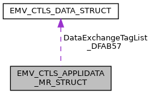

\[<a href="graph_legend.md">legend</a>\]

| Data Fields |  |  |
|----|----|----|
| unsigned char | AcquirerIdentifier_9F01\[6\] | TempUpdate allowed: NO Description: Uniquely identifies the acquirer within each payment system. Availability bit: <a href="group___d_e_f___i_n_p_u_t___a_p_p_l_i___m_r.md#ga6360f46b78372121cd3a811357e7af7c">INPUT_CTLS_APL_MR_9F01_0</a> TLV tag: <a href="group___e_m_v_c_o___t_a_g_s.md#gaab4cf8e32535962270e6219bcbc08194">TAG_9F01_ACQ_ID</a> XML Tag: <a href="group___a_d_k___x_m_l___t_a_g_s.md#ga0ca98d63f83b0c68562c606d70cd8021">XML_TAG_AD_MR_9F01_ACQUIRER_ID</a>. |
| unsigned char | AppFlowCap_DFAB31\[5\] | TempUpdate allowed: YES Description: Configure special application characteristics, see <a href="group___d_e_f___f_l_o_w___m_r.md">Application flow capabilities for MIR</a> Availability bit: <a href="group___d_e_f___i_n_p_u_t___a_p_p_l_i___m_r.md#ga79922f54b6e57ec06bf3be8e10880f97">INPUT_CTLS_APL_MR_DFAB31_1</a> TLV tag: <a href="group___t_a_g_s___n_e_w___c_f_g___i_n_t_f___p_r_i_m.md#gaf35f7d22b485b509c980566dba2eea1a">TAG_DFAB31_APP_FLOW_CAP</a>, XML Tag: <a href="group___a_d_k___x_m_l___t_a_g_s.md#ga6b163b1654a82b4e3a64dba5daea720b">XML_TAG_AD_MR_DFAB31_APP_FLOW_CAP</a>. |
| <a href="_e_m_v___c_t_l_s___interface_8h.md#a72d9f02bd046a1c2bf3590be2bca6a26">EMV_CTLS_DATA_TYPE</a> | DataExchangeTagList_DFAB57 | TempUpdate allowed: NO Description: Data Exchange Tag List: a set of tags which the terminal expects to receive from the kernel during data exchange Availability bit: <a href="group___d_e_f___i_n_p_u_t___a_p_p_l_i___m_r.md#ga61d75ca110e1ac2fdb663ca1dff59ff7">INPUT_CTLS_APL_MR_DFAB57_2</a> TLV tag: <a href="group___t_a_g_s___n_e_w___c_f_g___i_n_t_f___p_r_i_m.md#ga23c364ffc5ecb5da1c56852ee45a167a">TAG_DFAB57_MIR_DATA_EXCHANGE_TAGS</a> XML Tag: <a href="group___a_d_k___x_m_l___t_a_g_s.md#gaae2d11590ad11a4bd992ccb1e3c43199">XML_TAG_AD_MR_DFAB57_MIR_DATA_EXCHANGE_TAGS</a>. |
| unsigned char | IncludedData\[8\] | Availability bits, see <a href="group___d_e_f___i_n_p_u_t___a_p_p_l_i___m_r.md">Appli data scheme specific - MIR - Availability bits</a>. |
| unsigned char | MerchantCategoryCode_9F15\[2\] | TempUpdate allowed: NO Description: Merchant category code. mandatory for <a href="group___f_u_n_c___c_o_n_f.md#gadc7f2eba5fd3e941d0ddb65a936a0776">EMV_CTLS_SetAppliDataSchemeSpecific</a> Availability bit: <a href="group___d_e_f___i_n_p_u_t___a_p_p_l_i___m_r.md#ga3dd6f6e4cead6967dbbaab7e7fd5419d">INPUT_CTLS_APL_MR_9F15_0</a> TLV tag: <a href="group___e_m_v_c_o___t_a_g_s.md#ga41481cf04242a0ba441c87f6a1569639">TAG_9F15_MERCH_CATEG_CODE</a>, XML Tag: <a href="group___a_d_k___x_m_l___t_a_g_s.md#gab12c65e731db375e52dee5a4db834070">XML_TAG_AD_MR_9F15_MERCHANT_CATEGORY_CODE</a>. |
| char | MerchantNameAndLocation_9F4E\[40+1\] | TempUpdate allowed: NO Description: Indicates the name and location of the merchant. Availability bit: <a href="group___d_e_f___i_n_p_u_t___a_p_p_l_i___m_r.md#ga06225e0d5d87c81598a13c8f03e93361">INPUT_CTLS_APL_MR_9F4E_0</a> TLV tag: <a href="group___e_m_v_c_o___t_a_g_s.md#gac3a7de1661225ab41a4529b68d1fda71">TAG_9F4E_TAC_MERCHANTLOC</a>, XML Tag: <a href="group___a_d_k___x_m_l___t_a_g_s.md#ga5db863c1b0639cef0e245480ce374233">XML_TAG_AD_MR_9F4E_MERCHANT_NAME_LOCATION</a>. |
| unsigned char | TACDefault_DFAB43\[5\] | TempUpdate allowed: YES Description: Terminal Action Code - Default mandatory for <a href="group___f_u_n_c___c_o_n_f.md#gadc7f2eba5fd3e941d0ddb65a936a0776">EMV_CTLS_SetAppliDataSchemeSpecific</a> ///\< Availability bit: <a href="group___d_e_f___i_n_p_u_t___a_p_p_l_i___m_r.md#gac2005df6fdb1836899917281ad54269d">INPUT_CTLS_APL_MR_DFAB43_1</a> TLV tag: <a href="group___t_a_g_s___n_e_w___c_f_g___i_n_t_f___p_r_i_m.md#ga885632db95d4e5e768eb59582123ab4c">TAG_DFAB43_TAC_DEFAULT</a>, XML Tag: <a href="group___a_d_k___x_m_l___t_a_g_s.md#ga2058d949c7971b107ec6d236130b95e0">XML_TAG_AD_MR_DFAB43_TAC_DEFAULT</a>. |
| unsigned char | TACDenial_DFAB44\[5\] | TempUpdate allowed: YES Description: Terminal Action Code - Denial mandatory for <a href="group___f_u_n_c___c_o_n_f.md#gadc7f2eba5fd3e941d0ddb65a936a0776">EMV_CTLS_SetAppliDataSchemeSpecific</a> Availability bit: <a href="group___d_e_f___i_n_p_u_t___a_p_p_l_i___m_r.md#gad24b7f821ee1c0a55e95881cc5a07d57">INPUT_CTLS_APL_MR_DFAB44_1</a> TLV tag: <a href="group___t_a_g_s___n_e_w___c_f_g___i_n_t_f___p_r_i_m.md#ga6c4ffbdb026c264681d2c8da01607e9f">TAG_DFAB44_TAC_DENIAL</a>, XML Tag: <a href="group___a_d_k___x_m_l___t_a_g_s.md#ga1fc7ce31881d1adf85de6da59539d1bb">XML_TAG_AD_MR_DFAB44_TAC_DENIAL</a>. |
| unsigned char | TACOnline_DFAB45\[5\] | TempUpdate allowed: YES Description: Terminal Action Code - Online mandatory for <a href="group___f_u_n_c___c_o_n_f.md#gadc7f2eba5fd3e941d0ddb65a936a0776">EMV_CTLS_SetAppliDataSchemeSpecific</a> Availability bit: <a href="group___d_e_f___i_n_p_u_t___a_p_p_l_i___m_r.md#ga5a0820dd06b3410cc156b5f0427efe44">INPUT_CTLS_APL_MR_DFAB45_2</a> TLV tag: <a href="group___t_a_g_s___n_e_w___c_f_g___i_n_t_f___p_r_i_m.md#ga53c8a7f59827691e78e3a9d452da187a">TAG_DFAB45_TAC_ONLINE</a>, XML Tag: <a href="group___a_d_k___x_m_l___t_a_g_s.md#ga787f6891704fd406eddebcd617642b2e">XML_TAG_AD_MR_DFAB45_TAC_ONLINE</a>. |
| unsigned char | TermIdent_9F1C\[8\] | TempUpdate allowed: YES Description: Terminal Identification. mandatory for <a href="group___f_u_n_c___c_o_n_f.md#gadc7f2eba5fd3e941d0ddb65a936a0776">EMV_CTLS_SetAppliDataSchemeSpecific</a> Availability bit: <a href="group___d_e_f___i_n_p_u_t___a_p_p_l_i___m_r.md#ga082cc99db4762496d03ba0319d6974fd">INPUT_CTLS_APL_MR_9F1C_0</a> TLV tag: <a href="group___e_m_v_c_o___t_a_g_s.md#ga64f401e453e74b4ff1f727aa7cc449ac">TAG_9F1C_TRM_ID</a>, XML Tag: <a href="group___a_d_k___x_m_l___t_a_g_s.md#gada1608589f085696ceb30deeb935159d">XML_TAG_AD_MR_9F1C_TERM_IDENT</a>. |
| unsigned char | TerminalContactlessLimitCDCVM_DF54\[6\] | TempUpdate allowed: NO Description: Terminal Contactless Limit (BCD encoded) for CD-CVM: the maximum transaction amount using the contactless interface for CD-CVM. Availability bit: <a href="group___d_e_f___i_n_p_u_t___a_p_p_l_i___m_r.md#ga88c54a9a4aad176b327b0c14419da85e">INPUT_CTLS_APL_MR_DF54_1</a> TLV tag <a href="group___v_e_r_i___p_r_i_m___t_a_g_s.md#ga729abdd1acc5d0d5693bd0071cf84ffb">TAG_DF54_TRM_CTLS_LIMIT_CDCVM</a>, XML Tag: <a href="group___a_d_k___x_m_l___t_a_g_s.md#gaaa39cd174c31c653ce6893bc542a1c05">XML_TAG_AD_MR_DF54_TRM_CTLS_LIMIT_CDCVM</a>. |
| unsigned char | TerminalContactlessLimitNonCDCVM_DF53\[6\] | TempUpdate allowed: NO Description: Terminal Contactless Limit (BCD encoded) for Non CD-CVM: the maximum transaction amount using the contactless interface for Non CD-CVM. Availability bit: <a href="group___d_e_f___i_n_p_u_t___a_p_p_l_i___m_r.md#ga5c6f950a236ce35087ae2f5379f89e93">INPUT_CTLS_APL_MR_DF53_1</a> TLV tag <a href="group___v_e_r_i___p_r_i_m___t_a_g_s.md#ga8bbe0e0821128b275e0839b729ac88e9">TAG_DF53_TRM_CTLS_LIMIT_NON_CDCVM</a>, XML Tag: <a href="group___a_d_k___x_m_l___t_a_g_s.md#ga47c82c5f33b0c1e20138a45c20de54f8">XML_TAG_AD_MR_DF53_TRM_CTLS_LIMIT_NON_CDCVM</a>. |
| unsigned char | TerminalCountryCode_9F1A\[2\] | TempUpdate allowed: YES Description: Terminal Country Code. Availability bit: <a href="group___d_e_f___i_n_p_u_t___a_p_p_l_i___m_r.md#ga5b32bf8b28a3e7f304b9c1ca5976917b">INPUT_CTLS_APL_MR_9F1A_0</a> TLV tag: <a href="group___e_m_v_c_o___t_a_g_s.md#ga5bc987c3686fd5821f20d21015354787">TAG_9F1A_TRM_COUNTRY_CODE</a>, XML Tag: <a href="group___a_d_k___x_m_l___t_a_g_s.md#ga19b3a047f3e40c294d0921b057d39a06">XML_TAG_AD_MR_9F1A_TERM_COUNTRY_CODE</a>. |
| unsigned char | TerminalFloorLimit_DF51\[6\] | TempUpdate allowed: NO Description: Terminal floor limit (BCD encoded): the maximum amount allowing the offline operation processing mode. Availability bit: <a href="group___d_e_f___i_n_p_u_t___a_p_p_l_i___m_r.md#ga190fbcbb0340709c0d694c715507f834">INPUT_CTLS_APL_MR_DF51_0</a> TLV tag: <a href="group___v_e_r_i___p_r_i_m___t_a_g_s.md#ga4dd15e9ee3a30a6777961d6fdf59df84">TAG_DF51_TRM_FLOOR_LIMIT</a>, XML Tag: <a href="group___a_d_k___x_m_l___t_a_g_s.md#ga36f9b8c3db2c17d4ce447c6d33c25948">XML_TAG_AD_MR_DF51_TRM_FLOOR_LIMIT</a>. |
| unsigned char | TerminalNoCVMLimit_DF52\[6\] | TempUpdate allowed: NO Description: Terminal No CVM Limit (BCD encoded): the maximum amount of the transaction performed without Cardholder verification. Availability bit: <a href="group___d_e_f___i_n_p_u_t___a_p_p_l_i___m_r.md#gad8ff2686b617f8f5efc2bee83963f123">INPUT_CTLS_APL_MR_DF52_1</a> TLV tag: <a href="group___v_e_r_i___p_r_i_m___t_a_g_s.md#ga3bfb98b307995cefd6d6c715531bb9ce">TAG_DF52_TRM_NOCVM_LIMIT</a>, XML Tag: <a href="group___a_d_k___x_m_l___t_a_g_s.md#gac1310fa0d3f9edeccce6f8dc39f811be">XML_TAG_AD_MR_DF52_TRM_NOCVM_LIMIT</a>. |
| unsigned char | TerminalTPMCapabilities_DF55\[2\] | TempUpdate allowed: NO Description: MIR Terminal TPM Capabilities. Availability bit: <a href="group___d_e_f___i_n_p_u_t___a_p_p_l_i___m_r.md#ga3ff1b2f291a98d1a50383e6dacb40212">INPUT_CTLS_APL_MR_DF55_1</a> TLV tag: <a href="group___v_e_r_i___p_r_i_m___t_a_g_s.md#gaa8699891579c92d5f94f9b4ecb5bfd00">TAG_DF55_TRM_TPM_CAPABILITIES</a>, XML Tag: <a href="group___a_d_k___x_m_l___t_a_g_s.md#gaf1699b1e1ddefb8245738e78ff15a6df">XML_TAG_AD_MR_DF55_TRM_TPM_CAPABILITIES</a>. |
| unsigned char | TerminalType_9F35 | TempUpdate allowed: YES Description: Terminal type, possible values see <a href="group___t_e_r_m___t_y_p_e_s.md">Terminaltypes (Tag 9F35)</a>. mandatory for first call of <a href="group___f_u_n_c___c_o_n_f.md#gac5ce9781bba083028538f9e77c2d58f3">EMV_CTLS_SetTermData()</a> Availability bit: <a href="group___d_e_f___i_n_p_u_t___a_p_p_l_i___m_r.md#ga809ce693eb58703aaba1188b4eff52bf">INPUT_CTLS_APL_MR_9F35_0</a> TLV tag: <a href="group___e_m_v_c_o___t_a_g_s.md#gace5b4ef50a58d29b2f5296c2c17273c9">TAG_9F35_TRM_TYPE</a>, XML Tag: <a href="group___a_d_k___x_m_l___t_a_g_s.md#ga70d5f14087a4adadb0834a66dd725bfe">XML_TAG_AD_MR_9F35_TERM_TYPE</a>. |
| unsigned char | TransactionRecoveryLimit_DF56 | TempUpdate allowed: NO Description: MIR Transaction Recovery Limit. Availability bit: <a href="group___d_e_f___i_n_p_u_t___a_p_p_l_i___m_r.md#ga8c951efb52201e127fe83833232d0bd9">INPUT_CTLS_APL_MR_DF56_1</a> TLV tag: <a href="group___v_e_r_i___p_r_i_m___t_a_g_s.md#gab9aeb6926d2b56dd0803b57cb8221c2d">TAG_DF56_TRANSACTION_RECOVERY_LIMIT</a>, XML Tag: <a href="group___a_d_k___x_m_l___t_a_g_s.md#ga8aa28074f594b5543a1f5fc6a5fbcecc">XML_TAG_AD_MR_DF56_TRANSACTION_RECOVERY_LIMIT</a>. |
| unsigned char | VersionNumber_9F09\[2 \*<a href="_e_m_v___c_t_l_s___interface_8h.md#a01aefcde9b880f166817e82c8f2eac99">EMV_CTLS_MAX_APP_VERS</a>\] | TempUpdate allowed: NO Description: Application chip version number. mandatory for <a href="group___f_u_n_c___c_o_n_f.md#gadc7f2eba5fd3e941d0ddb65a936a0776">EMV_CTLS_SetAppliDataSchemeSpecific</a> Availability bit: <a href="group___d_e_f___i_n_p_u_t___a_p_p_l_i___m_r.md#ga819a62d90468ec7c66c4bf9293d3b15e">INPUT_CTLS_APL_MR_9F09_0</a> TLV tag: <a href="group___e_m_v_c_o___t_a_g_s.md#gac0fb6f2c9da5e835754d94e7edf4f7c2">TAG_9F09_TRM_APP_VERSION_NB</a>, XML Tag: <a href="group___a_d_k___x_m_l___t_a_g_s.md#gafcca18abf3043ecaceafbfd7a4ed4395">XML_TAG_AD_MR_9F09_VERSION_NUMBER</a>. |

## EMV_CTLS_APPLIDATA_DOM_STRUCT 

struct EMV_CTLS_APPLIDATA_DOM_STRUCT

Structure for configuration of one single domestic application See <a href="group___f_u_n_c___c_o_n_f.md#gadc7f2eba5fd3e941d0ddb65a936a0776">EMV_CTLS_SetAppliDataSchemeSpecific()</a>

| Data Fields |  |  |
|----|----|----|
| unsigned char | AppFlowCap_DFAB31\[5\] | TempUpdate allowed: YES Description: Configure special application characteristics, see <a href="group___d_e_f___f_l_o_w___p_k.md">Application flow capabilities for Visa Asia/Pacific</a> Availability bit: <a href="group___d_e_f___i_n_p_u_t___a_p_p_l_i___d_o_m.md#gae7f4280ec0ef24d95681efadb725744b">INPUT_CTLS_APL_DOM_DFAB31_0</a> TLV tag: <a href="group___t_a_g_s___n_e_w___c_f_g___i_n_t_f___p_r_i_m.md#gaf35f7d22b485b509c980566dba2eea1a">TAG_DFAB31_APP_FLOW_CAP</a>, XML Tag: <a href="group___a_d_k___x_m_l___t_a_g_s.md#gaaa5d67beb51adba4f23988b62639b435">XML_TAG_AD_DOM_DFAB31_APP_FLOW_CAP</a>. |
| unsigned char | ContactlessTransactionLimit_DFAB41\[6\] | TempUpdate allowed: NO Description: BCD encoded. No contactless txns above this limit (as defined by PayPass) PayPass spec naming: \"Reader Contactless Transaction Limit\" Visa spec naming: \"Reader Contactless Transaction Limit (RCTL)\" Visa spec strongly recommends to disable this limit. Use FF FF FF FF to disable Availability bit: <a href="group___d_e_f___i_n_p_u_t___a_p_p_l_i___d_o_m.md#ga6e317f7975830b4a3463ac0b97aeba49">INPUT_CTLS_APL_DOM_DFAB41_0</a> TLV tag: <a href="group___t_a_g_s___n_e_w___c_f_g___i_n_t_f___p_r_i_m.md#gac0ad8ae2d5bd130f089f010278a99b4e">TAG_DFAB41_CTLS_TRX_LIMIT</a> XML Tag: <a href="group___a_d_k___x_m_l___t_a_g_s.md#ga01bd2a5337b7c7bc10e0eb58436ed11d">XML_TAG_AD_DOM_DFAB41_CTLS_TRX_LIMIT</a>. |
| unsigned char | IncludedData\[8\] | Availability bits, see <a href="group___d_e_f___i_n_p_u_t___a_p_p_l_i___d_o_m.md">Appli data scheme specific - domestic kernel - Availability bits</a>. |

## EMV_CTLS_APPLIDATA_SCHEME_SPECIFIC_STRUCT 

struct EMV_CTLS_APPLIDATA_SCHEME_SPECIFIC_STRUCT

Structure for configuration of one single application. See <a href="group___f_u_n_c___c_o_n_f.md#gadc7f2eba5fd3e941d0ddb65a936a0776">EMV_CTLS_SetAppliDataSchemeSpecific()</a>
XML tag <a href="group___a_d_k___x_m_l___t_a_g_s.md#gac59e08c61f80cea0bfd193fea694fcb9">XML_TAG_AD_APP</a>
no TLV tag is used.

Collaboration diagram for EMV_CTLS_APPLIDATA_SCHEME_SPECIFIC_STRUCT:

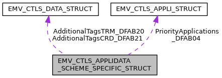

\[<a href="graph_legend.md">legend</a>\]

| Data Fields |  |  |
|----|----|----|
| <a href="_e_m_v___c_t_l_s___interface_8h.md#a72d9f02bd046a1c2bf3590be2bca6a26">EMV_CTLS_DATA_TYPE</a> | AdditionalTagsCRD_DFAB21 | 
TempUpdate allowed: NO Description: Vertex: Additional ICC tags for special applications. e.g. domestic cards with additional tags in ReadRecords, fleetcards with additional customer specific tags and others. VFI Reader: Additional tags to be delivered by the VFI Reader in the response ( VFI Reader ATOL) Format: DOL (Tag + maximum Length) restriction: only 1- and 2-byte-tags are supported, no support for 3-byte-tags Link to struct: <a href="_e_m_v___c_t_l_s___interface_8h.md#struct_e_m_v___c_t_l_s___d_a_t_a___s_t_r_u_c_t">EMV_CTLS_DATA_STRUCT</a> For Vertex, length is to be coded in one byte (length value between 1 and 0xF7). For VFI Reader, length is to be coded in BER-TLV length format and can be up to 4 bytes long. Availability bit: <a href="group___d_e_f___i_n_p_u_t___a_p_p_l_i___g_l_o_b_a_l.md#ga9dd67d3ae4a060d6073740d9235e51ea">INPUT_CTLS_APL_GLOB_DFAB21_1</a> TLV tag <a href="group___t_a_g_s___n_e_w___c_f_g___i_n_t_f___p_r_i_m.md#ga97704bb8567e8fde98dba20e8e5d579c">TAG_DFAB21_ADD_TAGS_CRD</a>, XML Tag: <a href="group___a_d_k___x_m_l___t_a_g_s.md#ga4104829597336be46d4854d8af96e87a">XML_TAG_AD_DFAB21_ADD_TAGS_CRD</a>
 |
| <a href="_e_m_v___c_t_l_s___interface_8h.md#a72d9f02bd046a1c2bf3590be2bca6a26">EMV_CTLS_DATA_TYPE</a> | AdditionalTagsTRM_DFAB20 | 
TempUpdate allowed: NO Description: Additional terminal data for special applications Variants: a) list of primitive tags, b) primitive tags embedded in constructed tags defining the format (see <a href="group___v_e_r_i___c_o_n_s_t_r___t_a_g_s.md#gafc9636e2e6f07e6711a527883900e61c">TAG_E2_FORMAT_B</a>, <a href="group___v_e_r_i___c_o_n_s_t_r___t_a_g_s.md#ga921898c1164e3bcb44ca2a78bd28bf5a">TAG_E3_FORMAT_N</a>, \...). Restriction: Tag length must not exceed 4 bytes Link to struct: <a href="_e_m_v___c_t_l_s___interface_8h.md#struct_e_m_v___c_t_l_s___d_a_t_a___s_t_r_u_c_t">EMV_CTLS_DATA_STRUCT</a>. Availability bit: <a href="group___d_e_f___i_n_p_u_t___a_p_p_l_i___g_l_o_b_a_l.md#ga866266062ca15e3c43f4837cc12d4d7a">INPUT_CTLS_APL_GLOB_DFAB20_1</a> TLV tag <a href="group___t_a_g_s___n_e_w___c_f_g___i_n_t_f___p_r_i_m.md#ga45084da5a6be45a9d8f698c784f9b533">TAG_DFAB20_ADD_TAGS_TRM</a>, XML Tag: <a href="group___a_d_k___x_m_l___t_a_g_s.md#gad7ab87e852cc4a26025afd07d17a902a">XML_TAG_AD_DFAB20_ADD_TAGS_TRM</a>
 |
| unsigned char | AppFlowCap_DFAB03\[5\] | 
TempUpdate allowed: YES Description: Configure special application characteristics, see <a href="group___d_e_f___f_l_o_w___g_l_o_b.md">Application flow capabilities for all schemes</a> Availability bit: <a href="group___d_e_f___i_n_p_u_t___a_p_p_l_i___g_l_o_b_a_l.md#gacd49e90b5c88fa8b3e41c5dd21414d83">INPUT_CTLS_APL_GLOB_DFAB03_0</a> TLV tag <a href="group___t_a_g_s___n_e_w___c_f_g___i_n_t_f___p_r_i_m.md#ga3c45ab910372e62b487333c0547c7355">TAG_DFAB03_APP_FLOW_CAP</a>, XML Tag: <a href="group___a_d_k___x_m_l___t_a_g_s.md#gaada32f63da211af5504ab94fb2355ee6">XML_TAG_AD_DFAB03_APP_FLOW_CAP</a>
 |
| unsigned char | ASI_DFAB02 | 
TempUpdate allowed: NO Description: Application selection indicator Must the card\'s AID match the configured AID exactly? `0` \... yes `1` \... no mandatory for <a href="group___f_u_n_c___c_o_n_f.md#gadc7f2eba5fd3e941d0ddb65a936a0776">EMV_CTLS_SetAppliDataSchemeSpecific</a> Availability bit: <a href="group___d_e_f___i_n_p_u_t___a_p_p_l_i___g_l_o_b_a_l.md#ga784f76803579bdae40f8c8f697785593">INPUT_CTLS_APL_GLOB_DFAB02_0</a> TLV tag <a href="group___t_a_g_s___n_e_w___c_f_g___i_n_t_f___p_r_i_m.md#gafe5da15801bec2bd77d947a157834b93">TAG_DFAB02_ASI</a>, XML Tag: <a href="group___a_d_k___x_m_l___t_a_g_s.md#ga23931bf572b98e20b11dcc5467794d53">XML_TAG_AD_DFAB02_ASI</a>
 |
| char | ChksumEntryPoint_DFAB06\[<a href="group___a_d_k___l_i_m_i_t_s.md#ga9b9c110ea297c64e70f6847acd351032">EMV_ADK_CHECKSUM_ASCII_SIZE</a>\] | 
TempUpdate allowed: NO Description: Entrypoint checksum dynamically calculated by the configuration Only valid in EMV_CTLS_GetAppliData() Availability bit: <a href="group___d_e_f___i_n_p_u_t___a_p_p_l_i___g_l_o_b_a_l.md#ga7f9450abb80fcd6c6c6334f181137c4d">INPUT_CTLS_APL_GLOB_DFAB06_0</a> TLV tag <a href="group___t_a_g_s___n_e_w___c_f_g___i_n_t_f___p_r_i_m.md#ga14258ef6983f51928a2a6c99948e0d9c">TAG_DFAB06_CHKSUM_EP</a>, XML Tag: <a href="group___a_d_k___x_m_l___t_a_g_s.md#gaf1d37eb69dad810fb7b3c06ac3a19703">XML_TAG_AD_DFAB06_CHKSUM_ENTRY_POINT</a>
 |
| char | ChksumKernel_DFAB07\[<a href="group___a_d_k___l_i_m_i_t_s.md#ga9b9c110ea297c64e70f6847acd351032">EMV_ADK_CHECKSUM_ASCII_SIZE</a>\] | 
TempUpdate allowed: NO Description: Kernel checksum dynamically calculated by the configuration Only valid in EMV_CTLS_GetAppliData() Availability bit: <a href="group___d_e_f___i_n_p_u_t___a_p_p_l_i___g_l_o_b_a_l.md#ga454c70c9f5492ab59ceb6807e23bd68a">INPUT_CTLS_APL_GLOB_DFAB07_0</a> TLV tag <a href="group___t_a_g_s___n_e_w___c_f_g___i_n_t_f___p_r_i_m.md#ga34a29c6ff84372970b499ccdc9db16ef">TAG_DFAB07_CHKSUM_KERNEL</a>, XML Tag: <a href="group___a_d_k___x_m_l___t_a_g_s.md#ga825110c5de3f42ead0c05c5668551ce2">XML_TAG_AD_DFAB07_CHKSUM_KERNEL</a>
 |
| char | DefaultApplicationName_DFAB22\[16+1\] | 
TempUpdate allowed: NO Description: Default application name to be used in case application label (tag 50) and application preferred name (tag 9F12) are not read from chip Availability bit: <a href="group___d_e_f___i_n_p_u_t___a_p_p_l_i___g_l_o_b_a_l.md#gadf26e8b5b5ab82cea8992a91f255868d">INPUT_CTLS_APL_GLOB_DFAB22_1</a> TLV tag <a href="group___t_a_g_s___n_e_w___c_f_g___i_n_t_f___p_r_i_m.md#ga08d9f5d4309c6574e292b8f93f49b886">TAG_DFAB22_DEF_APP_NAME</a>, XML Tag: <a href="group___a_d_k___x_m_l___t_a_g_s.md#gab1a063d8990a8c5e899f27a161641ab4">XML_TAG_AD_DFAB22_DEFAULT_APP_NAME</a>
 |
| unsigned char | IncludedData\[8\] | Availability bits, see <a href="group___d_e_f___i_n_p_u_t___a_p_p_l_i___g_l_o_b_a_l.md">Appli data scheme specific - global part - Availability bits</a>. |
| unsigned | InternalKernelId_DFAB23 | 
TempUpdate allowed: NO Description: Kernel to use as given by <a href="group___d_e_f___k_e_r_n_e_l___i_d.md">Contactless Kernel Ids</a>, required if the kernel ID given by <a href="_e_m_v___c_t_l_s___interface_8h.md#ae162469ea7144a6de337323d1c65b761">EMV_CTLS_APPLI_KERNEL_STRUCT::KernelID</a> for match by Entry Point with a card\'s kernel identifier (\'9F2A\') is not a well-known or Verifone\'s internal kernel Id. Example: Cards with kernel identifier \'9F2A\' = \'3F\' shall be processed with the regional RuPay kernel: Configure with <a href="_e_m_v___c_t_l_s___interface_8h.md#ae162469ea7144a6de337323d1c65b761">EMV_CTLS_APPLI_KERNEL_STRUCT::KernelID</a> \'3F 00 00\' as value given to the Entry Point and set [InternalKernelId_DFAB23](#a750e97ca2975e2f5309417e707f3aab3) to <a href="group___d_e_f___k_e_r_n_e_l___i_d.md#gacd3fd06d268e21a2af5cb5306bab6635">EMV_CTLS_KERN_RK</a>. Availability bit: <a href="group___d_e_f___i_n_p_u_t___a_p_p_l_i___g_l_o_b_a_l.md#ga474b30b50f0b4b4ae89deb6bb0e4cfae">INPUT_CTLS_APL_GLOB_DFAB23_1</a> TLV tag <a href="group___t_a_g_s___n_e_w___c_f_g___i_n_t_f___p_r_i_m.md#gac55e826d40fc1c8e1ea51869fa1bc6cb">TAG_DFAB23_INTERNAL_KERNEL_ID</a> XML Tag: <a href="group___a_d_k___x_m_l___t_a_g_s.md#ga7624f253e42b46f6d9207cf7cae79b5a">XML_TAG_AD_DFAB23_INTERNAL_KERNEL_ID</a>
 |
| <a href="_e_m_v___c_t_l_s___interface_8h.md#a36f402aaa6257bc25d7ea62a93cbd92b">EMV_CTLS_APPLI_TYPE</a> | PriorityApplications_DFAB04\[<a href="group___a_d_k___l_i_m_i_t_s.md#gab820d19be0790eb2e15c5388ba3903fc">EMV_ADK_MAX_PRIO_APP</a>\] | 
TempUpdate allowed: NO Description: Priority applications for this application (<a href="_e_m_v___c_t_l_s___interface_8h.md#struct_e_m_v___c_t_l_s___a_p_p_l_i___s_t_r_u_c_t">EMV_CTLS_APPLI_STRUCT</a>) max. number see <a href="group___a_d_k___l_i_m_i_t_s.md#gab820d19be0790eb2e15c5388ba3903fc">EMV_ADK_MAX_PRIO_APP</a> Availability bit: <a href="group___d_e_f___i_n_p_u_t___a_p_p_l_i___g_l_o_b_a_l.md#gab94a83607a1cdda700ae22a6d08d7d38">INPUT_CTLS_APL_GLOB_DFAB04_0</a> TLV tag <a href="group___t_a_g_s___n_e_w___c_f_g___i_n_t_f___p_r_i_m.md#ga51c09305fb6284eccc1aab2e693ab15f">TAG_DFAB04_PRIO_APPS</a>, XML Tag: <a href="group___a_d_k___x_m_l___t_a_g_s.md#gad85745726179ea81ee9cd11e58095252">XML_TAG_AD_DFAB04_PRIO_APPS</a>
 |
| unsigned char | RetapFieldOff_DFAB08 | 
TempUpdate allowed: YES Description: On mobile retap the RF field is switched off. This parameter determines for how long. Unit: 0.1 second. Vertex only. Availability bit: <a href="group___d_e_f___i_n_p_u_t___a_p_p_l_i___g_l_o_b_a_l.md#ga74ec99ffd93d6ae7ce3c43412a6ccf29">INPUT_CTLS_APL_GLOB_DFAB08_0</a> TLV tag <a href="group___t_a_g_s___n_e_w___c_f_g___i_n_t_f___p_r_i_m.md#gacf23191e16912c5b79d4dc131273929a">TAG_DFAB08_RETAP_FIELD_OFF</a>, XML Tag: <a href="group___a_d_k___x_m_l___t_a_g_s.md#gab3f9e0b2ace94e90049cf60bde238c9b">XML_TAG_AD_DFAB08_RETAP_FIELD_OFF</a>
 |
| union [EMV_CTLS_APPLIDATA_SCHEME_SPECIFIC_STRUCT](#union_e_m_v___c_t_l_s___a_p_p_l_i_d_a_t_a___s_c_h_e_m_e___s_p_e_c_i_f_i_c___s_t_r_u_c_t_8_scheme) | Scheme |  |
| unsigned char | SpecialTRXConfig_DFAB05\[8\] | 
TempUpdate allowed: NO Description: List of special allowed transactions (manual reversal, refund, reservation, tip, Referral), see <a href="group___s_p_e_c_i_a_l___t_r_x_s.md">Defines for special transaction configuration</a> Availability bit: <a href="group___d_e_f___i_n_p_u_t___a_p_p_l_i___g_l_o_b_a_l.md#ga327dee6761b029bf0372e05340ae9c11">INPUT_CTLS_APL_GLOB_DFAB05_0</a> TLV tag <a href="group___t_a_g_s___n_e_w___c_f_g___i_n_t_f___p_r_i_m.md#ga0a0c8010bd0c0f86b71adbbaa9000918">TAG_DFAB05_SPECIAL_TRX_CFG</a>, XML Tag: <a href="group___a_d_k___x_m_l___t_a_g_s.md#ga7da3f99c62238cb13b9226174ac14909">XML_TAG_AD_DFAB05_SPECIAL_TRX_CONFIG</a>
 |

## EMV_CTLS_APPLIDATA_SCHEME_SPECIFIC_STRUCT.Scheme 

union EMV_CTLS_APPLIDATA_SCHEME_SPECIFIC_STRUCT.Scheme

| Data Fields |  |  |
|----|----|----|
| [EMV_CTLS_APPLIDATA_AK_TYPE](#gafc08ccb098d8d3cf3d6cd5bcca7478ab) | AK | Amex ExpressPay, link to struct: [EMV_CTLS_APPLIDATA_AK_STRUCT](#struct_e_m_v___c_t_l_s___a_p_p_l_i_d_a_t_a___a_k___s_t_r_u_c_t "Structure for configuration of one single application, AK specific part. See see Book C-4,...") XML tag <a href="group___a_d_k___x_m_l___t_a_g_s.md#ga17a18036c23a727d40c3db25f35dcef8">XML_TAG_AD_AK</a> no TLV tag is used. |
| [EMV_CTLS_APPLIDATA_BK_TYPE](#ga636b766c54c1799692d4a4305af45801) | BK | CPACE (Common Payment Application Contactless Extension), link to struct [EMV_CTLS_APPLIDATA_BK_STRUCT](#struct_e_m_v___c_t_l_s___a_p_p_l_i_d_a_t_a___b_k___s_t_r_u_c_t "Structure for configuration of one single application, CPACE specific part.") XML tag <a href="group___a_d_k___x_m_l___t_a_g_s.md#ga7e4d3d670f1a47594da334866c3f2825">XML_TAG_AD_WK</a> no TLV tag is used. |
| [EMV_CTLS_APPLIDATA_CK_TYPE](#ga6149772cccdf1361c538a229e5326b15) | CK | China Union Pay (qPBOC, qUICS, UPI global), link to struct: [EMV_CTLS_APPLIDATA_CK_STRUCT](#struct_e_m_v___c_t_l_s___a_p_p_l_i_d_a_t_a___c_k___s_t_r_u_c_t "Structure for configuration of one single application, CK specific part. See see Book C-7,...") XML tag <a href="group___a_d_k___x_m_l___t_a_g_s.md#gae4c0c56c9a158bea2e90cda699be7d61">XML_TAG_AD_CK</a> no TLV tag is used. |
| [EMV_CTLS_APPLIDATA_DK_TYPE](#ga267df251a12ab18067959fbb03263273) | DK | Discover resp. Diners, link to struct: [EMV_CTLS_APPLIDATA_DK_STRUCT](#struct_e_m_v___c_t_l_s___a_p_p_l_i_d_a_t_a___d_k___s_t_r_u_c_t "Structure for configuration of one single application, DK specific part. See see Book C-6,...") XML tag <a href="group___a_d_k___x_m_l___t_a_g_s.md#gac52c50c48fbb4a6cea92e7b671f829b0">XML_TAG_AD_DK</a> no TLV tag is used. |
| [EMV_CTLS_APPLIDATA_DOM_TYPE](#ga6757748dcb496b106c6b9116b5db4350) | DOM | domestic, EntryPoint only, link to struct: [EMV_CTLS_APPLIDATA_DOM_STRUCT](#struct_e_m_v___c_t_l_s___a_p_p_l_i_d_a_t_a___d_o_m___s_t_r_u_c_t "Structure for configuration of one single domestic application See EMV_CTLS_SetAppliDataSchemeSpecifi...") XML tag <a href="group___a_d_k___x_m_l___t_a_g_s.md#ga7a7c4819383998f2c791168a9d373a56">XML_TAG_AD_DOM</a> no TLV tag is used |
| [EMV_CTLS_APPLIDATA_EK_TYPE](#ga70e368f4b5fe1d191425b2da6756ca56) | EK | Epal (Australia), link to struct: [EMV_CTLS_APPLIDATA_EK_STRUCT](#struct_e_m_v___c_t_l_s___a_p_p_l_i_d_a_t_a___e_k___s_t_r_u_c_t "Structure for configuration of one single application, EK specific part. See EMV_CTLS_SetAppliDataSch...") XML tag <a href="group___a_d_k___x_m_l___t_a_g_s.md#ga49f682eafc0d274b1382ea692fb17e89">XML_TAG_AD_EK</a> no TLV tag is used. |
| <a href="_e_m_v___c_t_l_s___interface_8h.md#a83d1a6f6e409290e92bdb01e30eb2c2f">EMV_CTLS_APPLIDATA_GC_TYPE</a> | GC | Extended MasterCard PayPass (kernel 2a for German debit scheme girocard), same configuration as PayPass for instance XML tag <a href="group___a_d_k___x_m_l___t_a_g_s.md#gaf56ec7b16f42aea92ac394dab8e5383b">XML_TAG_AD_GIROCARD</a> no TLV tag is used. |
| [EMV_CTLS_APPLIDATA_GK_TYPE](#gaa3ceed258270a14b3c74bdc484e8cbba) | GK | Gemalto Pure, link to struct: [EMV_CTLS_APPLIDATA_GK_STRUCT](#struct_e_m_v___c_t_l_s___a_p_p_l_i_d_a_t_a___g_k___s_t_r_u_c_t "Structure for configuration of one single application, GK specific part. See EMV_CTLS_SetAppliDataSch...") XML tag <a href="group___a_d_k___x_m_l___t_a_g_s.md#gaa3dffe9145547b173faccc03005a326d">XML_TAG_AD_GK</a> no TLV tag is used. |
| [EMV_CTLS_APPLIDATA_IK_TYPE](#ga7459589e600fef382e66d1bc9072c80b) | IK | Interac (Canada), link to struct: [EMV_CTLS_APPLIDATA_IK_STRUCT](#struct_e_m_v___c_t_l_s___a_p_p_l_i_d_a_t_a___i_k___s_t_r_u_c_t "Structure for configuration of one single application, IK specific part. See EMV_CTLS_SetAppliDataSch...") XML tag <a href="group___a_d_k___x_m_l___t_a_g_s.md#ga228e2df08d4f3e81ee3e1c4387dd5441">XML_TAG_AD_IK</a> no TLV tag is used. |
| [EMV_CTLS_APPLIDATA_JK_TYPE](#ga4189320474cc1d562f7319084e8c1554) | JK | JCB, link to struct: [EMV_CTLS_APPLIDATA_JK_STRUCT](#struct_e_m_v___c_t_l_s___a_p_p_l_i_d_a_t_a___j_k___s_t_r_u_c_t "Structure for configuration of one single application, JK specific part. See see Book C-5,...") XML tag <a href="group___a_d_k___x_m_l___t_a_g_s.md#ga074dda08c87cc2568dbff760c3e18f08">XML_TAG_AD_JK</a> no TLV tag is used. |
| [EMV_CTLS_APPLIDATA_MK_TYPE](#gaba56e669e89822b4f48bc30f5c2ebae1) | MK | MasterCard PayPass, link to struct: [EMV_CTLS_APPLIDATA_MK_STRUCT](#struct_e_m_v___c_t_l_s___a_p_p_l_i_d_a_t_a___m_k___s_t_r_u_c_t "Structure for configuration of one single application, MK specific part. See see Book C-2,...") XML tag <a href="group___a_d_k___x_m_l___t_a_g_s.md#ga00c9526d26f8e302cf8d748ff5627be2">XML_TAG_AD_MK</a> no TLV tag is used. |
| [EMV_CTLS_APPLIDATA_MR_TYPE](#gaa3b8f0bd476b3b8017813df2dc861d0c) | MR | MIR (Russia), link to struct: [EMV_CTLS_APPLIDATA_MR_STRUCT](#struct_e_m_v___c_t_l_s___a_p_p_l_i_d_a_t_a___m_r___s_t_r_u_c_t "Structure for configuration of one single application, MIR specific part. See EMV_CTLS_SetAppliDataSc...") XML tag <a href="group___a_d_k___x_m_l___t_a_g_s.md#ga3b7ff8acf83e0c165c42457c56e72ce5">XML_TAG_AD_MR</a> no TLV tag is used. |
| [EMV_CTLS_APPLIDATA_PB_TYPE](#gaa2e44edc23fd5270d6df6894cbc332ae) | PB | PagoBancomat (Italy), link to struct: [EMV_CTLS_APPLIDATA_PB_STRUCT](#struct_e_m_v___c_t_l_s___a_p_p_l_i_d_a_t_a___p_b___s_t_r_u_c_t "Structure for configuration of one single application, PagoBancomat specific part....") XML tag <a href="group___a_d_k___x_m_l___t_a_g_s.md#ga45dceef9b7aa465fd847b156d1a09af7">XML_TAG_AD_PB</a> no TLV tag is used. |
| [EMV_CTLS_APPLIDATA_PK_TYPE](#gaffe4394fe0eba66e4c7727d065a4f78a) | PK | Visa Asia/Pacific (Wave 2), link to struct: [EMV_CTLS_APPLIDATA_PK_STRUCT](#struct_e_m_v___c_t_l_s___a_p_p_l_i_d_a_t_a___p_k___s_t_r_u_c_t "Structure for configuration of one single application, PK specific part (VisaAP resp....") XML tag <a href="group___a_d_k___x_m_l___t_a_g_s.md#ga32fb01c036e8a5dc0dbe7f9328b855ec">XML_TAG_AD_PK</a> no TLV tag is used. |
| [EMV_CTLS_APPLIDATA_RK_TYPE](#gaf17edb4419746e5d15b330d62e0dfcbe) | RK | Rupay (India), link to struct: [EMV_CTLS_APPLIDATA_RK_STRUCT](#struct_e_m_v___c_t_l_s___a_p_p_l_i_d_a_t_a___r_k___s_t_r_u_c_t "Structure for configuration of one single application, RK specific part. See EMV_CTLS_SetAppliDataSch...") XML tag <a href="group___a_d_k___x_m_l___t_a_g_s.md#ga25825fbd315fa86ce226a660e420743a">XML_TAG_AD_RK</a> no TLV tag is used. |
| [EMV_CTLS_APPLIDATA_SK_TYPE](#ga8aab4d3af80fa4fee755ac87face0d50) | SK | SIBS, link to struct: [EMV_CTLS_APPLIDATA_SK_STRUCT](#struct_e_m_v___c_t_l_s___a_p_p_l_i_d_a_t_a___s_k___s_t_r_u_c_t "Structure for configuration of one single application, SK specific part. See EMV_CTLS_SetAppliDataSch...") XML tag <a href="group___a_d_k___x_m_l___t_a_g_s.md#ga0ff45ba26a2dbd983d1cba6b9aa634c9">XML_TAG_AD_SK</a> no TLV tag is used. |
| [EMV_CTLS_APPLIDATA_VK_TYPE](#gac029c8863c5eb06acda14a2f48d41e9d) | VK | Visa payWave, link to struct: [EMV_CTLS_APPLIDATA_VK_STRUCT](#struct_e_m_v___c_t_l_s___a_p_p_l_i_d_a_t_a___v_k___s_t_r_u_c_t "Structure for configuration of one single application, VK specific part. See see Book C-3,...") XML tag <a href="group___a_d_k___x_m_l___t_a_g_s.md#gaaa318bf1c13d8ccef28b69e64bf681e9">XML_TAG_AD_VK</a> no TLV tag is used. |
| [EMV_CTLS_APPLIDATA_WK_TYPE](#gaf0e33a821a6376d246dc23cde07f1c2c) | WK | WISE (White label Independent Secure EMV), link to struct [EMV_CTLS_APPLIDATA_WK_STRUCT](#struct_e_m_v___c_t_l_s___a_p_p_l_i_d_a_t_a___w_k___s_t_r_u_c_t "Structure for configuration of one single application, WISE specific part.") XML tag <a href="group___a_d_k___x_m_l___t_a_g_s.md#ga7e4d3d670f1a47594da334866c3f2825">XML_TAG_AD_WK</a> no TLV tag is used. |

## EMV_CT_APPLIDATA_STRUCT 

struct EMV_CT_APPLIDATA_STRUCT

Structure for configuration of one single application
see <a href="group___f_u_n_c___c_o_n_f.md#ga73ca1735defbb65a1aae2ead1de70233">EMV_CT_SetAppliData()</a>

Collaboration diagram for EMV_CT_APPLIDATA_STRUCT:

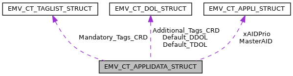

\[<a href="graph_legend.md">legend</a>\]

  ------------------------------------------------------------------------------------------------------------------------------------------------------------------------------------------------------------------------------------------------------------------------------------------------------------------------------------------------------------------------------------------------------------------------------------------------------------------------------------------------------------------------------------------------------------------------------------------------------------------------------------------------------------------------------------------------------------------------------------------------------------------------------------------------------------------------------------------------------------------------------------------------------------------------------------------------------------------------------------------------------------------------------------------------------------------------------------------------------------------------------------------------------------------------------------------------------------------------------------------------------------------------------------------------------------------------------------------------------------------------------------------------------------------------------------------------------------------------------------------------------------------------------------------------------------------------------------------------------------------------------------------------
  Data Fields                                                                                                                                                                                                                                               
  ------------------------------------------------------------------------------------------------------------- ------------------------------------------------------------------------------------------------------------------------------------------- --------------------------------------------------------------------------------------------------------------------------------------------------------------------------------------------------------------------------------------------------------------------------------------------------------------------------------------------------------------------------------------------------------------------------------------------------------------------------------------------------------------------------------------------------------------------------------------------------------------------------------------------------------------------------------------------------------------------------------------------------------------------------------------------------------------------------------------------------------------------------------------------------------------------------------------------------------------------------------------------------------------------------------------------------------------------------------------------------------------------------------------------------------------------------------------------------------------------------------------------------------------------------------------------------------------------------------------------------------------------------------------
  unsigned char                                                                                                 ACBeforeAfter                                                                                                                               TACIAC_Default handled before or after 1st GAC, only for offline only terminals, otherwise not needed Possible values see <a href="group___t_a_c___i_a_c___d_e_n_i_a_l.md">TAC/IAC DENIAL processing in case of Offline Only terminals</a>, temporary update possible, validity bit <a href="group___d_e_f___i_n_p_u_t___a_p_p_l_i.md#gad02ef5b9192f47789039e1dc2bb0a122">EMV_CT_INPUT_APL_AC_BEFOREAFTER</a> `Tag`, `Struct`, `XML` Reference: TLV tag <a href="group___v_e_r_i___p_r_i_m___t_a_g_s.md#gaa32dcaf965a2b7811278930e36be20af">TAG_DF15_OFFL_ONLY_PROCESS</a>, ACBeforeAfter in [EMV_CT_APPLIDATA_STRUCT::ACBeforeAfter](#aac6e17c9e053521b910b1eeb6a75c74c "TACIAC_Default handled before or after 1st GAC, only for offline only terminals, otherwise not needed..."), XML Tag: <a href="group___a_d_k___x_m_l___t_a_g_s.md#ga9c988c6b2daeb55ebfef17b94aedbf09">XML_TAG_APPLIDATA_AC_BEFORE_AFTER</a>.

  <a href="_e_m_v___c_t___interface_8h.md#a8dcc98031fe2890b13bc479ba57f311e">EMV_CT_DOL_TYPE</a>       Additional_Tags_CRD                                                                                                                         **<a href="deprecated.md#_deprecated000149">Deprecated:</a>** . ADK stores additional ICC tags automatically. No need to configure this anymore. Tag + maximum Length: Additional ICC tags for special applications
                                                                                                                                                                                                                                                            e.g. domestic cards with additional tags in ReadRecords, fleetcards with additional customer specific tags and others
                                                                                                                                                                                                                                                            see <a href="_e_m_v___c_t___interface_8h.md#struct_e_m_v___c_t___d_o_l___s_t_r_u_c_t">EMV_CT_DOL_STRUCT</a>, temporary update possible, validity bit <a href="group___d_e_f___i_n_p_u_t___a_p_p_l_i.md#ga5cd4646f7f4cf0d43df97abec7be72bf">EMV_CT_INPUT_APL_ADD_CRD_TAGS</a>
                                                                                                                                                                                                                                                            `Tag`, `Struct`, `XML` Reference:
                                                                                                                                                                                                                                                            TLV tag <a href="group___v_e_r_i___p_r_i_m___t_a_g_s.md#ga6dfa73e43cd6f1a0a956d8a20d42efeb">TAG_DF2C_ADD_TAGS_CRD</a>,
                                                                                                                                                                                                                                                            Additional_Tags_CRD in [EMV_CT_APPLIDATA_STRUCT::Additional_Tags_CRD](#acd89bdbc00f19a23befec2eed0ff7b00),
                                                                                                                                                                                                                                                            XML Tag: <a href="group___a_d_k___x_m_l___t_a_g_s.md#ga4aa7498018941c11031f732a702ed08f">XML_TAG_APPLIDATA_ADDITIONAL_TAGS_CRD</a>

  unsigned char                                                                                                 Additional_Tags_TRM\[<a href="_e_m_v___common___interface_8h.md#a9107c96b920b33b2e87a300066027170">EMV_ADK_ADD_TAG_SIZE</a>\]      Tag + Length + Value: Additional terminal data for special applications Example: MasterCard 9F53, temporary update possible, validity bit <a href="group___d_e_f___i_n_p_u_t___a_p_p_l_i.md#ga6524e8d2866539c261df0e931efbdbd3">EMV_CT_INPUT_APL_ADD_TAGS</a> `Tag`, `Struct`, `XML` Reference: TLV tag <a href="group___v_e_r_i___p_r_i_m___t_a_g_s.md#gabe548a652e3c1ccbb0c36443f0cab24e">TAG_DF29_ADD_TAGS</a>, Additional_Tags_TRM in [EMV_CT_APPLIDATA_STRUCT::Additional_Tags_TRM](#ad7a6039ab1aa91113c012eab4293d664 "Tag + Length + Value: Additional terminal data for special applications   Example: MasterCard 9F53,..."), XML Tag: <a href="group___a_d_k___x_m_l___t_a_g_s.md#ga3ebc4e2121dd29d4a0c29bf0662fc2da">XML_TAG_APPLIDATA_ADDITIONAL_TAGS_TRM</a>.

  unsigned char                                                                                                 Additional_Versions_No\[2 \*<a href="_e_m_v___c_t___interface_8h.md#a87b0e0708e0690ad0c48e3a60bd165a5">EMV_CT_MAX_APP_VERS</a>\]   up to 10 additional version numbers, optional if needed for compliance (Velocity up to 2), temporary update possible, validity bit <a href="group___d_e_f___i_n_p_u_t___a_p_p_l_i.md#gab54d7a9bba15c1fe593246139740229c">EMV_CT_INPUT_APL_ADD_VERSIONS</a> `Tag`, `Struct`, `XML` Reference: TLV tag <a href="group___v_e_r_i___p_r_i_m___t_a_g_s.md#ga1711621294dec8693e50c73502873cb8">TAG_DF5F_ADD_APP_VERSION</a>, Additional_Versions_No in [EMV_CT_APPLIDATA_STRUCT::Additional_Versions_No](#a88b324674895d7548b40c7d597cdf84d "up to 10 additional version numbers, optional if needed for compliance (Velocity up to 2),..."), XML Tag: <a href="group___a_d_k___x_m_l___t_a_g_s.md#ga31257afdc52fda5212500ffdbef44c25">XML_TAG_APPLIDATA_ADD_VER_NUM</a>

  unsigned char                                                                                                 AIP_CVM_not_supported                                                                                                                       Behaviour for AIP \'CVM not supported\', see <a href="group___c_v_m___n_o_t___s_u_p_p.md">Byte defines for CVM not supported / CVM not required</a>, temporary update possible, validity bit <a href="group___d_e_f___i_n_p_u_t___a_p_p_l_i.md#ga12b949b39aa59affaf8ea075d858a7fd">EMV_CT_INPUT_APL_AIP_CVM_NOTSUPP</a> `Tag`, `Struct`, `XML` Reference: TLV tag <a href="group___v_e_r_i___p_r_i_m___t_a_g_s.md#ga3a9cba27229ecde4c3c6231eaf09e591">TAG_DF2E_CVM_NOT_SUPP</a>, AIP_CVM_not_supported in [EMV_CT_APPLIDATA_STRUCT::AIP_CVM_not_supported](#a0cc466b7328ef1933036d1372ba99b00 "Behaviour for AIP 'CVM not supported', see Byte defines for CVM not supported / CVM not required,..."), XML Tag: <a href="group___a_d_k___x_m_l___t_a_g_s.md#gaed8babbf2d6ae2cae216077a1c86cc77">XML_TAG_APPLIDATA_AIP_CVM_NOT_SUPPORTED</a>.

  unsigned char                                                                                                 App_CountryCodeTerm\[2\]                                                                                                                    Change \"Terminal country code\" (<a href="group___d_e_f___c_o_n_f___t_e_r_m.md#af11a6d7b3bb1f5438dca672b746aeb11">EMV_CT_TERMDATA_STRUCT::TermCountryCode</a>) (e.g. VISA Germany 0276), temporary update possible, validity bit <a href="group___d_e_f___i_n_p_u_t___a_p_p_l_i.md#ga23fbe1e0df3ae5908386f073e82fbffc">EMV_CT_INPUT_APL_COUNTRY_CODE</a> `Tag`, `Struct`, `XML` Reference: TLV tag <a href="group___e_m_v_c_o___t_a_g_s.md#ga5bc987c3686fd5821f20d21015354787">TAG_9F1A_TRM_COUNTRY_CODE</a>, App_CountryCodeTerm in [EMV_CT_APPLIDATA_STRUCT::App_CountryCodeTerm](#a3cc1a7ad9805c9caf22a3164e3f1d326 "Change "Terminal country code" (EMV_CT_TERMDATA_STRUCT::TermCountryCode) (e.g. VISA Germany 0276),..."), XML Tag: <a href="group___a_d_k___x_m_l___t_a_g_s.md#ga834453de1096e1827ebe688eaab110f8">XML_TAG_APPLIDATA_COUNTRY_CODE_TERM</a>.

  unsigned char                                                                                                 App_FlowCap\[5\]                                                                                                                            Configure special application characteristics, see <a href="group___a_p_p___f_l_o_w___c_a_p_s.md">Defines for Application flow capabilities</a>, temporary update possible, validity bit <a href="group___d_e_f___i_n_p_u_t___a_p_p_l_i.md#ga90eda81c6374249fce8a0bde0803c342">EMV_CT_INPUT_APL_FLOW_CAPS</a> TLV tag <a href="group___v_e_r_i___p_r_i_m___t_a_g_s.md#ga732d040746d77b79e9ab53e4ab4abcf6">TAG_DF2B_APP_FLOW_CAP</a>, XML Tag: <a href="group___a_d_k___x_m_l___t_a_g_s.md#ga50d78399df4e3c11369093dc4e841d7d">XML_TAG_APPLIDATA_APP_FLOW_CAP</a>.

  unsigned char                                                                                                 App_TermAddCap\[5\]                                                                                                                         Overwrite global \"additional terminal capabilities\" (`TermAddCap` in <a href="group___d_e_f___c_o_n_f___t_e_r_m.md#struct_e_m_v___c_t___t_e_r_m_d_a_t_a___s_t_r_u_c_t">EMV_CT_TERMDATA_STRUCT</a>) for this application, only 1st byte is effective, temporary update possible, validity bit <a href="group___d_e_f___i_n_p_u_t___a_p_p_l_i.md#ga6214399bb522a66553de15f268663d87">EMV_CT_INPUT_APL_ADD_TERM_CAPS</a> Can also be changed by <a href="group___f_u_n_c___f_l_o_w.md#gad3dd36d27d5fa94d3f302dc4a4546b70">EMV_CT_updateTxnTags()</a> `Tag`, `Struct`, `XML` Reference: TLV tag <a href="group___e_m_v_c_o___t_a_g_s.md#ga5670c7d223a0af749d5b8b251e32f870">TAG_9F40_ADD_TRM_CAP</a>, App_TermAddCap in [EMV_CT_APPLIDATA_STRUCT::App_TermAddCap](#aa137395f6cc0b7618d9fec892c3c8b00 "Overwrite global "additional terminal capabilities" (TermAddCap in EMV_CT_TERMDATA_STRUCT) for this a..."), XML Tag: <a href="group___a_d_k___x_m_l___t_a_g_s.md#ga0a15bcaf24ec34bfde9b5a49217c7422">XML_TAG_APPLIDATA_APP_TERM_ADD_CAP</a>.

  unsigned char                                                                                                 App_TermCap\[3\]                                                                                                                            Overwrite global \"terminal capabilities\" (`TermCap` in <a href="group___d_e_f___c_o_n_f___t_e_r_m.md#struct_e_m_v___c_t___t_e_r_m_d_a_t_a___s_t_r_u_c_t">EMV_CT_TERMDATA_STRUCT</a>) for this application Can also be changed by <a href="group___f_u_n_c___f_l_o_w.md#gad3dd36d27d5fa94d3f302dc4a4546b70">EMV_CT_updateTxnTags()</a> temporary update possible, validity bit <a href="group___d_e_f___i_n_p_u_t___a_p_p_l_i.md#ga9a89428b080a0f8b7a12058a0fa96e3d">EMV_CT_INPUT_APL_TERM_CAPS</a> `Tag`, `Struct`, `XML` Reference: TLV tag <a href="group___e_m_v_c_o___t_a_g_s.md#gad3ec876483505eb23aad4e1b210653f5">TAG_9F33_TRM_CAPABILITIES</a>, App_TermCap in [EMV_CT_APPLIDATA_STRUCT::App_TermCap](#a7ac173f4a1d9a3845a18af806ee8bb31 "Overwrite global "terminal capabilities" (TermCap in EMV_CT_TERMDATA_STRUCT) for this application   C..."), XML Tag: <a href="group___a_d_k___x_m_l___t_a_g_s.md#ga96e3d7de6bd5ffc66025301ce777531b">XML_TAG_APPLIDATA_APP_TERM_CAP</a>.

  unsigned char                                                                                                 App_TermTyp                                                                                                                                 Terminal type, possible values see <a href="group___t_e_r_m___t_y_p_e_s.md">Terminaltypes (Tag 9F35)</a>) mandatory for first call of <a href="group___f_u_n_c___c_o_n_f.md#ga351c2deba9865081c314d818463f20c9">EMV_CT_SetTermData()</a> Can also be changed by <a href="group___f_u_n_c___f_l_o_w.md#gad3dd36d27d5fa94d3f302dc4a4546b70">EMV_CT_updateTxnTags()</a> temporary update possible, validity bit <a href="group___d_e_f___i_n_p_u_t___a_p_p_l_i.md#gac8489e7df9188cc84c052acd86c4d99a">EMV_CT_INPUT_APL_TRM_TYPE</a> `Tag`, `Struct`, `XML` Reference: TLV tag <a href="group___e_m_v_c_o___t_a_g_s.md#gace5b4ef50a58d29b2f5296c2c17273c9">TAG_9F35_TRM_TYPE</a>, App_TermTyp in [EMV_CT_APPLIDATA_STRUCT::App_TermTyp](#ae3ea58006297dfb1045a9ff86831112e "Terminal type, possible values see Terminaltypes (Tag 9F35))   mandatory for first call of EMV_CT_Set..."), XML Tag: <a href="group___a_d_k___x_m_l___t_a_g_s.md#ga715c2019507324bd280553d4a2515127">XML_TAG_APPLIDATA_APP_TERM_TYP</a>.

  unsigned char                                                                                                 AppName\[16+1\]                                                                                                                             Default application name to be used in case application label (tag 50) and application preferred name (tag 9F12) are not read from chip, temporary update possible, validity bit <a href="group___d_e_f___i_n_p_u_t___a_p_p_l_i.md#ga932af997ee523cd74556f8e8c2d4ecee">EMV_CT_INPUT_APL_NAME</a> `Tag`, `Struct`, `XML` Reference: TLV tag <a href="group___e_m_v_c_o___t_a_g_s.md#ga70b6da94fde0a697b05755cdfc084023">TAG_50_APP_LABEL</a>, AppName in [EMV_CT_APPLIDATA_STRUCT::AppName](#a1a933985680b099e926e54086a602c12 "Default application name to be used in case application label (tag 50) and application preferred name..."), XML Tag: <a href="group___a_d_k___x_m_l___t_a_g_s.md#ga0e796259cace748a875c804a6bdc342b">XML_TAG_APPLIDATA_APP_NAME</a>.

  unsigned char                                                                                                 ASI                                                                                                                                         Application selection indicator Must the card\'s AID match the configured AID exactly? `0` \... yes `1` \... no recommended mandatory for <a href="group___f_u_n_c___c_o_n_f.md#ga73ca1735defbb65a1aae2ead1de70233">EMV_CT_SetAppliData</a>, no temporary update, validity bit <a href="group___d_e_f___i_n_p_u_t___a_p_p_l_i.md#gad2248942bf630be611652aeb8860cfc2">EMV_CT_INPUT_APL_ASI</a> `Tag`, `Struct`, `XML` Reference: TLV tag <a href="group___v_e_r_i___p_r_i_m___t_a_g_s.md#ga3ec6eef8ef2baf5298bba904c5339614">TAG_DF20_ASI</a>, ASI in [EMV_CT_APPLIDATA_STRUCT::ASI](#a2000688e48cdadee86eb401946a71785 "Application selection indicator   Must the card's AID match the configured AID exactly?..."), XML Tag: <a href="group___a_d_k___x_m_l___t_a_g_s.md#ga2e5b4d6bc8885bd582a8c8a53988adeb">XML_TAG_APPLIDATA_ASI</a>.

  unsigned char                                                                                                 BrKey\[2\]                                                                                                                                  Merchant category code recommended mandatory for <a href="group___f_u_n_c___c_o_n_f.md#ga73ca1735defbb65a1aae2ead1de70233">EMV_CT_SetAppliData()</a>, temporary update possible, validity bit <a href="group___d_e_f___i_n_p_u_t___a_p_p_l_i.md#ga4ad26154aa32520b74498b9d80a2b9d2">EMV_CT_INPUT_APL_MERCHANT_CATCODE</a> Can also be changed by <a href="group___f_u_n_c___f_l_o_w.md#gad3dd36d27d5fa94d3f302dc4a4546b70">EMV_CT_updateTxnTags()</a> `Tag`, `Struct`, `XML` Reference: TLV tag <a href="group___e_m_v_c_o___t_a_g_s.md#ga41481cf04242a0ba441c87f6a1569639">TAG_9F15_MERCH_CATEG_CODE</a>, BrKey in [EMV_CT_APPLIDATA_STRUCT::BrKey](#aadaaf73921101bb812f90ec7c4a9d5dd "Merchant category code   recommended mandatory for EMV_CT_SetAppliData(), temporary update possible,..."), XML Tag: <a href="group___a_d_k___x_m_l___t_a_g_s.md#ga1c91e30ac44b2fd1c9c90e2d5ab2f2da">XML_TAG_APPLIDATA_BR_KEY</a>.

  unsigned char                                                                                                 Capabilities_belowLimit\[3\]                                                                                                                Below security limit terminal capabilities (e.g. cardholder verification methods) for CT chip transactions below the CVM / Security limit, temporary update possible, validity bit: <a href="group___d_e_f___i_n_p_u_t___a_p_p_l_i.md#ga530a800dd545eecc4b1c239c9d350e77">EMV_CT_INPUT_APL_SEC_CAPS</a> `Tag`, `Struct`, `XML` Reference: TLV tag <a href="group___v_e_r_i___p_r_i_m___t_a_g_s.md#gad704c3335371f34032189ddcfa98c9d9">TAG_DF4A_APL_SEC_CAPS</a>, Capabilities_belowLimit in [EMV_CT_APPLIDATA_STRUCT::Capabilities_belowLimit](#aef46aa8782c04a197abd81f77dc5c8ed "Below security limit terminal capabilities (e.g. cardholder verification methods) for CT chip transac..."), XML Tag: <a href="group___a_d_k___x_m_l___t_a_g_s.md#ga02f0c87378e69fd62aec80a35fe0e578">XML_TAG_APPLIDATA_NON_SECURE_CAPS</a>.

  unsigned char                                                                                                 CDAProcessing                                                                                                                               CDA processing, maximum security or maximum speed, for values see <a href="group___c_d_a___m_o_d_e_s.md#gaf4e4adcb8dba96f4ad804dc4332fce06">CDA_EMV_MODE_1</a>, <a href="group___c_d_a___m_o_d_e_s.md#gaaf80f922201edaafe4b14c7e4609c853">CDA_EMV_MODE_2</a>, <a href="group___c_d_a___m_o_d_e_s.md#ga92def0243da1dbd619c1f3196dc97342">CDA_EMV_MODE_3</a>, <a href="group___c_d_a___m_o_d_e_s.md#ga194ba072d406952b851d7c5302c6870d">CDA_EMV_MODE_4</a>, temporary update possible, validity bit <a href="group___d_e_f___i_n_p_u_t___a_p_p_l_i.md#ga321282e3d102e5aab562ed1e11895825">EMV_CT_INPUT_APL_CDA</a> `Tag`, `Struct`, `XML` Reference: TLV tag <a href="group___v_e_r_i___p_r_i_m___t_a_g_s.md#ga26b711050e9aefc38b967f67dffa6619">TAG_DF3E_CDA_PROC</a>, CDAProcessing in [EMV_CT_APPLIDATA_STRUCT::CDAProcessing](#a2673654f6fac8e005bb4cb45dec325ed "CDA processing, maximum security or maximum speed, for values see CDA_EMV_MODE_1, CDA_EMV_MODE_2,..."), XML Tag: <a href="group___a_d_k___x_m_l___t_a_g_s.md#ga2ca269e927e2201872845e0c77b6604f">XML_TAG_APPLIDATA_CDA_PROCESSING</a>.

  unsigned char                                                                                                 Chksum_Params\[5\]                                                                                                                          Terminal parameters defined as major, see <a href="group___c_h_k_s_u_m___d_e_f_s.md">Defines for EMVCo checksum calculation</a> **only for checksum calculation** not all of those parameters are configurable yet but may be in future, no temporary update, validity bit <a href="group___d_e_f___i_n_p_u_t___a_p_p_l_i.md#ga43c0ab0709a8a2b49d98fa878c4604de">EMV_CT_INPUT_APL_CHECKSUM_PARAMS</a> `Tag`, `Struct`, `XML` Reference: TLV tag <a href="group___v_e_r_i___p_r_i_m___t_a_g_s.md#ga8d1957a446ea91132fb417a0d8d0cd87">TAG_DF13_TERM_PARAM</a>, Chksum_Params in [EMV_CT_APPLIDATA_STRUCT::Chksum_Params](#a906f3a211340298f467942b94e57010e "Terminal parameters defined as major, see Defines for EMVCo checksum calculation    only for checksum..."), XML Tag: <a href="group___a_d_k___x_m_l___t_a_g_s.md#ga1bea96b6e55c18fe7225c7ef0707f45d">XML_TAG_APPLIDATA_CHKSUM_PARAMS</a>.

  char                                                                                                          ChksumASCIIEMVCO\[<a href="group___a_d_k___l_i_m_i_t_s.md#ga9b9c110ea297c64e70f6847acd351032">EMV_ADK_CHECKSUM_ASCII_SIZE</a>\]    EMVCo checksum dynamically calculated by the configuration only valid for <a href="group___f_u_n_c___c_o_n_f.md#ga363163e375895b7d3ad03ace5df5d0d3">EMV_CT_GetAppliData</a>, validity bit <a href="group___d_e_f___i_n_p_u_t___a_p_p_l_i.md#ga164fc93a15b4268f04cb133ef89f6988">EMV_CT_INPUT_APL_CHECKSUM</a> `Tag`, `Struct`, `XML` Reference: TLV tag <a href="group___v_e_r_i___p_r_i_m___t_a_g_s.md#gaf795532d38b6fd7fe5e4b9aeeda03a58">TAG_DF12_CHECKSUM</a>, ChksumASCIIEMVCO in [EMV_CT_APPLIDATA_STRUCT::ChksumASCIIEMVCO](#ae6aab5905479e56d87c421779d57b603 "EMVCo checksum dynamically calculated by the configuration   only valid for EMV_CT_GetAppliData,..."), XML Tag: <a href="group___a_d_k___x_m_l___t_a_g_s.md#ga9916553d54022e9ff269b4d9e82f7658">XML_TAG_APPLIDATA_CHKSUM_ASCII_EMVCO</a>.

  unsigned char                                                                                                 Customer_CVM                                                                                                                                non-EMVCo CVM code (byte 1, b6-b1 of CV rule) supported by this AID (ranges 100000-101111 and 110000-111110 are allowed), temporary update possible, validity bit <a href="group___d_e_f___i_n_p_u_t___a_p_p_l_i.md#gad4324ccb06107ffc964212f1c8f5db18">EMV_CT_INPUT_APL_CUSTOMER_CVM</a> `Tag`, `Struct`, `XML` Reference: TLV tag <a href="group___v_e_r_i___p_r_i_m___t_a_g_s.md#gae344911761717940db3f2e07f3e6363a">TAG_DF2F_CVM_CUSTOM</a>, Customer_CVM in [EMV_CT_APPLIDATA_STRUCT::Customer_CVM](#afbad69449ba81d43f2d6a43309443bc6 "non-EMVCo CVM code (byte 1, b6-b1 of CV rule) supported by this AID (ranges 100000-101111 and 110000-..."), XML Tag: <a href="group___a_d_k___x_m_l___t_a_g_s.md#ga9051fee0ad29cbed93a4fe88f74e2a88">XML_TAG_APPLIDATA_CUSTOMER_CVM</a>

  unsigned char                                                                                                 DataContainerReadIds\[89\]                                                                                                                  Data Container Read List for DPAS-2 Data Storage feature. This is a list of container IDs each 4 byte. First byte is the number of container IDs Can be used in combination with [DataContainerReadRanges](#a418acaa9bb3b4d2a70442c50205f69a3 "Data Container Read List for DPAS-2 Data Storage feature. This is a list of container ID ranges consi..."). Temporary update possible, validity bit: <a href="group___d_e_f___i_n_p_u_t___a_p_p_l_i.md#gaf749792412c8972eef629ee6a87c3354">EMV_CT_INPUT_APL_DCR_LIST_IDS</a> TLV tag: <a href="group___v_e_r_i___p_r_i_m___t_a_g_s__3_b_y_t_e.md#gacca3b2f66195b57095be5242cc7c747e">TAG_DFAB58_DCR_LIST_IDS</a>, XML Tag: <a href="group___a_d_k___x_m_l___t_a_g_s.md#ga0662ce42e415d68b627a754d7e0e5259">XML_TAG_APPLIDATA_DCR_LIST_IDS</a>.

  unsigned char                                                                                                 DataContainerReadRanges\[89\]                                                                                                               Data Container Read List for DPAS-2 Data Storage feature. This is a list of container ID ranges consisting of each 8 byte, 4 byte start container ID and 4 byte stop container ID. First byte is the number of Container ranges. Can be used in combination with [DataContainerReadIds](#a94cdb96dc0c72d50b22bc9ee29c25b9f "Data Container Read List for DPAS-2 Data Storage feature. This is a list of container IDs each 4 byte..."). Temporary update possible, validity bit: <a href="group___d_e_f___i_n_p_u_t___a_p_p_l_i.md#gad50c4a902dd130e7204317f31ec43a98">EMV_CT_INPUT_APL_DCR_LIST_RANGES</a> TLV tag: <a href="group___v_e_r_i___p_r_i_m___t_a_g_s__3_b_y_t_e.md#ga4e900f633bb23ee6490e0cfe6e7e32aa">TAG_DFAB59_DCR_LIST_RANGES</a>, XML Tag: <a href="group___a_d_k___x_m_l___t_a_g_s.md#ga3bc8db0b4aa5a989af015dd298b16c7b">XML_TAG_APPLIDATA_DCR_LIST_RANGES</a>.

  <a href="_e_m_v___c_t___interface_8h.md#a8dcc98031fe2890b13bc479ba57f311e">EMV_CT_DOL_TYPE</a>       Default_DDOL                                                                                                                                Default DDOL (1st byte: length), maximum length see <a href="group___a_d_k___l_i_m_i_t_s.md#gaa08617397087858bb1ca9c3a7830bb12">EMV_ADK_MAX_LG_DDOL</a> see <a href="_e_m_v___c_t___interface_8h.md#struct_e_m_v___c_t___d_o_l___s_t_r_u_c_t">EMV_CT_DOL_STRUCT</a>, temporary update possible, validity bit <a href="group___d_e_f___i_n_p_u_t___a_p_p_l_i.md#ga2d3455d96b50bbe6534326fb64dafd20">EMV_CT_INPUT_APL_DDOL</a> `Tag`, `Struct`, `XML` Reference: TLV tag <a href="group___v_e_r_i___p_r_i_m___t_a_g_s.md#ga3fcfb3993a3c7ff601286499651bca9a">TAG_DF28_DEFAULT_DDOL</a>, Default_DDOL in [EMV_CT_APPLIDATA_STRUCT::Default_DDOL](#a27e03203f154c52be3abc2db49842a93 "Default DDOL (1st byte: length), maximum length see EMV_ADK_MAX_LG_DDOL   see EMV_CT_DOL_STRUCT,..."), XML Tag: <a href="group___a_d_k___x_m_l___t_a_g_s.md#gac12bfacfb1082a80fa10aee3569aaf30">XML_TAG_APPLIDATA_DEFAULT_DDOL</a>.

  <a href="_e_m_v___c_t___interface_8h.md#a8dcc98031fe2890b13bc479ba57f311e">EMV_CT_DOL_TYPE</a>       Default_TDOL                                                                                                                                Default TDOL (1st byte: length), maximum length see <a href="group___a_d_k___l_i_m_i_t_s.md#ga35fcdb8dd0661988e68a90ced11a8db6">EMV_ADK_MAX_LG_TDOL</a> see <a href="_e_m_v___c_t___interface_8h.md#struct_e_m_v___c_t___d_o_l___s_t_r_u_c_t">EMV_CT_DOL_STRUCT</a>, temporary update possible, validity bit <a href="group___d_e_f___i_n_p_u_t___a_p_p_l_i.md#ga66b7fd71d420257e69f289b2dc56d5e7">EMV_CT_INPUT_APL_TDOL</a> `Tag`, `Struct`, `XML` Reference: TLV tag <a href="group___v_e_r_i___p_r_i_m___t_a_g_s.md#ga10531a229294794d67f4d817ae2e7bac">TAG_DF27_DEFAULT_TDOL</a>, Default_TDOL in [EMV_CT_APPLIDATA_STRUCT::Default_TDOL](#a9741f7d86efbb9dc20f687b6cad55f4c "Default TDOL (1st byte: length), maximum length see EMV_ADK_MAX_LG_TDOL   see EMV_CT_DOL_STRUCT,..."), XML Tag: <a href="group___a_d_k___x_m_l___t_a_g_s.md#ga1876212b8287be7382ad6c45c8e22596">XML_TAG_APPLIDATA_DEFAULT_TDOL</a>.

  unsigned char                                                                                                 EMV_Application                                                                                                                             `xx` = EMV-Application (or similar), `0xFF` = non-EMV-Application (not handled by standard L2 kernel), no temporary update, validity bit <a href="group___d_e_f___i_n_p_u_t___a_p_p_l_i.md#ga8d7f564f9da500647def2ae7ac3d214f">EMV_CT_INPUT_APL_EMV_APPKIND</a> `Tag`, `Struct`, `XML` Reference: TLV tag <a href="group___v_e_r_i___p_r_i_m___t_a_g_s.md#ga85a1fd825ffae412a17f45249da1bc69">TAG_DF2D_EMV_APPLI</a>, EMV_Application in [EMV_CT_APPLIDATA_STRUCT::EMV_Application](#a04624c8cc1358b3d029f8c77a930c0c6 "xx = EMV-Application (or similar), 0xFF = non-EMV-Application (not handled by standard L2 kernel),..."), XML Tag: <a href="group___a_d_k___x_m_l___t_a_g_s.md#ga1934ad2be00923729082b211703c8567">XML_TAG_APPLIDATA_EMV_APPLICATION</a>

  unsigned char                                                                                                 FloorLimit\[4\]                                                                                                                             Terminal floor limit (binary coded) recommended mandatory for <a href="group___f_u_n_c___c_o_n_f.md#ga73ca1735defbb65a1aae2ead1de70233">EMV_CT_SetAppliData()</a> Can also be changed by <a href="group___f_u_n_c___f_l_o_w.md#gad3dd36d27d5fa94d3f302dc4a4546b70">EMV_CT_updateTxnTags()</a> temporary update possible, validity bit <a href="group___d_e_f___i_n_p_u_t___a_p_p_l_i.md#ga65b5bab068258243ab5dabe904abea37">EMV_CT_INPUT_APL_FLOOR_LIMIT</a> `Tag`, `Struct`, `XML` Reference: TLV tag <a href="group___e_m_v_c_o___t_a_g_s.md#gab275fa140f8e21bda8e1d0bdafe47602">TAG_9F1B_TRM_FLOOR_LIMIT</a>, FloorLimit in [EMV_CT_APPLIDATA_STRUCT::FloorLimit](#ac5fb4232c2d98685b61df7884ccfbaf5 "Terminal floor limit (binary coded)   recommended mandatory for EMV_CT_SetAppliData()   Can also be c..."), XML Tag: <a href="group___a_d_k___x_m_l___t_a_g_s.md#gabe783b9ab1c5589bab73048ec67cf8e9">XML_TAG_APPLIDATA_FLOOR_LIMIT</a>.

  unsigned char                                                                                                 Info_Included_Data\[8\]                                                                                                                     Which data is included in the message, see <a href="group___d_e_f___i_n_p_u_t___a_p_p_l_i.md">Application data: Which data is included</a>.

  <a href="_e_m_v___c_t___interface_8h.md#a7c8023f182acd35c88eb93cec83b694f">EMV_CT_TAGLIST_TYPE</a>   Mandatory_Tags_CRD                                                                                                                          Tags only: These tags must be provided by the card, otherwise the transaction is terminated. The default implemetation should be an empty list (standard EMVCo settings will automatically apply). This is for fulfilling requirements of domestic specifications. see <a href="_e_m_v___c_t___interface_8h.md#struct_e_m_v___c_t___t_a_g_l_i_s_t___s_t_r_u_c_t">EMV_CT_TAGLIST_STRUCT</a>, temporary update possible, validity bit <a href="group___d_e_f___i_n_p_u_t___a_p_p_l_i.md#ga7a26a94b830ad72eb8a219b0a7aef026">EMV_CT_INPUT_APL_MAND_TAGS</a> `Tag`, `Struct`, `XML` Reference: TLV tag <a href="group___v_e_r_i___p_r_i_m___t_a_g_s.md#ga5bbea3e13a9e17f2227d3756a0c8665b">TAG_DF2A_DUTY_TAGS</a>, Mandatory_Tags_CRD in [EMV_CT_APPLIDATA_STRUCT::Mandatory_Tags_CRD](#a15601aa3b54c9da3032a3ed1d43b0b6b "Tags only: These tags must be provided by the card, otherwise the transaction is terminated...."), XML Tag: <a href="group___a_d_k___x_m_l___t_a_g_s.md#ga7ac889dd15056267afb8020e33de5ce6">XML_TAG_APPLIDATA_TAGLIST</a>.

  <a href="_e_m_v___c_t___interface_8h.md#ae836cd33e4343219ad6106a383afd876">EMV_CT_APPLI_TYPE</a>     MasterAID                                                                                                                                   Master AID with the same parameters (stored for grouping reasons) Struct definition: <a href="_e_m_v___c_t___interface_8h.md#struct_e_m_v___c_t___a_p_p_l_i___s_t_r_u_c_t">EMV_CT_APPLI_STRUCT</a> Request to configure more than one AID at once, no temporary update, validity bit <a href="group___d_e_f___i_n_p_u_t___a_p_p_l_i.md#gac94317348011c3e8528affa8f5846787">EMV_CT_INPUT_APL_MASTER_AID</a> `Tag`, `Struct`, `XML` Reference: TLV tag <a href="group___v_e_r_i___p_r_i_m___t_a_g_s.md#ga939333f4c5c2e500beb9b06d6939fb23">TAG_DF04_AID</a>, MasterAID in [EMV_CT_APPLIDATA_STRUCT::MasterAID](#a4844ee77295b43631df410adb1beaf41 "Master AID with the same parameters (stored for grouping reasons)   Struct definition: EMV_CT_APPLI_S..."), XML Tag: <a href="group___a_d_k___x_m_l___t_a_g_s.md#gab39766fa922ae19d4827eae5fd14dab2">XML_TAG_APPLIDATA_MASTER_AID</a>.

  unsigned char                                                                                                 MaxTargetPercentage                                                                                                                         Maximum target percentage (BCD coded) for random online selection during risk management recommended mandatory for <a href="group___f_u_n_c___c_o_n_f.md#ga73ca1735defbb65a1aae2ead1de70233">EMV_CT_SetAppliData</a>, temporary update possible, validity bit <a href="group___d_e_f___i_n_p_u_t___a_p_p_l_i.md#ga7ca0d41a5e2de3c3b9f34d9f3c90c35f">EMV_CT_INPUT_APL_MAXTARGET</a> `Tag`, `Struct`, `XML` Reference: TLV tag <a href="group___v_e_r_i___p_r_i_m___t_a_g_s.md#gacf7f922e89e073e7b095468414b8afbd">TAG_DF25_MAXPERCENT_ONL</a>, MaxTargetPercentage in [EMV_CT_APPLIDATA_STRUCT::MaxTargetPercentage](#ae06a2f3428cf719f7fc1523a2e2b9fce "Maximum target percentage (BCD coded) for random online selection during risk management   recommende..."), XML Tag: <a href="group___a_d_k___x_m_l___t_a_g_s.md#gaeb5c69b544617e33b0349a39089f1a16">XML_TAG_APPLIDATA_MAX_TARGET_PERCENTAGE</a>.

  unsigned char                                                                                                 MerchIdent\[15\]                                                                                                                            Merchant Identifier recommended mandatory for <a href="group___f_u_n_c___c_o_n_f.md#ga73ca1735defbb65a1aae2ead1de70233">EMV_CT_SetAppliData()</a> temporary update possible, can also be changed by <a href="group___f_u_n_c___f_l_o_w.md#gad3dd36d27d5fa94d3f302dc4a4546b70">EMV_CT_updateTxnTags()</a> validity bit <a href="group___d_e_f___i_n_p_u_t___a_p_p_l_i.md#ga932404bc4568e388b35d46434ee7ccf2">EMV_CT_INPUT_APL_MERCHANT_IDENT</a> `Tag`, `Struct`, `XML` Reference: TLV tag <a href="group___e_m_v_c_o___t_a_g_s.md#ga184ccaaef50ada9988bfd4af37b8c9fb">TAG_9F16_MERCHANT_ID</a>, MerchIdent in [EMV_CT_APPLIDATA_STRUCT::MerchIdent](#a3e3c059a7e2f459a449ab7e746046cf7 "Merchant Identifier   recommended mandatory for EMV_CT_SetAppliData()   temporary update possible,..."), XML Tag: <a href="group___a_d_k___x_m_l___t_a_g_s.md#ga7ae8ff8350d9527942bb5c969e16e237">XML_TAG_APPLIDATA_MERCH_IDENT</a>.

  unsigned char                                                                                                 POS_EntryMode                                                                                                                               POS entry mode according ISO 8583:1987 Can also be changed by <a href="group___f_u_n_c___f_l_o_w.md#gad3dd36d27d5fa94d3f302dc4a4546b70">EMV_CT_updateTxnTags()</a> temporary update possible, validity bit <a href="group___d_e_f___i_n_p_u_t___a_p_p_l_i.md#ga6afd6ee616691cf5fb77ff9b34ae0870">EMV_CT_INPUT_APL_POS_ENTRY</a> `Tag`, `Struct`, `XML` Reference: TLV tag <a href="group___e_m_v_c_o___t_a_g_s.md#ga52532bf55c516d8055dcba4695fdc159">TAG_9F39_POS_ENTRY_MODE</a>, POS_EntryMode in [EMV_CT_APPLIDATA_STRUCT::POS_EntryMode](#a9cec52ed8e47c79a53adb21646bf136e "POS entry mode according ISO 8583:1987   Can also be changed by EMV_CT_updateTxnTags()   temporary up..."), XML Tag: <a href="group___a_d_k___x_m_l___t_a_g_s.md#ga8e9158f247d6c7011eaa3cd93507b214">XML_TAG_APPLIDATA_POS_ENTRY_MODE</a>.

  unsigned char                                                                                                 Security_Limit\[4\]                                                                                                                         General: Binary coded Below this limit simplified termcaps may take place, e.g. CVM processing is skipped/handled as per parameter, temporary update possible, validity bit: <a href="group___d_e_f___i_n_p_u_t___a_p_p_l_i.md#gacf94afe7627d9ca7af878e65f1c0616b">EMV_CT_INPUT_APL_SEC_LIMIT</a> `Tag`, `Struct`, `XML` Reference: TLV tag <a href="group___v_e_r_i___p_r_i_m___t_a_g_s.md#ga773accbac8ce408209a6e2e58d5370de">TAG_DF49_APL_SEC_LIMIT</a>, Security_Limit in [EMV_CT_APPLIDATA_STRUCT::Security_Limit](#afa6752c96d0046c68e76710aee5a070f "General: Binary coded   Below this limit simplified termcaps may take place, e.g. CVM processing is s..."), XML Tag: <a href="group___a_d_k___x_m_l___t_a_g_s.md#gaa28af81dc810f58ba4bef8c3d15ce296">XML_TAG_APPLIDATA_SECURE_LIMIT</a>.

  unsigned char                                                                                                 TACDefault\[5\]                                                                                                                             Terminal Action Code - Default recommended mandatory for <a href="group___f_u_n_c___c_o_n_f.md#ga73ca1735defbb65a1aae2ead1de70233">EMV_CT_SetAppliData</a>, temporary update possible, validity bit <a href="group___d_e_f___i_n_p_u_t___a_p_p_l_i.md#ga9e349187d15d9a7d1d50f852f87dd5d2">EMV_CT_INPUT_APL_TAC_DEFAULT</a> `Tag`, `Struct`, `XML` Reference: TLV tag <a href="group___v_e_r_i___p_r_i_m___t_a_g_s.md#ga588b92246f48302d61cc055baf122dda">TAG_DF23_TAC_DEFAULT</a>, TACDefault in [EMV_CT_APPLIDATA_STRUCT::TACDefault](#a6ce1deed9d23bcc207bfb582f59cac6b "Terminal Action Code - Default   recommended mandatory for EMV_CT_SetAppliData, temporary update poss..."), XML Tag: <a href="group___a_d_k___x_m_l___t_a_g_s.md#ga98c3b8b286cfc9c3be668677d20d510d">XML_TAG_APPLIDATA_TAC_DEFAULT</a>.

  unsigned char                                                                                                 TACDenial\[5\]                                                                                                                              Terminal Action Code - Denial recommended mandatory for <a href="group___f_u_n_c___c_o_n_f.md#ga73ca1735defbb65a1aae2ead1de70233">EMV_CT_SetAppliData</a>, temporary update possible, validity bit <a href="group___d_e_f___i_n_p_u_t___a_p_p_l_i.md#gab264ef83adc481b1afd16edde0886a08">EMV_CT_INPUT_APL_TAC_DENIAL</a> `Tag`, `Struct`, `XML` Reference: TLV tag <a href="group___v_e_r_i___p_r_i_m___t_a_g_s.md#ga313084d02966bb6075d6a07b5e227ac3">TAG_DF21_TAC_DENIAL</a>, TACDenial in [EMV_CT_APPLIDATA_STRUCT::TACDenial](#ab4a00313a90f392f78eb7517a136aae6 "Terminal Action Code - Denial   recommended mandatory for EMV_CT_SetAppliData, temporary update possi..."), XML Tag: <a href="group___a_d_k___x_m_l___t_a_g_s.md#ga7a831333f78a2d2a955f415f5f739b70">XML_TAG_APPLIDATA_TAC_DENIAL</a>.

  unsigned char                                                                                                 TACOnline\[5\]                                                                                                                              Terminal Action Code - Online recommended mandatory for <a href="group___f_u_n_c___c_o_n_f.md#ga73ca1735defbb65a1aae2ead1de70233">EMV_CT_SetAppliData</a>, temporary update possible, validity bit <a href="group___d_e_f___i_n_p_u_t___a_p_p_l_i.md#gab0021c0422bb71c965abc0078a9faf77">EMV_CT_INPUT_APL_TAC_ONLINE</a> `Tag`, `Struct`, `XML` Reference: TLV tag <a href="group___v_e_r_i___p_r_i_m___t_a_g_s.md#ga8300df6d32eb040757cce4594db2eea8">TAG_DF22_TAC_ONLINE</a>, TACOnline in [EMV_CT_APPLIDATA_STRUCT::TACOnline](#a71a391d7f8da7dc0e5be8b97c14447da "Terminal Action Code - Online   recommended mandatory for EMV_CT_SetAppliData, temporary update possi..."), XML Tag: <a href="group___a_d_k___x_m_l___t_a_g_s.md#ga4162a52b25e14b4b1bf16b00def428b1">XML_TAG_APPLIDATA_TAC_ONLINE</a>.

  unsigned char                                                                                                 TargetPercentage                                                                                                                            Target percentage (BCD coded) for random online selection during risk management recommended mandatory for <a href="group___f_u_n_c___c_o_n_f.md#ga73ca1735defbb65a1aae2ead1de70233">EMV_CT_SetAppliData</a>, temporary update possible, validity bit <a href="group___d_e_f___i_n_p_u_t___a_p_p_l_i.md#ga1775beadd5b4c87f0b04f6c373242840">EMV_CT_INPUT_APL_TARGET</a> `Tag`, `Struct`, `XML` Reference: TLV tag <a href="group___v_e_r_i___p_r_i_m___t_a_g_s.md#ga76bc46fd4f87330d2ae8424900702e23">TAG_DF26_PERCENT_ONL</a>, TargetPercentage in [EMV_CT_APPLIDATA_STRUCT::TargetPercentage](#accfd8d6023e6718726e1a736e0d54e8f "Target percentage (BCD coded) for random online selection during risk management   recommended mandat..."), XML Tag: <a href="group___a_d_k___x_m_l___t_a_g_s.md#ga86f7ccf9a954b05b9818e82e00c446a9">XML_TAG_APPLIDATA_TARGET_PERCENTAGE</a>.

  unsigned char                                                                                                 TermIdent\[8\]                                                                                                                              Overwrite global Terminal Identification, temporary update possible, validity bit <a href="group___d_e_f___i_n_p_u_t___a_p_p_l_i.md#ga9a19ef45dfdba542e2d536279f1beeae">EMV_CT_INPUT_APL_TID</a> `Tag`, `Struct`, `XML` Reference: TLV tag <a href="group___e_m_v_c_o___t_a_g_s.md#ga64f401e453e74b4ff1f727aa7cc449ac">TAG_9F1C_TRM_ID</a>, TermIdent in [EMV_CT_APPLIDATA_STRUCT::TermIdent](#a9f0b41880fba4d452b3b9e7b4170a2e1 "Overwrite global Terminal Identification, temporary update possible, validity bit EMV_CT_INPUT_APL_TI..."), XML Tag: <a href="group___a_d_k___x_m_l___t_a_g_s.md#gaf0f3d447f6398bbb9ed79e18b0b399e5">XML_TAG_APPLIDATA_TERM_IDENT</a>.

  unsigned char                                                                                                 Threshhold\[4\]                                                                                                                             Threshold Value for Biased Random Online Selection during risk management (binary coded) recommended mandatory for <a href="group___f_u_n_c___c_o_n_f.md#ga73ca1735defbb65a1aae2ead1de70233">EMV_CT_SetAppliData</a>, temporary update possible, validity bit <a href="group___d_e_f___i_n_p_u_t___a_p_p_l_i.md#gabca6575e6a688a2db26dc1a853b1879b">EMV_CT_INPUT_APL_THRESH</a> `Tag`, `Struct`, `XML` Reference: TLV tag <a href="group___v_e_r_i___p_r_i_m___t_a_g_s.md#gab925ead3cc4b76ac55df0d4238c9f951">TAG_DF24_THRESHHOLD</a>, Threshhold in [EMV_CT_APPLIDATA_STRUCT::Threshhold](#a0ff73036f6d3329cc1e8858761af2653 "Threshold Value for Biased Random Online Selection during risk management (binary coded)   recommende..."), XML Tag: <a href="group___a_d_k___x_m_l___t_a_g_s.md#ga88563026608169a4bcb335c7e24d7b37">XML_TAG_APPLIDATA_THRESHOLD</a>.

  unsigned char                                                                                                 tucFallbackMIDs\[<a href="group___a_d_k___l_i_m_i_t_s.md#ga8985e58be6c1a0568bcf5dc777ff2e37">EMV_ADK_MAX_CHP_TO_MSR</a>\]          MIDs related to this AID max. number see <a href="group___a_d_k___l_i_m_i_t_s.md#ga8985e58be6c1a0568bcf5dc777ff2e37">EMV_ADK_MAX_CHP_TO_MSR</a> TLV tag <a href="group___v_e_r_i___p_r_i_m___t_a_g_s.md#ga932e21a3b1b113c5eafd8abd4715bab4">TAG_DF1D_PRIO_APPLI</a>, no temporary update, validity bit <a href="group___d_e_f___i_n_p_u_t___a_p_p_l_i.md#ga9d30ced82f3d642fbc4bf272cb05a75b">EMV_CT_INPUT_APL_MID</a> `Tag`, `Struct`, `XML` Reference: TLV tag <a href="group___v_e_r_i___p_r_i_m___t_a_g_s.md#ga932e21a3b1b113c5eafd8abd4715bab4">TAG_DF1D_PRIO_APPLI</a>, tucFallbackMIDs in [EMV_CT_APPLIDATA_STRUCT::tucFallbackMIDs](#afe1309924816c148ef5665647e4b3f53 "MIDs related to this AID   max. number see EMV_ADK_MAX_CHP_TO_MSR   TLV tag TAG_DF1D_PRIO_APPLI,..."), XML Tag: <a href="group___a_d_k___x_m_l___t_a_g_s.md#gad0ea96486bd37aefabac74e308cb4f05">XML_TAG_APPLIDATA_FALLBACK_MIDS</a>.

  unsigned char                                                                                                 TxnTypesCash\[3\]                                                                                                                           
Same description as [TxnTypesSale](#a2747a88626df7b02d5a6c3a283972736) but with <a href="group___t_r_a_n_s___t_y_p_e_s.md#ga07981ed86c15f8a4f97bf1ceddece20a">EMV_ADK_TRAN_TYPE_CASH</a> as default and fill element.  Temporary update possible, validity bit: <a href="group___d_e_f___i_n_p_u_t___a_p_p_l_i.md#gab176e19aa0b87f7aa212186197ac6e3f">EMV_CT_INPUT_APL_TXN_TYPES_CASH</a> TLV tag: <a href="group___v_e_r_i___p_r_i_m___t_a_g_s__3_b_y_t_e.md#gad5e676bfc0893326b66dd1915c1230ce">TAG_DFD005_TXN_TYPES_CASH</a> XML Tag: <a href="group___a_d_k___x_m_l___t_a_g_s.md#gab8ec9bff360881236d02281bd4c97f9c">XML_TAG_APPLIDATA_TXN_TYPES_CASH</a>

  unsigned char                                                                                                 TxnTypesCashback\[3\]                                                                                                                       
Same description as [TxnTypesSale](#a2747a88626df7b02d5a6c3a283972736) but with <a href="group___t_r_a_n_s___t_y_p_e_s.md#gac5f44598edf676cdfefe97189e67b043">EMV_ADK_TRAN_TYPE_CASHBACK</a> as default and fill element.  Temporary update possible, validity bit: <a href="group___d_e_f___i_n_p_u_t___a_p_p_l_i.md#ga45cbd51e4f959d8e39cc05f09783e3c7">EMV_CT_INPUT_APL_TXN_TYPES_CASHBACK</a> TLV tag: <a href="group___v_e_r_i___p_r_i_m___t_a_g_s__3_b_y_t_e.md#ga139574f5e46407ac2844efcb16c91d98">TAG_DFD006_TXN_TYPES_CASHBACK</a> XML Tag: <a href="group___a_d_k___x_m_l___t_a_g_s.md#ga6d192fb0bc37a441d298f328ef05ea07">XML_TAG_APPLIDATA_TXN_TYPES_CASHBACK</a>

  unsigned char                                                                                                 TxnTypesRefund\[3\]                                                                                                                         
Same description as [TxnTypesSale](#a2747a88626df7b02d5a6c3a283972736) but with <a href="group___t_r_a_n_s___t_y_p_e_s.md#gaf341bd2190b00ce5ee3a8acf6d5311ab">EMV_ADK_TRAN_TYPE_REFUND</a> as default and fill element.  Temporary update possible, validity bit: <a href="group___d_e_f___i_n_p_u_t___a_p_p_l_i.md#gaed82c8a9378a9516ad8320176c3a992b">EMV_CT_INPUT_APL_TXN_TYPES_REFUND</a> TLV tag: <a href="group___v_e_r_i___p_r_i_m___t_a_g_s__3_b_y_t_e.md#gad06c010a334fdc3cdf73b3398fb696af">TAG_DFD007_TXN_TYPES_REFUND</a> XML Tag: <a href="group___a_d_k___x_m_l___t_a_g_s.md#gaa54bd4858a70eab42fa179ac3744a729">XML_TAG_APPLIDATA_TXN_TYPES_REFUND</a>

  unsigned char                                                                                                 TxnTypesSale\[3\]                                                                                                                           
Since kernel 7.0.3 the risk management can treat other transaction types as sale. Note: This is optional. If just <a href="group___t_r_a_n_s___t_y_p_e_s.md#ga9641f6f9edd014d72d3011013c9f2c1c">EMV_ADK_TRAN_TYPE_GOODS_SERVICE</a> is required, it should be omitted. If an additional transaction types shall be set, fill the all other elements with <a href="group___t_r_a_n_s___t_y_p_e_s.md#ga9641f6f9edd014d72d3011013c9f2c1c">EMV_ADK_TRAN_TYPE_GOODS_SERVICE</a>. If you set all three values different from <a href="group___t_r_a_n_s___t_y_p_e_s.md#ga9641f6f9edd014d72d3011013c9f2c1c">EMV_ADK_TRAN_TYPE_GOODS_SERVICE</a>, <a href="group___t_r_a_n_s___t_y_p_e_s.md#ga9641f6f9edd014d72d3011013c9f2c1c">EMV_ADK_TRAN_TYPE_GOODS_SERVICE</a> will not be treated as sale anymore.  Temporary update possible, validity bit: <a href="group___d_e_f___i_n_p_u_t___a_p_p_l_i.md#gade53080e487f377b98ac9a73e5ecd839">EMV_CT_INPUT_APL_TXN_TYPES_SALE</a> TLV tag: <a href="group___v_e_r_i___p_r_i_m___t_a_g_s__3_b_y_t_e.md#ga20c3d899e1759544b4fe9e9e4b95eeea">TAG_DFD004_TXN_TYPES_SALE</a> XML Tag: <a href="group___a_d_k___x_m_l___t_a_g_s.md#ga83d1c097a8e6bd915c8786debb88f028">XML_TAG_APPLIDATA_TXN_TYPES_SALE</a>

  unsigned char                                                                                                 uc_FallBack_Handling                                                                                                                        How to handle Fallback after Final select for the selected application, see <a href="group___f_b___f_i_n_a_l___s_e_l.md">Fallback handling after Final Select</a>, temporary update possible, validity bit <a href="group___d_e_f___i_n_p_u_t___a_p_p_l_i.md#gaad2c597ff9d332afe12a853c4a98f560">EMV_CT_INPUT_APL_FALLBACK</a> `Tag`, `Struct`, `XML` Reference: TLV tag <a href="group___v_e_r_i___p_r_i_m___t_a_g_s.md#gaa606116b376f0e89c618e5477bb1e351">TAG_DF18_FALLABCK</a>, uc_FallBack_Handling in [EMV_CT_APPLIDATA_STRUCT::uc_FallBack_Handling](#a9d0d4cedf99a248f40af087fdfa40b51 "How to handle Fallback after Final select for the selected application, see Fallback handling after F..."), XML Tag: <a href="group___a_d_k___x_m_l___t_a_g_s.md#ga13a3483900584bc5fb5dee035a9f9bc0">XML_TAG_APPLIDATA_FALLBACK_HANDLING</a>.

  unsigned char                                                                                                 VerNum\[2\]                                                                                                                                 Application version number recommended mandatory for <a href="group___f_u_n_c___c_o_n_f.md#ga73ca1735defbb65a1aae2ead1de70233">EMV_CT_SetAppliData</a>, temporary update possible, validity bit <a href="group___d_e_f___i_n_p_u_t___a_p_p_l_i.md#ga2e5e1749c8ce9516611741592c7a7ea2">EMV_CT_INPUT_APL_VERSION</a> `Tag`, `Struct`, `XML` Reference: TLV tag <a href="group___e_m_v_c_o___t_a_g_s.md#gac0fb6f2c9da5e835754d94e7edf4f7c2">TAG_9F09_TRM_APP_VERSION_NB</a>, VerNum in [EMV_CT_APPLIDATA_STRUCT::VerNum](#a4a13940a43927f00f7c701cb98131588 "Application version number   recommended mandatory for EMV_CT_SetAppliData, temporary update possible..."), XML Tag: <a href="group___a_d_k___x_m_l___t_a_g_s.md#ga3732b63e4cf39f8300736e9cf0432fa7">XML_TAG_APPLIDATA_VER_NUM</a>.

  <a href="_e_m_v___c_t___interface_8h.md#ae836cd33e4343219ad6106a383afd876">EMV_CT_APPLI_TYPE</a>     xAIDPrio\[<a href="group___a_d_k___l_i_m_i_t_s.md#gab820d19be0790eb2e15c5388ba3903fc">EMV_ADK_MAX_PRIO_APP</a>\]                   Priority applications for this application (<a href="_e_m_v___c_t___interface_8h.md#struct_e_m_v___c_t___a_p_p_l_i___s_t_r_u_c_t">EMV_CT_APPLI_STRUCT</a>) max. number see <a href="group___a_d_k___l_i_m_i_t_s.md#gab820d19be0790eb2e15c5388ba3903fc">EMV_ADK_MAX_PRIO_APP</a>, no temporary update, validity bit <a href="group___d_e_f___i_n_p_u_t___a_p_p_l_i.md#gad2089aa2e0295189f3700d0ef5c24241">EMV_CT_INPUT_APL_PRIO_APPS</a> `Tag`, `Struct`, `XML` Reference: TLV tag <a href="group___v_e_r_i___p_r_i_m___t_a_g_s.md#ga932e21a3b1b113c5eafd8abd4715bab4">TAG_DF1D_PRIO_APPLI</a>, xAIDPrio in [EMV_CT_APPLIDATA_STRUCT::xAIDPrio](#aafdd60748ec764b0398657d3a87e0d19 "Priority applications for this application (EMV_CT_APPLI_STRUCT)   max. number see EMV_ADK_MAX_PRIO_A..."), XML Tag: <a href="group___a_d_k___x_m_l___t_a_g_s.md#ga099f0028fb4bcb042b90d881d3c35318">XML_TAG_APPLIDATA_AID_PRIO</a>.

  unsigned char                                                                                                 xuc_Special_TRX\[8\]                                                                                                                        List of special allowed transactions (manual reversal, refund, reservation, tip, Referral), see <a href="group___s_p_e_c_i_a_l___t_r_x_s.md">Defines for special transaction configuration</a>, validity bit <a href="group___d_e_f___i_n_p_u_t___a_p_p_l_i.md#ga8a7ba244f40aec4bf4845e5d88e9eca5">EMV_CT_INPUT_APL_SPECIAL_TXN</a> `Tag`, `Struct`, `XML` Reference: TLV tag <a href="group___v_e_r_i___p_r_i_m___t_a_g_s.md#gab6d44f4c0940dd6d574a03820b2673dc">TAG_DF1C_SPECIAL_TRX</a>, xuc_Special_TRX in [EMV_CT_APPLIDATA_STRUCT::xuc_Special_TRX](#ab10831fed2998962919365d261912869 "List of special allowed transactions (manual reversal, refund, reservation, tip, Referral),..."), XML Tag: <a href="group___a_d_k___x_m_l___t_a_g_s.md#gafb41a5be33a5d300ab2f1a353ccdb39a">XML_TAG_APPLIDATA_SPECIAL_TRX</a>.
  ------------------------------------------------------------------------------------------------------------------------------------------------------------------------------------------------------------------------------------------------------------------------------------------------------------------------------------------------------------------------------------------------------------------------------------------------------------------------------------------------------------------------------------------------------------------------------------------------------------------------------------------------------------------------------------------------------------------------------------------------------------------------------------------------------------------------------------------------------------------------------------------------------------------------------------------------------------------------------------------------------------------------------------------------------------------------------------------------------------------------------------------------------------------------------------------------------------------------------------------------------------------------------------------------------------------------------------------------------------------------------------------------------------------------------------------------------------------------------------------------------------------------------------------------------------------------------------------------------------------------------------------------

## TypedefDocumentation {#typedef-documentation}

## EMV_CT_APPLIDATA_TYPE 

typedef struct [EMV_CT_APPLIDATA_STRUCT](#struct_e_m_v___c_t___a_p_p_l_i_d_a_t_a___s_t_r_u_c_t) [EMV_CT_APPLIDATA_TYPE](#gaa8587e7da8f3e6d6dc3c4b1e803ce1b3)

Structure for configuration of one single application
see <a href="group___f_u_n_c___c_o_n_f.md#ga73ca1735defbb65a1aae2ead1de70233">EMV_CT_SetAppliData()</a>

typedef for [EMV_CT_APPLIDATA_STRUCT](#struct_e_m_v___c_t___a_p_p_l_i_d_a_t_a___s_t_r_u_c_t "Structure for configuration of one single application   see EMV_CT_SetAppliData()")

## EMV_CTLS_AK_DRL_ENTRY_TYPE 

typedef struct [EMV_CTLS_AK_DRL_ENTRY_STRUCT](#struct_e_m_v___c_t_l_s___a_k___d_r_l___e_n_t_r_y___s_t_r_u_c_t) [EMV_CTLS_AK_DRL_ENTRY_TYPE](#ga07747220e48474bef1eabef79b7feb77)

Amex Dynamic Reader Limits, single entry Element of [EMV_CTLS_AK_DRL_STRUCT](#struct_e_m_v___c_t_l_s___a_k___d_r_l___s_t_r_u_c_t).

## EMV_CTLS_AK_DRL_TYPE 

typedef struct [EMV_CTLS_AK_DRL_STRUCT](#struct_e_m_v___c_t_l_s___a_k___d_r_l___s_t_r_u_c_t) [EMV_CTLS_AK_DRL_TYPE](#ga00a9baaf196682a20e77ba83ccadc5d5)

Amex Dynamic Reader Limits Used in [EMV_CTLS_APPLIDATA_AK_STRUCT::AmexDRLParams_FFAB01](#adb7925c29affa71ae450ef807bd07e85).

## EMV_CTLS_APPLIDATA_AK_TYPE 

typedef struct [EMV_CTLS_APPLIDATA_AK_STRUCT](#struct_e_m_v___c_t_l_s___a_p_p_l_i_d_a_t_a___a_k___s_t_r_u_c_t) [EMV_CTLS_APPLIDATA_AK_TYPE](#gafc08ccb098d8d3cf3d6cd5bcca7478ab)

Structure for configuration of one single application, AK specific part. See see Book C-4, Kernel 4 Specification at <a href="http://www.emvco.com/">[EMVCo Homepage]</a>. See <a href="group___f_u_n_c___c_o_n_f.md#gadc7f2eba5fd3e941d0ddb65a936a0776">EMV_CTLS_SetAppliDataSchemeSpecific()</a>

## EMV_CTLS_APPLIDATA_BK_TYPE 

typedef struct [EMV_CTLS_APPLIDATA_BK_STRUCT](#struct_e_m_v___c_t_l_s___a_p_p_l_i_d_a_t_a___b_k___s_t_r_u_c_t) [EMV_CTLS_APPLIDATA_BK_TYPE](#ga636b766c54c1799692d4a4305af45801)

Structure for configuration of one single application, CPACE specific part.

## EMV_CTLS_APPLIDATA_CK_TYPE 

typedef struct [EMV_CTLS_APPLIDATA_CK_STRUCT](#struct_e_m_v___c_t_l_s___a_p_p_l_i_d_a_t_a___c_k___s_t_r_u_c_t) [EMV_CTLS_APPLIDATA_CK_TYPE](#ga6149772cccdf1361c538a229e5326b15)

Structure for configuration of one single application, CK specific part. See see Book C-7, Kernel 7 Specification at <a href="http://www.emvco.com/">[EMVCo Homepage]</a>. See <a href="group___f_u_n_c___c_o_n_f.md#gadc7f2eba5fd3e941d0ddb65a936a0776">EMV_CTLS_SetAppliDataSchemeSpecific()</a>

## EMV_CTLS_APPLIDATA_DK_TYPE 

typedef struct [EMV_CTLS_APPLIDATA_DK_STRUCT](#struct_e_m_v___c_t_l_s___a_p_p_l_i_d_a_t_a___d_k___s_t_r_u_c_t) [EMV_CTLS_APPLIDATA_DK_TYPE](#ga267df251a12ab18067959fbb03263273)

Structure for configuration of one single application, DK specific part. See see Book C-6, Kernel 6 Specification at <a href="http://www.emvco.com/">[EMVCo Homepage]</a>. See <a href="group___f_u_n_c___c_o_n_f.md#gadc7f2eba5fd3e941d0ddb65a936a0776">EMV_CTLS_SetAppliDataSchemeSpecific()</a>

## EMV_CTLS_APPLIDATA_DOM_TYPE 

typedef struct [EMV_CTLS_APPLIDATA_DOM_STRUCT](#struct_e_m_v___c_t_l_s___a_p_p_l_i_d_a_t_a___d_o_m___s_t_r_u_c_t) [EMV_CTLS_APPLIDATA_DOM_TYPE](#ga6757748dcb496b106c6b9116b5db4350)

Structure for configuration of one single domestic application See <a href="group___f_u_n_c___c_o_n_f.md#gadc7f2eba5fd3e941d0ddb65a936a0776">EMV_CTLS_SetAppliDataSchemeSpecific()</a>

## EMV_CTLS_APPLIDATA_EK_TYPE 

typedef struct [EMV_CTLS_APPLIDATA_EK_STRUCT](#struct_e_m_v___c_t_l_s___a_p_p_l_i_d_a_t_a___e_k___s_t_r_u_c_t) [EMV_CTLS_APPLIDATA_EK_TYPE](#ga70e368f4b5fe1d191425b2da6756ca56)

Structure for configuration of one single application, EK specific part. See <a href="group___f_u_n_c___c_o_n_f.md#gadc7f2eba5fd3e941d0ddb65a936a0776">EMV_CTLS_SetAppliDataSchemeSpecific()</a>

## EMV_CTLS_APPLIDATA_GK_TYPE 

typedef struct [EMV_CTLS_APPLIDATA_GK_STRUCT](#struct_e_m_v___c_t_l_s___a_p_p_l_i_d_a_t_a___g_k___s_t_r_u_c_t) [EMV_CTLS_APPLIDATA_GK_TYPE](#gaa3ceed258270a14b3c74bdc484e8cbba)

Structure for configuration of one single application, GK specific part. See <a href="group___f_u_n_c___c_o_n_f.md#gadc7f2eba5fd3e941d0ddb65a936a0776">EMV_CTLS_SetAppliDataSchemeSpecific()</a>

## EMV_CTLS_APPLIDATA_IK_TYPE 

typedef struct [EMV_CTLS_APPLIDATA_IK_STRUCT](#struct_e_m_v___c_t_l_s___a_p_p_l_i_d_a_t_a___i_k___s_t_r_u_c_t) [EMV_CTLS_APPLIDATA_IK_TYPE](#ga7459589e600fef382e66d1bc9072c80b)

Structure for configuration of one single application, IK specific part. See <a href="group___f_u_n_c___c_o_n_f.md#gadc7f2eba5fd3e941d0ddb65a936a0776">EMV_CTLS_SetAppliDataSchemeSpecific()</a>

## EMV_CTLS_APPLIDATA_JK_TYPE 

typedef struct [EMV_CTLS_APPLIDATA_JK_STRUCT](#struct_e_m_v___c_t_l_s___a_p_p_l_i_d_a_t_a___j_k___s_t_r_u_c_t) [EMV_CTLS_APPLIDATA_JK_TYPE](#ga4189320474cc1d562f7319084e8c1554)

Structure for configuration of one single application, JK specific part. See see Book C-5, Kernel 5 Specification at <a href="http://www.emvco.com/">[EMVCo Homepage]</a>. See <a href="group___f_u_n_c___c_o_n_f.md#gadc7f2eba5fd3e941d0ddb65a936a0776">EMV_CTLS_SetAppliDataSchemeSpecific()</a>

## EMV_CTLS_APPLIDATA_MK_TYPE 

typedef struct [EMV_CTLS_APPLIDATA_MK_STRUCT](#struct_e_m_v___c_t_l_s___a_p_p_l_i_d_a_t_a___m_k___s_t_r_u_c_t) [EMV_CTLS_APPLIDATA_MK_TYPE](#gaba56e669e89822b4f48bc30f5c2ebae1)

Structure for configuration of one single application, MK specific part. See see Book C-2, Kernel 2 Specification at <a href="http://www.emvco.com/">[EMVCo Homepage]</a>. See <a href="group___f_u_n_c___c_o_n_f.md#gadc7f2eba5fd3e941d0ddb65a936a0776">EMV_CTLS_SetAppliDataSchemeSpecific()</a>

## EMV_CTLS_APPLIDATA_MR_TYPE 

typedef struct [EMV_CTLS_APPLIDATA_MR_STRUCT](#struct_e_m_v___c_t_l_s___a_p_p_l_i_d_a_t_a___m_r___s_t_r_u_c_t) [EMV_CTLS_APPLIDATA_MR_TYPE](#gaa3b8f0bd476b3b8017813df2dc861d0c)

Structure for configuration of one single application, MIR specific part. See <a href="group___f_u_n_c___c_o_n_f.md#gadc7f2eba5fd3e941d0ddb65a936a0776">EMV_CTLS_SetAppliDataSchemeSpecific()</a>

## EMV_CTLS_APPLIDATA_PB_TYPE 

typedef struct [EMV_CTLS_APPLIDATA_PB_STRUCT](#struct_e_m_v___c_t_l_s___a_p_p_l_i_d_a_t_a___p_b___s_t_r_u_c_t) [EMV_CTLS_APPLIDATA_PB_TYPE](#gaa2e44edc23fd5270d6df6894cbc332ae)

Structure for configuration of one single application, PagoBancomat specific part. See <a href="group___f_u_n_c___c_o_n_f.md#gadc7f2eba5fd3e941d0ddb65a936a0776">EMV_CTLS_SetAppliDataSchemeSpecific()</a>

## EMV_CTLS_APPLIDATA_PK_TYPE 

typedef struct [EMV_CTLS_APPLIDATA_PK_STRUCT](#struct_e_m_v___c_t_l_s___a_p_p_l_i_d_a_t_a___p_k___s_t_r_u_c_t) [EMV_CTLS_APPLIDATA_PK_TYPE](#gaffe4394fe0eba66e4c7727d065a4f78a)

Structure for configuration of one single application, PK specific part (VisaAP resp. Visa Asia/Pacific resp. Visa Wave 2). See <a href="group___f_u_n_c___c_o_n_f.md#gadc7f2eba5fd3e941d0ddb65a936a0776">EMV_CTLS_SetAppliDataSchemeSpecific()</a>

## EMV_CTLS_APPLIDATA_RK_TYPE 

typedef struct [EMV_CTLS_APPLIDATA_RK_STRUCT](#struct_e_m_v___c_t_l_s___a_p_p_l_i_d_a_t_a___r_k___s_t_r_u_c_t) [EMV_CTLS_APPLIDATA_RK_TYPE](#gaf17edb4419746e5d15b330d62e0dfcbe)

Structure for configuration of one single application, RK specific part. See <a href="group___f_u_n_c___c_o_n_f.md#gadc7f2eba5fd3e941d0ddb65a936a0776">EMV_CTLS_SetAppliDataSchemeSpecific()</a>

## EMV_CTLS_APPLIDATA_SCHEME_SPECIFIC_TYPE 

typedef struct [EMV_CTLS_APPLIDATA_SCHEME_SPECIFIC_STRUCT](#struct_e_m_v___c_t_l_s___a_p_p_l_i_d_a_t_a___s_c_h_e_m_e___s_p_e_c_i_f_i_c___s_t_r_u_c_t) [EMV_CTLS_APPLIDATA_SCHEME_SPECIFIC_TYPE](#ga6632685219259930248b2c7aa2186f66)

Structure for configuration of one single application. See <a href="group___f_u_n_c___c_o_n_f.md#gadc7f2eba5fd3e941d0ddb65a936a0776">EMV_CTLS_SetAppliDataSchemeSpecific()</a>
XML tag <a href="group___a_d_k___x_m_l___t_a_g_s.md#gac59e08c61f80cea0bfd193fea694fcb9">XML_TAG_AD_APP</a>
no TLV tag is used.

## EMV_CTLS_APPLIDATA_SK_TYPE 

typedef struct [EMV_CTLS_APPLIDATA_SK_STRUCT](#struct_e_m_v___c_t_l_s___a_p_p_l_i_d_a_t_a___s_k___s_t_r_u_c_t) [EMV_CTLS_APPLIDATA_SK_TYPE](#ga8aab4d3af80fa4fee755ac87face0d50)

Structure for configuration of one single application, SK specific part. See <a href="group___f_u_n_c___c_o_n_f.md#gadc7f2eba5fd3e941d0ddb65a936a0776">EMV_CTLS_SetAppliDataSchemeSpecific()</a>

## EMV_CTLS_APPLIDATA_VK_TYPE 

typedef struct [EMV_CTLS_APPLIDATA_VK_STRUCT](#struct_e_m_v___c_t_l_s___a_p_p_l_i_d_a_t_a___v_k___s_t_r_u_c_t) [EMV_CTLS_APPLIDATA_VK_TYPE](#gac029c8863c5eb06acda14a2f48d41e9d)

Structure for configuration of one single application, VK specific part. See see Book C-3, Kernel 3 Specification at <a href="http://www.emvco.com/">[EMVCo Homepage]</a>. See <a href="group___f_u_n_c___c_o_n_f.md#gadc7f2eba5fd3e941d0ddb65a936a0776">EMV_CTLS_SetAppliDataSchemeSpecific()</a>

## EMV_CTLS_APPLIDATA_WK_TYPE 

typedef struct [EMV_CTLS_APPLIDATA_WK_STRUCT](#struct_e_m_v___c_t_l_s___a_p_p_l_i_d_a_t_a___w_k___s_t_r_u_c_t) [EMV_CTLS_APPLIDATA_WK_TYPE](#gaf0e33a821a6376d246dc23cde07f1c2c)

Structure for configuration of one single application, WISE specific part.


: There is no TTQ as per Wise specification it is derived from the Terminal Capabilities
TTQ b1b8 Mag CTLS mode given by [EMV_CTLS_APPLIDATA_WK_STRUCT::TecSupport_DFAB30](#a8951efd96bfad7c790084e6aee4f2bb7 "TempUpdate allowed: NO   Description: Specifies supported technologies, for values see technologies u...")
TTQ b1b6 EMV CTLS mode given by [EMV_CTLS_APPLIDATA_WK_STRUCT::TecSupport_DFAB30](#a8951efd96bfad7c790084e6aee4f2bb7 "TempUpdate allowed: NO   Description: Specifies supported technologies, for values see technologies u...")
TTQ B1b5 EMV contact derived from 9F33 B1b6
TTQ B1b4 Offline-Only reader given by Terminal Type 9F35
TTQ B1b3 Online PIN derived from 9F33 B2b7
TTQ B1b2 Signature derived from 9F33 B2b6
TTQ B1b1 ODA derived from 9F33 B3b4
TTQ B2b8 ARQC required controlled by Online Switch, Transaction Type, Entry Point decision according [EMV_CTLS_APPLIDATA_WK_STRUCT::ContactlessFloorLimit_DFAB40](#afc0645a233390f03e59a2c7d82d7a666 "TempUpdate allowed: NO   Description: Reader Contactless Floor Limit (n12)   Use '999999999999' to di...")
TTQ B2b7 CVM required, controlled by <a href="group___c_l_t_r_x___o_p_t_i_o_n_s.md#ga7d505d4191e047a300cb5fa014b4dc6c">CLTRXOP_CVM_REQUIRED</a>, Entry Point decision according [EMV_CTLS_APPLIDATA_WK_STRUCT::ContactlessCVMRequiredLimit_DFAB42](#ad1166499037fd57eb9e4ad82963b4554 "TempUpdate allowed: NO   Description: Reader Contactless CVM Required Limit (n12)   Use '999999999999...") as well as zero check and status check
TTQ B3b7 CD-CVM supported true unless suppressed by [EMV_CTLS_APPLIDATA_WK_STRUCT::AppFlowCap_DFAB31](#a2ecdf1dde8e274003bee99e35551f0e8 "TempUpdate allowed: YES   Description: Configure special application characteristics,..."), <a href="group___d_e_f___f_l_o_w___w_k.md#ga6e19926fb239545ae1bd04ae2fd9baa3">EMV_CTLS_FLOW_WK_NO_CDCVM</a>


## EMV_CTLS_TAGLIST_TYPE 

typedef struct [EMV_CTLS_TAGLIST_STRUCT](#struct_e_m_v___c_t_l_s___t_a_g_l_i_s_t___s_t_r_u_c_t) [EMV_CTLS_TAGLIST_TYPE](#ga57ba2176522f761be194ad2e85b5f0da)

structure for <a href="group___d_e_f___f_l_o_w___i_n_p_u_t.md#ac99d6e6b09a0e3fcbe4d2ec8336a30e2">EMV_CTLS_PAYMENT_TYPE::Additional_Result_Tags</a>

## EMV_CTLS_VK_DRL_ENTRY_TYPE 

typedef struct [EMV_CTLS_VK_DRL_ENTRY_STRUCT](#struct_e_m_v___c_t_l_s___v_k___d_r_l___e_n_t_r_y___s_t_r_u_c_t) [EMV_CTLS_VK_DRL_ENTRY_TYPE](#gac9c78c2fd5ae73e8ef41dc8218cef85c)

Visa Dynamic Reader Limits, single entry Element of [EMV_CTLS_VK_DRL_STRUCT](#struct_e_m_v___c_t_l_s___v_k___d_r_l___s_t_r_u_c_t).

## EMV_CTLS_VK_DRL_TYPE 

typedef struct [EMV_CTLS_VK_DRL_STRUCT](#struct_e_m_v___c_t_l_s___v_k___d_r_l___s_t_r_u_c_t) [EMV_CTLS_VK_DRL_TYPE](#ga7be85ed336ebc73e9ef58f281ed0da40)

Visa Dynamic Reader Limits Used in [EMV_CTLS_APPLIDATA_VK_STRUCT::VisaDRLParams_FFAB01](#a125164cdd7dd17625739afaed890ac0f).
