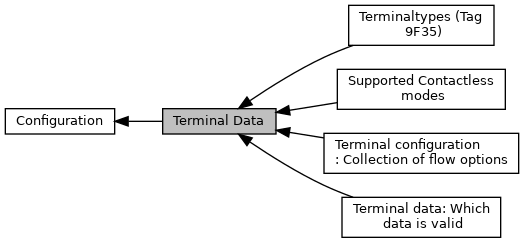
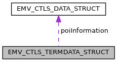

[Modules](#groups) \| [Data Structures](#nested-classes) \| [Typedefs](#typedef-members)

Definitions used for functions <a href="group___f_u_n_c___c_o_n_f.md#ga351c2deba9865081c314d818463f20c9">EMV_CT_SetTermData()</a>, <a href="group___f_u_n_c___c_o_n_f.md#ga954c82bc82203115b10fcab356df0079">EMV_CT_GetTermData()</a> [More\...](#details)

Collaboration diagram for Terminal Data:

|  |  |
|----|----|
| Modules |  |
|   | <a href="group___d_e_f___i_n_p_u_t___t_e_r_m.md">Terminal data: Which data is valid</a> |
|   | Contents of the [EMV_CTLS_TERMDATA_STRUCT::Info_Included_Data](#ae71321d54e0269c970e1551e1524d8dc "Which data is included in the message.").  |
|   | <a href="group___c_l___m_o_d_e_s.md">Supported Contactless modes</a> |
|   | Defines for <a href="group___d_e_f___f_l_o_w___o_u_t_p_u_t.md#af2a0fc1109b1f50d008679aeb4db9d2f">EMV_CTLS_TRANSRES_STRUCT::CL_Mode</a>.  |
|   | <a href="group___t_e_r_m___f_l_o_w___o_p_t_i_o_n_s.md">Terminal configuration: Collection of flow options</a> |
|   | Contents of the [EMV_CTLS_TERMDATA_STRUCT::FlowOptions](#a347abf8f0129f37f17279ef981765674 "Flow Options, see Terminal configuration: Collection of flow options   Availability bit: INPUT_CTLS_T...").  |
|   | <a href="group___t_e_r_m___t_y_p_e_s.md">Terminaltypes (Tag 9F35)</a> |
|   | see also \[EMV B4\], page 113  |

|  |  |
|----|----|
| Data Structures |  |
| struct   | [EMV_CTLS_TERMDATA_STRUCT](#struct_e_m_v___c_t_l_s___t_e_r_m_d_a_t_a___s_t_r_u_c_t) |
|   | struct for interface to <a href="group___f_u_n_c___c_o_n_f.md#gac5ce9781bba083028538f9e77c2d58f3">EMV_CTLS_SetTermData()</a> and <a href="group___f_u_n_c___c_o_n_f.md#gad690d9dec1818d4ffc7db35c12c3b610">EMV_CTLS_GetTermData()</a> [More\...](#struct_e_m_v___c_t_l_s___t_e_r_m_d_a_t_a___s_t_r_u_c_t)  |
| struct   | [EMV_CT_TERMDATA_STRUCT](#struct_e_m_v___c_t___t_e_r_m_d_a_t_a___s_t_r_u_c_t) |
|   | struct for interface to <a href="group___f_u_n_c___c_o_n_f.md#ga351c2deba9865081c314d818463f20c9">EMV_CT_SetTermData()</a> and <a href="group___f_u_n_c___c_o_n_f.md#ga954c82bc82203115b10fcab356df0079">EMV_CT_GetTermData()</a> [More\...](#struct_e_m_v___c_t___t_e_r_m_d_a_t_a___s_t_r_u_c_t)  |

|  |  |
|----|----|
| Typedefs |  |
| typedef struct [EMV_CTLS_TERMDATA_STRUCT](#struct_e_m_v___c_t_l_s___t_e_r_m_d_a_t_a___s_t_r_u_c_t)  | [EMV_CTLS_TERMDATA_TYPE](#gaf6a1624499c8eb3e1f914ba5cfc72b2e) |
|   | struct for interface to <a href="group___f_u_n_c___c_o_n_f.md#gac5ce9781bba083028538f9e77c2d58f3">EMV_CTLS_SetTermData()</a> and <a href="group___f_u_n_c___c_o_n_f.md#gad690d9dec1818d4ffc7db35c12c3b610">EMV_CTLS_GetTermData()</a> [More\...](#gaf6a1624499c8eb3e1f914ba5cfc72b2e)  |
| typedef struct [EMV_CT_TERMDATA_STRUCT](#struct_e_m_v___c_t___t_e_r_m_d_a_t_a___s_t_r_u_c_t)  | [EMV_CT_TERMDATA_TYPE](#gafdbb8cf654b659b9830896a7f82e5e24) |
|   | struct for interface to <a href="group___f_u_n_c___c_o_n_f.md#ga351c2deba9865081c314d818463f20c9">EMV_CT_SetTermData()</a> and <a href="group___f_u_n_c___c_o_n_f.md#ga954c82bc82203115b10fcab356df0079">EMV_CT_GetTermData()</a> [More\...](#gafdbb8cf654b659b9830896a7f82e5e24)  |
| #define  | [EMV_CTLS_KERNEL_VERSION_SIZE](#ga7c1e78dc805ac38a8cae3e9c4804a0b9)   255 |
|   | Length of Contactless kernel version information. [More\...](#ga7c1e78dc805ac38a8cae3e9c4804a0b9)  |

## DetailedDescription {#detailed-description}

Definitions used for functions <a href="group___f_u_n_c___c_o_n_f.md#ga351c2deba9865081c314d818463f20c9">EMV_CT_SetTermData()</a>, <a href="group___f_u_n_c___c_o_n_f.md#ga954c82bc82203115b10fcab356df0079">EMV_CT_GetTermData()</a>

Definitions used for functions <a href="group___f_u_n_c___c_o_n_f.md#gac5ce9781bba083028538f9e77c2d58f3">EMV_CTLS_SetTermData()</a>, <a href="group___f_u_n_c___c_o_n_f.md#gad690d9dec1818d4ffc7db35c12c3b610">EMV_CTLS_GetTermData()</a>

------------------------------------------------------------------------

## DataStructure Documentation {#data-structure-documentation}

## EMV_CTLS_TERMDATA_STRUCT 

struct EMV_CTLS_TERMDATA_STRUCT

struct for interface to <a href="group___f_u_n_c___c_o_n_f.md#gac5ce9781bba083028538f9e77c2d58f3">EMV_CTLS_SetTermData()</a> and <a href="group___f_u_n_c___c_o_n_f.md#gad690d9dec1818d4ffc7db35c12c3b610">EMV_CTLS_GetTermData()</a>

Collaboration diagram for EMV_CTLS_TERMDATA_STRUCT:

\[<a href="graph_legend.md">legend</a>\]

| Data Fields |  |  |
|----|----|----|
| unsigned short | BeepFrequencyAlert | Beeper frequency for alert tone (unit: Hz) Optional, default: 750 See also <a href="group___c_l_i_n_i_t___o_p_t_i_o_n_s.md#gadfa6a5c2610b8ddfe8be6f92849c5e33">EMV_CTLS_INIT_OPT_VFI_BUZZER_ADK</a> Availability bit: <a href="group___d_e_f___i_n_p_u_t___t_e_r_m.md#ga962d9c776e06203268ba24a9b16eb242">INPUT_CTLS_TRM_BEEP_FREQ_ALERT</a> TLV tag <a href="group___v_e_r_i___p_r_i_m___t_a_g_s.md#ga637b56c5915d91922ad0a6b03316baeb">TAG_DFD007_BEEP_FREQ_ALERT</a>, XML Tag: <a href="group___a_d_k___x_m_l___t_a_g_s.md#ga16e19d8553d2fd19a8069da5c5c0548c">XML_TAG_TERMDATA_BEEP_FREQUENCY_ALERT</a>. |
| unsigned short | BeepFrequencySuccess | Beeper frequency for success tone (unit: Hz) Optional, default: 1500 See also <a href="group___c_l_i_n_i_t___o_p_t_i_o_n_s.md#gadfa6a5c2610b8ddfe8be6f92849c5e33">EMV_CTLS_INIT_OPT_VFI_BUZZER_ADK</a> Availability bit: <a href="group___d_e_f___i_n_p_u_t___t_e_r_m.md#gaaadf18997faa3575d3326943a8001e32">INPUT_CTLS_TRM_BEEP_FREQ_SUCCESS</a> TLV tag <a href="group___v_e_r_i___p_r_i_m___t_a_g_s.md#gac4d4fa824c7ddadf3c1b83ea682c991c">TAG_DFD006_BEEP_FREQ_SUCCESS</a> XML Tag: <a href="group___a_d_k___x_m_l___t_a_g_s.md#gafa52bc19e376c25cb63f9bd98f7b7aa8">XML_TAG_TERMDATA_BEEP_FREQUENCY_SUCCESS</a>. |
| unsigned short | BeepVolume | Beeper Volume Allows the application to modify the volume of the success tone at the end of a contactless transaction. Format: Percentage of maximum volume as binary value \[1..100\]. See also <a href="group___c_l_i_n_i_t___o_p_t_i_o_n_s.md#gadfa6a5c2610b8ddfe8be6f92849c5e33">EMV_CTLS_INIT_OPT_VFI_BUZZER_ADK</a> TLV tag <a href="group___v_e_r_i___p_r_i_m___t_a_g_s.md#gac3f64e7a2f4fc6ae2911cf8809aa97de">TAG_DF62_BUZZER_VOLUME</a> XML Tag: <a href="group___a_d_k___x_m_l___t_a_g_s.md#ga57ca04c769961df068507ec48d8749df">XML_TAG_TERMDATA_BEEP_VOLUME</a> Availability bit <a href="group___d_e_f___i_n_p_u_t___t_e_r_m.md#gaa1fa9622841d79d1a4399364e59fc394">INPUT_CTLS_TRM_BEEP_VOLUME</a>. |
| unsigned long | CL_Modes_Supported | obsolete, ignored |
| unsigned char | CountryCodeTerm\[2\] | Terminal country code according ISO 3166 Availability bit: <a href="group___d_e_f___i_n_p_u_t___t_e_r_m.md#gae3d351171b1502a01d5efb52fa2b7302">INPUT_CTLS_TRM_COUNTRY_CODE</a> TLV tag <a href="group___e_m_v_c_o___t_a_g_s.md#ga5bc987c3686fd5821f20d21015354787">TAG_9F1A_TRM_COUNTRY_CODE</a> XML Tag: <a href="group___a_d_k___x_m_l___t_a_g_s.md#gaef4d5036990ed54a310bfa34e9a018aa">XML_TAG_TERMDATA_COUNTRY_CODE_TERM</a>. |
| unsigned char | CurrencyTrans\[2\] | Transaction currency code according ISO 4217 Availability bit: <a href="group___d_e_f___i_n_p_u_t___t_e_r_m.md#ga5974d5c2ce1835883799e206b4b342f0">INPUT_CTLS_TRM_CURRENCY</a> TLV tag <a href="group___e_m_v_c_o___t_a_g_s.md#ga369ab2cc83e9b220bdfa79753f1f3962">TAG_5F2A_TRANS_CURRENCY</a> XML Tag: <a href="group___a_d_k___x_m_l___t_a_g_s.md#ga661c0545150aba185eb87f9cc4ec2888">XML_TAG_TERMDATA_CURRENCY_TRANS</a>. |
| unsigned char | ExpTrans | Transaction currency exponent Availability bit: <a href="group___d_e_f___i_n_p_u_t___t_e_r_m.md#ga92251f0b4d8f1283cbb48555ddd097ee">INPUT_CTLS_TRM_EXP_CURRENCY</a> TLV tag <a href="group___e_m_v_c_o___t_a_g_s.md#ga134c61ae2787b93c5def5bbf929f7cb4">TAG_5F36_TRANS_CURRENCY_EXP</a> XML Tag: <a href="group___a_d_k___x_m_l___t_a_g_s.md#ga626a3a285542c99e089df3c38d66ee89">XML_TAG_TERMDATA_EXP_TRANS</a>. |
| unsigned char | FlowOptions\[10\] | Flow Options, see <a href="group___t_e_r_m___f_l_o_w___o_p_t_i_o_n_s.md">Terminal configuration: Collection of flow options</a> Availability bit: <a href="group___d_e_f___i_n_p_u_t___t_e_r_m.md#gafc158a2e5ada57ef35e334bfc19a5c9a">INPUT_CTLS_TRM_FLOW_OPTIONS</a> TLV tag <a href="group___p_r_i_m___t_a_g_s__3_b_y_t_e.md#gad0e9f205f2fcb246b6c958150d8a6338">TAG_DF8F0B_TERM_FLOW_OPTIONS</a> XML Tag: <a href="group___a_d_k___x_m_l___t_a_g_s.md#gab16baa33ca0e740088426ad66b521adf">XML_TAG_TERMDATA_FLOW_OPTIONS</a>. |
| char | FrameworkVersion\[<a href="group___a_d_k___l_i_m_i_t_s.md#ga94c28d1831d5df59ec7e7e44b7f39528">EMV_ADK_VERSION_ASCII_SIZE</a>\] | Version of the Framework, only valid for <a href="group___f_u_n_c___c_o_n_f.md#gad690d9dec1818d4ffc7db35c12c3b610">EMV_CTLS_GetTermData()</a> Availability bit: <a href="group___d_e_f___i_n_p_u_t___t_e_r_m.md#ga85f1566e3aff548dd77765f2d461adbf">INPUT_CTLS_TRM_FRAMEWORK_VERSION</a> TLV tag <a href="group___v_e_r_i___p_r_i_m___t_a_g_s.md#ga6f8f8ac35965ec091b3d1a3f4a4efe8d">TAG_DF11_LIB_VERSION</a> XML Tag: <a href="group___a_d_k___x_m_l___t_a_g_s.md#ga7466ea82a873f9b06da23f703c800a17">XML_TAG_TERMDATA_FRAMEWORK_VERSION</a>. |
| unsigned char | HostCommunicationTimeout | Maximum time between response of <a href="group___f_u_n_c___f_l_o_w.md#gaf23f6f87fe90619810470fad7d11f321">EMV_CTLS_ContinueOffline()</a> and call of <a href="group___f_u_n_c___f_l_o_w.md#ga297b6843994afaa2e7a6f5e0e4a8af3e">EMV_CTLS_ContinueOnline()</a>. Relevant for schemes having second tap scenarios (Discover, JCB and Rupay). VFI reader only\! Optional, default: 15 Seconds Availability bit: <a href="group___d_e_f___i_n_p_u_t___t_e_r_m.md#gaf7e4c7d41da73915d58e0c5fc9c4de6c">INPUT_CTLS_TRM_HOST_COMM_TIMEOUT</a> TLV tag <a href="group___v_e_r_i___p_r_i_m___t_a_g_s.md#ga5abfcf66eecc5c5eb457ef24d01a6ea2">TAG_DFD009_HOST_COMM_TIMEOUT</a> XML Tag: <a href="group___a_d_k___x_m_l___t_a_g_s.md#ga0fb88db4b918907ecb583113812609a1">XML_TAG_TERMDATA_HOST_COMM_TIMEOUT</a>. |
| const unsigned char \* | Hotlist | Blacklisted card numbers optional pointer to PAN list, BER-TLV coded list of tag \'5A\' each optionally followed by PAN sequence number tag \'5F34\'. The list end is marked by trailing binary \'0\'. Please note: It is recommended that the payment application itself checks for hotcard after the payment because of timing considerations (if the scheme allows this). Anyway for certification purpose and short lists a support is added. The hotlist is member of the contactless terminal wide configuration structure. It is a const byte array with a TLV coded list of \'5A\' tags of arbitrary length. The interface is write-only. Deletion is achieved by sending an empty list. The list is stored in a file named \"EMV_CTLS_Hotlist.xml\" containing XML tags \"\<Hotlist\>\" and \"\<PAN\>\". Limitations: Simple algorithm Since the hotlist is foreseen to be small for instance. So the check is just a simple list iteration. Therefore the time consumption is O(n). No partial match, the PANs have to match completely that is they have to have the same length. TLV tag <a href="group___v_e_r_i___c_o_n_s_t_r___t_a_g_s.md#ga0f16662930e6aee415115b531fcefa47">TAG_HOTLIST</a> Availability bit <a href="group___d_e_f___i_n_p_u_t___t_e_r_m.md#ga6e7dac5e3c9a950008778dd2d44f1851">INPUT_CTLS_TRM_HOTLIST</a>. |
| unsigned char | IFDSerialNumber\[8\] | Interface Device (IFD) Serial Number In case there are no special project requirements this parameter can be filled as follows: *Verix:* use function `SVC_INFO_SERLNO()` and take the last 8 digits from the result *V/OS:* function `platforminfo_get()` with ` InfoType==PI_SERIAL_NUM ` On VFI reader the configured value does not come into effect. VFI reader internally fetches the 9F1E from the OS. Availability bit: <a href="group___d_e_f___i_n_p_u_t___t_e_r_m.md#ga6f4225cb93a4793a8e1c54eaac432053">INPUT_CTLS_TRM_IFD_SERIAL</a> TLV tag <a href="group___e_m_v_c_o___t_a_g_s.md#ga1edb578c8df9ce5a55b3204cda45d198">TAG_9F1E_IFD_SERIAL_NB</a> XML Tag: <a href="group___a_d_k___x_m_l___t_a_g_s.md#ga629ee278fb088066573a86dd7d0b0e55">XML_TAG_TERMDATA_IFD_SERIAL_NUMBER</a>. |
| unsigned char | Info_Included_Data\[8\] | Which data is included in the message. |
| char | KernelVersion\[[EMV_CTLS_KERNEL_VERSION_SIZE](#ga7c1e78dc805ac38a8cae3e9c4804a0b9)\] | Version of EMVCo Kernels, only valid for <a href="group___f_u_n_c___c_o_n_f.md#gad690d9dec1818d4ffc7db35c12c3b610">EMV_CTLS_GetTermData()</a> Availability bit: <a href="group___d_e_f___i_n_p_u_t___t_e_r_m.md#gac02be862ed45087ed271d9201837fe80">INPUT_CTLS_TRM_KERNEL_VERSION</a> TLV tag <a href="group___v_e_r_i___p_r_i_m___t_a_g_s.md#ga67a162b9d0b04eff880450e857dafb37">TAG_KERNEL_VERSION</a> XML Tag: <a href="group___a_d_k___x_m_l___t_a_g_s.md#ga22fd4430dee89d1b99af96d86a6b0109">XML_TAG_TERMDATA_KERNEL_VERSION</a>. |
| char | L1DriverVersion\[<a href="group___a_d_k___l_i_m_i_t_s.md#ga94c28d1831d5df59ec7e7e44b7f39528">EMV_ADK_VERSION_ASCII_SIZE</a>\] | Version of L1 driver in the form *\<PCD software id\>,\<PCD hardware id\>;\<OS driver version\>;\<PCD name\> \<checksum\>*, only valid for <a href="group___f_u_n_c___c_o_n_f.md#gad690d9dec1818d4ffc7db35c12c3b610">EMV_CTLS_GetTermData()</a> Availability bit: <a href="group___d_e_f___i_n_p_u_t___t_e_r_m.md#ga1fd12967fecf739984724ce8aba031a7">INPUT_CTLS_TRM_L1DRIVER_VERSION</a> TLV tag <a href="group___v_e_r_i___p_r_i_m___t_a_g_s.md#ga1a279b58a27d0cc9146e89c6106035dc">TAG_DF6F_L1DRIVER_VERSION</a> XML Tag: <a href="group___a_d_k___x_m_l___t_a_g_s.md#ga1027f53b9fdf8329597f1a18fe49a316">XML_TAG_TERMDATA_L1DRIVER_VERSION</a>. |
| unsigned char | MaxCTLSTranslimit\[4\] | (Hexadecimal coded) Contactless transaction limit CTLS Setup will fail if the amount is above this limit (EPAL requirement) - not recommended to configure (leave empty) if not explicitly needed like in Australia TLV tag <a href="group___p_r_i_m___t_a_g_s__3_b_y_t_e.md#ga6a3a4411ca48ce2fe52c516dbeed0ebc">TAG_DF8F0E_TERM_MAXCTLS_TRANSLIMIT</a> XML Tag: <a href="group___a_d_k___x_m_l___t_a_g_s.md#gaffe891d87e34d05b4a9c12603a1f5acd">XML_TAG_TERMDATA_MAXCTLS_TRANSLIMIT</a> Availability bit <a href="group___d_e_f___i_n_p_u_t___t_e_r_m.md#gaf3a1ff600113e5829e8b2bb6bb06f63c">INPUT_CTLS_TRM_MAXCTLS_TRANSLIMIT</a> |
| <a href="_e_m_v___c_t_l_s___interface_8h.md#a72d9f02bd046a1c2bf3590be2bca6a26">EMV_CTLS_DATA_TYPE</a> | poiInformation | POI information according Book B - Entry Point specification TLV tag <a href="group___e_m_v_c_o___t_a_g_s.md#ga54b024713e6b8dd6d99e3c1d18005496">TAG_8B_POI_INFORMATION</a> Availability bit <a href="group___d_e_f___i_n_p_u_t___t_e_r_m.md#ga6e7dac5e3c9a950008778dd2d44f1851">INPUT_CTLS_TRM_HOTLIST</a>. |
| unsigned char | SecondTapDelay | Maximum time to wait for the second card tap after the online session. Relevant for schemes having second tap scenarios (Discover, JCB and Rupay). VFI reader only\! Optional, default: 10 Seconds Availability bit: <a href="group___d_e_f___i_n_p_u_t___t_e_r_m.md#gaebad415ab6843a40f12019aae094b9c5">INPUT_CTLS_TRM_SECOND_TAP_DELAY</a> TLV tag <a href="group___v_e_r_i___p_r_i_m___t_a_g_s.md#ga4026965f91b1424004ecd2b376349c78">TAG_DFD008_SECOND_TAP_DELAY</a> XML Tag: <a href="group___a_d_k___x_m_l___t_a_g_s.md#ga5d86c5d8f45bdd9f30ab755db45b6205">XML_TAG_TERMDATA_SECOND_TAP_DELAY</a>. |
| unsigned char | SuppLang\[<a href="group___a_d_k___l_i_m_i_t_s.md#ga574c13b5401ae9f6875d2becafc73337">EMV_ADK_MAX_LANG</a>\] | Languages supported by the terminal application, see <a href="group___t_f___l_a_n_g_u_a_g_e_s.md">Known languages</a> Availability bit: <a href="group___d_e_f___i_n_p_u_t___t_e_r_m.md#ga397a524f5c3329ff08f19471a825138c">INPUT_CTLS_TRM_LANGUAGES</a> TLV tag <a href="group___v_e_r_i___p_r_i_m___t_a_g_s.md#ga52707e76d2602d822429e98d653933c3">TAG_SUPP_LANG</a> XML Tag: <a href="sdi__lang_8cpp.md#a77460b946c3b46533edfbdbd3a6caf4c">XML_TAG_TERMDATA_SUPP_LANG</a>. |
| unsigned char | TermTyp | Terminal type, for possible values see <a href="group___t_e_r_m___t_y_p_e_s.md">Terminaltypes (Tag 9F35)</a> mandatory for first call of <a href="group___f_u_n_c___c_o_n_f.md#gac5ce9781bba083028538f9e77c2d58f3">EMV_CTLS_SetTermData()</a> Availability bit: <a href="group___d_e_f___i_n_p_u_t___t_e_r_m.md#ga984520d076c445ff9c734734242b1461">INPUT_CTLS_TRM_TYPE</a> TLV tag <a href="group___e_m_v_c_o___t_a_g_s.md#gace5b4ef50a58d29b2f5296c2c17273c9">TAG_9F35_TRM_TYPE</a> XML Tag: <a href="group___a_d_k___x_m_l___t_a_g_s.md#gae8ddc36e1390de13ad98cf5da17cfc3f">XML_TAG_TERMDATA_TERM_TYP</a>. |

## EMV_CT_TERMDATA_STRUCT 

struct EMV_CT_TERMDATA_STRUCT

struct for interface to <a href="group___f_u_n_c___c_o_n_f.md#ga351c2deba9865081c314d818463f20c9">EMV_CT_SetTermData()</a> and <a href="group___f_u_n_c___c_o_n_f.md#ga954c82bc82203115b10fcab356df0079">EMV_CT_GetTermData()</a>

| Data Fields |  |  |
|----|----|----|
| unsigned char | CurrencyTrans\[2\] | Transaction currency code according ISO 4217 For a single transaction this value may be overwritten by `CurrencyTrans` of <a href="group___a_d_k___t_r_x___e_x_e_c.md#ga58431469c9e1e41d6e419cbc246fd4bb">EMV_CT_SELECT_TYPE</a>, validity bit <a href="group___d_e_f___i_n_p_u_t___t_e_r_m.md#ga25a46ef790b6f8f85d6b5fc357cac05c">EMV_CT_INPUT_TRM_CURRENCY</a> `Tag`, `Struct`, `XML` Reference: TLV tag <a href="group___e_m_v_c_o___t_a_g_s.md#ga369ab2cc83e9b220bdfa79753f1f3962">TAG_5F2A_TRANS_CURRENCY</a>, CurrencyTrans in [EMV_CT_TERMDATA_STRUCT::CurrencyTrans](#ae1f191741d0c4b9351e7f52d69b20d73 "Transaction currency code according ISO 4217   For a single transaction this value may be overwritten..."), XML Tag: <a href="group___a_d_k___x_m_l___t_a_g_s.md#ga661c0545150aba185eb87f9cc4ec2888">XML_TAG_TERMDATA_CURRENCY_TRANS</a>. |
| unsigned char | ExpTrans | Transaction currency exponent For a single transaction this value may be overwritten by `Exp_Trans` of <a href="group___a_d_k___t_r_x___e_x_e_c.md#ga58431469c9e1e41d6e419cbc246fd4bb">EMV_CT_SELECT_TYPE</a>, validity bit <a href="group___d_e_f___i_n_p_u_t___t_e_r_m.md#gaba078690f9ef9be7c2a4c7b3c3bd0141">EMV_CT_INPUT_TRM_EXP_CURRENCY</a> `Tag`, `Struct`, `XML` Reference: TLV tag <a href="group___e_m_v_c_o___t_a_g_s.md#ga134c61ae2787b93c5def5bbf929f7cb4">TAG_5F36_TRANS_CURRENCY_EXP</a>, ExpTrans in [EMV_CT_TERMDATA_STRUCT::ExpTrans](#aaa3e0774e163e148c88b989c3ada3b76 "Transaction currency exponent   For a single transaction this value may be overwritten by Exp_Trans o..."), XML Tag: <a href="group___a_d_k___x_m_l___t_a_g_s.md#ga626a3a285542c99e089df3c38d66ee89">XML_TAG_TERMDATA_EXP_TRANS</a>. |
| char | FrameworkVersion\[<a href="group___a_d_k___l_i_m_i_t_s.md#ga94c28d1831d5df59ec7e7e44b7f39528">EMV_ADK_VERSION_ASCII_SIZE</a>\] | version of the Framework, see #EMV_CT_FRAMEWORK_VERSION, validity bit <a href="group___d_e_f___i_n_p_u_t___t_e_r_m.md#ga74be00aeb0c765185114c099af576d1b">EMV_CT_INPUT_TRM_FRAMEWORK_VERSION</a> `Tag`, `Struct`, `XML` Reference: TLV tag <a href="group___v_e_r_i___p_r_i_m___t_a_g_s.md#ga6f8f8ac35965ec091b3d1a3f4a4efe8d">TAG_DF11_LIB_VERSION</a>, FrameworkVersion in [EMV_CT_TERMDATA_STRUCT::FrameworkVersion](#a15d10a5c739bb6c45d9d0bf3f40c0021 "version of the Framework, see #EMV_CT_FRAMEWORK_VERSION, validity bit EMV_CT_INPUT_TRM_FRAMEWORK_VERS..."), XML Tag: <a href="group___a_d_k___x_m_l___t_a_g_s.md#ga7466ea82a873f9b06da23f703c800a17">XML_TAG_TERMDATA_FRAMEWORK_VERSION</a> |
| unsigned char | IFDSerialNumber\[8\] | Interface Device (IFD) Serial Number In case there are no special project requirements this parameter can be filled as follows: *Verix:* use function `SVC_INFO_SERLNO()` and take the last 8 digits from the result *V/OS:* function `platforminfo_get()` with ` InfoType==PI_SERIAL_NUM ` Can also be changed by <a href="group___f_u_n_c___f_l_o_w.md#gad3dd36d27d5fa94d3f302dc4a4546b70">EMV_CT_updateTxnTags()</a> validity bit <a href="group___d_e_f___i_n_p_u_t___t_e_r_m.md#ga7f8a513612c7ecdca5911e7b3ea65a5d">EMV_CT_INPUT_TRM_IFD_SERIAL</a> `Tag`, `Struct`, `XML` Reference: TLV tag <a href="group___e_m_v_c_o___t_a_g_s.md#ga1edb578c8df9ce5a55b3204cda45d198">TAG_9F1E_IFD_SERIAL_NB</a>, IFDSerialNumber in [EMV_CT_TERMDATA_STRUCT::IFDSerialNumber](#a67d893f7b2cd705d266455f171ff7657 "Interface Device (IFD) Serial Number   In case there are no special project requirements this paramet..."), XML Tag: <a href="group___a_d_k___x_m_l___t_a_g_s.md#ga629ee278fb088066573a86dd7d0b0e55">XML_TAG_TERMDATA_IFD_SERIAL_NUMBER</a>. |
| unsigned char | Info_Included_Data\[8\] | Which data is included in the message, see <a href="group___d_e_f___i_n_p_u_t___t_e_r_m.md">Terminal data: Which data is valid</a>. |
| char | KernelVersion\[<a href="group___a_d_k___l_i_m_i_t_s.md#ga94c28d1831d5df59ec7e7e44b7f39528">EMV_ADK_VERSION_ASCII_SIZE</a>\] | version of EMVCo Kernel, validity bit <a href="group___d_e_f___i_n_p_u_t___t_e_r_m.md#ga77efe02efa12d9bbafb97deb3ac7b995">EMV_CT_INPUT_TRM_KERNEL_VERSION</a> `Tag`, `Struct`, `XML` Reference: TLV tag <a href="group___v_e_r_i___p_r_i_m___t_a_g_s.md#ga67a162b9d0b04eff880450e857dafb37">TAG_KERNEL_VERSION</a>, KernelVersion in [EMV_CT_TERMDATA_STRUCT::KernelVersion](#a808cb5cde9cf6ac837ef81977f4a751c "version of EMVCo Kernel, validity bit EMV_CT_INPUT_TRM_KERNEL_VERSION  Tag, Struct,..."), XML Tag: <a href="group___a_d_k___x_m_l___t_a_g_s.md#ga22fd4430dee89d1b99af96d86a6b0109">XML_TAG_TERMDATA_KERNEL_VERSION</a> |
| char | L1DriverVersion\[<a href="group___a_d_k___l_i_m_i_t_s.md#ga94c28d1831d5df59ec7e7e44b7f39528">EMV_ADK_VERSION_ASCII_SIZE</a>\] | version of L1 Driver, validity bit <a href="group___d_e_f___i_n_p_u_t___t_e_r_m.md#ga88945d9d7fa24549ffbe8abba40c17d9">EMV_CT_INPUT_TRM_L1DRIVER_VERSION</a> `Tag`, `Struct`, `XML` Reference: TLV tag <a href="group___v_e_r_i___p_r_i_m___t_a_g_s.md#gac1ea086216b81ee8ac8b78f2fbe15daa">TAG_L1DRIVER_VERSION</a>, L1DriverVersion in [EMV_CT_TERMDATA_STRUCT::L1DriverVersion](#a534424c16f043292e2b4bf000b07ead3 "version of L1 Driver, validity bit EMV_CT_INPUT_TRM_L1DRIVER_VERSION  Tag, Struct,..."), XML Tag: <a href="group___a_d_k___x_m_l___t_a_g_s.md#ga1027f53b9fdf8329597f1a18fe49a316">XML_TAG_TERMDATA_L1DRIVER_VERSION</a> |
| unsigned char | SuppLang\[<a href="group___a_d_k___l_i_m_i_t_s.md#ga574c13b5401ae9f6875d2becafc73337">EMV_ADK_MAX_LANG</a>\] | Supported languages by the terminal application, validity bit <a href="group___d_e_f___i_n_p_u_t___t_e_r_m.md#gadfc1ccfc70eccb63d83e6999efea5b68">EMV_CT_INPUT_TRM_LANGUAGES</a> `Tag`, `Struct`, `XML` Reference: TLV tag: <a href="group___v_e_r_i___p_r_i_m___t_a_g_s.md#ga52707e76d2602d822429e98d653933c3">TAG_SUPP_LANG</a>, SuppLang in [EMV_CT_TERMDATA_STRUCT::SuppLang](#a9d2672ac7a65bb39a13e450b4cb4737b "Supported languages by the terminal application, validity bit EMV_CT_INPUT_TRM_LANGUAGES  Tag,..."), XML Tag: <a href="sdi__lang_8cpp.md#a77460b946c3b46533edfbdbd3a6caf4c">XML_TAG_TERMDATA_SUPP_LANG</a>. |
| unsigned char | TermAddCap\[5\] | Additional terminal capabilities overwritten by <a href="group___d_e_f___c_o_n_f___a_p_p_l_i.md#aa137395f6cc0b7618d9fec892c3c8b00">EMV_CT_APPLIDATA_STRUCT::App_TermAddCap</a> at Final Select, validity bit <a href="group___d_e_f___i_n_p_u_t___t_e_r_m.md#gae7fb207afea249c2b5384928e7d22bfa">EMV_CT_INPUT_TRM_ADD_CAPS</a> `Tag`, `Struct`, `XML` Reference: TLV tag <a href="group___e_m_v_c_o___t_a_g_s.md#ga5670c7d223a0af749d5b8b251e32f870">TAG_9F40_ADD_TRM_CAP</a>, TermAddCap in [EMV_CT_TERMDATA_STRUCT::TermAddCap](#a9cafd59682bd260f14ce67e716046538 "Additional terminal capabilities   overwritten by EMV_CT_APPLIDATA_STRUCT::App_TermAddCap at Final Se..."), XML Tag: <a href="group___a_d_k___x_m_l___t_a_g_s.md#ga3514324960ea620fc5a8daef445fcecd">XML_TAG_TERMDATA_TERM_ADD_CAP</a>. |
| unsigned char | TermCap\[3\] | Terminal capabilities overwritten by <a href="group___d_e_f___c_o_n_f___a_p_p_l_i.md#a7ac173f4a1d9a3845a18af806ee8bb31">EMV_CT_APPLIDATA_STRUCT::App_TermCap</a> at Final Select mandatory for first call of <a href="group___f_u_n_c___c_o_n_f.md#ga351c2deba9865081c314d818463f20c9">EMV_CT_SetTermData()</a>, validity bit <a href="group___d_e_f___i_n_p_u_t___t_e_r_m.md#ga43add8cec7260c4f1dc11c34dc56812b">EMV_CT_INPUT_TRM_CAPABILITIES</a> `Tag`, `Struct`, `XML` Reference: TLV tag <a href="group___e_m_v_c_o___t_a_g_s.md#gad3ec876483505eb23aad4e1b210653f5">TAG_9F33_TRM_CAPABILITIES</a>, TermCap in [EMV_CT_TERMDATA_STRUCT::TermCap](#aa98172f43b850403ff2e6aba0340281f "Terminal capabilities   overwritten by EMV_CT_APPLIDATA_STRUCT::App_TermCap at Final Select   mandato..."), XML Tag: <a href="group___a_d_k___x_m_l___t_a_g_s.md#ga7bfeb1312c6535a069be1b26015e6ef4">XML_TAG_TERMDATA_TERM_CAP</a>. |
| unsigned char | TermCountryCode\[2\] | Terminal country code according ISO 3166, validity bit <a href="group___d_e_f___i_n_p_u_t___t_e_r_m.md#gaaf0058ba5369f88f64da1051553123b4">EMV_CT_INPUT_TRM_COUNTRY_CODE</a> `Tag`, `Struct`, `XML` Reference: TLV tag <a href="group___e_m_v_c_o___t_a_g_s.md#ga5bc987c3686fd5821f20d21015354787">TAG_9F1A_TRM_COUNTRY_CODE</a>, TermCountryCode in [EMV_CT_TERMDATA_STRUCT::TermCountryCode](#af11a6d7b3bb1f5438dca672b746aeb11 "Terminal country code according ISO 3166, validity bit EMV_CT_INPUT_TRM_COUNTRY_CODE  Tag,..."), XML Tag: <a href="group___a_d_k___x_m_l___t_a_g_s.md#gaef4d5036990ed54a310bfa34e9a018aa">XML_TAG_TERMDATA_COUNTRY_CODE_TERM</a>. |
| unsigned char | TermIdent\[8\] | Terminal Identification Can also be changed by <a href="group___f_u_n_c___f_l_o_w.md#gad3dd36d27d5fa94d3f302dc4a4546b70">EMV_CT_updateTxnTags()</a> validity bit <a href="group___d_e_f___i_n_p_u_t___t_e_r_m.md#ga6153c89871467b83f3c9de7aeb5ce6c7">EMV_CT_INPUT_TRM_ID</a> `Tag`, `Struct`, `XML` Reference: TLV tag <a href="group___e_m_v_c_o___t_a_g_s.md#ga64f401e453e74b4ff1f727aa7cc449ac">TAG_9F1C_TRM_ID</a>, TermIdent in [EMV_CT_TERMDATA_STRUCT::TermIdent](#a9f0b41880fba4d452b3b9e7b4170a2e1 "Terminal Identification   Can also be changed by EMV_CT_updateTxnTags()   validity bit EMV_CT_INPUT_T..."), `XML` Tag: <a href="group___a_d_k___x_m_l___t_a_g_s.md#ga0c70e5646bee358cbfeb5f65628c55d2">XML_TAG_TERMDATA_TERM_IDENT</a>. |
| unsigned char | TermTyp | Terminal type, possible values see <a href="group___t_e_r_m___t_y_p_e_s.md">Terminaltypes (Tag 9F35)</a>) mandatory for first call of <a href="group___f_u_n_c___c_o_n_f.md#ga351c2deba9865081c314d818463f20c9">EMV_CT_SetTermData()</a> ,validity bit <a href="group___d_e_f___i_n_p_u_t___t_e_r_m.md#gaa97540390db40f0c46a6900ade205799">EMV_CT_INPUT_TRM_TYPE</a> `Tag`, `Struct`, `XML` Reference: TLV tag <a href="group___e_m_v_c_o___t_a_g_s.md#gace5b4ef50a58d29b2f5296c2c17273c9">TAG_9F35_TRM_TYPE</a>, TermTyp in [EMV_CT_TERMDATA_STRUCT::TermTyp](#aedfef0baa468f4fff2d56821c55f8726 "Terminal type, possible values see Terminaltypes (Tag 9F35))   mandatory for first call of EMV_CT_Set..."), XML Tag: <a href="group___a_d_k___x_m_l___t_a_g_s.md#gae8ddc36e1390de13ad98cf5da17cfc3f">XML_TAG_TERMDATA_TERM_TYP</a>. |

## MacroDefinition Documentation {#macro-definition-documentation}

## EMV_CTLS_KERNEL_VERSION_SIZE 

#define EMV_CTLS_KERNEL_VERSION_SIZE   255

Length of Contactless kernel version information.

Max. length of [EMV_CTLS_TERMDATA_STRUCT::KernelVersion](#a75c365e8a1aca8672ee83242dfb3fe42 "Version of EMVCo Kernels, only valid for EMV_CTLS_GetTermData()   Availability bit: INPUT_CTLS_TRM_KE...")

## TypedefDocumentation {#typedef-documentation}

## EMV_CT_TERMDATA_TYPE 

typedef struct [EMV_CT_TERMDATA_STRUCT](#struct_e_m_v___c_t___t_e_r_m_d_a_t_a___s_t_r_u_c_t) [EMV_CT_TERMDATA_TYPE](#gafdbb8cf654b659b9830896a7f82e5e24)

struct for interface to <a href="group___f_u_n_c___c_o_n_f.md#ga351c2deba9865081c314d818463f20c9">EMV_CT_SetTermData()</a> and <a href="group___f_u_n_c___c_o_n_f.md#ga954c82bc82203115b10fcab356df0079">EMV_CT_GetTermData()</a>

typedef for [EMV_CT_TERMDATA_STRUCT](#struct_e_m_v___c_t___t_e_r_m_d_a_t_a___s_t_r_u_c_t "struct for interface to EMV_CT_SetTermData() and EMV_CT_GetTermData()")

## EMV_CTLS_TERMDATA_TYPE 

typedef struct [EMV_CTLS_TERMDATA_STRUCT](#struct_e_m_v___c_t_l_s___t_e_r_m_d_a_t_a___s_t_r_u_c_t) [EMV_CTLS_TERMDATA_TYPE](#gaf6a1624499c8eb3e1f914ba5cfc72b2e)

struct for interface to <a href="group___f_u_n_c___c_o_n_f.md#gac5ce9781bba083028538f9e77c2d58f3">EMV_CTLS_SetTermData()</a> and <a href="group___f_u_n_c___c_o_n_f.md#gad690d9dec1818d4ffc7db35c12c3b610">EMV_CTLS_GetTermData()</a>

typedef for [EMV_CTLS_TERMDATA_STRUCT](#struct_e_m_v___c_t_l_s___t_e_r_m_d_a_t_a___s_t_r_u_c_t "struct for interface to EMV_CTLS_SetTermData() and EMV_CTLS_GetTermData()")
