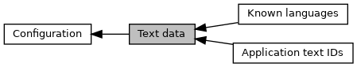

[Modules](#groups)

Collaboration diagram for Text data:

|  |  |
|----|----|
| Modules |  |
|   | <a href="group___a_p_p_l_i___t_e_x_t_s.md">Application text IDs</a> |
|   | Also see <a href="_e_m_v___common___interface_8h.md#struct_e_m_v___a_d_k___t_x_t___t_y_p_e">EMV_ADK_TXT_TYPE</a>.  |
|   | <a href="group___t_f___l_a_n_g_u_a_g_e_s.md">Known languages</a> |
|   | see <a href="_e_m_v___common___interface_8h.md#struct_e_m_v___a_d_k___t_x_t___t_y_p_e">EMV_ADK_TXT_TYPE</a>  |

## DetailedDescription {#detailed-description}
