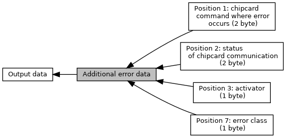

[Modules](#groups)

DF62, 15 bytes, error reference. [More\...](#details)

Collaboration diagram for Additional error data:

|  |  |
|----|----|
| Modules |  |
|   | <a href="group___d_e_f___d_f62___p_o_s1.md">Position 1: chipcard command where error occurs (2 byte)</a> |
|   | <a href="group___d_e_f___d_f62___p_o_s2.md">Position 2: status of chipcard communication (2 byte)</a> |
|   | <a href="group___d_e_f___d_f62___p_o_s3.md">Position 3: activator (1 byte)</a> |
|   | <a href="group___d_e_f___d_f62___p_o_s7.md">Position 7: error class (1 byte)</a> |

## DetailedDescription {#detailed-description}

DF62, 15 bytes, error reference.

Following positions do not need special defines here:
position 4: ARC (Tag 8A, 2 byte)
position 5: TVR (5 byte)
position 6: TSI (2 byte)
