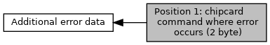

[Macros](#define-members)

Collaboration diagram for Position 1: chipcard command where error occurs (2 byte):

|  |  |
|----|----|
| Macros |  |
| #define  | [EMV_ADK_DF62_ERR_POS1_CHIP_RESET](#ga491f031248d8ef4fe63ad43847a7b9ee)   0x1000u |
|   | reset (ATR) during technology selection [More\...](#ga491f031248d8ef4fe63ad43847a7b9ee)  |
| #define  | [EMV_ADK_DF62_ERR_POS1_SEL_LIST_AID](#ga08ca19f0cdbfb6efb2409d04ab45898c)   0x2000u |
|   | SELECT during build of candidate list using explicit mode. [More\...](#ga08ca19f0cdbfb6efb2409d04ab45898c)  |
| #define  | [EMV_ADK_DF62_ERR_POS1_SEL_LIST_PSE](#ga6b65bfca2a3d3d4c87f0739801c3c3eb)   0x2100u |
|   | SELECT during build of candidate list using PSE. [More\...](#ga6b65bfca2a3d3d4c87f0739801c3c3eb)  |
| #define  | [EMV_ADK_DF62_ERR_POS1_READ_LIST_PSE](#gaf0b551570ee1171e7c7356b91e61e4ad)   0x2200u |
|   | READ RECORD during build of candidate list using PSE. [More\...](#gaf0b551570ee1171e7c7356b91e61e4ad)  |
| #define  | [EMV_ADK_DF62_ERR_POS1_SEL_FINAL](#gac687265b650f549102ecc0547fdf2bb2)   0x3000u |
|   | SELECT during final selection. [More\...](#gac687265b650f549102ecc0547fdf2bb2)  |
| #define  | [EMV_ADK_DF62_ERR_POS1_GPO](#gaa19e8a460b225ea33af9fefca4dfbeff)   0x4000u |
|   | GET PROCESSING OPTIONS. [More\...](#gaa19e8a460b225ea33af9fefca4dfbeff)  |
| #define  | [EMV_ADK_DF62_ERR_POS1_READ](#ga56f0e715826c9b9ce612d67c34c951f4)   0x5000u |
|   | READ RECORD. [More\...](#ga56f0e715826c9b9ce612d67c34c951f4)  |
| #define  | [EMV_ADK_DF62_ERR_POS1_INT_AUTH](#gaf0e18681abf89502cb3f154e6478b38a)   0x6000u |
|   | INTERNAL AUTHENTICATE. [More\...](#gaf0e18681abf89502cb3f154e6478b38a)  |
| #define  | [EMV_ADK_DF62_ERR_POS1_GETDATA_PTC](#ga9f96b90edd7e4eda9db8495e8f8fc484)   0x7001u |
|   | GET DATA for PIN try counter. [More\...](#ga9f96b90edd7e4eda9db8495e8f8fc484)  |
| #define  | [EMV_ADK_DF62_ERR_POS1_GETCHALLENGE](#ga07418af7510d16e5084853446b8af411)   0x7100u |
|   | GET CHALLENGE. [More\...](#ga07418af7510d16e5084853446b8af411)  |
| #define  | [EMV_ADK_DF62_ERR_POS1_VERIFY_ENC_PIN](#ga430923f72823938e61ef907a0b246424)   0x7210u |
|   | VERIFY for enciphered PIN. [More\...](#ga430923f72823938e61ef907a0b246424)  |
| #define  | [EMV_ADK_DF62_ERR_POS1_VERIFY_PLAIN_PIN](#ga8b2868d8080ec89377c8b755457b2e47)   0x7220u |
|   | VERIFY for plaintext PIN. [More\...](#ga8b2868d8080ec89377c8b755457b2e47)  |
| #define  | [EMV_ADK_DF62_ERR_POS1_GETDATA_ATC](#gae03fae9a8bbf070ad1390a56ee31816d)   0x8001u |
|   | GET DATA for ATC. [More\...](#gae03fae9a8bbf070ad1390a56ee31816d)  |
| #define  | [EMV_ADK_DF62_ERR_POS1_GETDATA_LOATC](#ga2fa3ca79964ff5a4576e79f27f223e64)   0x8002u |
|   | GET DATA for LOATC. [More\...](#ga2fa3ca79964ff5a4576e79f27f223e64)  |
| #define  | [EMV_ADK_DF62_ERR_POS1_GENAC_1](#ga8c1e73eb021b3850d47b75c0e7f0e793)   0x9001u |
|   | 1st GENERATE AC without CDA [More\...](#ga8c1e73eb021b3850d47b75c0e7f0e793)  |
| #define  | [EMV_ADK_DF62_ERR_POS1_GENAC_1_CDA](#ga3c06e0de2995d2a9b147e8534593d2b6)   0x9011u |
|   | 1st GENERATE AC with CDA [More\...](#ga3c06e0de2995d2a9b147e8534593d2b6)  |
| #define  | [EMV_ADK_DF62_ERR_POS1_EXTAUTH](#ga5d81317c5ec89fb4ce1150cca53f06b0)   0xA000u |
|   | EXTERNAL AUTHENTICATE. [More\...](#ga5d81317c5ec89fb4ce1150cca53f06b0)  |
| #define  | [EMV_ADK_DF62_ERR_POS1_CRIT_SCRIPT](#ga1addcfbfdfa866e533df9cf7b9614849)   0xB100u |
|   | critical script command [More\...](#ga1addcfbfdfa866e533df9cf7b9614849)  |
| #define  | [EMV_ADK_DF62_ERR_POS1_GENAC_2](#ga9f85ceca2cae32d3f3f403db5909aa98)   0x9002u |
|   | 2nd GENERATE AC without CDA [More\...](#ga9f85ceca2cae32d3f3f403db5909aa98)  |
| #define  | [EMV_ADK_DF62_ERR_POS1_GENAC_2_CDA](#gaad6efa8e60e69a4f62f9dac23019a928)   0x9012u |
|   | 2nd GENERATE AC with CDA [More\...](#gaad6efa8e60e69a4f62f9dac23019a928)  |
| #define  | [EMV_ADK_DF62_ERR_POS1_NON_CRIT_SCRIPT](#ga70d0ed5281e57c2dd5bb04c0e7263a6e)   0xB200u |
|   | non critical script command [More\...](#ga70d0ed5281e57c2dd5bb04c0e7263a6e)  |

## DetailedDescription {#detailed-description}

## MacroDefinition Documentation {#macro-definition-documentation}

## EMV_ADK_DF62_ERR_POS1_CHIP_RESET 

#define EMV_ADK_DF62_ERR_POS1_CHIP_RESET   0x1000u

reset (ATR) during technology selection

## EMV_ADK_DF62_ERR_POS1_CRIT_SCRIPT 

#define EMV_ADK_DF62_ERR_POS1_CRIT_SCRIPT   0xB100u

critical script command

## EMV_ADK_DF62_ERR_POS1_EXTAUTH 

#define EMV_ADK_DF62_ERR_POS1_EXTAUTH   0xA000u

EXTERNAL AUTHENTICATE.

## EMV_ADK_DF62_ERR_POS1_GENAC_1 

#define EMV_ADK_DF62_ERR_POS1_GENAC_1   0x9001u

1st GENERATE AC without CDA

## EMV_ADK_DF62_ERR_POS1_GENAC_1_CDA 

#define EMV_ADK_DF62_ERR_POS1_GENAC_1_CDA   0x9011u

1st GENERATE AC with CDA

## EMV_ADK_DF62_ERR_POS1_GENAC_2 

#define EMV_ADK_DF62_ERR_POS1_GENAC_2   0x9002u

2nd GENERATE AC without CDA

## EMV_ADK_DF62_ERR_POS1_GENAC_2_CDA 

#define EMV_ADK_DF62_ERR_POS1_GENAC_2_CDA   0x9012u

2nd GENERATE AC with CDA

## EMV_ADK_DF62_ERR_POS1_GETCHALLENGE 

#define EMV_ADK_DF62_ERR_POS1_GETCHALLENGE   0x7100u

GET CHALLENGE.

## EMV_ADK_DF62_ERR_POS1_GETDATA_ATC 

#define EMV_ADK_DF62_ERR_POS1_GETDATA_ATC   0x8001u

GET DATA for ATC.

## EMV_ADK_DF62_ERR_POS1_GETDATA_LOATC 

#define EMV_ADK_DF62_ERR_POS1_GETDATA_LOATC   0x8002u

GET DATA for LOATC.

## EMV_ADK_DF62_ERR_POS1_GETDATA_PTC 

#define EMV_ADK_DF62_ERR_POS1_GETDATA_PTC   0x7001u

GET DATA for PIN try counter.

## EMV_ADK_DF62_ERR_POS1_GPO 

#define EMV_ADK_DF62_ERR_POS1_GPO   0x4000u

GET PROCESSING OPTIONS.

## EMV_ADK_DF62_ERR_POS1_INT_AUTH 

#define EMV_ADK_DF62_ERR_POS1_INT_AUTH   0x6000u

INTERNAL AUTHENTICATE.

## EMV_ADK_DF62_ERR_POS1_NON_CRIT_SCRIPT 

#define EMV_ADK_DF62_ERR_POS1_NON_CRIT_SCRIPT   0xB200u

non critical script command

## EMV_ADK_DF62_ERR_POS1_READ 

#define EMV_ADK_DF62_ERR_POS1_READ   0x5000u

READ RECORD.

## EMV_ADK_DF62_ERR_POS1_READ_LIST_PSE 

#define EMV_ADK_DF62_ERR_POS1_READ_LIST_PSE   0x2200u

READ RECORD during build of candidate list using PSE.

## EMV_ADK_DF62_ERR_POS1_SEL_FINAL 

#define EMV_ADK_DF62_ERR_POS1_SEL_FINAL   0x3000u

SELECT during final selection.

## EMV_ADK_DF62_ERR_POS1_SEL_LIST_AID 

#define EMV_ADK_DF62_ERR_POS1_SEL_LIST_AID   0x2000u

SELECT during build of candidate list using explicit mode.

## EMV_ADK_DF62_ERR_POS1_SEL_LIST_PSE 

#define EMV_ADK_DF62_ERR_POS1_SEL_LIST_PSE   0x2100u

SELECT during build of candidate list using PSE.

## EMV_ADK_DF62_ERR_POS1_VERIFY_ENC_PIN 

#define EMV_ADK_DF62_ERR_POS1_VERIFY_ENC_PIN   0x7210u

VERIFY for enciphered PIN.

## EMV_ADK_DF62_ERR_POS1_VERIFY_PLAIN_PIN 

#define EMV_ADK_DF62_ERR_POS1_VERIFY_PLAIN_PIN   0x7220u

VERIFY for plaintext PIN.
