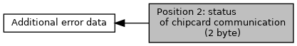

[Macros](#define-members)

Collaboration diagram for Position 2: status of chipcard communication (2 byte):

|  |  |
|----|----|
| Macros |  |
| #define  | [EMV_ADK_DF62_ERR_POS2_TRANSPORT_LAYER](#ga0a7522e908ddb8dfb41618af3aceb480)   0x0000u |
|   | error in transport layer (T=0, T=1) [More\...](#ga0a7522e908ddb8dfb41618af3aceb480)  |
| #define  | [EMV_ADK_DF62_ERR_POS2_BASE_ERROR](#gab3b1f3c48eab201e16fb66c241e8c851)   0x0001u |
|   | base error (wrong length of R-APDU) [More\...](#gab3b1f3c48eab201e16fb66c241e8c851)  |
| #define  | [EMV_ADK_DF62_ERR_POS2_RAPDU](#gaf8ee8f301a95f2901203c1bbe4ada40e)   0xFFFFu |
|   | R-APDU data with wrong content. [More\...](#gaf8ee8f301a95f2901203c1bbe4ada40e)  |

## DetailedDescription {#detailed-description}

## MacroDefinition Documentation {#macro-definition-documentation}

## EMV_ADK_DF62_ERR_POS2_BASE_ERROR 

#define EMV_ADK_DF62_ERR_POS2_BASE_ERROR   0x0001u

base error (wrong length of R-APDU)

## EMV_ADK_DF62_ERR_POS2_RAPDU 

#define EMV_ADK_DF62_ERR_POS2_RAPDU   0xFFFFu

R-APDU data with wrong content.

## EMV_ADK_DF62_ERR_POS2_TRANSPORT_LAYER 

#define EMV_ADK_DF62_ERR_POS2_TRANSPORT_LAYER   0x0000u

error in transport layer (T=0, T=1)
