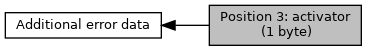

[Macros](#define-members)

Collaboration diagram for Position 3: activator (1 byte):

|  |  |
|----|----|
| Macros |  |
| #define  | [EMV_ADK_DF62_ERR_POS3_CHIPCARD](#ga0934e0e1ea63e50e2b2a78760c18bdb7)   0x01 |
|   | chipcard :-) [More\...](#ga0934e0e1ea63e50e2b2a78760c18bdb7)  |
| #define  | [EMV_ADK_DF62_ERR_POS3_TERMINAL](#gaa3115d2f139d1519b47c975f41c41c35)   0x02 |
|   | terminal [More\...](#gaa3115d2f139d1519b47c975f41c41c35)  |
| #define  | [EMV_ADK_DF62_ERR_POS3_ACQUIRER](#gaa10719ccf592aa1c1080bf8216536b83)   0x03 |
|   | Authorization system. [More\...](#gaa10719ccf592aa1c1080bf8216536b83)  |
| #define  | [EMV_ADK_DF62_ERR_POS3_CARDHOLDER](#ga08e1c50381bbece9ea93e258cca623c4)   0x04 |
|   | cardholder [More\...](#ga08e1c50381bbece9ea93e258cca623c4)  |

## DetailedDescription {#detailed-description}

## MacroDefinition Documentation {#macro-definition-documentation}

## EMV_ADK_DF62_ERR_POS3_ACQUIRER 

#define EMV_ADK_DF62_ERR_POS3_ACQUIRER   0x03

Authorization system.

## EMV_ADK_DF62_ERR_POS3_CARDHOLDER 

#define EMV_ADK_DF62_ERR_POS3_CARDHOLDER   0x04

cardholder

## EMV_ADK_DF62_ERR_POS3_CHIPCARD 

#define EMV_ADK_DF62_ERR_POS3_CHIPCARD   0x01

chipcard :-)

## EMV_ADK_DF62_ERR_POS3_TERMINAL 

#define EMV_ADK_DF62_ERR_POS3_TERMINAL   0x02

terminal
