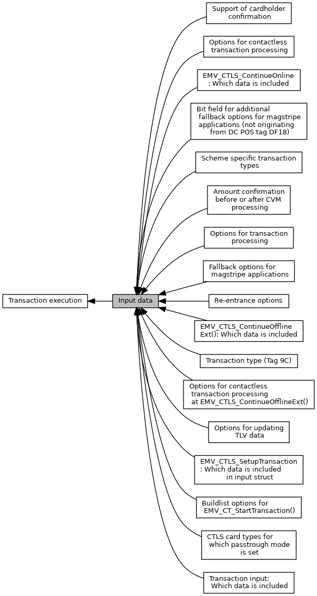
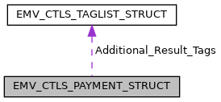
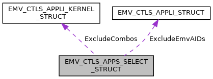
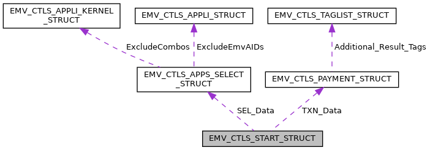

[Modules](#groups) \| [Data Structures](#nested-classes) \| [Typedefs](#typedef-members)

Collaboration diagram for Input data:

|  |  |
|----|----|
| Modules |  |
|   | <a href="group___c_l_t_r_x___o_p_t_i_o_n_s.md">Options for contactless transaction processing</a> |
|   | Defines for [EMV_CTLS_START_TYPE::TxnOptions](#ac9ddf19e79cf70f6331fdb822fdf1d4f "Transaction options, allowed values see Options for contactless transaction processing   TLV tag TAG_...").  |
|   | <a href="group___c_l_t_r_x___s_c_h_e_m_e___t_r_x___t_y_p_e_s.md">Scheme specific transaction types</a> |
|   | Defines for [EMV_CTLS_START_TYPE::TransType](#ae9357fb5fbb42943ac347ea3b2cd4d6a).  |
|   | <a href="group___c_l_t_r_x___p_a_s_s_t_r_o_u_g_h.md">CTLS card types for which passtrough mode is set</a> |
|   | Defines for [EMV_CTLS_START_TYPE::passthroughCardTypes](#a6e4c160c32a77b556aa14495cc0961c5).  |
|   | <a href="group___d_e_f___i_n_p_u_t___s_e_l_e_c_t.md">EMV_CTLS_SetupTransaction: Which data is included in input struct</a> |
|   | Contents of the input in [EMV_CTLS_START_STRUCT::Info_Included_Data](#ae71321d54e0269c970e1551e1524d8dc "Which data is included in the message."), <a href="group___f_u_n_c___f_l_o_w.md#ga1a86c76dcf8fec6e97ead6cf8f2717ff">EMV_CTLS_SetupTransaction()</a>  |
|   | <a href="group___d_e_f___i_n_p_u_t___o_n_l_i_n_e.md">EMV_CTLS_ContinueOnline: Which data is included</a> |
|   | Contents of the input in [EMV_CTLS_HOST_STRUCT::Info_Included_Data](#ae71321d54e0269c970e1551e1524d8dc "Which data is included in the message EMV_CTLS_ContinueOnline: Which data is included."), <a href="group___f_u_n_c___f_l_o_w.md#ga297b6843994afaa2e7a6f5e0e4a8af3e">EMV_CTLS_ContinueOnline()</a>  |
|   | <a href="group___d_e_f___f_l_o_w___c_o_n_t_i_n_u_e___o_f_f_l_i_n_e___i_n_p_u_t.md">EMV_CTLS_ContinueOfflineExt(): Which data is included</a> |
|   | <a href="group___c_l___c_o_n_t___o_f_f_l___o_p_t_i_o_n_s.md">Options for contactless transaction processing at EMV_CTLS_ContinueOfflineExt()</a> |
|   | Defines for [EMV_CTLS_CONT_OFFL_STRUCT::options](#aa6e0a0e8b728c3cc137ba2dfac41f277 "see Options for contactless transaction processing at EMV_CTLS_ContinueOfflineExt(),...").  |
|   | <a href="group___f_b___o_p_t_i_o_n_s.md">Fallback options for magstripe applications</a> |
|   | for use in `ucFallback` of <a href="group___a_d_k___t_r_x___e_x_e_c.md#ga0c65aff49d9df61c17f0b6b85b52e9a9">EMV_CT_FALLBCK_MSR_TYPE</a>  |
|   | <a href="group___f_b___m_s_r___o_p_t_i_o_n_s.md">Bit field for additional fallback options for magstripe applications (not originating from DC POS tag DF18)</a> |
|   | for use in `fallbackMsrOptions` of <a href="group___a_d_k___t_r_x___e_x_e_c.md#ga58431469c9e1e41d6e419cbc246fd4bb">EMV_CT_SELECT_TYPE</a>  |
|   | <a href="group___d_e_f___c_a_r_d___c_o_n_f.md">Support of cardholder confirmation</a> |
|   | DF4D, see `ucCardholderConfirmation` in <a href="group___a_d_k___t_r_x___e_x_e_c.md#ga58431469c9e1e41d6e419cbc246fd4bb">EMV_CT_SELECT_TYPE</a>.  |
|   | <a href="group___b_u_i_l_d___l_i_s_t___o_p_t_i_o_n_s.md">Buildlist options for EMV_CT_StartTransaction()</a> |
|   | see <a href="group___a_d_k___t_r_x___e_x_e_c.md#a50ed6530cd7bb4e149f0068a07c65dc5">EMV_CT_SELECT_TYPE::InitTXN_Buildlist</a>  |
|   | <a href="group___t_x_n___o_p_t_i_o_n_s.md">Options for transaction processing</a> |
|   | Defines for <a href="group___a_d_k___t_r_x___e_x_e_c.md#ac9ddf19e79cf70f6331fdb822fdf1d4f">EMV_CT_SELECT_STRUCT::TxnOptions</a>, <a href="group___a_d_k___t_r_x___e_x_e_c.md#ac9ddf19e79cf70f6331fdb822fdf1d4f">EMV_CT_TRANSAC_STRUCT::TxnOptions</a>, <a href="group___a_d_k___t_r_x___e_x_e_c.md#ac9ddf19e79cf70f6331fdb822fdf1d4f">EMV_CT_HOST_STRUCT::TxnOptions</a>.  |
|   | <a href="group___t_x_n___s_t_e_p_s.md">Re-entrance options</a> |
|   | Defines for <a href="group___a_d_k___t_r_x___e_x_e_c.md#a07d050602c00dc417b16d40db60c6de4">EMV_CT_SELECT_TYPE::TxnSteps</a> resp. <a href="group___a_d_k___t_r_x___e_x_e_c.md#a07d050602c00dc417b16d40db60c6de4">EMV_CT_TRANSAC_TYPE::TxnSteps</a>.  |
|   | <a href="group___c_o_n_f_i_r_m___a_m_o_u_n_t___w_h_e_n.md">Amount confirmation before or after CVM processing</a> |
|   | Byte defines for <a href="group___a_d_k___t_r_x___e_x_e_c.md#a0bec90f2919a87c70759a313709d4708">EMV_CT_PAYMENT_STRUCT::uc_AmountConfirmation</a> only valid in case no combined amount confirmation configured (see <a href="group___a_p_p___f_l_o_w___c_a_p_s.md#ga646066dcb5ff2196f23e81697ece0fa0">EMV_CT_CONF_AMOUNT_PIN</a> in <a href="group___a_p_p___f_l_o_w___c_a_p_s.md">Defines for Application flow capabilities</a>)  |
|   | <a href="group___d_e_f___i_n_p_u_t___t_r_x.md">Transaction input: Which data is included</a> |
|   | Contents of <a href="group___a_d_k___t_r_x___e_x_e_c.md#ae71321d54e0269c970e1551e1524d8dc">EMV_CT_TRANSAC_TYPE::Info_Included_Data</a>.  |
|   | <a href="group___t_r_a_n_s___t_y_p_e_s.md">Transaction type (Tag 9C)</a> |
|   | According to ISO 8583 - Annex A: Processing Code, Position 1 + 2.  |
|   | <a href="group___u_p_d_a_t_e___t_a_g_s___o_p_t_i_o_n_s.md">Options for updating TLV data</a> |
|   | `options` for <a href="group___f_u_n_c___f_l_o_w.md#gad3dd36d27d5fa94d3f302dc4a4546b70">EMV_CT_updateTxnTags()</a>  |

|  |  |
|----|----|
| Data Structures |  |
| struct   | [EMV_CTLS_PAYMENT_STRUCT](#struct_e_m_v___c_t_l_s___p_a_y_m_e_n_t___s_t_r_u_c_t) |
|   | Transaction parameters of an EMV transaction. [More\...](#struct_e_m_v___c_t_l_s___p_a_y_m_e_n_t___s_t_r_u_c_t)  |
| struct   | [EMV_CTLS_APPS_SELECT_STRUCT](#struct_e_m_v___c_t_l_s___a_p_p_s___s_e_l_e_c_t___s_t_r_u_c_t) |
|   | Application selection parameters of an EMV transaction. [More\...](#struct_e_m_v___c_t_l_s___a_p_p_s___s_e_l_e_c_t___s_t_r_u_c_t)  |
| struct   | [EMV_CTLS_START_STRUCT](#struct_e_m_v___c_t_l_s___s_t_a_r_t___s_t_r_u_c_t) |
|   | struct for interface to <a href="group___f_u_n_c___f_l_o_w.md#ga1a86c76dcf8fec6e97ead6cf8f2717ff">EMV_CTLS_SetupTransaction()</a> [More\...](#struct_e_m_v___c_t_l_s___s_t_a_r_t___s_t_r_u_c_t)  |
| struct   | [EMV_CTLS_HOST_STRUCT](#struct_e_m_v___c_t_l_s___h_o_s_t___s_t_r_u_c_t) |
|   | Data structure for host response data. Input for <a href="group___f_u_n_c___f_l_o_w.md#ga297b6843994afaa2e7a6f5e0e4a8af3e">EMV_CTLS_ContinueOnline()</a> [More\...](#struct_e_m_v___c_t_l_s___h_o_s_t___s_t_r_u_c_t)  |
| struct   | [EMV_CTLS_CONT_OFFL_STRUCT](#struct_e_m_v___c_t_l_s___c_o_n_t___o_f_f_l___s_t_r_u_c_t) |
|   | Transaction parameters of an EMV transaction at <a href="group___f_u_n_c___f_l_o_w.md#gabb14366b95c72086719f894d09027e84">EMV_CTLS_ContinueOfflineExt()</a> [More\...](#struct_e_m_v___c_t_l_s___c_o_n_t___o_f_f_l___s_t_r_u_c_t)  |

|  |  |
|----|----|
| Typedefs |  |
| typedef struct [EMV_CTLS_PAYMENT_STRUCT](#struct_e_m_v___c_t_l_s___p_a_y_m_e_n_t___s_t_r_u_c_t)  | [EMV_CTLS_PAYMENT_TYPE](#gab05501157a6a83358dc16545aaecd365) |
|   | Transaction parameters of an EMV transaction. [More\...](#gab05501157a6a83358dc16545aaecd365)  |
| typedef struct [EMV_CTLS_APPS_SELECT_STRUCT](#struct_e_m_v___c_t_l_s___a_p_p_s___s_e_l_e_c_t___s_t_r_u_c_t)  | [EMV_CTLS_APPS_SELECT_TYPE](#ga9e63c08630532f93c9372ce23ad5b823) |
|   | Application selection parameters of an EMV transaction. [More\...](#ga9e63c08630532f93c9372ce23ad5b823)  |
| typedef struct [EMV_CTLS_START_STRUCT](#struct_e_m_v___c_t_l_s___s_t_a_r_t___s_t_r_u_c_t)  | [EMV_CTLS_START_TYPE](#gacc76bf526bd4c060620bd6fd81e77a3b) |
|   | struct for interface to <a href="group___f_u_n_c___f_l_o_w.md#ga1a86c76dcf8fec6e97ead6cf8f2717ff">EMV_CTLS_SetupTransaction()</a> [More\...](#gacc76bf526bd4c060620bd6fd81e77a3b)  |
| typedef struct [EMV_CTLS_HOST_STRUCT](#struct_e_m_v___c_t_l_s___h_o_s_t___s_t_r_u_c_t)  | [EMV_CTLS_HOST_TYPE](#ga778c9baaa08a647c7aa57ac0ab39ad82) |
|   | Data structure for host response data. Input for <a href="group___f_u_n_c___f_l_o_w.md#ga297b6843994afaa2e7a6f5e0e4a8af3e">EMV_CTLS_ContinueOnline()</a> [More\...](#ga778c9baaa08a647c7aa57ac0ab39ad82)  |
| typedef struct [EMV_CTLS_CONT_OFFL_STRUCT](#struct_e_m_v___c_t_l_s___c_o_n_t___o_f_f_l___s_t_r_u_c_t)  | [EMV_CTLS_CONT_OFFL_TYPE](#gadf960925e57bbb7c2cba692f4553adcd) |
|   | Transaction parameters of an EMV transaction at <a href="group___f_u_n_c___f_l_o_w.md#gabb14366b95c72086719f894d09027e84">EMV_CTLS_ContinueOfflineExt()</a> [More\...](#gadf960925e57bbb7c2cba692f4553adcd)  |

## DetailedDescription {#detailed-description}

------------------------------------------------------------------------

## DataStructure Documentation {#data-structure-documentation}

## EMV_CTLS_PAYMENT_STRUCT 

struct EMV_CTLS_PAYMENT_STRUCT

Transaction parameters of an EMV transaction.

Part of [EMV_CTLS_START_STRUCT](#struct_e_m_v___c_t_l_s___s_t_a_r_t___s_t_r_u_c_t "struct for interface to EMV_CTLS_SetupTransaction()")

Collaboration diagram for EMV_CTLS_PAYMENT_STRUCT:

\[<a href="graph_legend.md">legend</a>\]

| Data Fields |  |  |
|----|----|----|
| <a href="group___d_e_f___c_o_n_f___a_p_p_l_i.md#ga57ba2176522f761be194ad2e85b5f0da">EMV_CTLS_TAGLIST_TYPE</a> | Additional_Result_Tags | **<a href="deprecated.md#_deprecated000067">Deprecated:</a>** Use <a href="group___f_u_n_c___f_l_o_w.md#ga8c9f0640ed818c3dc19da528f5f0b406">EMV_CTLS_fetchTxnTags()</a> instead. |
| unsigned char | Amount\[6\] | Transaction amount (will also be used for EMVCo tags 81, 9F3A) mandatory TLV tag <a href="group___e_m_v_c_o___t_a_g_s.md#ga6952b55733eff49c55768a6f7802f9e4">TAG_9F02_NUM_AMOUNT_AUTH</a>, validity bit: <a href="group___d_e_f___i_n_p_u_t___s_e_l_e_c_t.md#ga03e228eca250292d8d4afd50e33d9ec2">INPUT_CTLS_SEL_AMOUNT</a>. |
| unsigned char | Cashback_Amount\[6\] | 
cashback amount, calling application must care that this amount is already included in 9F02 presented to the EMV ADK dependency to <a href="group___d_e_f___f_l_o_w___g_l_o_b.md#gadce6a58c5b62df83195d60e7fddf0875">EMV_CTLS_FLOW_GLOB_CASHBACK_SUPPORT_0</a> in <a href="group___d_e_f___f_l_o_w___g_l_o_b.md">Application flow capabilities for all schemes</a> TLV tag <a href="group___e_m_v_c_o___t_a_g_s.md#gaccc339b2226ade4b5ab935624377f800">TAG_9F03_NUM_AMOUNT_OTHER</a>, validity bit: <a href="group___d_e_f___i_n_p_u_t___s_e_l_e_c_t.md#gac4e41004d906b9023cc0c7ded7fa4d55">INPUT_CTLS_SEL_CB_AMOUNT</a>
 |
| unsigned char | CurrencyTrans\[2\] | Currency code to be used for transaction. Only needed in case of DCC TLV tag <a href="group___e_m_v_c_o___t_a_g_s.md#ga369ab2cc83e9b220bdfa79753f1f3962">TAG_5F2A_TRANS_CURRENCY</a>, validity bit: <a href="group___d_e_f___i_n_p_u_t___s_e_l_e_c_t.md#ga1334b1300ae97d06cb7614458a46a557">INPUT_CTLS_SEL_AMOUNT_CURRENCY</a>. |
| unsigned char | Date\[3\] | Transaction date (YYMMDD) mandatory TLV tag <a href="group___e_m_v_c_o___t_a_g_s.md#ga9b8dc8671fc9d3af99aefdf59659cd67">TAG_9A_TRANS_DATE</a>, validity bit: <a href="group___d_e_f___i_n_p_u_t___s_e_l_e_c_t.md#ga0f1d29eec953402e5bd3486c0382a180">INPUT_CTLS_SEL_DATE</a>. |
| unsigned char | ExpTrans | Currency exponent to be used for transaction. Only needed in case of DCC. TLV tag <a href="group___e_m_v_c_o___t_a_g_s.md#ga134c61ae2787b93c5def5bbf929f7cb4">TAG_5F36_TRANS_CURRENCY_EXP</a>, validity bit: <a href="group___d_e_f___i_n_p_u_t___s_e_l_e_c_t.md#ga8ab05b4a7a00e8b9b138f06b72c41e3f">INPUT_CTLS_SEL_CUREXPONENT</a>. |
| unsigned char | Force_Online | `BOOL`, set Merchant Forced Online-TVR bit if enabled by <a href="group___d_e_f___f_l_o_w___g_l_o_b.md#ga9e863273c6424cc3a0b50c66174a874b">EMV_CTLS_FLOW_GLOB_FORCE_ONLINE_1</a> in <a href="group___d_e_f___f_l_o_w___g_l_o_b.md">Application flow capabilities for all schemes</a> Not supported by all payment schemes. Validity bit: <a href="group___d_e_f___i_n_p_u_t___s_e_l_e_c_t.md#ga221f70b3d5edea032b8edc8913eb18c5">INPUT_CTLS_SEL_FORCE_ONLINE</a> TLV tag <a href="group___v_e_r_i___p_r_i_m___t_a_g_s.md#ga70504501885c69d7a6df4bbd00a74b89">TAG_DF40_FORCE_ONLINE</a> |
| unsigned char | Online_Switch | `BOOL`, request ARQC from card, but don\'t set \"suspicious bit\" Not supported by all payment schemes. TLV tag <a href="group___v_e_r_i___p_r_i_m___t_a_g_s.md#gaf10dd5509a29ca7e5672d7e0939eebe1">TAG_DF48_ONLINE_SWITCH</a>, validity bit: <a href="group___d_e_f___i_n_p_u_t___s_e_l_e_c_t.md#gae14d171fc9cf8bbf726c1708bfb5b69b">INPUT_CTLS_SEL_ONLINE_SWITCH</a> |
| unsigned char | Time\[3\] | Transaction time (HHMMSS) mandatory TLV tag <a href="group___e_m_v_c_o___t_a_g_s.md#ga680a68f0ce959ac674f997968145a09c">TAG_9F21_TRANS_TIME</a>, validity bit: <a href="group___d_e_f___i_n_p_u_t___s_e_l_e_c_t.md#gacf25f2235762af7411ed27bd26a75c85">INPUT_CTLS_SEL_TIME</a>. |
| unsigned char | TransCount\[4\] | Transaction sequence counter managed by calling application mandatory TLV tag <a href="group___e_m_v_c_o___t_a_g_s.md#gab382a6fa7762c3e7589ad7cf877d77fc">TAG_9F41_TRANS_SEQUENCE_NB</a>, validity bit: <a href="group___d_e_f___i_n_p_u_t___s_e_l_e_c_t.md#ga7a9b26e72b49587314a709029b743e11">INPUT_CTLS_SEL_TXN_COUNTER</a>. |
| unsigned char | uc_AccountType | 
5F57, defines of CommonServices to be used: `AT_00_DEFAULT`, `AT_10_SAVINGS`, `AT_20_CHEQUE_DEBIT` 0x20u, `AT_30_CREDIT` TLV tag <a href="group___e_m_v_c_o___t_a_g_s.md#ga18a257e1d8288f49eba5100e657039b6">TAG_5F57_ACCOUNT_TYPE</a>, validity bit: <a href="group___d_e_f___i_n_p_u_t___s_e_l_e_c_t.md#gad5864558e809d9eeca701fa04e1e376f">INPUT_CTLS_SEL_ACCOUNT_TYPE</a>
 |

## EMV_CTLS_APPS_SELECT_STRUCT 

struct EMV_CTLS_APPS_SELECT_STRUCT

Application selection parameters of an EMV transaction.

Part of [EMV_CTLS_START_STRUCT](#struct_e_m_v___c_t_l_s___s_t_a_r_t___s_t_r_u_c_t "struct for interface to EMV_CTLS_SetupTransaction()")

Collaboration diagram for EMV_CTLS_APPS_SELECT_STRUCT:

\[<a href="graph_legend.md">legend</a>\]

| Data Fields |  |  |
|----|----|----|
| <a href="_e_m_v___c_t_l_s___interface_8h.md#a25ffa91f872706fea760a3c2e76464f8">EMV_CTLS_APPLI_KERNEL_TYPE</a> | ExcludeCombos\[3\] | Exclude EMV Combos for this transaction dynamically (without removing from the config). Can also be used to exclude kernel IDs or AIDs by setting the other item, aidlen or kernelID\[0\] to 0. TLV template <a href="group___v_e_r_i___c_o_n_s_t_r___t_a_g_s.md#ga13bc9955418fefffabd468d2608411c5">TAG_EXCLUDE_COMBO</a> containing <a href="group___e_m_v_c_o___t_a_g_s.md#gaa1a0900aa13055b0b5199a8542ea2c64">TAG_4F_APP_ID</a> and <a href="group___t_a_g_s___n_e_w___c_f_g___i_n_t_f___p_r_i_m.md#gaa5dcebd8d4d4bd17eab87fdc7a3ddc6b">TAG_DFAB01_KERNEL_ID</a>, validity bit <a href="group___d_e_f___i_n_p_u_t___s_e_l_e_c_t.md#gae446dac0e58f2aa46c67465f5672a250">INPUT_CTLS_SEL_EXCLUDE_COMBO</a>. |
| <a href="_e_m_v___c_t_l_s___interface_8h.md#a36f402aaa6257bc25d7ea62a93cbd92b">EMV_CTLS_APPLI_TYPE</a> | ExcludeEmvAIDs\[3\] | Exclude EMV AIDs for this transaction dynamically (without removing from the config) TLV tag <a href="group___v_e_r_i___p_r_i_m___t_a_g_s.md#ga8eb31891ddfb2ca9e4fd313c3a5064cc">TAG_EXCLUDE_AID</a>, validity bit <a href="group___d_e_f___i_n_p_u_t___s_e_l_e_c_t.md#ga1f0176f4b846c18f86dc92cdf75987d2">INPUT_CTLS_SEL_EXCLUDE_AID</a>. |

## EMV_CTLS_START_STRUCT 

struct EMV_CTLS_START_STRUCT

struct for interface to <a href="group___f_u_n_c___f_l_o_w.md#ga1a86c76dcf8fec6e97ead6cf8f2717ff">EMV_CTLS_SetupTransaction()</a>

Collaboration diagram for EMV_CTLS_START_STRUCT:

\[<a href="graph_legend.md">legend</a>\]

| Data Fields |  |  |
|----|----|----|
| unsigned char | Info_Included_Data\[8\] | Which data is included in the message. |
| unsigned char | passthroughCardTypes | 
CTLS card types for which passtrough mode is set (VFI reader only), see <a href="group___c_l_t_r_x___p_a_s_s_t_r_o_u_g_h.md">CTLS card types for which passtrough mode is set</a> <a href="group___f_u_n_c___f_l_o_w.md#gaf23f6f87fe90619810470fad7d11f321">EMV_CTLS_ContinueOffline()</a> will return <a href="group___a_d_k___r_e_t___c_o_d_e.md#gab0311c0ec011b5d79651a56a8eb5f35c">EMV_ADK_CONTINUE</a>. Then application can fetch <a href="group___p_r_i_m___t_a_g_s__3_b_y_t_e.md#gadfb6528a081a54ee72ab86165bf1dbfa">TAG_DF8F20_CTLS_CARD_TPYE</a> with help of <a href="group___f_u_n_c___f_l_o_w.md#ga8c9f0640ed818c3dc19da528f5f0b406">EMV_CTLS_fetchTxnTags()</a> TLV tag <a href="group___v_e_r_i___p_r_i_m___t_a_g_s.md#ga70eceb1aeba6231a9b6eba210a07f043">TAG_DF4E_PASSTROUGH</a>, validity bit <a href="group___d_e_f___i_n_p_u_t___s_e_l_e_c_t.md#ga9c309537d5cceb5212314bb3d59d57c7">INPUT_CTLS_SEL_PASSTHROUGH</a>
 |
| [EMV_CTLS_APPS_SELECT_TYPE](#ga9e63c08630532f93c9372ce23ad5b823) | SEL_Data | See [EMV_CTLS_APPS_SELECT_STRUCT](#struct_e_m_v___c_t_l_s___a_p_p_s___s_e_l_e_c_t___s_t_r_u_c_t "Application selection parameters of an EMV transaction."). Data for application selection process no TLV tag for this struct, elements are serialized one-by-one. |
| unsigned char | ServerPollTimeout | 
Timeout in seconds for server calling <a href="group___f_u_n_c___f_l_o_w.md#gaf23f6f87fe90619810470fad7d11f321">EMV_CTLS_ContinueOffline()</a>. 0 to deactivate. **Do not set != 0 if ADK-TEC is used,** in this case ADK-TEC takes care of polling. Server invokes <a href="group___c_b_c_k___f_c_t___t_a_g_s.md#ga62e41db8f2248fd9a247ace09c1e0f7f">TAG_BF15_CBK_CARD_TAPPED</a> when card is detected. TLV tag <a href="group___v_e_r_i___t_a_g_s.md#gabee88da49445eeaf676bb183cdafc283">TAG_C9_POLL_TIMEOUT</a>, validity bit <a href="group___d_e_f___i_n_p_u_t___s_e_l_e_c_t.md#ga999621dc1f21810ac063f1d1b685f492">INPUT_CTLS_SEL_POLL_TIMEOUT</a>.
 |
| unsigned char | TransType | 
Transaction type, according to ISO 8583 - Annex A: Processing Code, Position 1 + 2 see <a href="group___t_r_a_n_s___t_y_p_e_s.md">Transaction type (Tag 9C)</a> and <a href="group___c_l_t_r_x___s_c_h_e_m_e___t_r_x___t_y_p_e_s.md">Scheme specific transaction types</a> mandatory TLV tag <a href="group___e_m_v_c_o___t_a_g_s.md#ga4064d8681a4f0a40f4a3bf304f2a0902">TAG_9C_TRANS_TYPE</a>, validity bit <a href="group___d_e_f___i_n_p_u_t___s_e_l_e_c_t.md#gad98b07f76b93265cf7e37cccb79f441a">INPUT_CTLS_SEL_TTYPE</a>
 |
| [EMV_CTLS_PAYMENT_TYPE](#gab05501157a6a83358dc16545aaecd365) | TXN_Data | 
See [EMV_CTLS_PAYMENT_STRUCT](#struct_e_m_v___c_t_l_s___p_a_y_m_e_n_t___s_t_r_u_c_t "Transaction parameters of an EMV transaction."). The transaction data can be presented at the beginning of the transaction or (if not yet available) later, e.g. after the final select. Anyhow data should be presented as soon as available. no TLV tag for this struct, elements are serialized one-by-one
 |
| unsigned char | TxnOptions\[5\] | Transaction options, allowed values see <a href="group___c_l_t_r_x___o_p_t_i_o_n_s.md">Options for contactless transaction processing</a> TLV tag <a href="group___v_e_r_i___p_r_i_m___t_a_g_s.md#ga4708bfcc3ca0a498c047c169783a056b">TAG_DF36_TRX_OPTIONS</a>, validity bit <a href="group___d_e_f___i_n_p_u_t___s_e_l_e_c_t.md#ga179e2ff45996d6666a9496127a048e61">INPUT_CTLS_SEL_TXN_OPTIONS</a>. |

## EMV_CTLS_HOST_STRUCT 

struct EMV_CTLS_HOST_STRUCT

Data structure for host response data. Input for <a href="group___f_u_n_c___f_l_o_w.md#ga297b6843994afaa2e7a6f5e0e4a8af3e">EMV_CTLS_ContinueOnline()</a>

| Data Fields |  |  |
|----|----|----|
| unsigned char | amountOthUpd\[<a href="group___a_d_k___l_i_m_i_t_s.md#gad5cac2b5abf312efe65c8dba287b7e33">EMV_ADK_BCD_AMOUNT_LEN</a>\] | optional cashback amount update for the case that the authorised cashback amount differs and shall be used for 2. Gen AC (Partial Approval). TLV tag <a href="group___e_m_v_c_o___t_a_g_s.md#gaccc339b2226ade4b5ab935624377f800">TAG_9F03_NUM_AMOUNT_OTHER</a> included data bit <a href="group___d_e_f___i_n_p_u_t___o_n_l_i_n_e.md#ga2aab8f4b1b1ac6194f519358487ae8aa">INPUT_CTLS_ONL_AMOUNT_OTH</a> |
| unsigned char | amountUpd\[<a href="group___a_d_k___l_i_m_i_t_s.md#gad5cac2b5abf312efe65c8dba287b7e33">EMV_ADK_BCD_AMOUNT_LEN</a>\] |  TLV tag <a href="group___e_m_v_c_o___t_a_g_s.md#ga6952b55733eff49c55768a6f7802f9e4">TAG_9F02_NUM_AMOUNT_AUTH</a> included data bit <a href="group___d_e_f___i_n_p_u_t___o_n_l_i_n_e.md#ga545c494c4d249539101ca0360d9e2f64">INPUT_CTLS_ONL_AMOUNT</a> 
optional amount update for the case that the authorised amount differs and shall be used for 2. Gen AC. This is known as Partial Approval.
 |
| const unsigned char \* | AuthData | Issuer Authentication Data (EMVCo tag 91) \"91xx\" must be included Availability bit: <a href="group___d_e_f___i_n_p_u_t___o_n_l_i_n_e.md#ga501bd7c13e8d11791223dace897bf90e">INPUT_CTLS_ONL_AUTHDATA</a> TLV length for <a href="group___v_e_r_i___p_r_i_m___t_a_g_s.md#gac95e1b554b209bd2c9202986341689c9">TAG_DF52_AUTH_DATA_CLESS</a>. |
| unsigned char | AuthResp\[2\] | Authorisation Response Code. The response code from the host. Note: The format must be converted from numeric to alphanumeric default: 0000 TLV tag <a href="group___e_m_v_c_o___t_a_g_s.md#ga27bef53c14c4970b64ff44e4e78d20ba">TAG_8A_AUTH_RESP_CODE</a>, availability bit <a href="group___d_e_f___i_n_p_u_t___o_n_l_i_n_e.md#ga10f89377c496fb3830e6dd82570b9651">INPUT_CTLS_ONL_AUTH_RESP</a>. |
| unsigned char | AuthResp_OnlinePIN\[2\] | PSD2 - Strong Consumer Authentication - Response Code for Online PIN If [AuthResp](#a50f253cd97f2612f2d5abe02959e130f "Authorisation Response Code. The response code from the host. Note: The format must be converted from...") has this value, the framework performs applicable checks for Online PIN support (return code <a href="group___a_d_k___r_e_t___c_o_d_e.md#ga493578e3e0e9112d42d209b783fe1f60">EMV_ADK_ARQC</a> with flag <a href="group___s_t_a_t_u_s___i_n_f_o.md#gad65bcb7485b33d671da3acadc03ce784">EMV_ADK_SI_ONLINE_PIN_REQUIRED</a> set in <a href="group___d_e_f___f_l_o_w___o_u_t_p_u_t.md#a89b6ee4a99c6f75514d803b0098aa2ed">EMV_CTLS_TRANSRES_STRUCT::StatusInfo</a>). Note: No checks for Mastercard and just the terminal support for Visa because the issuer will do the preliminary checks. If Online PIN is not supported the switch interface processing is performed like [AuthResp_SwitchInterface](#a37473dcadabfbafff56a7180afba0e30 "PSD2 - Strong Consumer Authentication - Response Code for switch interface.   If AuthResp has this va...") would have matched. TLV tag <a href="group___v_e_r_i___p_r_i_m___t_a_g_s.md#ga07192a963c709df36dec32613a3e5e81">TAG_DF56_AC_ONLINE_PIN</a> Availability bit: <a href="group___d_e_f___i_n_p_u_t___o_n_l_i_n_e.md#ga9e38cce5aae4ed03db650afd810da1e5">INPUT_CTLS_ONL_ARC_ONLINE_PIN</a>. |
| unsigned char | AuthResp_Positive\[2\] | Additional host AC which is considered positive (a TC is returned or is requested on 2nd GAC according to the scheme), the parameter may vary per transaction (if different schemes use different alternative positive response codes) TLV tag <a href="group___v_e_r_i___p_r_i_m___t_a_g_s.md#ga72b7b15faece90d7601ca9c5697f0d4d">TAG_DF57_AC_ADD_OK_CLESS</a> Availability bit: <a href="group___d_e_f___i_n_p_u_t___o_n_l_i_n_e.md#ga4aa0c97e6abe42a39cbd43f019871b8a">INPUT_CTLS_ONL_ARC_POSITIVE</a>. |
| unsigned char | AuthResp_SwitchInterface\[2\] | PSD2 - Strong Consumer Authentication - Response Code for switch interface. If [AuthResp](#a50f253cd97f2612f2d5abe02959e130f "Authorisation Response Code. The response code from the host. Note: The format must be converted from...") has this value, it is checked if contact interface is supported by card and terminal (return code <a href="group___a_d_k___r_e_t___c_o_d_e.md#ga9c3ffa7ae38648dda00a7f3d65775d2f">EMV_ADK_FALLBACK_CHIP_ONLY</a>). Otherwise the transaction will be declined (return code <a href="group___a_d_k___r_e_t___c_o_d_e.md#ga956701431c0cef09072c040d816e5d7b">EMV_ADK_AAC</a>). For consumer devices supporting CD CVM and if desired by the acquirer (e.g. Visa), the transaction shall be restarted with forced CD CVM (return code <a href="group___a_d_k___r_e_t___c_o_d_e.md#ga96d411b44e6e9da54f7645925d49450c">EMV_ADK_CTLS_RETAP_SAME</a>). In this case please restart <a href="group___f_u_n_c___f_l_o_w.md#ga1a86c76dcf8fec6e97ead6cf8f2717ff">EMV_CTLS_SetupTransaction()</a> and transaction flow option <a href="group___c_l_t_r_x___o_p_t_i_o_n_s.md#ga7d505d4191e047a300cb5fa014b4dc6c">CLTRXOP_CVM_REQUIRED</a>. TLV tag <a href="group___v_e_r_i___p_r_i_m___t_a_g_s.md#gaaacf1630f97fbc07f7caadba71d533db">TAG_DF55_AC_SWITCH_IF</a> Availability bit: <a href="group___d_e_f___i_n_p_u_t___o_n_l_i_n_e.md#gae8d7697068dbe85852956d2eb6941fff">INPUT_CTLS_ONL_ARC_SWITCH_IF</a>. |
| unsigned char | Info_Included_Data\[8\] | Which data is included in the message <a href="group___d_e_f___i_n_p_u_t___o_n_l_i_n_e.md">EMV_CTLS_ContinueOnline: Which data is included</a>. |
| unsigned char | LenAuth | Length of `AuthData`. |
| unsigned short | LenScriptData | Length of `ScriptData`. |
| char | OnlineResult | Shows whether or not an online dialogue was successful. If there is no connection or the message MAC is wrong or the response contains a format error, then `FALSE` must be entered. The kernel then performs a TAC-IAC-Default check and the second GenerateAC. Other data is only then relevant, when the online dialogue was successful (value `TRUE`). default: `FALSE` TLV tag <a href="group___v_e_r_i___p_r_i_m___t_a_g_s.md#ga21ffca50e278b9b2973627d048730006">TAG_DF50_ONL_RES</a>, availability bit <a href="group___d_e_f___i_n_p_u_t___o_n_l_i_n_e.md#gace037a1e731007caba3d599e9e89057f">INPUT_CTLS_ONL_ONLINE_RESP</a>. |
| const unsigned char \* | ScriptData | Issuer Script Template 1 or 2 (scripts to be performed after online authorisation) EMVCo tag 71/72 TLV tag <a href="group___v_e_r_i___p_r_i_m___t_a_g_s.md#ga364687434d234d550142475d63ddacf8">TAG_DF54_SCRIPT_CLESS</a>, availability bit <a href="group___d_e_f___i_n_p_u_t___o_n_l_i_n_e.md#ga01f2fed1a6e3e782e71ba9edee57ab6c">INPUT_CTLS_ONL_SCRIPT</a>. |
| unsigned char | TxnOptions\[5\] | Bitstring for options. See <a href="group___c_l_t_r_x___o_p_t_i_o_n_s.md">Options for contactless transaction processing</a> TLV tag <a href="group___v_e_r_i___p_r_i_m___t_a_g_s.md#ga4708bfcc3ca0a498c047c169783a056b">TAG_DF36_TRX_OPTIONS</a>, availability bit <a href="group___d_e_f___i_n_p_u_t___o_n_l_i_n_e.md#ga04fb74d89a08666b258bf6d15bf53986">INPUT_CTLS_ONL_TXN_OPTIONS</a>. |

## EMV_CTLS_CONT_OFFL_STRUCT 

struct EMV_CTLS_CONT_OFFL_STRUCT

Transaction parameters of an EMV transaction at <a href="group___f_u_n_c___f_l_o_w.md#gabb14366b95c72086719f894d09027e84">EMV_CTLS_ContinueOfflineExt()</a>

| Data Fields |  |  |
|----|----|----|
| unsigned char | Info_Included_Data\[8\] | Which data is included in the message. |
| unsigned long | options | see <a href="group___c_l___c_o_n_t___o_f_f_l___o_p_t_i_o_n_s.md">Options for contactless transaction processing at EMV_CTLS_ContinueOfflineExt()</a>, availability bit <a href="_e_m_v___c_t_l_s___interface_8h.md#a13d107195b0d8f2c892e833ac01eb719">INPUT_CTLS_CONT_OFFL_OPTIONS</a>, TLV tag: <a href="group___v_e_r_i___p_r_i_m___t_a_g_s.md#gaeaaf508a20730c94b9be9320a9bdb17a">TAG_DF3B_PARAMETER_1</a> |

## TypedefDocumentation {#typedef-documentation}

## EMV_CTLS_APPS_SELECT_TYPE 

typedef struct [EMV_CTLS_APPS_SELECT_STRUCT](#struct_e_m_v___c_t_l_s___a_p_p_s___s_e_l_e_c_t___s_t_r_u_c_t) [EMV_CTLS_APPS_SELECT_TYPE](#ga9e63c08630532f93c9372ce23ad5b823)

Application selection parameters of an EMV transaction.

Part of [EMV_CTLS_START_STRUCT](#struct_e_m_v___c_t_l_s___s_t_a_r_t___s_t_r_u_c_t "struct for interface to EMV_CTLS_SetupTransaction()") typedef for [EMV_CTLS_APPS_SELECT_STRUCT](#struct_e_m_v___c_t_l_s___a_p_p_s___s_e_l_e_c_t___s_t_r_u_c_t "Application selection parameters of an EMV transaction.")

## EMV_CTLS_CONT_OFFL_TYPE 

typedef struct [EMV_CTLS_CONT_OFFL_STRUCT](#struct_e_m_v___c_t_l_s___c_o_n_t___o_f_f_l___s_t_r_u_c_t) [EMV_CTLS_CONT_OFFL_TYPE](#gadf960925e57bbb7c2cba692f4553adcd)

Transaction parameters of an EMV transaction at <a href="group___f_u_n_c___f_l_o_w.md#gabb14366b95c72086719f894d09027e84">EMV_CTLS_ContinueOfflineExt()</a>

## EMV_CTLS_HOST_TYPE 

typedef struct [EMV_CTLS_HOST_STRUCT](#struct_e_m_v___c_t_l_s___h_o_s_t___s_t_r_u_c_t) [EMV_CTLS_HOST_TYPE](#ga778c9baaa08a647c7aa57ac0ab39ad82)

Data structure for host response data. Input for <a href="group___f_u_n_c___f_l_o_w.md#ga297b6843994afaa2e7a6f5e0e4a8af3e">EMV_CTLS_ContinueOnline()</a>

## EMV_CTLS_PAYMENT_TYPE 

typedef struct [EMV_CTLS_PAYMENT_STRUCT](#struct_e_m_v___c_t_l_s___p_a_y_m_e_n_t___s_t_r_u_c_t) [EMV_CTLS_PAYMENT_TYPE](#gab05501157a6a83358dc16545aaecd365)

Transaction parameters of an EMV transaction.

Part of [EMV_CTLS_START_STRUCT](#struct_e_m_v___c_t_l_s___s_t_a_r_t___s_t_r_u_c_t "struct for interface to EMV_CTLS_SetupTransaction()") typedef for [EMV_CTLS_PAYMENT_STRUCT](#struct_e_m_v___c_t_l_s___p_a_y_m_e_n_t___s_t_r_u_c_t "Transaction parameters of an EMV transaction.")

## EMV_CTLS_START_TYPE 

typedef struct [EMV_CTLS_START_STRUCT](#struct_e_m_v___c_t_l_s___s_t_a_r_t___s_t_r_u_c_t) [EMV_CTLS_START_TYPE](#gacc76bf526bd4c060620bd6fd81e77a3b)

struct for interface to <a href="group___f_u_n_c___f_l_o_w.md#ga1a86c76dcf8fec6e97ead6cf8f2717ff">EMV_CTLS_SetupTransaction()</a>
