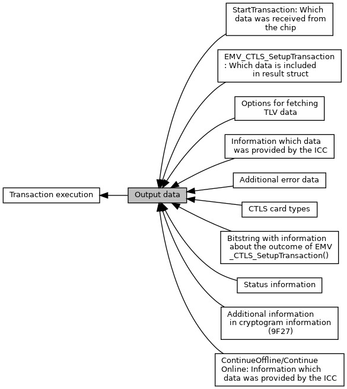
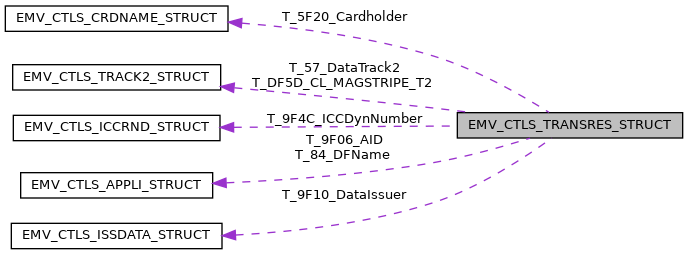

[Modules](#groups) \| [Data Structures](#nested-classes) \| [Typedefs](#typedef-members)

Collaboration diagram for Output data:

|  |  |
|----|----|
| Modules |  |
|   | <a href="group___c_l_t_r_x___c_a_r_d_t_y_p_e.md">CTLS card types</a> |
|   | Defines for [EMV_CTLS_TRANSRES_TYPE::ctlsCardType](#a0e43dc3092a4111fb7a44508a16676fa).  |
|   | <a href="group___d_e_f___s_e_l_e_c_t_r_e_s___t_r_x_i_n_f_o.md">Bitstring with information about the outcome of EMV_CTLS_SetupTransaction()</a> |
|   | Contents of [EMV_CTLS_STARTRES_STRUCT::TxnInformation](#a4c3b4d68baeb7717fc9788908b491929), <a href="group___f_u_n_c___f_l_o_w.md#ga1a86c76dcf8fec6e97ead6cf8f2717ff">EMV_CTLS_SetupTransaction()</a>  |
|   | <a href="group___d_e_f___o_u_t_p_u_t___s_e_l_e_c_t.md">EMV_CTLS_SetupTransaction: Which data is included in result struct</a> |
|   | Contents of the output in [EMV_CTLS_STARTRES_STRUCT::T_DF61_Info_Received_Data](#ab08da8ecbb047104d0c58e6f0ea141ee "Which data is valid, see EMV_CTLS_SetupTransaction: Which data is included in result struct."), <a href="group___f_u_n_c___f_l_o_w.md#ga1a86c76dcf8fec6e97ead6cf8f2717ff">EMV_CTLS_SetupTransaction()</a>  |
|   | <a href="group___d_e_f___d_f61.md">Information which data was provided by the ICC</a> |
|   | Contents of [EMV_CTLS_TRANSRES_STRUCT::T_DF61_Info_Received_Data](#ab08da8ecbb047104d0c58e6f0ea141ee "Information which of these data was provided by the ICC, see Information which data was provided by t...").  |
|   | <a href="group___d_e_f___d_f62.md">Additional error data</a> |
|   | DF62, 15 bytes, error reference.  |
|   | <a href="group___d_e_f___d_f61___s_e_l_e_c_t.md">StartTransaction: Which data was received from the chip</a> |
|   | Contents of <a href="group___a_d_k___t_r_x___e_x_e_c.md#ab08da8ecbb047104d0c58e6f0ea141ee">EMV_CT_SELECTRES_STRUCT::T_DF61_Info_Received_Data</a>.  |
|   | <a href="group___d_e_f___d_f61___t_r_a_n_s_r_e_s.md">ContinueOffline/ContinueOnline: Information which data was provided by the ICC</a> |
|   | Contents of <a href="group___a_d_k___t_r_x___e_x_e_c.md#ab08da8ecbb047104d0c58e6f0ea141ee">EMV_CT_TRANSRES_TYPE::T_DF61_Info_Received_Data</a>.  |
|   | <a href="group___c_r_y_p___e_m_v___a_d_k___i_n_f___a_d_d.md">Additional information in cryptogram information (9F27)</a> |
|   | 9F27 (cryptogram information) can carry more information than just AAC, TC, and ARQC. The ICC has the possibility to give back these additional information. Calling application may use these defines to analyse <a href="group___a_d_k___t_r_x___e_x_e_c.md#a2dbcdd3fc07a3872b2409d8f10cf2120">EMV_CT_TRANSRES_STRUCT::T_9F27_CryptInfo</a>.  |
|   | <a href="group___s_t_a_t_u_s___i_n_f_o.md">Status information</a> |
|   | defines for <a href="group___a_d_k___t_r_x___e_x_e_c.md#a89b6ee4a99c6f75514d803b0098aa2ed">EMV_CT_TRANSRES_STRUCT::StatusInfo</a>  |
|   | <a href="group___f_e_t_c_h___t_a_g_s___o_p_t_i_o_n_s.md">Options for fetching TLV data</a> |
|   | `options` for <a href="group___f_u_n_c___f_l_o_w.md#gab005fdec183a0c8fef18ae677cce6dc5">EMV_CT_fetchTxnTags()</a>  |

|  |  |
|----|----|
| Data Structures |  |
| struct   | [EMV_CTLS_STARTRES_STRUCT](#struct_e_m_v___c_t_l_s___s_t_a_r_t_r_e_s___s_t_r_u_c_t) |
|   | Result data of <a href="group___f_u_n_c___f_l_o_w.md#ga1a86c76dcf8fec6e97ead6cf8f2717ff">EMV_CTLS_SetupTransaction()</a> [More\...](#struct_e_m_v___c_t_l_s___s_t_a_r_t_r_e_s___s_t_r_u_c_t)  |
| struct   | [EMV_CTLS_TRANSRES_STRUCT](#struct_e_m_v___c_t_l_s___t_r_a_n_s_r_e_s___s_t_r_u_c_t) |
|   | Data structure for output data of <a href="group___f_u_n_c___f_l_o_w.md#gaf23f6f87fe90619810470fad7d11f321">EMV_CTLS_ContinueOffline()</a> and <a href="group___f_u_n_c___f_l_o_w.md#ga297b6843994afaa2e7a6f5e0e4a8af3e">EMV_CTLS_ContinueOnline()</a> [More\...](#struct_e_m_v___c_t_l_s___t_r_a_n_s_r_e_s___s_t_r_u_c_t)  |

|  |  |
|----|----|
| Typedefs |  |
| typedef struct [EMV_CTLS_STARTRES_STRUCT](#struct_e_m_v___c_t_l_s___s_t_a_r_t_r_e_s___s_t_r_u_c_t)  | [EMV_CTLS_STARTRES_TYPE](#ga2dce20509b74f876a52aa2e6fc42ec6b) |
|   | Result data of <a href="group___f_u_n_c___f_l_o_w.md#ga1a86c76dcf8fec6e97ead6cf8f2717ff">EMV_CTLS_SetupTransaction()</a> [More\...](#ga2dce20509b74f876a52aa2e6fc42ec6b)  |
| typedef struct [EMV_CTLS_TRANSRES_STRUCT](#struct_e_m_v___c_t_l_s___t_r_a_n_s_r_e_s___s_t_r_u_c_t)  | [EMV_CTLS_TRANSRES_TYPE](#ga0d11e77342658b02a027f9493e10b70a) |
|   | Data structure for output data of <a href="group___f_u_n_c___f_l_o_w.md#gaf23f6f87fe90619810470fad7d11f321">EMV_CTLS_ContinueOffline()</a> and <a href="group___f_u_n_c___f_l_o_w.md#ga297b6843994afaa2e7a6f5e0e4a8af3e">EMV_CTLS_ContinueOnline()</a> [More\...](#ga0d11e77342658b02a027f9493e10b70a)  |

## DetailedDescription {#detailed-description}

------------------------------------------------------------------------

## DataStructure Documentation {#data-structure-documentation}

## EMV_CTLS_STARTRES_STRUCT 

struct EMV_CTLS_STARTRES_STRUCT

Result data of <a href="group___f_u_n_c___f_l_o_w.md#ga1a86c76dcf8fec6e97ead6cf8f2717ff">EMV_CTLS_SetupTransaction()</a>

| Data Fields |  |  |
|----|----|----|
| unsigned char | T_DF61_Info_Received_Data\[8\] | Which data is valid, see <a href="group___d_e_f___o_u_t_p_u_t___s_e_l_e_c_t.md">EMV_CTLS_SetupTransaction: Which data is included in result struct</a>. |
| unsigned char | TxnInformation\[5\] | 
Bitstring with information about the outcome of <a href="group___f_u_n_c___f_l_o_w.md#ga1a86c76dcf8fec6e97ead6cf8f2717ff">EMV_CTLS_SetupTransaction()</a>, see <a href="group___d_e_f___s_e_l_e_c_t_r_e_s___t_r_x_i_n_f_o.md">Bitstring with information about the outcome of EMV_CTLS_SetupTransaction()</a> Available flag <a href="group___d_e_f___o_u_t_p_u_t___s_e_l_e_c_t.md#ga92a2b1c47094479574095371e07bbf59">OUTPUT_CTLS_SEL_TXN_INFO</a> TLV tag <a href="group___p_r_i_m___t_a_g_s__3_b_y_t_e.md#ga09cc2c6f9177f39a058659a665ef3ca6">TAG_DF8F0D_SETUP_RES_TRXINFO</a>
 |

## EMV_CTLS_TRANSRES_STRUCT 

struct EMV_CTLS_TRANSRES_STRUCT

Data structure for output data of <a href="group___f_u_n_c___f_l_o_w.md#gaf23f6f87fe90619810470fad7d11f321">EMV_CTLS_ContinueOffline()</a> and <a href="group___f_u_n_c___f_l_o_w.md#ga297b6843994afaa2e7a6f5e0e4a8af3e">EMV_CTLS_ContinueOnline()</a>

Valid data is indicated by <a href="group___d_e_f___d_f61.md">Information which data was provided by the ICC</a>

Collaboration diagram for EMV_CTLS_TRANSRES_STRUCT:

\[<a href="graph_legend.md">legend</a>\]

  ------------------------------------------------------------------------------------------------------------------------------------------------------------------------------------------------------------------------------------------------------------------------------------------------------------------------------------------------------------------------------------------------------------------------------------------------------------------------------------------------------------------------------------------------------------------------------------------------------------------------------------------------------------------------------------------------------------------------------------------------------------------------------------------------------------------------------------------------------------------------------------------------------------------------------------------------------------------------------------------------------------------------------------------------------------------------------------------------------------------------------------------------------------------------------------------------------------------------------------------------------------------------------------------------------------------------------------------------
  Data Fields                                                                                                                                                                                                                                                     
  ------------------------------------------------------------------------------------------------------------------- ------------------------------------------------------------------------------------------------------------------------------------------- --------------------------------------------------------------------------------------------------------------------------------------------------------------------------------------------------------------------------------------------------------------------------------------------------------------------------------------------------------------------------------------------------------------------------------------------------------------------------------------------------------------------------------------------------------------------------------------------------------------------------------------------------------------------------------------------------------------------------------------------------------------------------------------------------------------------------------------------------------------------------------------------------------------------------------------------------------------------------------------------------------------------------------------------------------------------------------
  unsigned char                                                                                                       Add_TXN_Tags\[<a href="_e_m_v___common___interface_8h.md#a9107c96b920b33b2e87a300066027170">EMV_ADK_ADD_TAG_SIZE</a>\]             **<a href="deprecated.md#_deprecated000068">Deprecated:</a>** Use <a href="group___f_u_n_c___f_l_o_w.md#ga8c9f0640ed818c3dc19da528f5f0b406">EMV_CTLS_fetchTxnTags()</a> instead.

  unsigned char                                                                                                       AppName\[16+1\]                                                                                                                             
application name, zero terminated (tag 9F12, tag 50, or configured default <a href="group___d_e_f___c_o_n_f___a_p_p_l_i.md#aa022d006c533c7901b3f03d691a7f4b0">EMV_CTLS_APPLIDATA_SCHEME_SPECIFIC_STRUCT::DefaultApplicationName_DFAB22</a>) TLV tag <a href="group___e_m_v_c_o___t_a_g_s.md#gaf705ddff22734d558b161db19bf24038">TAG_9F12_APP_PREFERRED_NAME</a>, validity bit <a href="group___d_e_f___d_f61.md#gac38ee70460d9cb4f362c52de8d196221">TRX_CTLS_APPNAME</a>

  unsigned long                                                                                                       CL_Mode                                                                                                                                     used Contactless mode (kernel) for this transaction Possible values: see <a href="group___c_l___m_o_d_e_s.md">Supported Contactless modes</a> **<a href="deprecated.md#_deprecated000069">Deprecated:</a>** Maintained only for backwards compatibility. Kernel is given by [EMV_CTLS_TRANSRES_TYPE::T_DF64_KernelDebugData](#a558a9d3945e1233063c57d26a329ad55 "Status data of the used CTLS Vertex kernel. See Kernel Debug Data.   TLV tag TAG_DF64_KERNEL_DEBUG,...")\[18\] and MSR transactions are indicated by [EMV_CTLS_TRANSRES_TYPE::StatusInfo](#a89b6ee4a99c6f75514d803b0098aa2ed "Common status info (see Status information)   TLV tag TAG_DF42_STATUS, validity bit TRX_CTLS_STATUSIN...") bit <a href="group___s_t_a_t_u_s___i_n_f_o.md#ga5a5eb8b54a6ada0ee197dff969a8e77e">EMV_ADK_SI_CONTACTLESS_MSR</a>
                                                                                                                                                                                                                                                                  TLV tag <a href="group___v_e_r_i___t_a_g_s.md#gaa66039efd92d9d68efc76d60ed6bfef5">TAG_C2_TRM_CL_MODES</a>, availability bit <a href="group___d_e_f___d_f61.md#ga9a1d5ecdb5ea20b68b2681a9d0926759">TRX_CTLS_CTLS_MODES</a>

  unsigned char                                                                                                       ctlsCardType                                                                                                                                
L1 type of contactless card, see <a href="group___c_l_t_r_x___c_a_r_d_t_y_p_e.md">CTLS card types</a> VFI reader framework does only fill this parameter in case <a href="group___f_u_n_c___f_l_o_w.md#gaf23f6f87fe90619810470fad7d11f321">EMV_CTLS_ContinueOffline()</a> was called with <a href="group___d_e_f___f_l_o_w___i_n_p_u_t.md#a6e4c160c32a77b556aa14495cc0961c5">EMV_CTLS_START_STRUCT::passthroughCardTypes</a> More detailed card type info can be obtained by usage of <a href="group___f_u_n_c___f_l_o_w.md#ga8c9f0640ed818c3dc19da528f5f0b406">EMV_CTLS_fetchTxnTags()</a> with <a href="group___p_r_i_m___t_a_g_s__3_b_y_t_e.md#gadfb6528a081a54ee72ab86165bf1dbfa">TAG_DF8F20_CTLS_CARD_TPYE</a> TLV tag <a href="group___v_e_r_i___p_r_i_m___t_a_g_s.md#gaccafa2f2bd67f5f75801004aa29fd02b">TAG_DF4F_CARDTYPE</a>, validity bit <a href="group___d_e_f___d_f61.md#gadeccaaa302406a7cac4f2c0b9b451360">TRX_CTLS_CARDTYPE</a>

  unsigned char                                                                                                       ScriptResults\[<a href="_e_m_v___c_t_l_s___interface_8h.md#aea99e8c6a4f1803f5faeb5fbb73c2efc">EMV_ADK_CL_SCRIPTRES_LEN</a>\]       Issuer script results TLV tag <a href="group___v_e_r_i___p_r_i_m___t_a_g_s.md#ga8533e1a9308749a3662b9303eb1c2bb3">TAG_DF07_UNCRIT_SCR</a>, validity bit <a href="group___d_e_f___d_f61.md#ga906cbd988cd1f772a654552fd9379f1d">TRX_CTLS_SCRIPTRESULTS</a>.

  unsigned short                                                                                                      ScriptResultsLen                                                                                                                            Issuer script results TLV tag <a href="group___v_e_r_i___p_r_i_m___t_a_g_s.md#ga8533e1a9308749a3662b9303eb1c2bb3">TAG_DF07_UNCRIT_SCR</a>, validity bit <a href="group___d_e_f___d_f61.md#ga906cbd988cd1f772a654552fd9379f1d">TRX_CTLS_SCRIPTRESULTS</a>.

  unsigned long                                                                                                       StatusInfo                                                                                                                                  Common status info (see <a href="group___s_t_a_t_u_s___i_n_f_o.md">Status information</a>) TLV tag <a href="group___v_e_r_i___p_r_i_m___t_a_g_s.md#ga119e82bf38d864a4b81d6e45d74f358d">TAG_DF42_STATUS</a>, validity bit <a href="group___d_e_f___d_f61.md#ga3288a09aa090d94c1fcfa42c45adcdd9">TRX_CTLS_STATUSINFO</a>.

  <a href="_e_m_v___c_t_l_s___interface_8h.md#ab6c32cada567b944c048d5d3b2c60e7b">EMV_CTLS_TRACK2_TYPE</a>    T_57_DataTrack2                                                                                                                             Track 2 Equivalent Data (this is chip equivalent data not CTLS magstripe data!) TLV tag <a href="group___e_m_v_c_o___t_a_g_s.md#ga2e6e79fb698c2021efe43366f6517b76">TAG_57_TRACK2_EQUIVALENT</a>, validity bit <a href="group___d_e_f___d_f61.md#gaeb35e83743abda682b88fed872752553">TRX_CTLS_57_DATA_TRACK2</a>.

  unsigned char                                                                                                       T_5A_PAN\[10\]                                                                                                                              Application Primary Account Number (PAN) TLV tag <a href="group___e_m_v_c_o___t_a_g_s.md#ga4ccedb21a71fcb6ace22bac98ba548a5">TAG_5A_APP_PAN</a>, validity bit <a href="group___d_e_f___d_f61.md#ga769860ba4da58824f1662e6b3013f1b0">TRX_CTLS_5A_PAN</a>.

  <a href="_e_m_v___c_t_l_s___interface_8h.md#a67b979074bfa957ea127c376d0cbe012">EMV_CTLS_CRDNAME_TYPE</a>   T_5F20_Cardholder                                                                                                                           Cardholder Name TLV tag <a href="group___e_m_v_c_o___t_a_g_s.md#ga28d5c5d3a12cb3cf62e64ccb3e9258bc">TAG_5F20_CARDHOLDER_NAME</a>, validity bit <a href="group___d_e_f___d_f61.md#ga75c4be16ea250e37b4ec1e392cfc1bd8">TRX_CTLS_5F20_CARDHOLDER</a>.

  unsigned char                                                                                                       T_5F24_AppExpDate\[3\]                                                                                                                      Application Expiration Date TLV tag <a href="group___e_m_v_c_o___t_a_g_s.md#ga5eb2095961ebe9a91e560003f75358bb">TAG_5F24_APP_EXP_DATE</a>, validity bit <a href="group___d_e_f___d_f61.md#ga0127987d05c247bd21ba457ea69ae085">TRX_CTLS_5F24_APPEXPDATE</a>.

  unsigned char                                                                                                       T_5F25_AppEffDate\[3\]                                                                                                                      Application Effective Date TLV tag <a href="group___e_m_v_c_o___t_a_g_s.md#gacd7028f61b8522799f207c7efa8e49d9">TAG_5F25_APP_EFF_DATE</a>, validity bit <a href="group___d_e_f___d_f61.md#ga37c3b1e1a9d39bafe45e8882161e1a6c">TRX_CTLS_5F25_APPEFFDATE</a>.

  unsigned char                                                                                                       T_5F28_IssCountryCode\[2\]                                                                                                                  Issuer Country Code TLV tag <a href="group___e_m_v_c_o___t_a_g_s.md#gaa35ef81cc90fe90126a537cbd611ead6">TAG_5F28_ISS_COUNTRY_CODE</a>, validity bit <a href="group___d_e_f___d_f61.md#ga122b9608ae8b11960c8452ef637df877">TRX_CTLS_5F28_ISSCOUNTRYCODE</a>.

  unsigned char                                                                                                       T_5F2A_CurrencyTrans\[2\]                                                                                                                   Transaction Currency Code (ISO 4217) TLV tag <a href="group___e_m_v_c_o___t_a_g_s.md#ga369ab2cc83e9b220bdfa79753f1f3962">TAG_5F2A_TRANS_CURRENCY</a>, validity bit <a href="group___d_e_f___d_f61.md#ga29d6b350ead511c45e064d758b3fc235">TRX_CTLS_5F2A_TRANS_CURRENCY</a>.

  unsigned char                                                                                                       T_5F2D_Lang_Pref\[8+1\]                                                                                                                     Language Preference (zero terminated) TLV tag <a href="group___e_m_v_c_o___t_a_g_s.md#gaaa613c7ef00b768c88fe5cc3ee16107b">TAG_5F2D_LANGUAGE</a>, validity bit <a href="group___d_e_f___d_f61.md#ga5793df80b7eaf4cdcb850ae54f274034">TRX_CTLS_5F2D_LANG_PREFERENCE</a>.

  unsigned char                                                                                                       T_5F30_ServiceCode\[2\]                                                                                                                     Service code as defined in ISO/IEC 7813 for track 1 and track 2, format: n3 TLV tag <a href="group___e_m_v_c_o___t_a_g_s.md#gacc4c4f91bcb9bf9fef0ec1257292b93e">TAG_5F30_SERVICE_CODE</a>, validity bit <a href="group___d_e_f___d_f61.md#ga75bd51cc535465011bd26d0fce325f40">TRX_CTLS_5F30_SERVICE_CODE</a>.

  unsigned char                                                                                                       T_5F34_PANSequenceNo\[1\]                                                                                                                   PAN sequence number TLV tag <a href="group___e_m_v_c_o___t_a_g_s.md#ga17f22ccb8130cc68e45609afc6b58f00">TAG_5F34_PAN_SEQUENCE_NB</a>, validity bit <a href="group___d_e_f___d_f61.md#gaebf1dd046f5c727930a53f424cc61f89">TRX_CTLS_5F34_PAN_SEQ_NUMBER</a>.

  unsigned char                                                                                                       T_5F36_Trx_Currency_Exp                                                                                                                     Transaction Currency Exponent TLV tag <a href="group___e_m_v_c_o___t_a_g_s.md#ga134c61ae2787b93c5def5bbf929f7cb4">TAG_5F36_TRANS_CURRENCY_EXP</a>, validity bit <a href="group___d_e_f___d_f61.md#gaf73573c5935a1eac5fa2966a8eca4a5f">TRX_CTLS_5F36_TRX_CURRENCY_EXPO</a>.

  unsigned char                                                                                                       T_82_AIP\[2\]                                                                                                                               Application Interchange Profile TLV tag <a href="group___e_m_v_c_o___t_a_g_s.md#gaa87267a7ce44cc525b3515a3549898c2">TAG_82_AIP</a>, validity bit <a href="group___d_e_f___d_f61.md#ga439a0cc2468aa09b24299d6795df53a7">TRX_CTLS_82_AIP</a>.

  <a href="_e_m_v___c_t_l_s___interface_8h.md#a36f402aaa6257bc25d7ea62a93cbd92b">EMV_CTLS_APPLI_TYPE</a>     T_84_DFName                                                                                                                                 Dedicated File (DF) Name TLV tag <a href="group___e_m_v_c_o___t_a_g_s.md#ga69c4599943205d95394b62eef950e4c5">TAG_84_DF_NAME</a>, validity bit <a href="group___d_e_f___d_f61.md#ga46bd3a8ec168ef558eed8e8b3ab4bd74">TRX_CTLS_84_DFNAME</a>.

  unsigned char                                                                                                       T_95_TVR\[5\]                                                                                                                               Terminal Verification Results TLV tag <a href="group___e_m_v_c_o___t_a_g_s.md#ga3227240d53824d37d80b5f5a254daf2a">TAG_95_TVR</a>, validity bit <a href="group___d_e_f___d_f61.md#ga43e801697a5c63ed4bc6cbd244065c08">TRX_CTLS_95_TVR</a>.

  unsigned char                                                                                                       T_9A_Date\[3\]                                                                                                                              Transaction Date TLV tag <a href="group___e_m_v_c_o___t_a_g_s.md#ga9b8dc8671fc9d3af99aefdf59659cd67">TAG_9A_TRANS_DATE</a>, validity bit <a href="group___d_e_f___d_f61.md#ga6da0be4f40f2532c215808b6a25ddeaa">TRX_CTLS_9A_DATE</a>.

  unsigned char                                                                                                       T_9B_TSI\[2\]                                                                                                                               Transaction Status Information TLV tag <a href="group___e_m_v_c_o___t_a_g_s.md#ga42e197884e26dbe7ef666d8f6881b376">TAG_9B_TSI</a>, validity bit <a href="group___d_e_f___d_f61.md#ga0124c9e95b2ffaac955c776e77655128">TRX_CTLS_9B_TSI</a>.

  unsigned char                                                                                                       T_9C_TransType                                                                                                                              Transaction Type see <a href="group___t_r_a_n_s___t_y_p_e_s.md">Transaction type (Tag 9C)</a> EMVCo value range, used on ICC interface, for cryptogram calculation, and as it has to be sent to the host May be different to input from <a href="group___d_e_f___f_l_o_w___i_n_p_u_t.md#ae9357fb5fbb42943ac347ea3b2cd4d6a">EMV_CTLS_START_STRUCT::TransType</a> as values greater <a href="group___t_r_a_n_s___t_y_p_e_s.md#ga1558c972336a0796488676fc4322afe5">EMV_ADK_TRAN_TYPE_INTERNAL_LIMIT</a> are mapped to <a href="group___t_r_a_n_s___t_y_p_e_s.md#ga9641f6f9edd014d72d3011013c9f2c1c">EMV_ADK_TRAN_TYPE_GOODS_SERVICE</a> TLV tag <a href="group___e_m_v_c_o___t_a_g_s.md#ga4064d8681a4f0a40f4a3bf304f2a0902">TAG_9C_TRANS_TYPE</a> Availability bit <a href="group___d_e_f___d_f61.md#gaa3e1591f094128abf045113114ca2221">TRX_CTLS_9C_TRANSTYPE</a>.

  unsigned char                                                                                                       T_9F02_TXNAmount\[6\]                                                                                                                       Transaction Amount TLV tag <a href="group___e_m_v_c_o___t_a_g_s.md#ga6952b55733eff49c55768a6f7802f9e4">TAG_9F02_NUM_AMOUNT_AUTH</a>, validity bit <a href="group___d_e_f___d_f61.md#gabad9a549092f395b3f4ae39dd5b56ab3">TRX_CTLS_9F02_AMOUNT</a>.

  unsigned char                                                                                                       T_9F03_TXNAdditionalAmount\[6\]                                                                                                             Transaction Additional (Cashback) Amount TLV tag <a href="group___e_m_v_c_o___t_a_g_s.md#gaccc339b2226ade4b5ab935624377f800">TAG_9F03_NUM_AMOUNT_OTHER</a>, validity bit <a href="group___d_e_f___d_f61.md#ga97ccf9c1b7072b71af8bb22bf9a637c3">TRX_CTLS_9F03_CB_AMOUNT</a>.

  <a href="_e_m_v___c_t_l_s___interface_8h.md#a36f402aaa6257bc25d7ea62a93cbd92b">EMV_CTLS_APPLI_TYPE</a>     T_9F06_AID                                                                                                                                  Application Identifier (AID) - terminal TLV tag <a href="group___e_m_v_c_o___t_a_g_s.md#ga7670871675627d7e74d29683fbacf01a">TAG_9F06_AID</a>, validity bit <a href="group___d_e_f___d_f61.md#ga0cabf4b5ec4ea80909818b9b50282dc7">TRX_CTLS_9F06_AID</a>.

  unsigned char                                                                                                       T_9F08_ICC_Appli_Vers_No\[2\]                                                                                                               ICC Application Version Number TLV tag <a href="group___e_m_v_c_o___t_a_g_s.md#ga49ac73f311523b949020821550b7cda8">TAG_9F08_ICC_APP_VERSION_NB</a>, validity bit <a href="group___d_e_f___d_f61.md#ga042fb16a922bbfda7303c3341d23c2ae">TRX_CTLS_9F08_ICC_APPLI_VERS_NO</a>.

  unsigned char                                                                                                       T_9F09_VerNum\[2\]                                                                                                                          Application Version Number TLV tag <a href="group___e_m_v_c_o___t_a_g_s.md#gac0fb6f2c9da5e835754d94e7edf4f7c2">TAG_9F09_TRM_APP_VERSION_NB</a>, validity bit <a href="group___d_e_f___d_f61.md#ga3dfe66ba148305dadec91002a369f0ee">TRX_CTLS_9F09_VERNUM</a>.

  unsigned char                                                                                                       T_9F0D_IACDefault\[5\]                                                                                                                      Issuer Action Code - Default TLV tag <a href="group___e_m_v_c_o___t_a_g_s.md#gaf1f1b225dbba527e67b529d1b9bc0b41">TAG_9F0D_IAC_DEFAULT</a>, validity bit <a href="group___d_e_f___d_f61.md#ga1a2cab766cee048acb592691595f37f0">TRX_CTLS_9F0D_IAC_DEFAULT</a>.

  unsigned char                                                                                                       T_9F0E_IACDenial\[5\]                                                                                                                       Issuer Action Code - Denial TLV tag <a href="group___e_m_v_c_o___t_a_g_s.md#ga56066a347d8d88263ea6340cccbae911">TAG_9F0E_IAC_DENIAL</a>, validity bit <a href="group___d_e_f___d_f61.md#ga5155ca4e079e072351b5771057463220">TRX_CTLS_9F0E_IAC_DENIAL</a>.

  unsigned char                                                                                                       T_9F0F_IACOnline\[5\]                                                                                                                       Issuer Action Code - Online TLV tag <a href="group___e_m_v_c_o___t_a_g_s.md#gaff475c053b8dce5ca076bc3613c3888a">TAG_9F0F_IAC_ONLINE</a>, validity bit <a href="group___d_e_f___d_f61.md#ga343df64d01b27d6a05a927bd2feeb47c">TRX_CTLS_9F0F_IAC_ONLINE</a>.

  <a href="_e_m_v___c_t_l_s___interface_8h.md#a920fa39c86695a91defa5ac508454605">EMV_CTLS_ISSDATA_TYPE</a>   T_9F10_DataIssuer                                                                                                                           Issuer Application Data TLV tag <a href="group___e_m_v_c_o___t_a_g_s.md#ga1ff0740aef66ba7bc912c7262abd86d0">TAG_9F10_ISS_APP_DATA</a>, validity bit <a href="group___d_e_f___d_f61.md#ga7accf40ed62028681429d67e3498fa6f">TRX_CTLS_9F10_DATAISSUER</a>.

  unsigned char                                                                                                       T_9F16_MerchIdent\[15\]                                                                                                                     Merchant Identifier TLV tag <a href="group___e_m_v_c_o___t_a_g_s.md#ga184ccaaef50ada9988bfd4af37b8c9fb">TAG_9F16_MERCHANT_ID</a>, validity bit <a href="group___d_e_f___d_f61.md#gaaf9d7260420cde44fbb0bad12d7e2441">TRX_CTLS_9F16_MERCHANT_ID</a>.

  unsigned char                                                                                                       T_9F1A_TermCountryCode\[2\]                                                                                                                 Terminal Country Code TLV tag <a href="group___e_m_v_c_o___t_a_g_s.md#ga5bc987c3686fd5821f20d21015354787">TAG_9F1A_TRM_COUNTRY_CODE</a>, validity bit <a href="group___d_e_f___d_f61.md#ga3c58ef2afff078cc2d15643f07fc7db1">TRX_CTLS_9F1A_TERM_COUNTRY_CODE</a>.

  unsigned char                                                                                                       T_9F1E_IFDSerialNumber\[8\]                                                                                                                 Interface Device (IFD) serial number TLV tag <a href="group___e_m_v_c_o___t_a_g_s.md#ga1edb578c8df9ce5a55b3204cda45d198">TAG_9F1E_IFD_SERIAL_NB</a>, validity bit <a href="group___d_e_f___d_f61.md#ga4672bc7841ead7ba65db2fdb4f2271c6">TRX_CTLS_9F1E_IFDSERIALNUMBER</a>.

  unsigned char                                                                                                       T_9F21_Time\[3\]                                                                                                                            Transaction Time TLV tag <a href="group___e_m_v_c_o___t_a_g_s.md#ga680a68f0ce959ac674f997968145a09c">TAG_9F21_TRANS_TIME</a>, validity bit <a href="group___d_e_f___d_f61.md#gaf99579e9916a6effd1ae07c4c767efed">TRX_CTLS_9F21_TIME</a>.

  unsigned char                                                                                                       T_9F26_Cryptogramm\[8\]                                                                                                                     Application cryptogram TLV tag <a href="group___e_m_v_c_o___t_a_g_s.md#gac5b1de965da383855ef078f7c001efe1">TAG_9F26_APP_CRYPTOGRAM</a>, validity bit <a href="group___d_e_f___d_f61.md#gaf51f2c0b7fbdde7f15d1ff07d2126d89">TRX_CTLS_9F26_CRYPTOGRAMM</a>.

  unsigned char                                                                                                       T_9F27_CryptInfo                                                                                                                            Cryptogram information data (CID) TLV tag <a href="group___e_m_v_c_o___t_a_g_s.md#gaa101e01de60c1261ba8324079a299e33">TAG_9F27_CRYPT_INFO_DATA</a>, validity bit <a href="group___d_e_f___d_f61.md#gaf4c56c62e1cfb0bf842e1e69b8e4f8ab">TRX_CTLS_9F27_CRYPTINFO</a>.

  unsigned char                                                                                                       T_9F33_TermCap\[3\]                                                                                                                         Terminal Capabilities (if configured by <a href="group___d_e_f___c_o_n_f___a_p_p_l_i.md#struct_e_m_v___c_t_l_s___a_p_p_l_i_d_a_t_a___s_c_h_e_m_e___s_p_e_c_i_f_i_c___s_t_r_u_c_t">EMV_CTLS_APPLIDATA_SCHEME_SPECIFIC_STRUCT</a>) TLV tag <a href="group___e_m_v_c_o___t_a_g_s.md#gad3ec876483505eb23aad4e1b210653f5">TAG_9F33_TRM_CAPABILITIES</a>, validity bit <a href="group___d_e_f___d_f61.md#ga5b58b9ea6a8b74c19127080aaffcc64d">TRX_CTLS_9F33_TERMCAP</a>.

  unsigned char                                                                                                       T_9F34_CVM_Res\[3\]                                                                                                                         CVM Results TLV tag <a href="group___e_m_v_c_o___t_a_g_s.md#gabdd39eac033e163719eb2f845fffbf62">TAG_9F34_CVM_RESULTS</a>, validity bit <a href="group___d_e_f___d_f61.md#ga0d03d17679d1ed78d8246aff4e9e24de">TRX_CTLS_9F34_CVM_RES</a>.

  unsigned char                                                                                                       T_9F35_TermTyp                                                                                                                              Terminal Type, see <a href="group___t_e_r_m___t_y_p_e_s.md">Terminaltypes (Tag 9F35)</a> TLV tag <a href="group___e_m_v_c_o___t_a_g_s.md#gace5b4ef50a58d29b2f5296c2c17273c9">TAG_9F35_TRM_TYPE</a>, validity bit <a href="group___d_e_f___d_f61.md#ga8418cdff8aca0cd1e595f57febf3a4e8">TRX_CTLS_9F35_TERMTYP</a>.

  unsigned char                                                                                                       T_9F36_ATC\[2\]                                                                                                                             Application transaction counter (ATC), source: ICC TLV tag <a href="group___e_m_v_c_o___t_a_g_s.md#ga776acfe7de52e4ec25163354ead04dcb">TAG_9F36_ATC</a>, validity bit <a href="group___d_e_f___d_f61.md#ga9ce1f826e61328664ce56fe591efc5cc">TRX_CTLS_9F36_ATC</a>.

  unsigned char                                                                                                       T_9F37_RandomNumber\[4\]                                                                                                                    Unpredictable Number TLV tag <a href="group___e_m_v_c_o___t_a_g_s.md#gad08084306abcf29bb9517b75b0b5b189">TAG_9F37_UNPREDICTABLE_NB</a>, validity bit <a href="group___d_e_f___d_f61.md#ga69eb746aef81abd72754a9f09affb3d7">TRX_CTLS_9F37_RANDOM_NUMBER</a>.

  unsigned char                                                                                                       T_9F39_POSEntryMode                                                                                                                         POS entry mode, see ISO 8583 TLV tag <a href="group___e_m_v_c_o___t_a_g_s.md#ga52532bf55c516d8055dcba4695fdc159">TAG_9F39_POS_ENTRY_MODE</a>, validity bit <a href="group___d_e_f___d_f61.md#ga10a0ac6972ac282cad7a459b3aed63bb">TRX_CTLS_9F39_POS_ENTRY_MODE</a>.

  unsigned char                                                                                                       T_9F40_AddTermCap\[5\]                                                                                                                      Additional Terminal Capabilities (if configured by EMV_CTLS_APPLIDATA_SCHEME_SPECIFIC_STRUCT::TermAddCap) TLV tag <a href="group___e_m_v_c_o___t_a_g_s.md#ga5670c7d223a0af749d5b8b251e32f870">TAG_9F40_ADD_TRM_CAP</a>, validity bit <a href="group___d_e_f___d_f61.md#gad23a36cecde7d69ee9b7308ad3174837">TRX_CTLS_9F40_TERMCAP</a>.

  unsigned char                                                                                                       T_9F41_TransCount\[4\]                                                                                                                      
Transaction Sequence Counter Transaction Flow just gives back what was configured by <a href="group___d_e_f___f_l_o_w___i_n_p_u_t.md#abe3243bfe7a5470e7218711c199bddc7">EMV_CTLS_PAYMENT_STRUCT::TransCount</a> TLV tag <a href="group___e_m_v_c_o___t_a_g_s.md#gab382a6fa7762c3e7589ad7cf877d77fc">TAG_9F41_TRANS_SEQUENCE_NB</a>, validity bit <a href="group___d_e_f___d_f61.md#ga5f1ce87d053de2f3caf29a444884ee94">TRX_CTLS_9F41_TRANSCOUNT</a>

  unsigned char                                                                                                       T_9F45_DataAuthCode\[2\]                                                                                                                    Data Authentication Code, optional: present if SDA card TLV tag <a href="group___e_m_v_c_o___t_a_g_s.md#gafb250579afe8802f385c3c654980db4c">TAG_9F45_DATA_AUTHENT_CODE</a>, validity bit <a href="group___d_e_f___d_f61.md#gada1ea5ab0aeadb29577b6211927860bf">TRX_CTLS_9F45_DATAAUTHCODE</a>.

  <a href="_e_m_v___c_t_l_s___interface_8h.md#a21cca152c73a80e16301342886ca0e9f">EMV_CTLS_ICCRND_TYPE</a>    T_9F4C_ICCDynNumber                                                                                                                         optional: present if DDA/CDA card TLV tag <a href="group___e_m_v_c_o___t_a_g_s.md#ga6582a8aec892abaaf7328da0a9160a1f">TAG_9F4C_ICC_DYNAMIC_NB</a>, validity bit <a href="group___d_e_f___d_f61.md#gabbb00f7db50633960af8b981698d257c">TRX_CTLS_9F4C_ICCDYNNUMBER</a>

  unsigned char                                                                                                       T_9F53_MC_CatCode\[1\]                                                                                                                      Mastercard Transaction Category Code TLV tag <a href="group___m_c___t_a_g_s.md#ga47396b01e28e3eadd46f0f1a5f79662e">TAG_9F53_TRANS_CATEGORY_CODE</a>, validity bit <a href="group___d_e_f___d_f61.md#gab098e6cdd688e1bca3cebb78e8834c48">TRX_CTLS_9F53_MC_CATCODE</a>.

  unsigned char                                                                                                       T_9F5D_CL_VISA_AOSA\[<a href="group___a_d_k___l_i_m_i_t_s.md#gad5cac2b5abf312efe65c8dba287b7e33">EMV_ADK_BCD_AMOUNT_LEN</a>\]      Offline Spending Amount/Offline Balance, for example Visa, CUP: \'9F5D\', Mastercard: \'9F50\', JCB: \'9F5F\' TLV tag <a href="group___v_i_s_a___t_a_g_s.md#gaf91a05658cd7bfa54c3670018779e15c">TAG_9F5D_VISA_AOSA</a>, validity bit <a href="group___d_e_f___d_f61.md#ga99ea128f67fea2dbe846dbaf17e81009">TRX_CTLS_9F5D_VISA_AOSA</a>.

  unsigned char                                                                                                       T_9F66_CL_TTQ\[4\]                                                                                                                          Visa TTQ (Contactless only) TLV tag <a href="group___v_i_s_a___t_a_g_s.md#ga30362da6e863c342f262adc3cafb680e">TAG_9F66_TTQ</a>, validity bit <a href="group___d_e_f___d_f61.md#gaffb407adb76b3bf04a722bfbadd87abd">TRX_CTLS_9F66_TTQ</a>.

  unsigned char                                                                                                       T_9F6C_CL_VISA_CTQ\[2\]                                                                                                                     Visa CTQ (Contactless only) TLV tag <a href="group___v_i_s_a___t_a_g_s.md#ga9f71361a75edb14683a5b2e3049ee1b0">TAG_9F6C_VISA_CTQ</a>, validity bit <a href="group___d_e_f___d_f61.md#ga26b1917578a164f2cbf082d20196a1e5">TRX_CTLS_9F6C_VISA_CTQ</a>.

  <a href="_e_m_v___c_t_l_s___interface_8h.md#ab6c32cada567b944c048d5d3b2c60e7b">EMV_CTLS_TRACK2_TYPE</a>    T_DF5D_CL_MAGSTRIPE_T2                                                                                                                      
Contactless magstripe data (different tags are used for the schemes (payWave,PayPass,Amex, \...) therefore an own tag is used to identify magstripe data) TLV tag <a href="group___v_e_r_i___p_r_i_m___t_a_g_s.md#ga06bae8054588b8ee4199225c35766228">TAG_DF5E_CL_MAGSTRIPE_T2</a>, validity bit <a href="group___d_e_f___d_f61.md#ga122b2a99da354f5ecd0b81a6f26a3e73">TRX_CTLS_DF5D_CL_MAGSTRIPE</a>

  unsigned char                                                                                                       T_DF61_Info_Received_Data\[8\]                                                                                                              Information which of these data was provided by the ICC, see <a href="group___d_e_f___d_f61.md">Information which data was provided by the ICC</a>.

  unsigned char                                                                                                       T_DF64_KernelDebugData\[32\]                                                                                                                Status data of the used CTLS Vertex kernel. See <a href="pg_emv_contactless_users_guide.md#subsubsection_emv_ctls_kerneldebugdata">Kernel Debug Data</a>. TLV tag <a href="group___v_e_r_i___p_r_i_m___t_a_g_s.md#gab0562bc9dcc3f6bb022244484d01db88">TAG_DF64_KERNEL_DEBUG</a>, validity bit <a href="group___d_e_f___d_f61.md#ga608fb772547fa5e9695678d164f047d2">TRX_CTLS_DF64_KERNEL_DEBUG</a>.

  unsigned char                                                                                                       T_DF8104_CL_MC_BALANCE\[<a href="group___a_d_k___l_i_m_i_t_s.md#gad5cac2b5abf312efe65c8dba287b7e33">EMV_ADK_BCD_AMOUNT_LEN</a>\]   PayPass: Balance before GenAC TLV tag <a href="group___v_e_r_i___p_r_i_m___t_a_g_s.md#gaa0b1f60a25e66ad57498ff4cf8087265">TAG_DF32_MC_BALANCE_8104</a>, validity bit <a href="group___d_e_f___d_f61.md#gad7e42e5d1264e3daf3d3022901c6e730">TRX_CTLS_DF8104_MC_BALANCE</a>.

  unsigned char                                                                                                       T_DF8105_CL_MC_BALANCE\[<a href="group___a_d_k___l_i_m_i_t_s.md#gad5cac2b5abf312efe65c8dba287b7e33">EMV_ADK_BCD_AMOUNT_LEN</a>\]   PayPass: Balance after GenAC TLV tag <a href="group___v_e_r_i___p_r_i_m___t_a_g_s.md#gaaa299fe425a7bc683473ae8677ed1e57">TAG_DF38_MC_BALANCE_8105</a>, validity bit <a href="group___d_e_f___d_f61.md#ga7cab46f9b953187b254355bb88d5a9d2">TRX_CTLS_DF8105_MC_BALANCE</a>.

  unsigned char                                                                                                       TACDefault\[5\]                                                                                                                             Terminal Action Code - Default TLV tag <a href="group___v_e_r_i___p_r_i_m___t_a_g_s.md#ga588b92246f48302d61cc055baf122dda">TAG_DF23_TAC_DEFAULT</a>, validity bit <a href="group___d_e_f___d_f61.md#ga07e4ed213d9b44cca1f4e4745bb83524">TRX_CTLS_TAC_DEFAULT</a>.

  unsigned char                                                                                                       TACDenial\[5\]                                                                                                                              Terminal Action Code - Denial TLV tag <a href="group___v_e_r_i___p_r_i_m___t_a_g_s.md#ga313084d02966bb6075d6a07b5e227ac3">TAG_DF21_TAC_DENIAL</a>, validity bit <a href="group___d_e_f___d_f61.md#ga4cccd04f31e427e5cf337257ed0d2d91">TRX_CTLS_TAC_DENIAL</a>.

  unsigned char                                                                                                       TACOnline\[5\]                                                                                                                              Terminal Action Code - Online TLV tag <a href="group___v_e_r_i___p_r_i_m___t_a_g_s.md#ga8300df6d32eb040757cce4594db2eea8">TAG_DF22_TAC_ONLINE</a>, validity bit <a href="group___d_e_f___d_f61.md#ga55acaab74ea711daf8c9b2709676dba6">TRX_CTLS_TAC_ONLINE</a>.
  ------------------------------------------------------------------------------------------------------------------------------------------------------------------------------------------------------------------------------------------------------------------------------------------------------------------------------------------------------------------------------------------------------------------------------------------------------------------------------------------------------------------------------------------------------------------------------------------------------------------------------------------------------------------------------------------------------------------------------------------------------------------------------------------------------------------------------------------------------------------------------------------------------------------------------------------------------------------------------------------------------------------------------------------------------------------------------------------------------------------------------------------------------------------------------------------------------------------------------------------------------------------------------------------------------------------------------------------------

## TypedefDocumentation {#typedef-documentation}

## EMV_CTLS_STARTRES_TYPE 

typedef struct [EMV_CTLS_STARTRES_STRUCT](#struct_e_m_v___c_t_l_s___s_t_a_r_t_r_e_s___s_t_r_u_c_t) [EMV_CTLS_STARTRES_TYPE](#ga2dce20509b74f876a52aa2e6fc42ec6b)

Result data of <a href="group___f_u_n_c___f_l_o_w.md#ga1a86c76dcf8fec6e97ead6cf8f2717ff">EMV_CTLS_SetupTransaction()</a>

## EMV_CTLS_TRANSRES_TYPE 

typedef struct [EMV_CTLS_TRANSRES_STRUCT](#struct_e_m_v___c_t_l_s___t_r_a_n_s_r_e_s___s_t_r_u_c_t) [EMV_CTLS_TRANSRES_TYPE](#ga0d11e77342658b02a027f9493e10b70a)

Data structure for output data of <a href="group___f_u_n_c___f_l_o_w.md#gaf23f6f87fe90619810470fad7d11f321">EMV_CTLS_ContinueOffline()</a> and <a href="group___f_u_n_c___f_l_o_w.md#ga297b6843994afaa2e7a6f5e0e4a8af3e">EMV_CTLS_ContinueOnline()</a>

Valid data is indicated by <a href="group___d_e_f___d_f61.md">Information which data was provided by the ICC</a>
