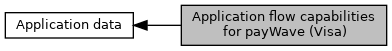

[Macros](#define-members)

Contents of <a href="group___d_e_f___c_o_n_f___a_p_p_l_i.md#a2ecdf1dde8e274003bee99e35551f0e8">EMV_CTLS_APPLIDATA_VK_STRUCT::AppFlowCap_DFAB31</a>. [More\...](#details)

Collaboration diagram for Application flow capabilities for payWave (Visa):

|  |  |
|----|----|
| Macros |  |
| #define  | [EMV_CTLS_FLOW_VK_STATUS_CHECK_ENABLE_0](#ga5d69b60626c7f797e2286ef0dcba4cae)   0x01 |
|   | B1b1: (Vel: y VFI: y) Enable status check for one single unit of currency (1\$ txn is going online for status check) [More\...](#ga5d69b60626c7f797e2286ef0dcba4cae)  |
| #define  | [EMV_CTLS_FLOW_VK_ZERO_CHECK_ENABLE_SKIP_0](#ga2a2975f6aa1664ce95006f9f46420e08)   0x02 |
|   | B1b2: (Vel: y VFI: y) Enable zero check for zero amount transaction, Option 2: skip AID for zero amount txns. Can\'t be combined with Option 2 in B1b3. [More\...](#ga2a2975f6aa1664ce95006f9f46420e08)  |
| #define  | [EMV_CTLS_FLOW_VK_ZERO_CHECK_ENABLE_ONLINE_0](#ga2a1b94cb2bed8bde9425e0768713810d)   0x04 |
|   | B1b3: (Vel: y VFI: y) Enable zero check for zero amount transaction, Option 1: going online for zero amount txns. Can\'t be combined with Option 1 in B1b2. This is the default option. This is the prioritary option if both options are set. [More\...](#ga2a1b94cb2bed8bde9425e0768713810d)  |
| #define  | [EMV_CTLS_FLOW_VK_CHECK_INCONS_TRACK2_PAN_0](#gafc3ed4111417370d6376eeba3ac79dfd)   0x08 |
|   | B1b4: (Vel: y VFI: n) Check consistency of track2 equivalent data (<a href="group___e_m_v_c_o___t_a_g_s.md#ga2e6e79fb698c2021efe43366f6517b76">TAG_57_TRACK2_EQUIVALENT</a>) provided by ICC. Validate format and that contents matches to <a href="group___e_m_v_c_o___t_a_g_s.md#ga4ccedb21a71fcb6ace22bac98ba548a5">TAG_5A_APP_PAN</a>. Visa Europe stuff VppT. [More\...](#gafc3ed4111417370d6376eeba3ac79dfd)  |
| #define  | [EMV_CTLS_FLOW_VK_CASHBACK_NOT_FORCED_CVM_0](#gafd3bbc00eeb93c5317a0d01b7518128d)   0x10 |
|   | B1b5: (Vel: y VFI: n) Per default cashback transactions require CVM and are forced online by setting floorlimit to 0, you can use standard CVM limit and floorlimit if you set this flag. [More\...](#gafd3bbc00eeb93c5317a0d01b7518128d)  |
| #define  | [EMV_CTLS_FLOW_VK_SUCCESS_TONE_ON_DECLINE](#gaa454c34bb27f34df3f59744602e78dad)   0x20 |
|   | B1b6: [More\...](#gaa454c34bb27f34df3f59744602e78dad)  |
| #define  | [EMV_CTLS_FLOW_VK_ALERT_TONE_ON_DECLINE](#ga99f4b117131e617954edcb36bed73668)   0x40 |
| #define  | [EMV_CTLS_FLOW_VK_GET_DATA_9F68_0](#gaaa6fb016ffe6b78962e16dae32cfbc66)   0x80 |
|   | B1b8: (Vel: y VFI: n) Card Read Flow initiated with <a href="group___t_r_a_n_s___t_y_p_e_s.md#gae0e3dc5d03cdc24cd8767d6f372c8cc4">EMV_ADK_TRAN_TYPE_READ_CARD_DATA</a> for retrieval of tag 9F68 (Card Additional Processes) [More\...](#gaaa6fb016ffe6b78962e16dae32cfbc66)  |
| #define  | [EMV_CTLS_FLOW_VK_ENABLE_TAGS_AT_GPO](#gad8d12a8621a689f46b711d79ebe9ffdd)   0x01 |
|   | B2b1: (Vel: y VFI: n) Apply workaround that Visa kernel up to version 2.1.5 accepts certain tags at GPO step. These are 9F07 & 5F28 for instance. [More\...](#gad8d12a8621a689f46b711d79ebe9ffdd)  |
| #define  | [EMV_CTLS_FLOW_VK_ZERO_CHECK_DISABLE_1](#ga0fd98a01b74c75d4e415543eb1a79b57)   0x02 |
|   | B2b2: (Vel: y VFI: n) Disable Visa zero check. [More\...](#ga0fd98a01b74c75d4e415543eb1a79b57)  |
| #define  | [EMV_CTLS_FLOW_VK_ODO_SUPPORT_1](#ga338770bcabcb99e2eeb442dbcc35a716)   0x08 |
|   | B2b4: (Vel: y VFI n) VK2.2.3 only: Enable Offline Data Authentication for online transactions (ODO) according \"Visa ODA for qVSDC Online Specification\". Note: To enable this feature, additionally TTQ B1b1 (9F66, Offline Data Authentication for Online Authorizations supported) must be set. [More\...](#ga338770bcabcb99e2eeb442dbcc35a716)  |
| #define  | [EMV_CTLS_FLOW_VK_ODO_SDA_1](#ga6bbf95e1ae4f1b2ea403a31682618709)   0x10 |
|   | B2b5: (Vel: y VFI n) VK2.2.3 only: Enable SDA for ODO. [More\...](#ga6bbf95e1ae4f1b2ea403a31682618709)  |
| #define  | [EMV_CTLS_FLOW_VK_ODO_DDA_1](#ga1f8f437abf21c8d6c420c5127210aa9c)   0x20 |
|   | B2b6: (Vel: y VFI n) VK2.2.3 only: Enable fDDA for ODO. [More\...](#ga1f8f437abf21c8d6c420c5127210aa9c)  |
| #define  | [EMV_CTLS_FLOW_VK_ODO_SDA_ERR_ONLINE_1](#gaeb31ce94e928855cddcf8ef8b39256a0)   0x40 |
|   | B2b7: (Vel: y VFI n) VK2.2.3 only: Outcome for ODO SDA error: 0 = Decline, 1 = Go online. [More\...](#gaeb31ce94e928855cddcf8ef8b39256a0)  |
| #define  | [EMV_CTLS_FLOW_VK_ODO_DDA_ERR_ONLINE_1](#gafca83538dd2bfa53c33ceed5ad138b43)   0x80 |
|   | B2b8: (Vel: y VFI n) VK2.2.3 only: Outcome for ODO fDDA error: 0 = Decline, 1 = Go online. [More\...](#gafca83538dd2bfa53c33ceed5ad138b43)  |
| #define  | [EMV_CTLS_FLOW_VK_OMIT_AUC_INT_CASH_2](#ga5d8445a251f828da07d374af15147a88)   0x01 |
|   | B3b1: (Vel: y VFI n) Omit AUC \"International Cash\" check. [More\...](#ga5d8445a251f828da07d374af15147a88)  |
| #define  | [EMV_CTLS_FLOW_VK_OMIT_AUC_INT_CASHBACK_2](#gac7712924c49b643690ad66321b5b38af)   0x02 |
|   | B3b2: (Vel: y VFI n) Omit AUC \"International Cashback\" check. [More\...](#gac7712924c49b643690ad66321b5b38af)  |
| #define  | [EMV_CTLS_FLOW_VK_OMIT_AUC_DOM_CASH_2](#ga251b93e189a4ecd953185c7635baac18)   0x04 |
|   | B3b3: (Vel: y VFI n) Omit AUC \"Domestic Cash\" check. [More\...](#ga251b93e189a4ecd953185c7635baac18)  |
| #define  | [EMV_CTLS_FLOW_VK_OMIT_AUC_DOM_CASHBACK_2](#ga4d400bb832d850daeebbcf33fdef04d9)   0x08 |
|   | B3b4: (Vel: y VFI n) Omit AUC \"Domestic Cashback\" check. [More\...](#ga4d400bb832d850daeebbcf33fdef04d9)  |
| #define  | [EMV_CTLS_FLOW_VK_ZERO_CASHBACK_AMOUNT_2](#gadcdaeddc4f61e2886c60c2a2a1ba3452)   0x10 |
|   | B3b5: (Vel: y VFI n) Set Cashback amount to zero for Cashback transactions. Workaround to allow Cashback transactions with Russian cards not supporting domestic Cashback. [More\...](#gadcdaeddc4f61e2886c60c2a2a1ba3452)  |
| #define  | [EMV_CTLS_FLOW_VK_CASHBACK_TRANS_TYPE_09_2](#gae43c7cd568c9425f0b7c1e4ecfc0c761)   0x20 |
|   | B3b6: (Vel: y VFI n) Use Transaction Type 09 for cashback transactions. VCSP 2.2 mandates Transaction Type 00. [More\...](#gae43c7cd568c9425f0b7c1e4ecfc0c761)  |
| #define  | [EMV_CTLS_FLOW_VK_QUASI_CASH_2](#ga9959738a5b1f8896185fa92c262a144d)   0x40 |
|   | B3b7: (Vel: y VFI n) Convert transaction type from \'01\' to \'11\' indicating VISA Quasi Cash. If supported by L2 kernel AUC checks for cash will be applied. [More\...](#ga9959738a5b1f8896185fa92c262a144d)  |
| #define  | [EMV_CTLS_FLOW_VK_DO_NOT_CFG_9F21_TIME_2](#gac1ce7c4d5f89f1bfeea6ea2188006a3b)   0x80 |
|   | B3b8: (Vel: y VFI n) Set Transaction Time tag 9F21 to \"000000\". [More\...](#gac1ce7c4d5f89f1bfeea6ea2188006a3b)  |

## DetailedDescription {#detailed-description}

Contents of <a href="group___d_e_f___c_o_n_f___a_p_p_l_i.md#a2ecdf1dde8e274003bee99e35551f0e8">EMV_CTLS_APPLIDATA_VK_STRUCT::AppFlowCap_DFAB31</a>.

## MacroDefinition Documentation {#macro-definition-documentation}

## EMV_CTLS_FLOW_VK_ALERT_TONE_ON_DECLINE 

#define EMV_CTLS_FLOW_VK_ALERT_TONE_ON_DECLINE   0x40

B1b7: (Vel: y VFI: n) Per default the tone indicates if card read successful or not. Outcome of the transaction is not indicated. With this option an additional alert tone is sounded in case transaction is declined.

## EMV_CTLS_FLOW_VK_CASHBACK_NOT_FORCED_CVM_0 

#define EMV_CTLS_FLOW_VK_CASHBACK_NOT_FORCED_CVM_0   0x10

B1b5: (Vel: y VFI: n) Per default cashback transactions require CVM and are forced online by setting floorlimit to 0, you can use standard CVM limit and floorlimit if you set this flag.

## EMV_CTLS_FLOW_VK_CASHBACK_TRANS_TYPE_09_2 

#define EMV_CTLS_FLOW_VK_CASHBACK_TRANS_TYPE_09_2   0x20

B3b6: (Vel: y VFI n) Use Transaction Type 09 for cashback transactions. VCSP 2.2 mandates Transaction Type 00.

## EMV_CTLS_FLOW_VK_CHECK_INCONS_TRACK2_PAN_0 

#define EMV_CTLS_FLOW_VK_CHECK_INCONS_TRACK2_PAN_0   0x08

B1b4: (Vel: y VFI: n) Check consistency of track2 equivalent data (<a href="group___e_m_v_c_o___t_a_g_s.md#ga2e6e79fb698c2021efe43366f6517b76">TAG_57_TRACK2_EQUIVALENT</a>) provided by ICC. Validate format and that contents matches to <a href="group___e_m_v_c_o___t_a_g_s.md#ga4ccedb21a71fcb6ace22bac98ba548a5">TAG_5A_APP_PAN</a>. Visa Europe stuff VppT.

## EMV_CTLS_FLOW_VK_DO_NOT_CFG_9F21_TIME_2 

#define EMV_CTLS_FLOW_VK_DO_NOT_CFG_9F21_TIME_2   0x80

B3b8: (Vel: y VFI n) Set Transaction Time tag 9F21 to \"000000\".

## EMV_CTLS_FLOW_VK_ENABLE_TAGS_AT_GPO 

#define EMV_CTLS_FLOW_VK_ENABLE_TAGS_AT_GPO   0x01

B2b1: (Vel: y VFI: n) Apply workaround that Visa kernel up to version 2.1.5 accepts certain tags at GPO step. These are 9F07 & 5F28 for instance.

## EMV_CTLS_FLOW_VK_GET_DATA_9F68_0 

#define EMV_CTLS_FLOW_VK_GET_DATA_9F68_0   0x80

B1b8: (Vel: y VFI: n) Card Read Flow initiated with <a href="group___t_r_a_n_s___t_y_p_e_s.md#gae0e3dc5d03cdc24cd8767d6f372c8cc4">EMV_ADK_TRAN_TYPE_READ_CARD_DATA</a> for retrieval of tag 9F68 (Card Additional Processes)

## EMV_CTLS_FLOW_VK_ODO_DDA_1 

#define EMV_CTLS_FLOW_VK_ODO_DDA_1   0x20

B2b6: (Vel: y VFI n) VK2.2.3 only: Enable fDDA for ODO.

## EMV_CTLS_FLOW_VK_ODO_DDA_ERR_ONLINE_1 

#define EMV_CTLS_FLOW_VK_ODO_DDA_ERR_ONLINE_1   0x80

B2b8: (Vel: y VFI n) VK2.2.3 only: Outcome for ODO fDDA error: 0 = Decline, 1 = Go online.

## EMV_CTLS_FLOW_VK_ODO_SDA_1 

#define EMV_CTLS_FLOW_VK_ODO_SDA_1   0x10

B2b5: (Vel: y VFI n) VK2.2.3 only: Enable SDA for ODO.

## EMV_CTLS_FLOW_VK_ODO_SDA_ERR_ONLINE_1 

#define EMV_CTLS_FLOW_VK_ODO_SDA_ERR_ONLINE_1   0x40

B2b7: (Vel: y VFI n) VK2.2.3 only: Outcome for ODO SDA error: 0 = Decline, 1 = Go online.

## EMV_CTLS_FLOW_VK_ODO_SUPPORT_1 

#define EMV_CTLS_FLOW_VK_ODO_SUPPORT_1   0x08

B2b4: (Vel: y VFI n) VK2.2.3 only: Enable Offline Data Authentication for online transactions (ODO) according \"Visa ODA for qVSDC Online Specification\". Note: To enable this feature, additionally TTQ B1b1 (9F66, Offline Data Authentication for Online Authorizations supported) must be set.

## EMV_CTLS_FLOW_VK_OMIT_AUC_DOM_CASH_2 

#define EMV_CTLS_FLOW_VK_OMIT_AUC_DOM_CASH_2   0x04

B3b3: (Vel: y VFI n) Omit AUC \"Domestic Cash\" check.

## EMV_CTLS_FLOW_VK_OMIT_AUC_DOM_CASHBACK_2 

#define EMV_CTLS_FLOW_VK_OMIT_AUC_DOM_CASHBACK_2   0x08

B3b4: (Vel: y VFI n) Omit AUC \"Domestic Cashback\" check.

## EMV_CTLS_FLOW_VK_OMIT_AUC_INT_CASH_2 

#define EMV_CTLS_FLOW_VK_OMIT_AUC_INT_CASH_2   0x01

B3b1: (Vel: y VFI n) Omit AUC \"International Cash\" check.

## EMV_CTLS_FLOW_VK_OMIT_AUC_INT_CASHBACK_2 

#define EMV_CTLS_FLOW_VK_OMIT_AUC_INT_CASHBACK_2   0x02

B3b2: (Vel: y VFI n) Omit AUC \"International Cashback\" check.

## EMV_CTLS_FLOW_VK_QUASI_CASH_2 

#define EMV_CTLS_FLOW_VK_QUASI_CASH_2   0x40

B3b7: (Vel: y VFI n) Convert transaction type from \'01\' to \'11\' indicating VISA Quasi Cash. If supported by L2 kernel AUC checks for cash will be applied.

## EMV_CTLS_FLOW_VK_STATUS_CHECK_ENABLE_0 

#define EMV_CTLS_FLOW_VK_STATUS_CHECK_ENABLE_0   0x01

B1b1: (Vel: y VFI: y) Enable status check for one single unit of currency (1\$ txn is going online for status check)

## EMV_CTLS_FLOW_VK_SUCCESS_TONE_ON_DECLINE 

#define EMV_CTLS_FLOW_VK_SUCCESS_TONE_ON_DECLINE   0x20

B1b6:

**<a href="deprecated.md#_deprecated000045">Deprecated:</a>** : If GPO results in AAC: default was changed to sound solely success tone

## EMV_CTLS_FLOW_VK_ZERO_CASHBACK_AMOUNT_2 

#define EMV_CTLS_FLOW_VK_ZERO_CASHBACK_AMOUNT_2   0x10

B3b5: (Vel: y VFI n) Set Cashback amount to zero for Cashback transactions. Workaround to allow Cashback transactions with Russian cards not supporting domestic Cashback.

## EMV_CTLS_FLOW_VK_ZERO_CHECK_DISABLE_1 

#define EMV_CTLS_FLOW_VK_ZERO_CHECK_DISABLE_1   0x02

B2b2: (Vel: y VFI: n) Disable Visa zero check.

## EMV_CTLS_FLOW_VK_ZERO_CHECK_ENABLE_ONLINE_0 

#define EMV_CTLS_FLOW_VK_ZERO_CHECK_ENABLE_ONLINE_0   0x04

B1b3: (Vel: y VFI: y) Enable zero check for zero amount transaction, Option 1: going online for zero amount txns. Can\'t be combined with Option 1 in B1b2. This is the default option. This is the prioritary option if both options are set.

## EMV_CTLS_FLOW_VK_ZERO_CHECK_ENABLE_SKIP_0 

#define EMV_CTLS_FLOW_VK_ZERO_CHECK_ENABLE_SKIP_0   0x02

B1b2: (Vel: y VFI: y) Enable zero check for zero amount transaction, Option 2: skip AID for zero amount txns. Can\'t be combined with Option 2 in B1b3.
