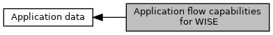

[Macros](#define-members)

Contents of <a href="group___d_e_f___c_o_n_f___a_p_p_l_i.md#a2ecdf1dde8e274003bee99e35551f0e8">EMV_CTLS_APPLIDATA_WK_STRUCT::AppFlowCap_DFAB31</a>. [More\...](#details)

Collaboration diagram for Application flow capabilities for WISE:

|  |  |
|----|----|
| Macros |  |
| #define  | [EMV_CTLS_FLOW_WK_STATUS_CHECK_ENABLE_0](#gae6f27f493540ac95df5a8cf0f842c3ff)   0x01 |
|   | B1b1: Enable status check for one single unit of currency (one major currency unit, e.g. 1€ is going online for status check). If TTQ \'online capable reader\' is not set, \'Contactless Application Not Allowed\' indicator will be set. [More\...](#gae6f27f493540ac95df5a8cf0f842c3ff)  |
| #define  | [EMV_CTLS_FLOW_WK_ZERO_CHECK_ENABLE_SKIP_0](#ga47d451040e4be79320ac9bd8e944633e)   0x02 |
|   | B1b2: Enable zero check for zero amount transaction, Option 2: Set \'Contactless Application Not Allowed\' indicator. [More\...](#ga47d451040e4be79320ac9bd8e944633e)  |
| #define  | [EMV_CTLS_FLOW_WK_ZERO_CHECK_ENABLE_ONLINE_0](#ga71fb8b15e809f34a1e915651081c8c51)   0x04 |
|   | B1b3: Enable zero check for zero amount transaction, Option 1: Set TTQ \'Online cryptogram required\', only possible if TTQ \'online capable reader\' is set, otherwise \'Contactless Application Not Allowed\' indicator is set. [More\...](#ga71fb8b15e809f34a1e915651081c8c51)  |
| #define  | [EMV_CTLS_FLOW_WK_NO_CDCVM](#ga6e19926fb239545ae1bd04ae2fd9baa3)   0x08 |
|   | B1b4: Do not set TTQ B3b7. [More\...](#ga6e19926fb239545ae1bd04ae2fd9baa3)  |

## DetailedDescription {#detailed-description}

Contents of <a href="group___d_e_f___c_o_n_f___a_p_p_l_i.md#a2ecdf1dde8e274003bee99e35551f0e8">EMV_CTLS_APPLIDATA_WK_STRUCT::AppFlowCap_DFAB31</a>.

## MacroDefinition Documentation {#macro-definition-documentation}

## EMV_CTLS_FLOW_WK_NO_CDCVM 

#define EMV_CTLS_FLOW_WK_NO_CDCVM   0x08

B1b4: Do not set TTQ B3b7.

## EMV_CTLS_FLOW_WK_STATUS_CHECK_ENABLE_0 

#define EMV_CTLS_FLOW_WK_STATUS_CHECK_ENABLE_0   0x01

B1b1: Enable status check for one single unit of currency (one major currency unit, e.g. 1€ is going online for status check). If TTQ \'online capable reader\' is not set, \'Contactless Application Not Allowed\' indicator will be set.

## EMV_CTLS_FLOW_WK_ZERO_CHECK_ENABLE_ONLINE_0 

#define EMV_CTLS_FLOW_WK_ZERO_CHECK_ENABLE_ONLINE_0   0x04

B1b3: Enable zero check for zero amount transaction, Option 1: Set TTQ \'Online cryptogram required\', only possible if TTQ \'online capable reader\' is set, otherwise \'Contactless Application Not Allowed\' indicator is set.

## EMV_CTLS_FLOW_WK_ZERO_CHECK_ENABLE_SKIP_0 

#define EMV_CTLS_FLOW_WK_ZERO_CHECK_ENABLE_SKIP_0   0x02

B1b2: Enable zero check for zero amount transaction, Option 2: Set \'Contactless Application Not Allowed\' indicator.
