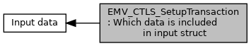

[Macros](#define-members)

Contents of the input in <a href="group___d_e_f___f_l_o_w___i_n_p_u_t.md#ae71321d54e0269c970e1551e1524d8dc">EMV_CTLS_START_STRUCT::Info_Included_Data</a>, <a href="group___f_u_n_c___f_l_o_w.md#ga1a86c76dcf8fec6e97ead6cf8f2717ff">EMV_CTLS_SetupTransaction()</a> [More\...](#details)

Collaboration diagram for EMV_CTLS_SetupTransaction: Which data is included in input struct:

|  |  |
|----|----|
| Macros |  |
| #define  | [INPUT_CTLS_SEL_AMOUNT](#ga03e228eca250292d8d4afd50e33d9ec2)   0x01 |
|   | B1b1: <a href="group___d_e_f___f_l_o_w___i_n_p_u_t.md#a30d37bb81b40a6e53cb3081ee862ddef">EMV_CTLS_PAYMENT_STRUCT::Amount</a>. [More\...](#ga03e228eca250292d8d4afd50e33d9ec2)  |
| #define  | [INPUT_CTLS_SEL_AMOUNT_CURRENCY](#ga1334b1300ae97d06cb7614458a46a557)   0x02 |
|   | B1b2: <a href="group___d_e_f___f_l_o_w___i_n_p_u_t.md#ae1f191741d0c4b9351e7f52d69b20d73">EMV_CTLS_PAYMENT_STRUCT::CurrencyTrans</a>. [More\...](#ga1334b1300ae97d06cb7614458a46a557)  |
| #define  | [INPUT_CTLS_SEL_CUREXPONENT](#ga8ab05b4a7a00e8b9b138f06b72c41e3f)   0x04 |
|   | B1b3: <a href="group___d_e_f___f_l_o_w___i_n_p_u_t.md#aaa3e0774e163e148c88b989c3ada3b76">EMV_CTLS_PAYMENT_STRUCT::ExpTrans</a>. [More\...](#ga8ab05b4a7a00e8b9b138f06b72c41e3f)  |
| #define  | [INPUT_CTLS_SEL_DATE](#ga0f1d29eec953402e5bd3486c0382a180)   0x08 |
|   | B1b4: <a href="group___d_e_f___f_l_o_w___i_n_p_u_t.md#a775d3e156bcce4f815658cbaca54de4f">EMV_CTLS_PAYMENT_STRUCT::Date</a>. [More\...](#ga0f1d29eec953402e5bd3486c0382a180)  |
| #define  | [INPUT_CTLS_SEL_TIME](#gacf25f2235762af7411ed27bd26a75c85)   0x10 |
|   | B1b5: <a href="group___d_e_f___f_l_o_w___i_n_p_u_t.md#ab2e402d904a352a99a517cf77ed2d875">EMV_CTLS_PAYMENT_STRUCT::Time</a>. [More\...](#gacf25f2235762af7411ed27bd26a75c85)  |
| #define  | [INPUT_CTLS_SEL_TTYPE](#gad98b07f76b93265cf7e37cccb79f441a)   0x20 |
|   | B1b6: <a href="group___d_e_f___f_l_o_w___i_n_p_u_t.md#ae9357fb5fbb42943ac347ea3b2cd4d6a">EMV_CTLS_START_STRUCT::TransType</a>. [More\...](#gad98b07f76b93265cf7e37cccb79f441a)  |
| #define  | [INPUT_CTLS_SEL_EXCLUDE_AID](#ga1f0176f4b846c18f86dc92cdf75987d2)   0x40 |
|   | B1b7: <a href="group___d_e_f___f_l_o_w___i_n_p_u_t.md#a8c1843ea36091b75459472cb4077e61e">EMV_CTLS_APPS_SELECT_STRUCT::ExcludeEmvAIDs</a>. [More\...](#ga1f0176f4b846c18f86dc92cdf75987d2)  |
| #define  | [INPUT_CTLS_SEL_FORCE_ONLINE](#ga221f70b3d5edea032b8edc8913eb18c5)   0x80 |
|   | B1b8: <a href="group___d_e_f___f_l_o_w___i_n_p_u_t.md#ac9379ba99fde04b446f004946e00cb7f">EMV_CTLS_PAYMENT_STRUCT::Force_Online</a>. [More\...](#ga221f70b3d5edea032b8edc8913eb18c5)  |
| #define  | [INPUT_CTLS_SEL_ONLINE_SWITCH](#gae14d171fc9cf8bbf726c1708bfb5b69b)   0x01 |
|   | B2b1: <a href="group___d_e_f___f_l_o_w___i_n_p_u_t.md#a21582d26b3baf84a6bf36e1597415195">EMV_CTLS_PAYMENT_STRUCT::Online_Switch</a>. [More\...](#gae14d171fc9cf8bbf726c1708bfb5b69b)  |
| #define  | [INPUT_CTLS_SEL_TXN_COUNTER](#ga7a9b26e72b49587314a709029b743e11)   0x02 |
|   | B2b2: <a href="group___d_e_f___f_l_o_w___i_n_p_u_t.md#abe3243bfe7a5470e7218711c199bddc7">EMV_CTLS_PAYMENT_STRUCT::TransCount</a>. [More\...](#ga7a9b26e72b49587314a709029b743e11)  |
| #define  | [INPUT_CTLS_SEL_CB_AMOUNT](#gac4e41004d906b9023cc0c7ded7fa4d55)   0x04 |
|   | B2b3: <a href="group___d_e_f___f_l_o_w___i_n_p_u_t.md#aa3226314fccbb9ce083892654db4c0a4">EMV_CTLS_PAYMENT_STRUCT::Cashback_Amount</a>. [More\...](#gac4e41004d906b9023cc0c7ded7fa4d55)  |
| #define  | [INPUT_CTLS_SEL_ACCOUNT_TYPE](#gad5864558e809d9eeca701fa04e1e376f)   0x08 |
|   | B2b4: <a href="group___d_e_f___f_l_o_w___i_n_p_u_t.md#a720e112c31478ed6c1a4ed18cb16db2f">EMV_CTLS_PAYMENT_STRUCT::uc_AccountType</a>. [More\...](#gad5864558e809d9eeca701fa04e1e376f)  |
| #define  | [INPUT_CTLS_SEL_TXN_OPTIONS](#ga179e2ff45996d6666a9496127a048e61)   0x10 |
|   | B2b5: <a href="group___d_e_f___f_l_o_w___i_n_p_u_t.md#ac9ddf19e79cf70f6331fdb822fdf1d4f">EMV_CTLS_START_STRUCT::TxnOptions</a>. [More\...](#ga179e2ff45996d6666a9496127a048e61)  |
| #define  | [INPUT_CTLS_SEL_POLL_TIMEOUT](#ga999621dc1f21810ac063f1d1b685f492)   0x20 |
|   | B2b6: <a href="group___d_e_f___f_l_o_w___i_n_p_u_t.md#a55288d912bcb810932a421b632af84aa">EMV_CTLS_START_STRUCT::ServerPollTimeout</a>. [More\...](#ga999621dc1f21810ac063f1d1b685f492)  |
| #define  | [INPUT_CTLS_SEL_PASSTHROUGH](#ga9c309537d5cceb5212314bb3d59d57c7)   0x40 |
|   | B2b7: <a href="group___d_e_f___f_l_o_w___i_n_p_u_t.md#a6e4c160c32a77b556aa14495cc0961c5">EMV_CTLS_START_STRUCT::passthroughCardTypes</a>. [More\...](#ga9c309537d5cceb5212314bb3d59d57c7)  |
| #define  | [INPUT_CTLS_SEL_ADD_TAGS](#gac99efe99749cc6bbc08b6212c8c1e80d)   0x80 |
|   | B2b8: [More\...](#gac99efe99749cc6bbc08b6212c8c1e80d)  |
| #define  | [INPUT_CTLS_SEL_EXCLUDE_COMBO](#gae446dac0e58f2aa46c67465f5672a250)   0x01 |
|   | B3b1: <a href="group___d_e_f___f_l_o_w___i_n_p_u_t.md#ad87415ec2bcc2e988462d432a46f8065">EMV_CTLS_APPS_SELECT_STRUCT::ExcludeCombos</a>. [More\...](#gae446dac0e58f2aa46c67465f5672a250)  |
| #define  | [INPUT_SEL_AMOUNT](#ga4be577369c3fc99b0b161b161b5d314a)   0x01 |
|   | B1b1: `txn` amount, <a href="group___a_d_k___t_r_x___e_x_e_c.md#a30d37bb81b40a6e53cb3081ee862ddef">EMV_CT_PAYMENT_STRUCT::Amount</a>. [More\...](#ga4be577369c3fc99b0b161b161b5d314a)  |
| #define  | [INPUT_SEL_AMOUNT_CURRENCY](#gaceeb44913d0adc4134207b7c748efee3)   0x02 |
|   | B1b2: `currency` of txn, <a href="group___a_d_k___t_r_x___e_x_e_c.md#ae1f191741d0c4b9351e7f52d69b20d73">EMV_CT_PAYMENT_STRUCT::CurrencyTrans</a>. [More\...](#gaceeb44913d0adc4134207b7c748efee3)  |
| #define  | [INPUT_SEL_CUREXPONENT](#ga5a6e5c8d88db13eed8757d13d0f47668)   0x04 |
|   | B1b3: `currency` exponent of txn, <a href="group___a_d_k___t_r_x___e_x_e_c.md#aaa3e0774e163e148c88b989c3ada3b76">EMV_CT_PAYMENT_STRUCT::ExpTrans</a>. [More\...](#ga5a6e5c8d88db13eed8757d13d0f47668)  |
| #define  | [INPUT_SEL_DATE](#gacab8dafc7b1a7bb94a7f72af368ad641)   0x08 |
|   | B1b4: `date` of txn, <a href="group___a_d_k___t_r_x___e_x_e_c.md#a775d3e156bcce4f815658cbaca54de4f">EMV_CT_PAYMENT_STRUCT::Date</a>. [More\...](#gacab8dafc7b1a7bb94a7f72af368ad641)  |
| #define  | [INPUT_SEL_TIME](#gafb1affe1e305682c7c7e0b9622b95bcb)   0x10 |
|   | B1b5: `time` of txn, <a href="group___a_d_k___t_r_x___e_x_e_c.md#ab2e402d904a352a99a517cf77ed2d875">EMV_CT_PAYMENT_STRUCT::Time</a>. [More\...](#gafb1affe1e305682c7c7e0b9622b95bcb)  |
| #define  | [INPUT_SEL_TTYPE](#ga99ca24bdbf2b6eafc3fa398d9d5d2dc5)   0x20 |
|   | B1b6: `transaction` type of txn, <a href="group___a_d_k___t_r_x___e_x_e_c.md#ae9357fb5fbb42943ac347ea3b2cd4d6a">EMV_CT_SELECT_STRUCT::TransType</a>. [More\...](#ga99ca24bdbf2b6eafc3fa398d9d5d2dc5)  |
| #define  | [INPUT_SEL_EXCLUDE_AID](#ga32781e03116bb3073016e044d77f829f)   0x40 |
|   | B1b7: `AIDs` to exclude for this transaction, <a href="group___a_d_k___t_r_x___e_x_e_c.md#a58e0122d8211771ecfc3b84680d7992d">EMV_CT_APPS_SELECT_STRUCT::ExcludeEmvAIDs</a>. [More\...](#ga32781e03116bb3073016e044d77f829f)  |
| #define  | [INPUT_SEL_BUILDLIST](#ga049debda9849fcee50b8f56594b671d6)   0x80 |
|   | B1b8: `build` the candidate list or not, <a href="group___a_d_k___t_r_x___e_x_e_c.md#a50ed6530cd7bb4e149f0068a07c65dc5">EMV_CT_SELECT_STRUCT::InitTXN_Buildlist</a>. [More\...](#ga049debda9849fcee50b8f56594b671d6)  |
| #define  | [INPUT_SEL_FORCE_ONLINE](#gabd0c6f1cd8caf927fdb0f26a1a80251c)   0x01 |
|   | B2b1: `force` it online (suspicious, EMVCo), <a href="group___a_d_k___t_r_x___e_x_e_c.md#ac9379ba99fde04b446f004946e00cb7f">EMV_CT_PAYMENT_STRUCT::Force_Online</a>. [More\...](#gabd0c6f1cd8caf927fdb0f26a1a80251c)  |
| #define  | [INPUT_SEL_FORCE_ACCEPT](#ga8b24499fd2984a2cf9ffead4735882e9)   0x02 |
|   | B2b2: `force` acceptance, <a href="group___a_d_k___t_r_x___e_x_e_c.md#a9d831c8180100292e2f5e0f198eb3197">EMV_CT_PAYMENT_STRUCT::Force_Acceptance</a>. [More\...](#ga8b24499fd2984a2cf9ffead4735882e9)  |
| #define  | [INPUT_SEL_NO_PSE](#ga9fa58b794bb2b9ee976eb3065327f3b1)   0x04 |
|   | B2b3: `no` PSE, <a href="group___a_d_k___t_r_x___e_x_e_c.md#a33fba9827a2b69f4b5db6f8e10843acb">EMV_CT_APPS_SELECT_STRUCT::No_DirectorySelect</a>. [More\...](#ga9fa58b794bb2b9ee976eb3065327f3b1)  |
| #define  | [INPUT_SEL_CARDCONF](#gadff110ae2c5c2ae96f434f99e29ec0d5)   0x08 |
|   | B2b4: `cardholder` confirmation, <a href="group___a_d_k___t_r_x___e_x_e_c.md#a8718e6f6b475c9e4b2bbbe8030e0ee6f">EMV_CT_APPS_SELECT_STRUCT::ucCardholderConfirmation</a>. [More\...](#gadff110ae2c5c2ae96f434f99e29ec0d5)  |
| #define  | [INPUT_SEL_ONLINE_SWITCH](#gaa8a5326904f538cbe14dba7c282ec708)   0x10 |
|   | B2b5: `force` it online (domestic need), <a href="group___a_d_k___t_r_x___e_x_e_c.md#a21582d26b3baf84a6bf36e1597415195">EMV_CT_PAYMENT_STRUCT::Online_Switch</a>. [More\...](#gaa8a5326904f538cbe14dba7c282ec708)  |
| #define  | [INPUT_SEL_TXN_OPTIONS](#gacc38773171d970d4b081a2755b2cdc04)   0x20 |
|   | B2b6: `transaction` options, <a href="group___a_d_k___t_r_x___e_x_e_c.md#ac9ddf19e79cf70f6331fdb822fdf1d4f">EMV_CT_SELECT_STRUCT::TxnOptions</a>. [More\...](#gacc38773171d970d4b081a2755b2cdc04)  |
| #define  | [INPUT_SEL_DOMCHIP](#ga54bbf3121b15a137b11c604536447d10)   0x40 |
|   | B2b7: `domestic` chip apps included, <a href="group___a_d_k___t_r_x___e_x_e_c.md#a7844a2b4a0ea6c994313c5aec4a934a6">EMV_CT_APPS_SELECT_STRUCT::countDomesticChip</a> and <a href="group___a_d_k___t_r_x___e_x_e_c.md#struct_e_m_v___c_t___a_p_p_s___s_e_l_e_c_t___s_t_r_u_c_t">EMV_CT_APPS_SELECT_STRUCT</a>:: xDomestic_Chip. [More\...](#ga54bbf3121b15a137b11c604536447d10)  |
| #define  | [INPUT_SEL_FALLBACK_MSR](#ga62140604780131b6fbcdfa5c21adf936)   0x80 |
|   | B2b8: `fallback` msr apps included, <a href="group___a_d_k___t_r_x___e_x_e_c.md#struct_e_m_v___c_t___a_p_p_s___s_e_l_e_c_t___s_t_r_u_c_t">EMV_CT_APPS_SELECT_STRUCT</a>:: countFallbackMS and <a href="group___a_d_k___t_r_x___e_x_e_c.md#a0ce15f8ce270bd4f01e39c8c8dd5953b">EMV_CT_APPS_SELECT_STRUCT::xFallback_MS</a>. [More\...](#ga62140604780131b6fbcdfa5c21adf936)  |
| #define  | [INPUT_SEL_TXN_COUNTER](#ga0746ea2abb72667a11f8c9aaba4c69c7)   0x01 |
|   | B3b1: `transaction` counter, <a href="group___a_d_k___t_r_x___e_x_e_c.md#abe3243bfe7a5470e7218711c199bddc7">EMV_CT_PAYMENT_STRUCT::TransCount</a>. [More\...](#ga0746ea2abb72667a11f8c9aaba4c69c7)  |
| #define  | [INPUT_SEL_TXN_STEPS](#ga350faef1acac0cfffca3d4938ed7de87)   0x02 |
|   | B3b2: `transaction` steps if interrupt needed instead of 1 step processing, <a href="group___a_d_k___t_r_x___e_x_e_c.md#a07d050602c00dc417b16d40db60c6de4">EMV_CT_SELECT_STRUCT::TxnSteps</a>. [More\...](#ga350faef1acac0cfffca3d4938ed7de87)  |
| #define  | [INPUT_SEL_CB_AMOUNT](#gaa60e8591fa1cede1a8341d7dfb3cb65f)   0x04 |
|   | B3b3: `cashback` amount, <a href="group___a_d_k___t_r_x___e_x_e_c.md#aa3226314fccbb9ce083892654db4c0a4">EMV_CT_PAYMENT_STRUCT::Cashback_Amount</a>. [More\...](#gaa60e8591fa1cede1a8341d7dfb3cb65f)  |
| #define  | [INPUT_SEL_ACCOUNT_TYPE](#gafddbf7477d318c2ba4c603ca5a373518)   0x08 |
|   | B3b4: `account` type, <a href="group___a_d_k___t_r_x___e_x_e_c.md#a720e112c31478ed6c1a4ed18cb16db2f">EMV_CT_PAYMENT_STRUCT::uc_AccountType</a>. [More\...](#gafddbf7477d318c2ba4c603ca5a373518)  |
| #define  | [INPUT_SEL_LANGUAGE](#ga45c04203d94208acb87630f321088264)   0x10 |
|   | B3b5: `language` preselected, <a href="group___a_d_k___t_r_x___e_x_e_c.md#a65d6b236583a3e4c90bef5c7043069a6">EMV_CT_PAYMENT_STRUCT::PreSelected_Language</a>. [More\...](#ga45c04203d94208acb87630f321088264)  |
| #define  | [INPUT_SEL_AMOUNT_CONF](#gad70acaf9db9c7f8e9b7804bd36a399fc)   0x20 |
|   | B3b6: `amount` confirmation, <a href="group___a_d_k___t_r_x___e_x_e_c.md#a0bec90f2919a87c70759a313709d4708">EMV_CT_PAYMENT_STRUCT::uc_AmountConfirmation</a>. [More\...](#gad70acaf9db9c7f8e9b7804bd36a399fc)  |
| #define  | [INPUT_SEL_ADD_TAGS](#ga566db851d45f21e153451cf8d69901a2)   0x40 |
|   | B3b7: [More\...](#ga566db851d45f21e153451cf8d69901a2)  |
| #define  | [INPUT_SEL_MOD_CANDLIST](#ga47a2ff9abed01ed7ef8ae94117498707)   0x80 |
|   | B3b8: `modified` candidate list (only valid in reentrance mode using the candidate list manipulation option <a href="group___t_x_n___s_t_e_p_s.md#ga8936aac92ebd19fa3666653d34d6216f">RETURN_CAND_LIST_PREPROC</a>) [More\...](#ga47a2ff9abed01ed7ef8ae94117498707)  |

## DetailedDescription {#detailed-description}

Contents of the input in <a href="group___d_e_f___f_l_o_w___i_n_p_u_t.md#ae71321d54e0269c970e1551e1524d8dc">EMV_CTLS_START_STRUCT::Info_Included_Data</a>, <a href="group___f_u_n_c___f_l_o_w.md#ga1a86c76dcf8fec6e97ead6cf8f2717ff">EMV_CTLS_SetupTransaction()</a>

Contents of <a href="group___a_d_k___t_r_x___e_x_e_c.md#ae71321d54e0269c970e1551e1524d8dc">EMV_CT_SELECT_STRUCT::Info_Included_Data</a>.

## MacroDefinition Documentation {#macro-definition-documentation}

## INPUT_CTLS_SEL_ACCOUNT_TYPE 

#define INPUT_CTLS_SEL_ACCOUNT_TYPE   0x08

B2b4: <a href="group___d_e_f___f_l_o_w___i_n_p_u_t.md#a720e112c31478ed6c1a4ed18cb16db2f">EMV_CTLS_PAYMENT_STRUCT::uc_AccountType</a>.

## INPUT_CTLS_SEL_ADD_TAGS 

#define INPUT_CTLS_SEL_ADD_TAGS   0x80

B2b8:

**<a href="deprecated.md#_deprecated000047">Deprecated:</a>** Don\'t use <a href="group___d_e_f___f_l_o_w___i_n_p_u_t.md#ac99d6e6b09a0e3fcbe4d2ec8336a30e2">EMV_CTLS_PAYMENT_STRUCT::Additional_Result_Tags</a> anymore. Use <a href="group___f_u_n_c___f_l_o_w.md#ga8c9f0640ed818c3dc19da528f5f0b406">EMV_CTLS_fetchTxnTags()</a> instead.

## INPUT_CTLS_SEL_AMOUNT 

#define INPUT_CTLS_SEL_AMOUNT   0x01

B1b1: <a href="group___d_e_f___f_l_o_w___i_n_p_u_t.md#a30d37bb81b40a6e53cb3081ee862ddef">EMV_CTLS_PAYMENT_STRUCT::Amount</a>.

## INPUT_CTLS_SEL_AMOUNT_CURRENCY 

#define INPUT_CTLS_SEL_AMOUNT_CURRENCY   0x02

B1b2: <a href="group___d_e_f___f_l_o_w___i_n_p_u_t.md#ae1f191741d0c4b9351e7f52d69b20d73">EMV_CTLS_PAYMENT_STRUCT::CurrencyTrans</a>.

## INPUT_CTLS_SEL_CB_AMOUNT 

#define INPUT_CTLS_SEL_CB_AMOUNT   0x04

B2b3: <a href="group___d_e_f___f_l_o_w___i_n_p_u_t.md#aa3226314fccbb9ce083892654db4c0a4">EMV_CTLS_PAYMENT_STRUCT::Cashback_Amount</a>.

## INPUT_CTLS_SEL_CUREXPONENT 

#define INPUT_CTLS_SEL_CUREXPONENT   0x04

B1b3: <a href="group___d_e_f___f_l_o_w___i_n_p_u_t.md#aaa3e0774e163e148c88b989c3ada3b76">EMV_CTLS_PAYMENT_STRUCT::ExpTrans</a>.

## INPUT_CTLS_SEL_DATE 

#define INPUT_CTLS_SEL_DATE   0x08

B1b4: <a href="group___d_e_f___f_l_o_w___i_n_p_u_t.md#a775d3e156bcce4f815658cbaca54de4f">EMV_CTLS_PAYMENT_STRUCT::Date</a>.

## INPUT_CTLS_SEL_EXCLUDE_AID 

#define INPUT_CTLS_SEL_EXCLUDE_AID   0x40

B1b7: <a href="group___d_e_f___f_l_o_w___i_n_p_u_t.md#a8c1843ea36091b75459472cb4077e61e">EMV_CTLS_APPS_SELECT_STRUCT::ExcludeEmvAIDs</a>.

## INPUT_CTLS_SEL_EXCLUDE_COMBO 

#define INPUT_CTLS_SEL_EXCLUDE_COMBO   0x01

B3b1: <a href="group___d_e_f___f_l_o_w___i_n_p_u_t.md#ad87415ec2bcc2e988462d432a46f8065">EMV_CTLS_APPS_SELECT_STRUCT::ExcludeCombos</a>.

## INPUT_CTLS_SEL_FORCE_ONLINE 

#define INPUT_CTLS_SEL_FORCE_ONLINE   0x80

B1b8: <a href="group___d_e_f___f_l_o_w___i_n_p_u_t.md#ac9379ba99fde04b446f004946e00cb7f">EMV_CTLS_PAYMENT_STRUCT::Force_Online</a>.

## INPUT_CTLS_SEL_ONLINE_SWITCH 

#define INPUT_CTLS_SEL_ONLINE_SWITCH   0x01

B2b1: <a href="group___d_e_f___f_l_o_w___i_n_p_u_t.md#a21582d26b3baf84a6bf36e1597415195">EMV_CTLS_PAYMENT_STRUCT::Online_Switch</a>.

## INPUT_CTLS_SEL_PASSTHROUGH 

#define INPUT_CTLS_SEL_PASSTHROUGH   0x40

B2b7: <a href="group___d_e_f___f_l_o_w___i_n_p_u_t.md#a6e4c160c32a77b556aa14495cc0961c5">EMV_CTLS_START_STRUCT::passthroughCardTypes</a>.

## INPUT_CTLS_SEL_POLL_TIMEOUT 

#define INPUT_CTLS_SEL_POLL_TIMEOUT   0x20

B2b6: <a href="group___d_e_f___f_l_o_w___i_n_p_u_t.md#a55288d912bcb810932a421b632af84aa">EMV_CTLS_START_STRUCT::ServerPollTimeout</a>.

## INPUT_CTLS_SEL_TIME 

#define INPUT_CTLS_SEL_TIME   0x10

B1b5: <a href="group___d_e_f___f_l_o_w___i_n_p_u_t.md#ab2e402d904a352a99a517cf77ed2d875">EMV_CTLS_PAYMENT_STRUCT::Time</a>.

## INPUT_CTLS_SEL_TTYPE 

#define INPUT_CTLS_SEL_TTYPE   0x20

B1b6: <a href="group___d_e_f___f_l_o_w___i_n_p_u_t.md#ae9357fb5fbb42943ac347ea3b2cd4d6a">EMV_CTLS_START_STRUCT::TransType</a>.

## INPUT_CTLS_SEL_TXN_COUNTER 

#define INPUT_CTLS_SEL_TXN_COUNTER   0x02

B2b2: <a href="group___d_e_f___f_l_o_w___i_n_p_u_t.md#abe3243bfe7a5470e7218711c199bddc7">EMV_CTLS_PAYMENT_STRUCT::TransCount</a>.

## INPUT_CTLS_SEL_TXN_OPTIONS 

#define INPUT_CTLS_SEL_TXN_OPTIONS   0x10

B2b5: <a href="group___d_e_f___f_l_o_w___i_n_p_u_t.md#ac9ddf19e79cf70f6331fdb822fdf1d4f">EMV_CTLS_START_STRUCT::TxnOptions</a>.

## INPUT_SEL_ACCOUNT_TYPE 

#define INPUT_SEL_ACCOUNT_TYPE   0x08

B3b4: `account` type, <a href="group___a_d_k___t_r_x___e_x_e_c.md#a720e112c31478ed6c1a4ed18cb16db2f">EMV_CT_PAYMENT_STRUCT::uc_AccountType</a>.

## INPUT_SEL_ADD_TAGS 

#define INPUT_SEL_ADD_TAGS   0x40

B3b7:

**<a href="deprecated.md#_deprecated000143">Deprecated:</a>** Don\'t use <a href="group___a_d_k___t_r_x___e_x_e_c.md#abd31d434ee96e0662b86d4ef82017e33">EMV_CT_PAYMENT_STRUCT::Additional_Result_Tags</a> anymore. Use <a href="group___f_u_n_c___f_l_o_w.md#gab005fdec183a0c8fef18ae677cce6dc5">EMV_CT_fetchTxnTags()</a> instead.

## INPUT_SEL_AMOUNT 

#define INPUT_SEL_AMOUNT   0x01

B1b1: `txn` amount, <a href="group___a_d_k___t_r_x___e_x_e_c.md#a30d37bb81b40a6e53cb3081ee862ddef">EMV_CT_PAYMENT_STRUCT::Amount</a>.

## INPUT_SEL_AMOUNT_CONF 

#define INPUT_SEL_AMOUNT_CONF   0x20

B3b6: `amount` confirmation, <a href="group___a_d_k___t_r_x___e_x_e_c.md#a0bec90f2919a87c70759a313709d4708">EMV_CT_PAYMENT_STRUCT::uc_AmountConfirmation</a>.

## INPUT_SEL_AMOUNT_CURRENCY 

#define INPUT_SEL_AMOUNT_CURRENCY   0x02

B1b2: `currency` of txn, <a href="group___a_d_k___t_r_x___e_x_e_c.md#ae1f191741d0c4b9351e7f52d69b20d73">EMV_CT_PAYMENT_STRUCT::CurrencyTrans</a>.

## INPUT_SEL_BUILDLIST 

#define INPUT_SEL_BUILDLIST   0x80

B1b8: `build` the candidate list or not, <a href="group___a_d_k___t_r_x___e_x_e_c.md#a50ed6530cd7bb4e149f0068a07c65dc5">EMV_CT_SELECT_STRUCT::InitTXN_Buildlist</a>.

## INPUT_SEL_CARDCONF 

#define INPUT_SEL_CARDCONF   0x08

B2b4: `cardholder` confirmation, <a href="group___a_d_k___t_r_x___e_x_e_c.md#a8718e6f6b475c9e4b2bbbe8030e0ee6f">EMV_CT_APPS_SELECT_STRUCT::ucCardholderConfirmation</a>.

## INPUT_SEL_CB_AMOUNT 

#define INPUT_SEL_CB_AMOUNT   0x04

B3b3: `cashback` amount, <a href="group___a_d_k___t_r_x___e_x_e_c.md#aa3226314fccbb9ce083892654db4c0a4">EMV_CT_PAYMENT_STRUCT::Cashback_Amount</a>.

## INPUT_SEL_CUREXPONENT 

#define INPUT_SEL_CUREXPONENT   0x04

B1b3: `currency` exponent of txn, <a href="group___a_d_k___t_r_x___e_x_e_c.md#aaa3e0774e163e148c88b989c3ada3b76">EMV_CT_PAYMENT_STRUCT::ExpTrans</a>.

## INPUT_SEL_DATE 

#define INPUT_SEL_DATE   0x08

B1b4: `date` of txn, <a href="group___a_d_k___t_r_x___e_x_e_c.md#a775d3e156bcce4f815658cbaca54de4f">EMV_CT_PAYMENT_STRUCT::Date</a>.

## INPUT_SEL_DOMCHIP 

#define INPUT_SEL_DOMCHIP   0x40

B2b7: `domestic` chip apps included, <a href="group___a_d_k___t_r_x___e_x_e_c.md#a7844a2b4a0ea6c994313c5aec4a934a6">EMV_CT_APPS_SELECT_STRUCT::countDomesticChip</a> and <a href="group___a_d_k___t_r_x___e_x_e_c.md#struct_e_m_v___c_t___a_p_p_s___s_e_l_e_c_t___s_t_r_u_c_t">EMV_CT_APPS_SELECT_STRUCT</a>:: xDomestic_Chip.

## INPUT_SEL_EXCLUDE_AID 

#define INPUT_SEL_EXCLUDE_AID   0x40

B1b7: `AIDs` to exclude for this transaction, <a href="group___a_d_k___t_r_x___e_x_e_c.md#a58e0122d8211771ecfc3b84680d7992d">EMV_CT_APPS_SELECT_STRUCT::ExcludeEmvAIDs</a>.

## INPUT_SEL_FALLBACK_MSR 

#define INPUT_SEL_FALLBACK_MSR   0x80

B2b8: `fallback` msr apps included, <a href="group___a_d_k___t_r_x___e_x_e_c.md#struct_e_m_v___c_t___a_p_p_s___s_e_l_e_c_t___s_t_r_u_c_t">EMV_CT_APPS_SELECT_STRUCT</a>:: countFallbackMS and <a href="group___a_d_k___t_r_x___e_x_e_c.md#a0ce15f8ce270bd4f01e39c8c8dd5953b">EMV_CT_APPS_SELECT_STRUCT::xFallback_MS</a>.

## INPUT_SEL_FORCE_ACCEPT 

#define INPUT_SEL_FORCE_ACCEPT   0x02

B2b2: `force` acceptance, <a href="group___a_d_k___t_r_x___e_x_e_c.md#a9d831c8180100292e2f5e0f198eb3197">EMV_CT_PAYMENT_STRUCT::Force_Acceptance</a>.

## INPUT_SEL_FORCE_ONLINE 

#define INPUT_SEL_FORCE_ONLINE   0x01

B2b1: `force` it online (suspicious, EMVCo), <a href="group___a_d_k___t_r_x___e_x_e_c.md#ac9379ba99fde04b446f004946e00cb7f">EMV_CT_PAYMENT_STRUCT::Force_Online</a>.

## INPUT_SEL_LANGUAGE 

#define INPUT_SEL_LANGUAGE   0x10

B3b5: `language` preselected, <a href="group___a_d_k___t_r_x___e_x_e_c.md#a65d6b236583a3e4c90bef5c7043069a6">EMV_CT_PAYMENT_STRUCT::PreSelected_Language</a>.

## INPUT_SEL_MOD_CANDLIST 

#define INPUT_SEL_MOD_CANDLIST   0x80

B3b8: `modified` candidate list (only valid in reentrance mode using the candidate list manipulation option <a href="group___t_x_n___s_t_e_p_s.md#ga8936aac92ebd19fa3666653d34d6216f">RETURN_CAND_LIST_PREPROC</a>)

## INPUT_SEL_NO_PSE 

#define INPUT_SEL_NO_PSE   0x04

B2b3: `no` PSE, <a href="group___a_d_k___t_r_x___e_x_e_c.md#a33fba9827a2b69f4b5db6f8e10843acb">EMV_CT_APPS_SELECT_STRUCT::No_DirectorySelect</a>.

## INPUT_SEL_ONLINE_SWITCH 

#define INPUT_SEL_ONLINE_SWITCH   0x10

B2b5: `force` it online (domestic need), <a href="group___a_d_k___t_r_x___e_x_e_c.md#a21582d26b3baf84a6bf36e1597415195">EMV_CT_PAYMENT_STRUCT::Online_Switch</a>.

## INPUT_SEL_TIME 

#define INPUT_SEL_TIME   0x10

B1b5: `time` of txn, <a href="group___a_d_k___t_r_x___e_x_e_c.md#ab2e402d904a352a99a517cf77ed2d875">EMV_CT_PAYMENT_STRUCT::Time</a>.

## INPUT_SEL_TTYPE 

#define INPUT_SEL_TTYPE   0x20

B1b6: `transaction` type of txn, <a href="group___a_d_k___t_r_x___e_x_e_c.md#ae9357fb5fbb42943ac347ea3b2cd4d6a">EMV_CT_SELECT_STRUCT::TransType</a>.

## INPUT_SEL_TXN_COUNTER 

#define INPUT_SEL_TXN_COUNTER   0x01

B3b1: `transaction` counter, <a href="group___a_d_k___t_r_x___e_x_e_c.md#abe3243bfe7a5470e7218711c199bddc7">EMV_CT_PAYMENT_STRUCT::TransCount</a>.

## INPUT_SEL_TXN_OPTIONS 

#define INPUT_SEL_TXN_OPTIONS   0x20

B2b6: `transaction` options, <a href="group___a_d_k___t_r_x___e_x_e_c.md#ac9ddf19e79cf70f6331fdb822fdf1d4f">EMV_CT_SELECT_STRUCT::TxnOptions</a>.

## INPUT_SEL_TXN_STEPS 

#define INPUT_SEL_TXN_STEPS   0x02

B3b2: `transaction` steps if interrupt needed instead of 1 step processing, <a href="group___a_d_k___t_r_x___e_x_e_c.md#a07d050602c00dc417b16d40db60c6de4">EMV_CT_SELECT_STRUCT::TxnSteps</a>.
