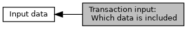

[Macros](#define-members)

Contents of <a href="group___a_d_k___t_r_x___e_x_e_c.md#ae71321d54e0269c970e1551e1524d8dc">EMV_CT_TRANSAC_TYPE::Info_Included_Data</a>. [More\...](#details)

Collaboration diagram for Transaction input: Which data is included:

|  |  |
|----|----|
| Macros |  |
| #define  | [INPUT_OFL_TXN_COUNTER](#gace86d326747fe03587db12ceb0f3e188)   0x01 |
|   | B1b1: transaction counter, <a href="group___a_d_k___t_r_x___e_x_e_c.md#abe3243bfe7a5470e7218711c199bddc7">EMV_CT_PAYMENT_STRUCT::TransCount</a>. [More\...](#gace86d326747fe03587db12ceb0f3e188)  |
| #define  | [INPUT_OFL_ADD_TAGS](#gae610bdfcda33c7ecd70b90cfa166affd)   0x02 |
|   | B1b2: [More\...](#gae610bdfcda33c7ecd70b90cfa166affd)  |
| #define  | [INPUT_OFL_CB_AMOUNT](#gacafaeeff52bbad962e082a79b32333b4)   0x04 |
|   | B1b3: cashback amount, <a href="group___a_d_k___t_r_x___e_x_e_c.md#aa3226314fccbb9ce083892654db4c0a4">EMV_CT_PAYMENT_STRUCT::Cashback_Amount</a>. [More\...](#gacafaeeff52bbad962e082a79b32333b4)  |
| #define  | [INPUT_OFL_ACCOUNT_TYPE](#gac14b07cb292c195bbfc63ff267e8659a)   0x08 |
|   | B1b4: account type, <a href="group___a_d_k___t_r_x___e_x_e_c.md#a720e112c31478ed6c1a4ed18cb16db2f">EMV_CT_PAYMENT_STRUCT::uc_AccountType</a>. [More\...](#gac14b07cb292c195bbfc63ff267e8659a)  |
| #define  | [INPUT_OFL_LANGUAGE](#ga66c501cd412aef1787c0151c851720b6)   0x10 |
|   | B1b5: language preselected, <a href="group___a_d_k___t_r_x___e_x_e_c.md#a65d6b236583a3e4c90bef5c7043069a6">EMV_CT_PAYMENT_STRUCT::PreSelected_Language</a>. [More\...](#ga66c501cd412aef1787c0151c851720b6)  |
| #define  | [INPUT_OFL_AMOUNT_CONF](#gac2fa1972e352ab402c72f04050401660)   0x20 |
|   | B1b6: amount confirmation, <a href="group___a_d_k___t_r_x___e_x_e_c.md#a0bec90f2919a87c70759a313709d4708">EMV_CT_PAYMENT_STRUCT::uc_AmountConfirmation</a>. [More\...](#gac2fa1972e352ab402c72f04050401660)  |
| #define  | [INPUT_OFL_TXN_OPTIONS](#ga09b7a235f230898129dea06903d18416)   0x40 |
|   | B1b7: transaction options, <a href="group___a_d_k___t_r_x___e_x_e_c.md#ac9ddf19e79cf70f6331fdb822fdf1d4f">EMV_CT_TRANSAC_STRUCT::TxnOptions</a>. [More\...](#ga09b7a235f230898129dea06903d18416)  |
| #define  | [INPUT_OFL_TXN_STEPS](#ga75ef405b76b3decc6676c8f7c3f6c85d)   0x80 |
|   | B1b8: transaction steps if interrupt needed instead of 1 step processing, <a href="group___a_d_k___t_r_x___e_x_e_c.md#a07d050602c00dc417b16d40db60c6de4">EMV_CT_TRANSAC_STRUCT::TxnSteps</a>. [More\...](#ga75ef405b76b3decc6676c8f7c3f6c85d)  |
| #define  | [INPUT_OFL_AMOUNT](#gaf0ada32e4102eb4facbf159e4b3f0aba)   0x01 |
|   | B2b1: txn amount, <a href="group___a_d_k___t_r_x___e_x_e_c.md#a30d37bb81b40a6e53cb3081ee862ddef">EMV_CT_PAYMENT_STRUCT::Amount</a>. [More\...](#gaf0ada32e4102eb4facbf159e4b3f0aba)  |
| #define  | [INPUT_OFL_AMOUNT_CURRENCY](#ga5125e54ddf8ba905668ae87529bd6626)   0x02 |
|   | B2b2: currency of txn, <a href="group___a_d_k___t_r_x___e_x_e_c.md#ae1f191741d0c4b9351e7f52d69b20d73">EMV_CT_PAYMENT_STRUCT::CurrencyTrans</a>. [More\...](#ga5125e54ddf8ba905668ae87529bd6626)  |
| #define  | [INPUT_OFL_CUREXPONENT](#gae9290cb42cf39578bde6152be6c25ef1)   0x04 |
|   | B2b3: currency exponent of txn, <a href="group___a_d_k___t_r_x___e_x_e_c.md#aaa3e0774e163e148c88b989c3ada3b76">EMV_CT_PAYMENT_STRUCT::ExpTrans</a>. [More\...](#gae9290cb42cf39578bde6152be6c25ef1)  |
| #define  | [INPUT_OFL_DATE](#gaf81492c0273d2a1132c2490fd44ec955)   0x08 |
|   | B2b4: date of txn, <a href="group___a_d_k___t_r_x___e_x_e_c.md#a775d3e156bcce4f815658cbaca54de4f">EMV_CT_PAYMENT_STRUCT::Date</a>. [More\...](#gaf81492c0273d2a1132c2490fd44ec955)  |
| #define  | [INPUT_OFL_TIME](#ga683eca47594e411453e312c309e15a06)   0x10 |
|   | B2b5: time of txn, <a href="group___a_d_k___t_r_x___e_x_e_c.md#ab2e402d904a352a99a517cf77ed2d875">EMV_CT_PAYMENT_STRUCT::Time</a>. [More\...](#ga683eca47594e411453e312c309e15a06)  |
| #define  | [INPUT_OFL_FORCE_ONLINE](#gad89906906f236a4bd8bd1be2c59995f3)   0x20 |
|   | B2b6: force it online (suspicious, EMVCo), <a href="group___a_d_k___t_r_x___e_x_e_c.md#ac9379ba99fde04b446f004946e00cb7f">EMV_CT_PAYMENT_STRUCT::Force_Online</a>. [More\...](#gad89906906f236a4bd8bd1be2c59995f3)  |
| #define  | [INPUT_OFL_FORCE_ACCEPT](#gaebe39aebc949f5e277b3cfa6880815ac)   0x40 |
|   | B2b7: force acceptance, <a href="group___a_d_k___t_r_x___e_x_e_c.md#a9d831c8180100292e2f5e0f198eb3197">EMV_CT_PAYMENT_STRUCT::Force_Acceptance</a>. [More\...](#gaebe39aebc949f5e277b3cfa6880815ac)  |
| #define  | [INPUT_OFL_ONLINE_SWITCH](#ga8d080f2581cfb3b702acc8f7ee222c50)   0x80 |
|   | B2b8: force it online (domestic need), <a href="group___a_d_k___t_r_x___e_x_e_c.md#a21582d26b3baf84a6bf36e1597415195">EMV_CT_PAYMENT_STRUCT::Online_Switch</a>. [More\...](#ga8d080f2581cfb3b702acc8f7ee222c50)  |

## DetailedDescription {#detailed-description}

Contents of <a href="group___a_d_k___t_r_x___e_x_e_c.md#ae71321d54e0269c970e1551e1524d8dc">EMV_CT_TRANSAC_TYPE::Info_Included_Data</a>.

## MacroDefinition Documentation {#macro-definition-documentation}

## INPUT_OFL_ACCOUNT_TYPE 

#define INPUT_OFL_ACCOUNT_TYPE   0x08

B1b4: account type, <a href="group___a_d_k___t_r_x___e_x_e_c.md#a720e112c31478ed6c1a4ed18cb16db2f">EMV_CT_PAYMENT_STRUCT::uc_AccountType</a>.

## INPUT_OFL_ADD_TAGS 

#define INPUT_OFL_ADD_TAGS   0x02

B1b2:

**<a href="deprecated.md#_deprecated000145">Deprecated:</a>** Don\'t use <a href="group___a_d_k___t_r_x___e_x_e_c.md#abd31d434ee96e0662b86d4ef82017e33">EMV_CT_PAYMENT_STRUCT::Additional_Result_Tags</a> anymore. Use <a href="group___f_u_n_c___f_l_o_w.md#gab005fdec183a0c8fef18ae677cce6dc5">EMV_CT_fetchTxnTags()</a> instead.

## INPUT_OFL_AMOUNT 

#define INPUT_OFL_AMOUNT   0x01

B2b1: txn amount, <a href="group___a_d_k___t_r_x___e_x_e_c.md#a30d37bb81b40a6e53cb3081ee862ddef">EMV_CT_PAYMENT_STRUCT::Amount</a>.

## INPUT_OFL_AMOUNT_CONF 

#define INPUT_OFL_AMOUNT_CONF   0x20

B1b6: amount confirmation, <a href="group___a_d_k___t_r_x___e_x_e_c.md#a0bec90f2919a87c70759a313709d4708">EMV_CT_PAYMENT_STRUCT::uc_AmountConfirmation</a>.

## INPUT_OFL_AMOUNT_CURRENCY 

#define INPUT_OFL_AMOUNT_CURRENCY   0x02

B2b2: currency of txn, <a href="group___a_d_k___t_r_x___e_x_e_c.md#ae1f191741d0c4b9351e7f52d69b20d73">EMV_CT_PAYMENT_STRUCT::CurrencyTrans</a>.

## INPUT_OFL_CB_AMOUNT 

#define INPUT_OFL_CB_AMOUNT   0x04

B1b3: cashback amount, <a href="group___a_d_k___t_r_x___e_x_e_c.md#aa3226314fccbb9ce083892654db4c0a4">EMV_CT_PAYMENT_STRUCT::Cashback_Amount</a>.

## INPUT_OFL_CUREXPONENT 

#define INPUT_OFL_CUREXPONENT   0x04

B2b3: currency exponent of txn, <a href="group___a_d_k___t_r_x___e_x_e_c.md#aaa3e0774e163e148c88b989c3ada3b76">EMV_CT_PAYMENT_STRUCT::ExpTrans</a>.

## INPUT_OFL_DATE 

#define INPUT_OFL_DATE   0x08

B2b4: date of txn, <a href="group___a_d_k___t_r_x___e_x_e_c.md#a775d3e156bcce4f815658cbaca54de4f">EMV_CT_PAYMENT_STRUCT::Date</a>.

## INPUT_OFL_FORCE_ACCEPT 

#define INPUT_OFL_FORCE_ACCEPT   0x40

B2b7: force acceptance, <a href="group___a_d_k___t_r_x___e_x_e_c.md#a9d831c8180100292e2f5e0f198eb3197">EMV_CT_PAYMENT_STRUCT::Force_Acceptance</a>.

## INPUT_OFL_FORCE_ONLINE 

#define INPUT_OFL_FORCE_ONLINE   0x20

B2b6: force it online (suspicious, EMVCo), <a href="group___a_d_k___t_r_x___e_x_e_c.md#ac9379ba99fde04b446f004946e00cb7f">EMV_CT_PAYMENT_STRUCT::Force_Online</a>.

## INPUT_OFL_LANGUAGE 

#define INPUT_OFL_LANGUAGE   0x10

B1b5: language preselected, <a href="group___a_d_k___t_r_x___e_x_e_c.md#a65d6b236583a3e4c90bef5c7043069a6">EMV_CT_PAYMENT_STRUCT::PreSelected_Language</a>.

## INPUT_OFL_ONLINE_SWITCH 

#define INPUT_OFL_ONLINE_SWITCH   0x80

B2b8: force it online (domestic need), <a href="group___a_d_k___t_r_x___e_x_e_c.md#a21582d26b3baf84a6bf36e1597415195">EMV_CT_PAYMENT_STRUCT::Online_Switch</a>.

## INPUT_OFL_TIME 

#define INPUT_OFL_TIME   0x10

B2b5: time of txn, <a href="group___a_d_k___t_r_x___e_x_e_c.md#ab2e402d904a352a99a517cf77ed2d875">EMV_CT_PAYMENT_STRUCT::Time</a>.

## INPUT_OFL_TXN_COUNTER 

#define INPUT_OFL_TXN_COUNTER   0x01

B1b1: transaction counter, <a href="group___a_d_k___t_r_x___e_x_e_c.md#abe3243bfe7a5470e7218711c199bddc7">EMV_CT_PAYMENT_STRUCT::TransCount</a>.

## INPUT_OFL_TXN_OPTIONS 

#define INPUT_OFL_TXN_OPTIONS   0x40

B1b7: transaction options, <a href="group___a_d_k___t_r_x___e_x_e_c.md#ac9ddf19e79cf70f6331fdb822fdf1d4f">EMV_CT_TRANSAC_STRUCT::TxnOptions</a>.

## INPUT_OFL_TXN_STEPS 

#define INPUT_OFL_TXN_STEPS   0x80

B1b8: transaction steps if interrupt needed instead of 1 step processing, <a href="group___a_d_k___t_r_x___e_x_e_c.md#a07d050602c00dc417b16d40db60c6de4">EMV_CT_TRANSAC_STRUCT::TxnSteps</a>.
