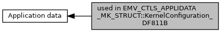

[Macros](#define-members)

Collaboration diagram for used in EMV_CTLS_APPLIDATA_MK_STRUCT::KernelConfiguration_DF811B:

|  |  |
|----|----|
| Macros |  |
| #define  | [EMV_CTLS_MK_CFG_NOMSR](#ga027702d9c8eca66b03552e1b8f19093c)   0x80 |
|   | No MSR Support. [More\...](#ga027702d9c8eca66b03552e1b8f19093c)  |
| #define  | [EMV_CTLS_MK_CFG_NOCHIP](#gab8a245a5a798841f3edbd3e802fca9fc)   0x40 |
|   | No Chip Support. [More\...](#gab8a245a5a798841f3edbd3e802fca9fc)  |
| #define  | [EMV_CTLS_MK_CFG_ONDEVCVM](#gad1c3cdbd18d61ad16002ac4cabe2ff23)   0x20 |
|   | On Device Cardholder Verification Support. [More\...](#gad1c3cdbd18d61ad16002ac4cabe2ff23)  |
| #define  | [EMV_CTLS_MK_CFG_RRP](#gaeca365517c1c2735f391c488d76eacbc)   0x10 |
|   | Relay Resistance Protocal supported. [More\...](#gaeca365517c1c2735f391c488d76eacbc)  |

## DetailedDescription {#detailed-description}

## MacroDefinition Documentation {#macro-definition-documentation}

## EMV_CTLS_MK_CFG_NOCHIP 

#define EMV_CTLS_MK_CFG_NOCHIP   0x40

No Chip Support.

## EMV_CTLS_MK_CFG_NOMSR 

#define EMV_CTLS_MK_CFG_NOMSR   0x80

No MSR Support.

## EMV_CTLS_MK_CFG_ONDEVCVM 

#define EMV_CTLS_MK_CFG_ONDEVCVM   0x20

On Device Cardholder Verification Support.

## EMV_CTLS_MK_CFG_RRP 

#define EMV_CTLS_MK_CFG_RRP   0x10

Relay Resistance Protocal supported.
